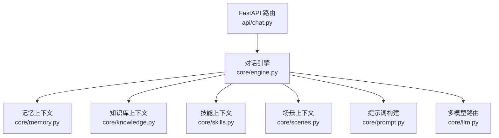
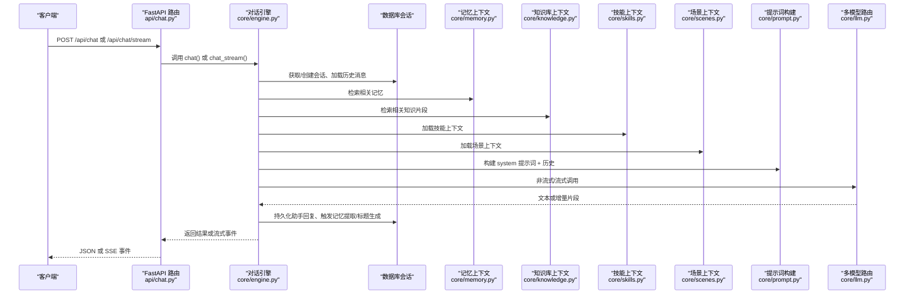
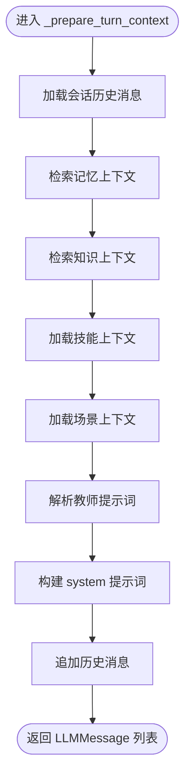
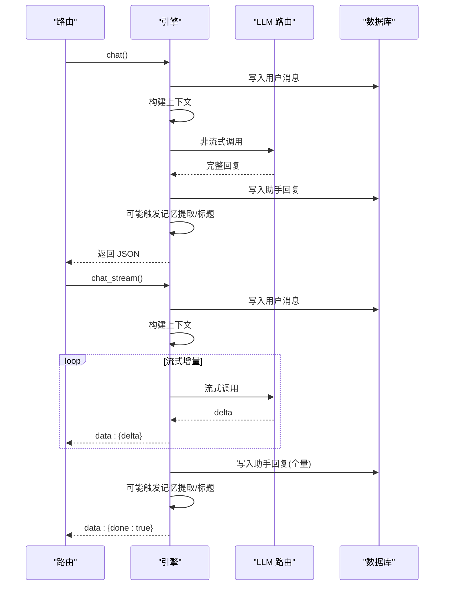
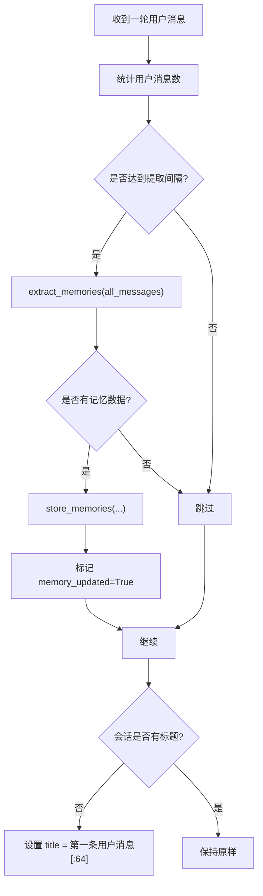
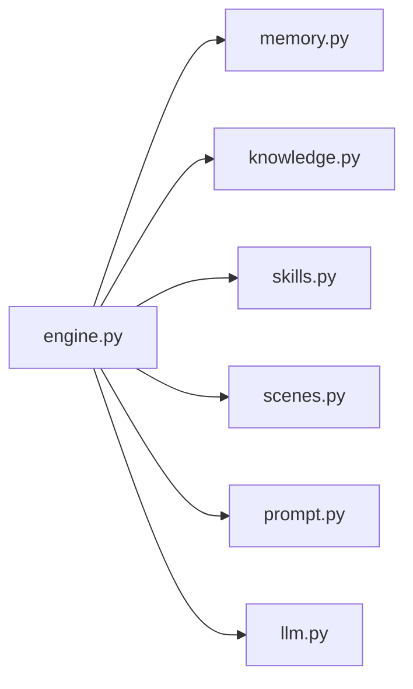

# 对话引擎

<cite>
**本文引用的文件**
- [engine.py](file://hushai/meditation/core/engine.py)
- [chat.py](file://hushai/meditation/api/chat.py)
- [memory.py](file://hushai/meditation/core/memory.py)
- [knowledge.py](file://hushai/meditation/core/knowledge.py)
- [skills.py](file://hushai/meditation/core/skills.py)
- [scenes.py](file://hushai/meditation/core/scenes.py)
- [prompt.py](file://hushai/meditation/core/prompt.py)
- [llm.py](file://hushai/meditation/core/llm.py)
</cite>

## 目录
1. [简介](#简介)
2. [项目结构](#项目结构)
3. [核心组件](#核心组件)
4. [架构总览](#架构总览)
5. [详细组件分析](#详细组件分析)
6. [依赖关系分析](#依赖关系分析)
7. [性能考量](#性能考量)
8. [故障排查指南](#故障排查指南)
9. [结论](#结论)
10. [附录：扩展示例与最佳实践](#附录扩展示例与最佳实践)

## 简介
本技术文档聚焦 hush.ai 的对话引擎，围绕“会话管理、消息持久化、上下文构建、流式响应处理”四大主题展开。重点解析 _prepare_turn_context 如何整合记忆、知识、技能、场景等上下文以生成系统提示词；对比 chat 与 chat_stream 两种调用模式在同步与异步流式处理上的差异；说明会话标题自动生成机制与记忆提取触发策略（每 N 条用户消息）；并提供扩展对话流程、新增上下文来源或处理逻辑的实践建议，同时涵盖错误处理、事务管理与性能优化要点。

## 项目结构
对话引擎位于 meditation 子模块中，核心编排逻辑集中在 engine.py，API 路由在 api/chat.py，上下文来源分别由 memory.py、knowledge.py、skills.py、scenes.py 提供，提示词组装在 prompt.py，LLM 多模型路由与降级在 llm.py。

图表来源
- [chat.py:58-104](file://hushai/meditation/api/chat.py#L58-L104)
- [engine.py:90-127](file://hushai/meditation/core/engine.py#L90-L127)
- [memory.py:161-173](file://hushai/meditation/core/memory.py#L161-L173)
- [knowledge.py:216-224](file://hushai/meditation/core/knowledge.py#L216-L224)
- [skills.py:14-58](file://hushai/meditation/core/skills.py#L14-L58)
- [scenes.py:11-29](file://hushai/meditation/core/scenes.py#L11-L29)
- [prompt.py:77-103](file://hushai/meditation/core/prompt.py#L77-L103)
- [llm.py:136-178](file://hushai/meditation/core/llm.py#L136-L178)

章节来源
- [engine.py:1-387](file://hushai/meditation/core/engine.py#L1-L387)
- [chat.py:1-245](file://hushai/meditation/api/chat.py#L1-L245)

## 核心组件
- 会话与会话消息管理：负责会话的获取/创建、消息加载与持久化。
- 上下文构建器：_prepare_turn_context 聚合记忆、知识、技能、场景与历史，生成 system 提示词与完整消息序列。
- 安全前置检查：在调用 LLM 前进行安全检查，必要时直接返回安全提示并落库。
- 记忆提取与标题生成：按固定间隔触发记忆提取，并在首轮补全会话标题。
- LLM 调用与流式输出：支持非流式与流式两种模式，具备多提供商自动降级能力。

章节来源
- [engine.py:38-89](file://hushai/meditation/core/engine.py#L38-L89)
- [engine.py:90-127](file://hushai/meditation/core/engine.py#L90-L127)
- [engine.py:130-153](file://hushai/meditation/core/engine.py#L130-L153)
- [engine.py:166-236](file://hushai/meditation/core/engine.py#L166-L236)
- [engine.py:238-314](file://hushai/meditation/core/engine.py#L238-L314)
- [llm.py:136-178](file://hushai/meditation/core/llm.py#L136-L178)
- [llm.py:208-257](file://hushai/meditation/core/llm.py#L208-L257)

## 架构总览
下图展示了从 API 到引擎再到各上下文源与 LLM 的端到端交互。

图表来源
- [chat.py:58-104](file://hushai/meditation/api/chat.py#L58-L104)
- [engine.py:166-236](file://hushai/meditation/core/engine.py#L166-L236)
- [engine.py:238-314](file://hushai/meditation/core/engine.py#L238-L314)
- [memory.py:161-173](file://hushai/meditation/core/memory.py#L161-L173)
- [knowledge.py:216-224](file://hushai/meditation/core/knowledge.py#L216-L224)
- [skills.py:14-58](file://hushai/meditation/core/skills.py#L14-L58)
- [scenes.py:11-29](file://hushai/meditation/core/scenes.py#L11-L29)
- [prompt.py:77-103](file://hushai/meditation/core/prompt.py#L77-L103)
- [llm.py:136-178](file://hushai/meditation/core/llm.py#L136-L178)
- [llm.py:208-257](file://hushai/meditation/core/llm.py#L208-L257)

## 详细组件分析

### 上下文构建：_prepare_turn_context
该方法是对话编排的核心，负责将以下上下文整合为完整的 LLM 消息序列：
- 会话历史：加载最近若干轮对话，格式化后注入。
- 记忆上下文：根据当前用户消息检索相关记忆，生成摘要列表。
- 知识上下文：基于向量检索的知识片段，附带来源信息。
- 技能上下文：按 ID 或全局启用状态加载技能内容，限制数量避免过长。
- 场景上下文：根据 scene_id 加载场景提示与开场白参考。
- 教师个性化：若传入 teacher_id，则从 Teacher 表读取 system_prompt 覆盖默认风格。
- 最终通过 build_system_prompt 拼装 system 提示词，再拼接历史消息形成 LLM 输入。

图表来源
- [engine.py:90-127](file://hushai/meditation/core/engine.py#L90-L127)
- [prompt.py:77-103](file://hushai/meditation/core/prompt.py#L77-L103)
- [memory.py:161-173](file://hushai/meditation/core/memory.py#L161-L173)
- [knowledge.py:216-224](file://hushai/meditation/core/knowledge.py#L216-L224)
- [skills.py:14-58](file://hushai/meditation/core/skills.py#L14-L58)
- [scenes.py:11-29](file://hushai/meditation/core/scenes.py#L11-L29)

章节来源
- [engine.py:90-127](file://hushai/meditation/core/engine.py#L90-L127)
- [prompt.py:77-103](file://hushai/meditation/core/prompt.py#L77-L103)

### 同步与流式：chat 与 chat_stream 的差异
- 共同点
  - 均执行会话获取/创建、安全检查、用户消息持久化、上下文构建、LLM 调用、助手消息持久化、记忆提取与标题生成、事务提交。
  - 使用相同的 _prepare_turn_context 与 _maybe_extract_and_title。
- 差异点
  - chat：一次性等待 LLM 完整回复，适合简单请求与批处理。
  - chat_stream：逐块接收 LLM 增量，边收边写前端，提升首字延迟体验；内部收集全量用于落库。
  - 异常路径：两者均在异常时回滚事务；流式在 finally 中确保未提交时回滚。

图表来源
- [engine.py:166-236](file://hushai/meditation/core/engine.py#L166-L236)
- [engine.py:238-314](file://hushai/meditation/core/engine.py#L238-L314)
- [llm.py:136-178](file://hushai/meditation/core/llm.py#L136-L178)
- [llm.py:208-257](file://hushai/meditation/core/llm.py#L208-L257)

章节来源
- [engine.py:166-236](file://hushai/meditation/core/engine.py#L166-L236)
- [engine.py:238-314](file://hushai/meditation/core/engine.py#L238-L314)

### 会话标题自动生成与记忆提取触发策略
- 标题生成：当会话无标题时，取第一条用户消息的前 64 个字符作为标题。
- 记忆提取：每 N 条用户消息触发一次（N=2），调用 extract_memories 并通过 store_memories 持久化，失败仅记录警告不影响主流程。

图表来源
- [engine.py:130-153](file://hushai/meditation/core/engine.py#L130-L153)
- [engine.py:34-35](file://hushai/meditation/core/engine.py#L34-L35)
- [memory.py:45-76](file://hushai/meditation/core/memory.py#L45-L76)
- [memory.py:79-112](file://hushai/meditation/core/memory.py#L79-L112)

章节来源
- [engine.py:130-153](file://hushai/meditation/core/engine.py#L130-L153)
- [engine.py:34-35](file://hushai/meditation/core/engine.py#L34-L35)
- [memory.py:45-76](file://hushai/meditation/core/memory.py#L45-L76)
- [memory.py:79-112](file://hushai/meditation/core/memory.py#L79-L112)

### 安全前置检查与危机处理
- 在调用 LLM 之前执行安全检查，若检测到危机信号，直接构造安全提示并落库，不发送外部模型。
- 流式模式下，安全提示也按字符级增量推送，保证用户体验一致。

章节来源
- [engine.py:166-236](file://hushai/meditation/core/engine.py#L166-L236)
- [engine.py:238-314](file://hushai/meditation/core/engine.py#L238-L314)

### 多模型路由与降级
- 支持多个 LLM 提供商，按优先级顺序尝试，失败自动降级。
- 调试模式下若无 API Key，走 mock 分支，便于本地开发。
- 流式与非流式均实现降级逻辑，流式在失败时抛出异常供上层处理。

章节来源
- [llm.py:136-178](file://hushai/meditation/core/llm.py#L136-L178)
- [llm.py:208-257](file://hushai/meditation/core/llm.py#L208-L257)

## 依赖关系分析
- 低耦合高内聚：engine.py 作为编排层，仅依赖各上下文的接口函数，不关心具体实现细节。
- 明确的职责边界：
  - memory.py：记忆提取、存储、检索与上下文组装。
  - knowledge.py：知识库导入、分块、检索与上下文组装。
  - skills.py：按 ID 或全局加载技能内容。
  - scenes.py：按场景 ID 加载场景提示。
  - prompt.py：统一拼装 system 提示词。
  - llm.py：多模型路由、降级与流式封装。
- 潜在循环依赖：未见明显循环引用，各模块单向依赖 engine 与底层配置/数据库。

图表来源
- [engine.py:90-127](file://hushai/meditation/core/engine.py#L90-L127)
- [memory.py:161-173](file://hushai/meditation/core/memory.py#L161-L173)
- [knowledge.py:216-224](file://hushai/meditation/core/knowledge.py#L216-L224)
- [skills.py:14-58](file://hushai/meditation/core/skills.py#L14-L58)
- [scenes.py:11-29](file://hushai/meditation/core/scenes.py#L11-L29)
- [prompt.py:77-103](file://hushai/meditation/core/prompt.py#L77-L103)
- [llm.py:136-178](file://hushai/meditation/core/llm.py#L136-L178)

章节来源
- [engine.py:90-127](file://hushai/meditation/core/engine.py#L90-L127)

## 性能考量
- 上下文长度控制
  - 历史消息限制：通过配置 conversation_max_turns 控制加载的消息轮次，避免提示词过长。
  - 技能数量上限：MAX_SKILLS_PER_MESSAGE 限制每次注入的技能条目，防止提示词膨胀。
- 并发与流式
  - chat_stream 降低首字延迟，提高用户体验；注意服务端需维持会话上下文与资源释放。
- 向量检索
  - 记忆与知识检索采用 top_k 参数，结合配置动态调整，平衡召回质量与耗时。
- 降级与容错
  - LLM 多提供商自动降级，保障服务可用性；失败日志记录便于定位问题。
- 事务与落库
  - 用户消息与助手消息及时 flush，减少长事务持有时间；异常时回滚保证一致性。

[本节为通用指导，无需特定文件来源]

## 故障排查指南
- 常见问题
  - LLM 调用失败：检查提供商 API Key 与网络连通性；查看降级日志与错误信息。
  - 记忆提取失败：确认 JSON 解析与字段完整性；关注警告日志。
  - 向量写入失败：检查向量库连接与权限；忽略错误但记录日志。
  - 会话标题为空：确认第一条用户消息存在且未被截断。
- 定位步骤
  - 查看 API 层异常映射与 HTTP 状态码。
  - 检查引擎层的 try/except 与 session.rollback 路径。
  - 核对配置项（如 default_llm_provider、conversation_max_turns、memory_top_k）。

章节来源
- [chat.py:58-104](file://hushai/meditation/api/chat.py#L58-L104)
- [engine.py:233-235](file://hushai/meditation/core/engine.py#L233-L235)
- [engine.py:311-313](file://hushai/meditation/core/engine.py#L311-L313)
- [memory.py:74-76](file://hushai/meditation/core/memory.py#L74-L76)
- [memory.py:109-110](file://hushai/meditation/core/memory.py#L109-L110)
- [llm.py:177-178](file://hushai/meditation/core/llm.py#L177-L178)
- [llm.py:256-257](file://hushai/meditation/core/llm.py#L256-L257)

## 结论
对话引擎通过清晰的编排层与各上下文源的解耦设计，实现了可扩展、可维护的对话流程。_prepare_turn_context 将多源上下文统一装配为高质量系统提示词；chat 与 chat_stream 满足不同场景需求；安全前置检查与事务管理保障了稳定性与一致性；多模型路由与降级提升了鲁棒性。建议在后续迭代中持续优化上下文长度、检索效率与错误恢复策略。

[本节为总结，无需特定文件来源]

## 附录：扩展示例与最佳实践

### 添加新的上下文来源（示例思路）
- 定义新上下文提供者函数，例如 get_new_context_for_prompt(session, params)，返回字符串片段。
- 在 _prepare_turn_context 中调用该函数，并将结果传入 build_system_prompt 的新参数。
- 在 prompt.py 的 build_system_prompt 中增加对应段落模板与插入逻辑。
- 在 API 层暴露必要参数（如 new_context_params），并在路由中透传至 engine。

章节来源
- [engine.py:90-127](file://hushai/meditation/core/engine.py#L90-L127)
- [prompt.py:77-103](file://hushai/meditation/core/prompt.py#L77-L103)
- [chat.py:58-104](file://hushai/meditation/api/chat.py#L58-L104)

### 修改记忆提取触发策略（示例思路）
- 调整 _MEMORY_EXTRACTION_INTERVAL 常量，改变每 N 条用户消息触发一次。
- 如需更复杂策略（如基于情绪阈值或话题切换），可在 _maybe_extract_and_title 中扩展判断条件。

章节来源
- [engine.py:34-35](file://hushai/meditation/core/engine.py#L34-L35)
- [engine.py:130-153](file://hushai/meditation/core/engine.py#L130-L153)

### 自定义教师个性化风格（示例思路）
- 在 Teacher 表中维护 system_prompt，通过 teacher_id 选择不同风格。
- 若未指定 teacher_id，可使用 teacher_description 作为临时风格覆盖。

章节来源
- [engine.py:78-89](file://hushai/meditation/core/engine.py#L78-L89)
- [prompt.py:67-74](file://hushai/meditation/core/prompt.py#L67-L74)

### 错误处理与事务管理最佳实践
- 始终在调用 LLM 前执行安全检查，避免敏感或危险内容外泄。
- 使用 async with factory() as session 管理会话生命周期，确保异常时回滚。
- 对不可靠的外部依赖（向量库、第三方 LLM）进行容错与降级，记录详细日志。
- 流式处理中，确保在 finally 中清理资源与回滚未完成的事务。

章节来源
- [engine.py:166-236](file://hushai/meditation/core/engine.py#L166-L236)
- [engine.py:238-314](file://hushai/meditation/core/engine.py#L238-L314)
- [llm.py:136-178](file://hushai/meditation/core/llm.py#L136-L178)
- [llm.py:208-257](file://hushai/meditation/core/llm.py#L208-L257)