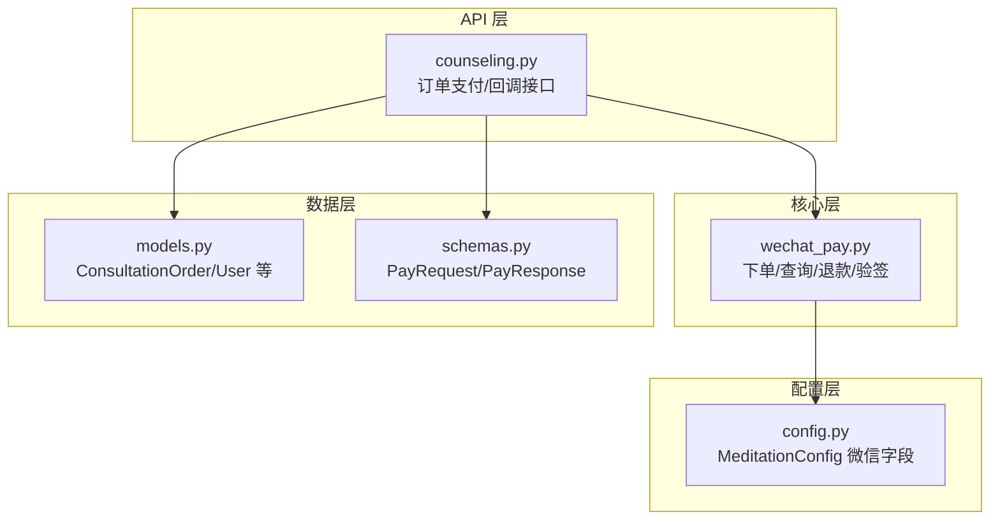
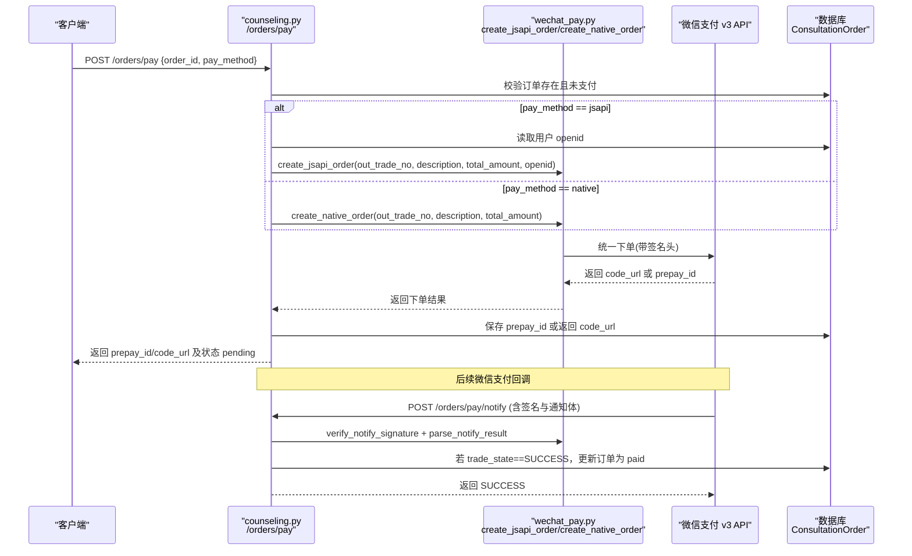
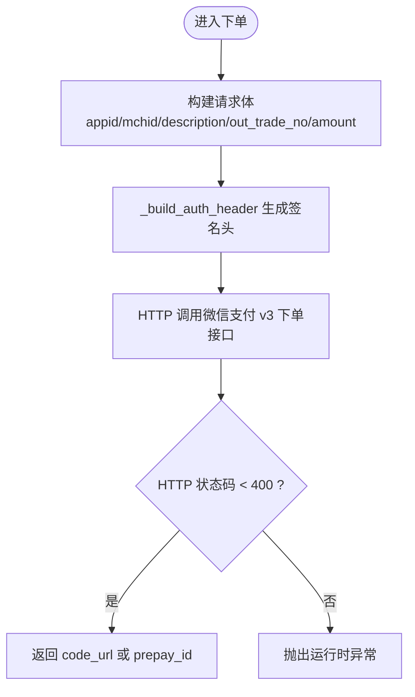
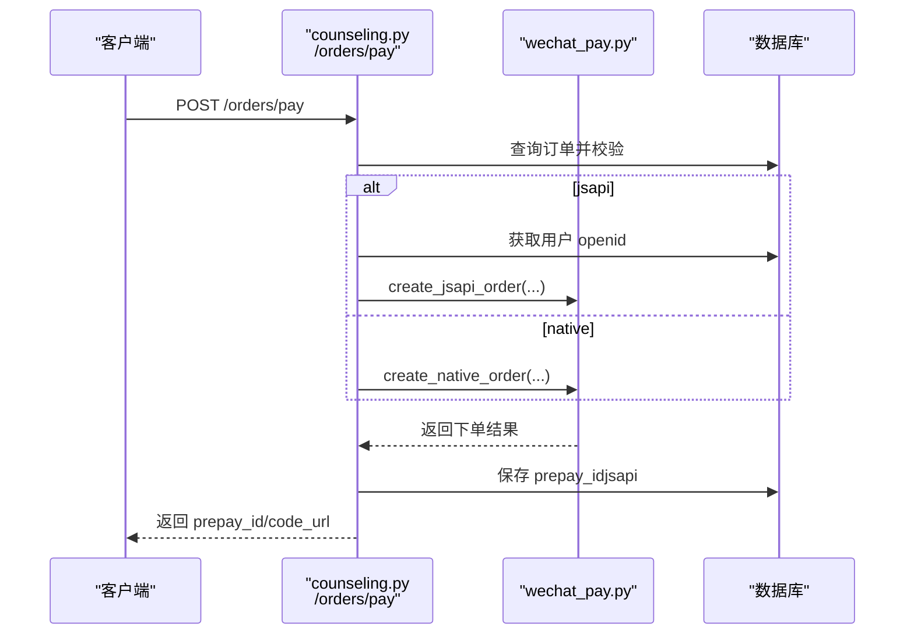
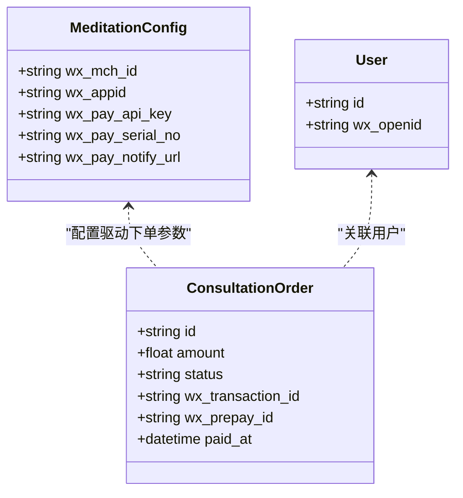
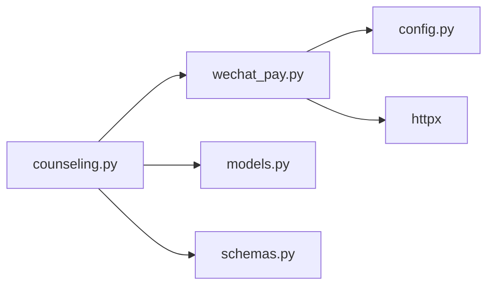

# 微信支付集成

<cite>
**本文引用的文件**   
- [hushai/meditation/core/wechat_pay.py](file://hushai/meditation/core/wechat_pay.py)
- [hushai/meditation/api/counseling.py](file://hushai/meditation/api/counseling.py)
- [hushai/meditation/config.py](file://hushai/meditation/config.py)
- [hushai/meditation/db/models.py](file://hushai/meditation/db/models.py)
- [hushai/meditation/schemas.py](file://hushai/meditation/schemas.py)
</cite>

## 目录
1. [简介](#简介)
2. [项目结构](#项目结构)
3. [核心组件](#核心组件)
4. [架构总览](#架构总览)
5. [详细组件分析](#详细组件分析)
6. [依赖关系分析](#依赖关系分析)
7. [性能与可靠性](#性能与可靠性)
8. [故障排查指南](#故障排查指南)
9. [结论](#结论)
10. [附录：配置与环境变量](#附录配置与环境变量)

## 简介
本文件聚焦于项目中“微信支付 v3”的集成实现，涵盖下单（Native 扫码、JSAPI 小程序/公众号）、订单查询、退款申请、回调验签与结果解析等关键流程。文档从系统架构、数据流、处理逻辑、错误处理与性能特性等方面展开，并提供可操作的排障建议与最佳实践。

## 项目结构
微信支付相关代码主要分布在以下模块：
- 支付核心封装：hushai/meditation/core/wechat_pay.py
- 业务 API 路由：hushai/meditation/api/counseling.py
- 配置加载：hushai/meditation/config.py
- 数据库模型：hushai/meditation/db/models.py
- 请求/响应模式定义：hushai/meditation/schemas.py

图表来源
- [hushai/meditation/api/counseling.py:440-528](file://hushai/meditation/api/counseling.py#L440-L528)
- [hushai/meditation/core/wechat_pay.py:1-194](file://hushai/meditation/core/wechat_pay.py#L1-L194)
- [hushai/meditation/config.py:54-101](file://hushai/meditation/config.py#L54-L101)
- [hushai/meditation/db/models.py:361-389](file://hushai/meditation/db/models.py#L361-L389)
- [hushai/meditation/schemas.py:463-473](file://hushai/meditation/schemas.py#L463-L473)

章节来源
- [hushai/meditation/api/counseling.py:440-528](file://hushai/meditation/api/counseling.py#L440-L528)
- [hushai/meditation/core/wechat_pay.py:1-194](file://hushai/meditation/core/wechat_pay.py#L1-L194)
- [hushai/meditation/config.py:54-101](file://hushai/meditation/config.py#L54-L101)
- [hushai/meditation/db/models.py:361-389](file://hushai/meditation/db/models.py#L361-L389)
- [hushai/meditation/schemas.py:463-473](file://hushai/meditation/schemas.py#L463-L473)

## 核心组件
- 支付核心封装 wechat_pay.py
  - 提供 Native 下单、JSAPI 下单、订单查询、退款申请、回调签名验证与结果解析等能力。
  - 使用 httpx 发起异步 HTTP 请求，统一通过 _build_auth_header 构造 v3 签名头。
- 业务路由 counseling.py
  - 暴露 /orders/pay 发起支付；/orders/pay/notify 接收并处理微信支付回调。
  - 根据 pay_method 选择 JSAPI 或 Native 下单路径，并在数据库中持久化 prepay_id 与交易状态。
- 配置 config.py
  - MeditationConfig 包含 wx_mch_id、wx_appid、wx_pay_api_key、wx_pay_serial_no、wx_pay_notify_url 等字段，支持从环境变量加载。
- 数据模型 models.py
  - ConsultationOrder 记录订单金额、状态、支付流水号、预支付标识等；User 存储 wx_openid 用于 JSAPI 下单。
- 模式定义 schemas.py
  - PayRequest/PayResponse 规范支付请求与响应结构。

章节来源
- [hushai/meditation/core/wechat_pay.py:28-155](file://hushai/meditation/core/wechat_pay.py#L28-L155)
- [hushai/meditation/api/counseling.py:440-528](file://hushai/meditation/api/counseling.py#L440-L528)
- [hushai/meditation/config.py:54-101](file://hushai/meditation/config.py#L54-L101)
- [hushai/meditation/db/models.py:361-389](file://hushai/meditation/db/models.py#L361-L389)
- [hushai/meditation/schemas.py:463-473](file://hushai/meditation/schemas.py#L463-L473)

## 架构总览
下图展示了从客户端到微信支付平台的端到端调用链，包括下单、回调与本地状态更新。

图表来源
- [hushai/meditation/api/counseling.py:440-528](file://hushai/meditation/api/counseling.py#L440-L528)
- [hushai/meditation/core/wechat_pay.py:58-155](file://hushai/meditation/core/wechat_pay.py#L58-L155)
- [hushai/meditation/db/models.py:361-389](file://hushai/meditation/db/models.py#L361-L389)

## 详细组件分析

### 支付核心封装 wechat_pay.py
- 认证与签名
  - _build_auth_header 负责组装 Authorization 头，包含商户号、时间戳、随机串、签名与证书序列号。当前开发阶段以 HMAC-SHA256 占位，生产环境应替换为 RSA-SHA256 签名。
- 下单接口
  - create_native_order：生成 Native 下单请求体，返回 code_url。
  - create_jsapi_order：生成 JSAPI 下单请求体，需传入 openid，返回 prepay_id。
- 查询与退款
  - query_order：按 out_trade_no 查询订单状态。
  - refund_order：提交退款申请，包含退款金额、总金额与原因。
- 回调处理
  - verify_notify_signature：解析回调体，当前为开发占位，生产环境需基于平台证书进行 RSA 验签与 resource 解密。
  - parse_notify_result：从回调中提取 out_trade_no、transaction_id、trade_state 等关键字段。

图表来源
- [hushai/meditation/core/wechat_pay.py:58-108](file://hushai/meditation/core/wechat_pay.py#L58-L108)
- [hushai/meditation/core/wechat_pay.py:28-55](file://hushai/meditation/core/wechat_pay.py#L28-L55)

章节来源
- [hushai/meditation/core/wechat_pay.py:28-155](file://hushai/meditation/core/wechat_pay.py#L28-L155)

### 业务路由 counseling.py
- 发起支付 /orders/pay
  - 校验订单归属与状态（仅允许 unpaid）。
  - 根据 pay_method 分支：
    - jsapi：读取用户 openid，调用 create_jsapi_order，保存 prepay_id 后返回。
    - native：调用 create_native_order，返回 code_url。
- 回调处理 /orders/pay/notify
  - 验签与解析回调体。
  - 若 trade_state 为 SUCCESS，则更新订单状态为 paid，写入支付时间与交易流水号。

图表来源
- [hushai/meditation/api/counseling.py:440-498](file://hushai/meditation/api/counseling.py#L440-L498)
- [hushai/meditation/core/wechat_pay.py:83-108](file://hushai/meditation/core/wechat_pay.py#L83-L108)

章节来源
- [hushai/meditation/api/counseling.py:440-528](file://hushai/meditation/api/counseling.py#L440-L528)

### 配置与数据模型
- 配置项
  - wx_mch_id、wx_appid、wx_pay_api_key、wx_pay_serial_no、wx_pay_notify_url 等字段由 MeditationConfig 管理，并通过环境变量注入。
- 数据模型
  - ConsultationOrder：记录 amount、status、wx_transaction_id、wx_prepay_id、paid_at 等。
  - User：存储 wx_openid 用于 JSAPI 下单。

图表来源
- [hushai/meditation/config.py:54-101](file://hushai/meditation/config.py#L54-L101)
- [hushai/meditation/db/models.py:361-389](file://hushai/meditation/db/models.py#L361-L389)
- [hushai/meditation/db/models.py:37-43](file://hushai/meditation/db/models.py#L37-L43)

章节来源
- [hushai/meditation/config.py:54-101](file://hushai/meditation/config.py#L54-L101)
- [hushai/meditation/db/models.py:361-389](file://hushai/meditation/db/models.py#L361-L389)
- [hushai/meditation/db/models.py:37-43](file://hushai/meditation/db/models.py#L37-L43)

### 请求/响应模式
- PayRequest：包含 order_id 与 pay_method（native/jsapi）。
- PayResponse：包含 order_id、code_url（native）、prepay_id（jsapi）与 status。

章节来源
- [hushai/meditation/schemas.py:463-473](file://hushai/meditation/schemas.py#L463-L473)

## 依赖关系分析
- 模块耦合
  - counseling.py 依赖 wechat_pay.py 完成对外部支付的调用，同时读写数据库模型 ConsultationOrder 与 User。
  - wechat_pay.py 依赖 config.py 获取商户与证书信息，并使用 httpx 访问微信支付 API。
- 外部依赖
  - httpx：异步 HTTP 客户端。
  - 微信支付 v3 API：统一下单、查询、退款、回调通知。

图表来源
- [hushai/meditation/api/counseling.py:440-528](file://hushai/meditation/api/counseling.py#L440-L528)
- [hushai/meditation/core/wechat_pay.py:1-194](file://hushai/meditation/core/wechat_pay.py#L1-L194)
- [hushai/meditation/config.py:54-101](file://hushai/meditation/config.py#L54-L101)
- [hushai/meditation/db/models.py:361-389](file://hushai/meditation/db/models.py#L361-L389)
- [hushai/meditation/schemas.py:463-473](file://hushai/meditation/schemas.py#L463-L473)

章节来源
- [hushai/meditation/api/counseling.py:440-528](file://hushai/meditation/api/counseling.py#L440-L528)
- [hushai/meditation/core/wechat_pay.py:1-194](file://hushai/meditation/core/wechat_pay.py#L1-L194)
- [hushai/meditation/config.py:54-101](file://hushai/meditation/config.py#L54-L101)
- [hushai/meditation/db/models.py:361-389](file://hushai/meditation/db/models.py#L361-L389)
- [hushai/meditation/schemas.py:463-473](file://hushai/meditation/schemas.py#L463-L473)

## 性能与可靠性
- 并发与超时
  - 下单与查询均使用 httpx.AsyncClient 并设置超时，避免阻塞。
- 幂等与一致性
  - 回调处理中依据 trade_state 更新订单状态，建议在正式环境增加幂等保护（如基于 out_trade_no 的去重表或唯一索引），防止重复通知导致重复入账。
- 签名安全
  - 当前签名在开发阶段使用 HMAC 占位，生产环境必须切换为 RSA-SHA256 并使用微信平台公钥验签与资源解密。
- 日志与可观测性
  - 下单失败、查询失败与回调解析失败均有日志输出，便于定位问题。

[本节为通用指导，不直接分析具体文件]

## 故障排查指南
- 下单失败
  - 检查 HTTP 状态码与返回体，确认签名头是否正确、商户信息与证书序列号是否匹配。
  - 确认 notify_url 已正确配置并可被微信支付访问。
- 回调未触发或验签失败
  - 确认回调地址公网可达且端口开放。
  - 生产环境务必启用 RSA 验签与 resource 解密，避免误判。
- 订单状态不一致
  - 核对 out_trade_no 映射规则（前缀 hushai_ 去除后为本地订单 ID）。
  - 检查数据库事务提交与重试机制，确保最终一致。

章节来源
- [hushai/meditation/core/wechat_pay.py:75-108](file://hushai/meditation/core/wechat_pay.py#L75-L108)
- [hushai/meditation/core/wechat_pay.py:158-194](file://hushai/meditation/core/wechat_pay.py#L158-L194)
- [hushai/meditation/api/counseling.py:501-528](file://hushai/meditation/api/counseling.py#L501-L528)

## 结论
本项目对微信支付 v3 的集成具备清晰的层次划分与职责分离：API 路由负责业务流程编排与状态同步，核心封装负责签名、网络通信与回调解析，配置与数据模型提供支撑。当前实现满足开发与测试需求，生产上线前需重点完善签名与验签、幂等与重试策略，以及监控告警与审计日志。

[本节为总结性内容，不直接分析具体文件]

## 附录：配置与环境变量
- 微信支付相关环境变量
  - MEDITATION_WX_MCH_ID：商户号
  - MEDITATION_WX_APPID：应用 AppID
  - MEDITATION_WX_SECRET：应用密钥（登录/会话）
  - MEDITATION_WX_PAY_API_KEY：APIv3 密钥
  - MEDITATION_WX_PAY_CERT_PATH：商户私钥证书路径（生产）
  - MEDITATION_WX_PAY_SERIAL_NO：证书序列号
  - MEDITATION_WX_PAY_NOTIFY_URL：回调通知地址
- 其他
  - 其余冥想模块配置见 MeditationConfig 映射表。

章节来源
- [hushai/meditation/config.py:54-101](file://hushai/meditation/config.py#L54-L101)