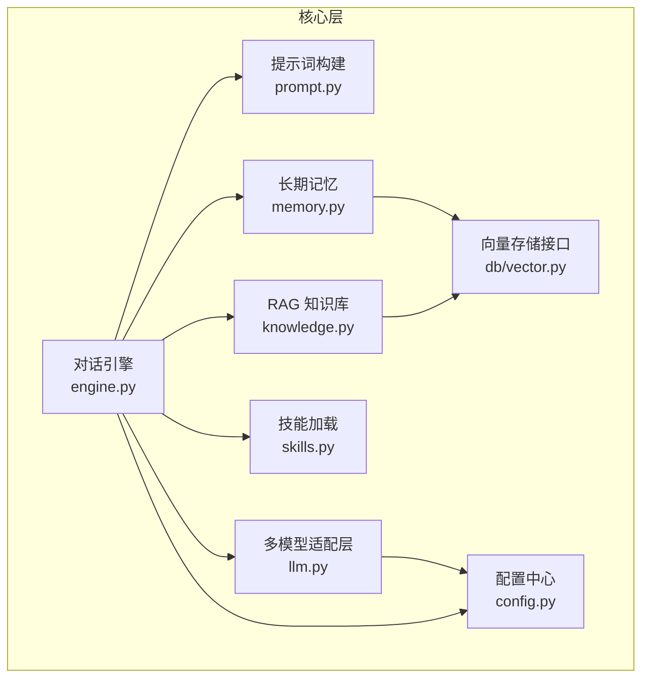
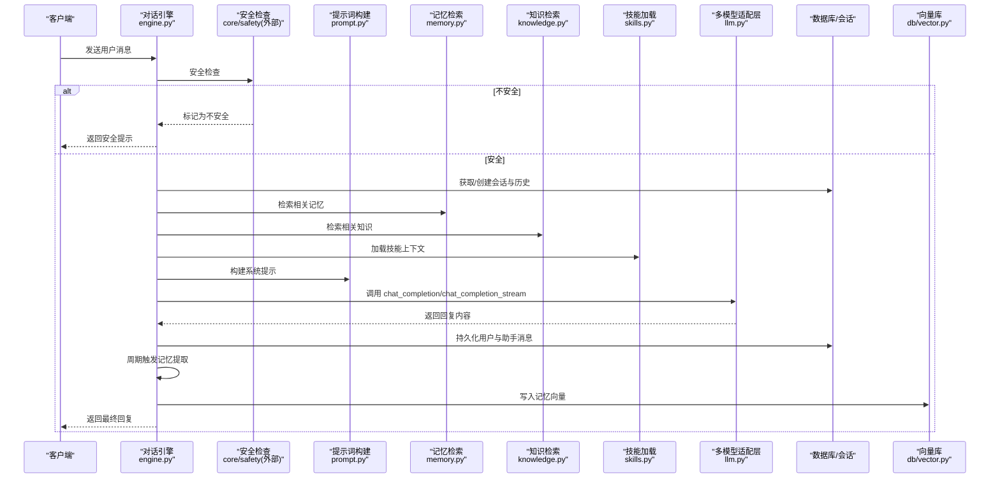
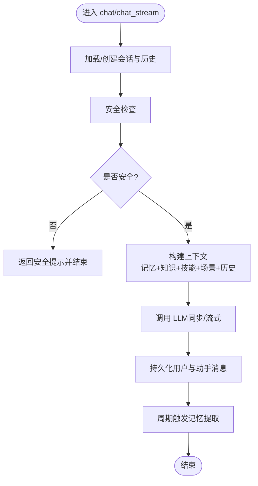
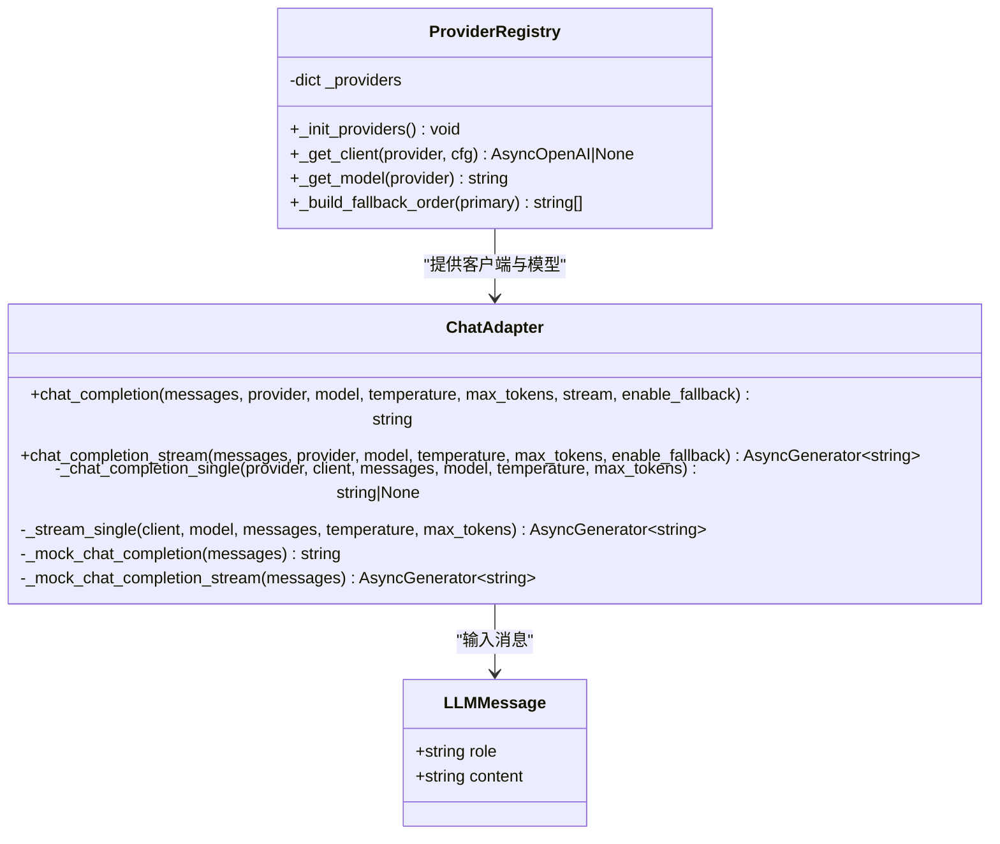
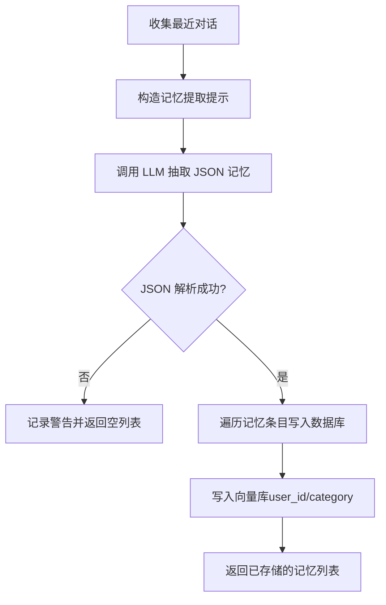
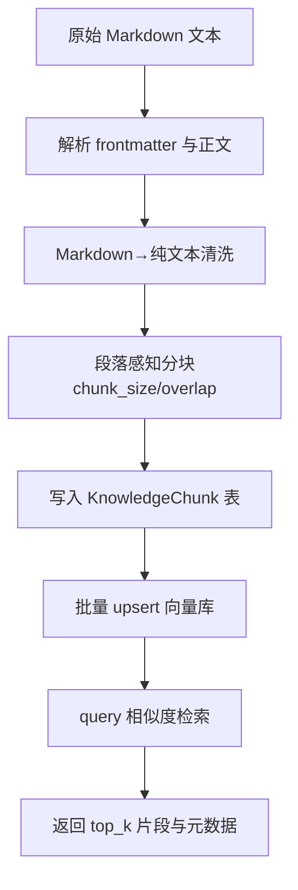
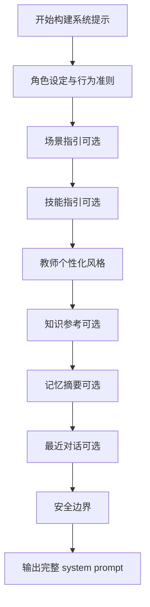
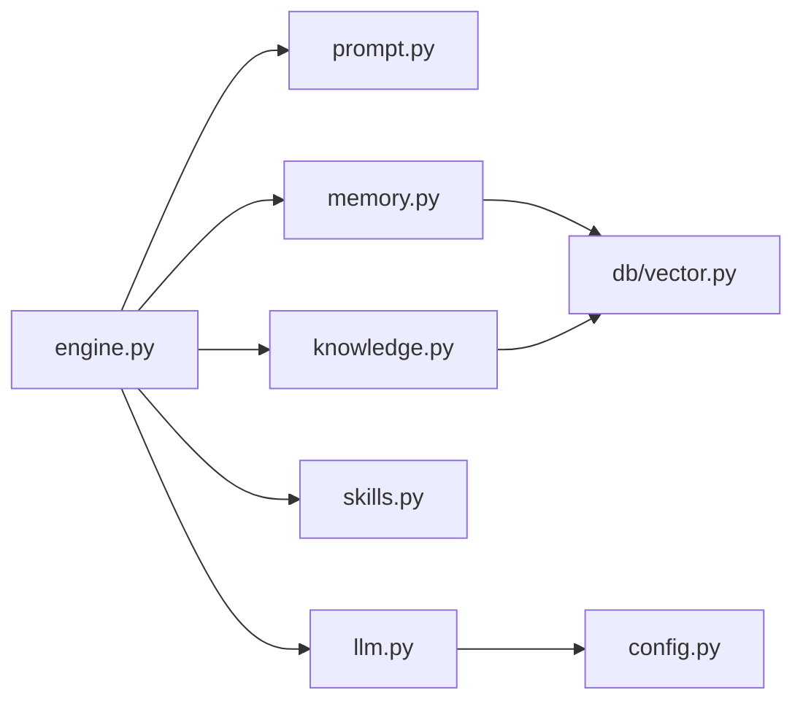

# 核心模块

<cite>
**本文引用的文件**   
- [hushai/meditation/core/engine.py](file://hushai/meditation/core/engine.py)
- [hushai/meditation/core/llm.py](file://hushai/meditation/core/llm.py)
- [hushai/meditation/core/memory.py](file://hushai/meditation/core/memory.py)
- [hushai/meditation/core/knowledge.py](file://hushai/meditation/core/knowledge.py)
- [hushai/meditation/core/prompt.py](file://hushai/meditation/core/prompt.py)
- [hushai/meditation/core/skills.py](file://hushai/meditation/core/skills.py)
- [hushai/meditation/db/vector.py](file://hushai/meditation/db/vector.py)
- [hushai/meditation/config.py](file://hushai/meditation/config.py)
</cite>

## 目录
1. [简介](#简介)
2. [项目结构](#项目结构)
3. [核心组件](#核心组件)
4. [架构总览](#架构总览)
5. [详细组件分析](#详细组件分析)
6. [依赖关系分析](#依赖关系分析)
7. [性能考量](#性能考量)
8. [故障排查指南](#故障排查指南)
9. [结论](#结论)
10. [附录：使用模式与扩展建议](#附录使用模式与扩展建议)

## 简介
本技术文档聚焦 hush.ai 冥想老师模块的核心能力，围绕对话引擎编排、多模型 LLM 适配层、长期记忆系统以及 RAG 知识库四大方面展开。文档旨在帮助开发者理解并扩展以下关键流程：
- 提示词构建：动态拼装角色设定、场景、技能、知识、记忆与历史上下文。
- 知识检索：基于 Markdown 语料处理、段落感知分块、向量化存储与相似度匹配。
- 记忆提取：周期性从对话中抽取结构化记忆，持久化到向量库并按语义检索。
- 技能调用：按 ID 或全局加载已启用技能文本，注入系统提示。
- LLM 适配层：统一 OpenAI、DeepSeek、智谱、Kimi 等提供商接口，支持自动降级与流式输出。
- 安全护栏：在外部模型调用前进行安全检查，必要时直接返回安全提示。

## 项目结构
核心代码位于 meditation 子包内，采用“功能域 + 基础设施”的分层组织方式：
- core：业务编排（engine）、LLM 路由（llm）、记忆（memory）、知识（knowledge）、提示词（prompt）、技能（skills）
- db：数据库模型与会话、ChromaDB 向量接口（vector）
- config：配置加载与环境变量映射
- api/admin：对外 API 与管理后台（不在本文重点）

图表来源
- [hushai/meditation/core/engine.py:1-387](file://hushai/meditation/core/engine.py#L1-L387)
- [hushai/meditation/core/prompt.py:1-130](file://hushai/meditation/core/prompt.py#L1-L130)
- [hushai/meditation/core/memory.py:1-206](file://hushai/meditation/core/memory.py#L1-L206)
- [hushai/meditation/core/knowledge.py:1-225](file://hushai/meditation/core/knowledge.py#L1-L225)
- [hushai/meditation/core/skills.py:1-59](file://hushai/meditation/core/skills.py#L1-L59)
- [hushai/meditation/core/llm.py:1-258](file://hushai/meditation/core/llm.py#L1-L258)
- [hushai/meditation/db/vector.py:1-179](file://hushai/meditation/db/vector.py#L1-L179)
- [hushai/meditation/config.py:1-136](file://hushai/meditation/config.py#L1-L136)

章节来源
- [hushai/meditation/core/engine.py:1-387](file://hushai/meditation/core/engine.py#L1-L387)
- [hushai/meditation/core/llm.py:1-258](file://hushai/meditation/core/llm.py#L1-L258)
- [hushai/meditation/core/memory.py:1-206](file://hushai/meditation/core/memory.py#L1-L206)
- [hushai/meditation/core/knowledge.py:1-225](file://hushai/meditation/core/knowledge.py#L1-L225)
- [hushai/meditation/core/prompt.py:1-130](file://hushai/meditation/core/prompt.py#L1-L130)
- [hushai/meditation/core/skills.py:1-59](file://hushai/meditation/core/skills.py#L1-L59)
- [hushai/meditation/db/vector.py:1-179](file://hushai/meditation/db/vector.py#L1-L179)
- [hushai/meditation/config.py:1-136](file://hushai/meditation/config.py#L1-L136)

## 核心组件
- 对话引擎（engine）：负责会话生命周期管理、上下文组装、安全校验、LLM 调用、结果持久化与记忆提取触发。
- LLM 适配层（llm）：统一多模型调用接口，提供非流式与流式两种模式，内置默认降级顺序与调试 Mock。
- 长期记忆（memory）：基于 LLM 的结构化记忆抽取、持久化与向量检索，支持归档清理。
- RAG 知识库（knowledge）：Markdown 预处理、段落感知分块、批量入库与相似度检索。
- 提示词构建（prompt）：模块化拼接系统提示，包含角色、场景、技能、知识、记忆、历史与安全边界。
- 技能加载（skills）：按 ID 或全局加载已启用技能文本，限制最大数量与排序。
- 向量存储（db/vector）：封装 ChromaDB 客户端、集合管理与查询接口，支持 OpenAI Embedding 或本地默认嵌入。
- 配置（config）：集中管理环境变量映射与运行时配置。

章节来源
- [hushai/meditation/core/engine.py:1-387](file://hushai/meditation/core/engine.py#L1-L387)
- [hushai/meditation/core/llm.py:1-258](file://hushai/meditation/core/llm.py#L1-L258)
- [hushai/meditation/core/memory.py:1-206](file://hushai/meditation/core/memory.py#L1-L206)
- [hushai/meditation/core/knowledge.py:1-225](file://hushai/meditation/core/knowledge.py#L1-L225)
- [hushai/meditation/core/prompt.py:1-130](file://hushai/meditation/core/prompt.py#L1-L130)
- [hushai/meditation/core/skills.py:1-59](file://hushai/meditation/core/skills.py#L1-L59)
- [hushai/meditation/db/vector.py:1-179](file://hushai/meditation/db/vector.py#L1-L179)
- [hushai/meditation/config.py:1-136](file://hushai/meditation/config.py#L1-L136)

## 架构总览
下图展示一次完整对话的端到端流程，包括安全校验、上下文构建、LLM 调用、结果持久化与记忆提取。

图表来源
- [hushai/meditation/core/engine.py:166-314](file://hushai/meditation/core/engine.py#L166-L314)
- [hushai/meditation/core/prompt.py:77-103](file://hushai/meditation/core/prompt.py#L77-L103)
- [hushai/meditation/core/memory.py:161-173](file://hushai/meditation/core/memory.py#L161-L173)
- [hushai/meditation/core/knowledge.py:216-224](file://hushai/meditation/core/knowledge.py#L216-L224)
- [hushai/meditation/core/skills.py:14-58](file://hushai/meditation/core/skills.py#L14-L58)
- [hushai/meditation/core/llm.py:136-178](file://hushai/meditation/core/llm.py#L136-L178)
- [hushai/meditation/db/vector.py:130-173](file://hushai/meditation/db/vector.py#L130-L173)

## 详细组件分析

### 对话引擎编排逻辑
- 会话与消息管理：根据 user_id 与 conversation_id 获取或创建会话；按配置限制历史轮次；将用户与助手消息持久化。
- 上下文构建：并行拉取记忆、知识、技能与场景上下文，格式化历史对话，解析教师个性化描述，统一通过提示词构建器生成 system prompt。
- 安全前置：在调用 LLM 之前执行安全检查，若检测到危机信号则直接返回安全提示，避免将敏感内容发送至外部模型。
- LLM 调用：支持同步与流式两种模式；流式模式下逐 token 推送，并在完成后聚合全文持久化。
- 记忆提取：按固定间隔（每 N 条用户消息）触发，调用 LLM 抽取结构化记忆并写入向量库；首次对话自动设置会话标题。

图表来源
- [hushai/meditation/core/engine.py:166-314](file://hushai/meditation/core/engine.py#L166-L314)
- [hushai/meditation/core/prompt.py:77-103](file://hushai/meditation/core/prompt.py#L77-L103)
- [hushai/meditation/core/memory.py:130-173](file://hushai/meditation/core/memory.py#L130-L173)
- [hushai/meditation/core/knowledge.py:216-224](file://hushai/meditation/core/knowledge.py#L216-L224)
- [hushai/meditation/core/skills.py:14-58](file://hushai/meditation/core/skills.py#L14-L58)

章节来源
- [hushai/meditation/core/engine.py:1-387](file://hushai/meditation/core/engine.py#L1-L387)
- [hushai/meditation/core/prompt.py:1-130](file://hushai/meditation/core/prompt.py#L1-L130)
- [hushai/meditation/core/memory.py:1-206](file://hushai/meditation/core/memory.py#L1-L206)
- [hushai/meditation/core/knowledge.py:1-225](file://hushai/meditation/core/knowledge.py#L1-L225)
- [hushai/meditation/core/skills.py:1-59](file://hushai/meditation/core/skills.py#L1-L59)

### LLM 适配层（多模型支持与自动降级）
- 统一接口：对外暴露 chat_completion 与 chat_completion_stream，内部统一转换为 OpenAI 兼容请求格式。
- 提供商初始化：启动时根据配置注册 openai、deepseek、zhipu、kimi 等提供商，支持自定义 llm_providers 覆盖。
- 降级策略：默认顺序 deepseek → zhipu → kimi → openai；当主 provider 失败或未配置 key 时自动尝试下一个；全部失败或仅 debug 无 key 时回退至 Mock 回复。
- 流式降级：流式调用失败时记录异常并继续尝试下一提供商；若无任何可用提供商且 last_exc 为空，走 Mock 流式输出。
- 错误处理：OpenAIError 被捕获并格式化为用户友好错误信息；debug 模式下允许跳过未配置 key 的提供商。

图表来源
- [hushai/meditation/core/llm.py:1-258](file://hushai/meditation/core/llm.py#L1-L258)

章节来源
- [hushai/meditation/core/llm.py:1-258](file://hushai/meditation/core/llm.py#L1-L258)
- [hushai/meditation/config.py:1-136](file://hushai/meditation/config.py#L1-L136)

### 长期记忆系统（维度提取、向量存储与语义检索）
- 维度定义：支持冥想经历、情绪模式、个人偏好、目标进展、重要事件、健康提醒、生活背景等类别。
- 提取流程：将最近对话文本拼成提示，调用 LLM 以 JSON 数组形式返回结构化记忆；对解析失败做容错处理。
- 存储与索引：每条记忆写入数据库后，异步写入向量库（按 user_id 与 category 标注），失败不影响主流程。
- 语义检索：根据当前用户消息进行向量相似度检索，按重要性降序与更新时间排序，返回摘要片段用于提示词注入。
- 归档清理：定期将低重要度且长时间未更新的记忆归档，释放空间。

图表来源
- [hushai/meditation/core/memory.py:45-112](file://hushai/meditation/core/memory.py#L45-L112)
- [hushai/meditation/db/vector.py:130-173](file://hushai/meditation/db/vector.py#L130-L173)

章节来源
- [hushai/meditation/core/memory.py:1-206](file://hushai/meditation/core/memory.py#L1-L206)
- [hushai/meditation/db/vector.py:1-179](file://hushai/meditation/db/vector.py#L1-L179)

### RAG 知识库（Markdown 语料处理、段落感知分块、向量化与相似度匹配）
- 语料预处理：解析简单 YAML frontmatter（title/tags），将 Markdown 转为纯文本，保留代码块与链接文本，去除多余格式。
- 段落感知分块：按双换行分割段落，控制 chunk_size 与 overlap，保证跨段落的上下文连续性。
- 批量入库：为每个 chunk 创建 KnowledgeChunk 记录，并批量 upsert 到向量库，附带 title、tags、source、parent_id 等元数据。
- 相似度检索：基于 cosine 距离计算相似度，返回 top_k 结果，包含内容片段、分数与来源信息。

图表来源
- [hushai/meditation/core/knowledge.py:15-134](file://hushai/meditation/core/knowledge.py#L15-L134)
- [hushai/meditation/core/knowledge.py:137-171](file://hushai/meditation/core/knowledge.py#L137-L171)
- [hushai/meditation/db/vector.py:81-127](file://hushai/meditation/db/vector.py#L81-L127)

章节来源
- [hushai/meditation/core/knowledge.py:1-225](file://hushai/meditation/core/knowledge.py#L1-L225)
- [hushai/meditation/db/vector.py:1-179](file://hushai/meditation/db/vector.py#L1-L179)

### 提示词构建与技能调用
- 提示词构建：按模块拼接角色设定、场景指引、技能指引、教师个性化风格、知识参考、记忆摘要、最近对话与安全边界。
- 技能加载：支持按指定 skill_ids 顺序加载或全局加载已启用技能，限制最大数量与排序，确保提示词长度可控。
- 知识问答模式：针对 knowledge_qa 专用系统提示，强调基于知识库回答并给出来源引用。

图表来源
- [hushai/meditation/core/prompt.py:77-103](file://hushai/meditation/core/prompt.py#L77-L103)
- [hushai/meditation/core/skills.py:14-58](file://hushai/meditation/core/skills.py#L14-L58)

章节来源
- [hushai/meditation/core/prompt.py:1-130](file://hushai/meditation/core/prompt.py#L1-L130)
- [hushai/meditation/core/skills.py:1-59](file://hushai/meditation/core/skills.py#L1-L59)

## 依赖关系分析
- 组件耦合：
  - engine 强依赖 prompt、memory、knowledge、skills、llm、config 与数据库会话。
  - memory 与 knowledge 均依赖 vector 进行向量操作。
  - llm 依赖 config 与 OpenAI SDK，并通过 format_openai_error 统一错误信息。
- 外部依赖：
  - OpenAI SDK：用于多模型调用。
  - ChromaDB：向量存储与相似度检索。
  - SQLAlchemy：异步数据库会话与 ORM 模型。
- 潜在循环依赖：当前实现未见明显循环导入；各模块职责清晰，依赖方向单一。

图表来源
- [hushai/meditation/core/engine.py:1-387](file://hushai/meditation/core/engine.py#L1-L387)
- [hushai/meditation/core/llm.py:1-258](file://hushai/meditation/core/llm.py#L1-L258)
- [hushai/meditation/core/memory.py:1-206](file://hushai/meditation/core/memory.py#L1-L206)
- [hushai/meditation/core/knowledge.py:1-225](file://hushai/meditation/core/knowledge.py#L1-L225)
- [hushai/meditation/core/prompt.py:1-130](file://hushai/meditation/core/prompt.py#L1-L130)
- [hushai/meditation/core/skills.py:1-59](file://hushai/meditation/core/skills.py#L1-L59)
- [hushai/meditation/db/vector.py:1-179](file://hushai/meditation/db/vector.py#L1-L179)
- [hushai/meditation/config.py:1-136](file://hushai/meditation/config.py#L1-L136)

章节来源
- [hushai/meditation/core/engine.py:1-387](file://hushai/meditation/core/engine.py#L1-L387)
- [hushai/meditation/core/llm.py:1-258](file://hushai/meditation/core/llm.py#L1-L258)
- [hushai/meditation/core/memory.py:1-206](file://hushai/meditation/core/memory.py#L1-L206)
- [hushai/meditation/core/knowledge.py:1-225](file://hushai/meditation/core/knowledge.py#L1-L225)
- [hushai/meditation/core/prompt.py:1-130](file://hushai/meditation/core/prompt.py#L1-L130)
- [hushai/meditation/core/skills.py:1-59](file://hushai/meditation/core/skills.py#L1-L59)
- [hushai/meditation/db/vector.py:1-179](file://hushai/meditation/db/vector.py#L1-L179)
- [hushai/meditation/config.py:1-136](file://hushai/meditation/config.py#L1-L136)

## 性能考量
- 向量检索效率：ChromaDB 使用 HNSW 索引与 cosine 距离，建议在大规模数据下合理设置 top_k 与 collection 元数据，避免全量扫描。
- 分块大小与重叠：chunk_size 与 overlap 影响召回质量与延迟，建议根据领域文本长度调优（默认 800/200）。
- LLM 超时与重试：默认超时 60s（debug 120s），结合自动降级可提升可用性；在高并发场景建议增加连接池与限流。
- 记忆提取频率：每 N 条用户消息触发一次，N 值需平衡实时性与成本；过大导致记忆滞后，过小增加 LLM 调用开销。
- 提示词长度控制：限制历史轮次与技能数量，避免超出模型上下文窗口。

[本节为通用指导，不直接分析具体文件]

## 故障排查指南
- LLM 调用失败：
  - 检查对应提供商的 API Key 与 base_url 配置是否正确。
  - 查看日志中的降级信息与 OpenAIError 详情，确认是否为网络或服务端错误。
  - 在 debug 模式下，若缺少 key 会跳过该提供商并尝试下一个；如全部不可用，将回退至 Mock 回复。
- 向量库问题：
  - 确认 embedding_provider 与 embedding_api_key 配置；若缺失将回退到默认嵌入函数。
  - 检查 ChromaDB 持久化目录是否存在并可写；测试环境可使用 reset_vector_for_tests 重置客户端。
- 记忆提取失败：
  - 关注 JSON 解析失败的警告日志；检查 LLM 返回是否符合预期结构。
  - 向量写入失败不会阻断主流程，但会影响后续检索，需单独排查。
- 知识库检索为空：
  - 确认 import_text/import_structured 已成功执行，向量集合 count > 0。
  - 调整 knowledge_top_k 与 query 措辞以提升召回率。

章节来源
- [hushai/meditation/core/llm.py:136-178](file://hushai/meditation/core/llm.py#L136-L178)
- [hushai/meditation/core/llm.py:208-258](file://hushai/meditation/core/llm.py#L208-L258)
- [hushai/meditation/db/vector.py:15-58](file://hushai/meditation/db/vector.py#L15-L58)
- [hushai/meditation/db/vector.py:31-34](file://hushai/meditation/db/vector.py#L31-L34)
- [hushai/meditation/core/memory.py:45-76](file://hushai/meditation/core/memory.py#L45-L76)
- [hushai/meditation/core/knowledge.py:207-214](file://hushai/meditation/core/knowledge.py#L207-L214)

## 结论
hush.ai 冥想老师模块通过清晰的编排逻辑与模块化设计，实现了多模型 LLM 的统一接入、安全的对话流程、智能的记忆系统与高效的 RAG 知识库。其自动降级机制与流式输出提升了系统的鲁棒性与用户体验。开发者可在现有基础上扩展更多提供商、优化分块策略与检索算法，以满足不同业务场景的需求。

[本节为总结性内容，不直接分析具体文件]

## 附录：使用模式与扩展建议
- 快速上手：
  - 配置 .env 中的 MEDITATION_* 环境变量，确保至少一个 LLM 提供商可用。
  - 调用 engine.chat 或 engine.chat_stream 完成对话；如需知识问答，使用 engine.knowledge_qa。
- 扩展新提供商：
  - 在 config 中添加新的环境变量映射，并在 llm._init_providers 中注册新提供商。
  - 确保 base_url 与 model 名称符合 OpenAI 兼容协议。
- 优化记忆提取：
  - 调整 MEMORY_EXTRACTION_INTERVAL 与 memory_extraction_model，提高抽取准确率与成本效益。
- 改进 RAG 效果：
  - 调整 chunk_size 与 overlap，丰富 tags 与 source 元数据，提升检索相关性。
- 监控与日志：
  - 关注 LLM 降级与向量写入失败的日志，建立告警与指标采集。

[本节为概念性指导，不直接分析具体文件]