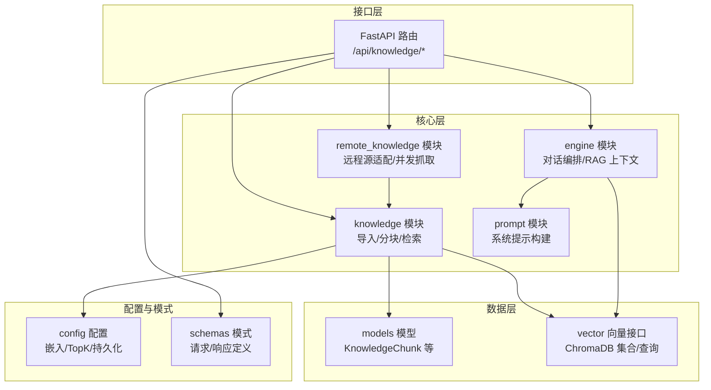
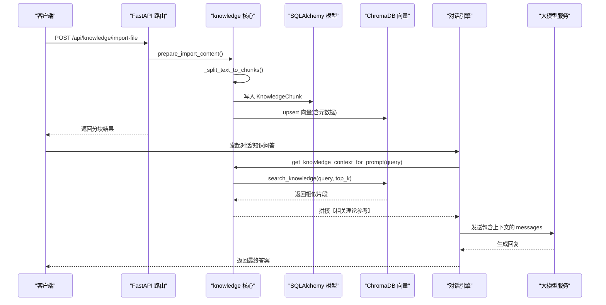
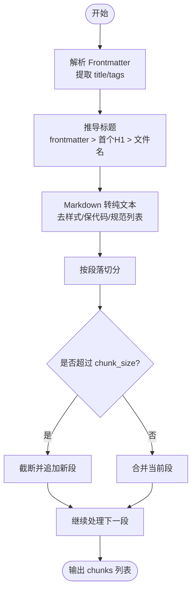
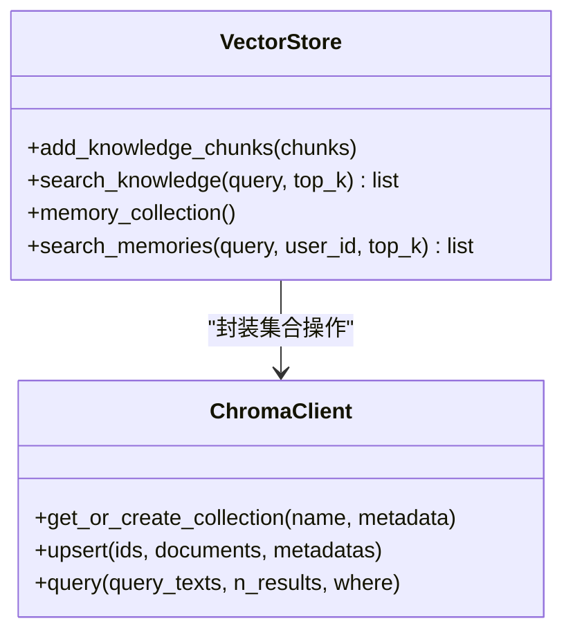
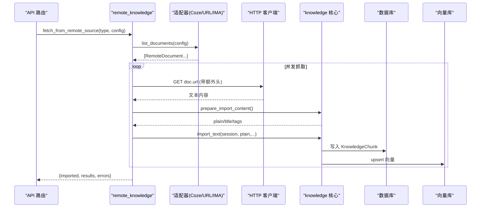
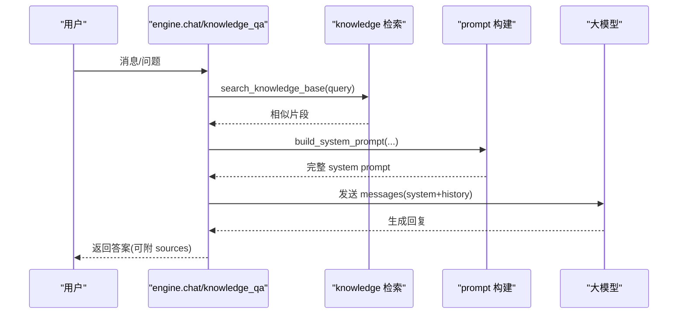
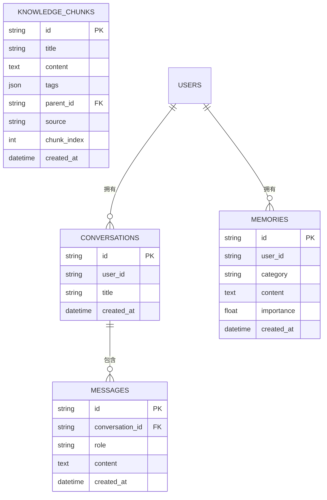
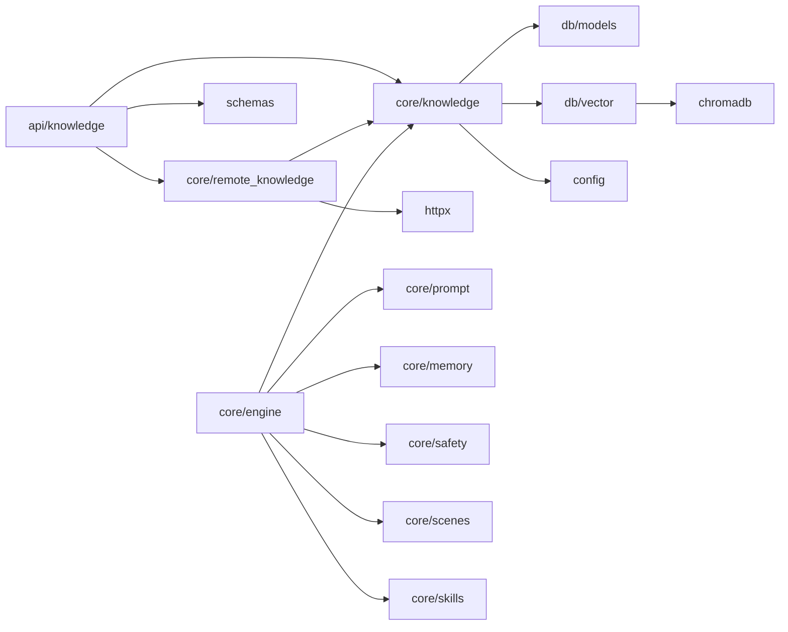

# 知识库系统

<cite>
**本文引用的文件**   
- [hushai/meditation/core/knowledge.py](file://hushai/meditation/core/knowledge.py)
- [hushai/meditation/core/remote_knowledge.py](file://hushai/meditation/core/remote_knowledge.py)
- [hushai/meditation/db/vector.py](file://hushai/meditation/db/vector.py)
- [hushai/meditation/db/models.py](file://hushai/meditation/db/models.py)
- [hushai/meditation/api/knowledge.py](file://hushai/meditation/api/knowledge.py)
- [hushai/meditation/config.py](file://hushai/meditation/config.py)
- [hushai/meditation/schemas.py](file://hushai/meditation/schemas.py)
- [hushai/meditation/core/engine.py](file://hushai/meditation/core/engine.py)
- [hushai/meditation/core/prompt.py](file://hushai/meditation/core/prompt.py)
- [scripts/import_open_cognition.py](file://scripts/import_open_cognition.py)
</cite>

## 目录
1. [简介](#简介)
2. [项目结构](#项目结构)
3. [核心组件](#核心组件)
4. [架构总览](#架构总览)
5. [详细组件分析](#详细组件分析)
6. [依赖关系分析](#依赖关系分析)
7. [性能与优化](#性能与优化)
8. [故障排查指南](#故障排查指南)
9. [结论](#结论)
10. [附录：使用示例与最佳实践](#附录使用示例与最佳实践)

## 简介
本技术文档面向 hush.ai 的知识库系统，围绕 RAG（检索增强生成）的完整链路展开：知识入库、文本分块与预处理、向量化存储与索引、相似度检索、上下文构建与答案生成。同时覆盖 Markdown 语料处理机制、远程知识源集成、缓存策略、性能优化、版本管理与质量控制等工程化要点，并提供 API 调用示例路径，帮助读者快速上手与扩展。

## 项目结构
知识库相关代码主要分布在以下模块：
- 核心逻辑：knowledge（RAG 导入/检索）、remote_knowledge（远程源抓取与同步）、engine（对话编排与 RAG 上下文组装）、prompt（提示词模板）
- 数据层：models（SQLAlchemy ORM 模型）、vector（ChromaDB 向量接口）
- 接口层：api/knowledge（FastAPI 路由，提供导入、搜索、远程同步等能力）
- 配置与模式：config（环境变量映射）、schemas（请求/响应 Pydantic 模型）
- 脚本入口：scripts/import_open_cognition.py（兼容旧入口）

图表来源
- [hushai/meditation/api/knowledge.py:1-310](file://hushai/meditation/api/knowledge.py#L1-L310)
- [hushai/meditation/core/knowledge.py:1-225](file://hushai/meditation/core/knowledge.py#L1-L225)
- [hushai/meditation/core/remote_knowledge.py:1-389](file://hushai/meditation/core/remote_knowledge.py#L1-L389)
- [hushai/meditation/core/engine.py:1-387](file://hushai/meditation/core/engine.py#L1-L387)
- [hushai/meditation/core/prompt.py:1-130](file://hushai/meditation/core/prompt.py#L1-L130)
- [hushai/meditation/db/models.py:137-151](file://hushai/meditation/db/models.py#L137-L151)
- [hushai/meditation/db/vector.py:1-179](file://hushai/meditation/db/vector.py#L1-L179)
- [hushai/meditation/config.py:1-136](file://hushai/meditation/config.py#L1-L136)
- [hushai/meditation/schemas.py:110-151](file://hushai/meditation/schemas.py#L110-L151)

章节来源
- [hushai/meditation/api/knowledge.py:1-310](file://hushai/meditation/api/knowledge.py#L1-L310)
- [hushai/meditation/core/knowledge.py:1-225](file://hushai/meditation/core/knowledge.py#L1-L225)
- [hushai/meditation/core/remote_knowledge.py:1-389](file://hushai/meditation/core/remote_knowledge.py#L1-L389)
- [hushai/meditation/core/engine.py:1-387](file://hushai/meditation/core/engine.py#L1-L387)
- [hushai/meditation/core/prompt.py:1-130](file://hushai/meditation/core/prompt.py#L1-L130)
- [hushai/meditation/db/models.py:137-151](file://hushai/meditation/db/models.py#L137-L151)
- [hushai/meditation/db/vector.py:1-179](file://hushai/meditation/db/vector.py#L1-L179)
- [hushai/meditation/config.py:1-136](file://hushai/meditation/config.py#L1-L136)
- [hushai/meditation/schemas.py:110-151](file://hushai/meditation/schemas.py#L110-L151)

## 核心组件
- 知识导入与分块
  - Markdown 解析：支持 YAML frontmatter 提取 title/tags；自动推导标题；将 Markdown 转为纯文本以统一嵌入语义空间。
  - 段落感知分块：按双换行切分段落，控制 chunk_size 与 overlap，避免跨段落断裂导致语义丢失。
  - 结构化导入：支持树形 children 递归导入，便于组织父子层级。
- 向量存储与检索
  - ChromaDB 集合：knowledge/memories 两个集合，默认余弦距离；支持 OpenAI 或默认嵌入函数。
  - 元数据管理：title/tags/source/parent_id 等作为 metadata 参与检索过滤与展示。
- 远程知识源
  - 适配器模式：URL/Coze/IMA 三类源，统一 list_documents 协议。
  - 并发抓取：基于信号量限制并发度，逐条解析并入库，汇总结果与错误。
- 对话引擎与 RAG 上下文
  - 在每次对话前检索知识库片段，拼接为 system prompt 的一部分，驱动 LLM 回答。
  - 提供 knowledge_qa 专用流程，强化“基于知识库”的回答风格与引用来源。

章节来源
- [hushai/meditation/core/knowledge.py:15-134](file://hushai/meditation/core/knowledge.py#L15-L134)
- [hushai/meditation/core/knowledge.py:137-225](file://hushai/meditation/core/knowledge.py#L137-L225)
- [hushai/meditation/db/vector.py:36-127](file://hushai/meditation/db/vector.py#L36-L127)
- [hushai/meditation/core/remote_knowledge.py:45-173](file://hushai/meditation/core/remote_knowledge.py#L45-L173)
- [hushai/meditation/core/remote_knowledge.py:294-360](file://hushai/meditation/core/remote_knowledge.py#L294-L360)
- [hushai/meditation/core/engine.py:91-127](file://hushai/meditation/core/engine.py#L91-L127)
- [hushai/meditation/core/engine.py:316-387](file://hushai/meditation/core/engine.py#L316-L387)
- [hushai/meditation/core/prompt.py:77-103](file://hushai/meditation/core/prompt.py#L77-L103)
- [hushai/meditation/core/prompt.py:119-130](file://hushai/meditation/core/prompt.py#L119-L130)

## 架构总览
下图展示了从用户请求到 RAG 答案生成的端到端流程，涵盖导入、检索、上下文构建与生成。

图表来源
- [hushai/meditation/api/knowledge.py:101-137](file://hushai/meditation/api/knowledge.py#L101-L137)
- [hushai/meditation/core/knowledge.py:76-171](file://hushai/meditation/core/knowledge.py#L76-L171)
- [hushai/meditation/db/vector.py:81-127](file://hushai/meditation/db/vector.py#L81-L127)
- [hushai/meditation/core/engine.py:91-127](file://hushai/meditation/core/engine.py#L91-L127)
- [hushai/meditation/core/engine.py:316-387](file://hushai/meditation/core/engine.py#L316-L387)

## 详细组件分析

### 组件一：Markdown 语料处理与分块
- Frontmatter 解析：识别首尾 --- 包裹的键值对，提取 title/tags。
- 标题推导：优先 frontmatter.title，其次首个一级标题，最后回退文件名。
- 文本清洗：去除 Markdown 语法标记，保留代码块内容，规范化列表与引用，压缩多余空行。
- 段落感知分块：按段落聚合，超过 chunk_size 时截断；合并时保留尾部 overlap 以保持连贯性。

图表来源
- [hushai/meditation/core/knowledge.py:15-103](file://hushai/meditation/core/knowledge.py#L15-L103)
- [hushai/meditation/core/knowledge.py:106-134](file://hushai/meditation/core/knowledge.py#L106-L134)

章节来源
- [hushai/meditation/core/knowledge.py:15-134](file://hushai/meditation/core/knowledge.py#L15-L134)

### 组件二：向量化存储与检索
- 嵌入选择：通过配置 embedding_provider/model/base_url/api_key 动态选择 OpenAIEmbeddingFunction，否则回退 DefaultEmbeddingFunction。
- 集合创建：knowledge 集合使用余弦距离；metadata 包含 title/tags/source/parent_id。
- 检索流程：query_texts 单查询，返回 ids/documents/distances，转换为 score=1-dist 并附带元数据。

图表来源
- [hushai/meditation/db/vector.py:36-127](file://hushai/meditation/db/vector.py#L36-L127)

章节来源
- [hushai/meditation/db/vector.py:36-127](file://hushai/meditation/db/vector.py#L36-L127)
- [hushai/meditation/config.py:44-47](file://hushai/meditation/config.py#L44-L47)

### 组件三：远程知识源集成
- 适配器协议：RemoteSourceAdapter 定义 list_documents 与 source_label。
- URL 源：读取 urls 列表，构造 RemoteDocument。
- Coze 源：分页拉取文档列表，拼装文档详情 URL，附加 tags=["coze"]。
- IMA 源：读取 urls 列表，可选 Cookie 鉴权。
- 抓取与入库：并发抓取（信号量限流），解析后调用 prepare_import_content 与 import_text，汇总 results/errors，提交事务。

图表来源
- [hushai/meditation/core/remote_knowledge.py:45-173](file://hushai/meditation/core/remote_knowledge.py#L45-L173)
- [hushai/meditation/core/remote_knowledge.py:294-360](file://hushai/meditation/core/remote_knowledge.py#L294-L360)
- [hushai/meditation/api/knowledge.py:274-291](file://hushai/meditation/api/knowledge.py#L274-L291)

章节来源
- [hushai/meditation/core/remote_knowledge.py:45-173](file://hushai/meditation/core/remote_knowledge.py#L45-L173)
- [hushai/meditation/core/remote_knowledge.py:294-360](file://hushai/meditation/core/remote_knowledge.py#L294-L360)
- [hushai/meditation/api/knowledge.py:274-291](file://hushai/meditation/api/knowledge.py#L274-L291)

### 组件四：RAG 上下文构建与答案生成
- 普通对话：_prepare_turn_context 组装 system prompt，注入 memory/knowledge/skills/scene/history 等上下文。
- 知识问答：knowledge_qa 专门检索知识库片段，构建强调“基于知识库”的系统提示，返回 sources 引用。

图表来源
- [hushai/meditation/core/engine.py:91-127](file://hushai/meditation/core/engine.py#L91-L127)
- [hushai/meditation/core/engine.py:316-387](file://hushai/meditation/core/engine.py#L316-L387)
- [hushai/meditation/core/prompt.py:77-103](file://hushai/meditation/core/prompt.py#L77-L103)
- [hushai/meditation/core/prompt.py:119-130](file://hushai/meditation/core/prompt.py#L119-L130)

章节来源
- [hushai/meditation/core/engine.py:91-127](file://hushai/meditation/core/engine.py#L91-L127)
- [hushai/meditation/core/engine.py:316-387](file://hushai/meditation/core/engine.py#L316-L387)
- [hushai/meditation/core/prompt.py:77-103](file://hushai/meditation/core/prompt.py#L77-L103)
- [hushai/meditation/core/prompt.py:119-130](file://hushai/meditation/core/prompt.py#L119-L130)

### 组件五：数据模型与关系
- KnowledgeChunk：记录标题、正文、标签、父节点、来源、分块序号等，支持父子层次。
- 其他实体：Conversation/Message/Memory 等用于对话与记忆体系，配合 RAG 上下文。

图表来源
- [hushai/meditation/db/models.py:137-151](file://hushai/meditation/db/models.py#L137-L151)
- [hushai/meditation/db/models.py:69-96](file://hushai/meditation/db/models.py#L69-L96)
- [hushai/meditation/db/models.py:98-118](file://hushai/meditation/db/models.py#L98-L118)

章节来源
- [hushai/meditation/db/models.py:137-151](file://hushai/meditation/db/models.py#L137-L151)
- [hushai/meditation/db/models.py:69-96](file://hushai/meditation/db/models.py#L69-L96)
- [hushai/meditation/db/models.py:98-118](file://hushai/meditation/db/models.py#L98-L118)

## 依赖关系分析
- 模块耦合
  - api/knowledge 依赖 core/knowledge、core/remote_knowledge、db/session、schemas。
  - core/knowledge 依赖 db/models、db/vector、config。
  - core/remote_knowledge 依赖 core/knowledge、httpx、config。
  - core/engine 依赖 core/knowledge、core/memory、core/prompt、core/safety、core/scenes、core/skills、db/models、db/session。
  - db/vector 依赖 chromadb、config。
- 外部依赖
  - ChromaDB（本地或持久化）
  - OpenAI Embedding（可选，受配置控制）
  - httpx（异步 HTTP 客户端）

图表来源
- [hushai/meditation/api/knowledge.py:1-35](file://hushai/meditation/api/knowledge.py#L1-L35)
- [hushai/meditation/core/knowledge.py:1-13](file://hushai/meditation/core/knowledge.py#L1-L13)
- [hushai/meditation/core/remote_knowledge.py:1-18](file://hushai/meditation/core/remote_knowledge.py#L1-L18)
- [hushai/meditation/core/engine.py:1-31](file://hushai/meditation/core/engine.py#L1-L31)
- [hushai/meditation/db/vector.py:1-11](file://hushai/meditation/db/vector.py#L1-L11)

章节来源
- [hushai/meditation/api/knowledge.py:1-35](file://hushai/meditation/api/knowledge.py#L1-L35)
- [hushai/meditation/core/knowledge.py:1-13](file://hushai/meditation/core/knowledge.py#L1-L13)
- [hushai/meditation/core/remote_knowledge.py:1-18](file://hushai/meditation/core/remote_knowledge.py#L1-L18)
- [hushai/meditation/core/engine.py:1-31](file://hushai/meditation/core/engine.py#L1-L31)
- [hushai/meditation/db/vector.py:1-11](file://hushai/meditation/db/vector.py#L1-L11)

## 性能与优化
- 分块策略
  - 段落感知分块减少语义断裂；合理设置 chunk_size 与 overlap 平衡召回与冗余。
- 向量检索
  - 使用余弦距离；top_k 可通过配置 knowledge_top_k 调整；集合为空时快速返回。
- 并发抓取
  - 使用信号量限制最大并发数，避免网络风暴；失败重试与日志记录提升鲁棒性。
- 嵌入模型
  - 支持 OpenAI 自定义 base_url 与 model；未配置 key 时回退默认嵌入，保证可用性。
- 事务与提交
  - 批量导入后统一 commit，异常时 rollback，保障一致性。

[本节为通用指导，不直接分析具体文件]

## 故障排查指南
- 导入内容为空
  - 现象：API 返回“导入内容解析后为空”。
  - 排查：确认 Markdown 是否包含有效正文；检查 frontmatter 与标题推导逻辑。
  - 参考路径：[hushai/meditation/api/knowledge.py:112-114](file://hushai/meditation/api/knowledge.py#L112-L114)
- 远程抓取失败
  - 现象：errors 中包含“抓取失败/解析失败/入库失败”。
  - 排查：检查 URL 可达性与 Content-Type；确认 Coze/IMA 鉴权参数；查看日志中的警告信息。
  - 参考路径：[hushai/meditation/core/remote_knowledge.py:310-350](file://hushai/meditation/core/remote_knowledge.py#L310-L350)
- 向量检索无结果
  - 现象：search 返回空列表。
  - 排查：确认集合 count 是否为 0；检查嵌入 provider 与 key 配置；验证 query 是否与内容匹配。
  - 参考路径：[hushai/meditation/db/vector.py:104-127](file://hushai/meditation/db/vector.py#L104-L127)
- 会话安全拦截
  - 现象：触发安全边界，返回建议求助信息。
  - 排查：检查输入是否命中安全规则；必要时调整业务侧引导。
  - 参考路径：[hushai/meditation/core/engine.py:183-196](file://hushai/meditation/core/engine.py#L183-L196)

章节来源
- [hushai/meditation/api/knowledge.py:112-114](file://hushai/meditation/api/knowledge.py#L112-L114)
- [hushai/meditation/core/remote_knowledge.py:310-350](file://hushai/meditation/core/remote_knowledge.py#L310-L350)
- [hushai/meditation/db/vector.py:104-127](file://hushai/meditation/db/vector.py#L104-L127)
- [hushai/meditation/core/engine.py:183-196](file://hushai/meditation/core/engine.py#L183-L196)

## 结论
本知识库系统以模块化设计实现完整的 RAG 链路：从 Markdown 语料的解析与分块，到 ChromaDB 的向量化存储与检索，再到对话引擎中动态构建上下文与生成答案。通过适配器模式接入多类远程知识源，结合并发抓取与事务提交，兼顾可扩展性与稳定性。配置驱动的嵌入模型与 TopK 调优，使系统在多种部署环境下具备良好适应性。

[本节为总结性内容，不直接分析具体文件]

## 附录：使用示例与最佳实践

### 导入与管理知识库内容（API 示例路径）
- 文本导入
  - 端点：POST /api/knowledge/import
  - 说明：传入 content 与 content_format（plain/markdown），自动解析 frontmatter 与标题。
  - 参考路径：[hushai/meditation/api/knowledge.py:57-93](file://hushai/meditation/api/knowledge.py#L57-L93)
- 文件导入
  - 端点：POST /api/knowledge/import-file
  - 说明：上传 .md/.txt，自动判断格式；支持 tags 与 parent_id。
  - 参考路径：[hushai/meditation/api/knowledge.py:96-137](file://hushai/meditation/api/knowledge.py#L96-L137)
- 结构化导入
  - 端点：POST /api/knowledge/import-structured
  - 说明：支持 children 树形结构，递归导入。
  - 参考路径：[hushai/meditation/api/knowledge.py:140-162](file://hushai/meditation/api/knowledge.py#L140-L162)
- 批量导入
  - 端点：POST /api/knowledge/import-batch
  - 说明：一次上传多个文件，返回每个文件的分块数量与错误信息。
  - 参考路径：[hushai/meditation/api/knowledge.py:165-210](file://hushai/meditation/api/knowledge.py#L165-L210)
- 搜索
  - 端点：POST /api/knowledge/search
  - 说明：返回 top_k 个相似片段及分数、标签、标题等。
  - 参考路径：[hushai/meditation/api/knowledge.py:213-234](file://hushai/meditation/api/knowledge.py#L213-L234)
- 远程导入（URL/Coze/IMA）
  - 端点：POST /api/knowledge/import-url 与 /api/knowledge/import-remote
  - 说明：source_type=url/coze/ima；Coze 需提供 api_token/dataset_id；IMA 可传 cookie。
  - 参考路径：[hushai/meditation/api/knowledge.py:237-291](file://hushai/meditation/api/knowledge.py#L237-L291)
- 一键同步所有远程源
  - 端点：POST /api/knowledge/sync-remote
  - 说明：读取 remote_knowledge_sources 配置，逐一拉取并导入。
  - 参考路径：[hushai/meditation/api/knowledge.py:294-309](file://hushai/meditation/api/knowledge.py#L294-L309)

章节来源
- [hushai/meditation/api/knowledge.py:57-309](file://hushai/meditation/api/knowledge.py#L57-L309)
- [hushai/meditation/schemas.py:110-151](file://hushai/meditation/schemas.py#L110-L151)
- [hushai/meditation/schemas.py:220-236](file://hushai/meditation/schemas.py#L220-L236)

### 配置与嵌入模型选择
- 关键配置项
  - embedding_provider/embedding_model/embedding_api_key/embedding_base_url
  - chroma_persist_dir（持久化 ChromaDB）
  - knowledge_top_k（默认检索数量）
- 参考路径：[hushai/meditation/config.py:44-47](file://hushai/meditation/config.py#L44-L47)

章节来源
- [hushai/meditation/config.py:44-47](file://hushai/meditation/config.py#L44-L47)

### 版本管理与质量控制
- 版本管理
  - 通过 parent_id 建立父子层级，便于按主题/章节组织知识；source 字段记录来源，便于溯源。
- 质量控制
  - 导入前进行内容非空校验；解析失败与入库失败均记录 errors；远程抓取失败记录日志与错误列表。
- 参考路径：
  - [hushai/meditation/db/models.py:137-151](file://hushai/meditation/db/models.py#L137-L151)
  - [hushai/meditation/core/remote_knowledge.py:310-360](file://hushai/meditation/core/remote_knowledge.py#L310-L360)

章节来源
- [hushai/meditation/db/models.py:137-151](file://hushai/meditation/db/models.py#L137-L151)
- [hushai/meditation/core/remote_knowledge.py:310-360](file://hushai/meditation/core/remote_knowledge.py#L310-L360)

### 兼容性脚本
- 旧入口脚本
  - 路径：scripts/import_open_cognition.py
  - 作用：兼容旧入口，调用 init_knowledge.main 完成 open-cognition 知识库导入。
  - 参考路径：[scripts/import_open_cognition.py:1-8](file://scripts/import_open_cognition.py#L1-L8)

章节来源
- [scripts/import_open_cognition.py:1-8](file://scripts/import_open_cognition.py#L1-L8)