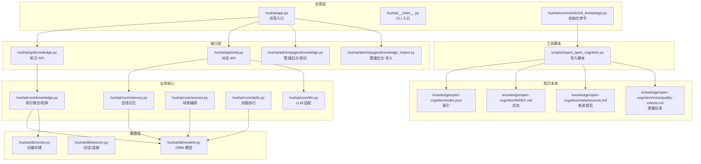
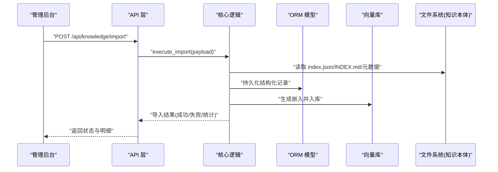
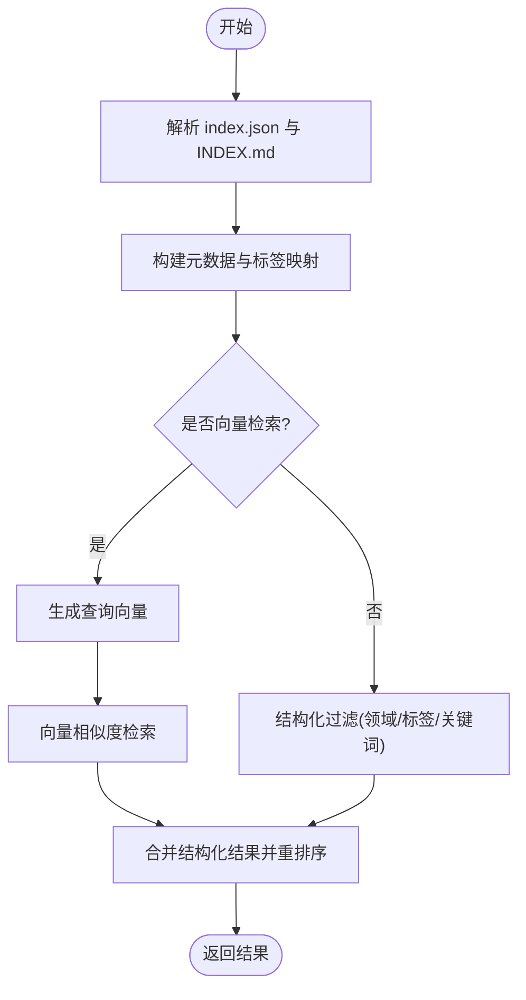
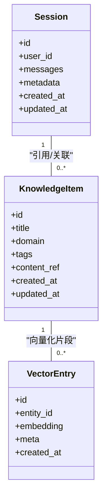
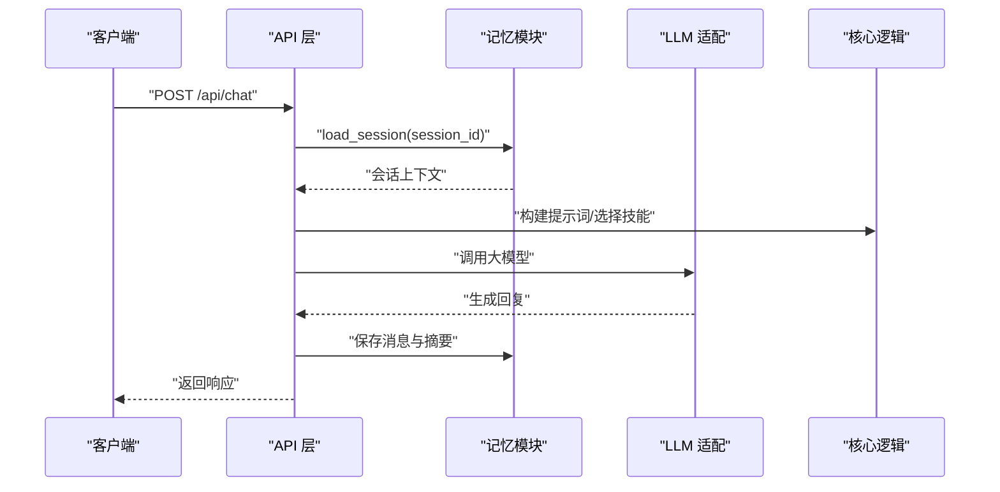
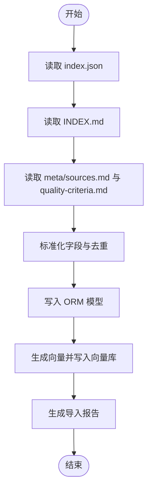
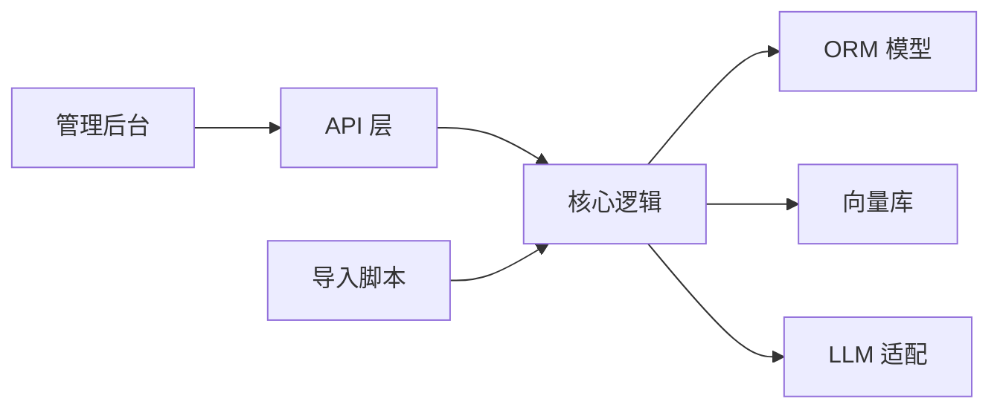

# Open Cognition 知识管理系统

<cite>
**本文引用的文件**   
- [README.md](file://README.md)
- [hushai/app.py](file://hushai/app.py)
- [hushai/config.py](file://hushai/config.py)
- [hushai/__main__.py](file://hushai/__main__.py)
- [hushai/commands/init_knowledge.py](file://hushai/commands/init_knowledge.py)
- [hushai/core/knowledge.py](file://hushai/core/knowledge.py)
- [hushai/core/memory.py](file://hushai/core/memory.py)
- [hushai/core/scenes.py](file://hushai/core/scenes.py)
- [hushai/core/skills.py](file://hushai/core/skills.py)
- [hushai/core/llm.py](file://hushai/core/llm.py)
- [hushai/db/models.py](file://hushai/db/models.py)
- [hushai/db/session.py](file://hushai/db/session.py)
- [hushai/db/vector.py](file://hushai/db/vector.py)
- [hushai/api/knowledge.py](file://hushai/api/knowledge.py)
- [hushai/api/chat.py](file://hushai/api/chat.py)
- [hushai/admin/pages/knowledge.py](file://hushai/admin/pages/knowledge.py)
- [hushai/admin/pages/knowledge_import.py](file://hushai/admin/pages/knowledge_import.py)
- [scripts/import_open_cognition.py](file://scripts/import_open_cognition.py)
- [knowledge/open-cognition/index.json](file://knowledge/open-cognition/index.json)
- [knowledge/open-cognition/INDEX.md](file://knowledge/open-cognition/INDEX.md)
- [knowledge/open-cognition/meta/sources.md](file://knowledge/open-cognition/meta/sources.md)
- [knowledge/open-cognition/meta/quality-criteria.md](file://knowledge/open-cognition/meta/quality-criteria.md)
</cite>

## 目录
1. [简介](#简介)
2. [项目结构](#项目结构)
3. [核心组件](#核心组件)
4. [架构总览](#架构总览)
5. [详细组件分析](#详细组件分析)
6. [依赖关系分析](#依赖关系分析)
7. [性能考虑](#性能考虑)
8. [故障排查指南](#故障排查指南)
9. [结论](#结论)
10. [附录](#附录)

## 简介
Open Cognition 知识管理系统是一个面向多领域（哲学、心理学、认知系统、伦理政治、宗教、社会学等）的结构化知识平台。系统以“概念—学派—技能—可视化”为组织主线，提供：
- 知识导入与索引构建
- 向量检索与语义搜索
- 管理后台的知识编辑与批量导入
- 面向前端的 API 服务
- 基于 LLM 的辅助能力（可选）

本仓库同时包含大量知识内容（Markdown 文档、技能模板、报告与可视化），以及用于将知识导入系统的脚本与命令。

## 项目结构
整体采用分层与模块化组织：
- hushai：应用主体（Web 服务、API、管理后台、核心逻辑、数据库与向量库）
- knowledge/open-cognition：知识本体（概念、学派、技能、元数据、报告与可视化）
- scripts：工具脚本（导入、测试、启动）
- tests：单元测试与集成测试
- docs：用户与架构文档

图表来源
- [hushai/app.py](file://hushai/app.py)
- [hushai/api/knowledge.py](file://hushai/api/knowledge.py)
- [hushai/api/chat.py](file://hushai/api/chat.py)
- [hushai/core/knowledge.py](file://hushai/core/knowledge.py)
- [hushai/core/memory.py](file://hushai/core/memory.py)
- [hushai/core/scenes.py](file://hushai/core/scenes.py)
- [hushai/core/skills.py](file://hushai/core/skills.py)
- [hushai/core/llm.py](file://hushai/core/llm.py)
- [hushai/db/models.py](file://hushai/db/models.py)
- [hushai/db/session.py](file://hushai/db/session.py)
- [hushai/db/vector.py](file://hushai/db/vector.py)
- [hushai/commands/init_knowledge.py](file://hushai/commands/init_knowledge.py)
- [scripts/import_open_cognition.py](file://scripts/import_open_cognition.py)
- [knowledge/open-cognition/index.json](file://knowledge/open-cognition/index.json)
- [knowledge/open-cognition/INDEX.md](file://knowledge/open-cognition/INDEX.md)
- [knowledge/open-cognition/meta/sources.md](file://knowledge/open-cognition/meta/sources.md)
- [knowledge/open-cognition/meta/quality-criteria.md](file://knowledge/open-cognition/meta/quality-criteria.md)

章节来源
- [README.md](file://README.md)

## 核心组件
- 应用与路由
  - 应用入口负责注册路由、挂载中间件、初始化配置与资源。
  - API 层暴露 RESTful 接口，供前端与管理后台调用。
- 核心业务
  - 知识模块：聚合知识条目、支持按标签/领域/关键词检索。
  - 记忆模块：维护会话上下文与短期记忆。
  - 场景与技能：定义可复用的任务流程与执行单元。
  - LLM 适配：封装外部大模型调用，统一提示词与输出处理。
- 数据持久化
  - ORM 模型：结构化存储知识、会话、审计日志等。
  - 向量库：承载文本嵌入与相似度检索。
- 管理后台
  - 知识浏览、详情查看、批量导入与校验。
- 导入与初始化
  - CLI 命令与脚本将 knowledge/open-cognition 下的索引与文档导入系统。

章节来源
- [hushai/app.py](file://hushai/app.py)
- [hushai/api/knowledge.py](file://hushai/api/knowledge.py)
- [hushai/api/chat.py](file://hushai/api/chat.py)
- [hushai/core/knowledge.py](file://hushai/core/knowledge.py)
- [hushai/core/memory.py](file://hushai/core/memory.py)
- [hushai/core/scenes.py](file://hushai/core/scenes.py)
- [hushai/core/skills.py](file://hushai/core/skills.py)
- [hushai/core/llm.py](file://hushai/core/llm.py)
- [hushai/db/models.py](file://hushai/db/models.py)
- [hushai/db/session.py](file://hushai/db/session.py)
- [hushai/db/vector.py](file://hushai/db/vector.py)
- [hushai/admin/pages/knowledge.py](file://hushai/admin/pages/knowledge.py)
- [hushai/admin/pages/knowledge_import.py](file://hushai/admin/pages/knowledge_import.py)
- [hushai/commands/init_knowledge.py](file://hushai/commands/init_knowledge.py)
- [scripts/import_open_cognition.py](file://scripts/import_open_cognition.py)

## 架构总览
系统采用“API + 核心逻辑 + 数据层”的分层架构，管理后台通过 Web 页面与 API 交互；导入流程由 CLI/脚本驱动，读取知识本体并写入数据库与向量库。

图表来源
- [hushai/api/knowledge.py](file://hushai/api/knowledge.py)
- [hushai/core/knowledge.py](file://hushai/core/knowledge.py)
- [hushai/db/models.py](file://hushai/db/models.py)
- [hushai/db/vector.py](file://hushai/db/vector.py)
- [knowledge/open-cognition/index.json](file://knowledge/open-cognition/index.json)
- [knowledge/open-cognition/INDEX.md](file://knowledge/open-cognition/INDEX.md)

## 详细组件分析

### 应用与路由（app.py）
- 职责
  - 创建并配置应用实例
  - 注册 API 与管理后台路由
  - 加载配置与环境变量
- 关键点
  - 集中式路由注册便于扩展
  - 中间件用于鉴权、审计、限流等横切关注点

章节来源
- [hushai/app.py](file://hushai/app.py)

### 配置（config.py）
- 职责
  - 统一管理数据库、向量库、LLM、安全与日志等配置
- 关键点
  - 支持环境变量覆盖
  - 提供默认值与校验

章节来源
- [hushai/config.py](file://hushai/config.py)

### CLI 入口与初始化命令
- __main__.py
  - 提供命令行入口，解析参数并调度子命令
- commands/init_knowledge.py
  - 提供“初始化知识”命令，内部调用导入脚本完成索引构建与入库

章节来源
- [hushai/__main__.py](file://hushai/__main__.py)
- [hushai/commands/init_knowledge.py](file://hushai/commands/init_knowledge.py)

### 知识核心（core/knowledge.py）
- 职责
  - 聚合知识条目、按领域/标签/关键词检索
  - 协调向量检索与结构化查询
- 关键流程
  - 解析索引与元数据
  - 构建倒排或标签索引
  - 结合向量相似度进行重排序

图表来源
- [hushai/core/knowledge.py](file://hushai/core/knowledge.py)
- [knowledge/open-cognition/index.json](file://knowledge/open-cognition/index.json)
- [knowledge/open-cognition/INDEX.md](file://knowledge/open-cognition/INDEX.md)

章节来源
- [hushai/core/knowledge.py](file://hushai/core/knowledge.py)

### 记忆与会话（core/memory.py）
- 职责
  - 维护会话上下文、短期记忆与历史摘要
- 关键点
  - 与 ORM 模型关联，持久化会话与消息
  - 支持清理与过期策略

章节来源
- [hushai/core/memory.py](file://hushai/core/memory.py)

### 场景与技能（core/scenes.py, core/skills.py）
- 场景
  - 编排多步骤任务（如“知识问答+引用溯源”）
- 技能
  - 定义可复用的原子能力（如“格式转换”、“摘要生成”）
- 关键点
  - 与数据库中的技能定义关联
  - 支持动态加载与参数注入

章节来源
- [hushai/core/scenes.py](file://hushai/core/scenes.py)
- [hushai/core/skills.py](file://hushai/core/skills.py)

### LLM 适配（core/llm.py）
- 职责
  - 统一对外部大模型的调用接口
  - 处理提示词模板、重试与错误码
- 关键点
  - 可插拔后端（不同厂商/模型）
  - 与记忆/场景协作，形成增强型工作流

章节来源
- [hushai/core/llm.py](file://hushai/core/llm.py)

### 数据层（db/models.py, db/session.py, db/vector.py）
- models.py
  - 定义知识、会话、审计等表结构与关系
- session.py
  - 管理数据库连接与会话生命周期
- vector.py
  - 封装向量库操作（插入、查询、删除、更新）

图表来源
- [hushai/db/models.py](file://hushai/db/models.py)
- [hushai/db/vector.py](file://hushai/db/vector.py)

章节来源
- [hushai/db/models.py](file://hushai/db/models.py)
- [hushai/db/session.py](file://hushai/db/session.py)
- [hushai/db/vector.py](file://hushai/db/vector.py)

### API 层（api/knowledge.py, api/chat.py）
- knowledge.py
  - 提供知识检索、详情、导入等接口
- chat.py
  - 提供对话接口，串联记忆与 LLM

图表来源
- [hushai/api/chat.py](file://hushai/api/chat.py)
- [hushai/core/memory.py](file://hushai/core/memory.py)
- [hushai/core/llm.py](file://hushai/core/llm.py)

章节来源
- [hushai/api/knowledge.py](file://hushai/api/knowledge.py)
- [hushai/api/chat.py](file://hushai/api/chat.py)

### 管理后台（admin/pages/knowledge.py, admin/pages/knowledge_import.py）
- knowledge.py
  - 展示知识列表、筛选与详情
- knowledge_import.py
  - 提供导入表单与进度反馈，调用导入 API

章节来源
- [hushai/admin/pages/knowledge.py](file://hushai/admin/pages/knowledge.py)
- [hushai/admin/pages/knowledge_import.py](file://hushai/admin/pages/knowledge_import.py)

### 导入脚本（scripts/import_open_cognition.py）
- 职责
  - 读取 knowledge/open-cognition 下的索引与元数据
  - 清洗与标准化后写入数据库与向量库
- 输入
  - index.json、INDEX.md、meta/sources.md、meta/quality-criteria.md
- 输出
  - 结构化知识条目、标签映射、向量嵌入

图表来源
- [scripts/import_open_cognition.py](file://scripts/import_open_cognition.py)
- [knowledge/open-cognition/index.json](file://knowledge/open-cognition/index.json)
- [knowledge/open-cognition/INDEX.md](file://knowledge/open-cognition/INDEX.md)
- [knowledge/open-cognition/meta/sources.md](file://knowledge/open-cognition/meta/sources.md)
- [knowledge/open-cognition/meta/quality-criteria.md](file://knowledge/open-cognition/meta/quality-criteria.md)

章节来源
- [scripts/import_open_cognition.py](file://scripts/import_open_cognition.py)
- [knowledge/open-cognition/index.json](file://knowledge/open-cognition/index.json)
- [knowledge/open-cognition/INDEX.md](file://knowledge/open-cognition/INDEX.md)
- [knowledge/open-cognition/meta/sources.md](file://knowledge/open-cognition/meta/sources.md)
- [knowledge/open-cognition/meta/quality-criteria.md](file://knowledge/open-cognition/meta/quality-criteria.md)

## 依赖关系分析
- 耦合度
  - API 层对核心逻辑低耦合，便于替换实现
  - 核心逻辑对数据层抽象良好，可通过配置切换存储后端
- 外部依赖
  - 数据库与向量库通过配置注入
  - LLM 后端通过适配器模式解耦

图表来源
- [hushai/app.py](file://hushai/app.py)
- [hushai/api/knowledge.py](file://hushai/api/knowledge.py)
- [hushai/core/knowledge.py](file://hushai/core/knowledge.py)
- [hushai/db/models.py](file://hushai/db/models.py)
- [hushai/db/vector.py](file://hushai/db/vector.py)
- [hushai/core/llm.py](file://hushai/core/llm.py)

章节来源
- [hushai/app.py](file://hushai/app.py)
- [hushai/api/knowledge.py](file://hushai/api/knowledge.py)
- [hushai/core/knowledge.py](file://hushai/core/knowledge.py)
- [hushai/db/models.py](file://hushai/db/models.py)
- [hushai/db/vector.py](file://hushai/db/vector.py)
- [hushai/core/llm.py](file://hushai/core/llm.py)

## 性能考虑
- 向量检索
  - 建议对高频查询建立缓存层（如 Redis）
  - 合理设置 chunk 大小与维度，平衡精度与吞吐
- 数据库
  - 对常用查询字段建立索引（领域、标签、更新时间）
  - 分页与游标查询避免全表扫描
- 并发与限流
  - 在 API 层增加请求限流与熔断保护
  - 长耗时任务异步化（导入、批量嵌入）
- I/O 优化
  - 导入时批量写入与事务控制
  - 使用连接池与连接复用

[本节为通用指导，不直接分析具体文件]

## 故障排查指南
- 导入失败
  - 检查 index.json 与 INDEX.md 的完整性与编码
  - 确认元数据字段符合 sources.md 与 quality-criteria.md 的要求
  - 查看导入日志定位具体条目
- 检索无结果
  - 确认向量库已正确写入且索引生效
  - 检查标签与领域映射是否正确
  - 调整相似度阈值与重排序策略
- 对话异常
  - 核对 LLM 配置与密钥
  - 检查会话上下文长度与截断策略
  - 查看错误码与重试次数

章节来源
- [hushai/api/knowledge.py](file://hushai/api/knowledge.py)
- [hushai/core/knowledge.py](file://hushai/core/knowledge.py)
- [hushai/core/memory.py](file://hushai/core/memory.py)
- [hushai/core/llm.py](file://hushai/core/llm.py)
- [knowledge/open-cognition/meta/sources.md](file://knowledge/open-cognition/meta/sources.md)
- [knowledge/open-cognition/meta/quality-criteria.md](file://knowledge/open-cognition/meta/quality-criteria.md)

## 结论
Open Cognition 知识管理系统以清晰的分层架构与模块化设计，实现了从知识本体到检索、对话与可视化的完整闭环。通过标准化的导入流程与可扩展的核心逻辑，系统具备良好的可维护性与演进空间。后续可在缓存、异步化与监控方面持续优化，以提升稳定性与用户体验。

[本节为总结性内容，不直接分析具体文件]

## 附录
- 快速上手
  - 安装依赖并配置环境变量
  - 运行初始化命令导入知识
  - 启动服务并通过管理后台或 API 验证
- 相关文档
  - 参考 README 与 docs 目录获取更详细的安装与使用说明

章节来源
- [README.md](file://README.md)