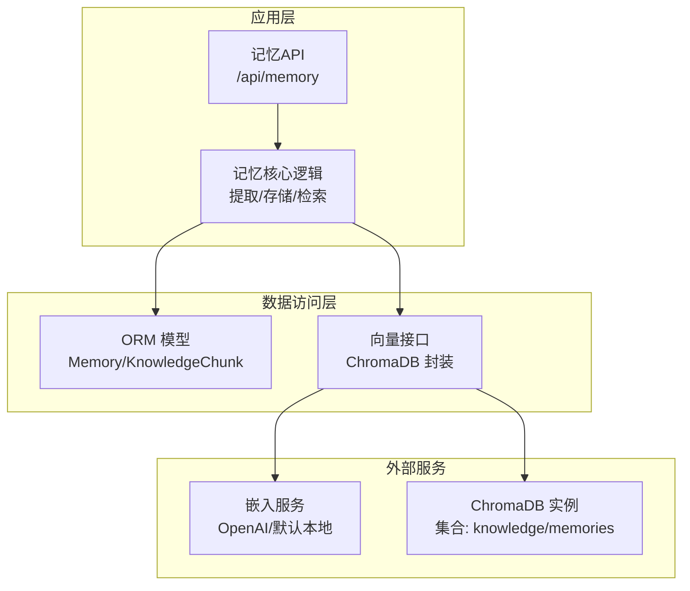
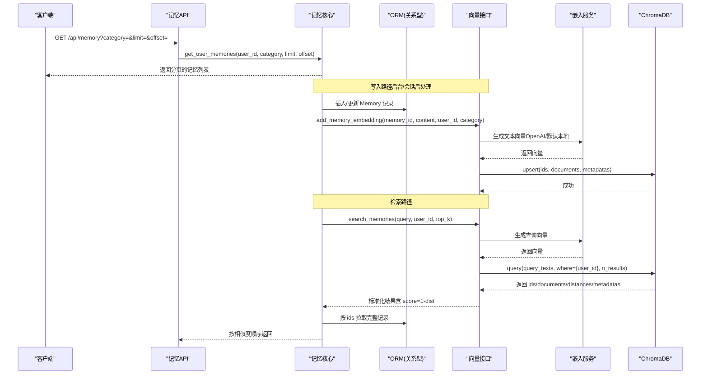
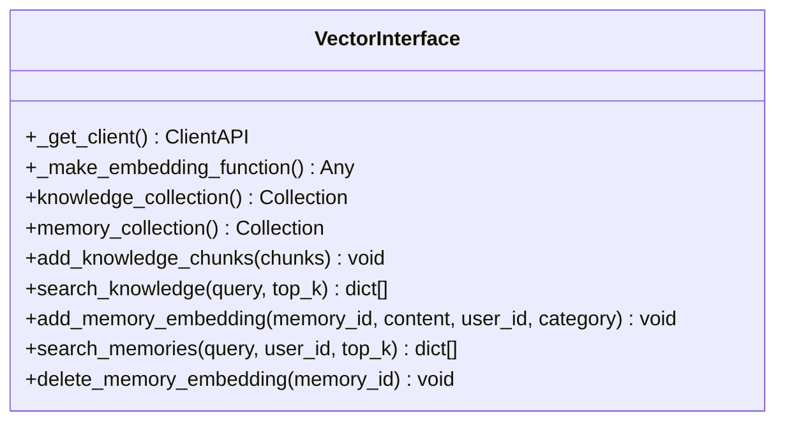
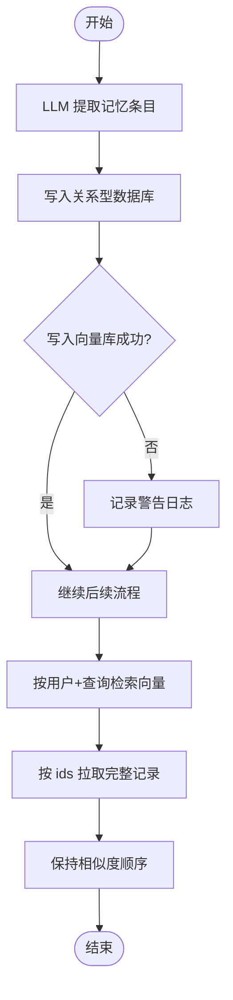
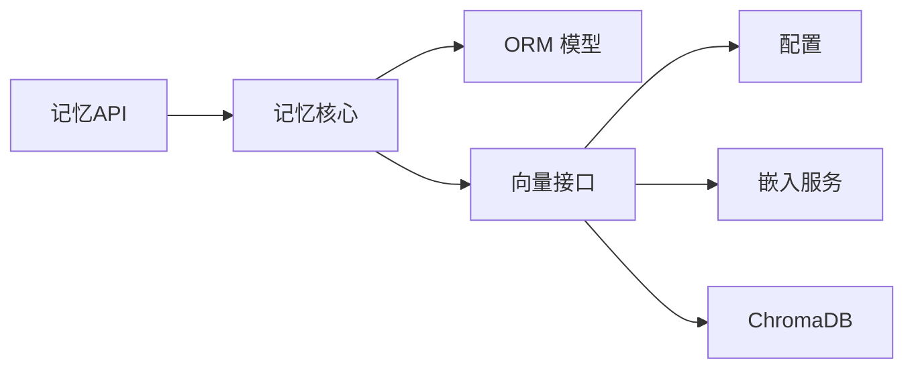

# 向量存储与检索

<cite>
**本文引用的文件**   
- [hushai/meditation/db/vector.py](file://hushai/meditation/db/vector.py)
- [hushai/meditation/core/memory.py](file://hushai/meditation/core/memory.py)
- [hushai/meditation/config.py](file://hushai/meditation/config.py)
- [hushai/meditation/schemas.py](file://hushai/meditation/schemas.py)
- [hushai/meditation/db/models.py](file://hushai/meditation/db/models.py)
- [hushai/meditation/api/memory.py](file://hushai/meditation/api/memory.py)
- [tests/meditation/test_vector.py](file://tests/meditation/test_vector.py)
</cite>

## 目录
1. [简介](#简介)
2. [项目结构](#项目结构)
3. [核心组件](#核心组件)
4. [架构总览](#架构总览)
5. [详细组件分析](#详细组件分析)
6. [依赖关系分析](#依赖关系分析)
7. [性能考虑](#性能考虑)
8. [故障排查指南](#故障排查指南)
9. [结论](#结论)
10. [附录](#附录)

## 简介
本技术文档围绕“向量存储与检索”主题，系统阐述本项目中基于 ChromaDB 的向量数据库集成方案。内容涵盖：
- 连接配置与集合管理（持久化/内存模式、集合创建与元数据）
- 文本向量化过程（嵌入模型选择、OpenAI 兼容接入、默认本地回退）
- 相似度计算与匹配策略（HNSW + 余弦相似度）
- 语义检索优化（索引构建、查询过滤、结果排序）
- 具体代码示例路径（增删改查操作）
- 性能调优与容量规划最佳实践
- add_memory_embedding 与 search_memories 的实现细节与参数说明

## 项目结构
与向量存储与检索相关的核心模块分布如下：
- 向量数据库接口层：封装 ChromaDB Client/Collection 的获取、集合初始化、上下文的嵌入函数注入
- 记忆业务层：负责从对话中提取长期记忆、持久化到关系型数据库并写入向量库、按用户维度进行语义检索
- 配置层：提供嵌入提供商、模型、API Key、Chroma 持久化目录等配置项
- API 层：暴露记忆列表查询接口（认证鉴权）
- 数据模型：定义 Memory、KnowledgeChunk 等 ORM 实体
- 测试用例：覆盖向量库关键路径的行为验证

图表来源
- [hushai/meditation/api/memory.py:1-61](file://hushai/meditation/api/memory.py#L1-L61)
- [hushai/meditation/core/memory.py:1-206](file://hushai/meditation/core/memory.py#L1-L206)
- [hushai/meditation/db/vector.py:1-179](file://hushai/meditation/db/vector.py#L1-L179)
- [hushai/meditation/db/models.py:98-118](file://hushai/meditation/db/models.py#L98-L118)

章节来源
- [hushai/meditation/api/memory.py:1-61](file://hushai/meditation/api/memory.py#L1-L61)
- [hushai/meditation/core/memory.py:1-206](file://hushai/meditation/core/memory.py#L1-L206)
- [hushai/meditation/db/vector.py:1-179](file://hushai/meditation/db/vector.py#L1-L179)
- [hushai/meditation/db/models.py:98-118](file://hushai/meditation/db/models.py#L98-L118)

## 核心组件
- 向量接口层（ChromaDB 封装）
  - 客户端生命周期管理：根据配置选择 PersistentClient 或内存 Client
  - 集合管理：knowledge、memories 两个集合，均使用 HNSW + cosine 空间
  - 嵌入函数：优先 OpenAIEmbeddingFunction，未配置时回退 DefaultEmbeddingFunction
  - 数据操作：upsert、query、delete 等
- 记忆核心逻辑
  - 记忆提取：通过 LLM 将对话结构化提取为多类别记忆条目
  - 记忆存储：写入关系型数据库后，异步写入向量库
  - 记忆检索：按用户维度在向量库中进行语义检索，再回表取完整记录并按相似度排序
- 配置中心
  - 嵌入相关：embedding_provider、embedding_model、embedding_api_key、embedding_base_url
  - Chroma 持久化：chroma_persist_dir
  - 检索规模：memory_top_k、knowledge_top_k

章节来源
- [hushai/meditation/db/vector.py:15-58](file://hushai/meditation/db/vector.py#L15-L58)
- [hushai/meditation/db/vector.py:61-78](file://hushai/meditation/db/vector.py#L61-L78)
- [hushai/meditation/core/memory.py:45-112](file://hushai/meditation/core/memory.py#L45-L112)
- [hushai/meditation/core/memory.py:115-138](file://hushai/meditation/core/memory.py#L115-L138)
- [hushai/meditation/config.py:44-47](file://hushai/meditation/config.py#L44-L47)
- [hushai/meditation/config.py:40-41](file://hushai/meditation/config.py#L40-L41)

## 架构总览
下图展示了从 API 请求到向量检索的端到端流程，以及记忆写入时的双写路径（关系型数据库 + 向量库）。

图表来源
- [hushai/meditation/api/memory.py:27-61](file://hushai/meditation/api/memory.py#L27-L61)
- [hushai/meditation/core/memory.py:79-138](file://hushai/meditation/core/memory.py#L79-L138)
- [hushai/meditation/db/vector.py:130-173](file://hushai/meditation/db/vector.py#L130-L173)

## 详细组件分析

### 组件A：ChromaDB 向量接口层
职责与要点
- 客户端初始化：支持持久化目录与匿名遥测关闭
- 集合创建：knowledge、memories 集合，设置 HNSW 空间为 cosine
- 嵌入函数：当 embedding_provider=openai 且存在有效 key 时使用 OpenAIEmbeddingFunction；否则回退 DefaultEmbeddingFunction
- 数据操作：
  - add_knowledge_chunks：批量 upsert 知识片段，附带标题、标签、来源、父ID等元数据
  - add_memory_embedding：单条记忆 upsert，附带 user_id、category
  - search_knowledge：按 query 检索，返回包含 id、content、score、title、tags、source 的结构
  - search_memories：按 query + user_id 过滤检索，返回 id、content、score、category
  - delete_memory_embedding：按 memory_id 删除

图表来源
- [hushai/meditation/db/vector.py:15-58](file://hushai/meditation/db/vector.py#L15-L58)
- [hushai/meditation/db/vector.py:61-78](file://hushai/meditation/db/vector.py#L61-L78)
- [hushai/meditation/db/vector.py:81-127](file://hushai/meditation/db/vector.py#L81-L127)
- [hushai/meditation/db/vector.py:130-179](file://hushai/meditation/db/vector.py#L130-L179)

章节来源
- [hushai/meditation/db/vector.py:15-58](file://hushai/meditation/db/vector.py#L15-L58)
- [hushai/meditation/db/vector.py:61-78](file://hushai/meditation/db/vector.py#L61-L78)
- [hushai/meditation/db/vector.py:81-127](file://hushai/meditation/db/vector.py#L81-L127)
- [hushai/meditation/db/vector.py:130-179](file://hushai/meditation/db/vector.py#L130-L179)

### 组件B：记忆核心逻辑（提取/存储/检索）
职责与要点
- 记忆提取：调用 LLM 对对话内容进行结构化抽取，输出类别、内容、摘要、重要度
- 记忆存储：先写入关系型数据库，再写入向量库；写入失败仅告警不阻断主流程
- 记忆检索：按用户维度在向量库中检索，再回表取完整记录，保持相似度顺序
- 上下文组装：将相关记忆摘要拼接为提示词上下文片段

图表来源
- [hushai/meditation/core/memory.py:45-112](file://hushai/meditation/core/memory.py#L45-L112)
- [hushai/meditation/core/memory.py:115-138](file://hushai/meditation/core/memory.py#L115-L138)

章节来源
- [hushai/meditation/core/memory.py:45-112](file://hushai/meditation/core/memory.py#L45-L112)
- [hushai/meditation/core/memory.py:115-138](file://hushai/meditation/core/memory.py#L115-L138)

### 组件C：配置与嵌入模型选择
职责与要点
- 嵌入提供商：支持 openai；若未配置有效 key，则使用默认本地嵌入
- 模型与基地址：可分别指定 embedding_model、embedding_base_url，或复用 openai_* 字段
- Chroma 持久化：chroma_persist_dir 为空时使用内存模式
- 检索规模：memory_top_k、knowledge_top_k 控制返回数量

章节来源
- [hushai/meditation/config.py:44-47](file://hushai/meditation/config.py#L44-L47)
- [hushai/meditation/config.py:40-41](file://hushai/meditation/config.py#L40-L41)
- [hushai/meditation/config.py:64-115](file://hushai/meditation/config.py#L64-L115)

### 组件D：API 层（记忆列表）
职责与要点
- 认证：从 Authorization 头解析 Bearer Token，校验当前用户 ID
- 查询：支持按 category 过滤、分页 limit/offset
- 响应：返回 MemoryItem 列表及总数

章节来源
- [hushai/meditation/api/memory.py:16-61](file://hushai/meditation/api/memory.py#L16-L61)

### 组件E：数据模型（ORM）
职责与要点
- Memory：用户维度、类别、内容、摘要、重要度、状态、时间戳
- KnowledgeChunk：标题、内容、标签、父子关系、来源、分块序号

章节来源
- [hushai/meditation/db/models.py:98-118](file://hushai/meditation/db/models.py#L98-L118)
- [hushai/meditation/db/models.py:137-151](file://hushai/meditation/db/models.py#L137-L151)

## 依赖关系分析
- 组件耦合
  - 记忆核心依赖向量接口与 ORM 模型
  - 向量接口依赖配置与外部嵌入服务
  - API 层依赖记忆核心与认证中间件
- 外部依赖
  - ChromaDB：集合管理与近似最近邻搜索
  - OpenAI 兼容嵌入服务：可选，用于高质量向量生成
- 潜在循环依赖
  - 当前设计分层清晰，未见直接循环导入

图表来源
- [hushai/meditation/api/memory.py:1-61](file://hushai/meditation/api/memory.py#L1-L61)
- [hushai/meditation/core/memory.py:1-206](file://hushai/meditation/core/memory.py#L1-L206)
- [hushai/meditation/db/vector.py:1-179](file://hushai/meditation/db/vector.py#L1-L179)
- [hushai/meditation/config.py:1-136](file://hushai/meditation/config.py#L1-L136)

章节来源
- [hushai/meditation/api/memory.py:1-61](file://hushai/meditation/api/memory.py#L1-L61)
- [hushai/meditation/core/memory.py:1-206](file://hushai/meditation/core/memory.py#L1-L206)
- [hushai/meditation/db/vector.py:1-179](file://hushai/meditation/db/vector.py#L1-L179)
- [hushai/meditation/config.py:1-136](file://hushai/meditation/config.py#L1-L136)

## 性能考虑
- 索引与相似度
  - 集合元数据 hnsw:space=cosine，采用 HNSW 近似最近邻算法与余弦相似度
  - 余弦距离越小表示越相似；检索结果 score=1-dist，便于直观排序
- 查询优化
  - 使用 where 条件限定 user_id，减少候选集规模
  - 合理设置 top_k，避免过大导致网络与序列化开销
- 写入优化
  - 批量 upsert 知识片段，降低 RPC 次数
  - 写入失败仅告警，确保主流程稳定
- 容量规划
  - 启用 chroma_persist_dir 实现持久化，避免进程重启丢失
  - 关注向量维度与文档长度，合理切分知识片段，提升检索质量
- 嵌入服务
  - 配置 OpenAI 兼容 base_url 可实现私有化部署或代理
  - 未配置 key 时回退默认本地嵌入，适合离线/低成本场景

[本节为通用指导，无需特定文件引用]

## 故障排查指南
- 常见问题
  - 无结果返回：检查集合是否为空、top_k 是否大于实际记录数、where 条件是否正确
  - 向量写入失败：查看警告日志，确认嵌入服务可用性与网络连通性
  - 认证失败：确认 Authorization 头格式与 token 有效性
- 定位方法
  - 单元测试覆盖关键路径，可参考测试用例快速复现问题
  - 开启调试模式，观察向量接口与嵌入服务的交互

章节来源
- [tests/meditation/test_vector.py:25-72](file://tests/meditation/test_vector.py#L25-L72)
- [tests/meditation/test_vector.py:74-130](file://tests/meditation/test_vector.py#L74-L130)
- [tests/meditation/test_vector.py:132-193](file://tests/meditation/test_vector.py#L132-L193)

## 结论
本项目通过清晰的层次划分与稳定的外部依赖封装，实现了健壮的向量存储与检索能力。ChromaDB 的 HNSW + cosine 组合提供了高效的近似最近邻搜索；结合用户维度的过滤与合理的 top_k 控制，可在保证召回质量的同时兼顾性能。嵌入服务支持 OpenAI 兼容与本地回退，适配多种部署环境。建议在生产环境中启用持久化、监控嵌入服务可用性，并结合业务指标持续优化 top_k 与分块策略。

[本节为总结性内容，无需特定文件引用]

## 附录

### A. add_memory_embedding 与 search_memories 实现细节与参数
- add_memory_embedding
  - 参数：memory_id、content、user_id、category
  - 行为：将单条记忆 upsert 到 memories 集合，元数据包含 user_id 与 category
  - 用途：在记忆写入关系型数据库后，同步写入向量库以便语义检索
- search_memories
  - 参数：query、user_id、top_k
  - 行为：按 query 生成向量，使用 where={user_id} 过滤，返回前 top_k 条结果；结果包含 id、content、score、category
  - 用途：为用户个性化检索其历史记忆

章节来源
- [hushai/meditation/db/vector.py:130-142](file://hushai/meditation/db/vector.py#L130-L142)
- [hushai/meditation/db/vector.py:144-173](file://hushai/meditation/db/vector.py#L144-L173)

### B. 相似度计算与匹配策略
- 算法：HNSW 近似最近邻 + 余弦相似度
- 配置：集合元数据 hnsw:space=cosine
- 评分：dist 为余弦距离，score=1-dist，越大越相似

章节来源
- [hushai/meditation/db/vector.py:61-78](file://hushai/meditation/db/vector.py#L61-L78)
- [hushai/meditation/db/vector.py:104-127](file://hushai/meditation/db/vector.py#L104-L127)
- [hushai/meditation/db/vector.py:144-173](file://hushai/meditation/db/vector.py#L144-L173)

### C. 文本向量化与嵌入模型选择
- 提供商：openai
- 模型：embedding_model（如 text-embedding-3-small）
- 基地址：embedding_base_url（或 openai_base_url）
- 密钥：embedding_api_key（或 openai_api_key）
- 回退：未配置有效 key 时使用默认本地嵌入

章节来源
- [hushai/meditation/db/vector.py:43-58](file://hushai/meditation/db/vector.py#L43-L58)
- [hushai/meditation/config.py:44-47](file://hushai/meditation/config.py#L44-L47)

### D. 集合管理与数据操作示例路径
- 集合管理
  - knowledge_collection、memory_collection：获取或创建集合
- 数据操作
  - add_knowledge_chunks：批量写入知识片段
  - search_knowledge：知识检索
  - add_memory_embedding：记忆写入
  - search_memories：记忆检索
  - delete_memory_embedding：记忆删除

章节来源
- [hushai/meditation/db/vector.py:61-78](file://hushai/meditation/db/vector.py#L61-L78)
- [hushai/meditation/db/vector.py:81-127](file://hushai/meditation/db/vector.py#L81-L127)
- [hushai/meditation/db/vector.py:130-179](file://hushai/meditation/db/vector.py#L130-L179)

### E. 配置项与环境变量映射（节选）
- MEDITATION_EMBEDDING_PROVIDER：嵌入提供商
- MEDITATION_EMBEDDING_MODEL：嵌入模型名
- MEDITATION_EMBEDDING_API_KEY：嵌入 API Key
- MEDITATION_EMBEDDING_BASE_URL：嵌入 Base URL
- MEDITATION_CHROMA_DIR：Chroma 持久化目录
- MEDITATION_MEMORY_TOP_K：记忆检索 top_k
- MEDITATION_KNOWLEDGE_TOP_K：知识检索 top_k

章节来源
- [hushai/meditation/config.py:64-115](file://hushai/meditation/config.py#L64-L115)