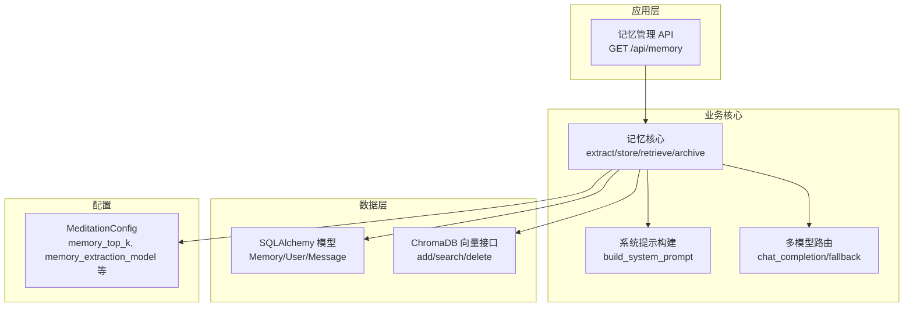
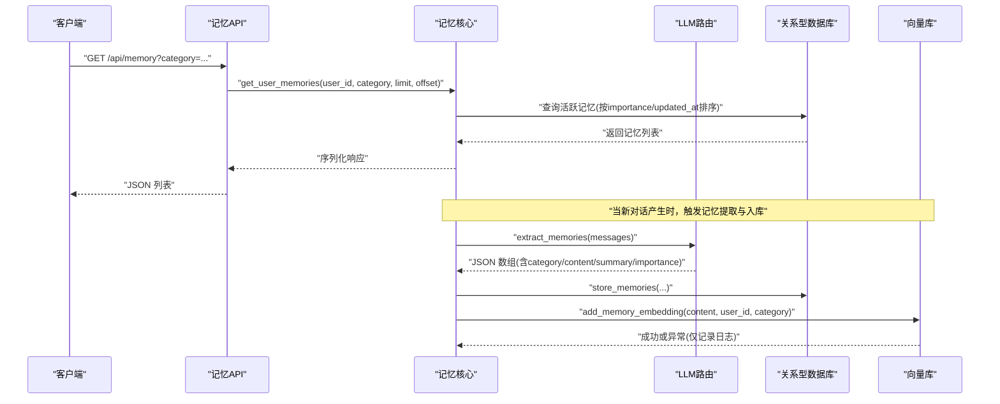
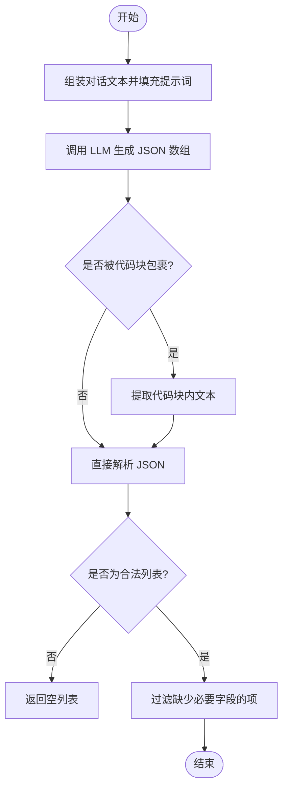
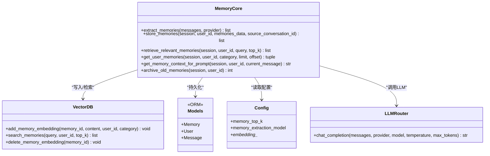

# 记忆提取算法

<cite>
**本文引用的文件**   
- [hushai/meditation/core/memory.py](file://hushai/meditation/core/memory.py)
- [hushai/meditation/core/prompt.py](file://hushai/meditation/core/prompt.py)
- [hushai/meditation/db/models.py](file://hushai/meditation/db/models.py)
- [hushai/meditation/db/vector.py](file://hushai/meditation/db/vector.py)
- [hushai/meditation/config.py](file://hushai/meditation/config.py)
- [hushai/meditation/api/memory.py](file://hushai/meditation/api/memory.py)
- [hushai/meditation/core/llm.py](file://hushai/meditation/core/llm.py)
- [tests/meditation/test_core.py](file://tests/meditation/test_core.py)
</cite>

## 目录
1. [引言](#引言)
2. [项目结构](#项目结构)
3. [核心组件](#核心组件)
4. [架构总览](#架构总览)
5. [详细组件分析](#详细组件分析)
6. [依赖关系分析](#依赖关系分析)
7. [性能与可扩展性](#性能与可扩展性)
8. [故障排查指南](#故障排查指南)
9. [结论](#结论)
10. [附录：提示词设计与分类体系](#附录提示词设计与分类体系)

## 引言
本技术文档围绕“记忆提取算法”展开，系统性阐述从对话历史中智能提取关键信息的流程与方法。内容涵盖自然语言处理（基于大模型）的提示工程、关键词识别与情感分析的融入方式、不同类型记忆的提取规则（事实性信息、情感状态、用户偏好、行为模式）、重要性评估机制、错误处理策略，以及 MEMORY_EXTRACTION_PROMPT 的设计原理与七类记忆的定义和使用场景。同时提供可操作的自定义建议与代码级参考路径，帮助读者在现有实现基础上进行扩展与调优。

## 项目结构
记忆提取相关代码主要位于 meditation 模块下，涉及核心逻辑、数据库模型、向量检索、API 路由、配置与大模型调用等层次。

图表来源
- [hushai/meditation/api/memory.py:1-61](file://hushai/meditation/api/memory.py#L1-L61)
- [hushai/meditation/core/memory.py:1-206](file://hushai/meditation/core/memory.py#L1-L206)
- [hushai/meditation/core/prompt.py:1-130](file://hushai/meditation/core/prompt.py#L1-L130)
- [hushai/meditation/db/models.py:98-118](file://hushai/meditation/db/models.py#L98-L118)
- [hushai/meditation/db/vector.py:130-179](file://hushai/meditation/db/vector.py#L130-L179)
- [hushai/meditation/config.py:18-52](file://hushai/meditation/config.py#L18-L52)

章节来源
- [hushai/meditation/api/memory.py:1-61](file://hushai/meditation/api/memory.py#L1-L61)
- [hushai/meditation/core/memory.py:1-206](file://hushai/meditation/core/memory.py#L1-L206)
- [hushai/meditation/db/models.py:98-118](file://hushai/meditation/db/models.py#L98-L118)
- [hushai/meditation/db/vector.py:130-179](file://hushai/meditation/db/vector.py#L130-L179)
- [hushai/meditation/config.py:18-52](file://hushai/meditation/config.py#L18-L52)

## 核心组件
- 记忆提取器：将对话消息序列转换为结构化记忆条目，包含类别、内容、摘要与重要度评分。
- 存储与索引：持久化到关系型数据库，并同步写入向量库以支持语义检索。
- 检索与上下文注入：根据当前消息语义召回相关记忆，拼接为系统提示的一部分，增强对话个性化。
- 生命周期管理：按重要度与时间阈值归档低价值记忆，控制长期存储规模。
- 提示工程：通过 MEMORY_EXTRACTION_PROMPT 定义七类记忆及输出格式；通过 build_system_prompt 将记忆上下文注入对话。

章节来源
- [hushai/meditation/core/memory.py:18-76](file://hushai/meditation/core/memory.py#L18-L76)
- [hushai/meditation/core/memory.py:79-112](file://hushai/meditation/core/memory.py#L79-L112)
- [hushai/meditation/core/memory.py:115-138](file://hushai/meditation/core/memory.py#L115-L138)
- [hushai/meditation/core/memory.py:161-186](file://hushai/meditation/core/memory.py#L161-L186)
- [hushai/meditation/core/memory.py:189-205](file://hushai/meditation/core/memory.py#L189-L205)
- [hushai/meditation/core/prompt.py:77-103](file://hushai/meditation/core/prompt.py#L77-L103)

## 架构总览
下图展示一次完整的“记忆提取—存储—检索—注入”流程，包括异常降级与向量失败隔离。

图表来源
- [hushai/meditation/api/memory.py:27-61](file://hushai/meditation/api/memory.py#L27-L61)
- [hushai/meditation/core/memory.py:45-76](file://hushai/meditation/core/memory.py#L45-L76)
- [hushai/meditation/core/memory.py:79-112](file://hushai/meditation/core/memory.py#L79-L112)
- [hushai/meditation/db/vector.py:130-141](file://hushai/meditation/db/vector.py#L130-L141)

## 详细组件分析

### 记忆提取器 extract_memories
- 输入：消息列表（角色与内容），可选 provider 指定 LLM 提供商。
- 处理：
  - 组装对话文本，填充至 MEMORY_EXTRACTION_PROMPT。
  - 调用 chat_completion，temperature 较低以保证稳定 JSON 输出。
  - 清理可能的 Markdown 代码块包裹，解析 JSON，过滤无效条目。
- 输出：结构化记忆数组，每项包含 category、content、summary、importance。
- 错误处理：捕获 JSON 解析异常并记录警告，返回空列表，确保主流程不中断。

图表来源
- [hushai/meditation/core/memory.py:45-76](file://hushai/meditation/core/memory.py#L45-L76)

章节来源
- [hushai/meditation/core/memory.py:45-76](file://hushai/meditation/core/memory.py#L45-L76)
- [tests/meditation/test_core.py:144-217](file://tests/meditation/test_core.py#L144-L217)

### 存储与索引 store_memories
- 字段映射：category、content、summary、importance（归一化到 0.0-1.0）。
- 事务性：逐条写入后 flush，保证后续向量写入使用已分配 ID。
- 向量写入：try/except 包裹，失败仅记录日志，不阻断主流程。
- 元数据：user_id、category 作为向量集合的过滤条件。

章节来源
- [hushai/meditation/core/memory.py:79-112](file://hushai/meditation/core/memory.py#L79-L112)
- [hushai/meditation/db/vector.py:130-141](file://hushai/meditation/db/vector.py#L130-L141)

### 检索 retrieve_relevant_memories 与上下文注入 get_memory_context_for_prompt
- 语义检索：基于当前消息 query，在向量库中按 cosine 相似度召回 top_k。
- 结果排序：保持向量库返回顺序，过滤非活跃状态。
- 上下文拼接：将每条记忆以“[类别标签] 摘要/前缀”形式组织，供系统提示使用。

章节来源
- [hushai/meditation/core/memory.py:115-138](file://hushai/meditation/core/memory.py#L115-L138)
- [hushai/meditation/core/memory.py:161-186](file://hushai/meditation/core/memory.py#L161-L186)
- [hushai/meditation/core/prompt.py:77-103](file://hushai/meditation/core/prompt.py#L77-L103)

### 生命周期管理 archive_old_memories
- 归档条件：active 状态、importance < 0.3、超过 90 天未更新。
- 目的：降低长期存储成本，保留高价值记忆。

章节来源
- [hushai/meditation/core/memory.py:189-205](file://hushai/meditation/core/memory.py#L189-L205)

### 数据模型 Memory
- 关键字段：id、user_id、category、content、summary、importance、status、时间戳、source_conversation_id。
- 索引：user_id + category 复合索引，提升按类别分页查询效率。
- 关系：与 User 一对多关联。

章节来源
- [hushai/meditation/db/models.py:98-118](file://hushai/meditation/db/models.py#L98-L118)

### API 路由 GET /api/memory
- 鉴权：Bearer Token 校验，获取当前用户 ID。
- 参数：category、limit、offset。
- 响应：MemoryListResponse，包含 memories 列表与 total 计数。

章节来源
- [hushai/meditation/api/memory.py:1-61](file://hushai/meditation/api/memory.py#L1-L61)

### 配置 MeditationConfig
- 关键选项：
  - memory_top_k：默认 5，控制检索数量。
  - memory_extraction_model：可选覆盖默认模型用于记忆提取。
  - embedding_provider/model/key/base_url：控制向量嵌入。
- 环境变量映射：支持 .env 加载与运行时 set_config 覆盖。

章节来源
- [hushai/meditation/config.py:18-52](file://hushai/meditation/config.py#L18-L52)
- [hushai/meditation/config.py:64-115](file://hushai/meditation/config.py#L64-L115)

### LLM 路由与降级
- 多提供商：deepseek、zhipu、kimi、openai，自动降级顺序。
- 调试模式：无 API Key 时走 mock 回复，便于本地验证。
- 错误转换：OpenAIError 统一格式化为用户友好中文错误。

章节来源
- [hushai/meditation/core/llm.py:1-258](file://hushai/meditation/core/llm.py#L1-L258)

## 依赖关系分析
- 模块耦合：
  - memory.py 依赖 config、llm、vector、models。
  - api/memory.py 依赖 auth、core/memory、db/session、schemas。
  - vector.py 依赖 config 与 chromadb。
- 外部依赖：
  - OpenAI SDK（兼容多提供商）。
  - ChromaDB（向量检索）。
  - SQLAlchemy（异步 ORM）。

图表来源
- [hushai/meditation/core/memory.py:1-206](file://hushai/meditation/core/memory.py#L1-L206)
- [hushai/meditation/db/vector.py:130-179](file://hushai/meditation/db/vector.py#L130-L179)
- [hushai/meditation/db/models.py:98-118](file://hushai/meditation/db/models.py#L98-L118)
- [hushai/meditation/config.py:18-52](file://hushai/meditation/config.py#L18-L52)
- [hushai/meditation/core/llm.py:136-179](file://hushai/meditation/core/llm.py#L136-L179)

## 性能与可扩展性
- 提取频率优化：每轮都提取成本高，建议在引擎层增加“偶数轮提取”或“每会话最多 N 次”的策略，以降低 LLM 调用次数与延迟。
- 向量失败隔离：向量写入异常不影响主流程，但需监控与重试策略，避免长期缺失索引。
- 检索参数可调：memory_top_k 影响上下文长度与质量，可按用户活跃度动态调整。
- 归档策略：importance 阈值与时间窗口可根据业务目标调优，平衡存储成本与信息可用性。

[本节为通用指导，无需具体文件引用]

## 故障排查指南
- JSON 解析失败：检查 LLM 输出是否严格遵循 JSON 数组格式；必要时提高 temperature 稳定性或限制最大 token。
- 向量写入失败：确认 embedding_provider 与 key 配置正确；查看日志中的 memory_id 定位问题。
- 检索为空：确认向量集合存在且用户维度过滤正确；检查 top_k 与 query 相关性。
- 鉴权失败：检查 Authorization 头格式与 token 有效性。

章节来源
- [hushai/meditation/core/memory.py:74-76](file://hushai/meditation/core/memory.py#L74-L76)
- [hushai/meditation/core/memory.py:109-111](file://hushai/meditation/core/memory.py#L109-L111)
- [hushai/meditation/api/memory.py:16-25](file://hushai/meditation/api/memory.py#L16-L25)

## 结论
该记忆提取方案以大模型为核心，结合结构化提示工程与向量检索，实现了从对话中提取事实、情感、偏好与行为模式的能力。通过重要度评分与生命周期管理，系统在个性化与资源消耗之间取得平衡。未来可在提取频率、权重策略与多模态融合方面进一步演进。

[本节为总结，无需具体文件引用]

## 附录：提示词设计与分类体系

### MEMORY_EXTRACTION_PROMPT 设计原理
- 角色设定：明确助手职责为“记忆提取”，聚焦关键信息而非泛泛总结。
- 分类体系：限定七类记忆，约束输出空间，提升一致性与可维护性。
- 输出规范：强制 JSON 数组，包含 category、content、summary、importance，便于程序化处理。
- 容错引导：若无相关信息，返回空数组，避免噪声。

章节来源
- [hushai/meditation/core/memory.py:18-40](file://hushai/meditation/core/memory.py#L18-L40)

### 七类记忆定义与使用场景
- 冥想经历（meditation_experience）：练习时长、频率、技法偏好、身体感受。用于个性化引导与进度跟踪。
- 情绪模式（emotion_pattern）：常见情绪、触发因素、变化趋势。用于情绪支持与干预建议。
- 个人偏好（personal_preference）：引导风格、时间偏好、沟通方式。用于语气与节奏适配。
- 目标与进展（goal_progress）：修行目标、里程碑、当前阶段。用于激励与阶段性反馈。
- 重要事件（important_event）：突破、感悟、困难、转折点。用于深度共情与叙事连贯。
- 健康提醒（health_note）：身体限制、不适、医嘱。用于安全边界与健康建议。
- 生活背景（life_context）：工作、家庭、压力源。用于情境理解与资源匹配。

章节来源
- [hushai/meditation/core/memory.py:20-27](file://hushai/meditation/core/memory.py#L20-L27)
- [hushai/meditation/core/memory.py:176-186](file://hushai/meditation/core/memory.py#L176-L186)

### 记忆重要性评估机制
- 来源：由 LLM 在提取时给出 importance（0.0-1.0），反映信息对长期价值的判断。
- 存储规范化：存入数据库前进行归一化，确保范围一致。
- 排序与展示：按 importance 降序与更新时间排序，优先呈现高价值记忆。
- 归档策略：低重要度且长时间未更新的记忆将被归档，释放存储。

章节来源
- [hushai/meditation/core/memory.py:90-96](file://hushai/meditation/core/memory.py#L90-L96)
- [hushai/meditation/core/memory.py:148-158](file://hushai/meditation/core/memory.py#L148-L158)
- [hushai/meditation/core/memory.py:189-205](file://hushai/meditation/core/memory.py#L189-L205)

### 自定义记忆提取规则与权重配置示例（代码路径）
- 修改提取提示词：在 MEMORY_EXTRACTION_PROMPT 中扩展类别或细化描述，以提升特定领域识别能力。
  - 参考路径：[hushai/meditation/core/memory.py:18-40](file://hushai/meditation/core/memory.py#L18-L40)
- 调整重要性权重：在 store_memories 中对 importance 进行加权或后处理（例如按类别设置基础权重）。
  - 参考路径：[hushai/meditation/core/memory.py:86-96](file://hushai/meditation/core/memory.py#L86-L96)
- 配置检索数量与模型：通过 MeditationConfig 调整 memory_top_k 与 memory_extraction_model。
  - 参考路径：[hushai/meditation/config.py:40-46](file://hushai/meditation/config.py#L40-L46)
- 测试用例参考：验证 JSON 解析与空结果处理。
  - 参考路径：[tests/meditation/test_core.py:144-217](file://tests/meditation/test_core.py#L144-L217)

### 错误处理与异常情况
- JSON 解析异常：捕获并记录警告，返回空列表，确保主流程稳定。
- 向量写入异常：try/except 包裹，失败仅记录日志，不阻塞对话。
- LLM 调用异常：多提供商自动降级，最终回退到 mock 或抛出格式化错误。

章节来源
- [hushai/meditation/core/memory.py:74-76](file://hushai/meditation/core/memory.py#L74-L76)
- [hushai/meditation/core/memory.py:109-111](file://hushai/meditation/core/memory.py#L109-L111)
- [hushai/meditation/core/llm.py:136-179](file://hushai/meditation/core/llm.py#L136-L179)