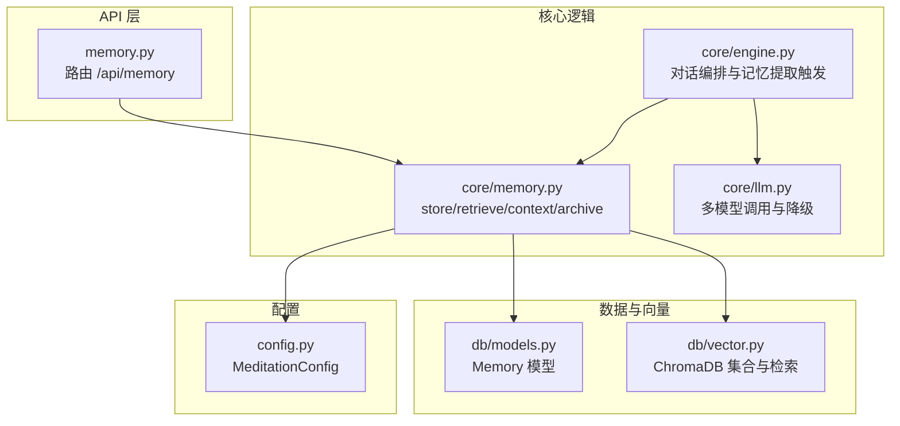
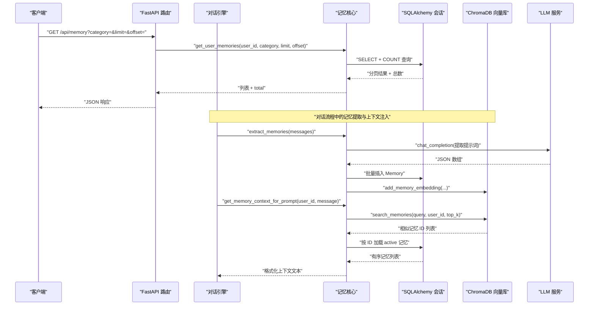
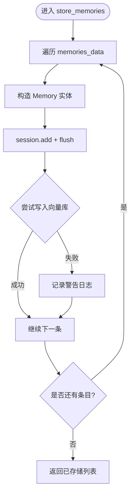
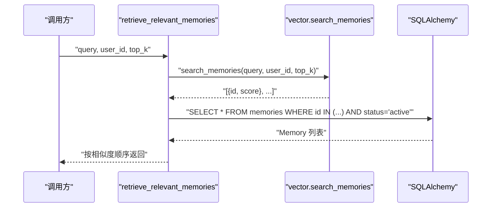
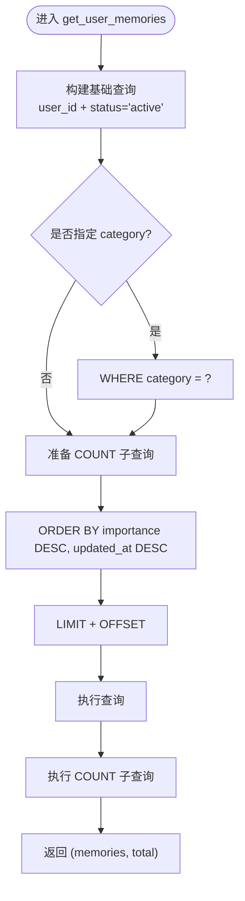
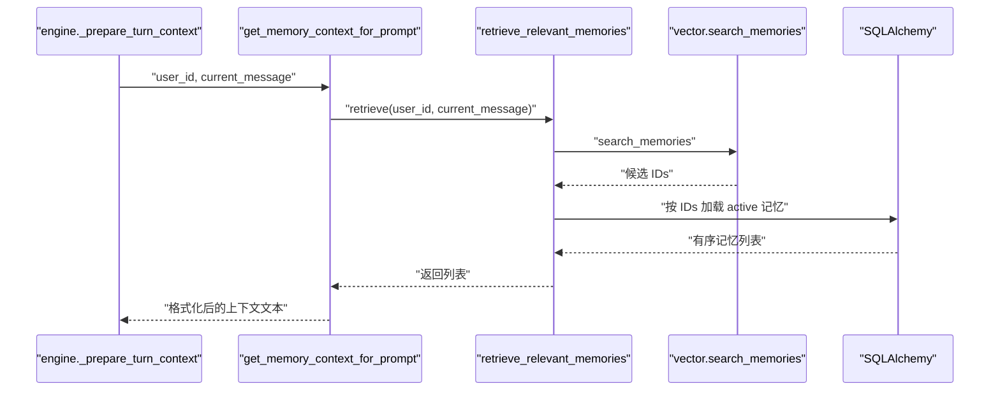
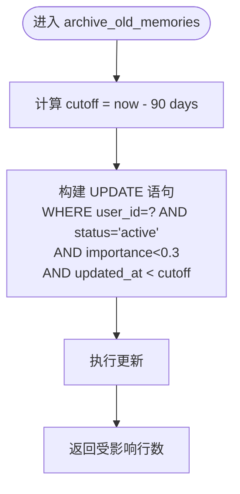
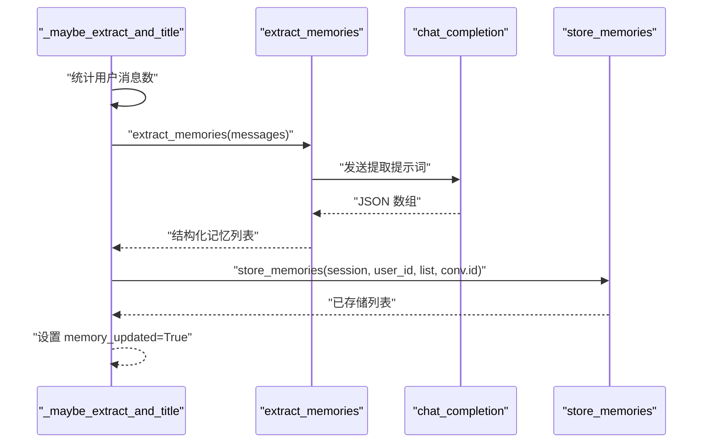
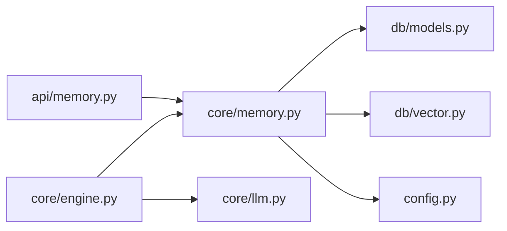

# 记忆生命周期管理

<cite>
**本文引用的文件**   
- [hushai/meditation/core/memory.py](file://hushai/meditation/core/memory.py)
- [hushai/meditation/db/vector.py](file://hushai/meditation/db/vector.py)
- [hushai/meditation/db/models.py](file://hushai/meditation/db/models.py)
- [hushai/meditation/api/memory.py](file://hushai/meditation/api/memory.py)
- [hushai/meditation/schemas.py](file://hushai/meditation/schemas.py)
- [hushai/meditation/config.py](file://hushai/meditation/config.py)
- [hushai/meditation/core/engine.py](file://hushai/meditation/core/engine.py)
- [hushai/meditation/core/llm.py](file://hushai/meditation/core/llm.py)
</cite>

## 目录
1. [简介](#简介)
2. [项目结构](#项目结构)
3. [核心组件](#核心组件)
4. [架构总览](#架构总览)
5. [详细组件分析](#详细组件分析)
6. [依赖关系分析](#依赖关系分析)
7. [性能与可扩展性](#性能与可扩展性)
8. [故障排查指南](#故障排查指南)
9. [结论](#结论)
10. [附录：端到端示例流程](#附录端到端示例流程)

## 简介
本文件围绕“记忆”的完整生命周期，系统性阐述以下能力：
- 存储流程：批量入库、向量索引写入、异常隔离与恢复策略
- 检索机制：语义搜索、结果排序与分页
- 查询接口：分类过滤、排序策略与统计
- 上下文构建：将相关记忆动态整合到提示词中
- 归档与清理：自动归档低重要度陈旧记忆，优化存储空间
- 端到端示例：从对话到记忆提取、入库、检索与上下文注入的全链路说明

## 项目结构
记忆功能涉及的核心模块如下：
- 领域逻辑：记忆提取、存储、检索、上下文构建、归档
- 数据模型：持久化表结构与索引
- 向量库：ChromaDB 集合管理与嵌入检索
- API 层：对外暴露的记忆查询接口
- 配置：Top-K、嵌入提供者等关键参数
- 引擎编排：对话流程中触发记忆提取与上下文组装

图表来源
- [hushai/meditation/api/memory.py:1-61](file://hushai/meditation/api/memory.py#L1-L61)
- [hushai/meditation/core/memory.py:1-206](file://hushai/meditation/core/memory.py#L1-L206)
- [hushai/meditation/core/engine.py:1-387](file://hushai/meditation/core/engine.py#L1-L387)
- [hushai/meditation/core/llm.py:1-258](file://hushai/meditation/core/llm.py#L1-L258)
- [hushai/meditation/db/models.py:98-117](file://hushai/meditation/db/models.py#L98-L117)
- [hushai/meditation/db/vector.py:1-179](file://hushai/meditation/db/vector.py#L1-L179)
- [hushai/meditation/config.py:1-136](file://hushai/meditation/config.py#L1-L136)

章节来源
- [hushai/meditation/api/memory.py:1-61](file://hushai/meditation/api/memory.py#L1-L61)
- [hushai/meditation/core/memory.py:1-206](file://hushai/meditation/core/memory.py#L1-L206)
- [hushai/meditation/core/engine.py:1-387](file://hushai/meditation/core/engine.py#L1-L387)
- [hushai/meditation/db/models.py:98-117](file://hushai/meditation/db/models.py#L98-L117)
- [hushai/meditation/db/vector.py:1-179](file://hushai/meditation/db/vector.py#L1-L179)
- [hushai/meditation/config.py:1-136](file://hushai/meditation/config.py#L1-L136)

## 核心组件
- 记忆模型 Memory：包含用户、类别、内容、摘要、重要度、状态、时间戳与元数据，具备用户+类别联合索引以加速查询。
- 向量接口 vector：基于 ChromaDB 的集合操作，支持按 user_id 过滤的语义检索与新增嵌入。
- 记忆核心 memory：提供提取、批量存储、语义检索、分页查询、上下文构建与归档。
- 引擎 engine：在对话流程中周期性触发记忆提取，并将相关记忆注入系统提示词。
- API memory：对外暴露 GET /api/memory，支持分类过滤、分页与总数统计。
- 配置 config：控制 Top-K、嵌入提供者、模型等关键参数。

章节来源
- [hushai/meditation/db/models.py:98-117](file://hushai/meditation/db/models.py#L98-L117)
- [hushai/meditation/db/vector.py:130-173](file://hushai/meditation/db/vector.py#L130-L173)
- [hushai/meditation/core/memory.py:79-205](file://hushai/meditation/core/memory.py#L79-L205)
- [hushai/meditation/core/engine.py:130-153](file://hushai/meditation/core/engine.py#L130-L153)
- [hushai/meditation/api/memory.py:27-61](file://hushai/meditation/api/memory.py#L27-L61)
- [hushai/meditation/config.py:40-47](file://hushai/meditation/config.py#L40-L47)

## 架构总览
下图展示了从对话到记忆提取、入库、检索与上下文注入的整体流程。

图表来源
- [hushai/meditation/api/memory.py:27-61](file://hushai/meditation/api/memory.py#L27-L61)
- [hushai/meditation/core/memory.py:141-173](file://hushai/meditation/core/memory.py#L141-L173)
- [hushai/meditation/core/engine.py:130-153](file://hushai/meditation/core/engine.py#L130-L153)
- [hushai/meditation/core/memory.py:45-76](file://hushai/meditation/core/memory.py#L45-L76)
- [hushai/meditation/core/memory.py:79-112](file://hushai/meditation/core/memory.py#L79-L112)
- [hushai/meditation/db/vector.py:130-173](file://hushai/meditation/db/vector.py#L130-L173)

## 详细组件分析

### 存储流程：store_memories
- 输入：会话对象、用户ID、记忆数据列表（每条含 category/content/summary/importance）、可选来源对话ID
- 处理要点：
  - 逐条构造 Memory 实体并加入会话，flush 后获取自增主键
  - 异步写入向量库；若失败仅记录警告日志，不影响主库事务
  - 返回已存储的 Memory 列表
- 事务与错误恢复：
  - 当前实现未显式使用事务边界，但通过 flush 保证主库写入顺序
  - 向量写入异常被捕获并记录，避免影响主流程
  - 建议：如需强一致性，可将整批 add/flush 包裹在 session.begin() 中，并在异常时统一 rollback

图表来源
- [hushai/meditation/core/memory.py:79-112](file://hushai/meditation/core/memory.py#L79-L112)

章节来源
- [hushai/meditation/core/memory.py:79-112](file://hushai/meditation/core/memory.py#L79-L112)

### 检索机制：retrieve_relevant_memories
- 语义搜索：调用向量库 search_memories，按 query 与 user_id 过滤，返回相似度排序的候选
- 结果排序：保持向量库返回的顺序（相似度降序）
- 分页处理：该函数不直接分页，由上层 get_user_memories 负责分页；语义检索结果数量受 top_k 限制
- 过滤条件：仅返回 status=active 的记忆

图表来源
- [hushai/meditation/core/memory.py:115-138](file://hushai/meditation/core/memory.py#L115-L138)
- [hushai/meditation/db/vector.py:144-173](file://hushai/meditation/db/vector.py#L144-L173)

章节来源
- [hushai/meditation/core/memory.py:115-138](file://hushai/meditation/core/memory.py#L115-L138)
- [hushai/meditation/db/vector.py:144-173](file://hushai/meditation/db/vector.py#L144-L173)

### 查询接口：get_user_memories
- 分类过滤：可选 category 精确匹配
- 排序策略：importance 降序，其次 updated_at 降序
- 分页处理：limit/offset 控制页大小与偏移
- 统计功能：通过子查询 count 返回 total，便于前端分页展示

图表来源
- [hushai/meditation/core/memory.py:141-158](file://hushai/meditation/core/memory.py#L141-L158)

章节来源
- [hushai/meditation/core/memory.py:141-158](file://hushai/meditation/core/memory.py#L141-L158)

### 上下文构建：get_memory_context_for_prompt
- 目标：将最相关的若干记忆以人类可读格式拼接为字符串，注入系统提示词
- 步骤：
  - 基于当前消息进行语义检索 retrieve_relevant_memories
  - 对每条记忆生成一行文本，优先使用 summary，否则截取 content 前缀
  - 使用类别中文标签提升可读性
- 输出：空字符串或换行分隔的多行文本

图表来源
- [hushai/meditation/core/memory.py:161-173](file://hushai/meditation/core/memory.py#L161-L173)
- [hushai/meditation/core/memory.py:115-138](file://hushai/meditation/core/memory.py#L115-L138)
- [hushai/meditation/db/vector.py:144-173](file://hushai/meditation/db/vector.py#L144-L173)

章节来源
- [hushai/meditation/core/memory.py:161-173](file://hushai/meditation/core/memory.py#L161-L173)

### 归档与清理：archive_old_memories
- 规则：
  - 时间阈值：超过 90 天未更新的活跃记忆
  - 重要度阈值：importance < 0.3
  - 动作：将 status 更新为 archived
- 目的：释放活跃集空间，降低检索噪声，保留历史可追溯性

图表来源
- [hushai/meditation/core/memory.py:189-205](file://hushai/meditation/core/memory.py#L189-L205)

章节来源
- [hushai/meditation/core/memory.py:189-205](file://hushai/meditation/core/memory.py#L189-L205)

### 记忆提取与引擎编排：extract_memories 与 _maybe_extract_and_title
- extract_memories：
  - 将对话消息拼接为自然语言文本，构造系统提示词，调用 LLM 抽取结构化 JSON 数组
  - 对 LLM 输出做清洗（去除代码块标记），解析 JSON 并校验字段
- 引擎编排：
  - 每 N 轮用户消息触发一次提取（默认 2）
  - 首轮补全会话标题
  - 提取成功后批量入库，并返回 memory_updated 标志

图表来源
- [hushai/meditation/core/memory.py:45-76](file://hushai/meditation/core/memory.py#L45-L76)
- [hushai/meditation/core/engine.py:130-153](file://hushai/meditation/core/engine.py#L130-L153)
- [hushai/meditation/core/memory.py:79-112](file://hushai/meditation/core/memory.py#L79-L112)

章节来源
- [hushai/meditation/core/memory.py:45-76](file://hushai/meditation/core/memory.py#L45-L76)
- [hushai/meditation/core/engine.py:130-153](file://hushai/meditation/core/engine.py#L130-L153)

### API 层：list_memories
- 认证：从 Authorization Header 提取 Bearer Token，校验用户身份
- 参数：category、limit、offset，均带约束
- 响应：MemoryListResponse，包含 memories 列表与 total

章节来源
- [hushai/meditation/api/memory.py:16-61](file://hushai/meditation/api/memory.py#L16-L61)
- [hushai/meditation/schemas.py:95-108](file://hushai/meditation/schemas.py#L95-L108)

## 依赖关系分析
- 组件耦合：
  - core/memory.py 依赖 db/models.py（ORM 模型）、db/vector.py（向量库）、config.py（Top-K 等）
  - api/memory.py 依赖 core/memory.py 与 schemas.py
  - core/engine.py 编排调用 core/memory.py 与 core/llm.py
- 外部依赖：
  - ChromaDB 作为向量数据库，支持按 user_id 过滤的语义检索
  - OpenAI 兼容 LLM 服务，支持多提供商与自动降级

图表来源
- [hushai/meditation/api/memory.py:1-61](file://hushai/meditation/api/memory.py#L1-L61)
- [hushai/meditation/core/memory.py:1-206](file://hushai/meditation/core/memory.py#L1-L206)
- [hushai/meditation/core/engine.py:1-387](file://hushai/meditation/core/engine.py#L1-L387)
- [hushai/meditation/db/models.py:98-117](file://hushai/meditation/db/models.py#L98-L117)
- [hushai/meditation/db/vector.py:1-179](file://hushai/meditation/db/vector.py#L1-L179)
- [hushai/meditation/config.py:1-136](file://hushai/meditation/config.py#L1-L136)
- [hushai/meditation/core/llm.py:1-258](file://hushai/meditation/core/llm.py#L1-L258)

章节来源
- [hushai/meditation/api/memory.py:1-61](file://hushai/meditation/api/memory.py#L1-L61)
- [hushai/meditation/core/memory.py:1-206](file://hushai/meditation/core/memory.py#L1-L206)
- [hushai/meditation/core/engine.py:1-387](file://hushai/meditation/core/engine.py#L1-L387)
- [hushai/meditation/db/models.py:98-117](file://hushai/meditation/db/models.py#L98-L117)
- [hushai/meditation/db/vector.py:1-179](file://hushai/meditation/db/vector.py#L1-L179)
- [hushai/meditation/config.py:1-136](file://hushai/meditation/config.py#L1-L136)
- [hushai/meditation/core/llm.py:1-258](file://hushai/meditation/core/llm.py#L1-L258)

## 性能与可扩展性
- 向量检索：
  - 使用 HNSW 余弦距离，适合高维语义检索
  - 可通过 embedding_provider/model/base_url 切换嵌入模型与服务端点
- 数据库索引：
  - 用户+类别联合索引 ix_memories_user_category 加速分类过滤
  - 查询按 importance 与 updated_at 排序，注意大表排序成本
- 分页与 Top-K：
  - 语义检索 top_k 由配置控制，避免一次性返回过多
  - 列表查询使用 LIMIT/OFFSET，需关注深层分页性能
- 并发与事务：
  - 当前未显式使用事务边界，建议在批量写入场景引入 session.begin()/commit()/rollback() 增强一致性
- 扩展建议：
  - 增加缓存层（如 Redis）缓存热门用户的最近记忆上下文
  - 对向量库进行定期重建或增量更新，避免碎片化
  - 归档任务可改为定时任务，按用户分片并行执行

[本节为通用指导，无需特定文件引用]

## 故障排查指南
- 向量写入失败：
  - 现象：日志出现“记忆向量写入失败”，但不影响主库写入
  - 排查：检查 ChromaDB 连接与集合是否存在；确认 embedding 配置
  - 参考路径：[hushai/meditation/core/memory.py:102-111](file://hushai/meditation/core/memory.py#L102-L111)
- 记忆提取 JSON 解析失败：
  - 现象：日志“记忆提取 JSON 解析失败”，返回空列表
  - 排查：检查 LLM 输出格式是否符合预期；调整 temperature/max_tokens
  - 参考路径：[hushai/meditation/core/memory.py:64-76](file://hushai/meditation/core/memory.py#L64-L76)
- 认证失败：
  - 现象：401 未授权
  - 排查：Authorization Header 是否正确携带 Bearer Token；Token 是否过期
  - 参考路径：[hushai/meditation/api/memory.py:16-25](file://hushai/meditation/api/memory.py#L16-L25)
- 无搜索结果：
  - 现象：语义检索返回空
  - 排查：确认向量库是否有对应 user_id 的数据；检查 top_k 与过滤条件
  - 参考路径：[hushai/meditation/db/vector.py:144-173](file://hushai/meditation/db/vector.py#L144-L173)

章节来源
- [hushai/meditation/core/memory.py:102-111](file://hushai/meditation/core/memory.py#L102-L111)
- [hushai/meditation/core/memory.py:64-76](file://hushai/meditation/core/memory.py#L64-L76)
- [hushai/meditation/api/memory.py:16-25](file://hushai/meditation/api/memory.py#L16-L25)
- [hushai/meditation/db/vector.py:144-173](file://hushai/meditation/db/vector.py#L144-L173)

## 结论
本方案实现了从对话中提取长期记忆、持久化与语义检索、上下文注入以及归档清理的闭环。通过向量库与数据库协同，既保证了检索质量，又提供了灵活的分页与统计能力。建议在批量写入与归档场景中引入明确的事务边界与定时任务，进一步提升一致性与可维护性。

[本节为总结，无需特定文件引用]

## 附录：端到端示例流程
以下为完整的记忆操作流程说明（以步骤形式呈现，不包含具体代码片段）：
- 步骤一：用户发起对话
  - 引擎保存用户消息，加载历史消息
  - 调用 get_memory_context_for_prompt 获取相关记忆上下文
  - 组合 system prompt 与历史消息，调用 chat_completion 得到回复
  - 保存助手回复，并周期性触发 extract_memories
- 步骤二：记忆提取与入库
  - extract_memories 将对话转为自然语言，调用 LLM 抽取结构化记忆
  - store_memories 批量写入数据库，并写入向量库
  - 若向量写入失败，记录警告并继续后续流程
- 步骤三：检索与上下文注入
  - retrieve_relevant_memories 基于当前消息进行语义检索，按相似度排序
  - 仅返回 active 状态的记忆，供上下文构建使用
- 步骤四：查询接口
  - GET /api/memory 支持分类过滤、分页与总数统计
  - 返回 MemoryItem 列表与 total，用于前端展示
- 步骤五：归档与清理
  - archive_old_memories 将长时间未更新且重要性低的记忆归档
  - 减少活跃集规模，提升检索效率

章节来源
- [hushai/meditation/core/engine.py:130-153](file://hushai/meditation/core/engine.py#L130-L153)
- [hushai/meditation/core/memory.py:45-112](file://hushai/meditation/core/memory.py#L45-L112)
- [hushai/meditation/core/memory.py:115-173](file://hushai/meditation/core/memory.py#L115-L173)
- [hushai/meditation/api/memory.py:27-61](file://hushai/meditation/api/memory.py#L27-L61)
- [hushai/meditation/core/memory.py:189-205](file://hushai/meditation/core/memory.py#L189-L205)