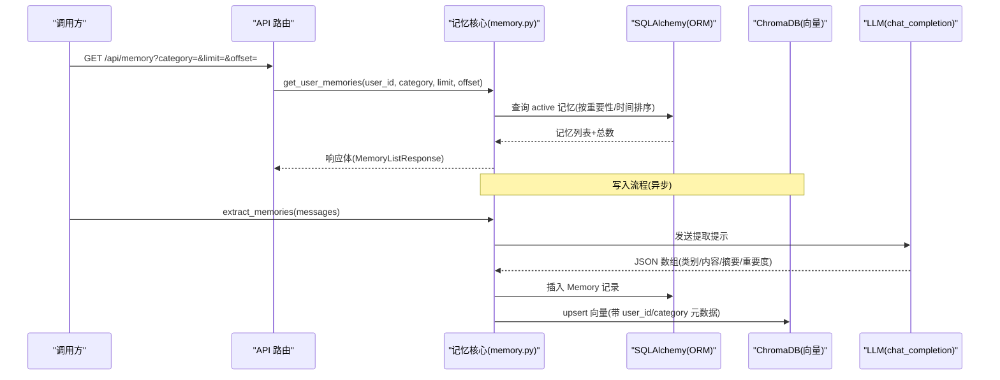
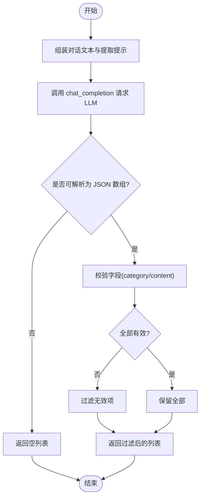
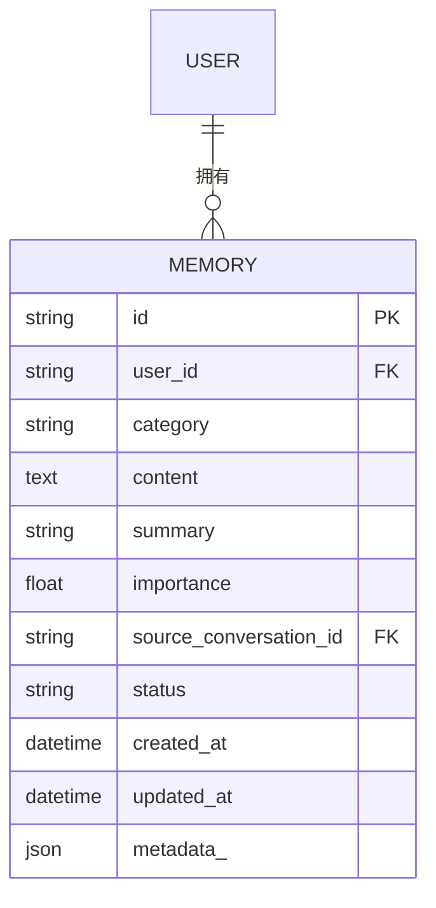
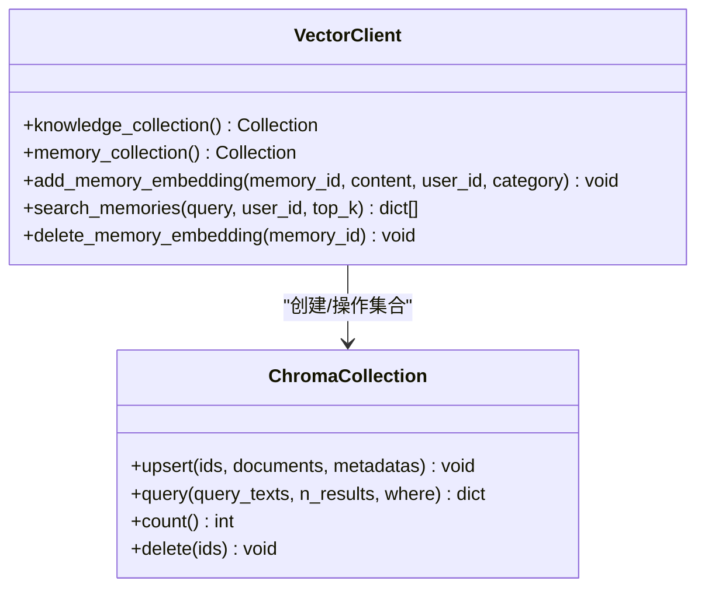
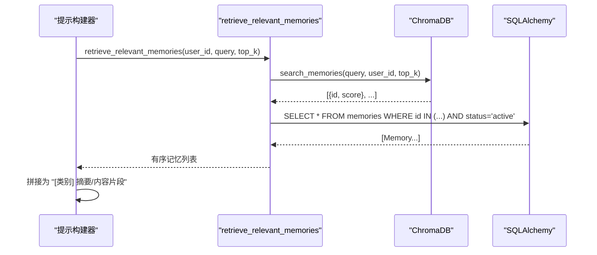
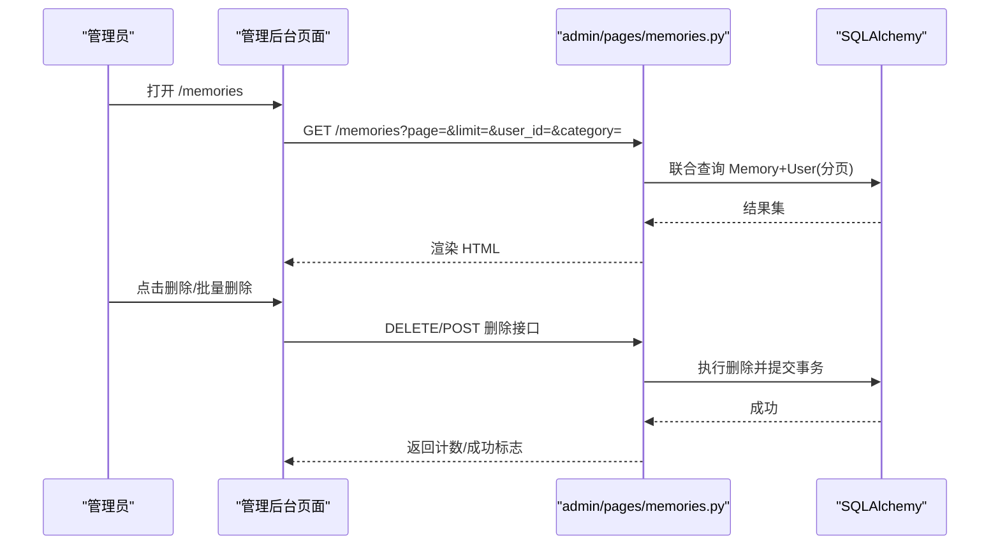
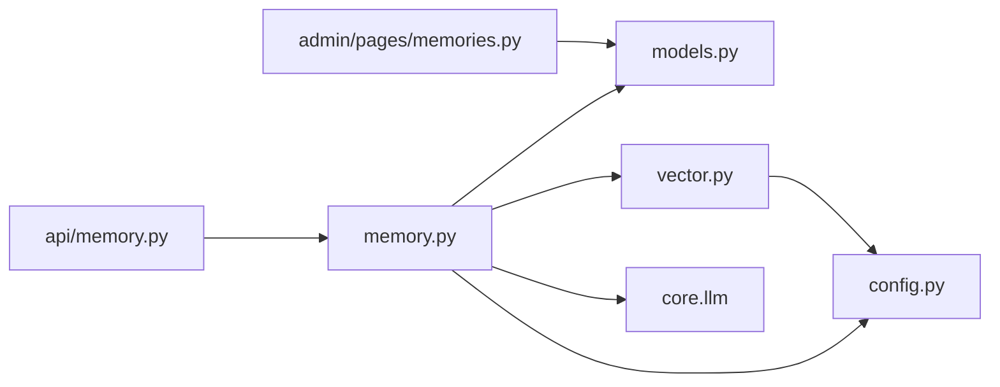

# 长期记忆系统

<cite>
**本文引用的文件**   
- [hushai/meditation/core/memory.py](file://hushai/meditation/core/memory.py)
- [hushai/meditation/db/vector.py](file://hushai/meditation/db/vector.py)
- [hushai/meditation/api/memory.py](file://hushai/meditation/api/memory.py)
- [hushai/meditation/db/models.py](file://hushai/meditation/db/models.py)
- [hushai/meditation/config.py](file://hushai/meditation/config.py)
- [tests/meditation/test_core.py](file://tests/meditation/test_core.py)
- [hushai/meditation/admin/pages/memories.py](file://hushai/meditation/admin/pages/memories.py)
</cite>

## 目录
1. [简介](#简介)
2. [项目结构](#项目结构)
3. [核心组件](#核心组件)
4. [架构总览](#架构总览)
5. [详细组件分析](#详细组件分析)
6. [依赖关系分析](#依赖关系分析)
7. [性能考量](#性能考量)
8. [故障排查指南](#故障排查指南)
9. [结论](#结论)
10. [附录](#附录)

## 简介
本技术文档围绕 hush.ai 的“长期记忆系统”展开，系统性阐述从对话历史中提取关键信息、情感状态与用户偏好的智能提取算法；定义事实记忆、情感记忆、行为模式等维度的存储结构；说明向量数据库（ChromaDB）集成方案，包括文本向量化、相似度计算与语义检索优化；解释记忆上下文构建机制，如何在对话时动态检索相关历史记忆；并提供自定义记忆提取规则与存储策略的实践路径。同时涵盖记忆清理、去重与版本管理的设计建议，以及批量处理与缓存策略等性能优化技巧。

## 项目结构
长期记忆系统位于 meditation 子模块中，核心由以下部分组成：
- 业务逻辑层：记忆提取、持久化、检索与上下文组装
- 数据模型层：SQLAlchemy ORM 模型定义
- 向量检索层：ChromaDB 客户端封装与集合操作
- API 层：面向用户的记忆查询接口
- 配置层：环境变量驱动的 LLM、嵌入模型与向量库参数
- 管理后台：记忆的浏览、删除与批量操作

```mermaid
graph TB
subgraph "业务逻辑"
MCore["memory.py<br/>提取/存储/检索/归档"]
end
subgraph "数据模型"
Models["models.py<br/>Memory/Message/User 等"]
end
subgraph "向量检索"
Vector["vector.py<br/>ChromaDB 集合/嵌入/查询"]
end
subgraph "API"
API["api/memory.py<br/>GET /api/memory"]
end
subgraph "配置"
Config["config.py<br/>MEDITATION_* 环境变量"]
end
subgraph "管理后台"
Admin["admin/pages/memories.py<br/>列表/删除/批量删除"]
end
API --> MCore
MCore --> Models
MCore --> Vector
MCore --> Config
Admin --> Models
```

图表来源
- [hushai/meditation/core/memory.py:1-206](file://hushai/meditation/core/memory.py#L1-L206)
- [hushai/meditation/db/models.py:98-118](file://hushai/meditation/db/models.py#L98-L118)
- [hushai/meditation/db/vector.py:61-78](file://hushai/meditation/db/vector.py#L61-L78)
- [hushai/meditation/api/memory.py:1-61](file://hushai/meditation/api/memory.py#L1-L61)
- [hushai/meditation/config.py:18-53](file://hushai/meditation/config.py#L18-L53)
- [hushai/meditation/admin/pages/memories.py:22-83](file://hushai/meditation/admin/pages/memories.py#L22-L83)

章节来源
- [hushai/meditation/core/memory.py:1-206](file://hushai/meditation/core/memory.py#L1-L206)
- [hushai/meditation/db/models.py:98-118](file://hushai/meditation/db/models.py#L98-L118)
- [hushai/meditation/db/vector.py:1-179](file://hushai/meditation/db/vector.py#L1-L179)
- [hushai/meditation/api/memory.py:1-61](file://hushai/meditation/api/memory.py#L1-L61)
- [hushai/meditation/config.py:1-136](file://hushai/meditation/config.py#L1-L136)
- [hushai/meditation/admin/pages/memories.py:1-130](file://hushai/meditation/admin/pages/memories.py#L1-L130)

## 核心组件
- 记忆提取器：基于 LLM 的提示工程，将对话消息序列化为结构化 JSON，包含类别、内容、摘要与重要度。
- 记忆存储：将结构化结果写入 SQL 表，并异步写入向量库以支持语义检索。
- 语义检索：通过 ChromaDB 按用户维度过滤，返回 Top-K 相似记忆，再回查数据库获取完整记录。
- 上下文构建：在生成回复前，根据当前消息检索相关记忆，拼接为提示上下文片段。
- 记忆归档：对低重要度且长时间未更新的记忆进行归档，降低活跃集规模。
- 管理后台：提供分页浏览、分类筛选、单条与批量删除能力。

章节来源
- [hushai/meditation/core/memory.py:45-112](file://hushai/meditation/core/memory.py#L45-L112)
- [hushai/meditation/core/memory.py:115-173](file://hushai/meditation/core/memory.py#L115-L173)
- [hushai/meditation/core/memory.py:189-205](file://hushai/meditation/core/memory.py#L189-L205)
- [hushai/meditation/admin/pages/memories.py:22-130](file://hushai/meditation/admin/pages/memories.py#L22-L130)

## 架构总览
长期记忆系统采用“LLM 提取 + 向量检索 + 关系型持久化”的分层架构。提取阶段使用 LLM 输出结构化记忆条目；存储阶段双写 SQL 与向量库；检索阶段先向量近似匹配，再精确回读；上下文构建阶段将检索结果压缩为短标签+摘要供提示使用。



图表来源
- [hushai/meditation/api/memory.py:27-61](file://hushai/meditation/api/memory.py#L27-L61)
- [hushai/meditation/core/memory.py:45-112](file://hushai/meditation/core/memory.py#L45-L112)
- [hushai/meditation/core/memory.py:115-173](file://hushai/meditation/core/memory.py#L115-L173)
- [hushai/meditation/db/vector.py:130-173](file://hushai/meditation/db/vector.py#L130-L173)
- [hushai/meditation/db/models.py:98-118](file://hushai/meditation/db/models.py#L98-L118)

## 详细组件分析

### 记忆提取算法
- 输入：一组 Message 对象（角色与内容）。
- 处理：构造系统提示，指定记忆类别（冥想经历、情绪模式、个人偏好、目标进展、重要事件、健康提醒、生活背景），要求 LLM 返回 JSON 数组，每项包含 category、content、summary、importance。
- 容错：自动剥离代码块包裹的 JSON；解析失败或格式不符时返回空列表。
- 输出：结构化记忆候选列表，供后续存储与入库。



图表来源
- [hushai/meditation/core/memory.py:18-76](file://hushai/meditation/core/memory.py#L18-L76)

章节来源
- [hushai/meditation/core/memory.py:18-76](file://hushai/meditation/core/memory.py#L18-L76)
- [tests/meditation/test_core.py:144-244](file://tests/meditation/test_core.py#L144-L244)

### 记忆维度与存储结构
- 维度设计：
  - 事实记忆：如练习时长、频率、技法偏好、身体感受（meditation_experience）
  - 情感记忆：常见情绪、触发因素、趋势（emotion_pattern）
  - 行为模式：沟通方式、时间偏好、引导风格（personal_preference）
  - 目标进展：修行目标、里程碑、当前阶段（goal_progress）
  - 重要事件：突破、感悟、困难、转折点（important_event）
  - 健康提醒：身体限制、不适、医嘱（health_note）
  - 生活背景：工作、家庭、压力源（life_context）
- 存储结构（SQLAlchemy 模型）：
  - id、user_id、category、content、summary、importance、source_conversation_id、status、created_at、updated_at、metadata_
  - 索引：user_id、category 复合索引，提升按用户与类别的查询效率



图表来源
- [hushai/meditation/db/models.py:98-118](file://hushai/meditation/db/models.py#L98-L118)

章节来源
- [hushai/meditation/db/models.py:98-118](file://hushai/meditation/db/models.py#L98-L118)

### 向量数据库集成方案
- 客户端初始化：支持持久化目录或内存模式，关闭遥测。
- 嵌入函数：默认使用 OpenAI 嵌入模型，可通过配置切换 provider、model、base_url 与 api_key。
- 集合设计：
  - knowledge：知识分片集合
  - memories：用户记忆集合，元数据包含 user_id 与 category
- 相似度计算：HNSW 空间使用 cosine 距离；查询返回 score = 1 - distance。
- 过滤检索：where={"user_id": user_id} 实现用户级隔离。



图表来源
- [hushai/meditation/db/vector.py:15-78](file://hushai/meditation/db/vector.py#L15-L78)
- [hushai/meditation/db/vector.py:130-179](file://hushai/meditation/db/vector.py#L130-L179)

章节来源
- [hushai/meditation/db/vector.py:1-179](file://hushai/meditation/db/vector.py#L1-L179)
- [hushai/meditation/config.py:40-53](file://hushai/meditation/config.py#L40-L53)

### 记忆上下文构建机制
- 检索：根据当前消息文本，调用向量检索获取 Top-K 相关记忆 ID。
- 回读：按 ID 列表查询数据库中 active 状态的完整记录，保持向量排序顺序。
- 组装：将每条记忆转换为“[类别标签] 摘要或内容前缀”的文本行，作为提示上下文注入。



图表来源
- [hushai/meditation/core/memory.py:115-173](file://hushai/meditation/core/memory.py#L115-L173)
- [hushai/meditation/db/vector.py:144-173](file://hushai/meditation/db/vector.py#L144-L173)

章节来源
- [hushai/meditation/core/memory.py:115-173](file://hushai/meditation/core/memory.py#L115-L173)

### 记忆清理、去重与版本管理
- 清理归档：对低重要度（<0.3）、长时间未更新（超过 90 天）的记忆标记为 archived，减少活跃集。
- 去重策略（建议）：
  - 基于内容哈希（如 SHA-256）与用户维度建立唯一约束，避免重复入库。
  - 合并相近条目：当新条目与已有条目相似度高于阈值且类别一致时，选择更高重要度或更近更新时间覆盖。
- 版本管理（建议）：
  - 引入 version 字段与变更日志表，记录每次更新的原因与来源会话。
  - 支持软删除与恢复，便于审计与回溯。

章节来源
- [hushai/meditation/core/memory.py:189-205](file://hushai/meditation/core/memory.py#L189-L205)

### 自定义记忆提取规则与存储策略示例
- 自定义提取规则：
  - 修改提取提示中的类别定义与字段要求，增加新的维度（如“认知偏差”、“干预效果”）。
  - 调整 temperature 与 max_tokens 控制稳定性与长度。
- 自定义存储策略：
  - 在 store_memories 中增加去重检查（按 user_id + content_hash 判断）。
  - 扩展 metadata_ 字段，记录来源会话、提取模型版本、置信度等。
- 参考测试用例路径：
  - 提取 JSON 解析与代码块包裹处理：[tests/meditation/test_core.py:144-244](file://tests/meditation/test_core.py#L144-L244)

章节来源
- [hushai/meditation/core/memory.py:45-112](file://hushai/meditation/core/memory.py#L45-L112)
- [tests/meditation/test_core.py:144-244](file://tests/meditation/test_core.py#L144-L244)

### 管理后台与 API
- 用户侧 API：
  - GET /api/memory：按用户维度分页列出 active 记忆，支持按类别过滤与排序。
- 管理后台：
  - 页面 /memories：分页展示所有记忆，支持按用户与类别筛选。
  - DELETE /api/memories/{memory_id}：删除单条记忆。
  - POST /api/memories/batch-delete：批量删除记忆。



图表来源
- [hushai/meditation/admin/pages/memories.py:22-130](file://hushai/meditation/admin/pages/memories.py#L22-L130)

章节来源
- [hushai/meditation/api/memory.py:27-61](file://hushai/meditation/api/memory.py#L27-L61)
- [hushai/meditation/admin/pages/memories.py:22-130](file://hushai/meditation/admin/pages/memories.py#L22-L130)

## 依赖关系分析
- 模块耦合：
  - memory.py 依赖 config.py（读取 LLM/嵌入/Top-K 配置）、db.models.py（ORM 模型）、db.vector.py（向量检索）、core.llm（聊天补全）。
  - vector.py 依赖 chromadb 与 config.py（嵌入 provider/model/key/base_url）。
  - api/memory.py 依赖 auth、schemas、session 与 core.memory。
- 外部依赖：
  - ChromaDB：本地持久化或内存模式，HNSW cosine 相似度。
  - LLM：OpenAI/DeepSeek/Zhipu/Kimi 等多提供商，通过配置切换。



图表来源
- [hushai/meditation/core/memory.py:1-20](file://hushai/meditation/core/memory.py#L1-L20)
- [hushai/meditation/db/vector.py:1-11](file://hushai/meditation/db/vector.py#L1-L11)
- [hushai/meditation/api/memory.py:1-12](file://hushai/meditation/api/memory.py#L1-L12)
- [hushai/meditation/admin/pages/memories.py:1-17](file://hushai/meditation/admin/pages/memories.py#L1-L17)

章节来源
- [hushai/meditation/core/memory.py:1-20](file://hushai/meditation/core/memory.py#L1-L20)
- [hushai/meditation/db/vector.py:1-11](file://hushai/meditation/db/vector.py#L1-L11)
- [hushai/meditation/api/memory.py:1-12](file://hushai/meditation/api/memory.py#L1-L12)
- [hushai/meditation/admin/pages/memories.py:1-17](file://hushai/meditation/admin/pages/memories.py#L1-L17)

## 性能考量
- 批量处理：
  - 向量写入：建议在批处理场景中使用 upsert 批量提交，减少网络往返。
  - 数据库写入：使用 session.add_all 与一次 flush/commit，降低事务开销。
- 缓存策略：
  - 检索缓存：对高频查询（如热门类别或固定用户）设置短时缓存（Redis/Memcached），TTL 建议 5-15 分钟。
  - 向量客户端缓存：全局单例已存在，避免重复初始化。
- 索引优化：
  - 复合索引 ix_memories_user_category 已存在，确保按用户与类别的高效过滤。
  - 考虑为 updated_at 添加索引以加速归档扫描。
- 检索优化：
  - 合理设置 top_k，避免过大导致回读与拼接成本上升。
  - 使用 where 条件限定用户范围，减少无关结果。

[本节为通用性能指导，不直接分析具体文件]

## 故障排查指南
- 提取失败：
  - 现象：extract_memories 返回空列表。
  - 排查：确认 LLM 返回是否为合法 JSON；检查是否被代码块包裹；查看日志警告。
  - 参考路径：[hushai/meditation/core/memory.py:57-76](file://hushai/meditation/core/memory.py#L57-L76)
- 向量写入失败：
  - 现象：store_memories 记录入 SQL 成功但向量缺失。
  - 排查：检查 embedding_provider、embedding_api_key、embedding_base_url 配置；确认 ChromaDB 可用。
  - 参考路径：[hushai/meditation/core/memory.py:102-111](file://hushai/meditation/core/memory.py#L102-L111)
- 检索为空：
  - 现象：retrieve_relevant_memories 返回空。
  - 排查：确认向量集合 count > 0；检查 user_id 过滤是否正确；验证 top_k 设置。
  - 参考路径：[hushai/meditation/core/memory.py:121-138](file://hushai/meditation/core/memory.py#L121-L138)
- 管理后台权限错误：
  - 现象：删除接口返回 401。
  - 排查：确认管理员登录态；检查认证中间件。
  - 参考路径：[hushai/meditation/admin/pages/memories.py:93-105](file://hushai/meditation/admin/pages/memories.py#L93-L105)

章节来源
- [hushai/meditation/core/memory.py:57-76](file://hushai/meditation/core/memory.py#L57-L76)
- [hushai/meditation/core/memory.py:102-111](file://hushai/meditation/core/memory.py#L102-L111)
- [hushai/meditation/core/memory.py:121-138](file://hushai/meditation/core/memory.py#L121-L138)
- [hushai/meditation/admin/pages/memories.py:93-105](file://hushai/meditation/admin/pages/memories.py#L93-L105)

## 结论
长期记忆系统通过“LLM 结构化提取 + 向量语义检索 + 关系型持久化”的组合，实现了从对话历史中持续沉淀用户画像与情境信息的能力。其模块化设计与清晰的职责划分，使得记忆维度可扩展、检索可优化、管理可运维。结合本文提供的清理、去重与版本管理建议，以及批量处理与缓存策略，可在保证质量的同时提升系统性能与可维护性。

[本节为总结性内容，不直接分析具体文件]

## 附录
- 配置项速览（部分）：
  - MEDITATION_MEMORY_TOP_K：记忆检索 Top-K
  - MEDITATION_EMBEDDING_PROVIDER：嵌入提供商（openai 等）
  - MEDITATION_EMBEDDING_MODEL：嵌入模型名称
  - MEDITATION_EMBEDDING_API_KEY：嵌入 API Key
  - MEDITATION_EMBEDDING_BASE_URL：嵌入 Base URL
  - MEDITATION_CHROMA_DIR：ChromaDB 持久化目录
- 参考路径：
  - [hushai/meditation/config.py:40-53](file://hushai/meditation/config.py#L40-L53)
  - [hushai/meditation/config.py:64-115](file://hushai/meditation/config.py#L64-L115)

章节来源
- [hushai/meditation/config.py:40-53](file://hushai/meditation/config.py#L40-L53)
- [hushai/meditation/config.py:64-115](file://hushai/meditation/config.py#L64-L115)