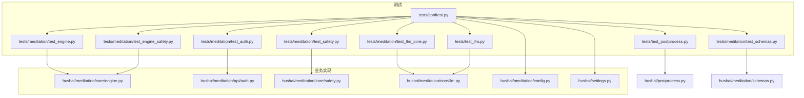
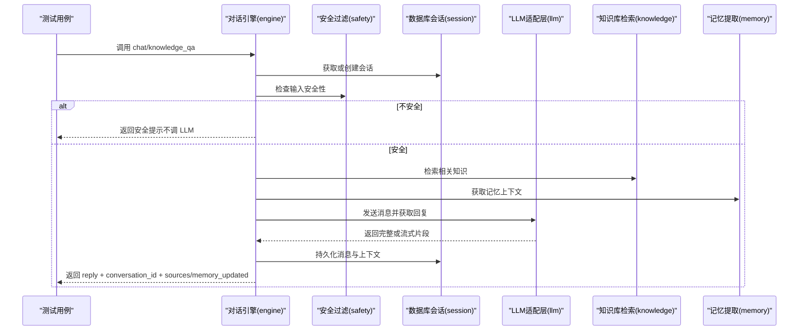
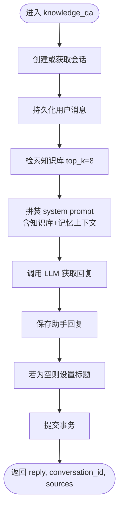
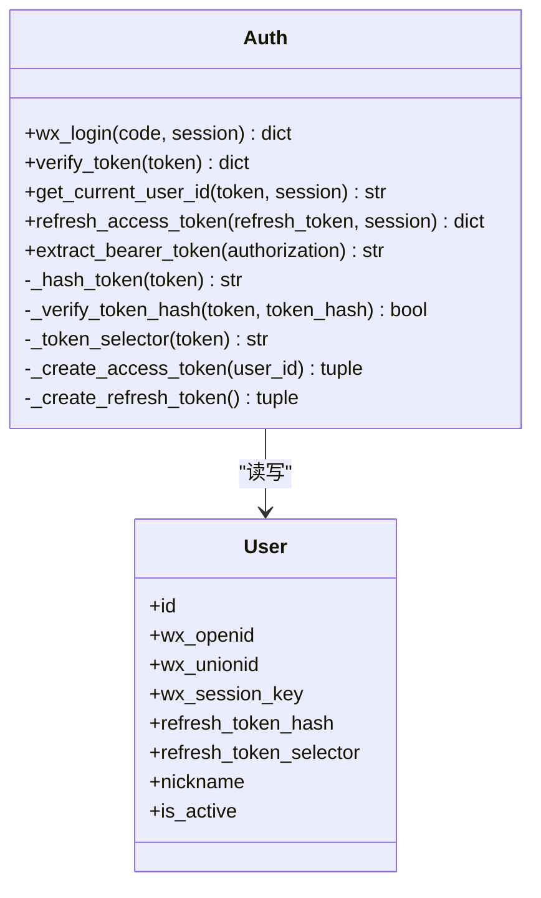
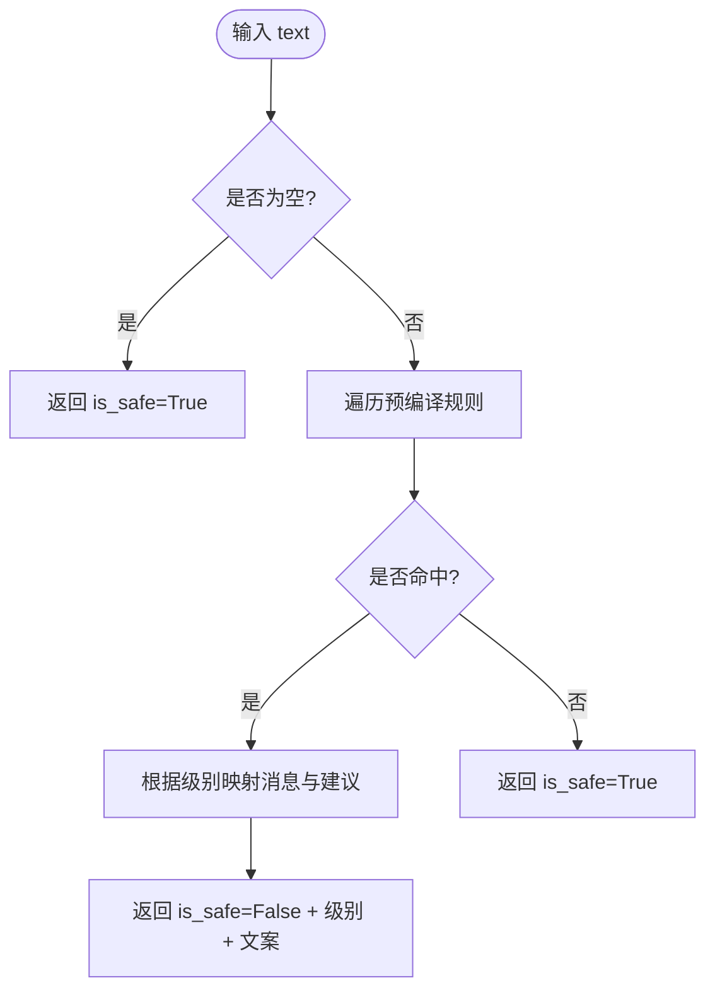
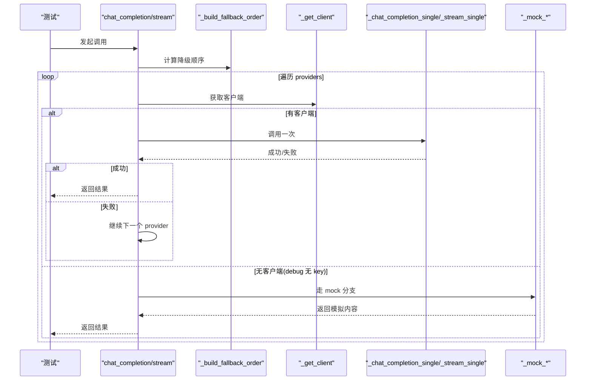
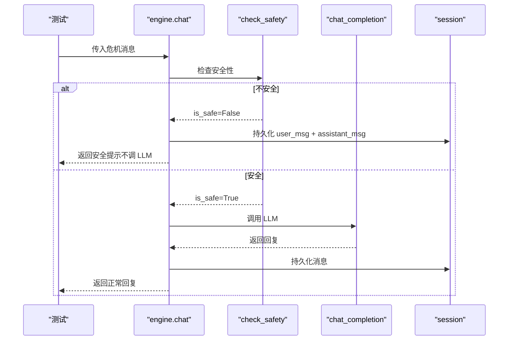
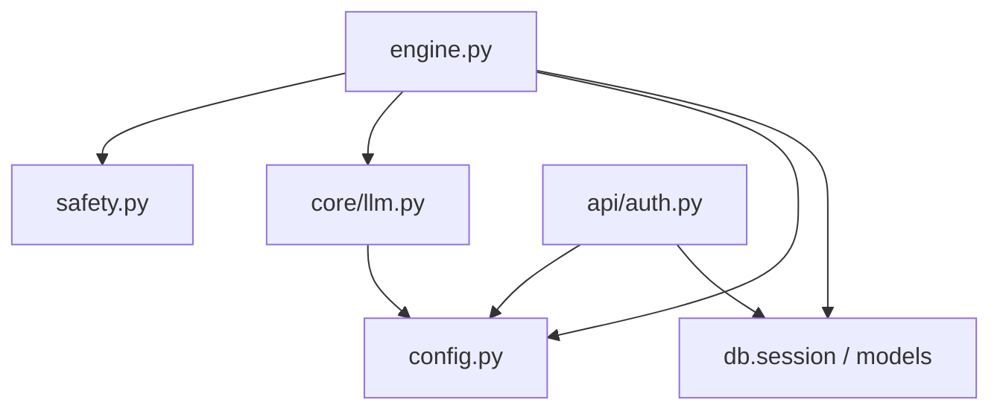

# 单元测试

<cite>
**本文引用的文件**   
- [tests/conftest.py](file://tests/conftest.py)
- [hushai/meditation/core/engine.py](file://hushai/meditation/core/engine.py)
- [hushai/meditation/api/auth.py](file://hushai/meditation/api/auth.py)
- [hushai/meditation/core/safety.py](file://hushai/meditation/core/safety.py)
- [hushai/meditation/core/llm.py](file://hushai/meditation/core/llm.py)
- [hushai/settings.py](file://hushai/settings.py)
- [tests/meditation/test_engine.py](file://tests/meditation/test_engine.py)
- [tests/meditation/test_auth.py](file://tests/meditation/test_auth.py)
- [tests/meditation/test_safety.py](file://tests/meditation/test_safety.py)
- [tests/meditation/test_llm_core.py](file://tests/meditation/test_llm_core.py)
- [tests/meditation/test_engine_safety.py](file://tests/meditation/test_engine_safety.py)
- [tests/test_llm.py](file://tests/test_llm.py)
- [tests/test_postprocess.py](file://tests/test_postprocess.py)
- [tests/meditation/test_schemas.py](file://tests/meditation/test_schemas.py)
- [hushai/meditation/config.py](file://hushai/meditation/config.py)
</cite>

## 目录
1. [引言](#引言)
2. [项目结构](#项目结构)
3. [核心组件](#核心组件)
4. [架构总览](#架构总览)
5. [详细组件分析](#详细组件分析)
6. [依赖关系分析](#依赖关系分析)
7. [性能与可测试性考量](#性能与可测试性考量)
8. [故障排查指南](#故障排查指南)
9. [结论](#结论)
10. [附录：测试最佳实践清单](#附录测试最佳实践清单)

## 引言
本文件面向 hush.ai 项目的开发者，系统化阐述如何使用 pytest 编写高质量单元测试。内容覆盖测试用例设计原则、Mock 对象使用策略、异步测试方法，并围绕以下关键模块给出具体测试方案与实践：
- 对话引擎（编排、记忆提取、知识检索）
- 认证系统（微信登录、JWT 签发与校验、刷新令牌）
- 安全过滤（危机信号检测与提示）
- LLM 集成（多模型路由、自动降级、流式与非流式）

文档同时提供测试数据准备、断言选择、异常处理测试的最佳实践，并结合现有测试代码路径进行说明，帮助读者快速上手并为 FastAPI 应用构建稳健的测试体系。

## 项目结构
本项目采用“按功能域组织”的结构，测试与源码一一对应，便于定位与维护。核心测试位于 tests 目录，冥想相关测试集中在 tests/meditation；顶层测试覆盖通用能力（如 LLM 调用、后处理、设置解析等）。

图表来源
- [tests/conftest.py:1-68](file://tests/conftest.py#L1-L68)
- [tests/meditation/test_engine.py:1-283](file://tests/meditation/test_engine.py#L1-L283)
- [tests/meditation/test_engine_safety.py:1-115](file://tests/meditation/test_engine_safety.py#L1-L115)
- [tests/meditation/test_auth.py:1-142](file://tests/meditation/test_auth.py#L1-L142)
- [tests/meditation/test_safety.py:1-140](file://tests/meditation/test_safety.py#L1-L140)
- [tests/meditation/test_llm_core.py:1-169](file://tests/meditation/test_llm_core.py#L1-L169)
- [tests/test_llm.py:1-119](file://tests/test_llm.py#L1-L119)
- [tests/test_postprocess.py:1-32](file://tests/test_postprocess.py#L1-L32)
- [tests/meditation/test_schemas.py:1-189](file://tests/meditation/test_schemas.py#L1-L189)
- [hushai/meditation/core/engine.py:1-387](file://hushai/meditation/core/engine.py#L1-L387)
- [hushai/meditation/api/auth.py:1-171](file://hushai/meditation/api/auth.py#L1-L171)
- [hushai/meditation/core/safety.py:1-111](file://hushai/meditation/core/safety.py#L1-L111)
- [hushai/meditation/core/llm.py:1-258](file://hushai/meditation/core/llm.py#L1-L258)
- [hushai/meditation/config.py:1-136](file://hushai/meditation/config.py#L1-L136)
- [hushai/settings.py:1-226](file://hushai/settings.py#L1-L226)

章节来源
- [tests/conftest.py:1-68](file://tests/conftest.py#L1-L68)
- [hushai/meditation/core/engine.py:1-387](file://hushai/meditation/core/engine.py#L1-L387)
- [hushai/meditation/api/auth.py:1-171](file://hushai/meditation/api/auth.py#L1-L171)
- [hushai/meditation/core/safety.py:1-111](file://hushai/meditation/core/safety.py#L1-L111)
- [hushai/meditation/core/llm.py:1-258](file://hushai/meditation/core/llm.py#L1-L258)
- [hushai/meditation/config.py:1-136](file://hushai/meditation/config.py#L1-L136)
- [hushai/settings.py:1-226](file://hushai/settings.py#L1-L226)

## 核心组件
本节聚焦四个关键模块的测试要点与模式，结合现有测试文件展示如何高效验证行为与边界条件。

- 对话引擎（engine）
  - 关注点：会话创建/加载、上下文组装、安全检查前置、LLM 调用时机、持久化与回滚、记忆提取触发。
  - 测试策略：用 AsyncMock/MagicMock 模拟数据库会话工厂与外部依赖（知识库、记忆、LLM），断言函数调用顺序与返回值结构。
  - 参考路径：[tests/meditation/test_engine.py:1-283](file://tests/meditation/test_engine.py#L1-L283)、[tests/meditation/test_engine_safety.py:1-115](file://tests/meditation/test_engine_safety.py#L1-L115)

- 认证系统（auth）
  - 关注点：微信登录流程、JWT 签发与类型校验、refresh token 的 O(1) 查找与 bcrypt 校验、Bearer 头解析。
  - 测试策略：注入配置、构造用户记录、patch 哈希校验以隔离 bcrypt 成本，断言返回字段与错误分支。
  - 参考路径：[tests/meditation/test_auth.py:1-142](file://tests/meditation/test_auth.py#L1-L142)

- 安全过滤（safety）
  - 关注点：正则预编译、级别优先级、空输入短路、格式化提示文案。
  - 测试策略：参数化用例覆盖自伤/伤害他人/安全文本，断言结果结构与消息内容。
  - 参考路径：[tests/meditation/test_safety.py:1-140](file://tests/meditation/test_safety.py#L1-L140)

- LLM 集成（core/llm）
  - 关注点：多提供商初始化、降级顺序去重、非流式与流式调用、debug 无 key 走 mock、OpenAIError 传播。
  - 测试策略：patch 客户端与内部函数，断言降级路径与异常传播；验证 generator 语义正确。
  - 参考路径：[tests/meditation/test_llm_core.py:1-169](file://tests/meditation/test_llm_core.py#L1-L169)、[tests/test_llm.py:1-119](file://tests/test_llm.py#L1-L119)

章节来源
- [tests/meditation/test_engine.py:1-283](file://tests/meditation/test_engine.py#L1-L283)
- [tests/meditation/test_engine_safety.py:1-115](file://tests/meditation/test_engine_safety.py#L1-L115)
- [tests/meditation/test_auth.py:1-142](file://tests/meditation/test_auth.py#L1-L142)
- [tests/meditation/test_safety.py:1-140](file://tests/meditation/test_safety.py#L1-L140)
- [tests/meditation/test_llm_core.py:1-169](file://tests/meditation/test_llm_core.py#L1-L169)
- [tests/test_llm.py:1-119](file://tests/test_llm.py#L1-L119)

## 架构总览
下图展示了从请求到响应的主要交互链路，以及测试中常用的 Mock 位置。

图表来源
- [hushai/meditation/core/engine.py:166-314](file://hushai/meditation/core/engine.py#L166-L314)
- [hushai/meditation/core/safety.py:83-111](file://hushai/meditation/core/safety.py#L83-L111)
- [hushai/meditation/core/llm.py:136-258](file://hushai/meditation/core/llm.py#L136-L258)

## 详细组件分析

### 对话引擎测试（engine）
- 目标
  - 验证 knowledge_qa 的上下文拼装、知识库检索、记忆上下文注入、返回结构完整性。
  - 验证异常时事务回滚与 commit 的正确性。
- 关键断言
  - 系统提示构建参数包含知识库与记忆上下文。
  - sources 列表长度限制与字段映射。
  - 异常路径下 session.rollback 被调用。
- 常用技巧
  - 使用 AsyncMock 模拟 get_session_factory 及其上下文管理器。
  - 通过 patch 将外部依赖替换为可控返回值。
  - 在 flush 回调中为新增对象生成 id，保证后续查询稳定。

图表来源
- [hushai/meditation/core/engine.py:316-387](file://hushai/meditation/core/engine.py#L316-L387)

章节来源
- [tests/meditation/test_engine.py:55-283](file://tests/meditation/test_engine.py#L55-L283)
- [hushai/meditation/core/engine.py:316-387](file://hushai/meditation/core/engine.py#L316-L387)

### 认证系统测试（auth）
- 目标
  - 验证 refresh token 的 O(1) 查找逻辑、JWT type 强制校验、Bearer 头解析。
- 关键断言
  - selector 为 64 位十六进制字符串且唯一。
  - verify_token 拒绝缺失或错误的 type。
  - refresh_access_token 返回新 token 对，并在无效/篡改场景抛错。
- 常用技巧
  - 使用内存 SQLite 会话 fixture 插入真实 User 记录。
  - patch _verify_token_hash 跳过 bcrypt 计算，专注查找与更新逻辑。

图表来源
- [hushai/meditation/api/auth.py:63-171](file://hushai/meditation/api/auth.py#L63-L171)

章节来源
- [tests/meditation/test_auth.py:34-142](file://tests/meditation/test_auth.py#L34-L142)
- [hushai/meditation/api/auth.py:63-171](file://hushai/meditation/api/auth.py#L63-L171)

### 安全过滤测试（safety）
- 目标
  - 验证不同级别命中、规则优先级、空输入短路、格式化输出。
- 关键断言
  - crisis 与 emergency 级别分别命中对应建议信息。
  - 正常文本判定为 safe。
  - 正则已预编译且大小写不敏感标志存在。
  - format_safety_message 在空原始回复时仅返回温馨提示。

图表来源
- [hushai/meditation/core/safety.py:83-111](file://hushai/meditation/core/safety.py#L83-L111)

章节来源
- [tests/meditation/test_safety.py:20-140](file://tests/meditation/test_safety.py#L20-L140)
- [hushai/meditation/core/safety.py:83-111](file://hushai/meditation/core/safety.py#L83-L111)

### LLM 集成测试（core/llm）
- 目标
  - 验证降级顺序去重、主 provider 失败时的 fallback、流式 generator 语义、debug 无 key 走 mock。
- 关键断言
  - _build_fallback_order 主 provider 在前且无重复。
  - _stream_single 始终返回 generator，失败抛出 OpenAIError。
  - chat_completion/chat_completion_stream 在全部失败或无 key 时走 mock。
- 常用技巧
  - patch _chat_completion_single 与 _stream_single 控制调用序列。
  - 重置 llm._providers 缓存确保每个测试读取新配置。

图表来源
- [hushai/meditation/core/llm.py:82-178](file://hushai/meditation/core/llm.py#L82-L178)
- [hushai/meditation/core/llm.py:208-258](file://hushai/meditation/core/llm.py#L208-L258)

章节来源
- [tests/meditation/test_llm_core.py:41-169](file://tests/meditation/test_llm_core.py#L41-L169)
- [hushai/meditation/core/llm.py:82-178](file://hushai/meditation/core/llm.py#L82-L178)
- [hushai/meditation/core/llm.py:208-258](file://hushai/meditation/core/llm.py#L208-L258)

### 引擎安全检查时机测试（engine safety）
- 目标
  - 验证危机输入必须在调用 LLM 之前拦截，且仍会持久化消息用于审计。
- 关键断言
  - 危机输入时 chat_completion 未被调用。
  - 返回中包含安全提示与热线信息。
  - 事务提交与消息添加次数符合预期。

图表来源
- [hushai/meditation/core/engine.py:166-236](file://hushai/meditation/core/engine.py#L166-L236)
- [hushai/meditation/core/safety.py:83-111](file://hushai/meditation/core/safety.py#L83-L111)

章节来源
- [tests/meditation/test_engine_safety.py:57-115](file://tests/meditation/test_engine_safety.py#L57-L115)
- [hushai/meditation/core/engine.py:166-236](file://hushai/meditation/core/engine.py#L166-L236)

## 依赖关系分析
- 组件耦合
  - engine 依赖 safety、llm、knowledge、memory、prompt、scenes、skills、db/session。
  - auth 依赖 config、db/models、httpx、jose、bcrypt。
  - core/llm 依赖 config、openai 客户端与错误处理。
- 外部依赖
  - OpenAI SDK、httpx、SQLAlchemy async、jose、bcrypt。
- 潜在循环依赖
  - 当前模块划分清晰，未见直接循环导入；测试通过 patch 避免运行时耦合。

图表来源
- [hushai/meditation/core/engine.py:1-31](file://hushai/meditation/core/engine.py#L1-L31)
- [hushai/meditation/api/auth.py:1-26](file://hushai/meditation/api/auth.py#L1-L26)
- [hushai/meditation/core/llm.py:1-20](file://hushai/meditation/core/llm.py#L1-L20)
- [hushai/meditation/config.py:1-20](file://hushai/meditation/config.py#L1-L20)

章节来源
- [hushai/meditation/core/engine.py:1-31](file://hushai/meditation/core/engine.py#L1-L31)
- [hushai/meditation/api/auth.py:1-26](file://hushai/meditation/api/auth.py#L1-L26)
- [hushai/meditation/core/llm.py:1-20](file://hushai/meditation/core/llm.py#L1-L20)
- [hushai/meditation/config.py:1-20](file://hushai/meditation/config.py#L1-L20)

## 性能与可测试性考量
- 异步测试
  - 使用 @pytest.mark.asyncio 标记异步测试；fixture 返回 AsyncGenerator 管理资源生命周期。
- Mock 策略
  - 优先 patch 模块级入口（如 get_session_factory、_get_client），减少对外部网络与 I/O 的依赖。
  - 对高成本操作（如 bcrypt）使用 patch 返回固定值，提升测试速度。
- 配置隔离
  - 使用 conftest 中的 autouse fixture 清理环境变量与全局配置，避免测试间污染。
- 数据库
  - 使用内存 SQLite + StaticPool 提供独立会话，测试结束自动清理。

章节来源
- [tests/conftest.py:12-68](file://tests/conftest.py#L12-L68)
- [tests/meditation/test_auth.py:20-31](file://tests/meditation/test_auth.py#L20-L31)
- [tests/meditation/test_llm_core.py:21-38](file://tests/meditation/test_llm_core.py#L21-L38)

## 故障排查指南
- 常见问题
  - 测试间配置污染：确认 autouse fixture 是否正确 reset_config/reset_for_tests。
  - 异步上下文未正确关闭：确保 AsyncMock 的 __aenter__/__aexit__ 正确实现。
  - 外部依赖未 Mock：检查 patch 路径是否与模块内 import 一致。
- 调试建议
  - 打印调用栈与断言中间变量，确认调用顺序。
  - 针对异常路径，单独构造最小复现用例。

章节来源
- [tests/conftest.py:12-19](file://tests/conftest.py#L12-L19)
- [tests/meditation/test_engine.py:22-53](file://tests/meditation/test_engine.py#L22-L53)

## 结论
通过对对话引擎、认证系统、安全过滤与 LLM 集成的系统性测试设计与实现，hush.ai 项目在关键路径上具备可靠的自动化保障。借助 pytest 的 fixture、AsyncMock 与 patch 机制，测试既覆盖了正常流程也兼顾了异常与边界情况，有助于持续迭代与回归防护。

## 附录：测试最佳实践清单
- 设计原则
  - 单一职责：每个测试只验证一个行为或一条路径。
  - 可重复：使用内存数据库与 Mock，避免外部状态影响。
  - 可读性：命名清晰，断言明确，必要时添加注释说明意图。
- Mock 策略
  - 就近 patch：尽量 patch 模块内实际使用的名称。
  - 分层 Mock：外层接口用 MagicMock，内部细节用 AsyncMock。
  - 隔离成本：对耗时操作（加密、网络）进行 Mock。
- 异步测试
  - 使用 @pytest.mark.asyncio 与 AsyncMock。
  - 确保异步上下文管理器正确模拟。
- 数据准备
  - 使用 fixture 集中管理测试数据与配置。
  - 对复杂对象，构造最小必要字段。
- 断言方法
  - 优先断言副作用（如调用次数、参数）与返回值结构。
  - 对集合与字典，断言关键字段与长度。
- 异常处理
  - 显式断言异常类型与消息片段。
  - 验证事务回滚与资源释放。

章节来源
- [tests/meditation/test_schemas.py:50-83](file://tests/meditation/test_schemas.py#L50-L83)
- [tests/test_postprocess.py:6-32](file://tests/test_postprocess.py#L6-L32)
- [tests/test_llm.py:10-119](file://tests/test_llm.py#L10-L119)