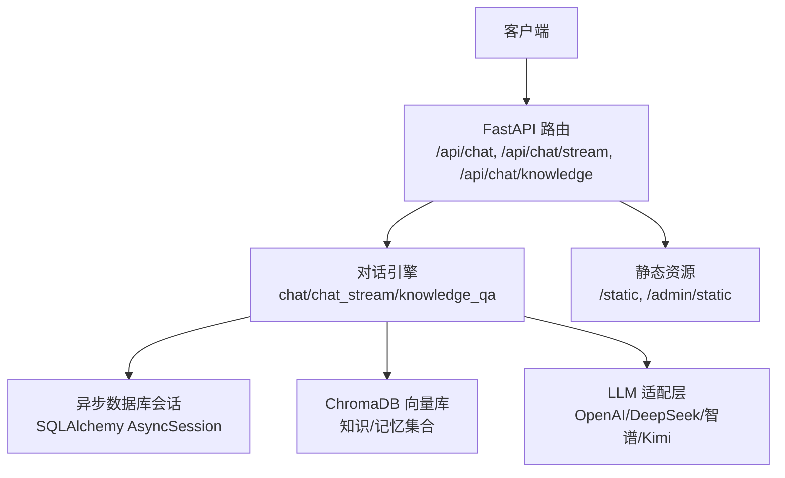
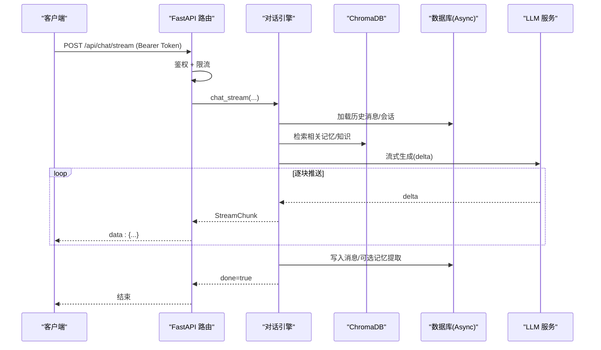
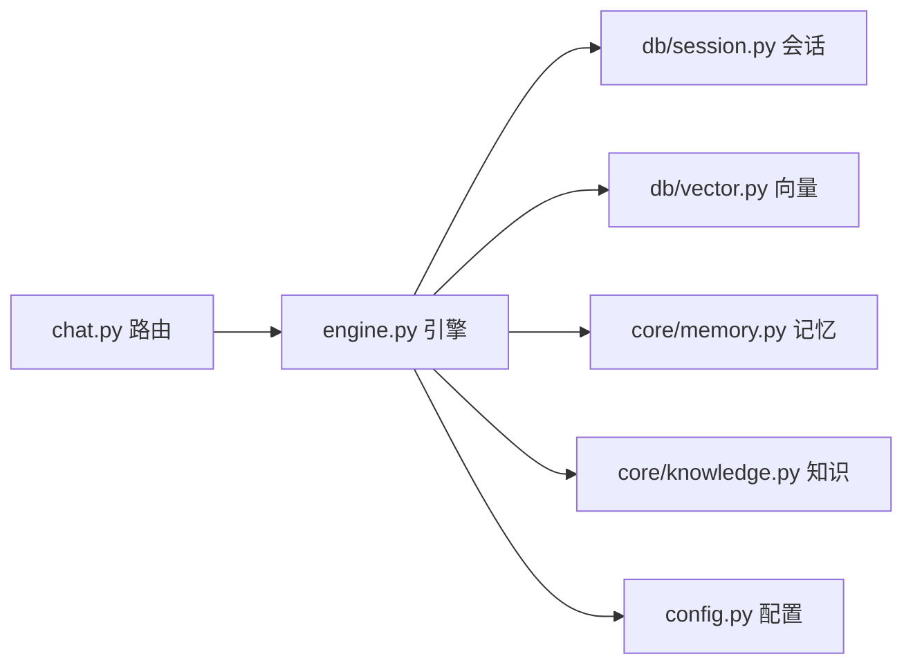

# 性能测试

<cite>
**本文引用的文件**   
- [README.md](file://README.md)
- [app.py](file://hushai/meditation/app.py)
- [config.py](file://hushai/meditation/config.py)
- [session.py](file://hushai/meditation/db/session.py)
- [vector.py](file://hushai/meditation/db/vector.py)
- [engine.py](file://hushai/meditation/core/engine.py)
- [chat.py](file://hushai/meditation/api/chat.py)
- [memory.py](file://hushai/meditation/core/memory.py)
- [knowledge.py](file://hushai/meditation/core/knowledge.py)
- [conftest.py](file://tests/conftest.py)
- [test_api.py](file://scripts/test_api.py)
</cite>

## 目录
1. [引言](#引言)
2. [项目结构](#项目结构)
3. [核心组件](#核心组件)
4. [架构总览](#架构总览)
5. [详细组件分析](#详细组件分析)
6. [依赖分析](#依赖分析)
7. [性能考虑](#性能考虑)
8. [故障排查指南](#故障排查指南)
9. [结论](#结论)
10. [附录](#附录)

## 引言
本文件面向 hush.ai 的性能测试，覆盖负载测试、压力测试、容量测试与基准测试四类场景。结合现有 FastAPI 服务、对话引擎、向量检索与数据库会话管理，给出可执行的测试策略、指标体系、工具链与回归检测方案，帮助团队在持续集成中稳定评估系统吞吐、时延与资源占用，并识别瓶颈与回归。

## 项目结构
从性能视角关注以下关键路径：
- 应用入口与中间件：FastAPI 应用创建、CORS、限流、静态资源挂载
- API 路由：对话（普通与 SSE 流式）、知识库问答、会话与消息查询
- 核心编排：上下文组装、安全校验、LLM 调用、记忆提取与持久化
- 数据层：异步 SQLAlchemy 连接池、ChromaDB 向量库
- 配置：外部 LLM、嵌入模型、数据库与 Chroma 持久化路径等

图表来源
- [app.py:136-207](file://hushai/meditation/app.py#L136-L207)
- [chat.py:58-127](file://hushai/meditation/api/chat.py#L58-L127)
- [engine.py:166-387](file://hushai/meditation/core/engine.py#L166-L387)
- [session.py:34-54](file://hushai/meditation/db/session.py#L34-L54)
- [vector.py:61-127](file://hushai/meditation/db/vector.py#L61-L127)

章节来源
- [README.md:100-178](file://README.md#L100-L178)
- [app.py:136-207](file://hushai/meditation/app.py#L136-L207)
- [chat.py:58-127](file://hushai/meditation/api/chat.py#L58-L127)

## 核心组件
- 应用生命周期与限流
  - 启动初始化数据库、默认管理员与导师数据；注册 CORS 与速率限制中间件；挂载静态资源与健康检查端点
- 对话 API
  - 普通对话与 SSE 流式对话均受每分钟 30 次限流保护；鉴权通过 Bearer Token；返回结构化响应或事件流
- 对话引擎
  - 统一构建 system prompt（记忆+知识+技能+场景+历史），执行安全检查，调用 LLM，持久化消息，周期性触发记忆提取
- 知识库与记忆
  - 文本分块入库、向量检索；记忆按用户维度过滤检索；支持归档旧低重要性记忆
- 数据库与会话
  - 自动选择 SQLite 或 PostgreSQL（asyncpg）；SQLite 使用较小连接池，PostgreSQL 使用较大连接池；提供工厂与上下文管理器
- 向量数据库
  - 支持 OpenAI 嵌入函数或本地默认嵌入；知识/记忆集合独立；支持持久化存储

章节来源
- [app.py:24-133](file://hushai/meditation/app.py#L24-L133)
- [app.py:136-207](file://hushai/meditation/app.py#L136-L207)
- [chat.py:58-127](file://hushai/meditation/api/chat.py#L58-L127)
- [engine.py:91-127](file://hushai/meditation/core/engine.py#L91-L127)
- [engine.py:166-314](file://hushai/meditation/core/engine.py#L166-L314)
- [memory.py:45-112](file://hushai/meditation/core/memory.py#L45-L112)
- [knowledge.py:137-171](file://hushai/meditation/core/knowledge.py#L137-L171)
- [session.py:34-54](file://hushai/meditation/db/session.py#L34-L54)
- [vector.py:15-28](file://hushai/meditation/db/vector.py#L15-L28)

## 架构总览
下图展示一次“流式对话”请求的关键调用链，便于定位性能热点（鉴权、上下文构建、向量检索、LLM 调用、SSE 输出）。

图表来源
- [chat.py:80-104](file://hushai/meditation/api/chat.py#L80-L104)
- [engine.py:238-314](file://hushai/meditation/core/engine.py#L238-L314)
- [vector.py:144-173](file://hushai/meditation/db/vector.py#L144-L173)
- [session.py:57-61](file://hushai/meditation/db/session.py#L57-L61)

## 详细组件分析

### 负载测试：并发对话请求与高吞吐模拟
目标
- 验证在高并发下，对话接口（普通与 SSE）的吞吐与时延表现
- 评估限流、鉴权、数据库连接池、向量检索与 LLM 调用的综合影响

建议方案
- 工具选型
  - k6：适合 HTTP/SSE 压测，支持脚本化并发、指标采集与报告
  - Locust：Python 原生，易于复用业务逻辑与 fixtures
  - httpx + asyncio：轻量级自定义并发脚本，适合快速验证
- 并发模型
  - 固定并发数阶梯增长（如 10/50/100/200），观察 P50/P95/P99 时延与错误率
  - 针对 SSE 流式接口，测量首字节时间(TTFB)、平均增量间隔、端到端完成时间
- 场景设计
  - 纯对话：短消息（~50 字）与长消息（~500 字）混合
  - 知识库问答：带 top_k=3/8 的检索增强
  - 组合场景：鉴权→检索→LLM→写库全链路
- 指标阈值建议
  - 普通对话：P95 < 2s，错误率 < 1%
  - SSE 流式：TTFB < 500ms，整体完成时间随 token 线性增长
  - 知识库问答：P95 < 3s（含向量检索与 LLM）
- 资源监控
  - 进程 CPU/内存、线程/协程数、数据库连接池使用率、ChromaDB I/O、网络带宽
  - 外部 LLM 调用延迟与配额限制告警

参考实现要点
- 使用健康检查端点判断服务就绪
- 携带 Bearer Token 进行鉴权
- 对 SSE 流式接口解析 data: 事件，统计增量时延
- 记录每个请求的耗时、状态码、错误类型

章节来源
- [app.py:203-206](file://hushai/meditation/app.py#L203-L206)
- [chat.py:58-104](file://hushai/meditation/api/chat.py#L58-L104)
- [test_api.py:30-42](file://scripts/test_api.py#L30-L42)

### 压力测试：长时间运行稳定性、内存泄漏与连接池优化
目标
- 发现长时间运行下的内存泄漏、句柄泄漏、连接池耗尽等问题
- 验证数据库连接池与向量库客户端在高压下的稳定性

建议方案
- 长时间运行
  - 以 1–2 倍预期峰值并发持续运行 4–24 小时，观察内存曲线、GC 行为、连接池活跃/空闲比
- 内存泄漏检测
  - Python 侧：tracemalloc、objgraph、memray 采样对比基线
  - 容器侧：cgroup 内存上限与 OOM 事件监控
- 连接池优化
  - SQLite：pool_size 较小，避免过多文件句柄
  - PostgreSQL：根据并发与 LLM 延迟调整 pool_size、max_overflow、pool_recycle
- 向量库稳定性
  - 高频 upsert/query 下 ChromaDB 磁盘 I/O 与索引重建开销评估
  - 必要时启用持久化目录并定期清理临时对象

章节来源
- [session.py:34-47](file://hushai/meditation/db/session.py#L34-L47)
- [vector.py:15-28](file://hushai/meditation/db/vector.py#L15-L28)

### 容量测试：最大用户数、知识库检索与向量查询优化
目标
- 确定系统在给定硬件下的最大并发用户数与 QPS 上限
- 评估知识库规模增长对检索时延的影响，优化 top_k 与分块策略

建议方案
- 容量边界
  - 逐步增加并发用户与消息长度，直至 P95 时延超过阈值或错误率上升
- 知识库检索
  - 不同文档量级（1k/10k/100k 条片段）下，top_k=3/8/20 的时延与召回质量
  - 评估 HNSW 参数与空间度量（cosine）对性能的影响
- 向量查询优化
  - 批量 upsert 与增量更新策略
  - 元数据过滤（user_id）对查询性能的影响

章节来源
- [knowledge.py:137-171](file://hushai/meditation/core/knowledge.py#L137-L171)
- [vector.py:104-127](file://hushai/meditation/db/vector.py#L104-L127)
- [vector.py:144-173](file://hushai/meditation/db/vector.py#L144-L173)

### 基准测试：响应时间、吞吐量、瓶颈识别与回归检测
目标
- 建立稳定的性能基线，自动化回归检测
- 识别系统瓶颈（CPU、I/O、网络、外部服务）

建议方案
- 基线用例
  - 单用户最小请求（无检索、短回复）
  - 典型用户请求（含记忆/知识检索、中等长度回复）
  - 重负载请求（长上下文、大 top_k、复杂提示词）
- 指标采集
  - 每类用例的 P50/P95/P99、QPS、错误率、外部 LLM 时延占比
- 回归检测
  - 将基线结果纳入 CI，比较差异超阈即失败
  - 可视化趋势图（时延、吞吐、资源）
- 瓶颈定位
  - 分层计时：鉴权、上下文构建、向量检索、LLM 调用、写库
  - 火焰图/分布式追踪（如 OpenTelemetry）辅助定位热点

章节来源
- [engine.py:91-127](file://hushai/meditation/core/engine.py#L91-L127)
- [engine.py:166-236](file://hushai/meditation/core/engine.py#L166-L236)
- [chat.py:58-127](file://hushai/meditation/api/chat.py#L58-L127)

## 依赖分析
- 组件耦合
  - API 路由依赖引擎与鉴权；引擎依赖数据库会话、向量库与 LLM 适配层
  - 配置集中管理，贯穿各层
- 外部依赖
  - LLM 提供商（OpenAI/DeepSeek/智谱/Kimi）
  - 向量库（ChromaDB）
  - 关系数据库（SQLite/PostgreSQL）
- 潜在循环依赖
  - 当前未见明显循环导入；注意在压测脚本中避免重复初始化全局配置与引擎

图表来源
- [chat.py:58-127](file://hushai/meditation/api/chat.py#L58-L127)
- [engine.py:166-387](file://hushai/meditation/core/engine.py#L166-L387)
- [session.py:34-54](file://hushai/meditation/db/session.py#L34-L54)
- [vector.py:61-127](file://hushai/meditation/db/vector.py#L61-L127)
- [memory.py:45-112](file://hushai/meditation/core/memory.py#L45-L112)
- [knowledge.py:137-171](file://hushai/meditation/core/knowledge.py#L137-L171)
- [config.py:18-53](file://hushai/meditation/config.py#L18-L53)

章节来源
- [app.py:136-207](file://hushai/meditation/app.py#L136-L207)
- [config.py:18-53](file://hushai/meditation/config.py#L18-L53)

## 性能考虑
- 连接池与超时
  - SQLite 小池、PostgreSQL 大池；合理设置 connect_args 与 pool_recycle
- 向量检索
  - 控制 top_k 与 chunk 大小；避免频繁重建索引；优先使用持久化目录
- LLM 调用
  - 设置合理的 temperature 与 max_tokens；对 SSE 流式输出做背压控制
- 限流与降级
  - 保持 API 层限流；外部 LLM 不可用时快速失败或降级到缓存/模板
- 日志与可观测性
  - 关键路径打点；结构化日志；指标上报至监控系统

[本节为通用指导，不直接分析具体文件]

## 故障排查指南
- 常见问题
  - 鉴权失败：检查 Bearer Token 格式与有效期
  - 限流触发：确认客户端重试策略与退避
  - 数据库连接不足：观察连接池使用率，调整 pool_size/max_overflow
  - 向量检索为空：确认集合存在且已 upsert 数据
  - LLM 超时/配额：记录外部服务时延与错误码，实施熔断与重试
- 诊断步骤
  - 使用健康检查端点验证服务可用性
  - 复现最小用例，分层计时定位瓶颈
  - 查看慢查询与向量检索耗时
  - 收集压测期间资源快照（CPU/内存/IO/网络）

章节来源
- [app.py:203-206](file://hushai/meditation/app.py#L203-L206)
- [chat.py:58-104](file://hushai/meditation/api/chat.py#L58-L104)
- [session.py:34-54](file://hushai/meditation/db/session.py#L34-L54)
- [vector.py:104-127](file://hushai/meditation/db/vector.py#L104-L127)

## 结论
通过系统化负载、压力、容量与基准测试，结合分层计时与资源监控，可在 hush.ai 上稳定评估端到端性能，识别并优化数据库连接池、向量检索与 LLM 调用等关键瓶颈。建议在 CI 中固化基线用例与回归阈值，确保每次变更都具备可度量的性能保障。

## 附录

### 性能测试工具与脚本示例
- k6 脚本要点
  - 定义并发与持续时间；POST 普通对话与 SSE 流式；解析 data: 事件；采集时延与错误率
- Locust 任务示例
  - 登录获取 Token；发送对话请求；统计 P95 时延与错误率
- httpx + asyncio 示例
  - 启动服务后等待健康检查；并发发起请求；记录响应时间与状态码

章节来源
- [test_api.py:45-56](file://scripts/test_api.py#L45-L56)
- [test_api.py:59-68](file://scripts/test_api.py#L59-L68)

### 测试环境与 Fixture
- pytest 公共 fixture
  - 重置全局设置，避免环境干扰
  - 提供内存 SQLite 会话与测试配置注入，隔离外部依赖

章节来源
- [conftest.py:12-20](file://tests/conftest.py#L12-L20)
- [conftest.py:30-48](file://tests/conftest.py#L30-L48)
- [conftest.py:51-68](file://tests/conftest.py#L51-L68)