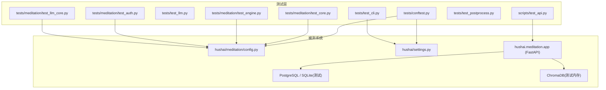
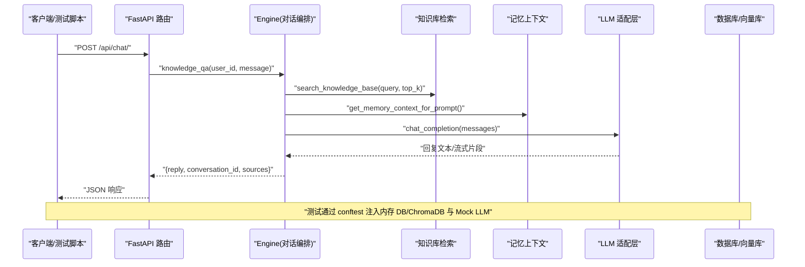
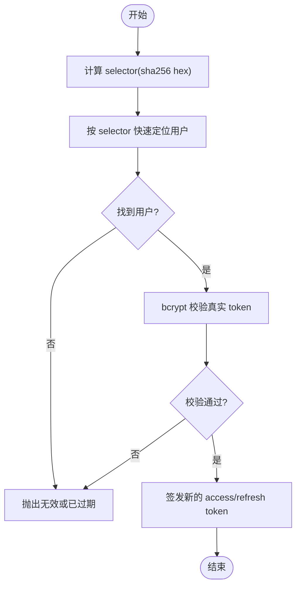
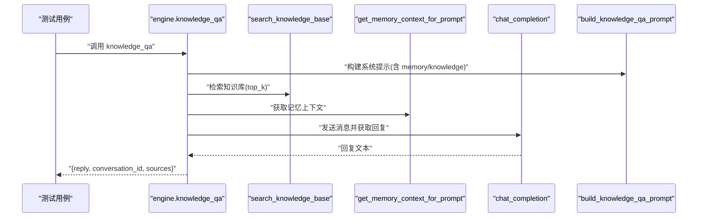
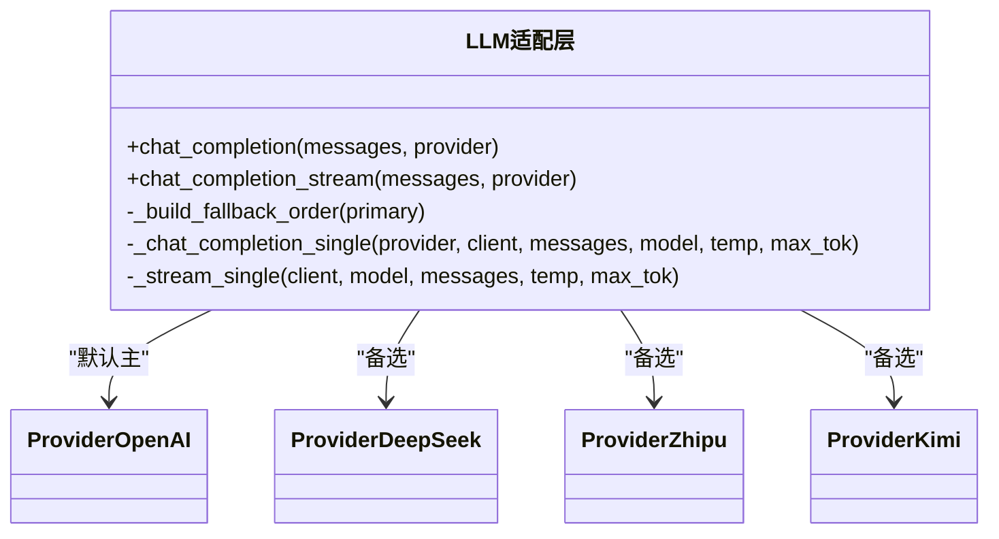
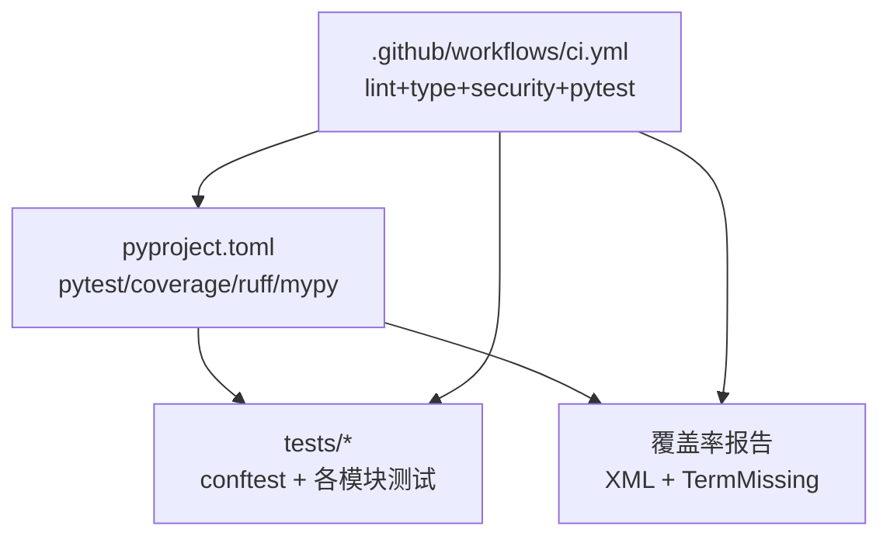

# 测试策略

<cite>
**本文引用的文件**
- [README.md](file://README.md)
- [pyproject.toml](file://pyproject.toml)
- [.github/workflows/ci.yml](file://.github/workflows/ci.yml)
- [tests/conftest.py](file://tests/conftest.py)
- [tests/meditation/test_auth.py](file://tests/meditation/test_auth.py)
- [tests/meditation/test_engine.py](file://tests/meditation/test_engine.py)
- [tests/meditation/test_core.py](file://tests/meditation/test_core.py)
- [tests/meditation/test_llm_core.py](file://tests/meditation/test_llm_core.py)
- [tests/test_cli.py](file://tests/test_cli.py)
- [tests/test_llm.py](file://tests/test_llm.py)
- [tests/test_postprocess.py](file://tests/test_postprocess.py)
- [scripts/test_api.py](file://scripts/test_api.py)
- [hushai/meditation/config.py](file://hushai/meditation/config.py)
- [hushai/settings.py](file://hushai/settings.py)
</cite>

## 目录
1. [引言](#引言)
2. [项目结构](#项目结构)
3. [核心组件](#核心组件)
4. [架构总览](#架构总览)
5. [详细组件分析](#详细组件分析)
6. [依赖分析](#依赖分析)
7. [性能考虑](#性能考虑)
8. [故障排查指南](#故障排查指南)
9. [结论](#结论)
10. [附录](#附录)

## 引言
本测试策略面向 hush.ai 的“冥想”模块与 CLI，目标是建立覆盖单元测试、集成测试、性能与稳定性测试以及自动化 CI/CD 的完整质量保证体系。文档将基于仓库现有测试代码与配置，给出可执行的规范与实践建议，帮助团队在持续演进中保持高可靠与高可维护性。

## 项目结构
当前仓库已具备清晰的测试分层：
- 单元测试：位于 tests/ 下，按功能域组织（CLI、LLM、postprocess、meditation 子模块）
- 公共夹具：tests/conftest.py 提供全局设置重置、内存数据库会话、测试配置注入等能力
- 本地集成脚本：scripts/test_api.py 启动服务并执行端到端 API 验证
- CI 流水线：.github/workflows/ci.yml 统一执行 lint、类型检查、安全扫描与 pytest 覆盖率门禁

图表来源
- [tests/conftest.py:1-68](file://tests/conftest.py#L1-L68)
- [hushai/meditation/config.py:118-135](file://hushai/meditation/config.py#L118-L135)
- [hushai/settings.py:185-225](file://hushai/settings.py#L185-L225)
- [scripts/test_api.py:1-175](file://scripts/test_api.py#L1-L175)

章节来源
- [README.md:136-178](file://README.md#L136-L178)
- [pyproject.toml:85-101](file://pyproject.toml#L85-L101)
- [tests/conftest.py:1-68](file://tests/conftest.py#L1-L68)

## 核心组件
本节聚焦测试基础设施与关键用例设计要点，结合现有实现总结最佳实践。

- 测试环境隔离
  - 使用 autouse fixture 清理环境变量并调用 reset_for_tests()，避免跨测试污染
  - 通过 set_config()/reset_config() 注入测试用 MeditationConfig，确保无外部依赖
- 数据库测试
  - 使用内存 SQLite + aiosqlite 创建独立 AsyncSession，自动建表并在测试后释放
- LLM 适配层测试
  - 对 OpenAI 客户端进行 mock，覆盖主 provider 失败时的 fallback 顺序与流式异常传播
- 认证与安全
  - 校验 JWT type 字段强制为 access；refresh token 查找采用 selector O(1) 定位，再 bcrypt 校验
- 引擎编排
  - 通过 patch 替换知识检索、记忆上下文、chat_completion 等外部依赖，断言提示词构建与结果结构
- CLI 行为
  - 模拟 stdin、环境变量与配置文件路径，覆盖模式切换、错误输出与退出码

章节来源
- [tests/conftest.py:12-20](file://tests/conftest.py#L12-L20)
- [tests/conftest.py:30-48](file://tests/conftest.py#L30-L48)
- [tests/conftest.py:51-67](file://tests/conftest.py#L51-L67)
- [hushai/meditation/config.py:121-135](file://hushai/meditation/config.py#L121-L135)
- [hushai/settings.py:221-225](file://hushai/settings.py#L221-L225)
- [tests/meditation/test_auth.py:34-47](file://tests/meditation/test_auth.py#L34-L47)
- [tests/meditation/test_auth.py:49-78](file://tests/meditation/test_auth.py#L49-L78)
- [tests/meditation/test_auth.py:81-108](file://tests/meditation/test_auth.py#L81-L108)
- [tests/meditation/test_engine.py:55-94](file://tests/meditation/test_engine.py#L55-L94)
- [tests/meditation/test_engine.py:96-150](file://tests/meditation/test_engine.py#L96-L150)
- [tests/meditation/test_engine.py:151-188](file://tests/meditation/test_engine.py#L151-L188)
- [tests/meditation/test_engine.py:190-227](file://tests/meditation/test_engine.py#L190-L227)
- [tests/meditation/test_engine.py:228-262](file://tests/meditation/test_engine.py#L228-L262)
- [tests/meditation/test_engine.py:263-283](file://tests/meditation/test_engine.py#L263-L283)
- [tests/meditation/test_llm_core.py:41-59](file://tests/meditation/test_llm_core.py#L41-L59)
- [tests/meditation/test_llm_core.py:61-99](file://tests/meditation/test_llm_core.py#L61-L99)
- [tests/meditation/test_llm_core.py:101-121](file://tests/meditation/test_llm_core.py#L101-L121)
- [tests/meditation/test_llm_core.py:122-155](file://tests/meditation/test_llm_core.py#L122-L155)
- [tests/meditation/test_llm_core.py:157-169](file://tests/meditation/test_llm_core.py#L157-L169)
- [tests/test_cli.py:24-33](file://tests/test_cli.py#L24-L33)
- [tests/test_cli.py:45-55](file://tests/test_cli.py#L45-L55)
- [tests/test_cli.py:83-92](file://tests/test_cli.py#L83-92)
- [tests/test_cli.py:103-114](file://tests/test_cli.py#L103-114)
- [tests/test_cli.py:121-142](file://tests/test_cli.py#L121-142)
- [tests/test_cli.py:179-191](file://tests/test_cli.py#L179-191)
- [tests/test_cli.py:193-203](file://tests/test_cli.py#L193-203)
- [tests/test_cli.py:218-226](file://tests/test_cli.py#L218-226)
- [tests/test_cli.py:228-242](file://tests/test_cli.py#L228-242)
- [tests/test_llm.py:10-33](file://tests/test_llm.py#L10-L33)
- [tests/test_llm.py:35-56](file://tests/test_llm.py#L35-L56)
- [tests/test_llm.py:58-78](file://tests/test_llm.py#L58-L78)
- [tests/test_llm.py:80-101](file://tests/test_llm.py#L80-L101)
- [tests/test_llm.py:103-119](file://tests/test_llm.py#L103-L119)
- [tests/test_postprocess.py:6-32](file://tests/test_postprocess.py#L6-L32)

## 架构总览
下图展示从请求到响应的主要链路，以及测试在各层的切入位置。

图表来源
- [tests/meditation/test_engine.py:55-94](file://tests/meditation/test_engine.py#L55-L94)
- [tests/meditation/test_engine.py:96-150](file://tests/meditation/test_engine.py#L96-L150)
- [tests/meditation/test_engine.py:151-188](file://tests/meditation/test_engine.py#L151-L188)
- [tests/meditation/test_engine.py:190-227](file://tests/meditation/test_engine.py#L190-L227)
- [tests/meditation/test_engine.py:228-262](file://tests/meditation/test_engine.py#L228-L262)
- [tests/meditation/test_engine.py:263-283](file://tests/meditation/test_engine.py#L263-L283)
- [tests/meditation/test_llm_core.py:101-121](file://tests/meditation/test_llm_core.py#L101-L121)
- [tests/meditation/test_llm_core.py:122-155](file://tests/meditation/test_llm_core.py#L122-L155)
- [scripts/test_api.py:59-170](file://scripts/test_api.py#L59-L170)

## 详细组件分析

### 认证与令牌安全测试
- 目标
  - 校验 refresh token 查找复杂度优化（selector 索引），拒绝缺失或错误的 type 字段，保证 Bearer 解析健壮
- 关键点
  - 使用 _token_selector 生成固定长度 hex 作为 O(1) 查询键
  - verify_token 强制 type=access，否则抛出运行时错误
  - 通过 patch 绕过 bcrypt 细节，专注选择器命中与刷新逻辑
- 推荐断言
  - 返回新 access/refresh token，且旧 token 不再复用
  - 未知 token 或哈希不匹配时抛出明确错误信息

图表来源
- [tests/meditation/test_auth.py:39-47](file://tests/meditation/test_auth.py#L39-L47)
- [tests/meditation/test_auth.py:49-78](file://tests/meditation/test_auth.py#L49-L78)
- [tests/meditation/test_auth.py:81-108](file://tests/meditation/test_auth.py#L81-L108)
- [tests/meditation/test_auth.py:110-136](file://tests/meditation/test_auth.py#L110-L136)

章节来源
- [tests/meditation/test_auth.py:34-47](file://tests/meditation/test_auth.py#L34-L47)
- [tests/meditation/test_auth.py:49-78](file://tests/meditation/test_auth.py#L49-L78)
- [tests/meditation/test_auth.py:81-108](file://tests/meditation/test_auth.py#L81-L108)
- [tests/meditation/test_auth.py:110-136](file://tests/meditation/test_auth.py#L110-L136)

### 对话引擎编排测试
- 目标
  - 验证 knowledge_qa 流程：构建系统提示、检索知识库、组装记忆上下文、限制来源数量、异常回滚
- 关键点
  - 使用 patch 替换 get_session_factory、search_knowledge_base、get_memory_context_for_prompt、chat_completion、build_knowledge_qa_prompt
  - 断言提示词参数包含知识与记忆上下文
  - 断言返回 reply、conversation_id、sources 结构
  - 断言异常触发 session.rollback
- 推荐断言
  - sources 数量上限为 5
  - 当外部检索抛错时，事务回滚被调用

图表来源
- [tests/meditation/test_engine.py:55-94](file://tests/meditation/test_engine.py#L55-L94)
- [tests/meditation/test_engine.py:96-150](file://tests/meditation/test_engine.py#L96-L150)
- [tests/meditation/test_engine.py:151-188](file://tests/meditation/test_engine.py#L151-L188)
- [tests/meditation/test_engine.py:190-227](file://tests/meditation/test_engine.py#L190-L227)
- [tests/meditation/test_engine.py:228-262](file://tests/meditation/test_engine.py#L228-L262)
- [tests/meditation/test_engine.py:263-283](file://tests/meditation/test_engine.py#L263-L283)

章节来源
- [tests/meditation/test_engine.py:55-94](file://tests/meditation/test_engine.py#L55-L94)
- [tests/meditation/test_engine.py:96-150](file://tests/meditation/test_engine.py#L96-L150)
- [tests/meditation/test_engine.py:151-188](file://tests/meditation/test_engine.py#L151-L188)
- [tests/meditation/test_engine.py:190-227](file://tests/meditation/test_engine.py#L190-L227)
- [tests/meditation/test_engine.py:228-262](file://tests/meditation/test_engine.py#L228-L262)
- [tests/meditation/test_engine.py:263-283](file://tests/meditation/test_engine.py#L263-L283)

### LLM 适配层与降级策略测试
- 目标
  - 验证主 provider 失败时正确降级至备选 provider；流式场景下异常传播与 generator 语义修复；debug 无 key 走 mock
- 关键点
  - _build_fallback_order 保证主 provider 在前且去重
  - _stream_single 仅负责拉取 delta，异常由上层 try/except 驱动 fallback
  - debug 模式下若无有效 key，直接返回 mock 内容
- 推荐断言
  - 调用日志记录 provider 尝试顺序
  - 流式迭代产出期望片段
  - 异常类型与消息符合预期

图表来源
- [tests/meditation/test_llm_core.py:41-59](file://tests/meditation/test_llm_core.py#L41-L59)
- [tests/meditation/test_llm_core.py:61-99](file://tests/meditation/test_llm_core.py#L61-L99)
- [tests/meditation/test_llm_core.py:101-121](file://tests/meditation/test_llm_core.py#L101-L121)
- [tests/meditation/test_llm_core.py:122-155](file://tests/meditation/test_llm_core.py#L122-L155)
- [tests/meditation/test_llm_core.py:157-169](file://tests/meditation/test_llm_core.py#L157-L169)

章节来源
- [tests/meditation/test_llm_core.py:41-59](file://tests/meditation/test_llm_core.py#L41-L59)
- [tests/meditation/test_llm_core.py:61-99](file://tests/meditation/test_llm_core.py#L61-L99)
- [tests/meditation/test_llm_core.py:101-121](file://tests/meditation/test_llm_core.py#L101-L121)
- [tests/meditation/test_llm_core.py:122-155](file://tests/meditation/test_llm_core.py#L122-L155)
- [tests/meditation/test_llm_core.py:157-169](file://tests/meditation/test_llm_core.py#L157-L169)

### CLI 行为与模式测试
- 目标
  - 覆盖未配置密钥、交互式输入、管道输入、模式标志、错误输出格式与退出码
- 关键点
  - 通过 monkeypatch 控制 sys.stdin、环境变量与配置文件路径
  - 断言不同模式下的 banner 文案与行为差异
  - JSON 错误输出格式与可读性
- 推荐断言
  - 成功路径返回 0 并输出单句答案
  - 失败路径返回非 0 并输出友好错误信息

章节来源
- [tests/test_cli.py:24-33](file://tests/test_cli.py#L24-L33)
- [tests/test_cli.py:45-55](file://tests/test_cli.py#L45-L55)
- [tests/test_cli.py:83-92](file://tests/test_cli.py#L83-92)
- [tests/test_cli.py:103-114](file://tests/test_cli.py#L103-114)
- [tests/test_cli.py:121-142](file://tests/test_cli.py#L121-142)
- [tests/test_cli.py:179-191](file://tests/test_cli.py#L179-191)
- [tests/test_cli.py:193-203](file://tests/test_cli.py#L193-203)
- [tests/test_cli.py:218-226](file://tests/test_cli.py#L218-226)
- [tests/test_cli.py:228-242](file://tests/test_cli.py#L228-242)

### LLM 顶层调用与后处理测试
- 目标
  - 验证 chat_once 在不同模式下的系统提示构造与返回值处理
  - 验证 to_one_sentence 的后处理规则（中文句号、英文感叹号、长行截断、空输入）
- 关键点
  - 使用 MagicMock 模拟 OpenAI 客户端与响应结构
  - 断言 messages 列表结构与系统提示关键词
- 推荐断言
  - 模式切换影响系统提示关键词
  - 后处理严格遵循“一句话”约束

章节来源
- [tests/test_llm.py:10-33](file://tests/test_llm.py#L10-L33)
- [tests/test_llm.py:35-56](file://tests/test_llm.py#L35-L56)
- [tests/test_llm.py:58-78](file://tests/test_llm.py#L58-L78)
- [tests/test_llm.py:80-101](file://tests/test_llm.py#L80-L101)
- [tests/test_llm.py:103-119](file://tests/test_llm.py#L103-L119)
- [tests/test_postprocess.py:6-32](file://tests/test_postprocess.py#L6-L32)

### 本地集成测试脚本
- 目标
  - 启动 FastAPI 服务，依次验证健康检查、Swagger 文档、登录、知识导入与搜索、对话、记忆读取、管理后台档案
- 关键点
  - 使用 httpx.AsyncClient 异步发起请求
  - 通过 wait_ready 轮询 /health 等待服务就绪
  - 在微信登录不可用时，直接插入测试用户并签发 token
- 推荐断言
  - 各接口状态码为 200
  - 返回数据包含必要字段

章节来源
- [scripts/test_api.py:1-175](file://scripts/test_api.py#L1-L175)

## 依赖分析
- 测试框架与插件
  - pytest、pytest-cov、pytest-asyncio 已在 pyproject.toml 中声明
  - 测试路径与标记在 [tool.pytest.ini_options] 中配置
- 覆盖率与报告
  - coverage.run.source 指向 hushai，omit 排除入口脚本
  - CI 中要求覆盖率不低于 70%，并生成 XML 与终端缺失行报告
- 代码质量与安全
  - ruff 用于格式化与检查
  - mypy 进行静态类型检查
  - bandit 进行安全扫描
  - pip-audit 作为信息性依赖审计

图表来源
- [pyproject.toml:85-101](file://pyproject.toml#L85-L101)
- [.github/workflows/ci.yml:40-57](file://.github/workflows/ci.yml#L40-L57)

章节来源
- [pyproject.toml:85-101](file://pyproject.toml#L85-L101)
- [.github/workflows/ci.yml:40-57](file://.github/workflows/ci.yml#L40-L57)

## 性能考虑
- 单元测试层面
  - 优先使用内存 SQLite 与内存 ChromaDB，避免磁盘 I/O 与网络开销
  - 使用 AsyncMock/MagicMock 替代真实 LLM 调用，减少不确定性
- 集成测试层面
  - 使用 scripts/test_api.py 进行轻量级端到端验证，避免长时间运行
- 压力与容量测试（建议）
  - 引入 locust 或 k6 对 /api/chat/ 与 /api/chat/stream 进行并发压测
  - 关注 P95/P99 延迟、错误率、CPU/内存占用与连接池利用率
  - 针对 LLM 提供商限流与超时，增加熔断与重试退避策略的回归用例
- 稳定性测试（建议）
  - 长时间运行（soak）验证资源泄漏、连接池耗尽、向量库持久化一致性
  - 注入随机故障（网络抖动、上游 5xx）验证降级与恢复路径

[本节为通用指导，无需特定文件引用]

## 故障排查指南
- 常见问题
  - 测试间状态污染：确认 autouse fixture 是否调用 reset_for_tests() 与 reset_config()
  - 数据库连接问题：确认使用内存 SQLite 与 StaticPool，避免多线程冲突
  - LLM 调用失败：确认 debug 模式与 mock 分支是否生效，fallback 顺序是否正确
  - 认证失败：检查 JWT type 字段是否为 access，selector 与 bcrypt 校验是否一致
- 定位方法
  - 使用 pytest -s 打印中间状态
  - 查看 CI 中的覆盖率缺失行，补充边界用例
  - 在本地运行 scripts/test_api.py 逐步定位接口问题

章节来源
- [tests/conftest.py:12-20](file://tests/conftest.py#L12-L20)
- [tests/conftest.py:30-48](file://tests/conftest.py#L30-L48)
- [tests/meditation/test_auth.py:49-78](file://tests/meditation/test_auth.py#L49-L78)
- [tests/meditation/test_llm_core.py:101-121](file://tests/meditation/test_llm_core.py#L101-L121)
- [scripts/test_api.py:59-170](file://scripts/test_api.py#L59-L170)

## 结论
本项目已具备良好的测试基础：统一的 pytest 配置、完善的夹具、覆盖核心业务与安全的用例集，以及稳定的 CI 流水线。建议在现有基础上扩展性能与稳定性测试，完善覆盖率门禁与报告可视化，形成更全面的测试质量体系。

[本节为总结，无需特定文件引用]

## 附录

### 单元测试编写规范与最佳实践
- 命名与组织
  - 文件名以 test_ 开头，类名以 Test 开头，方法描述具体场景
  - 按模块划分测试目录，便于定位与维护
- 用例设计
  - 正向路径、异常路径、边界条件全覆盖
  - 对复杂流程（如引擎编排）拆分多个小用例，每个断言单一职责
- Mock 对象使用
  - 使用 unittest.mock.AsyncMock/MagicMock 替代外部依赖
  - 对 LLM 客户端、数据库会话、向量检索进行精确 mock
- 断言方法选择
  - 使用 assert 与 pytest.raises 表达预期行为
  - 对结构化返回体断言关键字段存在性与取值范围
- 异步测试
  - 使用 @pytest.mark.asyncio 与 async def 编写异步用例
  - 确保协程生命周期与资源清理正确

章节来源
- [tests/meditation/test_engine.py:55-94](file://tests/meditation/test_engine.py#L55-L94)
- [tests/meditation/test_llm_core.py:61-99](file://tests/meditation/test_llm_core.py#L61-L99)
- [tests/test_cli.py:24-33](file://tests/test_cli.py#L24-L33)

### 集成测试实现方案
- 数据库测试
  - 使用内存 SQLite + aiosqlite，自动建表与释放
  - 通过 fixtures 注入 AsyncSession，避免全局状态
- API 接口测试
  - 使用 httpx.AsyncClient 发起请求，断言状态码与响应结构
  - 在本地脚本中启动服务，轮询健康检查后再执行用例
- 外部服务模拟
  - 对 LLM 调用进行 mock，支持正常与异常分支
  - 对向量检索返回可控结果，验证提示词构建与来源限制

章节来源
- [tests/conftest.py:30-48](file://tests/conftest.py#L30-L48)
- [scripts/test_api.py:59-170](file://scripts/test_api.py#L59-L170)
- [tests/meditation/test_engine.py:96-150](file://tests/meditation/test_engine.py#L96-L150)

### 自动化测试流程搭建
- CI/CD 集成
  - 在 GitHub Actions 中执行 ruff、mypy、bandit、pytest 与覆盖率门禁
  - 多 Python 版本矩阵并行执行，提升兼容性保障
- 覆盖率要求
  - 覆盖率阈值设置为 70%，生成 XML 与终端缺失行报告
- 测试报告生成
  - 使用 pytest-cov 输出 HTML/XML 报告，便于归档与分析

章节来源
- [.github/workflows/ci.yml:40-57](file://.github/workflows/ci.yml#L40-L57)
- [pyproject.toml:85-101](file://pyproject.toml#L85-L101)

### 测试数据管理与测试环境配置
- 测试数据
  - 使用 fixtures 动态构造最小数据集，避免硬编码大对象
  - 对知识库与记忆上下文使用可控字符串，便于断言
- 环境配置
  - 通过 set_config() 注入测试配置，关闭对外部服务的依赖
  - 使用 monkeypatch 清理环境变量，防止跨测试污染

章节来源
- [tests/conftest.py:51-67](file://tests/conftest.py#L51-L67)
- [hushai/meditation/config.py:121-135](file://hushai/meditation/config.py#L121-L135)
- [hushai/settings.py:221-225](file://hushai/settings.py#L221-L225)