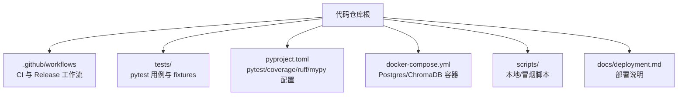
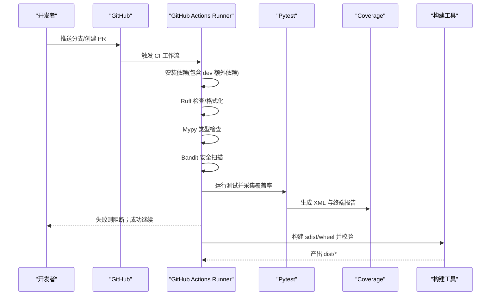
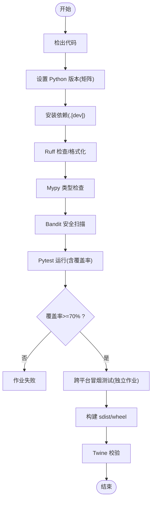
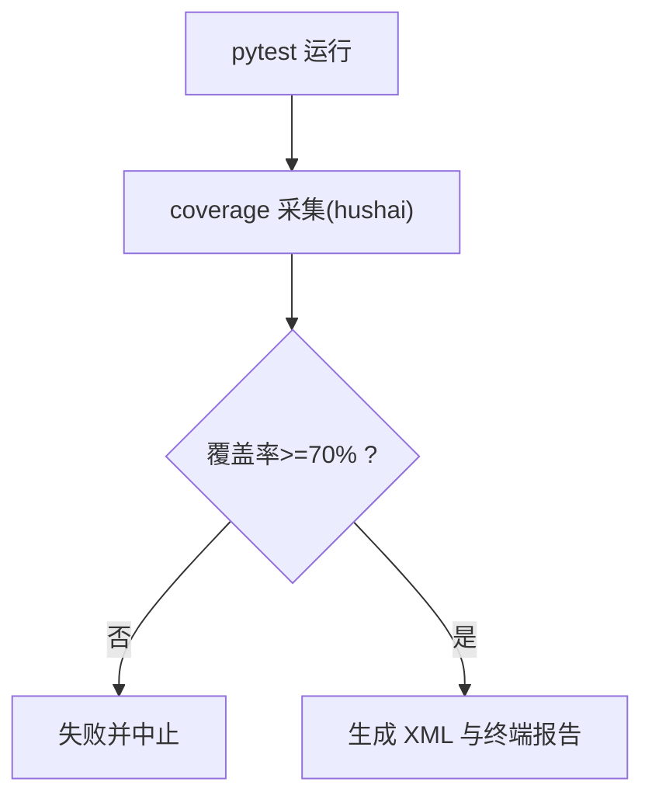
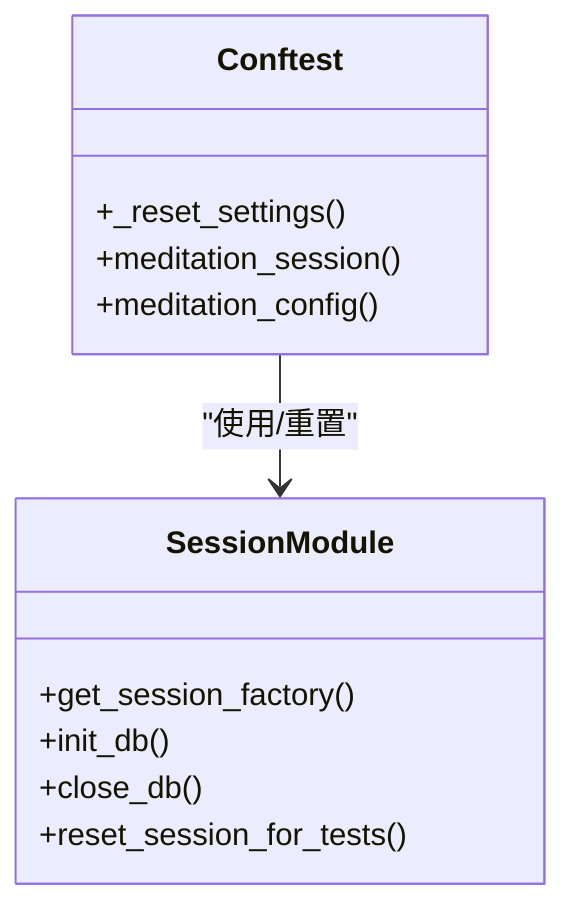
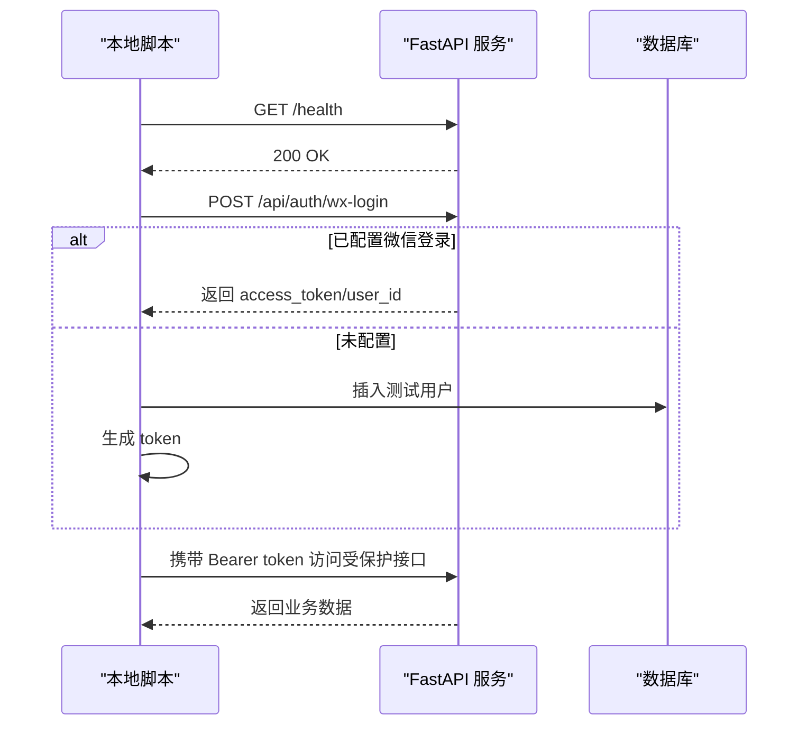
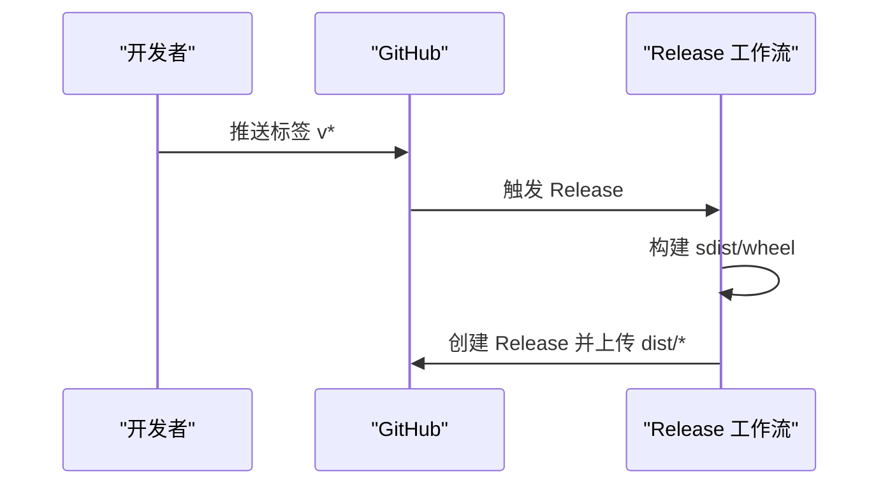
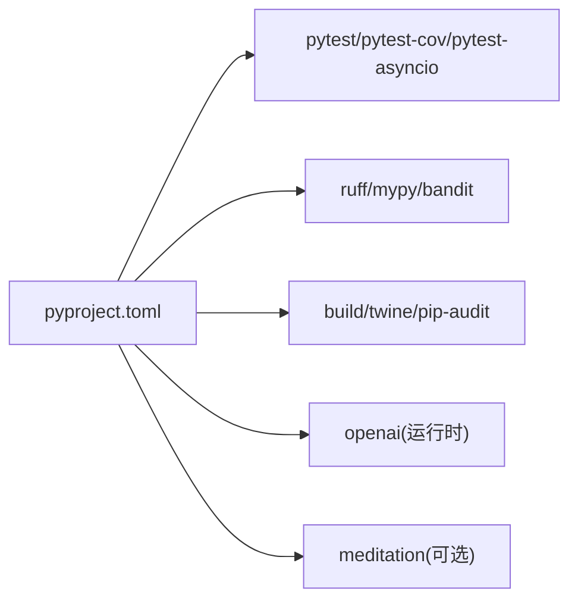

# 自动化测试

<cite>
**本文引用的文件**
- [ci.yml](file://.github/workflows/ci.yml)
- [release.yml](file://.github/workflows/release.yml)
- [pyproject.toml](file://pyproject.toml)
- [docker-compose.yml](file://docker-compose.yml)
- [conftest.py](file://tests/conftest.py)
- [session.py](file://hushai/meditation/db/session.py)
- [test_api.py](file://scripts/test_api.py)
- [test_local.py](file://scripts/test_local.py)
- [CONTRIBUTING.md](file://CONTRIBUTING.md)
- [deployment.md](file://docs/deployment.md)
</cite>

## 目录
1. [简介](#简介)
2. [项目结构](#项目结构)
3. [核心组件](#核心组件)
4. [架构总览](#架构总览)
5. [详细组件分析](#详细组件分析)
6. [依赖关系分析](#依赖关系分析)
7. [性能与并行执行](#性能与并行执行)
8. [故障排查指南](#故障排查指南)
9. [结论](#结论)
10. [附录：部署与维护指南](#附录部署与维护指南)

## 简介
本文件面向 hush.ai 项目的自动化测试体系，覆盖以下内容：
- CI/CD 流水线配置（GitHub Actions）：触发条件、矩阵并行、质量门禁
- 测试覆盖率要求与报告：统计范围、阈值、输出产物
- 测试环境自动化管理：Docker 服务编排、内存数据库、配置注入
- 测试结果收集与反馈：报告生成、失败告警、趋势分析建议
- 自动化测试的部署与维护实践

## 项目结构
仓库采用“源码 + 测试 + CI + 文档”的分层组织方式。与自动化测试直接相关的目录与文件包括：
- .github/workflows：CI 与发布工作流
- tests：pytest 用例与公共 fixture
- scripts：本地与冒烟脚本（可选）
- pyproject.toml：pytest、coverage、ruff、mypy 等工具配置
- docker-compose.yml：PostgreSQL 与 ChromaDB 容器编排
- docs/deployment.md：部署说明（含容器端口与默认凭据）

**章节来源**
- [ci.yml:1-99](file://.github/workflows/ci.yml#L1-L99)
- [pyproject.toml:85-101](file://pyproject.toml#L85-L101)
- [docker-compose.yml:1-31](file://docker-compose.yml#L1-L31)
- [CONTRIBUTING.md:54-80](file://CONTRIBUTING.md#L54-L80)

## 核心组件
- CI 工作流（Lint/类型检查/测试/构建）
  - 多 Python 版本矩阵并行执行
  - Ruff 检查与格式化校验
  - Mypy 静态类型检查
  - Bandit 安全扫描
  - Pytest 运行并生成覆盖率报告，设置覆盖率门槛
  - 跨平台冒烟测试（Windows/macOS）
  - sdist/wheel 构建与 twine 校验
- 覆盖率与质量门禁
  - 覆盖率统计范围限定为 hushai 包
  - 覆盖率阈值设置为 70%
  - 输出 XML 与终端缺失行报告
- 测试环境与数据初始化
  - pytest 自动重置环境变量与模块级配置
  - 提供内存 SQLite 会话 fixture，避免外部数据库依赖
  - 可选通过 docker-compose 启动 Postgres/ChromaDB 用于集成测试或本地调试
- 结果收集与反馈
  - 生成 coverage.xml 便于后续上传到覆盖率平台
  - 失败时 CI 会中断并展示日志，便于快速定位问题

**章节来源**
- [ci.yml:17-57](file://.github/workflows/ci.yml#L17-L57)
- [ci.yml:59-83](file://.github/workflows/ci.yml#L59-L83)
- [ci.yml:85-99](file://.github/workflows/ci.yml#L85-L99)
- [pyproject.toml:85-101](file://pyproject.toml#L85-L101)
- [CONTRIBUTING.md:71-77](file://CONTRIBUTING.md#L71-L77)

## 架构总览
下图展示了从代码提交到测试执行的端到端流程，以及关键工件（覆盖率报告、构建产物）的产出位置。

**图表来源**
- [ci.yml:17-99](file://.github/workflows/ci.yml#L17-L99)
- [pyproject.toml:85-101](file://pyproject.toml#L85-L101)

## 详细组件分析

### CI 流水线（GitHub Actions）
- 触发条件
  - push 到 main/master 分支
  - 对 main/master 的 pull_request
- 并发控制
  - 使用 group 与 cancel-in-progress 避免重复任务堆积
- 作业划分
  - lint-test：在多个 Python 版本上并行执行 Lint、类型检查、安全扫描与测试
  - smoke-cross-platform：在 Windows/macOS 上执行轻量冒烟测试
  - build-sdist：构建并发布制品前的校验
- 质量门禁
  - 覆盖率门槛：70%（未达标将导致作业失败）
  - 严格标记：启用 strict-markers
  - 安全扫描：Bandit 作为门禁步骤
- 产物
  - coverage.xml（可用于上传至第三方覆盖率平台）
  - dist/*（sdist/wheel）

**图表来源**
- [ci.yml:17-99](file://.github/workflows/ci.yml#L17-L99)
- [pyproject.toml:85-101](file://pyproject.toml#L85-L101)

**章节来源**
- [ci.yml:1-99](file://.github/workflows/ci.yml#L1-L99)
- [CONTRIBUTING.md:71-77](file://CONTRIBUTING.md#L71-L77)

### 覆盖率策略与阈值
- 统计范围
  - source 指定为 hushai 包
  - 排除入口脚本 __main__.py
- 报告选项
  - 显示缺失行、跳过已覆盖文件
- 阈值
  - --cov-fail-under=70，低于阈值即失败
- 产物
  - --cov-report=xml 生成 coverage.xml，可被覆盖率平台消费
  - --cov-report=term-missing 在控制台打印缺失行

**图表来源**
- [pyproject.toml:92-101](file://pyproject.toml#L92-L101)
- [ci.yml:52-53](file://.github/workflows/ci.yml#L52-L53)

**章节来源**
- [pyproject.toml:92-101](file://pyproject.toml#L92-L101)
- [ci.yml:52-53](file://.github/workflows/ci.yml#L52-L53)
- [CONTRIBUTING.md:71-77](file://CONTRIBUTING.md#L71-L77)

### 测试环境与数据初始化
- 全局设置隔离
  - 每个测试前自动删除 HUSH_MODE/HUSH_CALM_MODE 环境变量并调用 reset_for_tests()，避免污染
- 数据库会话
  - 提供 meditation_session fixture：基于内存 SQLite + aiosqlite，自动建表并在测试结束后清理
  - 与全局 session 工厂解耦，确保测试间互不干扰
- 配置注入
  - 提供 meditation_config fixture：注入测试用配置（debug=True、固定 JWT secret），测试后恢复
- 外部服务（可选）
  - docker-compose 提供 PostgreSQL 与 ChromaDB 容器，适合本地集成测试或演示
  - 注意：应用默认使用嵌入式 Chroma，不会自动连接 Compose 中的 Chroma 容器；如需连接远程 Chroma 需修改代码

**图表来源**
- [conftest.py:12-68](file://tests/conftest.py#L12-L68)
- [session.py:50-82](file://hushai/meditation/db/session.py#L50-L82)

**章节来源**
- [conftest.py:12-68](file://tests/conftest.py#L12-L68)
- [session.py:50-82](file://hushai/meditation/db/session.py#L50-L82)
- [docker-compose.yml:1-31](file://docker-compose.yml#L1-L31)
- [deployment.md:16-16](file://docs/deployment.md#L16-L16)
- [deployment.md:95-95](file://docs/deployment.md#L95-L95)

### API 冒烟与本地验证脚本
- 本地冒烟脚本
  - 等待服务就绪后访问 /health 与 /docs
  - 尝试微信登录接口，若未配置则回退为直连数据库创建测试用户并签发 token
  - 使用 Authorization: Bearer 头进行受保护资源访问
- 本地一键脚本
  - 封装了用户创建、token 获取与请求发送流程，便于本地联调

**图表来源**
- [test_api.py:59-94](file://scripts/test_api.py#L59-L94)
- [test_local.py:132-158](file://scripts/test_local.py#L132-L158)

**章节来源**
- [test_api.py:59-94](file://scripts/test_api.py#L59-L94)
- [test_local.py:132-158](file://scripts/test_local.py#L132-L158)

### 发布流水线（Release）
- 触发条件：推送 v* 标签
- 主要步骤：构建 sdist/wheel，创建 GitHub Release 并附带制品与自动生成说明

**图表来源**
- [release.yml:1-36](file://.github/workflows/release.yml#L1-L36)

**章节来源**
- [release.yml:1-36](file://.github/workflows/release.yml#L1-L36)

## 依赖关系分析
- 开发依赖
  - pytest、pytest-cov、pytest-asyncio、ruff、mypy、bandit、pip-audit、build、twine 等
- 运行时依赖（示例）
  - openai
- 可选扩展依赖（meditation）
  - fastapi、uvicorn、sqlalchemy、alembic、chromadb、httpx、pydantic 等

**图表来源**
- [pyproject.toml:27-74](file://pyproject.toml#L27-L74)

**章节来源**
- [pyproject.toml:27-74](file://pyproject.toml#L27-L74)

## 性能与并行执行
- 并行策略
  - CI 使用 strategy.matrix 在多个 Python 版本上并行执行 lint-test
  - fail-fast=false 保证所有矩阵均执行完毕，便于一次性发现多版本兼容性问题
- 缓存优化
  - 使用 actions/setup-python 的 pip cache，加速依赖安装
- 建议
  - 对于更大型套件，可按功能域拆分 jobs 或使用 pytest-xdist 进一步并行化
  - 将覆盖率聚合步骤加入 workflow，统一汇总多进程/多机器的覆盖率

**章节来源**
- [ci.yml:17-57](file://.github/workflows/ci.yml#L17-L57)

## 故障排查指南
- 覆盖率失败
  - 现象：CI 在 Pytest 步骤失败
  - 排查：确认覆盖率统计范围与阈值；检查新增代码是否补充对应测试
  - 参考：覆盖率阈值与报告配置
- 异步测试报错
  - 现象：AsyncSession 相关错误
  - 排查：确认使用了 meditation_session fixture；检查事件循环与线程安全参数
- 外部服务不可用
  - 现象：Postgres/ChromaDB 连接失败
  - 排查：确认 docker-compose 已启动且健康检查通过；核对默认凭据与端口
- 本地冒烟失败
  - 现象：/health 或 /docs 无法访问
  - 排查：确认服务已启动；按脚本逻辑检查微信登录配置或回退路径

**章节来源**
- [pyproject.toml:92-101](file://pyproject.toml#L92-L101)
- [conftest.py:30-48](file://tests/conftest.py#L30-L48)
- [docker-compose.yml:14-17](file://docker-compose.yml#L14-L17)
- [test_api.py:59-94](file://scripts/test_api.py#L59-L94)

## 结论
本项目已具备完善的自动化测试与质量门禁能力：
- CI 在多 Python 版本与多平台上并行执行，覆盖 Lint、类型检查、安全扫描与测试
- 覆盖率统计范围明确、阈值清晰，失败即阻断合并
- 测试环境通过 fixture 实现零外部依赖的单元测试，同时提供 Docker 编排支持集成测试
- 发布流水线与制品校验完善，保障交付质量

## 附录：部署与维护指南
- 本地启动依赖服务
  - 使用 docker-compose 启动 PostgreSQL 与 ChromaDB
  - 默认凭据与端口见部署文档
- 运行测试
  - 安装开发依赖后，直接运行 pytest；覆盖率门槛由配置与 CI 共同约束
- 覆盖率报告
  - 本地可通过相同命令生成 coverage.xml，上传至覆盖率平台以观察趋势
- 维护建议
  - 新增功能应同步补充测试，保持覆盖率稳定
  - 定期升级依赖与工具链，关注 pip-audit 与安全告警
  - 如需引入外部服务，优先通过 fixture 或 compose 在服务侧准备数据

**章节来源**
- [docker-compose.yml:1-31](file://docker-compose.yml#L1-L31)
- [deployment.md:16-16](file://docs/deployment.md#L16-L16)
- [deployment.md:95-95](file://docs/deployment.md#L95-L95)
- [CONTRIBUTING.md:54-80](file://CONTRIBUTING.md#L54-L80)