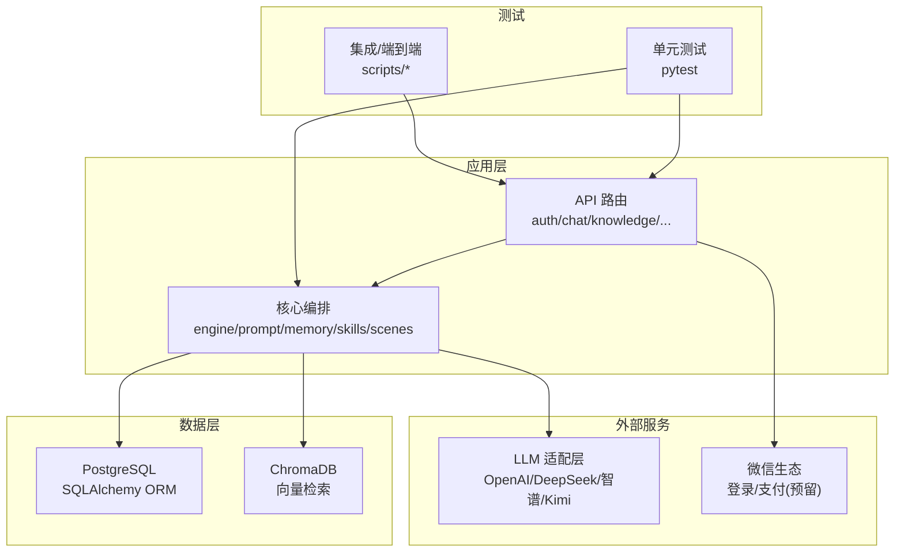
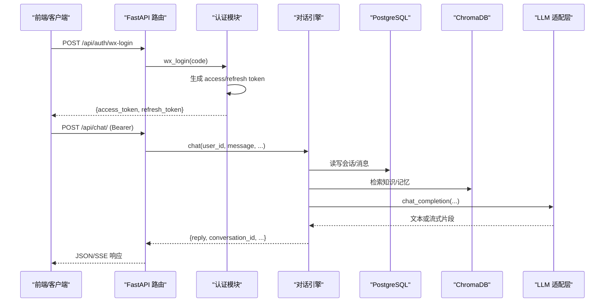
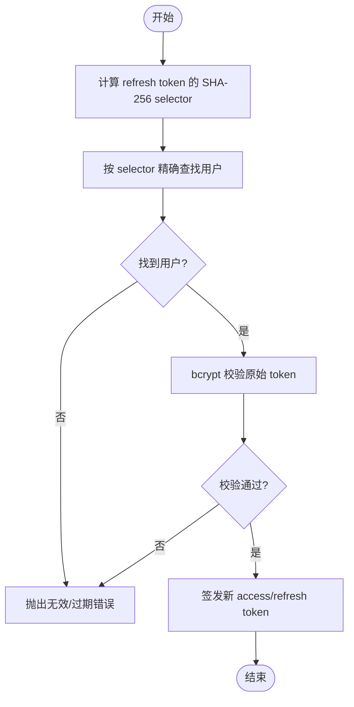
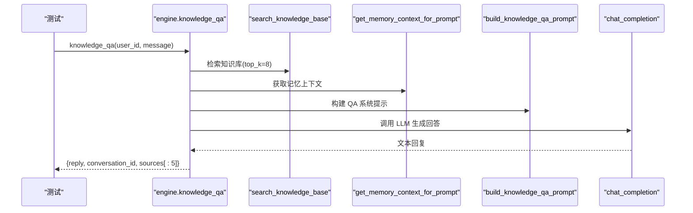
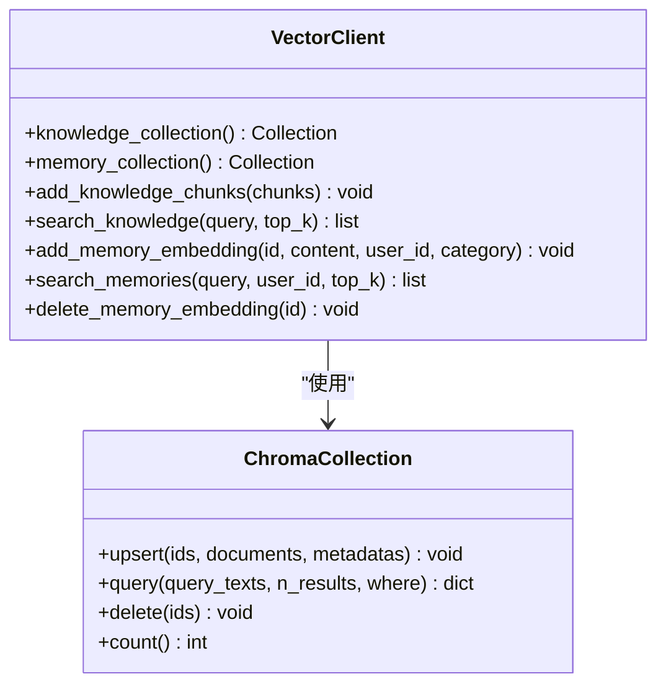
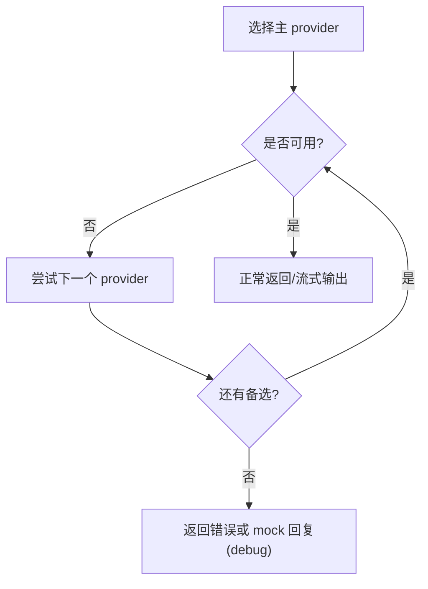
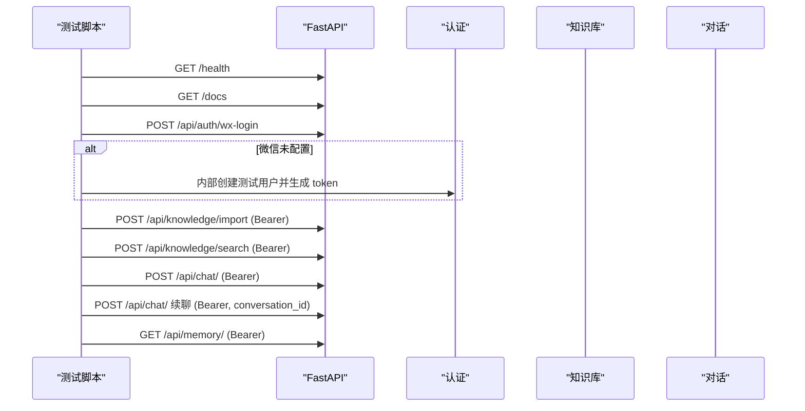
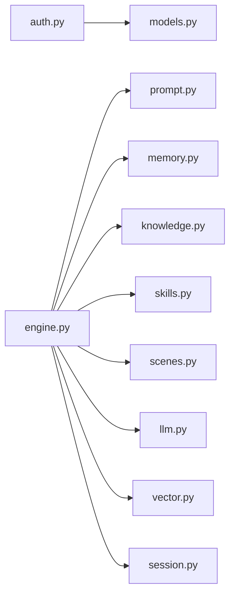

# 集成测试

<cite>
**本文引用的文件**   
- [README.md](file://README.md)
- [conftest.py](file://tests/conftest.py)
- [test_auth.py](file://tests/meditation/test_auth.py)
- [test_engine.py](file://tests/meditation/test_engine.py)
- [test_vector.py](file://tests/meditation/test_vector.py)
- [test_core.py](file://tests/meditation/test_core.py)
- [test_llm_core.py](file://tests/meditation/test_llm_core.py)
- [auth.py](file://hushai/meditation/api/auth.py)
- [engine.py](file://hushai/meditation/core/engine.py)
- [models.py](file://hushai/meditation/db/models.py)
- [vector.py](file://hushai/meditation/db/vector.py)
- [test_api.py](file://scripts/test_api.py)
- [test_local.py](file://scripts/test_local.py)
</cite>

## 目录
1. [简介](#简介)
2. [项目结构](#项目结构)
3. [核心组件](#核心组件)
4. [架构总览](#架构总览)
5. [详细组件分析](#详细组件分析)
6. [依赖关系分析](#依赖关系分析)
7. [性能考量](#性能考量)
8. [故障排查指南](#故障排查指南)
9. [结论](#结论)
10. [附录](#附录)

## 简介
本文件面向 hush.ai 项目的集成测试，覆盖以下关键目标：
- API 接口测试：HTTP 请求模拟、响应体与状态码校验、鉴权流程验证。
- 数据库集成测试：PostgreSQL 环境准备、ChromaDB 向量库操作、数据迁移（Alembic）策略。
- 外部服务集成测试：LLM 提供商模拟与降级、微信登录与支付接口模拟。
- 端到端测试流程：用户注册登录、对话交互、冥想功能等完整业务链路。

## 项目结构
本项目采用“领域模块 + 分层”组织方式：API 路由位于 meditation/api，核心编排在 core，数据模型与持久化在 db，测试集中在 tests，脚本类集成测试位于 scripts。

图表来源
- [README.md:100-132](file://README.md#L100-L132)
- [engine.py:1-387](file://hushai/meditation/core/engine.py#L1-L387)
- [auth.py:1-171](file://hushai/meditation/api/auth.py#L1-L171)
- [vector.py:1-179](file://hushai/meditation/db/vector.py#L1-L179)

章节来源
- [README.md:136-178](file://README.md#L136-L178)

## 核心组件
- 认证与鉴权：微信 OAuth 登录、JWT access/refresh token 签发与校验、Bearer 提取。
- 对话引擎：会话管理、上下文构建（记忆/知识/技能/场景/导师）、安全护栏、流式与非流式回复。
- 知识库与记忆：Markdown 导入、分块、向量化存储与检索；记忆抽取与持久化。
- 向量数据库：ChromaDB 集合管理与查询封装。
- LLM 适配层：多提供商统一接口、失败降级、调试模式 mock。

章节来源
- [auth.py:1-171](file://hushai/meditation/api/auth.py#L1-L171)
- [engine.py:1-387](file://hushai/meditation/core/engine.py#L1-L387)
- [vector.py:1-179](file://hushai/meditation/db/vector.py#L1-L179)
- [models.py:1-434](file://hushai/meditation/db/models.py#L1-L434)

## 架构总览
下图展示从前端到后端再到数据与外部服务的调用链，以及测试如何介入各层进行断言。

图表来源
- [auth.py:63-106](file://hushai/meditation/api/auth.py#L63-L106)
- [engine.py:166-236](file://hushai/meditation/core/engine.py#L166-L236)
- [vector.py:104-127](file://hushai/meditation/db/vector.py#L104-L127)

## 详细组件分析

### 认证与鉴权集成测试
- 测试要点
  - Refresh Token 查找使用 selector（SHA-256 hex）实现 O(1) 定位，再 bcrypt 校验，避免全表扫描。
  - verify_token 强制 type == access，拒绝缺失或类型错误的 token。
  - Bearer 提取兼容带/不带前缀的 Authorization 头。
- 测试方法
  - 使用内存 SQLite AsyncSession 注入真实 ORM 行为，构造 User 记录并断言刷新流程。
  - 通过 patch 绕过 bcrypt 细节，聚焦查找逻辑与返回值结构。
- 参考用例路径
  - [test_auth.py:82-136](file://tests/meditation/test_auth.py#L82-L136)
  - [test_auth.py:49-78](file://tests/meditation/test_auth.py#L49-L78)
  - [test_auth.py:139-142](file://tests/meditation/test_auth.py#L139-L142)

图表来源
- [auth.py:134-164](file://hushai/meditation/api/auth.py#L134-L164)
- [auth.py:36-42](file://hushai/meditation/api/auth.py#L36-L42)
- [auth.py:28-33](file://hushai/meditation/api/auth.py#L28-L33)

章节来源
- [test_auth.py:1-142](file://tests/meditation/test_auth.py#L1-L142)
- [auth.py:1-171](file://hushai/meditation/api/auth.py#L1-L171)
- [conftest.py:30-48](file://tests/conftest.py#L30-L48)

### 对话引擎集成测试
- 测试要点
  - 系统提示构建包含记忆、知识、历史、技能、场景与导师描述。
  - 知识库检索结果作为上下文注入，限制返回来源数量。
  - 异常时回滚事务，保证一致性。
- 测试方法
  - 使用 Mock Session 与工厂，拦截 search_knowledge_base、get_memory_context_for_prompt、chat_completion 等依赖。
  - 断言 prompt 构建参数、sources 结构与 conversation_id 返回。
- 参考用例路径
  - [test_engine.py:55-94](file://tests/meditation/test_engine.py#L55-L94)
  - [test_engine.py:96-149](file://tests/meditation/test_engine.py#L96-L149)
  - [test_engine.py:228-262](file://tests/meditation/test_engine.py#L228-L262)
  - [test_engine.py:263-283](file://tests/meditation/test_engine.py#L263-L283)

图表来源
- [engine.py:316-387](file://hushai/meditation/core/engine.py#L316-L387)
- [test_engine.py:55-94](file://tests/meditation/test_engine.py#L55-L94)

章节来源
- [test_engine.py:1-283](file://tests/meditation/test_engine.py#L1-L283)
- [engine.py:1-387](file://hushai/meditation/core/engine.py#L1-L387)

### 向量数据库（ChromaDB）集成测试
- 测试要点
  - 空集合快速返回、upsert 元数据映射、query 结果 score 转换、按 user_id 过滤记忆检索。
- 测试方法
  - 使用 MagicMock 替换 collection 对象，断言 upsert/query/delete 调用参数与返回结构。
- 参考用例路径
  - [test_vector.py:25-72](file://tests/meditation/test_vector.py#L25-L72)
  - [test_vector.py:74-130](file://tests/meditation/test_vector.py#L74-L130)
  - [test_vector.py:132-193](file://tests/meditation/test_vector.py#L132-L193)

图表来源
- [vector.py:61-179](file://hushai/meditation/db/vector.py#L61-L179)

章节来源
- [test_vector.py:1-193](file://tests/meditation/test_vector.py#L1-L193)
- [vector.py:1-179](file://hushai/meditation/db/vector.py#L1-L179)

### LLM 适配层集成测试
- 测试要点
  - 主 provider 优先，失败自动降级且去重；debug 无 key 走 mock。
  - 流式接口修复 generator 语义陷阱，确保 try/except 驱动降级。
- 测试方法
  - 通过 patch _chat_completion_single/_stream_single 与 _get_client，验证 fallback 顺序与流式 delta 输出。
- 参考用例路径
  - [test_llm_core.py:41-59](file://tests/meditation/test_llm_core.py#L41-L59)
  - [test_llm_core.py:61-99](file://tests/meditation/test_llm_core.py#L61-L99)
  - [test_llm_core.py:101-155](file://tests/meditation/test_llm_core.py#L101-L155)
  - [test_llm_core.py:157-169](file://tests/meditation/test_llm_core.py#L157-L169)

图表来源
- [test_llm_core.py:41-59](file://tests/meditation/test_llm_core.py#L41-L59)
- [test_llm_core.py:101-155](file://tests/meditation/test_llm_core.py#L101-L155)

章节来源
- [test_llm_core.py:1-169](file://tests/meditation/test_llm_core.py#L1-L169)

### 核心逻辑与配置集成测试
- 测试要点
  - 系统提示拼接（基础、安全、记忆、知识、历史、技能、场景、导师）。
  - 记忆抽取 JSON 解析健壮性（含代码块包裹）。
  - Markdown 导入预处理（frontmatter、标题、标签）。
- 测试方法
  - 直接调用核心函数，断言输出片段与边界情况。
- 参考用例路径
  - [test_core.py:25-93](file://tests/meditation/test_core.py#L25-L93)
  - [test_core.py:144-244](file://tests/meditation/test_core.py#L144-L244)
  - [test_core.py:279-308](file://tests/meditation/test_core.py#L279-L308)

章节来源
- [test_core.py:1-320](file://tests/meditation/test_core.py#L1-L320)

### 端到端测试流程设计
- 健康检查与文档
  - 等待服务就绪后访问 /health 与 /docs，确认服务与 OpenAPI 文档可用。
- 认证流程
  - 优先调用 /api/auth/wx-login；若未配置微信凭据，则通过内部工具创建测试用户并注入 token。
- 知识库与对话
  - 导入知识片段，执行搜索，发起对话并在同一会话中继续追问。
- 记忆与统计
  - 读取记忆列表，验证条数与结构。
- 参考脚本路径
  - [test_api.py:59-94](file://scripts/test_api.py#L59-L94)
  - [test_local.py:65-136](file://scripts/test_local.py#L65-L136)

图表来源
- [test_api.py:59-94](file://scripts/test_api.py#L59-L94)
- [test_local.py:65-136](file://scripts/test_local.py#L65-L136)

章节来源
- [test_api.py:59-94](file://scripts/test_api.py#L59-L94)
- [test_local.py:65-136](file://scripts/test_local.py#L65-L136)

## 依赖关系分析
- 组件耦合
  - API 路由依赖认证与引擎；引擎依赖配置、ORM、向量库与 LLM 适配层。
  - 向量库与 ORM 均通过配置中心获取连接参数，便于测试隔离。
- 外部依赖
  - httpx 用于微信登录与本地集成测试 HTTP 调用。
  - chromadb 提供向量检索能力。
  - SQLAlchemy 异步会话用于数据库操作。
- 潜在循环依赖
  - 当前分层清晰，未见明显循环引用；测试通过 monkeypatch 与 fixture 解耦。

图表来源
- [engine.py:1-387](file://hushai/meditation/core/engine.py#L1-L387)
- [auth.py:1-171](file://hushai/meditation/api/auth.py#L1-L171)
- [vector.py:1-179](file://hushai/meditation/db/vector.py#L1-L179)
- [models.py:1-434](file://hushai/meditation/db/models.py#L1-L434)

章节来源
- [engine.py:1-387](file://hushai/meditation/core/engine.py#L1-L387)
- [auth.py:1-171](file://hushai/meditation/api/auth.py#L1-L171)
- [vector.py:1-179](file://hushai/meditation/db/vector.py#L1-L179)
- [models.py:1-434](file://hushai/meditation/db/models.py#L1-L434)

## 性能考量
- 认证刷新优化：通过 selector 将用户定位复杂度降至 O(1)，避免全表 bcrypt 比对带来的 DoS 风险。
- 流式输出：SSE 流式减少首字节延迟，提升用户体验。
- 知识库检索：top_k 控制与距离分数转换平衡召回与性能。
- 建议
  - 对高频接口增加缓存（如热门知识片段、导师信息）。
  - 为向量检索设置合理的 HNSW 参数与索引重建策略。
  - 对 LLM 调用增加超时与重试退避策略。

[本节为通用指导，不直接分析具体文件]

## 故障排查指南
- 常见问题
  - 微信登录失败：检查 appid/secret 与网络连通性，关注 errcode/errmsg。
  - Token 无效或类型错误：确认 JWT 签名密钥一致，type 字段必须为 access。
  - 向量库为空：确认集合已创建且有 upsert 数据。
  - LLM 不可用：检查 debug 模式与 key 配置，观察降级日志。
- 定位手段
  - 使用 /docs 查看接口定义与示例。
  - 通过 pytest 运行对应模块，结合日志与断言定位问题。
  - 使用 conftest 提供的内存数据库与配置重置，确保测试隔离。

章节来源
- [auth.py:63-106](file://hushai/meditation/api/auth.py#L63-L106)
- [auth.py:109-131](file://hushai/meditation/api/auth.py#L109-L131)
- [vector.py:104-127](file://hushai/meditation/db/vector.py#L104-L127)
- [test_llm_core.py:157-169](file://tests/meditation/test_llm_core.py#L157-L169)

## 结论
本集成测试方案围绕认证鉴权、对话引擎、向量检索与 LLM 适配四大核心展开，结合内存数据库与 Mock 技术，既保证了测试稳定性，又覆盖了关键路径与异常分支。通过端到端脚本串联主要业务流程，可在 CI 中稳定执行，保障版本迭代质量。

[本节为总结性内容，不直接分析具体文件]

## 附录
- 环境变量与配置
  - 参考 README 中的配置项说明，确保测试环境与生产环境一致。
- 快速启动与测试命令
  - 使用 Makefile 或 pytest 运行测试；本地脚本可辅助手动验证。

章节来源
- [README.md:230-241](file://README.md#L230-L241)
- [README.md:300-316](file://README.md#L300-L316)