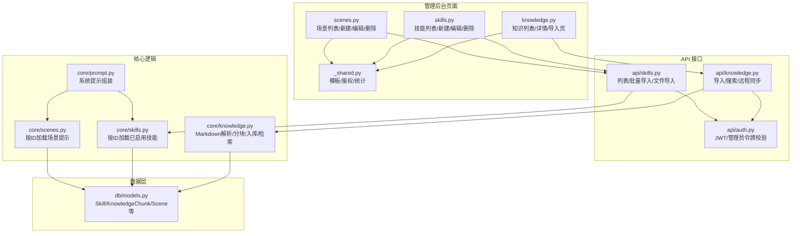
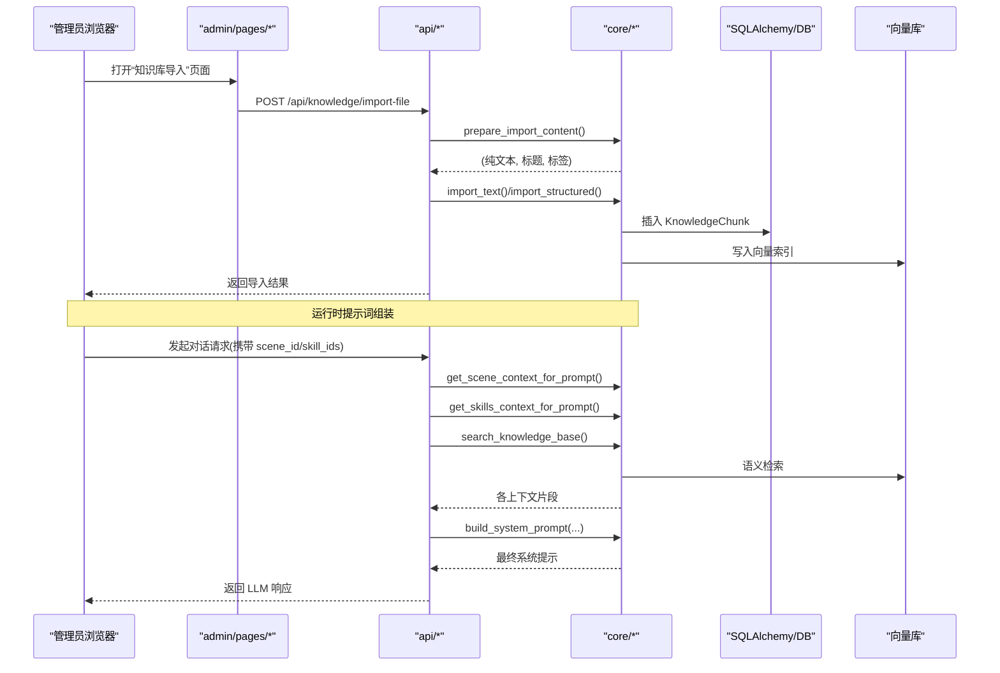
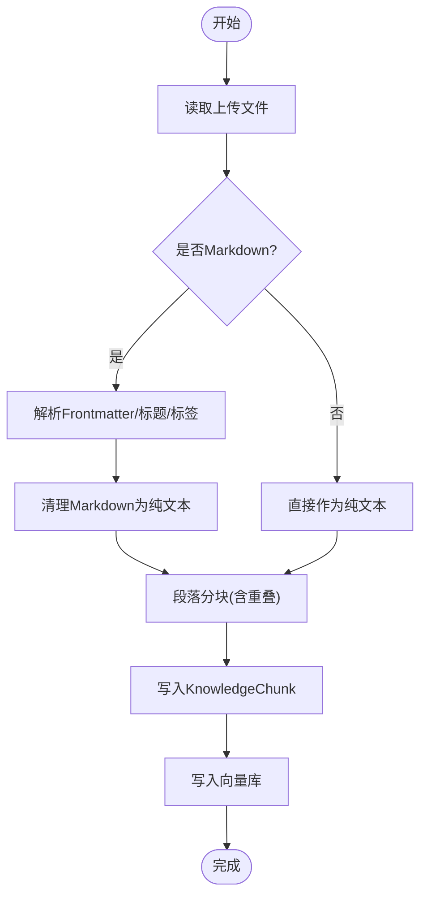
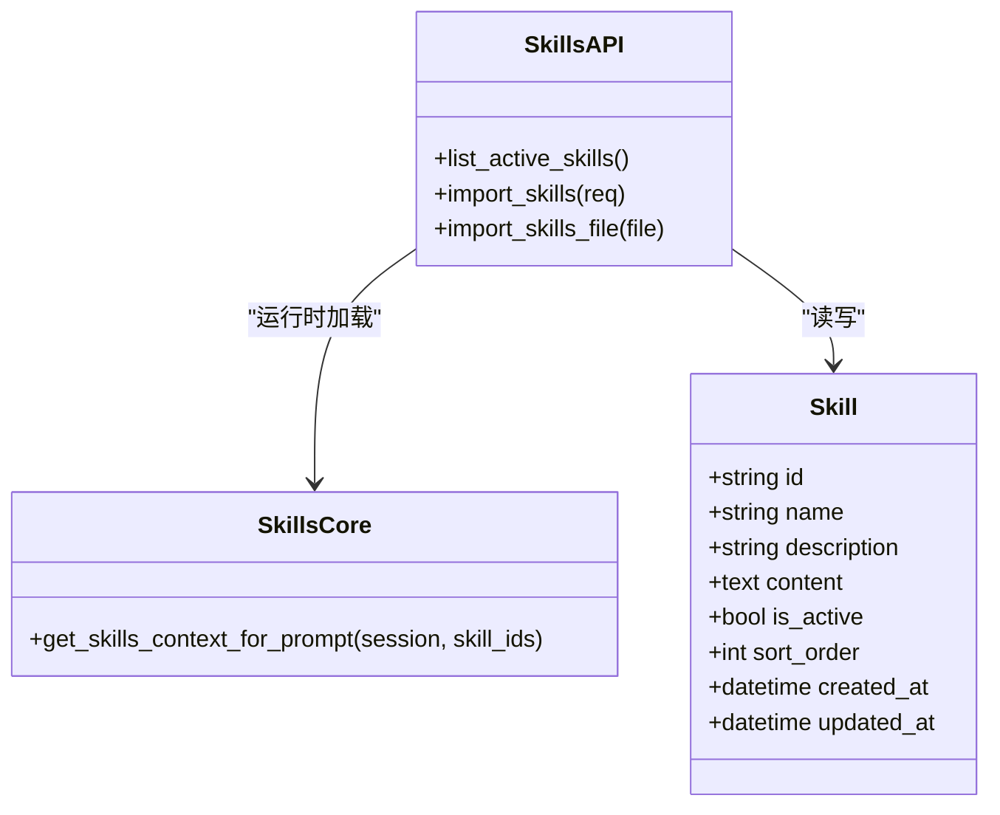
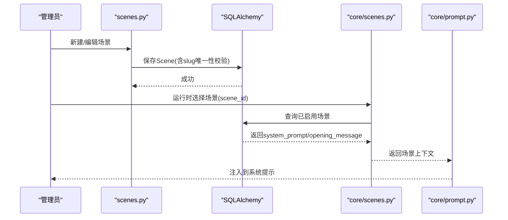
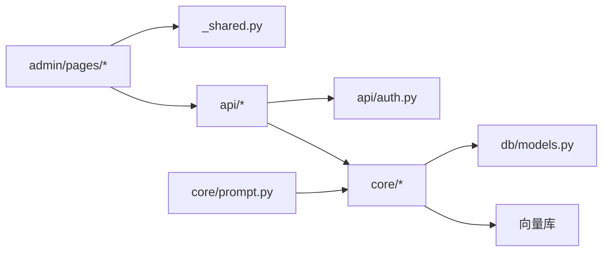

# 内容管理系统

<cite>
**本文引用的文件**   
- [hushai/meditation/admin/pages/knowledge.py](file://hushai/meditation/admin/pages/knowledge.py)
- [hushai/meditation/admin/pages/skills.py](file://hushai/meditation/admin/pages/skills.py)
- [hushai/meditation/admin/pages/scenes.py](file://hushai/meditation/admin/pages/scenes.py)
- [hushai/meditation/core/knowledge.py](file://hushai/meditation/core/knowledge.py)
- [hushai/meditation/core/skills.py](file://hushai/meditation/core/skills.py)
- [hushai/meditation/core/scenes.py](file://hushai/meditation/core/scenes.py)
- [hushai/meditation/api/knowledge.py](file://hushai/meditation/api/knowledge.py)
- [hushai/meditation/api/skills.py](file://hushai/meditation/api/skills.py)
- [hushai/meditation/db/models.py](file://hushai/meditation/db/models.py)
- [hushai/meditation/admin/pages/_shared.py](file://hushai/meditation/admin/pages/_shared.py)
- [hushai/meditation/core/prompt.py](file://hushai/meditation/core/prompt.py)
- [hushai/meditation/api/auth.py](file://hushai/meditation/api/auth.py)
</cite>

## 目录
1. [简介](#简介)
2. [项目结构](#项目结构)
3. [核心组件](#核心组件)
4. [架构总览](#架构总览)
5. [详细组件分析](#详细组件分析)
6. [依赖关系分析](#依赖关系分析)
7. [性能与容量建议](#性能与容量建议)
8. [故障排查指南](#故障排查指南)
9. [结论](#结论)
10. [附录：操作手册与最佳实践](#附录操作手册与最佳实践)

## 简介
本文件为 hush.ai 管理后台的内容管理系统（CMS）提供完整文档，面向内容运营人员与技术维护人员。内容覆盖：
- 知识库内容管理：Markdown 导入、编辑、分块入库、检索、批量删除
- 技能插件管理：SKILL.md 上传、参数配置、效果测试（通过系统提示注入验证）
- 场景配置管理：冥想场景设置、提示词模板管理、音色配置（导师模型字段）
- 内容审核与质量检查：基于审计日志与数据校验的实操流程
- 备份恢复与迁移：数据库与向量库协同的最佳实践

## 项目结构
管理后台采用 FastAPI + SQLAlchemy 异步 ORM + Jinja2 模板渲染；核心业务逻辑集中在 core 层，API 路由在 api 层，页面路由在 admin/pages 层，数据模型在 db/models.py。

图表来源
- [hushai/meditation/admin/pages/knowledge.py:1-163](file://hushai/meditation/admin/pages/knowledge.py#L1-L163)
- [hushai/meditation/admin/pages/skills.py:1-218](file://hushai/meditation/admin/pages/skills.py#L1-L218)
- [hushai/meditation/admin/pages/scenes.py:1-240](file://hushai/meditation/admin/pages/scenes.py#L1-L240)
- [hushai/meditation/admin/pages/_shared.py:1-110](file://hushai/meditation/admin/pages/_shared.py#L1-L110)
- [hushai/meditation/api/knowledge.py:1-310](file://hushai/meditation/api/knowledge.py#L1-L310)
- [hushai/meditation/api/skills.py:1-113](file://hushai/meditation/api/skills.py#L1-L113)
- [hushai/meditation/core/knowledge.py:1-225](file://hushai/meditation/core/knowledge.py#L1-L225)
- [hushai/meditation/core/skills.py:1-59](file://hushai/meditation/core/skills.py#L1-L59)
- [hushai/meditation/core/scenes.py:1-30](file://hushai/meditation/core/scenes.py#L1-L30)
- [hushai/meditation/core/prompt.py:1-130](file://hushai/meditation/core/prompt.py#L1-L130)
- [hushai/meditation/db/models.py:1-434](file://hushai/meditation/db/models.py#L1-L434)

章节来源
- [hushai/meditation/admin/pages/knowledge.py:1-163](file://hushai/meditation/admin/pages/knowledge.py#L1-L163)
- [hushai/meditation/admin/pages/skills.py:1-218](file://hushai/meditation/admin/pages/skills.py#L1-L218)
- [hushai/meditation/admin/pages/scenes.py:1-240](file://hushai/meditation/admin/pages/scenes.py#L1-L240)
- [hushai/meditation/admin/pages/_shared.py:1-110](file://hushai/meditation/admin/pages/_shared.py#L1-L110)
- [hushai/meditation/api/knowledge.py:1-310](file://hushai/meditation/api/knowledge.py#L1-L310)
- [hushai/meditation/api/skills.py:1-113](file://hushai/meditation/api/skills.py#L1-L113)
- [hushai/meditation/core/knowledge.py:1-225](file://hushai/meditation/core/knowledge.py#L1-L225)
- [hushai/meditation/core/skills.py:1-59](file://hushai/meditation/core/skills.py#L1-L59)
- [hushai/meditation/core/scenes.py:1-30](file://hushai/meditation/core/scenes.py#L1-L30)
- [hushai/meditation/core/prompt.py:1-130](file://hushai/meditation/core/prompt.py#L1-L130)
- [hushai/meditation/db/models.py:1-434](file://hushai/meditation/db/models.py#L1-L434)

## 核心组件
- 知识库模块
  - Markdown 预处理与纯文本化、Frontmatter 解析、标题自动推导、标签合并
  - 段落级分块与重叠策略，持久化到数据库并写入向量库
  - 支持单条、结构化、批量、URL/远程源导入与检索
- 技能模块
  - 支持按 ID 顺序加载已启用技能，限制每消息最大数量
  - 管理后台提供新增/编辑/删除与批量导入
- 场景模块
  - 管理后台提供增删改查，slug 唯一性校验
  - 运行时根据场景 ID 加载 system_prompt 与 opening_message 注入对话
- 提示词构建
  - 将角色设定、场景、技能、知识库、记忆、历史与安全边界组合为最终系统提示
- 认证与鉴权
  - 管理后台页面使用会话式登录；API 支持管理员 JWT 或用户 JWT 两种模式

章节来源
- [hushai/meditation/core/knowledge.py:1-225](file://hushai/meditation/core/knowledge.py#L1-L225)
- [hushai/meditation/core/skills.py:1-59](file://hushai/meditation/core/skills.py#L1-L59)
- [hushai/meditation/core/scenes.py:1-30](file://hushai/meditation/core/scenes.py#L1-L30)
- [hushai/meditation/core/prompt.py:1-130](file://hushai/meditation/core/prompt.py#L1-L130)
- [hushai/meditation/api/auth.py:1-171](file://hushai/meditation/api/auth.py#L1-L171)

## 架构总览
下图展示从管理后台页面到 API、核心逻辑与数据层的调用链，以及运行时提示词组装过程。

图表来源
- [hushai/meditation/admin/pages/knowledge.py:101-116](file://hushai/meditation/admin/pages/knowledge.py#L101-L116)
- [hushai/meditation/api/knowledge.py:96-137](file://hushai/meditation/api/knowledge.py#L96-L137)
- [hushai/meditation/core/knowledge.py:76-171](file://hushai/meditation/core/knowledge.py#L76-L171)
- [hushai/meditation/core/scenes.py:11-30](file://hushai/meditation/core/scenes.py#L11-L30)
- [hushai/meditation/core/skills.py:14-59](file://hushai/meditation/core/skills.py#L14-L59)
- [hushai/meditation/core/prompt.py:77-103](file://hushai/meditation/core/prompt.py#L77-L103)

## 详细组件分析

### 知识库内容管理
- 功能要点
  - 列表与分页：支持按标题/内容模糊搜索，按创建时间倒序
  - 详情页：按 ID 获取条目
  - 导入入口：提供导入页面与多种导入方式
  - 删除与批量删除：支持单条与批量删除
- 关键流程
  - 文件导入：读取文件 -> 判断是否为 Markdown -> 解析 Frontmatter/标题/标签 -> 转纯文本 -> 分块 -> 入库与向量化
  - 结构化导入：递归处理 children，建立父子层级
  - 批量导入：多文件并行处理，记录成功与错误
  - 远程同步：支持 URL/Coze/IMA 等多种远端源一键同步
- 数据结构
  - KnowledgeChunk：包含 title/content/tags/source/chunk_index/parent_id 等字段，支持父子关联

图表来源
- [hushai/meditation/api/knowledge.py:96-137](file://hushai/meditation/api/knowledge.py#L96-L137)
- [hushai/meditation/core/knowledge.py:76-171](file://hushai/meditation/core/knowledge.py#L76-L171)

章节来源
- [hushai/meditation/admin/pages/knowledge.py:22-71](file://hushai/meditation/admin/pages/knowledge.py#L22-L71)
- [hushai/meditation/admin/pages/knowledge.py:74-98](file://hushai/meditation/admin/pages/knowledge.py#L74-L98)
- [hushai/meditation/admin/pages/knowledge.py:101-116](file://hushai/meditation/admin/pages/knowledge.py#L101-L116)
- [hushai/meditation/admin/pages/knowledge.py:119-163](file://hushai/meditation/admin/pages/knowledge.py#L119-L163)
- [hushai/meditation/api/knowledge.py:57-94](file://hushai/meditation/api/knowledge.py#L57-L94)
- [hushai/meditation/api/knowledge.py:96-137](file://hushai/meditation/api/knowledge.py#L96-L137)
- [hushai/meditation/api/knowledge.py:140-162](file://hushai/meditation/api/knowledge.py#L140-L162)
- [hushai/meditation/api/knowledge.py:165-211](file://hushai/meditation/api/knowledge.py#L165-L211)
- [hushai/meditation/api/knowledge.py:213-234](file://hushai/meditation/api/knowledge.py#L213-L234)
- [hushai/meditation/api/knowledge.py:237-310](file://hushai/meditation/api/knowledge.py#L237-L310)
- [hushai/meditation/core/knowledge.py:15-104](file://hushai/meditation/core/knowledge.py#L15-L104)
- [hushai/meditation/core/knowledge.py:106-171](file://hushai/meditation/core/knowledge.py#L106-L171)
- [hushai/meditation/db/models.py:137-151](file://hushai/meditation/db/models.py#L137-L151)

### 技能插件管理
- 功能要点
  - 列表与分页：支持名称/描述模糊搜索，按排序与创建时间排序
  - 新建/编辑：表单校验（名称与正文必填），长度限制
  - 删除：单条删除
  - 批量导入：JSON 格式批量创建，支持 is_active 开关
  - 运行时注入：按指定 ID 顺序加载已启用技能，限制每消息最大数量
- 数据结构
  - Skill：name/description/content/is_active/sort_order 等字段

图表来源
- [hushai/meditation/db/models.py:120-135](file://hushai/meditation/db/models.py#L120-L135)
- [hushai/meditation/api/skills.py:47-113](file://hushai/meditation/api/skills.py#L47-L113)
- [hushai/meditation/core/skills.py:14-59](file://hushai/meditation/core/skills.py#L14-L59)

章节来源
- [hushai/meditation/admin/pages/skills.py:33-76](file://hushai/meditation/admin/pages/skills.py#L33-L76)
- [hushai/meditation/admin/pages/skills.py:79-129](file://hushai/meditation/admin/pages/skills.py#L79-L129)
- [hushai/meditation/admin/pages/skills.py:132-195](file://hushai/meditation/admin/pages/skills.py#L132-L195)
- [hushai/meditation/admin/pages/skills.py:198-218](file://hushai/meditation/admin/pages/skills.py#L198-L218)
- [hushai/meditation/api/skills.py:47-90](file://hushai/meditation/api/skills.py#L47-L90)
- [hushai/meditation/api/skills.py:93-113](file://hushai/meditation/api/skills.py#L93-L113)
- [hushai/meditation/core/skills.py:14-59](file://hushai/meditation/core/skills.py#L14-L59)
- [hushai/meditation/db/models.py:120-135](file://hushai/meditation/db/models.py#L120-L135)

### 场景配置管理
- 功能要点
  - 列表与分页：支持名称/描述模糊搜索
  - 新建/编辑：必填项校验（名称、slug、system_prompt），slug 唯一性校验
  - 删除：单条删除
  - 运行时注入：根据 scene_id 加载 system_prompt 与可选 opening_message
- 数据结构
  - Scene：name/slug/description/system_prompt/opening_message/is_active/sort_order 等字段

图表来源
- [hushai/meditation/admin/pages/scenes.py:76-132](file://hushai/meditation/admin/pages/scenes.py#L76-L132)
- [hushai/meditation/admin/pages/scenes.py:158-217](file://hushai/meditation/admin/pages/scenes.py#L158-L217)
- [hushai/meditation/core/scenes.py:11-30](file://hushai/meditation/core/scenes.py#L11-L30)
- [hushai/meditation/core/prompt.py:77-103](file://hushai/meditation/core/prompt.py#L77-L103)
- [hushai/meditation/db/models.py:153-170](file://hushai/meditation/db/models.py#L153-L170)

章节来源
- [hushai/meditation/admin/pages/scenes.py:17-60](file://hushai/meditation/admin/pages/scenes.py#L17-L60)
- [hushai/meditation/admin/pages/scenes.py:63-132](file://hushai/meditation/admin/pages/scenes.py#L63-L132)
- [hushai/meditation/admin/pages/scenes.py:135-217](file://hushai/meditation/admin/pages/scenes.py#L135-L217)
- [hushai/meditation/core/scenes.py:11-30](file://hushai/meditation/core/scenes.py#L11-L30)
- [hushai/meditation/db/models.py:153-170](file://hushai/meditation/db/models.py#L153-L170)

### 提示词模板与音色配置
- 提示词模板
  - 系统提示由角色设定、场景指引、技能加持、知识库参考、记忆、最近对话与安全边界拼接而成
  - 知识库问答有独立模板，强调基于知识库回答并引导深入提问
- 音色配置
  - 导师模型 Teacher 包含 default_voice、voice_gender 等字段，用于不同导师的音色风格

章节来源
- [hushai/meditation/core/prompt.py:77-103](file://hushai/meditation/core/prompt.py#L77-L103)
- [hushai/meditation/core/prompt.py:119-130](file://hushai/meditation/core/prompt.py#L119-L130)
- [hushai/meditation/db/models.py:246-266](file://hushai/meditation/db/models.py#L246-L266)

### 内容审核与质量检查工具
- 管理员操作审计
  - AuditLog 记录管理员用户名、动作、资源类型、资源ID、详情、IP、UA 等，便于追溯
- 数据校验与质量保障
  - 字段长度限制（如 name≤128、description≤512）、slug 唯一性、必填项校验
  - 导入时空内容拦截、编码容错（UTF-8/GBK）
- 使用建议
  - 定期导出审计日志进行合规审查
  - 对导入内容进行抽样复核，确保标签与标题准确

章节来源
- [hushai/meditation/db/models.py:188-202](file://hushai/meditation/db/models.py#L188-L202)
- [hushai/meditation/admin/pages/skills.py:92-129](file://hushai/meditation/admin/pages/skills.py#L92-L129)
- [hushai/meditation/admin/pages/scenes.py:76-132](file://hushai/meditation/admin/pages/scenes.py#L76-L132)
- [hushai/meditation/api/knowledge.py:165-211](file://hushai/meditation/api/knowledge.py#L165-L211)

### 内容备份恢复与迁移
- 数据库备份
  - 使用 Alembic 管理迁移脚本，确保 schema 变更可追踪与回滚
- 向量库同步
  - 导入流程会同时写入向量索引；迁移时需保证向量库与数据库一致
- 迁移步骤建议
  - 停止服务 -> 导出数据库 -> 导出向量库快照 -> 在新环境执行迁移 -> 导入向量数据 -> 启动服务并验证

章节来源
- [alembic.ini](file://alembic.ini)
- [hushai/meditation/core/knowledge.py:137-171](file://hushai/meditation/core/knowledge.py#L137-L171)

## 依赖关系分析
- 页面层依赖共享基础设施（模板、鉴权、统计）
- API 层依赖认证与核心逻辑
- 核心逻辑依赖数据模型与向量库
- 运行时提示词构建依赖场景与技能上下文

图表来源
- [hushai/meditation/admin/pages/_shared.py:1-110](file://hushai/meditation/admin/pages/_shared.py#L1-L110)
- [hushai/meditation/api/auth.py:1-171](file://hushai/meditation/api/auth.py#L1-L171)
- [hushai/meditation/core/knowledge.py:1-225](file://hushai/meditation/core/knowledge.py#L1-L225)
- [hushai/meditation/core/skills.py:1-59](file://hushai/meditation/core/skills.py#L1-L59)
- [hushai/meditation/core/scenes.py:1-30](file://hushai/meditation/core/scenes.py#L1-L30)
- [hushai/meditation/core/prompt.py:1-130](file://hushai/meditation/core/prompt.py#L1-L130)
- [hushai/meditation/db/models.py:1-434](file://hushai/meditation/db/models.py#L1-L434)

章节来源
- [hushai/meditation/admin/pages/_shared.py:1-110](file://hushai/meditation/admin/pages/_shared.py#L1-L110)
- [hushai/meditation/api/auth.py:1-171](file://hushai/meditation/api/auth.py#L1-L171)
- [hushai/meditation/core/knowledge.py:1-225](file://hushai/meditation/core/knowledge.py#L1-L225)
- [hushai/meditation/core/skills.py:1-59](file://hushai/meditation/core/skills.py#L1-L59)
- [hushai/meditation/core/scenes.py:1-30](file://hushai/meditation/core/scenes.py#L1-L30)
- [hushai/meditation/core/prompt.py:1-130](file://hushai/meditation/core/prompt.py#L1-L130)
- [hushai/meditation/db/models.py:1-434](file://hushai/meditation/db/models.py#L1-L434)

## 性能与容量建议
- 分块策略
  - 默认段落分块大小与重叠可在核心函数中调整，以平衡检索精度与上下文连续性
- 并发与批处理
  - 批量导入需控制单次文件大小与数量，避免内存峰值过高
- 索引与检索
  - 合理设置 top_k，避免过大导致响应延迟
- 存储与索引一致性
  - 导入失败时应回滚事务，确保数据库与向量库状态一致

[本节为通用指导，不直接分析具体文件]

## 故障排查指南
- 未登录/权限不足
  - 页面路由未登录将重定向至登录页；API 未携带有效令牌将返回 401
- 导入失败
  - 检查文件格式与编码；确认 Markdown 解析后非空；查看批量导入的错误列表
- 重复 slug
  - 场景 slug 唯一性校验失败时，需修改为新标识
- 技能为空或未生效
  - 确认技能 is_active 为真且存在；检查运行时传入的 skill_ids 是否正确

章节来源
- [hushai/meditation/admin/pages/_shared.py:94-96](file://hushai/meditation/admin/pages/_shared.py#L94-L96)
- [hushai/meditation/api/knowledge.py:38-55](file://hushai/meditation/api/knowledge.py#L38-L55)
- [hushai/meditation/api/knowledge.py:165-211](file://hushai/meditation/api/knowledge.py#L165-L211)
- [hushai/meditation/admin/pages/scenes.py:107-119](file://hushai/meditation/admin/pages/scenes.py#L107-L119)
- [hushai/meditation/core/skills.py:14-59](file://hushai/meditation/core/skills.py#L14-L59)

## 结论
本 CMS 围绕“知识库—技能—场景—提示词”形成闭环：管理后台负责内容生产与维护，API 提供统一接入，核心逻辑实现解析、分块、检索与注入，数据层保障持久化与一致性。通过严格的校验、审计与迁移机制，满足内容运营与合规要求。

[本节为总结，不直接分析具体文件]

## 附录：操作手册与最佳实践

### 知识库内容管理操作手册
- 导入
  - 单文件导入：选择文件，勾选“作为 Markdown”，填写标签，提交
  - 批量导入：一次选择多个文件，统一标签，查看成功与错误报告
  - 结构化导入：准备 JSON 结构（title/content/tags/children），提交
  - 远程同步：配置远端源（URL/Coze/IMA），一键同步
- 编辑与删除
  - 列表页搜索定位条目，进入详情页查看
  - 支持单条删除与批量删除（勾选多条后批量删除）
- 版本控制建议
  - 使用外部版本控制系统（Git）管理 Markdown 源文件
  - 导入前打标签与命名规范，便于溯源
- 质量检查
  - 导入后抽样检索验证相关性
  - 核对标题与标签准确性

章节来源
- [hushai/meditation/admin/pages/knowledge.py:101-116](file://hushai/meditation/admin/pages/knowledge.py#L101-L116)
- [hushai/meditation/api/knowledge.py:96-137](file://hushai/meditation/api/knowledge.py#L96-L137)
- [hushai/meditation/api/knowledge.py:140-162](file://hushai/meditation/api/knowledge.py#L140-L162)
- [hushai/meditation/api/knowledge.py:165-211](file://hushai/meditation/api/knowledge.py#L165-L211)
- [hushai/meditation/api/knowledge.py:237-310](file://hushai/meditation/api/knowledge.py#L237-L310)
- [hushai/meditation/core/knowledge.py:76-171](file://hushai/meditation/core/knowledge.py#L76-L171)

### 技能插件管理操作手册
- 上传 SKILL.md
  - 将 SKILL.md 转换为 JSON 列表（name/description/content/sort_order/is_active），通过“批量导入”接口上传
- 参数配置
  - 在管理后台新建/编辑技能，设置名称、描述、正文、排序与启用状态
- 效果测试
  - 在对话中选择对应技能 ID，观察系统提示是否注入正确内容
  - 若未生效，检查 is_active 与排序

章节来源
- [hushai/meditation/admin/pages/skills.py:79-129](file://hushai/meditation/admin/pages/skills.py#L79-L129)
- [hushai/meditation/api/skills.py:61-113](file://hushai/meditation/api/skills.py#L61-L113)
- [hushai/meditation/core/skills.py:14-59](file://hushai/meditation/core/skills.py#L14-L59)

### 场景配置管理操作手册
- 新建/编辑场景
  - 填写名称、标识（slug）、系统提示、开场白（可选）、排序与启用状态
  - 注意 slug 唯一性
- 提示词模板管理
  - 在系统中维护提示词模板（角色、安全边界、知识库引用等）
- 音色配置
  - 在导师模型中设置默认音色与性别，匹配不同引导风格

章节来源
- [hushai/meditation/admin/pages/scenes.py:63-132](file://hushai/meditation/admin/pages/scenes.py#L63-L132)
- [hushai/meditation/admin/pages/scenes.py:135-217](file://hushai/meditation/admin/pages/scenes.py#L135-L217)
- [hushai/meditation/core/prompt.py:77-103](file://hushai/meditation/core/prompt.py#L77-L103)
- [hushai/meditation/db/models.py:246-266](file://hushai/meditation/db/models.py#L246-L266)

### 内容审核与质量检查工具使用指南
- 审计日志
  - 查看管理员操作记录，定位问题来源
- 数据校验
  - 利用字段长度与唯一性约束，防止脏数据入库
- 导入质量
  - 使用批量导入的错误列表快速定位问题文件

章节来源
- [hushai/meditation/db/models.py:188-202](file://hushai/meditation/db/models.py#L188-L202)
- [hushai/meditation/api/knowledge.py:165-211](file://hushai/meditation/api/knowledge.py#L165-L211)

### 备份恢复与迁移最佳实践
- 备份
  - 数据库：使用 Alembic 迁移脚本与数据库原生备份工具
  - 向量库：导出索引快照
- 恢复
  - 先恢复数据库，再恢复向量库，最后重启服务并验证导入与检索
- 迁移
  - 在低峰期执行，做好回滚预案

章节来源
- [alembic.ini](file://alembic.ini)
- [hushai/meditation/core/knowledge.py:137-171](file://hushai/meditation/core/knowledge.py#L137-L171)