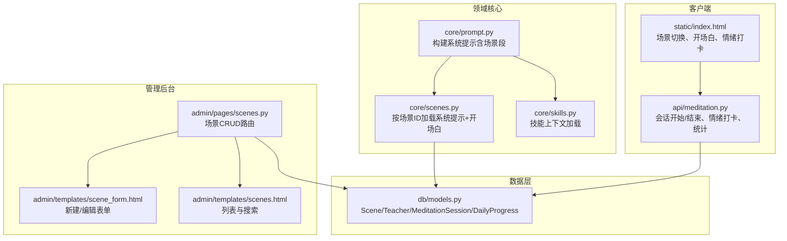
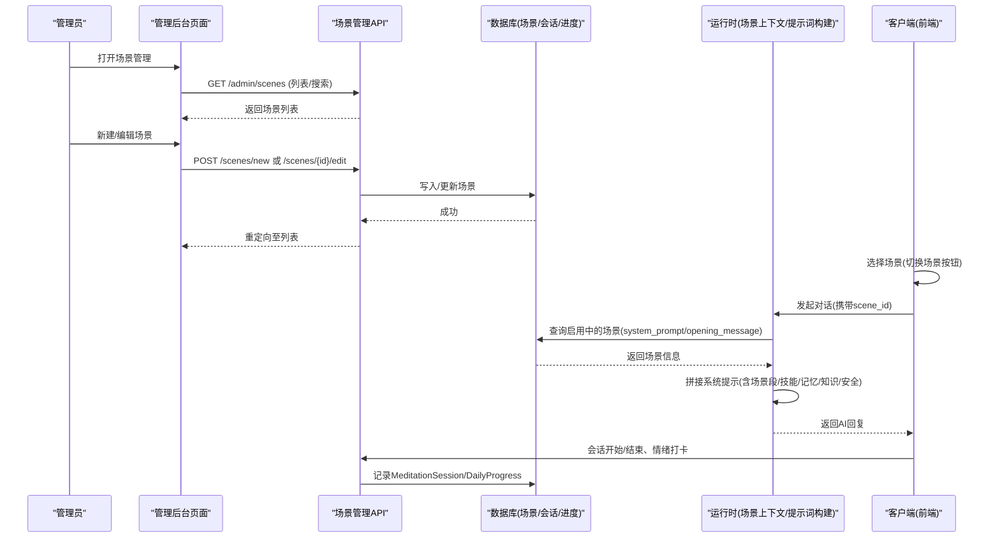
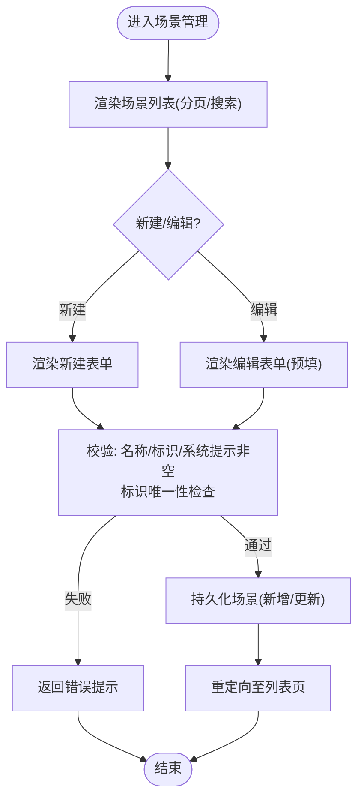
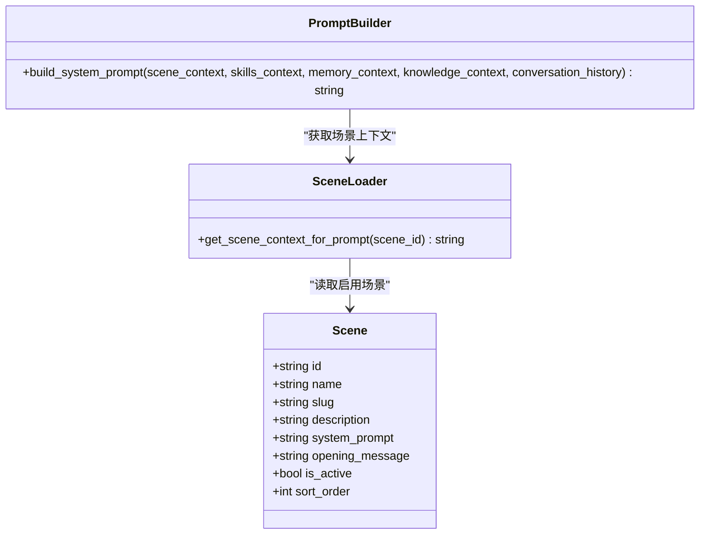
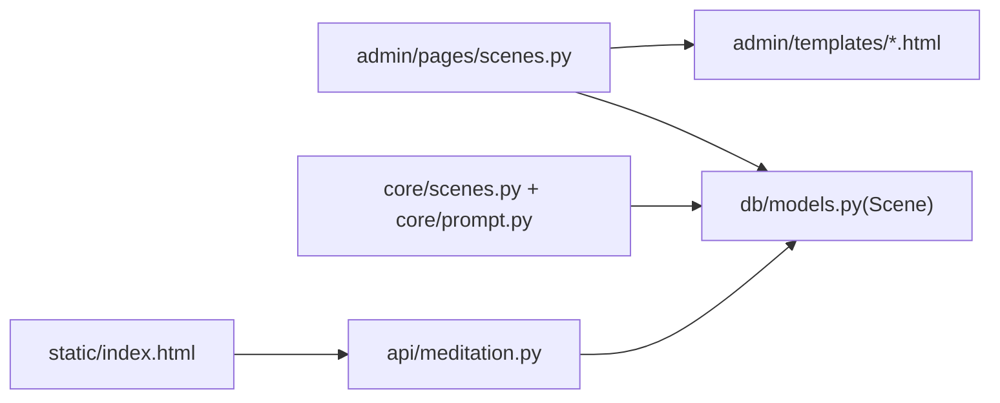

# 场景配置管理

<cite>
**本文引用的文件**   
- [hushai/meditation/admin/pages/scenes.py](file://hushai/meditation/admin/pages/scenes.py)
- [hushai/meditation/db/models.py](file://hushai/meditation/db/models.py)
- [hushai/meditation/core/scenes.py](file://hushai/meditation/core/scenes.py)
- [hushai/meditation/core/prompt.py](file://hushai/meditation/core/prompt.py)
- [hushai/meditation/core/skills.py](file://hushai/meditation/core/skills.py)
- [hushai/meditation/api/meditation.py](file://hushai/meditation/api/meditation.py)
- [hushai/meditation/static/index.html](file://hushai/meditation/static/index.html)
- [hushai/meditation/admin/templates/scene_form.html](file://hushai/meditation/admin/templates/scene_form.html)
- [hushai/meditation/admin/templates/scenes.html](file://hushai/meditation/admin/templates/scenes.html)
</cite>

## 目录
1. [简介](#简介)
2. [项目结构](#项目结构)
3. [核心组件](#核心组件)
4. [架构总览](#架构总览)
5. [详细组件分析](#详细组件分析)
6. [依赖关系分析](#依赖关系分析)
7. [性能与可用性](#性能与可用性)
8. [故障排查指南](#故障排查指南)
9. [结论](#结论)
10. [附录：内容策划与体验优化建议](#附录：内容策划与体验优化建议)

## 简介
本文件面向 hush.ai 管理后台的“冥想场景配置”能力，覆盖以下目标：
- 场景创建与编辑流程（名称、描述、唯一标识、系统提示词、开场白、排序与启用状态）
- 提示词模板管理机制（系统提示词注入、技能加持、记忆与知识库上下文拼接）
- 音色与风格配置选项（导师维度语音参数、风格标签、多语言策略）
- 场景发布与版本控制现状说明（当前实现与扩展建议）
- 灰度发布、回滚机制与 A/B 测试支持（现状评估与落地方案）
- 场景效果监控与用户反馈收集（会话时长、情绪打卡、每日进度）
- 为内容策划人员提供场景设计指南与用户体验优化建议

## 项目结构
围绕“场景配置管理”，相关代码分布在管理后台页面、数据模型、运行时上下文加载、前端交互与统计接口等位置。

图示来源
- [hushai/meditation/admin/pages/scenes.py:1-240](file://hushai/meditation/admin/pages/scenes.py#L1-L240)
- [hushai/meditation/admin/templates/scene_form.html:1-84](file://hushai/meditation/admin/templates/scene_form.html#L1-L84)
- [hushai/meditation/admin/templates/scenes.html:1-133](file://hushai/meditation/admin/templates/scenes.html#L1-L133)
- [hushai/meditation/core/scenes.py:1-30](file://hushai/meditation/core/scenes.py#L1-L30)
- [hushai/meditation/core/prompt.py:1-130](file://hushai/meditation/core/prompt.py#L1-L130)
- [hushai/meditation/core/skills.py:1-59](file://hushai/meditation/core/skills.py#L1-L59)
- [hushai/meditation/db/models.py:153-170](file://hushai/meditation/db/models.py#L153-L170)
- [hushai/meditation/static/index.html:1289-1315](file://hushai/meditation/static/index.html#L1289-L1315)
- [hushai/meditation/api/meditation.py:112-174](file://hushai/meditation/api/meditation.py#L112-L174)

章节来源
- [hushai/meditation/admin/pages/scenes.py:1-240](file://hushai/meditation/admin/pages/scenes.py#L1-L240)
- [hushai/meditation/db/models.py:153-170](file://hushai/meditation/db/models.py#L153-L170)
- [hushai/meditation/core/scenes.py:1-30](file://hushai/meditation/core/scenes.py#L1-L30)
- [hushai/meditation/core/prompt.py:1-130](file://hushai/meditation/core/prompt.py#L1-L130)
- [hushai/meditation/core/skills.py:1-59](file://hushai/meditation/core/skills.py#L1-L59)
- [hushai/meditation/static/index.html:1289-1315](file://hushai/meditation/static/index.html#L1289-L1315)
- [hushai/meditation/api/meditation.py:112-174](file://hushai/meditation/api/meditation.py#L112-L174)

## 核心组件
- 场景数据模型 Scene：包含名称、唯一标识 slug、描述、系统提示词 system_prompt、开场白 opening_message、是否启用 is_active、排序 sort_order 等字段。
- 场景管理页面：提供列表、搜索、新建、编辑、删除等管理能力。
- 场景上下文加载：根据 scene_id 读取启用的场景，组装系统提示与开场白参考文本。
- 提示词构建器：将角色基础、场景指引、技能加持、知识/记忆上下文、对话历史与安全边界组合成最终系统提示。
- 技能加持：动态加载已启用技能片段，拼入系统提示。
- 前端场景切换：在客户端选择场景后，触发开场白并记录所选场景。
- 会话与进度：记录冥想会话的开始/结束、情绪打卡与每日进度，用于效果评估。

章节来源
- [hushai/meditation/db/models.py:153-170](file://hushai/meditation/db/models.py#L153-L170)
- [hushai/meditation/admin/pages/scenes.py:1-240](file://hushai/meditation/admin/pages/scenes.py#L1-L240)
- [hushai/meditation/core/scenes.py:1-30](file://hushai/meditation/core/scenes.py#L1-L30)
- [hushai/meditation/core/prompt.py:1-130](file://hushai/meditation/core/prompt.py#L1-L130)
- [hushai/meditation/core/skills.py:1-59](file://hushai/meditation/core/skills.py#L1-L59)
- [hushai/meditation/static/index.html:1289-1315](file://hushai/meditation/static/index.html#L1289-L1315)
- [hushai/meditation/api/meditation.py:112-174](file://hushai/meditation/api/meditation.py#L112-L174)

## 架构总览
下图展示了从管理后台到运行时的端到端链路：管理员维护场景，运行时按场景注入系统提示，前端切换场景并记录会话与情绪数据。

图示来源
- [hushai/meditation/admin/pages/scenes.py:1-240](file://hushai/meditation/admin/pages/scenes.py#L1-L240)
- [hushai/meditation/core/scenes.py:1-30](file://hushai/meditation/core/scenes.py#L1-L30)
- [hushai/meditation/core/prompt.py:1-130](file://hushai/meditation/core/prompt.py#L1-L130)
- [hushai/meditation/static/index.html:1289-1315](file://hushai/meditation/static/index.html#L1289-L1315)
- [hushai/meditation/api/meditation.py:112-174](file://hushai/meditation/api/meditation.py#L112-L174)

## 详细组件分析

### 场景管理（创建/编辑/删除/列表）
- 列表与搜索：支持分页、按名称/描述模糊搜索，按 sort_order 升序与创建时间降序展示。
- 新建/编辑：校验必填项（名称、slug、系统提示），slug 全局唯一；保存后重定向至列表。
- 删除：通过 DELETE 接口删除场景，需管理员鉴权。
- 表单字段：名称、唯一标识、描述、系统提示词、开场白、排序权重、启用开关。

图示来源
- [hushai/meditation/admin/pages/scenes.py:17-132](file://hushai/meditation/admin/pages/scenes.py#L17-L132)
- [hushai/meditation/admin/pages/scenes.py:135-217](file://hushai/meditation/admin/pages/scenes.py#L135-L217)
- [hushai/meditation/admin/templates/scene_form.html:21-84](file://hushai/meditation/admin/templates/scene_form.html#L21-L84)
- [hushai/meditation/admin/templates/scenes.html:14-35](file://hushai/meditation/admin/templates/scenes.html#L14-L35)

章节来源
- [hushai/meditation/admin/pages/scenes.py:17-132](file://hushai/meditation/admin/pages/scenes.py#L17-L132)
- [hushai/meditation/admin/pages/scenes.py:135-217](file://hushai/meditation/admin/pages/scenes.py#L135-L217)
- [hushai/meditation/admin/templates/scene_form.html:21-84](file://hushai/meditation/admin/templates/scene_form.html#L21-L84)
- [hushai/meditation/admin/templates/scenes.html:14-35](file://hushai/meditation/admin/templates/scenes.html#L14-L35)

### 场景上下文加载与提示词注入
- 场景上下文：根据 scene_id 查询启用中的场景，提取 system_prompt 与 optional opening_message，拼接为“场景指引”。
- 提示词构建：在系统提示中插入“当前场景指引”段落，同时可叠加技能加持、记忆/知识上下文、对话历史与安全边界。

图示来源
- [hushai/meditation/db/models.py:153-170](file://hushai/meditation/db/models.py#L153-L170)
- [hushai/meditation/core/scenes.py:11-29](file://hushai/meditation/core/scenes.py#L11-L29)
- [hushai/meditation/core/prompt.py:77-103](file://hushai/meditation/core/prompt.py#L77-L103)

章节来源
- [hushai/meditation/core/scenes.py:11-29](file://hushai/meditation/core/scenes.py#L11-L29)
- [hushai/meditation/core/prompt.py:77-103](file://hushai/meditation/core/prompt.py#L77-L103)
- [hushai/meditation/db/models.py:153-170](file://hushai/meditation/db/models.py#L153-L170)

### 技能加持（Skills）
- 功能：按 ID 或自动加载已启用技能片段，限制每消息最大数量，按排序与名称排序拼接。
- 用途：作为“当前加持的技能指引”注入系统提示，增强引导策略。

章节来源
- [hushai/meditation/core/skills.py:14-58](file://hushai/meditation/core/skills.py#L14-L58)
- [hushai/meditation/core/prompt.py:93-94](file://hushai/meditation/core/prompt.py#L93-L94)

### 前端场景切换与开场白
- 场景切换：前端渲染场景芯片，点击切换时记录 selectedSceneId，若存在 opening_message 则自动发送开场白。
- 体验：切换后清空对话，以场景开场白作为首次引导。

章节来源
- [hushai/meditation/static/index.html:1289-1315](file://hushai/meditation/static/index.html#L1289-L1315)

### 会话与效果追踪（时长/情绪/进度）
- 会话开始/结束：记录 session_id、user_id、conversation_id、scene_id、开始/结束时间、mood_before/after、note。
- 情绪打卡：用户提交 mood，后端累计每日进度（次数、总时长、平均情绪、连续天数）。
- 统计：提供总量、今日量、最近会话等指标，便于评估场景效果。

章节来源
- [hushai/meditation/api/meditation.py:112-174](file://hushai/meditation/api/meditation.py#L112-L174)
- [hushai/meditation/api/meditation.py:177-238](file://hushai/meditation/api/meditation.py#L177-L238)
- [hushai/meditation/api/meditation.py:241-322](file://hushai/meditation/api/meditation.py#L241-L322)
- [hushai/meditation/db/models.py:204-243](file://hushai/meditation/db/models.py#L204-L243)

## 依赖关系分析
- 管理后台页面依赖 FastAPI 路由与 Jinja 模板，读写数据库中的 Scene 实体。
- 运行时依赖 core/scenes.py 与 core/prompt.py 完成提示词组装。
- 前端依赖 static/index.html 进行场景选择与开场白展示，并通过 api/meditation.py 上报会话与情绪数据。
- 数据模型集中在 db/models.py，统一由 SQLAlchemy ORM 管理。

图示来源
- [hushai/meditation/admin/pages/scenes.py:1-240](file://hushai/meditation/admin/pages/scenes.py#L1-L240)
- [hushai/meditation/db/models.py:153-170](file://hushai/meditation/db/models.py#L153-L170)
- [hushai/meditation/core/scenes.py:1-30](file://hushai/meditation/core/scenes.py#L1-L30)
- [hushai/meditation/core/prompt.py:1-130](file://hushai/meditation/core/prompt.py#L1-L130)
- [hushai/meditation/static/index.html:1289-1315](file://hushai/meditation/static/index.html#L1289-L1315)
- [hushai/meditation/api/meditation.py:112-174](file://hushai/meditation/api/meditation.py#L112-L174)

## 性能与可用性
- 列表分页与索引：场景列表使用 limit/offset 分页，slug 字段具备唯一索引，提升查找效率。
- 提示词拼接开销：场景上下文与技能片段按需加载，避免无关数据；建议对频繁使用的场景与技能建立缓存层（如 Redis）以降低数据库压力。
- 前端交互：场景切换仅操作本地状态与一次开场白请求，负载较低。
- 统计聚合：每日进度采用增量更新，注意在高并发下对同一天记录的并发写保护（例如行级锁或乐观锁）。

[本节为通用指导，不直接分析具体文件]

## 故障排查指南
- 场景不存在：编辑/删除时若未找到对应场景，会返回 404。请确认 URL 中的 scene_id 是否正确。
- 标识冲突：新建/编辑时若 slug 重复，将返回 400 并提示已被使用。请更换唯一标识。
- 必填项缺失：名称、标识、系统提示为空时会返回 400。请补齐后再提交。
- 删除失败：确保已登录管理员账号；若仍失败，检查网络与权限。
- 开场白未显示：确认所选场景存在 opening_message，且前端已正确切换场景。

章节来源
- [hushai/meditation/admin/pages/scenes.py:135-217](file://hushai/meditation/admin/pages/scenes.py#L135-L217)
- [hushai/meditation/admin/pages/scenes.py:220-239](file://hushai/meditation/admin/pages/scenes.py#L220-L239)
- [hushai/meditation/static/index.html:1289-1315](file://hushai/meditation/static/index.html#L1289-L1315)

## 结论
当前系统提供了完整的场景配置与管理闭环：管理后台可创建/编辑/删除场景，运行时按场景注入系统提示与开场白，前端支持场景切换与开场白展示，并提供会话与情绪打卡用于效果评估。音色与风格配置目前集中在“导师”维度，尚未在“场景”维度暴露独立的语音参数与情感表达设置。版本控制、灰度发布、回滚与 A/B 测试尚未内置，可在现有数据模型基础上扩展以实现更精细的发布与实验能力。

[本节为总结性内容，不直接分析具体文件]

## 附录：内容策划与体验优化建议

### 场景设计指南
- 明确目标与受众：为不同人群（初学者/进阶者）与情境（压力缓解/睡眠引导/悲伤疗愈）定义清晰的目标与边界。
- 结构化系统提示：将角色设定、行为准则、场景专属策略分层组织，保持简洁、可执行、可迭代。
- 开场白设计：用温暖、简短的问候语快速建立信任，降低用户进入门槛。
- 技能加持组合：根据场景目标选择合适的技能片段，避免过多导致注意力分散。

### 音色与风格配置（现状与建议）
- 现状：音色与风格主要绑定在“导师”维度（voice_gender、style_tags、system_prompt），场景维度未独立暴露语音参数。
- 建议：在 Scene 模型中增加 voice_id、emotion_profile、language_preference 等字段，使同一场景可灵活匹配不同音色与情感表达；在前端提供“音色/情感/语言”选择器并与场景联动。

### 版本控制与发布（现状与建议）
- 现状：无显式版本字段与发布流水线。
- 建议：
  - 引入 version 与 status（draft/published/archived）字段，支持多版本并存。
  - 灰度发布：基于用户分群（如新用户/特定标签）选择场景版本。
  - 回滚机制：保留上一稳定版本，一键切换。
  - A/B 测试：为不同版本分配流量比例，对比关键指标（会话时长、情绪变化、留存）。

### 效果监控与反馈
- 指标建议：
  - 参与度：会话次数、平均时长、连续天数。
  - 效果：情绪前后差值、平均情绪趋势。
  - 质量：开场白打开率、技能使用率、用户主动反馈（评分/评论）。
- 工具建议：
  - 仪表盘：按场景维度聚合指标，支持时间范围筛选。
  - 反馈入口：会话结束后弹出轻量评分与可选意见收集。
  - 告警：异常指标（如负面情绪占比上升）触发运营提醒。

[本节为概念性建议，不直接分析具体文件]