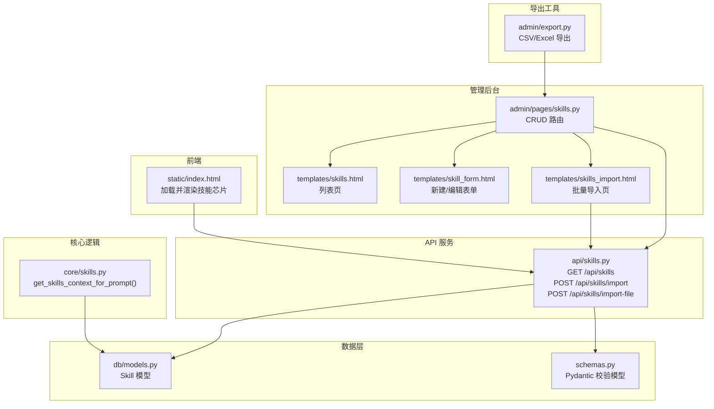
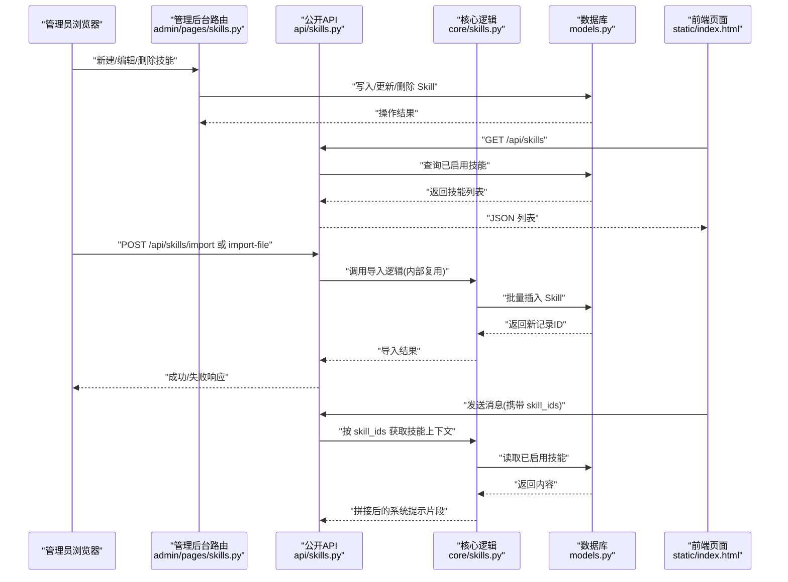
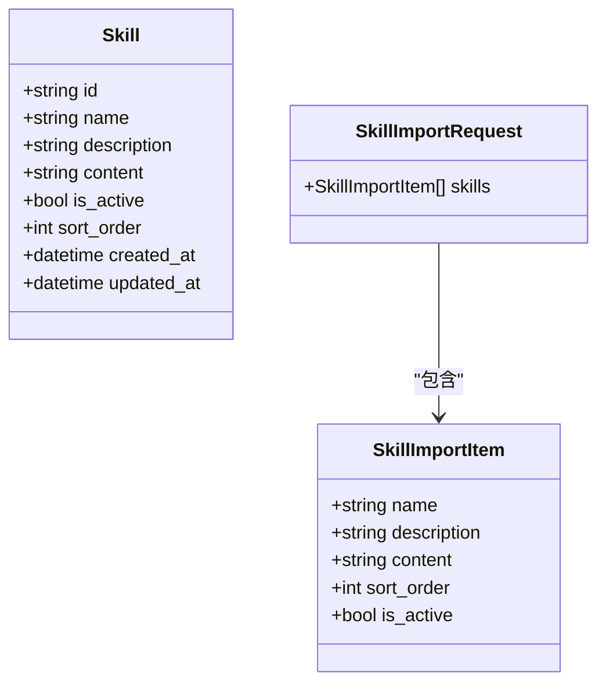
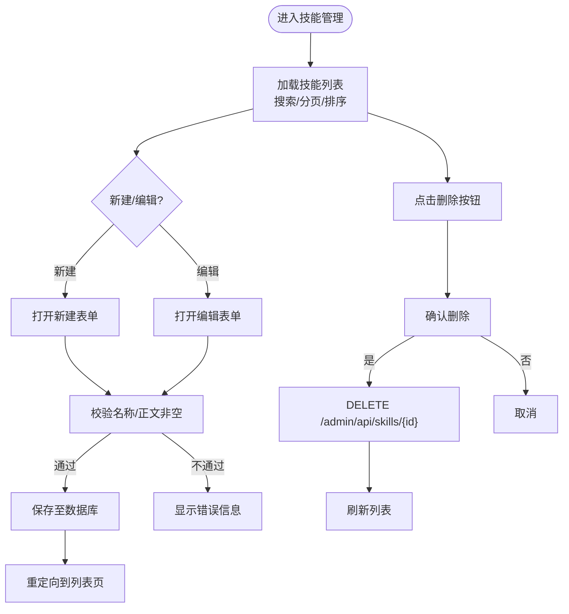
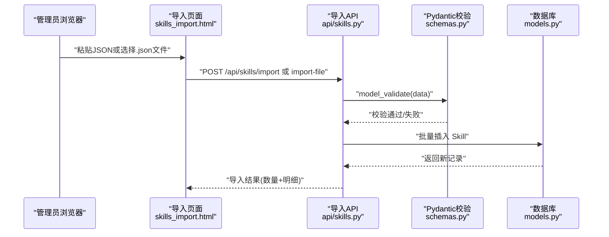
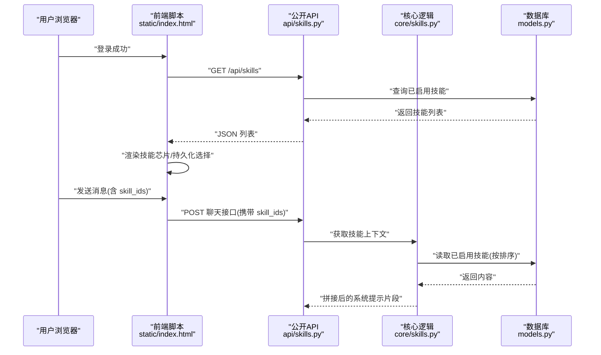
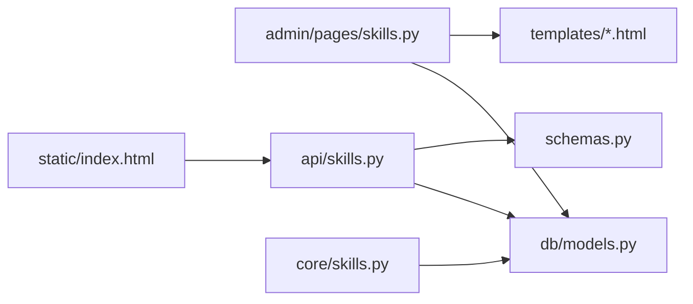

# 技能插件管理

<cite>
**本文引用的文件**   
- [hushai/meditation/admin/pages/skills.py](file://hushai/meditation/admin/pages/skills.py)
- [hushai/meditation/api/skills.py](file://hushai/meditation/api/skills.py)
- [hushai/meditation/core/skills.py](file://hushai/meditation/core/skills.py)
- [hushai/meditation/db/models.py](file://hushai/meditation/db/models.py)
- [hushai/meditation/schemas.py](file://hushai/meditation/schemas.py)
- [hushai/meditation/admin/templates/skills.html](file://hushai/meditation/admin/templates/skills.html)
- [hushai/meditation/admin/templates/skill_form.html](file://hushai/meditation/admin/templates/skill_form.html)
- [hushai/meditation/admin/templates/skills_import.html](file://hushai/meditation/admin/templates/skills_import.html)
- [hushai/meditation/static/index.html](file://hushai/meditation/static/index.html)
- [hushai/meditation/admin/export.py](file://hushai/meditation/admin/export.py)
- [tests/meditation/test_schemas.py](file://tests/meditation/test_schemas.py)
</cite>

## 目录
1. [简介](#简介)
2. [项目结构](#项目结构)
3. [核心组件](#核心组件)
4. [架构总览](#架构总览)
5. [详细组件分析](#详细组件分析)
6. [依赖关系分析](#依赖关系分析)
7. [性能与容量限制](#性能与容量限制)
8. [故障排查指南](#故障排查指南)
9. [结论](#结论)
10. [附录：开发规范与部署指南](#附录开发规范与部署指南)

## 简介
本文件面向 hush.ai 管理后台的“技能插件”管理能力，覆盖以下内容：
- SKILL.md 文件的上传与管理流程（当前系统以 JSON 批量导入为主；SKILL.md 作为内容模板与规范参考）
- 文件格式验证、参数解析与批量导入
- 配置界面：参数设置、排序优先级、启用/禁用控制
- 前台对话中的技能选择与注入机制（模拟对话测试的基础）
- 批量导入导出工具（JSON 导入、CSV/Excel 导出能力）
- 冲突检测与兼容性检查（基于字段长度、去重、上限等约束）
- 开发者规范与部署建议，保障插件质量与系统稳定性

## 项目结构
围绕“技能插件”的关键代码分布在以下模块：
- 管理后台页面路由与模板：skills.py、skills.html、skill_form.html、skills_import.html
- 对外 API：/api/skills（列表、JSON 导入、文件导入）
- 运行时注入：core/skills.py（按 ID 或全部已启用技能拼接为提示上下文）
- 数据模型与校验：db/models.py（Skill）、schemas.py（Pydantic 模型）
- 前端交互：static/index.html（加载并展示可选技能）
- 导出工具：admin/export.py（CSV/Excel）

图表来源
- [hushai/meditation/admin/pages/skills.py:1-218](file://hushai/meditation/admin/pages/skills.py#L1-L218)
- [hushai/meditation/api/skills.py:1-113](file://hushai/meditation/api/skills.py#L1-L113)
- [hushai/meditation/core/skills.py:1-59](file://hushai/meditation/core/skills.py#L1-L59)
- [hushai/meditation/db/models.py:120-135](file://hushai/meditation/db/models.py#L120-L135)
- [hushai/meditation/schemas.py:162-218](file://hushai/meditation/schemas.py#L162-L218)
- [hushai/meditation/static/index.html:1326-1366](file://hushai/meditation/static/index.html#L1326-L1366)
- [hushai/meditation/admin/export.py:1-106](file://hushai/meditation/admin/export.py#L1-L106)

章节来源
- [hushai/meditation/admin/pages/skills.py:1-218](file://hushai/meditation/admin/pages/skills.py#L1-L218)
- [hushai/meditation/api/skills.py:1-113](file://hushai/meditation/api/skills.py#L1-L113)
- [hushai/meditation/core/skills.py:1-59](file://hushai/meditation/core/skills.py#L1-L59)
- [hushai/meditation/db/models.py:120-135](file://hushai/meditation/db/models.py#L120-L135)
- [hushai/meditation/schemas.py:162-218](file://hushai/meditation/schemas.py#L162-L218)
- [hushai/meditation/static/index.html:1326-1366](file://hushai/meditation/static/index.html#L1326-L1366)
- [hushai/meditation/admin/export.py:1-106](file://hushai/meditation/admin/export.py#L1-L106)

## 核心组件
- 数据模型 Skill
  - 字段：id、name、description、content、is_active、sort_order、created_at、updated_at
  - 用途：存储可注入系统提示的技能片段，支持启用/停用与排序
- Pydantic 校验模型
  - SkillImportItem：对 name、description、content、sort_order、is_active 进行长度与空值校验，并提供 strip 处理
  - SkillImportRequest：支持顶层数组或 {"skills": [...]} 两种根结构，限制单次最多导入数量
  - ChatRequest.skill_ids：去重与上限控制，避免注入过多技能导致提示过长
- 运行时注入
  - get_skills_context_for_prompt：根据 skill_ids 或所有已启用技能，按 sort_order 和 name 排序，拼接为系统提示文本
- 管理后台 CRUD
  - 列表、新建、编辑、删除，支持搜索、分页、排序与启用状态显示
- 批量导入
  - JSON Body 与文件上传两种方式，统一走同一入库逻辑
- 前端交互
  - 加载已启用的技能列表，提供多选芯片，持久化用户选择，并在发送消息时附带 skill_ids

章节来源
- [hushai/meditation/db/models.py:120-135](file://hushai/meditation/db/models.py#L120-L135)
- [hushai/meditation/schemas.py:162-218](file://hushai/meditation/schemas.py#L162-L218)
- [hushai/meditation/core/skills.py:1-59](file://hushai/meditation/core/skills.py#L1-L59)
- [hushai/meditation/admin/pages/skills.py:33-218](file://hushai/meditation/admin/pages/skills.py#L33-L218)
- [hushai/meditation/api/skills.py:47-113](file://hushai/meditation/api/skills.py#L47-L113)
- [hushai/meditation/static/index.html:1326-1366](file://hushai/meditation/static/index.html#L1326-L1366)

## 架构总览
下图展示了从管理后台到数据库、再到运行时注入的前后端链路。

图表来源
- [hushai/meditation/admin/pages/skills.py:92-195](file://hushai/meditation/admin/pages/skills.py#L92-L195)
- [hushai/meditation/api/skills.py:47-113](file://hushai/meditation/api/skills.py#L47-L113)
- [hushai/meditation/core/skills.py:14-59](file://hushai/meditation/core/skills.py#L14-L59)
- [hushai/meditation/db/models.py:120-135](file://hushai/meditation/db/models.py#L120-L135)
- [hushai/meditation/static/index.html:1326-1366](file://hushai/meditation/static/index.html#L1326-L1366)

## 详细组件分析

### 数据模型与校验（Skill 与 Pydantic 模型）
- Skill 表结构
  - 关键字段：name（最大 128）、description（最大 512）、content（文本）、is_active（布尔）、sort_order（整数）
- 导入校验
  - SkillImportItem：强制 name、content 非空且去除首尾空白；description 可为空；sort_order 默认 0；is_active 默认 true
  - SkillImportRequest：支持顶层数组自动包装为 {"skills": [...]}；限制 skills 数量上限
  - 测试用例覆盖默认值、顶层数组兼容、空列表报错、多条导入等场景

图表来源
- [hushai/meditation/db/models.py:120-135](file://hushai/meditation/db/models.py#L120-L135)
- [hushai/meditation/schemas.py:172-218](file://hushai/meditation/schemas.py#L172-L218)

章节来源
- [hushai/meditation/db/models.py:120-135](file://hushai/meditation/db/models.py#L120-L135)
- [hushai/meditation/schemas.py:172-218](file://hushai/meditation/schemas.py#L172-L218)
- [tests/meditation/test_schemas.py:120-152](file://tests/meditation/test_schemas.py#L120-L152)

### 管理后台技能管理（列表、新建、编辑、删除）
- 列表页
  - 支持按名称/摘要模糊搜索、分页、排序（sort_order 升序、创建时间降序）
  - 展示启用状态、排序值、创建日期
- 新建/编辑表单
  - 必填项：名称、正文；可选：摘要、排序、启用状态
  - 提交后重定向回列表页
- 删除
  - 通过 DELETE /admin/api/skills/{skill_id} 执行删除，前端确认后刷新列表

图表来源
- [hushai/meditation/admin/pages/skills.py:33-218](file://hushai/meditation/admin/pages/skills.py#L33-L218)
- [hushai/meditation/admin/templates/skills.html:1-136](file://hushai/meditation/admin/templates/skills.html#L1-L136)
- [hushai/meditation/admin/templates/skill_form.html:1-82](file://hushai/meditation/admin/templates/skill_form.html#L1-L82)

章节来源
- [hushai/meditation/admin/pages/skills.py:33-218](file://hushai/meditation/admin/pages/skills.py#L33-L218)
- [hushai/meditation/admin/templates/skills.html:1-136](file://hushai/meditation/admin/templates/skills.html#L1-L136)
- [hushai/meditation/admin/templates/skill_form.html:1-82](file://hushai/meditation/admin/templates/skill_form.html#L1-L82)

### 批量导入（JSON 与文件）
- 入口
  - 管理后台导入页：skills_import.html
  - API：POST /api/skills/import（JSON Body）、POST /api/skills/import-file（multipart 上传）
- 校验与解析
  - 文件导入先解码 UTF-8，再 JSON 解析，随后使用 Pydantic 模型校验
  - 支持顶层数组或 {"skills": [...]} 两种格式
- 入库
  - 统一调用 import_skills 逻辑，逐条构造 Skill 对象，批量 flush 并提交
  - 返回导入数量与新增条目清单

图表来源
- [hushai/meditation/admin/templates/skills_import.html:1-227](file://hushai/meditation/admin/templates/skills_import.html#L1-L227)
- [hushai/meditation/api/skills.py:61-113](file://hushai/meditation/api/skills.py#L61-L113)
- [hushai/meditation/schemas.py:197-218](file://hushai/meditation/schemas.py#L197-L218)
- [hushai/meditation/db/models.py:120-135](file://hushai/meditation/db/models.py#L120-L135)

章节来源
- [hushai/meditation/admin/templates/skills_import.html:1-227](file://hushai/meditation/admin/templates/skills_import.html#L1-L227)
- [hushai/meditation/api/skills.py:61-113](file://hushai/meditation/api/skills.py#L61-L113)
- [hushai/meditation/schemas.py:197-218](file://hushai/meditation/schemas.py#L197-L218)

### 前台技能选择与注入（模拟对话测试基础）
- 前端加载
  - 登录成功后加载 /api/skills，渲染技能芯片，支持多选与本地持久化
- 发送消息
  - 将选中的 skill_ids 随消息一起发送
- 后端注入
  - 若传入 skill_ids，则按顺序去重并限制最大数量；否则取所有已启用技能（有上限）
  - 按 sort_order 与 name 排序，拼接为系统提示片段

图表来源
- [hushai/meditation/static/index.html:1326-1366](file://hushai/meditation/static/index.html#L1326-L1366)
- [hushai/meditation/api/skills.py:47-58](file://hushai/meditation/api/skills.py#L47-L58)
- [hushai/meditation/core/skills.py:14-59](file://hushai/meditation/core/skills.py#L14-L59)
- [hushai/meditation/db/models.py:120-135](file://hushai/meditation/db/models.py#L120-L135)

章节来源
- [hushai/meditation/static/index.html:1326-1366](file://hushai/meditation/static/index.html#L1326-L1366)
- [hushai/meditation/api/skills.py:47-58](file://hushai/meditation/api/skills.py#L47-L58)
- [hushai/meditation/core/skills.py:14-59](file://hushai/meditation/core/skills.py#L14-L59)

### 导出工具（CSV/Excel）
- 功能
  - 提供 CSV 与 Excel 导出函数，支持空数据快速返回
  - 统一封装 get_export_response，按时间戳生成文件名
- 适用场景
  - 用于管理后台的数据迁移与版本归档（例如导出技能清单）

章节来源
- [hushai/meditation/admin/export.py:1-106](file://hushai/meditation/admin/export.py#L1-L106)

## 依赖关系分析
- 管理后台路由依赖认证与会话，渲染模板并调用数据库
- API 路由依赖认证（管理员或用户 Token），使用 Pydantic 模型校验请求体
- 核心注入逻辑仅依赖数据库会话与 Skill 模型
- 前端依赖公开 API 获取技能列表，并通过 localStorage 持久化用户选择

图表来源
- [hushai/meditation/admin/pages/skills.py:1-218](file://hushai/meditation/admin/pages/skills.py#L1-L218)
- [hushai/meditation/api/skills.py:1-113](file://hushai/meditation/api/skills.py#L1-L113)
- [hushai/meditation/core/skills.py:1-59](file://hushai/meditation/core/skills.py#L1-L59)
- [hushai/meditation/db/models.py:120-135](file://hushai/meditation/db/models.py#L120-L135)
- [hushai/meditation/schemas.py:162-218](file://hushai/meditation/schemas.py#L162-L218)
- [hushai/meditation/static/index.html:1326-1366](file://hushai/meditation/static/index.html#L1326-L1366)

章节来源
- [hushai/meditation/admin/pages/skills.py:1-218](file://hushai/meditation/admin/pages/skills.py#L1-L218)
- [hushai/meditation/api/skills.py:1-113](file://hushai/meditation/api/skills.py#L1-L113)
- [hushai/meditation/core/skills.py:1-59](file://hushai/meditation/core/skills.py#L1-L59)
- [hushai/meditation/db/models.py:120-135](file://hushai/meditation/db/models.py#L120-L135)
- [hushai/meditation/schemas.py:162-218](file://hushai/meditation/schemas.py#L162-L218)
- [hushai/meditation/static/index.html:1326-1366](file://hushai/meditation/static/index.html#L1326-L1366)

## 性能与容量限制
- 单条导入上限：一次最多导入 100 条技能
- 单条描述长度：最大 512 字符（超出将被截断）
- 单条名称长度：最大 128 字符（超出将被截断）
- 每次消息注入技能上限：最多 8 条（去重后）
- 排序策略：按 sort_order 升序，其次按 name 升序

章节来源
- [hushai/meditation/core/skills.py:10-11](file://hushai/meditation/core/skills.py#L10-L11)
- [hushai/meditation/schemas.py:172-218](file://hushai/meditation/schemas.py#L172-L218)
- [hushai/meditation/api/skills.py:72-86](file://hushai/meditation/api/skills.py#L72-L86)

## 故障排查指南
- 导入失败（JSON 解析错误）
  - 现象：返回“JSON 解析失败”
  - 排查：检查上传文件或粘贴内容的 JSON 语法是否正确
- 导入失败（数据格式无效）
  - 现象：返回“数据格式无效”
  - 排查：确认根结构为 {"skills": [...]} 或顶层数组；确保每条包含 name 与 content
- 未授权（缺少 Authorization）
  - 现象：返回 401
  - 排查：确认携带有效的管理员或用户 Token
- 删除失败（权限不足）
  - 现象：返回需要管理员登录
  - 排查：确认已通过管理后台登录
- 编辑/新建失败（字段为空）
  - 现象：返回“名称与技能正文不能为空”
  - 排查：确保必填字段不为空

章节来源
- [hushai/meditation/api/skills.py:98-113](file://hushai/meditation/api/skills.py#L98-L113)
- [hushai/meditation/admin/pages/skills.py:155-195](file://hushai/meditation/admin/pages/skills.py#L155-L195)
- [hushai/meditation/admin/pages/skills.py:198-218](file://hushai/meditation/admin/pages/skills.py#L198-L218)

## 结论
本系统提供了完整的技能插件管理能力：从管理后台的可视化维护、严格的参数校验与批量导入，到前台对话中的灵活选择与注入，以及基础的导出工具。通过明确的长度限制、去重与上限控制，有效避免了提示过长与冲突问题。结合测试用例与清晰的 API 契约，便于后续扩展与集成。

## 附录：开发规范与部署指南

### SKILL.md 内容与模板
- 仓库中包含 SKILL.md 模板与撰写要求，可作为技能内容创作与审核的参考
- 建议遵循模板的结构与示例，明确“何时使用/何时不使用”，并提供完整示例与反例

章节来源
- [knowledge/open-cognition/templates/skill-template.md:1-76](file://knowledge/open-cognition/templates/skill-template.md#L1-L76)

### 批量导入与数据迁移
- 推荐使用 JSON 批量导入接口，支持顶层数组与 {"skills": [...]} 两种格式
- 如需历史数据迁移，可先将数据转换为符合 Schema 的 JSON，再通过导入接口批量入库
- 导出工具可用于生成 CSV/Excel 备份，便于版本管理与审计

章节来源
- [hushai/meditation/api/skills.py:61-113](file://hushai/meditation/api/skills.py#L61-L113)
- [hushai/meditation/admin/export.py:1-106](file://hushai/meditation/admin/export.py#L1-L106)

### 冲突检测与兼容性检查
- 字段长度限制：name ≤ 128，description ≤ 512，超出将被截断
- 重复与上限：skill_ids 去重且上限为 8，避免注入过多技能
- 排序一致性：统一按 sort_order 与 name 排序，保证注入顺序稳定

章节来源
- [hushai/meditation/schemas.py:172-218](file://hushai/meditation/schemas.py#L172-L218)
- [hushai/meditation/core/skills.py:14-59](file://hushai/meditation/core/skills.py#L14-L59)

### 测试与调试
- 单元测试覆盖导入请求的默认值、顶层数组兼容、空列表报错、多条导入等场景
- 前端 QA 脚本可辅助检查关键逻辑（如是否加载技能、是否传递 scene_id 等）

章节来源
- [tests/meditation/test_schemas.py:120-152](file://tests/meditation/test_schemas.py#L120-L152)