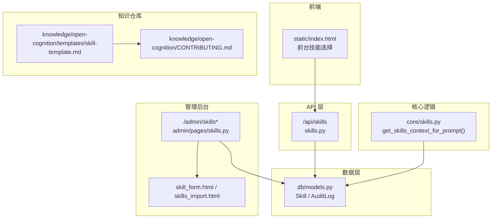
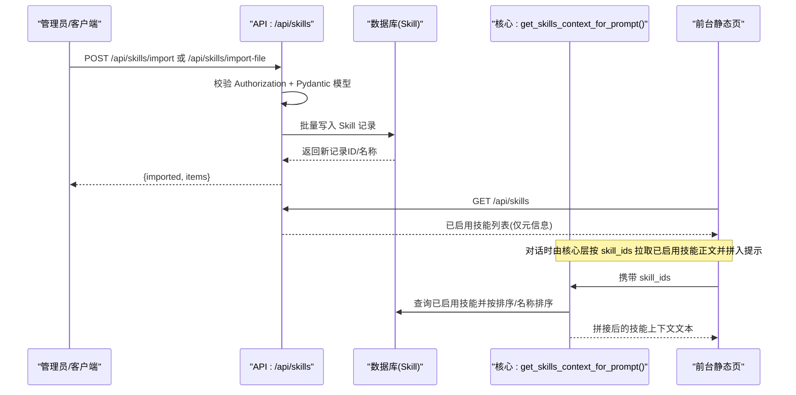
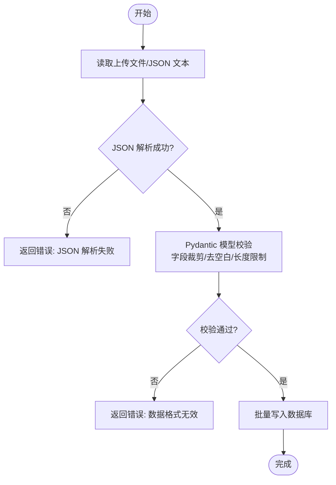
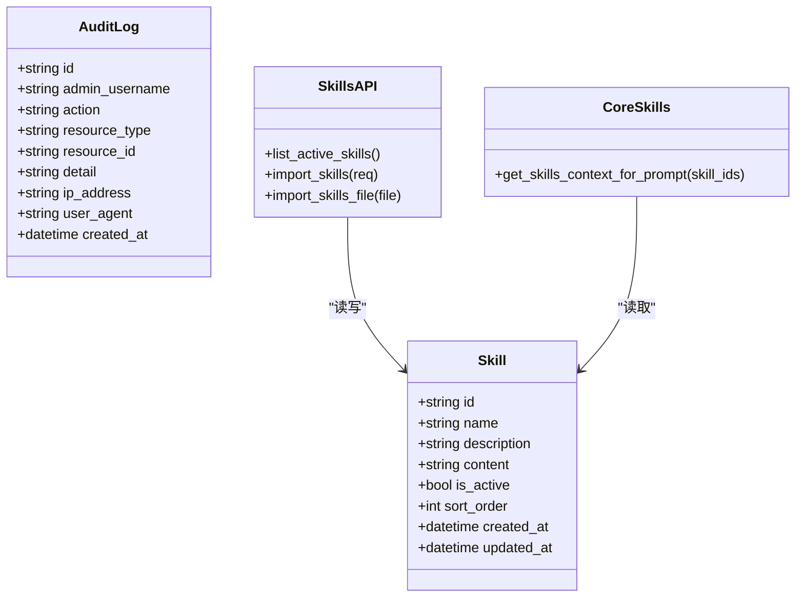

# 技能文件管理

<cite>
**本文引用的文件**   
- [hushai/meditation/api/skills.py](file://hushai/meditation/api/skills.py)
- [hushai/meditation/admin/pages/skills.py](file://hushai/meditation/admin/pages/skills.py)
- [hushai/meditation/core/skills.py](file://hushai/meditation/core/skills.py)
- [hushai/meditation/db/models.py](file://hushai/meditation/db/models.py)
- [hushai/meditation/schemas.py](file://hushai/meditation/schemas.py)
- [hushai/meditation/admin/templates/skill_form.html](file://hushai/meditation/admin/templates/skill_form.html)
- [hushai/meditation/admin/templates/skills_import.html](file://hushai/meditation/admin/templates/skills_import.html)
- [hushai/meditation/static/index.html](file://hushai/meditation/static/index.html)
- [knowledge/open-cognition/templates/skill-template.md](file://knowledge/open-cognition/templates/skill-template.md)
- [knowledge/open-cognition/CONTRIBUTING.md](file://knowledge/open-cognition/CONTRIBUTING.md)
- [hushai/meditation/admin/audit.py](file://hushai/meditation/admin/audit.py)
- [hushai/meditation/admin/pages/audit.py](file://hushai/meditation/admin/pages/audit.py)
- [hushai/meditation/admin/templates/audit_logs.html](file://hushai/meditation/admin/templates/audit_logs.html)
</cite>

## 目录
1. [简介](#简介)
2. [项目结构](#项目结构)
3. [核心组件](#核心组件)
4. [架构总览](#架构总览)
5. [详细组件分析](#详细组件分析)
6. [依赖关系分析](#依赖关系分析)
7. [性能与容量限制](#性能与容量限制)
8. [故障排查指南](#故障排查指南)
9. [结论](#结论)
10. [附录：导入格式与字段规范](#附录导入格式与字段规范)

## 简介
本文件面向 hush.ai 的“技能文件管理”能力，覆盖以下内容：
- SKILL.md 的上传、解析与验证流程（含文件格式检查、参数提取、依赖关系分析）
- 批量导入工具使用方法（JSON 为主；CSV 迁移策略建议）
- 文件存储结构与命名规范（仓库侧与数据库侧）
- 在线预览与编辑功能（管理后台表单）
- 冲突检测与合并机制现状与建议
- 管理员操作日志与审计能力

说明：当前代码库中“技能”以数据库记录形式存在，并通过 API 与管理后台进行增删改查与批量导入。SKILL.md 作为知识仓库中的模板与示例，用于指导内容撰写与组织方式。

## 项目结构
围绕技能管理的代码主要分布在以下位置：
- API 层：提供公开的技能列表与受保护的批量导入接口
- 管理后台页面：提供技能的创建、编辑、删除与批量导入入口
- 核心逻辑：按 ID 加载已启用技能并拼接为系统提示上下文
- 数据模型：定义技能表结构与审计日志表结构
- 前端模板：管理后台表单与导入页、前台技能选择展示
- 知识仓库模板：SKILL.md 模板与贡献规范

图表来源
- [hushai/meditation/api/skills.py:1-113](file://hushai/meditation/api/skills.py#L1-L113)
- [hushai/meditation/admin/pages/skills.py:1-218](file://hushai/meditation/admin/pages/skills.py#L1-L218)
- [hushai/meditation/core/skills.py:1-59](file://hushai/meditation/core/skills.py#L1-L59)
- [hushai/meditation/db/models.py:120-202](file://hushai/meditation/db/models.py#L120-L202)
- [hushai/meditation/static/index.html:1326-1366](file://hushai/meditation/static/index.html#L1326-L1366)
- [knowledge/open-cognition/templates/skill-template.md:1-76](file://knowledge/open-cognition/templates/skill-template.md#L1-L76)
- [knowledge/open-cognition/CONTRIBUTING.md:42-58](file://knowledge/open-cognition/CONTRIBUTING.md#L42-L58)

章节来源
- [hushai/meditation/api/skills.py:1-113](file://hushai/meditation/api/skills.py#L1-L113)
- [hushai/meditation/admin/pages/skills.py:1-218](file://hushai/meditation/admin/pages/skills.py#L1-L218)
- [hushai/meditation/core/skills.py:1-59](file://hushai/meditation/core/skills.py#L1-L59)
- [hushai/meditation/db/models.py:120-202](file://hushai/meditation/db/models.py#L120-L202)
- [hushai/meditation/static/index.html:1326-1366](file://hushai/meditation/static/index.html#L1326-L1366)
- [knowledge/open-cognition/templates/skill-template.md:1-76](file://knowledge/open-cognition/templates/skill-template.md#L1-L76)
- [knowledge/open-cognition/CONTRIBUTING.md:42-58](file://knowledge/open-cognition/CONTRIBUTING.md#L42-L58)

## 核心组件
- 技能数据模型：包含 id、name、description、content、is_active、sort_order、时间戳等字段
- 批量导入请求模型：支持顶层数组或 {"skills": [...]} 两种 JSON 根结构，内置去空白、长度校验与批大小限制
- 导入 API：支持 JSON Body 与 multipart 文件上传两种方式
- 管理后台：提供新建、编辑、删除与批量导入页面
- 运行时注入：根据用户选择的 skill_ids 或默认策略，将已启用的技能正文拼入系统提示
- 审计日志：记录管理员关键操作（资源类型、资源ID、详情、IP、UA 等）

章节来源
- [hushai/meditation/db/models.py:120-135](file://hushai/meditation/db/models.py#L120-L135)
- [hushai/meditation/schemas.py:172-218](file://hushai/meditation/schemas.py#L172-L218)
- [hushai/meditation/api/skills.py:61-112](file://hushai/meditation/api/skills.py#L61-L112)
- [hushai/meditation/admin/pages/skills.py:92-218](file://hushai/meditation/admin/pages/skills.py#L92-L218)
- [hushai/meditation/core/skills.py:14-59](file://hushai/meditation/core/skills.py#L14-L59)
- [hushai/meditation/db/models.py:188-202](file://hushai/meditation/db/models.py#L188-L202)

## 架构总览
下图展示了从“前台选择/后台导入”到“持久化与运行期注入”的端到端流程。

图表来源
- [hushai/meditation/api/skills.py:47-112](file://hushai/meditation/api/skills.py#L47-L112)
- [hushai/meditation/core/skills.py:14-59](file://hushai/meditation/core/skills.py#L14-L59)
- [hushai/meditation/static/index.html:1326-1366](file://hushai/meditation/static/index.html#L1326-L1366)

## 详细组件分析

### 1) SKILL.md 上传、解析与验证流程
- 上传入口
  - 管理后台导入页支持 JSON 文本粘贴与文件上传两种方式
  - 文件上传接口接收 UTF-8 文本，先做 JSON 解析，再使用 Pydantic 模型校验
- 解析与验证
  - 支持两种根结构：顶层数组或 {"skills": [...]}
  - 对每条技能项执行字段级校验：名称非空且截断至 128 字符；描述可选且截断至 512 字符；正文必填；排序与是否启用有默认值
  - 单次导入上限由常量控制（最大批次）
- 依赖关系分析
  - 当前导入流程不解析 SKILL.md 的 YAML frontmatter，也不进行跨文件依赖校验
  - 若需基于 SKILL.md 的 frontmatter 自动提取 name/description/tags/triggers 等，可在导入前增加解析步骤（见“建议与扩展”）

图表来源
- [hushai/meditation/api/skills.py:98-112](file://hushai/meditation/api/skills.py#L98-L112)
- [hushai/meditation/schemas.py:197-208](file://hushai/meditation/schemas.py#L197-L208)
- [hushai/meditation/schemas.py:172-195](file://hushai/meditation/schemas.py#L172-L195)

章节来源
- [hushai/meditation/admin/templates/skills_import.html:168-224](file://hushai/meditation/admin/templates/skills_import.html#L168-L224)
- [hushai/meditation/api/skills.py:98-112](file://hushai/meditation/api/skills.py#L98-L112)
- [hushai/meditation/schemas.py:172-218](file://hushai/meditation/schemas.py#L172-L218)

### 2) 批量导入工具使用方法
- 管理后台导入页
  - 路径：/admin/skills-import
  - 支持 JSON 文本直接提交与 multipart 文件上传
  - 需要携带管理员或用户 Token（Authorization: Bearer ...）
- API 接口
  - POST /api/skills/import：JSON Body
  - POST /api/skills/import-file：multipart 上传 file 字段
- 数据格式
  - 顶层数组或 {"skills": [...]}
  - 必填：name、content；可选：description、sort_order、is_active
  - 单次最多导入 N 条（由常量控制）

章节来源
- [hushai/meditation/admin/pages/skills.py:17-30](file://hushai/meditation/admin/pages/skills.py#L17-L30)
- [hushai/meditation/admin/templates/skills_import.html:71-86](file://hushai/meditation/admin/templates/skills_import.html#L71-L86)
- [hushai/meditation/api/skills.py:61-112](file://hushai/meditation/api/skills.py#L61-L112)
- [hushai/meditation/schemas.py:197-208](file://hushai/meditation/schemas.py#L197-L208)

### 3) CSV 数据迁移与版本控制建议
- 现状
  - 当前导入接口仅支持 JSON 格式，未实现原生 CSV 解析
- 建议方案
  - 在导入前增加 CSV→JSON 转换步骤，映射列名到 schema 字段（name、content、description、sort_order、is_active）
  - 引入版本号字段（如 version），结合 Git 标签或变更集号，便于回滚与对比
  - 建议在导入结果中返回新增/更新/跳过记录明细，便于幂等与重试

[本节为通用建议，不直接分析具体源码]

### 4) 文件存储结构与命名规范
- 仓库侧（知识文档）
  - 模板位于 knowledge/open-cognition/templates/skill-template.md，约定使用 YAML frontmatter 与结构化章节
  - 贡献规范强调触发语义、何时使用/不使用、示例与反例、关联条目链接等
- 数据库侧（运行时）
  - 表：skills
  - 关键字段：id、name、description、content、is_active、sort_order、created_at、updated_at
  - 命名建议：name 保持简洁明确，description 用于前台展示摘要，content 为注入模型的完整指引

章节来源
- [knowledge/open-cognition/templates/skill-template.md:1-76](file://knowledge/open-cognition/templates/skill-template.md#L1-L76)
- [knowledge/open-cognition/CONTRIBUTING.md:42-58](file://knowledge/open-cognition/CONTRIBUTING.md#L42-L58)
- [hushai/meditation/db/models.py:120-135](file://hushai/meditation/db/models.py#L120-L135)

### 5) 在线预览与编辑功能
- 管理后台表单
  - 新建/编辑页面提供名称、短摘要、正文、排序、是否启用等字段
  - 后端对名称与正文进行非空校验，并对长度进行截断保护
- 前台展示
  - 前台静态页通过 GET /api/skills 获取已启用技能元信息，供用户勾选加持

章节来源
- [hushai/meditation/admin/pages/skills.py:92-195](file://hushai/meditation/admin/pages/skills.py#L92-L195)
- [hushai/meditation/admin/templates/skill_form.html:26-46](file://hushai/meditation/admin/templates/skill_form.html#L26-L46)
- [hushai/meditation/api/skills.py:47-58](file://hushai/meditation/api/skills.py#L47-L58)
- [hushai/meditation/static/index.html:1326-1366](file://hushai/meditation/static/index.html#L1326-L1366)

### 6) 冲突检测与自动合并机制
- 现状
  - 当前导入与编辑流程未实现重复定义检测与自动合并
  - 无唯一性约束防止同名技能重复
- 建议方案
  - 在导入前进行重名校验，提供“跳过/覆盖/保留旧版/生成新版本”的策略选项
  - 引入版本字段（version）与变更摘要（change_log），配合审计日志形成可追溯的版本链
  - 可选：基于 content 哈希判断实质性变更，减少无意义覆盖

[本节为通用建议，不直接分析具体源码]

### 7) 管理员操作日志与审计
- 审计模型
  - 记录管理员用户名、动作、资源类型、资源ID、详情、IP、UA、时间戳
- 审计导出
  - 管理后台提供筛选与导出（CSV/Excel）能力
- 集成建议
  - 在导入、创建、编辑、删除技能时调用审计记录函数，统一记录变更历史

章节来源
- [hushai/meditation/db/models.py:188-202](file://hushai/meditation/db/models.py#L188-L202)
- [hushai/meditation/admin/audit.py:10-31](file://hushai/meditation/admin/audit.py#L10-L31)
- [hushai/meditation/admin/pages/audit.py:43-71](file://hushai/meditation/admin/pages/audit.py#L43-L71)
- [hushai/meditation/admin/templates/audit_logs.html:1-103](file://hushai/meditation/admin/templates/audit_logs.html#L1-L103)

## 依赖关系分析
- API 层依赖
  - 认证与权限：管理员或用户 JWT
  - 数据访问：SQLAlchemy 异步会话
  - 模型校验：Pydantic 模型
- 核心层依赖
  - 运行时注入：按 skill_ids 或默认策略查询已启用技能，按 sort_order 与 name 排序后拼接
- 前端依赖
  - 前台静态页通过 REST 接口获取可用技能列表，本地缓存选中状态

图表来源
- [hushai/meditation/db/models.py:120-202](file://hushai/meditation/db/models.py#L120-L202)
- [hushai/meditation/api/skills.py:47-112](file://hushai/meditation/api/skills.py#L47-L112)
- [hushai/meditation/core/skills.py:14-59](file://hushai/meditation/core/skills.py#L14-L59)

章节来源
- [hushai/meditation/api/skills.py:47-112](file://hushai/meditation/api/skills.py#L47-L112)
- [hushai/meditation/core/skills.py:14-59](file://hushai/meditation/core/skills.py#L14-L59)
- [hushai/meditation/db/models.py:120-202](file://hushai/meditation/db/models.py#L120-L202)

## 性能与容量限制
- 单次导入上限：由常量 MAX_SKILLS_IMPORT_BATCH 控制（导入请求校验阶段）
- 每次消息注入上限：MAX_SKILLS_PER_MESSAGE（运行时注入阶段）
- 字段长度限制：name ≤ 128，description ≤ 512（导入与表单均会截断）
- 排序与过滤：按 sort_order 升序、name 升序，避免无序导致的不一致体验

章节来源
- [hushai/meditation/core/skills.py:10-11](file://hushai/meditation/core/skills.py#L10-L11)
- [hushai/meditation/schemas.py:197-208](file://hushai/meditation/schemas.py#L197-L208)
- [hushai/meditation/api/skills.py:71-90](file://hushai/meditation/api/skills.py#L71-L90)
- [hushai/meditation/admin/pages/skills.py:120-128](file://hushai/meditation/admin/pages/skills.py#L120-L128)

## 故障排查指南
- 导入失败
  - JSON 解析失败：检查上传文件是否为合法 JSON
  - 数据格式无效：确认字段是否符合 schema（必填、长度、类型）
  - 缺少授权：确保携带有效的 Authorization 头
- 编辑失败
  - 名称或正文为空：表单会返回错误提示
  - 技能不存在：编辑/删除时若 ID 不存在会返回 404
- 前台无法显示技能
  - 确认技能 is_active 为 true
  - 确认 GET /api/skills 返回正常

章节来源
- [hushai/meditation/api/skills.py:98-112](file://hushai/meditation/api/skills.py#L98-L112)
- [hushai/meditation/admin/pages/skills.py:170-195](file://hushai/meditation/admin/pages/skills.py#L170-L195)
- [hushai/meditation/admin/pages/skills.py:198-218](file://hushai/meditation/admin/pages/skills.py#L198-L218)

## 结论
- 当前系统提供了完善的技能数据模型、API 与管理后台，支持在线编辑与批量导入
- SKILL.md 作为知识仓库模板，用于指导内容撰写与组织，但尚未在导入链路中自动解析
- 冲突检测与自动合并、CSV 原生导入、版本化与差异对比等能力可作为后续增强点
- 审计日志已具备基础能力，可与导入/编辑/删除等操作联动，完善变更追踪

## 附录：导入格式与字段规范
- 根结构
  - 顶层数组：[ {...}, {...} ]
  - 对象包裹：{"skills": [ {...}, {...} ]}
- 字段说明
  - name：必填，字符串，最大 128 字符，前后空白会被去除
  - description：可选，字符串，最大 512 字符，空白字符串视为空
  - content：必填，字符串，任意长度（注意注入上下文大小）
  - sort_order：整数，默认 0，越小越靠前
  - is_active：布尔，默认 true
- 限制
  - 单次导入数量上限由常量控制
  - 运行时每次消息注入的最大技能数由常量控制

章节来源
- [hushai/meditation/schemas.py:172-218](file://hushai/meditation/schemas.py#L172-L218)
- [hushai/meditation/core/skills.py:10-11](file://hushai/meditation/core/skills.py#L10-L11)