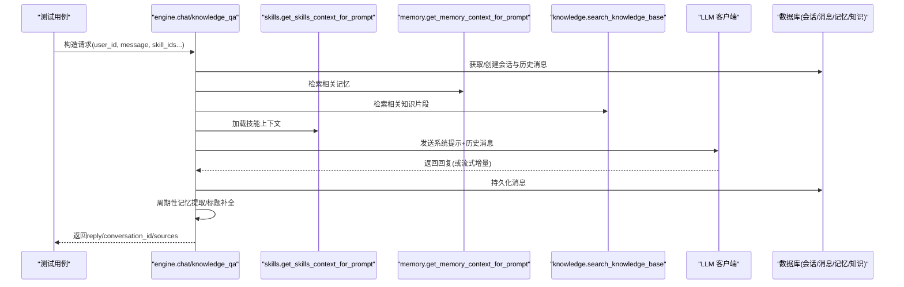
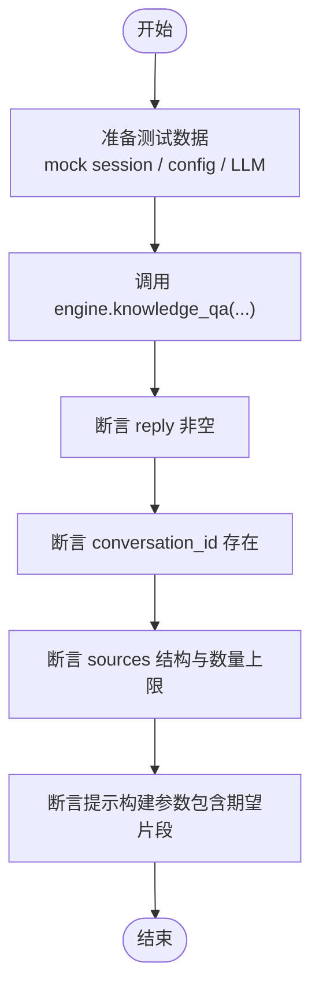
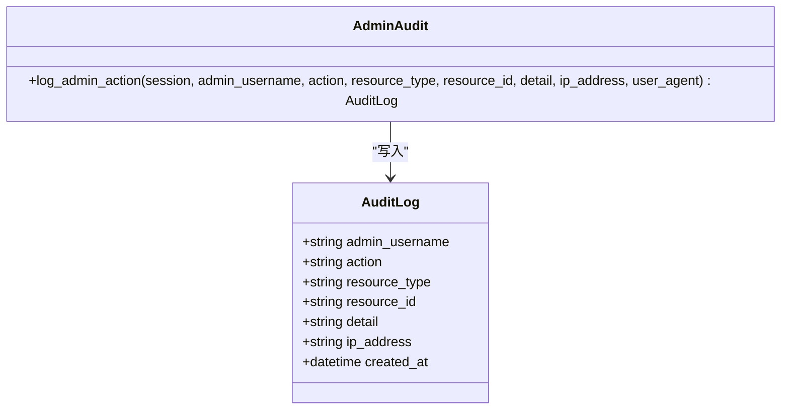
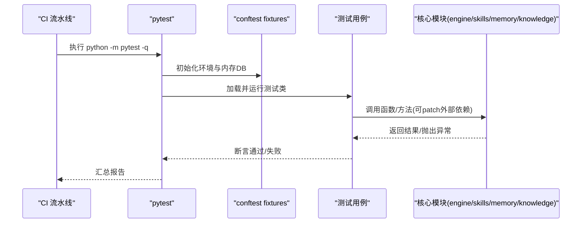
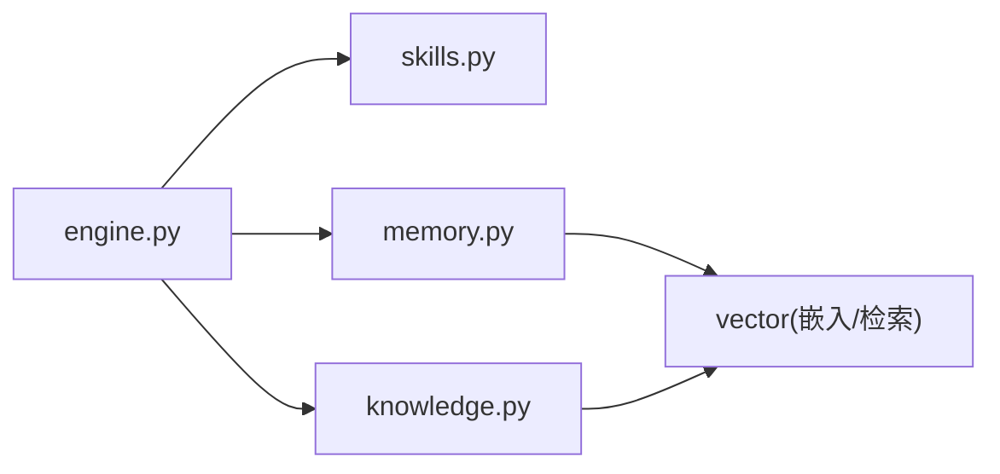

# 技能测试与调试

<cite>
**本文引用的文件**   
- [tests/conftest.py](file://tests/conftest.py)
- [tests/meditation/test_engine.py](file://tests/meditation/test_engine.py)
- [tests/meditation/test_core.py](file://tests/meditation/test_core.py)
- [hushai/meditation/core/engine.py](file://hushai/meditation/core/engine.py)
- [hushai/meditation/core/skills.py](file://hushai/meditation/core/skills.py)
- [hushai/meditation/core/memory.py](file://hushai/meditation/core/memory.py)
- [hushai/meditation/core/knowledge.py](file://hushai/meditation/core/knowledge.py)
- [hushai/meditation/admin/audit.py](file://hushai/meditation/admin/audit.py)
- [hushai/meditation/admin/templates/audit_logs.html](file://hushai/meditation/admin/templates/audit_logs.html)
- [.github/workflows/ci.yml](file://.github/workflows/ci.yml)
</cite>

## 目录
1. [简介](#简介)
2. [项目结构](#项目结构)
3. [核心组件](#核心组件)
4. [架构总览](#架构总览)
5. [详细组件分析](#详细组件分析)
6. [依赖关系分析](#依赖关系分析)
7. [性能考量](#性能考量)
8. [故障排查指南](#故障排查指南)
9. [结论](#结论)
10. [附录](#附录)

## 简介
本文件面向 hush.ai 的“技能”能力，提供一套完整的测试与调试文档。内容覆盖：
- 模拟对话测试环境的使用方法（输入数据准备、预期结果设定、测试结果对比）
- 技能效果评估指标（响应质量、执行效率、用户满意度等维度）
- 调试工具链（日志查看、性能分析、错误追踪）
- 单元测试与集成测试框架及自动化流程
- A/B 测试能力（不同技能版本的对比分析）
- 开发者调试接口与诊断工具，帮助快速定位问题

## 项目结构
围绕“技能”的测试与调试，仓库中与测试和调试直接相关的代码主要分布在以下位置：
- 测试公共夹具与配置重置：tests/conftest.py
- 引擎编排与知识问答测试：tests/meditation/test_engine.py
- 核心模块（提示词、记忆、知识库）测试：tests/meditation/test_core.py
- 引擎与技能加载逻辑：hushai/meditation/core/engine.py、hushai/meditation/core/skills.py
- 长期记忆提取与检索：hushai/meditation/core/memory.py
- 知识库导入与检索：hushai/meditation/core/knowledge.py
- 审计日志记录与展示：hushai/meditation/admin/audit.py、hushai/meditation/admin/templates/audit_logs.html
- CI 流水线中的 pytest 执行：.github/workflows/ci.yml

```mermaid
graph TB
subgraph "测试层"
T1["tests/conftest.py"]
T2["tests/meditation/test_engine.py"]
T3["tests/meditation/test_core.py"]
end
subgraph "核心层"
C1["engine.py<br/>对话编排/安全/记忆触发"]
C2["skills.py<br/>按ID加载技能上下文"]
C3["memory.py<br/>记忆提取/存储/检索"]
C4["knowledge.py<br/>RAG导入/检索"]
end
subgraph "管理面"
A1["admin/audit.py<br/>审计日志写入"]
A2["templates/audit_logs.html<br/>审计日志展示"]
end
subgraph "CI"
CI[".github/workflows/ci.yml<br/>pytest 执行"]
end
T1 --> C1
T2 --> C1
T3 --> C2
T3 --> C3
T3 --> C4
C1 --> C2
C1 --> C3
C1 --> C4
A1 --> A2
CI --> T1
CI --> T2
CI --> T3
```

图表来源
- [tests/conftest.py:1-68](file://tests/conftest.py#L1-L68)
- [tests/meditation/test_engine.py:1-283](file://tests/meditation/test_engine.py#L1-L283)
- [tests/meditation/test_core.py:1-320](file://tests/meditation/test_core.py#L1-L320)
- [hushai/meditation/core/engine.py:1-387](file://hushai/meditation/core/engine.py#L1-L387)
- [hushai/meditation/core/skills.py:1-59](file://hushai/meditation/core/skills.py#L1-L59)
- [hushai/meditation/core/memory.py:1-206](file://hushai/meditation/core/memory.py#L1-L206)
- [hushai/meditation/core/knowledge.py:1-225](file://hushai/meditation/core/knowledge.py#L1-L225)
- [hushai/meditation/admin/audit.py:1-31](file://hushai/meditation/admin/audit.py#L1-L31)
- [hushai/meditation/admin/templates/audit_logs.html:59-103](file://hushai/meditation/admin/templates/audit_logs.html#L59-L103)
- [.github/workflows/ci.yml:82-83](file://.github/workflows/ci.yml#L82-L83)

章节来源
- [tests/conftest.py:1-68](file://tests/conftest.py#L1-L68)
- [tests/meditation/test_engine.py:1-283](file://tests/meditation/test_engine.py#L1-L283)
- [tests/meditation/test_core.py:1-320](file://tests/meditation/test_core.py#L1-L320)
- [hushai/meditation/core/engine.py:1-387](file://hushai/meditation/core/engine.py#L1-L387)
- [hushai/meditation/core/skills.py:1-59](file://hushai/meditation/core/skills.py#L1-L59)
- [hushai/meditation/core/memory.py:1-206](file://hushai/meditation/core/memory.py#L1-L206)
- [hushai/meditation/core/knowledge.py:1-225](file://hushai/meditation/core/knowledge.py#L1-L225)
- [hushai/meditation/admin/audit.py:1-31](file://hushai/meditation/admin/audit.py#L1-L31)
- [hushai/meditation/admin/templates/audit_logs.html:59-103](file://hushai/meditation/admin/templates/audit_logs.html#L59-L103)
- [.github/workflows/ci.yml:82-83](file://.github/workflows/ci.yml#L82-L83)

## 核心组件
- 对话引擎（engine.py）
  - 负责会话创建、消息持久化、安全检查、上下文组装（记忆、知识、场景、技能）、调用 LLM、流式输出、周期性记忆提取与会话标题补全。
  - 关键路径：chat/chat_stream/knowledge_qa。
- 技能加载（skills.py）
  - 根据 skill_ids 或自动挂载已启用技能，限制每轮最大技能数，拼接为系统提示的一部分。
- 长期记忆（memory.py）
  - 基于 LLM 从对话中提取结构化记忆，持久化并生成向量嵌入；支持按查询检索相关记忆，用于构建提示上下文。
- 知识库（knowledge.py）
  - 支持 Markdown 文本清洗、分块、结构化导入；提供 RAG 检索，返回 top_k 片段作为提示上下文。
- 审计日志（admin/audit.py + templates/audit_logs.html）
  - 记录管理员操作，提供后台页面展示，便于追溯变更与调试。

章节来源
- [hushai/meditation/core/engine.py:1-387](file://hushai/meditation/core/engine.py#L1-L387)
- [hushai/meditation/core/skills.py:1-59](file://hushai/meditation/core/skills.py#L1-L59)
- [hushai/meditation/core/memory.py:1-206](file://hushai/meditation/core/memory.py#L1-L206)
- [hushai/meditation/core/knowledge.py:1-225](file://hushai/meditation/core/knowledge.py#L1-L225)
- [hushai/meditation/admin/audit.py:1-31](file://hushai/meditation/admin/audit.py#L1-L31)
- [hushai/meditation/admin/templates/audit_logs.html:59-103](file://hushai/meditation/admin/templates/audit_logs.html#L59-L103)

## 架构总览
下图展示了“技能”在对话链路中的装配方式以及测试如何对关键路径进行断言与验证。



图表来源
- [hushai/meditation/core/engine.py:166-236](file://hushai/meditation/core/engine.py#L166-L236)
- [hushai/meditation/core/engine.py:316-387](file://hushai/meditation/core/engine.py#L316-L387)
- [hushai/meditation/core/skills.py:14-59](file://hushai/meditation/core/skills.py#L14-L59)
- [hushai/meditation/core/memory.py:161-174](file://hushai/meditation/core/memory.py#L161-L174)
- [hushai/meditation/core/knowledge.py:207-225](file://hushai/meditation/core/knowledge.py#L207-L225)

## 详细组件分析

### 模拟对话测试环境使用方法
- 输入数据准备
  - 使用测试夹具提供内存 SQLite 会话，避免污染全局状态与环境变量。
  - 通过 patch 外部依赖（如 LLM、知识库检索），注入可控返回值。
- 预期结果设定
  - 断言返回字段（reply、conversation_id、sources）与数量上限（如 sources 最多 5）。
  - 断言系统提示构建参数（knowledge_context、memory_context）是否包含期望片段。
- 测试结果对比
  - 比较实际 sources 列表与注入的知识库结果，校验排序与截断行为。
  - 校验异常路径下是否回滚数据库事务。



图表来源
- [tests/meditation/test_engine.py:55-188](file://tests/meditation/test_engine.py#L55-L188)
- [tests/meditation/test_engine.py:190-262](file://tests/meditation/test_engine.py#L190-L262)
- [tests/meditation/test_engine.py:264-283](file://tests/meditation/test_engine.py#L264-L283)

章节来源
- [tests/conftest.py:1-68](file://tests/conftest.py#L1-L68)
- [tests/meditation/test_engine.py:1-283](file://tests/meditation/test_engine.py#L1-L283)

### 技能效果评估指标
- 响应质量
  - 相关性：系统提示中 knowledge_context 与 memory_context 是否被正确注入。
  - 完整性：sources 列表是否包含必要字段（id、title、score）且数量受控。
  - 安全性：不安全输入应走安全分支，不对外部模型暴露敏感内容。
- 执行效率
  - 流式输出时增量 delta 的稳定性与完成信号 done 的正确性。
  - 记忆提取周期触发与失败降级（异常捕获与警告日志）。
- 用户满意度
  - 会话标题自动生成与历史消息格式化可读性。
  - 知识引用来源清晰，便于用户溯源。

章节来源
- [hushai/meditation/core/engine.py:166-236](file://hushai/meditation/core/engine.py#L166-L236)
- [hushai/meditation/core/engine.py:238-314](file://hushai/meditation/core/engine.py#L238-L314)
- [hushai/meditation/core/engine.py:316-387](file://hushai/meditation/core/engine.py#L316-L387)
- [tests/meditation/test_engine.py:190-262](file://tests/meditation/test_engine.py#L190-L262)

### 调试工具链
- 日志查看
  - 审计日志：admin/audit.py 记录管理员操作，模板页面展示时间、操作、资源类型、详情、IP 等。
  - 应用日志：引擎与记忆模块在异常路径记录警告日志，便于定位问题。
- 性能分析
  - 流式输出：观察 chat_completion_stream 的增量产出，结合前端渲染延迟评估用户体验。
  - 记忆提取间隔：通过 _MEMORY_EXTRACTION_INTERVAL 控制频率，避免频繁调用外部模型。
- 错误追踪
  - 事务回滚：engine 在异常路径统一 rollback，确保数据一致性。
  - 解析容错：记忆提取 JSON 解析失败时返回空数组并记录警告。



图表来源
- [hushai/meditation/admin/audit.py:10-31](file://hushai/meditation/admin/audit.py#L10-L31)
- [hushai/meditation/admin/templates/audit_logs.html:59-103](file://hushai/meditation/admin/templates/audit_logs.html#L59-L103)

章节来源
- [hushai/meditation/admin/audit.py:1-31](file://hushai/meditation/admin/audit.py#L1-31)
- [hushai/meditation/admin/templates/audit_logs.html:59-103](file://hushai/meditation/admin/templates/audit_logs.html#L59-L103)
- [hushai/meditation/core/memory.py:45-76](file://hushai/meditation/core/memory.py#L45-L76)
- [hushai/meditation/core/engine.py:233-236](file://hushai/meditation/core/engine.py#L233-L236)

### 单元测试框架与集成测试用例
- 公共夹具
  - 自动清理环境变量与测试模式，避免跨测试污染。
  - 提供内存 SQLite AsyncSession，供需要真实数据库行为的测试使用。
- 引擎测试
  - 验证 system prompt 构建参数、知识库检索调用、sources 结构与数量上限、异常回滚。
- 核心模块测试
  - 提示词构建：基础角色与安全守卫、记忆/知识/历史/导师描述/技能上下文的组合。
  - 记忆提取：JSON 解析、代码块包裹 JSON、空结果处理。
  - 知识库分块与 Markdown 转纯文本、frontmatter 解析。
- 自动化流程
  - CI 中执行 pytest，保证每次提交都运行测试套件。



图表来源
- [.github/workflows/ci.yml:82-83](file://.github/workflows/ci.yml#L82-L83)
- [tests/conftest.py:1-68](file://tests/conftest.py#L1-L68)
- [tests/meditation/test_engine.py:1-283](file://tests/meditation/test_engine.py#L1-L283)
- [tests/meditation/test_core.py:1-320](file://tests/meditation/test_core.py#L1-L320)

章节来源
- [tests/conftest.py:1-68](file://tests/conftest.py#L1-L68)
- [tests/meditation/test_engine.py:1-283](file://tests/meditation/test_engine.py#L1-L283)
- [tests/meditation/test_core.py:1-320](file://tests/meditation/test_core.py#L1-L320)
- [.github/workflows/ci.yml:82-83](file://.github/workflows/ci.yml#L82-L83)

### A/B 测试能力（不同技能版本对比）
- 设计思路
  - 以 skill_ids 作为“版本”标识，分别传入不同集合，驱动不同的技能上下文。
  - 在测试中并行或串行执行两组调用，收集 sources、reply 长度、耗时等指标。
- 实施建议
  - 将 skill_ids 映射到具体版本标签（如 v1/v2），在测试报告中分组统计。
  - 结合审计日志记录每次调用的 skill_ids 与结果摘要，便于回溯。
- 评估维度
  - 响应质量：sources 的相关性与多样性、reply 的可读性与准确性。
  - 执行效率：平均响应时间、流式增量稳定性。
  - 用户满意度：通过后续反馈或评分机制量化（可在上层业务扩展）。

章节来源
- [hushai/meditation/core/skills.py:14-59](file://hushai/meditation/core/skills.py#L14-L59)
- [hushai/meditation/core/engine.py:91-127](file://hushai/meditation/core/engine.py#L91-L127)
- [hushai/meditation/admin/audit.py:10-31](file://hushai/meditation/admin/audit.py#L10-L31)

### 开发者调试接口与诊断工具
- 调试接口
  - 使用 engine.chat/knowledge_qa 作为主入口，配合 skill_ids 切换技能版本。
  - 使用 stream 接口观察增量输出，便于前端实时渲染与性能观测。
- 诊断工具
  - 审计日志页面：查看管理员操作与资源变更，辅助定位配置问题。
  - 应用日志：关注记忆提取与向量写入失败的警告信息。
  - 测试断言：通过现有测试用例快速验证改动影响范围。

章节来源
- [hushai/meditation/core/engine.py:238-314](file://hushai/meditation/core/engine.py#L238-L314)
- [hushai/meditation/admin/templates/audit_logs.html:59-103](file://hushai/meditation/admin/templates/audit_logs.html#L59-L103)
- [hushai/meditation/core/memory.py:102-112](file://hushai/meditation/core/memory.py#L102-L112)

## 依赖关系分析
- 组件耦合
  - engine 强依赖 skills/memory/knowledge 三个子模块，形成“编排层”。
  - memory 与 knowledge 均依赖 vector 层进行嵌入与检索，属于“数据访问层”。
- 外部依赖
  - LLM 客户端：通过 chat_completion/chat_completion_stream 调用，支持 provider 选择与 fallback。
  - 数据库：SQLAlchemy 异步会话，测试中使用内存 SQLite 隔离。
- 潜在循环依赖
  - 当前模块划分清晰，未见循环 import；若新增功能需保持分层原则。



图表来源
- [hushai/meditation/core/engine.py:1-387](file://hushai/meditation/core/engine.py#L1-L387)
- [hushai/meditation/core/skills.py:1-59](file://hushai/meditation/core/skills.py#L1-L59)
- [hushai/meditation/core/memory.py:1-206](file://hushai/meditation/core/memory.py#L1-L206)
- [hushai/meditation/core/knowledge.py:1-225](file://hushai/meditation/core/knowledge.py#L1-L225)

章节来源
- [hushai/meditation/core/engine.py:1-387](file://hushai/meditation/core/engine.py#L1-L387)
- [hushai/meditation/core/skills.py:1-59](file://hushai/meditation/core/skills.py#L1-L59)
- [hushai/meditation/core/memory.py:1-206](file://hushai/meditation/core/memory.py#L1-L206)
- [hushai/meditation/core/knowledge.py:1-225](file://hushai/meditation/core/knowledge.py#L1-L225)

## 性能考量
- 流式输出
  - 使用 chat_completion_stream 减少首字节延迟，提升交互体验。
- 记忆提取频率
  - 通过固定间隔触发，避免每次用户消息都调用外部模型，降低开销。
- 知识库检索
  - 控制 top_k 与 chunk 大小，平衡召回质量与响应时间。
- 向量写入
  - 写入失败仅记录警告，不影响主流程，具备容错能力。

[本节为通用指导，无需特定文件来源]

## 故障排查指南
- 常见问题
  - 记忆提取 JSON 解析失败：检查 LLM 返回格式，确认是否包含代码块包裹或非法字符。
  - 向量写入失败：检查向量服务连通性与权限，关注警告日志中的 memory_id。
  - 异常未回滚：确认 engine 的 try/finally 分支是否正确执行 rollback。
- 定位步骤
  - 使用审计日志页面核对最近的管理员操作与配置变更。
  - 在本地开启 debug 模式，观察系统提示构建与外部调用参数。
  - 运行对应测试用例，快速复现与回归验证。

章节来源
- [hushai/meditation/core/memory.py:74-76](file://hushai/meditation/core/memory.py#L74-L76)
- [hushai/meditation/core/memory.py:102-112](file://hushai/meditation/core/memory.py#L102-L112)
- [hushai/meditation/core/engine.py:233-236](file://hushai/meditation/core/engine.py#L233-L236)
- [hushai/meditation/admin/templates/audit_logs.html:59-103](file://hushai/meditation/admin/templates/audit_logs.html#L59-L103)

## 结论
本文件系统化梳理了 hush.ai 技能测试与调试的关键路径与实践方法。借助现有测试夹具与用例，开发者可以高效地准备输入、设定预期、对比结果，并通过审计日志与模块化断言快速定位问题。同时，结合流式输出与记忆/知识检索的性能优化策略，能够在保障质量的前提下提升用户体验。A/B 测试能力为不同技能版本的对比提供了可扩展的基础。

[本节为总结性内容，无需特定文件来源]

## 附录
- 快速上手
  - 安装依赖后，在根目录执行 pytest 运行全部测试。
  - 针对引擎与核心模块的测试位于 tests/meditation 目录下，可按需聚焦运行。
- 参考路径
  - 引擎与技能：hushai/meditation/core/engine.py、hushai/meditation/core/skills.py
  - 记忆与知识：hushai/meditation/core/memory.py、hushai/meditation/core/knowledge.py
  - 审计日志：hushai/meditation/admin/audit.py、hushai/meditation/admin/templates/audit_logs.html
  - 测试夹具与用例：tests/conftest.py、tests/meditation/test_engine.py、tests/meditation/test_core.py
  - CI 执行：.github/workflows/ci.yml

[本节为补充说明，无需特定文件来源]