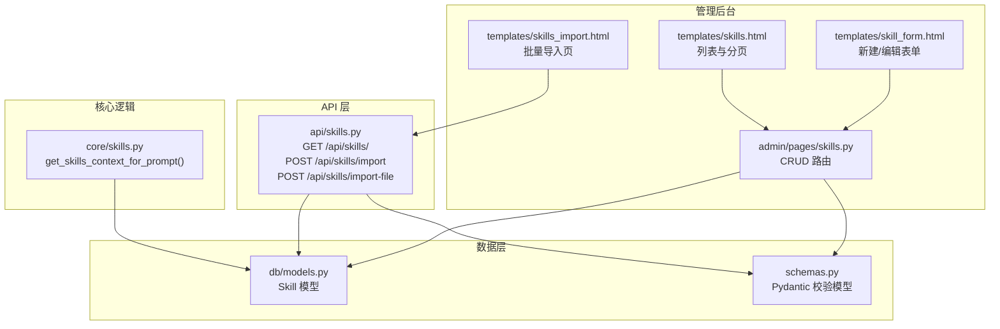
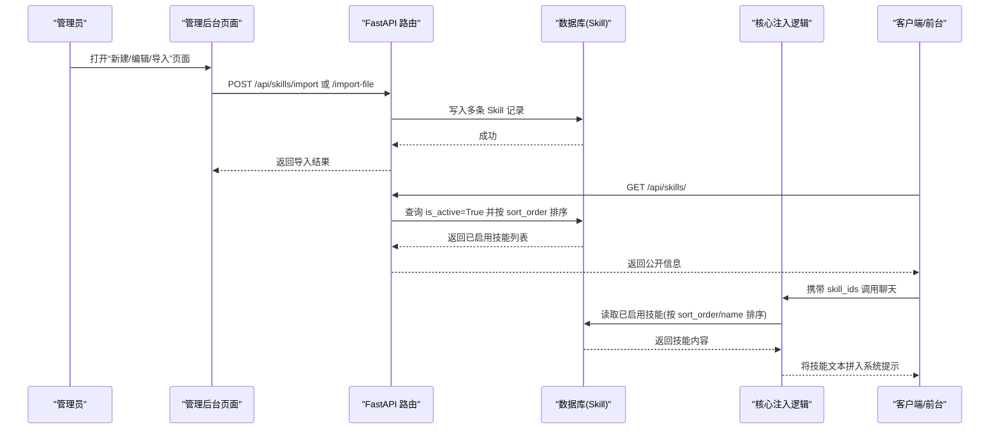
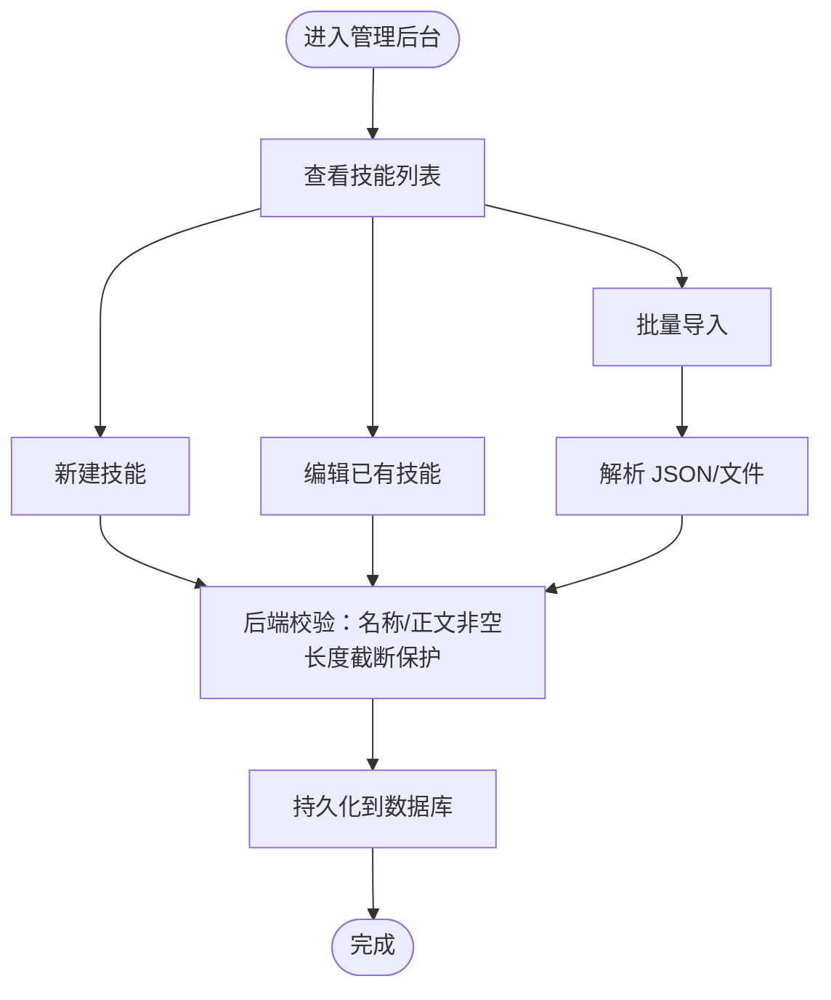
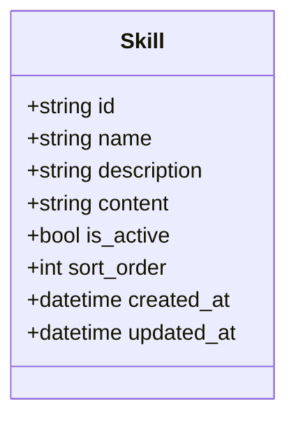
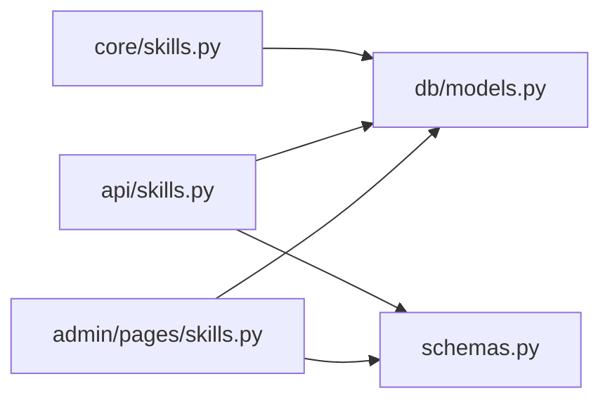

# 技能配置管理

<cite>
**本文引用的文件列表**
- [hushai/meditation/admin/pages/skills.py](file://hushai/meditation/admin/pages/skills.py)
- [hushai/meditation/api/skills.py](file://hushai/meditation/api/skills.py)
- [hushai/meditation/core/skills.py](file://hushai/meditation/core/skills.py)
- [hushai/meditation/db/models.py](file://hushai/meditation/db/models.py)
- [hushai/meditation/schemas.py](file://hushai/meditation/schemas.py)
- [hushai/meditation/admin/templates/skill_form.html](file://hushai/meditation/admin/templates/skill_form.html)
- [hushai/meditation/admin/templates/skills.html](file://hushai/meditation/admin/templates/skills.html)
- [hushai/meditation/admin/templates/skills_import.html](file://hushai/meditation/admin/templates/skills_import.html)
- [tests/meditation/test_schemas.py](file://tests/meditation/test_schemas.py)
</cite>

## 目录
1. [简介](#简介)
2. [项目结构](#项目结构)
3. [核心组件](#核心组件)
4. [架构总览](#架构总览)
5. [详细组件分析](#详细组件分析)
6. [依赖关系分析](#依赖关系分析)
7. [性能与容量限制](#性能与容量限制)
8. [故障排查指南](#故障排查指南)
9. [结论](#结论)
10. [附录：API 与校验规则速查](#附录api-与校验规则速查)

## 简介
本文件面向 hush.ai 的“技能配置管理”能力，围绕以下目标展开：
- 可视化配置界面：提供后台表单与批量导入页面，支持必填字段验证、数据类型检查与默认值设置。
- 优先级与执行顺序：通过 sort_order 控制排序，运行时按序注入系统提示。
- 启用/禁用控制：is_active 控制前台可见性与注入范围，实现灰度发布与热切换。
- 配置模板与预设方案：通过 JSON 批量导入接口与前端说明页，简化常见场景的配置过程。
- 版本管理与回滚机制：当前未内置版本表与审计记录；建议基于数据库迁移或外部工具实现变更可追溯与回滚。
- 配置校验与调试接口：Pydantic 模型校验、错误响应与导入页面的 API 文档入口，便于快速定位问题。

## 项目结构
与技能配置相关的关键路径与职责如下：
- 管理后台页面路由与模板：负责渲染表单、列表、导入页，处理管理员权限与基础校验。
- 公开 API：提供已启用技能列表、批量导入（JSON 与文件）等接口，包含鉴权与数据校验。
- 核心逻辑：根据 skill_ids 或全部已启用技能，生成注入到系统提示的技能上下文。
- 数据模型：Skill 实体定义字段、约束与时间戳。
- 请求/响应模型：使用 Pydantic 进行强类型校验与默认值设定。
- 测试用例：覆盖导入请求的默认值与边界行为。

图表来源
- [hushai/meditation/admin/pages/skills.py:1-218](file://hushai/meditation/admin/pages/skills.py#L1-L218)
- [hushai/meditation/api/skills.py:1-113](file://hushai/meditation/api/skills.py#L1-L113)
- [hushai/meditation/core/skills.py:1-59](file://hushai/meditation/core/skills.py#L1-L59)
- [hushai/meditation/db/models.py:120-135](file://hushai/meditation/db/models.py#L120-L135)
- [hushai/meditation/schemas.py:162-218](file://hushai/meditation/schemas.py#L162-L218)

章节来源
- [hushai/meditation/admin/pages/skills.py:1-218](file://hushai/meditation/admin/pages/skills.py#L1-L218)
- [hushai/meditation/api/skills.py:1-113](file://hushai/meditation/api/skills.py#L1-L113)
- [hushai/meditation/core/skills.py:1-59](file://hushai/meditation/core/skills.py#L1-L59)
- [hushai/meditation/db/models.py:120-135](file://hushai/meditation/db/models.py#L120-L135)
- [hushai/meditation/schemas.py:162-218](file://hushai/meditation/schemas.py#L162-L218)

## 核心组件
- 管理后台路由
  - 列表、新建、编辑、删除技能；支持搜索与分页；返回 HTML 模板。
  - 表单提交时对名称与正文做非空校验，并对长度做截断保护。
- 公开 API
  - 列出已启用技能（按 sort_order 升序）。
  - 批量导入：支持 JSON Body 与 multipart 文件上传；统一走同一导入逻辑。
  - 鉴权：支持管理员 Token 或用户 Token。
- 核心注入逻辑
  - 根据传入 skill_ids 或全部已启用技能，去重并限制数量，按 sort_order 与 name 排序后拼接为系统提示片段。
- 数据模型
  - Skill 包含 id、name、description、content、is_active、sort_order、创建/更新时间。
- Pydantic 校验
  - 对导入项字段进行最小/最大长度、默认值、去重与裁剪。

章节来源
- [hushai/meditation/admin/pages/skills.py:92-195](file://hushai/meditation/admin/pages/skills.py#L92-L195)
- [hushai/meditation/api/skills.py:47-113](file://hushai/meditation/api/skills.py#L47-L113)
- [hushai/meditation/core/skills.py:14-59](file://hushai/meditation/core/skills.py#L14-L59)
- [hushai/meditation/db/models.py:120-135](file://hushai/meditation/db/models.py#L120-L135)
- [hushai/meditation/schemas.py:172-218](file://hushai/meditation/schemas.py#L172-L218)

## 架构总览
从“配置—生效—运行”的角度看，技能配置的生命周期如下：
- 配置阶段：管理员在后台新增/编辑/删除技能，或通过批量导入一次性写入多条。
- 生效阶段：is_active 控制是否对外暴露；sort_order 决定排序；运行时仅加载已启用的技能。
- 运行阶段：对话时根据 skill_ids 选择特定技能，或默认加载前 N 条已启用技能，拼接入系统提示。

图表来源
- [hushai/meditation/admin/pages/skills.py:17-30](file://hushai/meditation/admin/pages/skills.py#L17-L30)
- [hushai/meditation/api/skills.py:47-90](file://hushai/meditation/api/skills.py#L47-L90)
- [hushai/meditation/core/skills.py:14-59](file://hushai/meditation/core/skills.py#L14-L59)
- [hushai/meditation/db/models.py:120-135](file://hushai/meditation/db/models.py#L120-L135)

## 详细组件分析

### 可视化配置界面（后台）
- 列表页
  - 支持按名称/摘要模糊搜索，分页展示，显示排序、启用状态与创建日期。
  - 提供“新建”和“批量导入”快捷入口。
- 新建/编辑表单
  - 必填字段：名称、正文；可选：短摘要、排序、启用开关。
  - 前端标注必填项，后端再次校验非空与长度上限。
- 批量导入页
  - 支持粘贴 JSON 或直接上传 .json 文件。
  - 页面内嵌 API 说明与调试链接，便于开发者快速验证。

图表来源
- [hushai/meditation/admin/templates/skills.html:14-39](file://hushai/meditation/admin/templates/skills.html#L14-L39)
- [hushai/meditation/admin/templates/skill_form.html:27-59](file://hushai/meditation/admin/templates/skill_form.html#L27-L59)
- [hushai/meditation/admin/templates/skills_import.html:34-68](file://hushai/meditation/admin/templates/skills_import.html#L34-L68)
- [hushai/meditation/admin/pages/skills.py:92-195](file://hushai/meditation/admin/pages/skills.py#L92-L195)

章节来源
- [hushai/meditation/admin/templates/skills.html:14-39](file://hushai/meditation/admin/templates/skills.html#L14-L39)
- [hushai/meditation/admin/templates/skill_form.html:27-59](file://hushai/meditation/admin/templates/skill_form.html#L27-L59)
- [hushai/meditation/admin/templates/skills_import.html:34-68](file://hushai/meditation/admin/templates/skills_import.html#L34-L68)
- [hushai/meditation/admin/pages/skills.py:92-195](file://hushai/meditation/admin/pages/skills.py#L92-L195)

### 必填字段验证、数据类型检查与默认值
- 必填字段
  - 名称与正文在后端强制非空；为空则返回错误提示。
- 数据类型与长度
  - 名称最长 128 字符，描述最长 512 字符，超出部分会被截断。
  - 排序为整数，默认 0。
  - 启用开关为布尔，默认 true。
- 默认值
  - 导入项中未提供的字段采用默认值（如 sort_order=0、is_active=true、description=None）。
- 去重与上限
  - 导入批次最多 100 条；每轮对话注入最多 8 条；skill_ids 会去重并受上限约束。

章节来源
- [hushai/meditation/admin/pages/skills.py:106-128](file://hushai/meditation/admin/pages/skills.py#L106-L128)
- [hushai/meditation/api/skills.py:71-90](file://hushai/meditation/api/skills.py#L71-L90)
- [hushai/meditation/schemas.py:172-218](file://hushai/meditation/schemas.py#L172-L218)
- [hushai/meditation/core/skills.py:10-11](file://hushai/meditation/core/skills.py#L10-L11)
- [tests/meditation/test_schemas.py:121-151](file://tests/meditation/test_schemas.py#L121-L151)

### 技能优先级与执行顺序
- 存储层
  - sort_order 字段用于排序，越小越靠前。
- 查询与注入
  - 列表与注入均按 sort_order 升序，其次按 name 升序稳定排序。
- 运行时限制
  - 若指定 skill_ids，则按传入顺序去重并取前 N 条；否则直接取前 N 条已启用技能。

图表来源
- [hushai/meditation/db/models.py:120-135](file://hushai/meditation/db/models.py#L120-L135)
- [hushai/meditation/core/skills.py:30-41](file://hushai/meditation/core/skills.py#L30-L41)

章节来源
- [hushai/meditation/core/skills.py:14-59](file://hushai/meditation/core/skills.py#L14-L59)
- [hushai/meditation/api/skills.py:47-58](file://hushai/meditation/api/skills.py#L47-L58)

### 启用/禁用控制与灰度发布、热切换
- 控制方式
  - is_active 控制是否对外可见与是否被注入。
- 灰度发布
  - 通过逐步调整 sort_order 与 is_active，可实现小流量灰度与快速回切。
- 热切换
  - 修改 is_active 或 sort_order 后立即生效，无需重启服务。

章节来源
- [hushai/meditation/api/skills.py:47-58](file://hushai/meditation/api/skills.py#L47-L58)
- [hushai/meditation/core/skills.py:30-41](file://hushai/meditation/core/skills.py#L30-L41)

### 配置模板与预设方案
- 批量导入
  - 支持两种根结构：{"skills": [...]} 或顶层数组 [...]。
  - 每条包含 name、content（必填），description、sort_order、is_active（可选）。
- 导入页说明
  - 页面明确标注必填字段、长度限制与单次上限，并提供 API 文档入口。

章节来源
- [hushai/meditation/schemas.py:197-208](file://hushai/meditation/schemas.py#L197-L208)
- [hushai/meditation/admin/templates/skills_import.html:19-26](file://hushai/meditation/admin/templates/skills_import.html#L19-L26)
- [hushai/meditation/admin/templates/skills_import.html:76-84](file://hushai/meditation/admin/templates/skills_import.html#L76-L84)

### 配置版本管理与回滚机制
- 现状
  - 代码库未提供独立的“技能版本表”或“变更日志表”。
- 建议方案
  - 引入版本表：记录每次变更的版本号、快照内容与操作人。
  - 结合现有 AuditLog 模型扩展：记录资源类型、资源 ID、动作与详情，形成可追溯链。
  - 回滚策略：通过版本号恢复历史快照，或借助数据库迁移工具进行回退。

章节来源
- [hushai/meditation/db/models.py:188-202](file://hushai/meditation/db/models.py#L188-L202)

### 配置校验工具与调试接口
- 校验工具
  - Pydantic 模型集中定义校验规则，包括必填、长度、默认值与去重。
  - 单元测试覆盖默认值与边界情况，确保一致性。
- 调试接口
  - 导入页面提供 API 文档链接，便于在线调试。
  - 错误响应统一格式，便于前端展示与排错。

章节来源
- [hushai/meditation/schemas.py:172-218](file://hushai/meditation/schemas.py#L172-L218)
- [tests/meditation/test_schemas.py:121-151](file://tests/meditation/test_schemas.py#L121-L151)
- [hushai/meditation/admin/templates/skills_import.html:76-84](file://hushai/meditation/admin/templates/skills_import.html#L76-L84)

## 依赖关系分析
- 模块耦合
  - 管理后台路由依赖数据库会话与模板引擎；API 路由依赖 Pydantic 模型与会话；核心注入逻辑仅依赖模型与会话。
- 外部依赖
  - FastAPI、SQLAlchemy、Pydantic。
- 潜在循环依赖
  - 当前未见循环引用；各层职责清晰。

图表来源
- [hushai/meditation/admin/pages/skills.py:1-218](file://hushai/meditation/admin/pages/skills.py#L1-L218)
- [hushai/meditation/api/skills.py:1-113](file://hushai/meditation/api/skills.py#L1-L113)
- [hushai/meditation/core/skills.py:1-59](file://hushai/meditation/core/skills.py#L1-L59)
- [hushai/meditation/db/models.py:120-135](file://hushai/meditation/db/models.py#L120-L135)
- [hushai/meditation/schemas.py:162-218](file://hushai/meditation/schemas.py#L162-L218)

章节来源
- [hushai/meditation/admin/pages/skills.py:1-218](file://hushai/meditation/admin/pages/skills.py#L1-L218)
- [hushai/meditation/api/skills.py:1-113](file://hushai/meditation/api/skills.py#L1-L113)
- [hushai/meditation/core/skills.py:1-59](file://hushai/meditation/core/skills.py#L1-L59)
- [hushai/meditation/db/models.py:120-135](file://hushai/meditation/db/models.py#L120-L135)
- [hushai/meditation/schemas.py:162-218](file://hushai/meditation/schemas.py#L162-L218)

## 性能与容量限制
- 批量导入上限：单次最多 100 条。
- 运行时注入上限：每轮对话最多 8 条。
- 排序与过滤：按 sort_order 与 name 排序，避免重复加载未启用技能。
- 建议
  - 合理拆分大段 content，避免单条过长影响提示长度。
  - 使用 sort_order 精细控制优先级，减少不必要的动态计算。

章节来源
- [hushai/meditation/core/skills.py:10-11](file://hushai/meditation/core/skills.py#L10-L11)
- [hushai/meditation/schemas.py:197-208](file://hushai/meditation/schemas.py#L197-L208)

## 故障排查指南
- 常见问题
  - 导入失败：检查 JSON 结构与字段是否符合要求；确认 Authorization 头是否正确。
  - 字段为空：名称与正文不能为空；描述可为空但需符合长度限制。
  - 排序异常：确认 sort_order 数值大小与预期一致。
  - 未生效：检查 is_active 是否为 true；确认是否在运行时被选中或在前 N 条范围内。
- 定位方法
  - 使用导入页的 API 文档链接进行在线调试。
  - 查看错误响应中的 detail 字段，快速定位具体原因。
  - 核对数据库记录与排序、启用状态。

章节来源
- [hushai/meditation/admin/templates/skills_import.html:76-84](file://hushai/meditation/admin/templates/skills_import.html#L76-L84)
- [hushai/meditation/api/skills.py:104-112](file://hushai/meditation/api/skills.py#L104-L112)
- [hushai/meditation/admin/pages/skills.py:175-187](file://hushai/meditation/admin/pages/skills.py#L175-L187)

## 结论
hush.ai 的技能配置管理提供了完善的可视化配置、严格的校验与灵活的优先级控制，并通过 is_active 实现灰度与热切换。当前尚未内置版本管理与回滚机制，建议结合审计日志与版本表完善变更可追溯性。借助 Pydantic 校验与导入页调试接口，开发者可以快速定位与修复配置错误。

## 附录：API 与校验规则速查
- 接口
  - GET /api/skills/：返回已启用技能列表（按 sort_order 升序）。
  - POST /api/skills/import：JSON Body 批量导入。
  - POST /api/skills/import-file：multipart 上传 .json 批量导入。
- 字段与校验
  - name：必填，最长 128 字符。
  - content：必填，无显式上限（建议合理分段）。
  - description：可选，最长 512 字符。
  - sort_order：整数，默认 0。
  - is_active：布尔，默认 true。
- 限制
  - 导入批次上限：100 条。
  - 运行时注入上限：每轮最多 8 条。

章节来源
- [hushai/meditation/api/skills.py:47-113](file://hushai/meditation/api/skills.py#L47-L113)
- [hushai/meditation/schemas.py:172-218](file://hushai/meditation/schemas.py#L172-L218)
- [hushai/meditation/core/skills.py:10-11](file://hushai/meditation/core/skills.py#L10-L11)