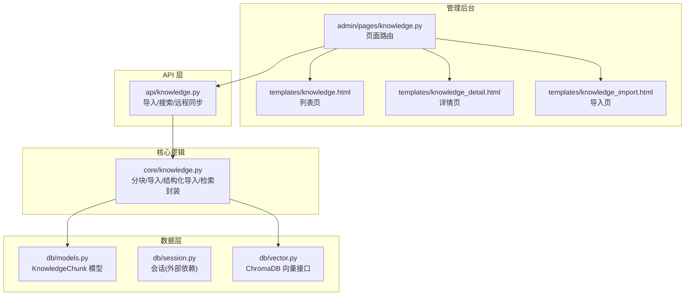
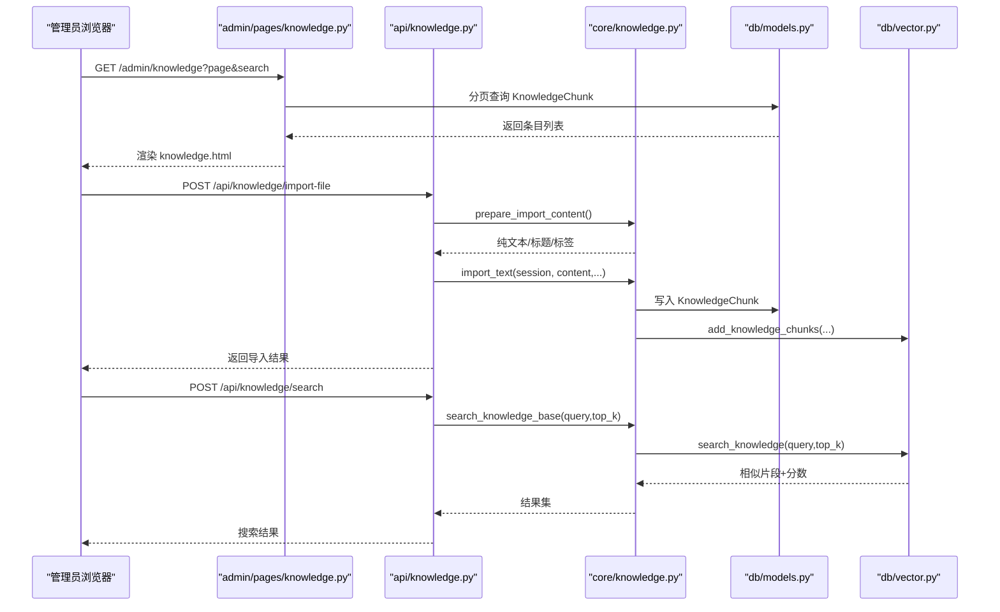
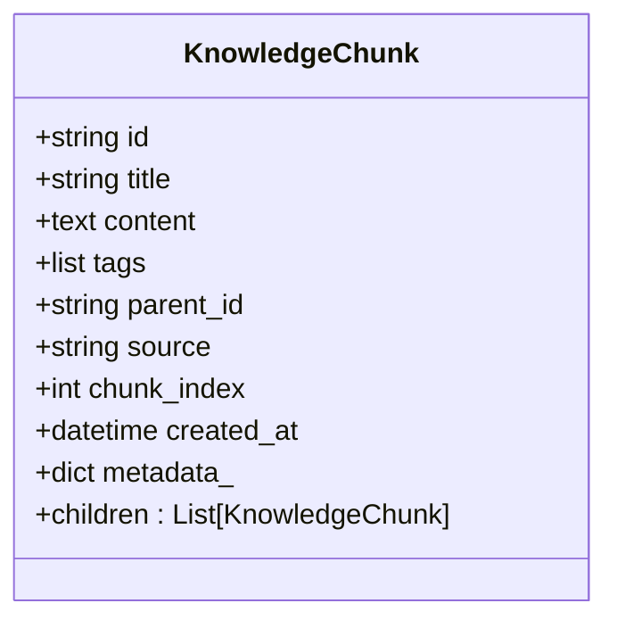
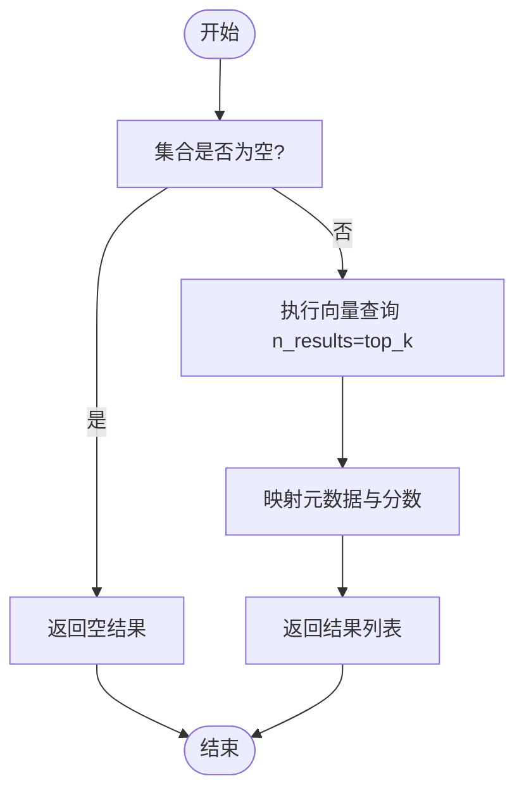
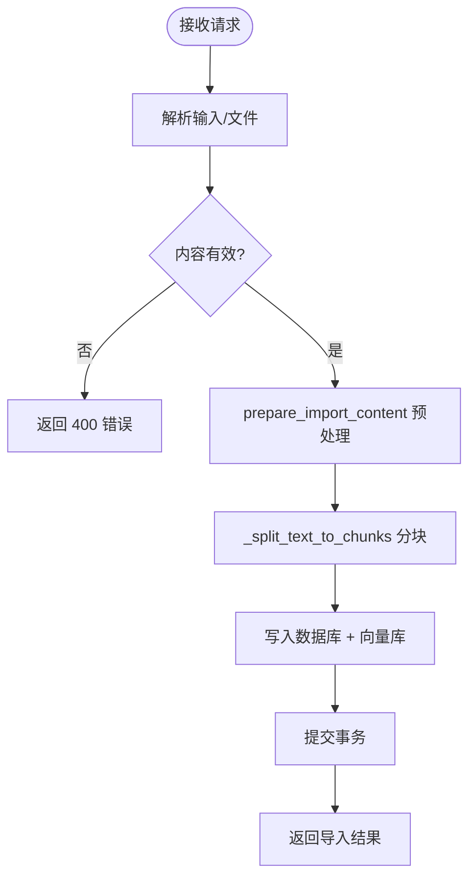
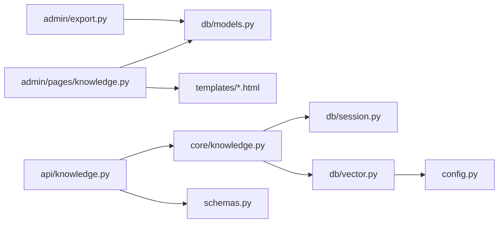

# 知识库管理

<cite>
**本文引用的文件列表**
- [hushai/meditation/admin/pages/knowledge.py](file://hushai/meditation/admin/pages/knowledge.py)
- [hushai/meditation/api/knowledge.py](file://hushai/meditation/api/knowledge.py)
- [hushai/meditation/core/knowledge.py](file://hushai/meditation/core/knowledge.py)
- [hushai/meditation/db/models.py](file://hushai/meditation/db/models.py)
- [hushai/meditation/db/vector.py](file://hushai/meditation/db/vector.py)
- [hushai/meditation/schemas.py](file://hushai/meditation/schemas.py)
- [hushai/meditation/config.py](file://hushai/meditation/config.py)
- [hushai/meditation/admin/templates/knowledge.html](file://hushai/meditation/admin/templates/knowledge.html)
- [hushai/meditation/admin/templates/knowledge_detail.html](file://hushai/meditation/admin/templates/knowledge_detail.html)
- [hushai/meditation/admin/templates/knowledge_import.html](file://hushai/meditation/admin/templates/knowledge_import.html)
- [hushai/meditation/admin/export.py](file://hushai/meditation/admin/export.py)
- [hushai/meditation/commands/init_knowledge.py](file://hushai/meditation/commands/init_knowledge.py)
- [scripts/import_open_cognition.py](file://scripts/import_open_cognition.py)
</cite>

## 目录
1. [简介](#简介)
2. [项目结构](#项目结构)
3. [核心组件](#核心组件)
4. [架构总览](#架构总览)
5. [详细组件分析](#详细组件分析)
6. [依赖关系分析](#依赖关系分析)
7. [性能与检索优化](#性能与检索优化)
8. [故障排查指南](#故障排查指南)
9. [结论](#结论)
10. [附录：操作手册与最佳实践](#附录操作手册与最佳实践)

## 简介
本文件面向内容运营人员与技术维护人员，系统化说明 hush.ai 管理后台的知识库管理能力，包括知识条目的增删改查、分页浏览、搜索过滤、详情查看；Markdown 导入流程（含文件格式要求、批量导入与错误处理）；编辑界面能力边界与版本控制现状；向量检索优化配置（索引重建、相似度阈值与性能调优）；数据备份恢复与迁移工具使用指南。文档同时提供架构图、流程图和时序图，帮助快速上手与排障。

## 项目结构
知识库功能由“管理页面路由 + API 路由 + 核心逻辑 + 数据库模型 + 向量库 + 模板”组成，前后端通过 FastAPI 路由与 Jinja2 模板协作。

图表来源
- [hushai/meditation/admin/pages/knowledge.py:22-116](file://hushai/meditation/admin/pages/knowledge.py#L22-L116)
- [hushai/meditation/api/knowledge.py:57-234](file://hushai/meditation/api/knowledge.py#L57-L234)
- [hushai/meditation/core/knowledge.py:137-214](file://hushai/meditation/core/knowledge.py#L137-L214)
- [hushai/meditation/db/models.py:137-151](file://hushai/meditation/db/models.py#L137-L151)
- [hushai/meditation/db/vector.py:61-127](file://hushai/meditation/db/vector.py#L61-L127)

章节来源
- [hushai/meditation/admin/pages/knowledge.py:22-116](file://hushai/meditation/admin/pages/knowledge.py#L22-L116)
- [hushai/meditation/api/knowledge.py:57-234](file://hushai/meditation/api/knowledge.py#L57-L234)
- [hushai/meditation/core/knowledge.py:137-214](file://hushai/meditation/core/knowledge.py#L137-L214)
- [hushai/meditation/db/models.py:137-151](file://hushai/meditation/db/models.py#L137-L151)
- [hushai/meditation/db/vector.py:61-127](file://hushai/meditation/db/vector.py#L61-L127)

## 核心组件
- 管理页面路由：提供知识库列表、详情、导入入口、删除与批量删除等页面级能力。
- API 路由：提供文本/文件/结构化/批量/远程 URL 导入与搜索接口，统一鉴权。
- 核心逻辑：Markdown 预处理、纯文本转换、段落分块、入库与向量化、结构化递归导入、检索封装。
- 数据模型：KnowledgeChunk 实体，支持父子层级、标签、来源、分段序号等元信息。
- 向量库：基于 ChromaDB 的集合管理与查询，支持 OpenAI 嵌入或默认嵌入。
- 模板：列表、详情、导入页面的渲染与交互。

章节来源
- [hushai/meditation/admin/pages/knowledge.py:22-163](file://hushai/meditation/admin/pages/knowledge.py#L22-L163)
- [hushai/meditation/api/knowledge.py:57-310](file://hushai/meditation/api/knowledge.py#L57-L310)
- [hushai/meditation/core/knowledge.py:76-214](file://hushai/meditation/core/knowledge.py#L76-L214)
- [hushai/meditation/db/models.py:137-151](file://hushai/meditation/db/models.py#L137-L151)
- [hushai/meditation/db/vector.py:61-127](file://hushai/meditation/db/vector.py#L61-L127)

## 架构总览
下图展示从管理后台到数据层的完整调用链，涵盖导入、检索与删除流程。

图表来源
- [hushai/meditation/admin/pages/knowledge.py:22-71](file://hushai/meditation/admin/pages/knowledge.py#L22-L71)
- [hushai/meditation/api/knowledge.py:96-137](file://hushai/meditation/api/knowledge.py#L96-L137)
- [hushai/meditation/core/knowledge.py:137-171](file://hushai/meditation/core/knowledge.py#L137-L171)
- [hushai/meditation/db/vector.py:81-127](file://hushai/meditation/db/vector.py#L81-L127)

## 详细组件分析

### 管理页面与模板
- 列表页
  - 支持分页参数 page、limit，默认每页 20 条。
  - 支持按 title/content 模糊搜索，URL 参数 search。
  - 提供导出 CSV/Excel 按钮，跳转至导出接口。
  - 单条删除通过 DELETE /admin/api/knowledge/{id} 触发。
- 详情页
  - 显示标题、创建时间、来源、分段序号、标签、父级链接与元数据。
  - 提供“编辑”按钮（当前未实现后端编辑路由），以及删除按钮。
- 导入页
  - 支持三种方式：文本导入、文件导入、结构化 JSON 导入。
  - 文本/文件导入均支持 Markdown 解析（YAML frontmatter、标题转纯文本）。
  - 前端通过 Bearer Token 调用 /api/knowledge/* 接口。

章节来源
- [hushai/meditation/admin/pages/knowledge.py:22-116](file://hushai/meditation/admin/pages/knowledge.py#L22-L116)
- [hushai/meditation/admin/templates/knowledge.html:14-142](file://hushai/meditation/admin/templates/knowledge.html#L14-L142)
- [hushai/meditation/admin/templates/knowledge_detail.html:1-157](file://hushai/meditation/admin/templates/knowledge_detail.html#L1-L157)
- [hushai/meditation/admin/templates/knowledge_import.html:14-507](file://hushai/meditation/admin/templates/knowledge_import.html#L14-L507)

### API 路由与鉴权
- 鉴权策略
  - 支持管理员 JWT（后台导入）或普通用户 JWT，统一在 _require_knowledge_operator 中校验。
- 导入接口
  - POST /api/knowledge/import：文本导入，支持 plain/markdown 两种格式。
  - POST /api/knowledge/import-file：单文件上传，自动识别 .md/.markdown，或强制 as_markdown。
  - POST /api/knowledge/import-structured：结构化 JSON 导入，支持 children 嵌套。
  - POST /api/knowledge/import-batch：多文件批量导入，UTF-8/GBK 容错解码，逐文件统计与错误收集。
  - POST /api/knowledge/import-url / import-remote / sync-remote：从 URL/Coze/IMA 等远程源抓取并导入。
- 搜索接口
  - POST /api/knowledge/search：按 query 与 top_k 返回相似片段及分数。

章节来源
- [hushai/meditation/api/knowledge.py:38-310](file://hushai/meditation/api/knowledge.py#L38-L310)
- [hushai/meditation/schemas.py:110-151](file://hushai/meditation/schemas.py#L110-L151)

### 核心逻辑：导入与检索
- Markdown 预处理
  - 解析 YAML frontmatter（title/tags），提取正文。
  - 将 Markdown 转为适合向量检索的纯文本（保留代码块内部文本、去除多余标记）。
  - 若未显式标题，则取首个一级标题或文件名作为标题。
- 分块策略
  - 以双换行段落为基本单元，按 chunk_size=800、overlap=200 进行切分，保证上下文连贯。
- 入库与向量化
  - 每个段落生成一个 KnowledgeChunk，写入数据库后，将 id、content、title、tags、source、parent_id 等信息写入 ChromaDB 集合。
- 结构化导入
  - 支持树形结构，children 递归导入，子节点 parent_id 指向父节点首段 ID。
- 检索封装
  - 根据配置 knowledge_top_k 决定默认 top_k，调用向量库查询。

章节来源
- [hushai/meditation/core/knowledge.py:76-214](file://hushai/meditation/core/knowledge.py#L76-L214)
- [hushai/meditation/db/models.py:137-151](file://hushai/meditation/db/models.py#L137-L151)
- [hushai/meditation/db/vector.py:81-127](file://hushai/meditation/db/vector.py#L81-L127)

### 数据模型与关系
- KnowledgeChunk
  - 字段：id、title、content、tags(JSON)、parent_id(FK)、source、chunk_index、created_at、metadata(JSON)。
  - 关系：children 自引用，形成树状结构。
  - 索引：parent_id 建立索引，便于父子关联查询。

图表来源
- [hushai/meditation/db/models.py:137-151](file://hushai/meditation/db/models.py#L137-L151)

章节来源
- [hushai/meditation/db/models.py:137-151](file://hushai/meditation/db/models.py#L137-L151)

### 向量库与检索流程
- 集合管理
  - 集合名：knowledge，空间度量 cosine。
  - 可选持久化路径 chroma_persist_dir，否则内存模式。
- 嵌入函数
  - 优先使用 OpenAIEmbeddingFunction（读取 embedding_api_key/embedding_model/embedding_base_url），否则回退默认嵌入。
- 查询流程
  - 先 count 判断是否为空，再执行 query，返回 ids/documents/distances/metadatas，转换为带 score 的结果。

图表来源
- [hushai/meditation/db/vector.py:61-127](file://hushai/meditation/db/vector.py#L61-L127)

章节来源
- [hushai/meditation/db/vector.py:61-127](file://hushai/meditation/db/vector.py#L61-L127)

### 导入流程与错误处理
- 文本导入
  - 校验 content_format 为 markdown/plain；为空时返回 400。
- 文件导入
  - 自动识别 .md/.markdown；非 md 时可强制 as_markdown；失败返回 400。
- 批量导入
  - 对每个文件尝试 UTF-8 解码，失败回退 GBK；记录成功数与错误列表；最终提交事务。
- 结构化导入
  - 递归 children，构建父子关系；失败抛出异常。
- 远程导入
  - 支持 url/coze/ima；缺少必要参数返回 400。

图表来源
- [hushai/meditation/api/knowledge.py:96-210](file://hushai/meditation/api/knowledge.py#L96-L210)
- [hushai/meditation/core/knowledge.py:106-171](file://hushai/meditation/core/knowledge.py#L106-L171)

章节来源
- [hushai/meditation/api/knowledge.py:96-210](file://hushai/meditation/api/knowledge.py#L96-L210)
- [hushai/meditation/core/knowledge.py:106-171](file://hushai/meditation/core/knowledge.py#L106-L171)

### 编辑界面与版本控制
- 编辑入口
  - 详情页提供“编辑”按钮，但当前未实现后端编辑路由。
- 富文本编辑器
  - 当前未集成富文本编辑器；详情以纯文本 <pre> 展示。
- 内容预览
  - 详情页直接展示 content 原始文本。
- 版本控制
  - 当前无版本历史机制；如需版本控制需扩展模型与存储策略。

章节来源
- [hushai/meditation/admin/templates/knowledge_detail.html:18-24](file://hushai/meditation/admin/templates/knowledge_detail.html#L18-L24)
- [hushai/meditation/admin/templates/knowledge_detail.html:47-49](file://hushai/meditation/admin/templates/knowledge_detail.html#L47-L49)

### 数据导出与备份
- 导出
  - 列表页提供 CSV/Excel 导出，后端 export_knowledge 接口按搜索条件导出。
  - 通用导出工具 export_to_csv/export_to_excel 支持流式响应与列宽设置。
- 备份建议
  - 数据库：使用数据库原生备份工具（如 pg_dump）定期备份。
  - 向量库：若启用 chroma_persist_dir，可直接复制持久化目录完成备份。
- 恢复与迁移
  - 数据库恢复：使用数据库还原命令恢复。
  - 向量库恢复：将持久化目录恢复到相同路径，重启服务即可加载。

章节来源
- [hushai/meditation/admin/templates/knowledge.html:34-44](file://hushai/meditation/admin/templates/knowledge.html#L34-L44)
- [hushai/meditation/admin/export.py:1-106](file://hushai/meditation/admin/export.py#L1-106)
- [hushai/meditation/db/vector.py:15-28](file://hushai/meditation/db/vector.py#L15-L28)

### 批量导入与迁移工具
- CLI 初始化/批量导入
  - 命令：hush-init-knowledge
  - 选项：--repo-url/--source-dir/--domains/--dry-run/--yes/--no-skip
  - 用途：从 GitHub 仓库或本地目录批量扫描 Markdown，去重、预览、导入。
- 兼容脚本
  - scripts/import_open_cognition.py 直接调用 init_knowledge.main。

章节来源
- [hushai/meditation/commands/init_knowledge.py:257-296](file://hushai/meditation/commands/init_knowledge.py#L257-L296)
- [scripts/import_open_cognition.py:1-8](file://scripts/import_open_cognition.py#L1-L8)

## 依赖关系分析
- 模块耦合
  - admin/pages/knowledge.py 依赖 db.models.KnowledgeChunk 与模板渲染。
  - api/knowledge.py 依赖 core.knowledge 与 schemas 模型，负责鉴权与协议适配。
  - core.knowledge 依赖 db.session、db.vector、config。
  - db.vector 依赖 config 获取嵌入提供商与持久化路径。
- 外部依赖
  - ChromaDB 用于向量检索；OpenAIEmbeddingFunction 可选。
  - openpyxl 用于 Excel 导出。

图表来源
- [hushai/meditation/admin/pages/knowledge.py:22-116](file://hushai/meditation/admin/pages/knowledge.py#L22-L116)
- [hushai/meditation/api/knowledge.py:57-234](file://hushai/meditation/api/knowledge.py#L57-L234)
- [hushai/meditation/core/knowledge.py:137-214](file://hushai/meditation/core/knowledge.py#L137-L214)
- [hushai/meditation/db/vector.py:61-127](file://hushai/meditation/db/vector.py#L61-L127)
- [hushai/meditation/admin/export.py:1-106](file://hushai/meditation/admin/export.py#L1-106)

章节来源
- [hushai/meditation/admin/pages/knowledge.py:22-116](file://hushai/meditation/admin/pages/knowledge.py#L22-L116)
- [hushai/meditation/api/knowledge.py:57-234](file://hushai/meditation/api/knowledge.py#L57-L234)
- [hushai/meditation/core/knowledge.py:137-214](file://hushai/meditation/core/knowledge.py#L137-L214)
- [hushai/meditation/db/vector.py:61-127](file://hushai/meditation/db/vector.py#L61-L127)
- [hushai/meditation/admin/export.py:1-106](file://hushai/meditation/admin/export.py#L1-106)

## 性能与检索优化
- 分块参数
  - 默认 chunk_size=800、overlap=200，可根据领域语料长度调整以提升召回质量。
- Top-K 配置
  - 通过环境变量 MEDITATION_KNOWLEDGE_TOP_K 控制默认检索数量。
- 嵌入提供商
  - embedding_provider=openai 时使用 OpenAIEmbeddingFunction；可配置 embedding_api_key、embedding_model、embedding_base_url。
- 向量库持久化
  - 设置 MEDITATION_CHROMA_DIR 启用持久化，避免重启丢失索引。
- 相似度阈值
  - 当前未实现阈值过滤；可在上层业务逻辑中对返回结果的 score 进行二次筛选。
- 性能调优建议
  - 合理设置 top_k，避免过大导致 LLM 上下文膨胀。
  - 对长文档采用更细粒度分块，提升检索精度。
  - 使用持久化向量库减少冷启动开销。

章节来源
- [hushai/meditation/core/knowledge.py:106-134](file://hushai/meditation/core/knowledge.py#L106-L134)
- [hushai/meditation/config.py:40-53](file://hushai/meditation/config.py#L40-L53)
- [hushai/meditation/db/vector.py:43-58](file://hushai/meditation/db/vector.py#L43-L58)
- [hushai/meditation/db/vector.py:15-28](file://hushai/meditation/db/vector.py#L15-L28)

## 故障排查指南
- 导入内容为空
  - 现象：返回 400 “导入内容解析后为空”。
  - 排查：确认 content_format 与内容是否包含有效文本；Markdown 是否包含 frontmatter 或正文。
- 批量导入编码错误
  - 现象：部分文件解码失败。
  - 排查：系统会尝试 UTF-8 后回退 GBK；若仍失败，检查文件编码与内容完整性。
- 向量检索结果为空
  - 现象：search 返回空列表。
  - 排查：确认集合 count 是否为 0；检查 embedding 配置与持久化路径是否正确。
- 权限问题
  - 现象：401 缺少 Authorization 或 token 无效。
  - 排查：确保请求头携带正确的 Bearer Token；管理员与普通用户均可访问导入接口。

章节来源
- [hushai/meditation/api/knowledge.py:62-73](file://hushai/meditation/api/knowledge.py#L62-L73)
- [hushai/meditation/api/knowledge.py:180-210](file://hushai/meditation/api/knowledge.py#L180-L210)
- [hushai/meditation/db/vector.py:104-127](file://hushai/meditation/db/vector.py#L104-L127)
- [hushai/meditation/api/knowledge.py:38-55](file://hushai/meditation/api/knowledge.py#L38-L55)

## 结论
知识库管理功能已覆盖常见的增删改查、分页与搜索、Markdown 导入与批量导入、向量检索与导出等核心场景。当前编辑界面与版本控制尚未实现，建议在后续迭代中补充富文本编辑与版本历史能力。通过合理的分块策略、Top-K 与嵌入配置，可获得稳定的检索效果。配合 CLI 工具与持久化向量库，可实现高效的数据迁移与运维。

## 附录：操作手册与最佳实践

### 管理操作手册（内容运营）
- 登录管理后台，进入“知识库管理”。
- 列表页
  - 使用搜索框按标题或内容过滤。
  - 翻页浏览，点击条目查看详情。
  - 使用导出按钮下载 CSV/Excel。
- 导入知识
  - 文本导入：粘贴内容，勾选“按 Markdown 解析”，填写标题与标签。
  - 文件导入：选择 .md/.txt 文件，必要时勾选“按 Markdown 解析”。
  - 结构化导入：准备 JSON 数据，包含 nodes/relationships 或树形 children。
  - 批量导入：一次上传多个文件，查看导入结果与错误列表。
- 删除条目
  - 列表或详情页点击删除，确认后移除。

章节来源
- [hushai/meditation/admin/templates/knowledge.html:14-142](file://hushai/meditation/admin/templates/knowledge.html#L14-L142)
- [hushai/meditation/admin/templates/knowledge_import.html:14-507](file://hushai/meditation/admin/templates/knowledge_import.html#L14-L507)
- [hushai/meditation/admin/pages/knowledge.py:119-163](file://hushai/meditation/admin/pages/knowledge.py#L119-L163)

### 最佳实践建议
- 文档组织
  - 使用清晰的标题结构与段落划分，利于分块与检索。
  - 合理使用 frontmatter 的 title 与 tags，提升检索命中与分类。
- 导入策略
  - 大文档拆分为主题明确的子文档，提高检索精度。
  - 批量导入前使用 --dry-run 预览，避免误导入。
- 检索优化
  - 根据业务需求调整 knowledge_top_k，平衡召回与上下文长度。
  - 对关键概念增加标签，辅助过滤与排序。
- 备份与恢复
  - 定期备份数据库与向量持久化目录，确保数据安全。
  - 迁移时保持向量库路径一致，避免重新构建索引。

章节来源
- [hushai/meditation/core/knowledge.py:76-104](file://hushai/meditation/core/knowledge.py#L76-L104)
- [hushai/meditation/commands/init_knowledge.py:257-296](file://hushai/meditation/commands/init_knowledge.py#L257-L296)
- [hushai/meditation/db/vector.py:15-28](file://hushai/meditation/db/vector.py#L15-L28)