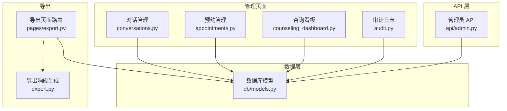
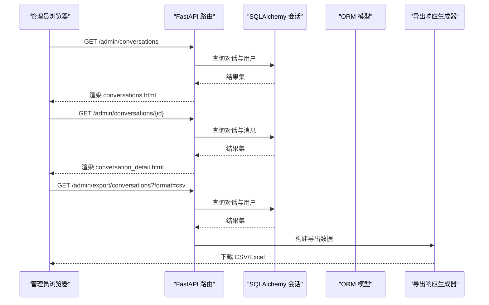
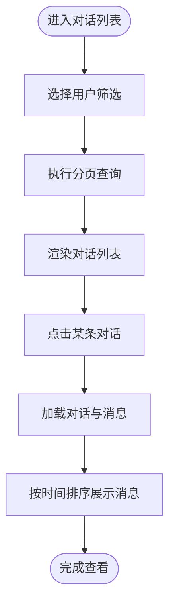
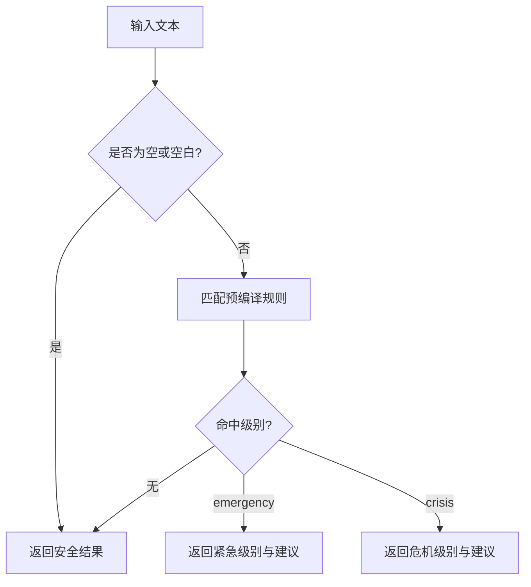
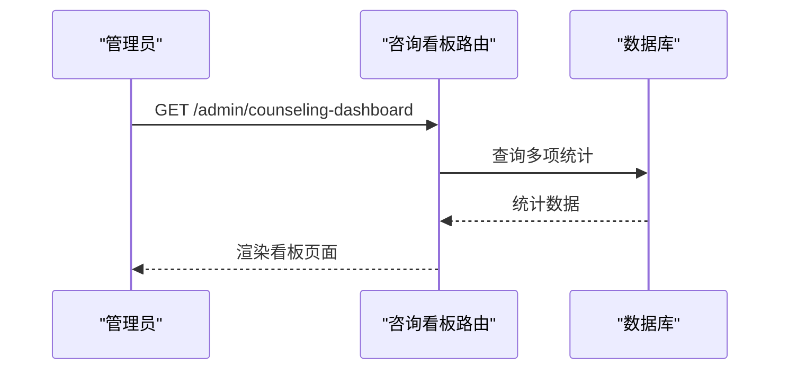
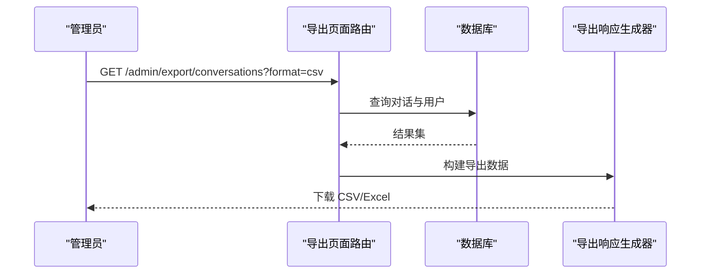
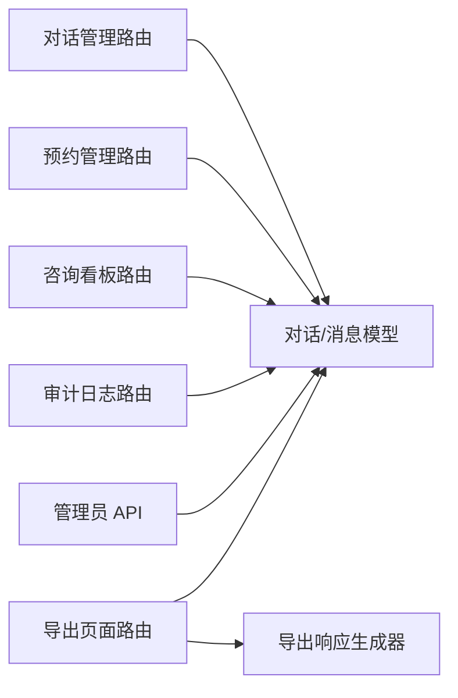

# 对话监控与分析

<cite>
**本文引用的文件**   
- [hushai/meditation/admin/pages/conversations.py](file://hushai/meditation/admin/pages/conversations.py)
- [hushai/meditation/admin/templates/conversations.html](file://hushai/meditation/admin/templates/conversations.html)
- [hushai/meditation/admin/pages/appointments.py](file://hushai/meditation/admin/pages/appointments.py)
- [hushai/meditation/admin/templates/appointments.html](file://hushai/meditation/admin/templates/appointments.html)
- [hushai/meditation/admin/pages/counseling_dashboard.py](file://hushai/meditation/admin/pages/counseling_dashboard.py)
- [hushai/meditation/api/admin.py](file://hushai/meditation/api/admin.py)
- [hushai/meditation/db/models.py](file://hushai/meditation/db/models.py)
- [hushai/meditation/admin/pages/export.py](file://hushai/meditation/admin/pages/export.py)
- [hushai/meditation/admin/export.py](file://hushai/meditation/admin/export.py)
- [hushai/meditation/admin/pages/audit.py](file://hushai/meditation/admin/pages/audit.py)
- [tests/meditation/test_safety.py](file://tests/meditation/test_safety.py)
</cite>

## 目录
1. [简介](#简介)
2. [项目结构](#项目结构)
3. [核心组件](#核心组件)
4. [架构总览](#架构总览)
5. [详细组件分析](#详细组件分析)
6. [依赖关系分析](#依赖关系分析)
7. [性能与可扩展性](#性能与可扩展性)
8. [故障排查指南](#故障排查指南)
9. [结论](#结论)
10. [附录：操作手册（客服与质检）](#附录操作手册客服与质检)

## 简介
本文件面向 hush.ai 管理后台的“对话监控与分析”能力，覆盖以下关键能力与工作流：
- 对话记录查看：列表浏览、详情查看、消息时间线展示、上下文关联。
- 预约咨询管理：预约列表查看、筛选与统计、时间安排与状态跟踪。
- 对话质量评估工具：敏感内容检测、回答质量评分思路、用户满意度分析路径。
- 数据统计与趋势分析：看板指标、导出报表与审计追踪。
- 数据导出与合规检查：CSV/Excel 导出、审计日志导出与访问控制。

本手册旨在为客服与质量监控人员提供端到端工作指引，帮助快速定位问题、提升服务质量并满足合规要求。

## 项目结构
与管理后台对话监控与分析相关的代码主要分布在以下模块：
- 管理页面路由与模板：conversations、appointments、counseling_dashboard、audit
- 管理员 API：admin
- 数据模型：db.models
- 导出功能：admin/pages/export.py 与 admin/export.py
- 安全检测测试用例：tests/meditation/test_safety.py



图表来源
- [hushai/meditation/admin/pages/conversations.py:1-139](file://hushai/meditation/admin/pages/conversations.py#L1-L139)
- [hushai/meditation/admin/pages/appointments.py:1-126](file://hushai/meditation/admin/pages/appointments.py#L1-L126)
- [hushai/meditation/admin/pages/counseling_dashboard.py:1-127](file://hushai/meditation/admin/pages/counseling_dashboard.py#L1-L127)
- [hushai/meditation/admin/pages/audit.py:1-72](file://hushai/meditation/admin/pages/audit.py#L1-L72)
- [hushai/meditation/api/admin.py:1-268](file://hushai/meditation/api/admin.py#L1-L268)
- [hushai/meditation/db/models.py:1-434](file://hushai/meditation/db/models.py#L1-L434)
- [hushai/meditation/admin/pages/export.py:1-207](file://hushai/meditation/admin/pages/export.py#L1-L207)
- [hushai/meditation/admin/export.py:1-207](file://hushai/meditation/admin/export.py#L1-L207)

章节来源
- [hushai/meditation/admin/pages/conversations.py:1-139](file://hushai/meditation/admin/pages/conversations.py#L1-L139)
- [hushai/meditation/admin/pages/appointments.py:1-126](file://hushai/meditation/admin/pages/appointments.py#L1-L126)
- [hushai/meditation/admin/pages/counseling_dashboard.py:1-127](file://hushai/meditation/admin/pages/counseling_dashboard.py#L1-L127)
- [hushai/meditation/admin/pages/audit.py:1-72](file://hushai/meditation/admin/pages/audit.py#L1-L72)
- [hushai/meditation/api/admin.py:1-268](file://hushai/meditation/api/admin.py#L1-L268)
- [hushai/meditation/db/models.py:1-434](file://hushai/meditation/db/models.py#L1-L434)
- [hushai/meditation/admin/pages/export.py:1-207](file://hushai/meditation/admin/pages/export.py#L1-L207)
- [hushai/meditation/admin/export.py:1-207](file://hushai/meditation/admin/export.py#L1-L207)

## 核心组件
- 对话管理
  - 列表页：支持分页、按用户筛选、批量软删除、导出 CSV/Excel。
  - 详情页：加载对话元信息与按时间顺序的消息序列，便于复盘与上下文关联。
- 预约咨询管理
  - 列表页：支持按状态、日期范围筛选，展示统计卡片与分页。
  - 详情页：展示预约、咨询师与用户信息，辅助排班与状态跟踪。
- 咨询数据看板
  - 聚合咨询师、预约、订单与服务记录的统计指标，提供运营概览。
- 管理员 API
  - 提供用户画像、咨询师审核、订单与统计等接口，支撑前端或第三方系统调用。
- 数据导出
  - 对话、审计日志、用户、记忆、知识库等多维度导出，统一通过导出响应生成器输出 CSV/Excel。
- 审计日志
  - 支持按操作类型与管理员账号筛选，便于合规追溯。

章节来源
- [hushai/meditation/admin/pages/conversations.py:1-139](file://hushai/meditation/admin/pages/conversations.py#L1-L139)
- [hushai/meditation/admin/templates/conversations.html:1-208](file://hushai/meditation/admin/templates/conversations.html#L1-L208)
- [hushai/meditation/admin/pages/appointments.py:1-126](file://hushai/meditation/admin/pages/appointments.py#L1-L126)
- [hushai/meditation/admin/templates/appointments.html:1-74](file://hushai/meditation/admin/templates/appointments.html#L1-L74)
- [hushai/meditation/admin/pages/counseling_dashboard.py:1-127](file://hushai/meditation/admin/pages/counseling_dashboard.py#L1-L127)
- [hushai/meditation/api/admin.py:1-268](file://hushai/meditation/api/admin.py#L1-L268)
- [hushai/meditation/admin/pages/export.py:1-207](file://hushai/meditation/admin/pages/export.py#L1-L207)
- [hushai/meditation/admin/export.py:1-207](file://hushai/meditation/admin/export.py#L1-L207)
- [hushai/meditation/admin/pages/audit.py:1-72](file://hushai/meditation/admin/pages/audit.py#L1-L72)

## 架构总览
管理后台采用 FastAPI + SQLAlchemy 异步会话模式，页面渲染使用 Jinja2 模板，数据持久化在关系型数据库。导出功能通过统一的响应生成器封装 CSV/Excel 输出。



图表来源
- [hushai/meditation/admin/pages/conversations.py:22-114](file://hushai/meditation/admin/pages/conversations.py#L22-L114)
- [hushai/meditation/admin/pages/export.py:17-51](file://hushai/meditation/admin/pages/export.py#L17-L51)
- [hushai/meditation/admin/export.py:1-207](file://hushai/meditation/admin/export.py#L1-L207)
- [hushai/meditation/db/models.py:69-96](file://hushai/meditation/db/models.py#L69-L96)

## 详细组件分析

### 对话记录查看
- 列表页
  - 支持分页、按用户筛选、批量软删除（标记 is_active=False）、导出 CSV/Excel。
  - 交互包括全选、批量删除按钮动态显示、确认弹窗与成功提示。
- 详情页
  - 加载对话元信息（标题、创建/更新时间、是否活跃）与用户昵称。
  - 按消息创建时间升序展示消息序列，形成清晰的时间线与上下文关联。



图表来源
- [hushai/meditation/admin/pages/conversations.py:22-70](file://hushai/meditation/admin/pages/conversations.py#L22-L70)
- [hushai/meditation/admin/pages/conversations.py:73-114](file://hushai/meditation/admin/pages/conversations.py#L73-L114)
- [hushai/meditation/admin/templates/conversations.html:1-208](file://hushai/meditation/admin/templates/conversations.html#L1-L208)

章节来源
- [hushai/meditation/admin/pages/conversations.py:22-114](file://hushai/meditation/admin/pages/conversations.py#L22-L114)
- [hushai/meditation/admin/templates/conversations.html:1-208](file://hushai/meditation/admin/templates/conversations.html#L1-L208)

### 预约咨询管理
- 列表页
  - 支持按状态（待确认/已确认/已完成/已取消/已拒绝）与日期范围筛选。
  - 顶部统计卡片展示总数、各状态数量，便于快速掌握业务态势。
- 详情页
  - 展示预约、咨询师与用户信息，辅助排班管理与状态跟踪。

```mermaid
classDiagram
class Counselor {
+string id
+string real_name
+float hourly_rate
+bool is_online
+int total_sessions
+string status
}
class Appointment {
+string id
+date appointment_date
+time start_time
+time end_time
+string status
+string cancel_reason
+string client_notes
}
class User {
+string id
+string nickname
+datetime created_at
}
Counselor ||--o{ Appointment : "拥有"
User ||--o{ Appointment : "参与"
```

图表来源
- [hushai/meditation/db/models.py:273-353](file://hushai/meditation/db/models.py#L273-L353)

章节来源
- [hushai/meditation/admin/pages/appointments.py:19-91](file://hushai/meditation/admin/pages/appointments.py#L19-L91)
- [hushai/meditation/admin/templates/appointments.html:1-74](file://hushai/meditation/admin/templates/appointments.html#L1-L74)
- [hushai/meditation/db/models.py:273-353](file://hushai/meditation/db/models.py#L273-L353)

### 对话质量评估工具
- 敏感内容检测
  - 基于关键词正则规则进行危机信号检测，包含自伤/自杀类（crisis）与伤害他人（emergency）两类级别。
  - 已知局限：空格分隔与拼音可绕过；后续可引入 LLM 二次分类增强鲁棒性。
- 回答质量评分（建议方案）
  - 可在对话详情中增加“质量评分”字段，结合规则与人工复核打分，用于趋势分析与培训改进。
- 用户满意度分析（建议方案）
  - 在服务记录或订单完成后收集满意度反馈，结合服务时长与复购率进行分析。



图表来源
- [tests/meditation/test_safety.py:20-82](file://tests/meditation/test_safety.py#L20-L82)
- [tests/meditation/test_safety.py:84-102](file://tests/meditation/test_safety.py#L84-L102)
- [tests/meditation/test_safety.py:104-119](file://tests/meditation/test_safety.py#L104-L119)

章节来源
- [tests/meditation/test_safety.py:1-140](file://tests/meditation/test_safety.py#L1-L140)

### 数据统计与趋势分析
- 咨询看板
  - 聚合咨询师（总数/在线/待审）、预约（总数/各状态）、订单（总数/收入/今日订单）、服务记录（总数/总时长）等指标。
- 导出报表
  - 支持对话、审计日志、用户、记忆、知识库导出，便于离线分析与可视化。



图表来源
- [hushai/meditation/admin/pages/counseling_dashboard.py:24-126](file://hushai/meditation/admin/pages/counseling_dashboard.py#L24-L126)

章节来源
- [hushai/meditation/admin/pages/counseling_dashboard.py:24-126](file://hushai/meditation/admin/pages/counseling_dashboard.py#L24-L126)
- [hushai/meditation/admin/pages/export.py:17-207](file://hushai/meditation/admin/pages/export.py#L17-L207)

### 数据导出与合规检查
- 导出
  - 对话导出：包含用户昵称、ID、标题、时间、状态等字段。
  - 审计日志导出：包含时间、管理员、操作、资源类型/ID、详情、IP 等。
  - 用户导出：包含昵称、ID、OpenID、注册时间、状态。
  - 记忆导出：包含用户、分类、内容、摘要、重要度、状态、时间。
  - 知识库导出：包含标题、内容、标签、来源、时间。
- 合规检查
  - 审计日志页面支持按操作类型与管理员账号筛选，便于合规审查与溯源。



图表来源
- [hushai/meditation/admin/pages/export.py:17-51](file://hushai/meditation/admin/pages/export.py#L17-L51)
- [hushai/meditation/admin/export.py:1-207](file://hushai/meditation/admin/export.py#L1-L207)

章节来源
- [hushai/meditation/admin/pages/export.py:17-207](file://hushai/meditation/admin/pages/export.py#L17-L207)
- [hushai/meditation/admin/pages/audit.py:16-71](file://hushai/meditation/admin/pages/audit.py#L16-L71)

## 依赖关系分析
- 页面路由依赖认证与模板渲染，数据访问通过 SQLAlchemy 异步会话。
- 管理员 API 通过 Bearer Token 鉴权，提供用户画像、咨询师审核、订单与统计等能力。
- 导出功能复用统一响应生成器，确保格式一致性与可维护性。



图表来源
- [hushai/meditation/admin/pages/conversations.py:1-139](file://hushai/meditation/admin/pages/conversations.py#L1-L139)
- [hushai/meditation/admin/pages/appointments.py:1-126](file://hushai/meditation/admin/pages/appointments.py#L1-L126)
- [hushai/meditation/admin/pages/counseling_dashboard.py:1-127](file://hushai/meditation/admin/pages/counseling_dashboard.py#L1-L127)
- [hushai/meditation/admin/pages/audit.py:1-72](file://hushai/meditation/admin/pages/audit.py#L1-L72)
- [hushai/meditation/api/admin.py:1-268](file://hushai/meditation/api/admin.py#L1-L268)
- [hushai/meditation/db/models.py:1-434](file://hushai/meditation/db/models.py#L1-L434)
- [hushai/meditation/admin/pages/export.py:1-207](file://hushai/meditation/admin/pages/export.py#L1-L207)
- [hushai/meditation/admin/export.py:1-207](file://hushai/meditation/admin/export.py#L1-L207)

章节来源
- [hushai/meditation/api/admin.py:26-35](file://hushai/meditation/api/admin.py#L26-L35)
- [hushai/meditation/db/models.py:1-434](file://hushai/meditation/db/models.py#L1-L434)

## 性能与可扩展性
- 分页与索引
  - 列表页普遍采用分页与 DESC 排序，建议在常用筛选字段上建立索引以提升查询性能。
- 导出优化
  - 大数据量导出建议使用流式写入与分批查询，避免一次性加载过多数据导致内存压力。
- 安全检测扩展
  - 当前基于正则的规则具备高性能优势，但存在绕过风险；可考虑引入轻量级 NLP 或 LLM 二次分类作为补充。

[本节为通用指导，不直接分析具体文件]

## 故障排查指南
- 登录与权限
  - 若页面跳转至登录或返回未授权错误，请检查管理员会话与请求头是否正确。
- 数据缺失
  - 对话详情无法加载时，核对对话 ID 是否存在以及消息是否按 conversation_id 正确关联。
- 导出失败
  - 检查导出参数（format、user_id、search 等）是否合法，确认数据库连接与权限。
- 安全检测误判
  - 注意空格与拼音绕过的已知局限；必要时调整规则或引入更鲁棒的检测策略。

章节来源
- [hushai/meditation/admin/pages/conversations.py:73-92](file://hushai/meditation/admin/pages/conversations.py#L73-L92)
- [hushai/meditation/admin/pages/appointments.py:94-108](file://hushai/meditation/admin/pages/appointments.py#L94-L108)
- [tests/meditation/test_safety.py:104-119](file://tests/meditation/test_safety.py#L104-L119)

## 结论
本系统为客服与质量监控提供了完整的对话监控、预约管理、数据分析与导出能力。通过清晰的页面流程、可靠的 API 与审计机制，可有效支撑日常运营与合规需求。未来可在质量评分与满意度分析方面进一步扩展，以形成闭环的质量管理体系。

[本节为总结，不直接分析具体文件]

## 附录：操作手册（客服与质检）
- 对话记录查看
  - 进入“对话记录”，可按用户筛选，查看列表与分页。
  - 点击“查看详情”，浏览消息时间线，定位问题上下文。
  - 如需清理无效对话，勾选后执行“批量删除”（软删除）。
- 预约咨询管理
  - 进入“预约管理”，使用状态与日期筛选快速定位目标预约。
  - 点击“详情”，查看预约、咨询师与用户信息，跟踪状态变化。
- 数据导出
  - 在“对话记录”页面点击“CSV/Excel”导出，或在“导出”菜单选择对应数据源。
  - 审计日志导出可用于合规审查与问题溯源。
- 质量评估与改进
  - 结合敏感内容检测结果，识别高风险对话并进行人工复核。
  - 建议引入质量评分与满意度反馈，定期汇总分析，驱动培训与流程优化。

章节来源
- [hushai/meditation/admin/pages/conversations.py:22-114](file://hushai/meditation/admin/pages/conversations.py#L22-L114)
- [hushai/meditation/admin/templates/conversations.html:1-208](file://hushai/meditation/admin/templates/conversations.html#L1-L208)
- [hushai/meditation/admin/pages/appointments.py:19-91](file://hushai/meditation/admin/pages/appointments.py#L19-L91)
- [hushai/meditation/admin/templates/appointments.html:1-74](file://hushai/meditation/admin/templates/appointments.html#L1-L74)
- [hushai/meditation/admin/pages/export.py:17-207](file://hushai/meditation/admin/pages/export.py#L17-L207)
- [hushai/meditation/admin/pages/audit.py:16-71](file://hushai/meditation/admin/pages/audit.py#L16-L71)