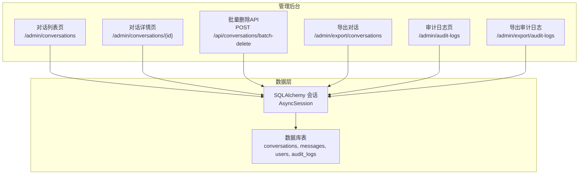
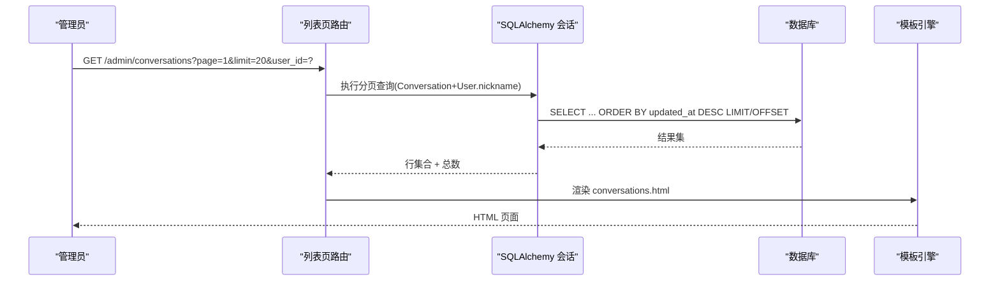
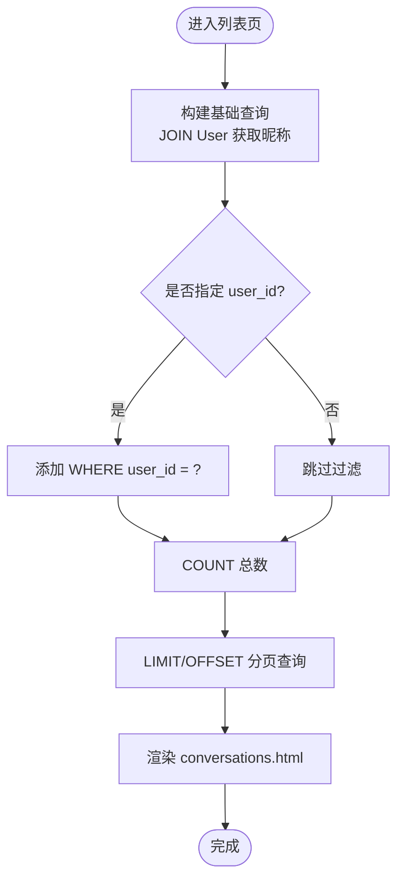
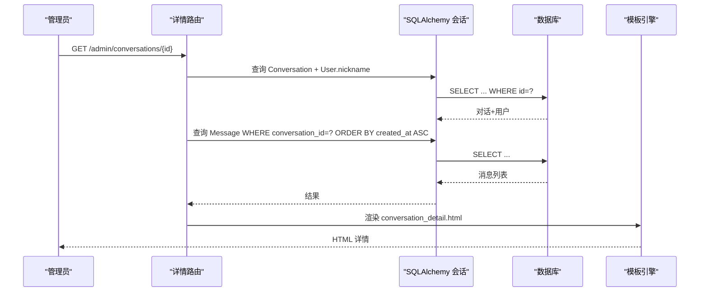
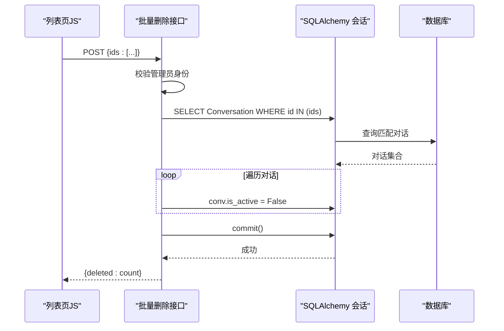
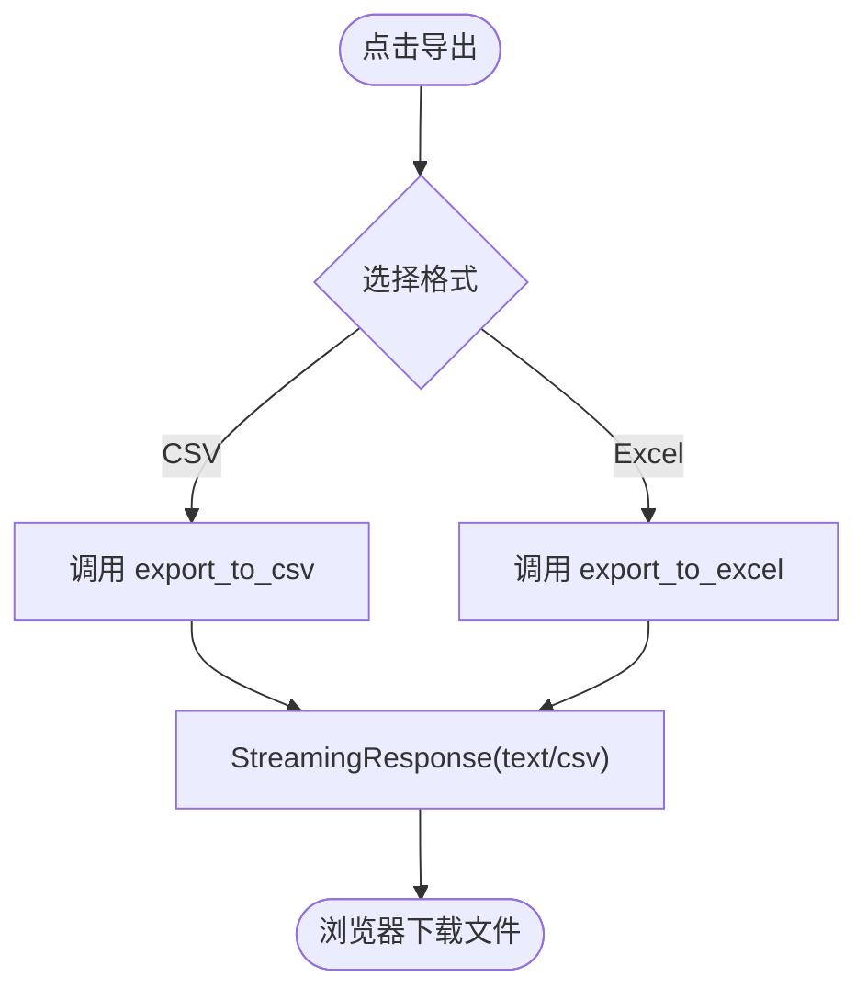
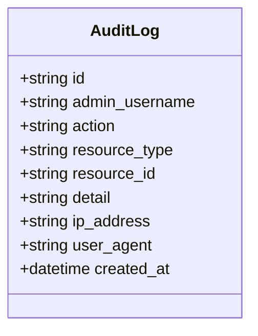
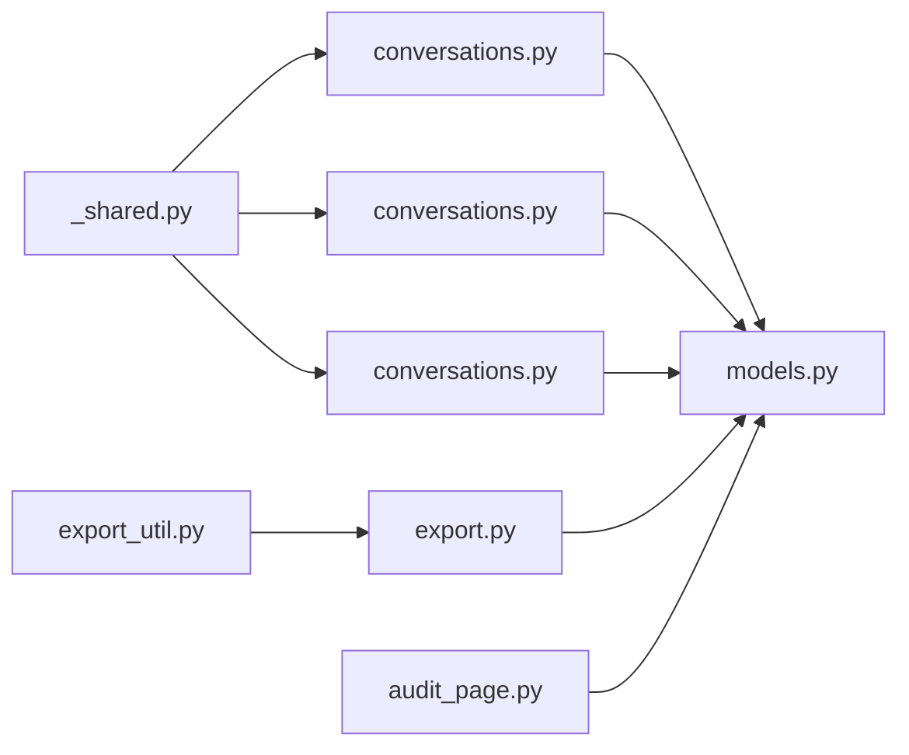

# 对话记录查看

<cite>
**本文引用的文件**   
- [conversations.py](file://hushai/meditation/admin/pages/conversations.py)
- [conversations.html](file://hushai/meditation/admin/templates/conversations.html)
- [conversation_detail.html](file://hushai/meditation/admin/templates/conversation_detail.html)
- [models.py](file://hushai/meditation/db/models.py)
- [export.py](file://hushai/meditation/admin/pages/export.py)
- [export_util.py](file://hushai/meditation/admin/export.py)
- [_shared.py](file://hushai/meditation/admin/pages/_shared.py)
- [audit.py](file://hushai/meditation/admin/audit.py)
- [audit_page.py](file://hushai/meditation/admin/pages/audit.py)
</cite>

## 目录
1. [简介](#简介)
2. [项目结构](#项目结构)
3. [核心组件](#核心组件)
4. [架构总览](#架构总览)
5. [详细组件分析](#详细组件分析)
6. [依赖关系分析](#依赖关系分析)
7. [性能考虑](#性能考虑)
8. [故障排查指南](#故障排查指南)
9. [结论](#结论)
10. [附录：操作手册与合规检查](#附录操作手册与合规检查)

## 简介
本文件面向客服与质量监控人员，系统化说明 hush.ai 管理后台“对话记录查看”功能的使用方法与实现要点。内容覆盖：
- 对话列表页：分页、用户筛选、导出入口、批量删除
- 对话详情页：消息时间线、上下文关联、用户信息跳转
- 批量删除：软删除机制与数据恢复策略
- 数据导出：CSV/Excel 格式与字段说明
- 合规性检查：审计日志导出与可追溯性
- 常见问题与性能优化建议

## 项目结构
与对话记录查看相关的后端路由、模板与数据模型分布如下：
- 路由与页面逻辑：admin/pages/conversations.py、admin/pages/export.py、admin/pages/audit.py
- 前端模板：admin/templates/conversations.html、admin/templates/conversation_detail.html
- 数据模型：db/models.py（Conversation、Message、User、AuditLog）
- 通用工具：admin/pages/_shared.py（模板、鉴权、请求体）、admin/export.py（导出工具）

图表来源
- [conversations.py:22-70](file://hushai/meditation/admin/pages/conversations.py#L22-L70)
- [conversations.py:73-114](file://hushai/meditation/admin/pages/conversations.py#L73-L114)
- [conversations.py:117-139](file://hushai/meditation/admin/pages/conversations.py#L117-L139)
- [export.py:17-51](file://hushai/meditation/admin/pages/export.py#L17-L51)
- [audit_page.py:16-71](file://hushai/meditation/admin/pages/audit.py#L16-L71)
- [models.py:69-96](file://hushai/meditation/db/models.py#L69-L96)
- [models.py:188-202](file://hushai/meditation/db/models.py#L188-L202)

章节来源
- [conversations.py:22-139](file://hushai/meditation/admin/pages/conversations.py#L22-L139)
- [export.py:17-207](file://hushai/meditation/admin/pages/export.py#L17-L207)
- [audit_page.py:16-72](file://hushai/meditation/admin/pages/audit.py#L16-L72)
- [models.py:69-96](file://hushai/meditation/db/models.py#L69-L96)
- [models.py:188-202](file://hushai/meditation/db/models.py#L188-L202)

## 核心组件
- 对话列表页路由：支持分页、按用户筛选、渲染模板并返回统计信息
- 对话详情页路由：加载对话元信息与消息时间线，附带用户昵称与ID
- 批量删除接口：接收 ids 列表，将对应对话标记为 is_active=False（软删除）
- 导出模块：提供 CSV/Excel 流式响应，包含对话、审计日志、用户、记忆、知识等导出能力
- 审计日志：记录管理员操作，支持分页与导出，便于合规审查

章节来源
- [conversations.py:22-70](file://hushai/meditation/admin/pages/conversations.py#L22-L70)
- [conversations.py:73-114](file://hushai/meditation/admin/pages/conversations.py#L73-L114)
- [conversations.py:117-139](file://hushai/meditation/admin/pages/conversations.py#L117-L139)
- [export.py:17-51](file://hushai/meditation/admin/pages/export.py#L17-L51)
- [export_util.py:12-106](file://hushai/meditation/admin/export.py#L12-L106)
- [audit_page.py:16-71](file://hushai/meditation/admin/pages/audit.py#L16-L71)

## 架构总览
从浏览器到数据库的端到端流程如下：
- 列表页：GET /admin/conversations → 构建查询（含可选 user_id 过滤）→ 分页 → 渲染 conversations.html
- 详情页：GET /admin/conversations/{id} → 获取对话与用户信息 → 拉取消息并按时间排序 → 渲染 conversation_detail.html
- 批量删除：POST /api/conversations/batch-delete → 校验 ids → 遍历设置 is_active=False → 提交事务
- 导出：GET /admin/export/conversations → 组装字典列表 → 调用 get_export_response 生成 CSV/Excel 流

图表来源
- [conversations.py:22-70](file://hushai/meditation/admin/pages/conversations.py#L22-L70)
- [conversations.html:1-208](file://hushai/meditation/admin/templates/conversations.html#L1-L208)

章节来源
- [conversations.py:22-70](file://hushai/meditation/admin/pages/conversations.py#L22-L70)
- [conversations.html:1-208](file://hushai/meditation/admin/templates/conversations.html#L1-L208)

## 详细组件分析

### 对话列表页
- 功能要点
  - 分页：page、limit 参数；计算 offset 与 total_pages
  - 用户筛选：user_id 可选；同时影响计数与列表查询
  - 导出入口：CSV/Excel 按钮，自动携带当前 user_id 筛选条件
  - 批量删除：勾选多条后点击“批量删除”，调用 POST /api/conversations/batch-delete
  - 单条删除：每行有删除按钮，内部同样走批量删除接口（ids=[id]）
- 交互细节
  - 全选复选框控制所有行选择状态
  - 选中数量变化时显示/隐藏批量删除按钮
  - 删除前弹出确认对话框，成功后刷新页面
- 数据来源
  - 列表项包含对话实体与用户昵称，用于展示与链接跳转
  - 用户下拉来自最近创建的 100 个用户（用于筛选）

图表来源
- [conversations.py:35-51](file://hushai/meditation/admin/pages/conversations.py#L35-L51)
- [conversations.html:14-48](file://hushai/meditation/admin/templates/conversations.html#L14-L48)

章节来源
- [conversations.py:22-70](file://hushai/meditation/admin/pages/conversations.py#L22-L70)
- [conversations.html:1-208](file://hushai/meditation/admin/templates/conversations.html#L1-L208)

### 对话详情页
- 功能要点
  - 顶部展示标题、创建时间、状态、用户昵称，并提供“查看用户”快捷入口
  - 消息时间线按 created_at 升序排列，区分用户与 AI 角色
  - 每条消息显示时间与正文，支持展开查看消息元数据（metadata_）
- 数据来源
  - 通过 Conversation.id 获取对话与用户信息
  - 通过 Message.conversation_id 获取该对话全部消息

图表来源
- [conversations.py:73-114](file://hushai/meditation/admin/pages/conversations.py#L73-L114)
- [conversation_detail.html:1-202](file://hushai/meditation/admin/templates/conversation_detail.html#L1-L202)

章节来源
- [conversations.py:73-114](file://hushai/meditation/admin/pages/conversations.py#L73-L114)
- [conversation_detail.html:1-202](file://hushai/meditation/admin/templates/conversation_detail.html#L1-L202)

### 批量删除（软删除）
- 接口定义
  - 路径：POST /api/conversations/batch-delete
  - 请求体：{ ids: ["conv_id1", "conv_id2", ...] }
- 处理逻辑
  - 校验管理员登录
  - 若 ids 为空直接返回 deleted=0
  - 根据 ids 批量查询对话，逐个设置 is_active=False
  - 提交事务并返回已删除数量
- 前端行为
  - 列表页支持多选后触发批量删除
  - 单条删除也复用同一接口（ids=[id]）

图表来源
- [conversations.py:117-139](file://hushai/meditation/admin/pages/conversations.py#L117-L139)
- [conversations.html:177-205](file://hushai/meditation/admin/templates/conversations.html#L177-L205)

章节来源
- [conversations.py:117-139](file://hushai/meditation/admin/pages/conversations.py#L117-L139)
- [conversations.html:177-205](file://hushai/meditation/admin/templates/conversations.html#L177-L205)

### 数据导出（CSV/Excel）
- 导出入口
  - 列表页提供“CSV”和“Excel”按钮，自动带上当前 user_id 筛选
  - 路由：GET /admin/export/conversations?format=csv|xlsx&user_id=?
- 导出字段（对话）
  - 用户昵称、用户ID、对话标题、对话ID、创建时间、更新时间、状态
- 其他导出
  - 审计日志：/admin/export/audit-logs（支持 action、admin_username 过滤）
  - 用户：/admin/export/users（支持搜索昵称或 OpenID）
  - 记忆：/admin/export/memories（支持 user_id、category 过滤）
  - 知识：/admin/export/knowledge（支持标题/内容模糊搜索）
- 实现方式
  - 使用 StreamingResponse 流式返回，避免内存峰值
  - Excel 列宽统一设置为 30，日期序列化为字符串

图表来源
- [export.py:17-51](file://hushai/meditation/admin/pages/export.py#L17-L51)
- [export_util.py:12-106](file://hushai/meditation/admin/export.py#L12-L106)

章节来源
- [export.py:17-51](file://hushai/meditation/admin/pages/export.py#L17-L51)
- [export_util.py:12-106](file://hushai/meditation/admin/export.py#L12-L106)

### 审计日志与合规性检查
- 审计记录
  - 管理员操作会写入 AuditLog（用户名、动作、资源类型、资源ID、详情、IP、UA、时间）
  - 提供审计日志页面：/admin/audit-logs（支持分页、按动作/管理员筛选）
  - 提供审计日志导出：/admin/export/audit-logs（支持 action、admin_username 过滤）
- 合规用途
  - 追踪敏感操作（如批量删除）
  - 导出审计日志进行离线审查与归档

图表来源
- [models.py:188-202](file://hushai/meditation/db/models.py#L188-L202)
- [audit_page.py:16-71](file://hushai/meditation/admin/pages/audit.py#L16-L71)
- [export.py:54-92](file://hushai/meditation/admin/pages/export.py#L54-L92)

章节来源
- [audit_page.py:16-71](file://hushai/meditation/admin/pages/audit.py#L16-L71)
- [export.py:54-92](file://hushai/meditation/admin/pages/export.py#L54-L92)
- [models.py:188-202](file://hushai/meditation/db/models.py#L188-L202)

## 依赖关系分析
- 路由与模板
  - 列表页与详情页路由依赖 SQLAlchemy 异步会话与模板引擎
  - 模板中引用公共样式与图标库（由 base.html 引入）
- 数据模型
  - Conversation 与 User 一对多；Message 与 Conversation 多对一
  - AuditLog 独立记录管理员操作
- 工具与共享
  - _shared.py 提供模板实例、登录重定向、批量删除请求体定义
  - export.py 提供统一的导出响应封装

图表来源
- [conversations.py:1-139](file://hushai/meditation/admin/pages/conversations.py#L1-L139)
- [export.py:1-207](file://hushai/meditation/admin/pages/export.py#L1-L207)
- [export_util.py:1-106](file://hushai/meditation/admin/export.py#L1-L106)
- [audit_page.py:1-72](file://hushai/meditation/admin/pages/audit.py#L1-L72)
- [_shared.py:1-110](file://hushai/meditation/admin/pages/_shared.py#L1-L110)
- [models.py:69-96](file://hushai/meditation/db/models.py#L69-L96)

章节来源
- [conversations.py:1-139](file://hushai/meditation/admin/pages/conversations.py#L1-L139)
- [export.py:1-207](file://hushai/meditation/admin/pages/export.py#L1-L207)
- [export_util.py:1-106](file://hushai/meditation/admin/export.py#L1-L106)
- [audit_page.py:1-72](file://hushai/meditation/admin/pages/audit.py#L1-L72)
- [_shared.py:1-110](file://hushai/meditation/admin/pages/_shared.py#L1-L110)
- [models.py:69-96](file://hushai/meditation/db/models.py#L69-L96)

## 性能考虑
- 分页与索引
  - 列表与审计日志均使用 LIMIT/OFFSET 分页，建议在 updated_at、created_at、user_id 等常用过滤字段建立索引以提升查询效率
- 大结果集导出
  - 导出采用流式响应，避免一次性加载大量数据到内存
  - 对于超大数据量，建议增加服务端限流与异步任务队列，避免阻塞主线程
- 前端交互
  - 批量删除在客户端维护选中 IDs，减少不必要的网络往返
  - 列表页仅加载最近 100 个用户用于筛选，降低用户表查询开销

[本节为通用性能建议，不直接分析具体代码文件]

## 故障排查指南
- 未登录访问被重定向
  - 现象：访问 /admin/* 跳转到登录页
  - 原因：缺少有效管理员会话
  - 解决：先登录管理后台再访问相关页面
- 批量删除无效果
  - 现象：点击批量删除后提示成功但列表未更新
  - 可能原因：前端未刷新或后端未提交事务
  - 排查：检查浏览器控制台错误；确认后端返回 deleted 数量；必要时手动刷新页面
- 导出文件为空
  - 现象：CSV/Excel 文件无数据
  - 可能原因：筛选条件过严导致结果为空
  - 解决：放宽筛选条件或取消筛选后重试
- 审计日志缺失
  - 现象：关键操作未在审计日志中体现
  - 可能原因：未调用审计记录函数或权限不足
  - 解决：确认操作是否经过受控接口；检查管理员权限与日志写入逻辑

章节来源
- [conversations.py:117-139](file://hushai/meditation/admin/pages/conversations.py#L117-L139)
- [export.py:17-51](file://hushai/meditation/admin/pages/export.py#L17-L51)
- [audit_page.py:16-71](file://hushai/meditation/admin/pages/audit.py#L16-L71)

## 结论
对话记录查看功能提供了完整的列表浏览、详情查看、批量管理与数据导出能力，并通过审计日志保障操作的合规性与可追溯性。结合分页、筛选与流式导出，系统在保证用户体验的同时兼顾了性能与安全性。

[本节为总结性内容，不直接分析具体代码文件]

## 附录：操作手册与合规检查

### 使用手册（客服与质检）
- 查看对话列表
  - 进入“对话记录”页面，默认显示最新 20 条
  - 使用“用户筛选”下拉框限定特定用户
  - 使用分页控件切换页码
- 查看对话详情
  - 点击某条对话标题或“查看详情”按钮
  - 在详情页查看消息时间线与元数据
  - 点击“查看用户”快速跳转到用户信息页
- 批量删除
  - 勾选需要删除的多条对话
  - 点击“批量删除”按钮，确认后执行软删除
  - 注意：软删除不会物理移除数据，仅标记 is_active=False
- 导出数据
  - 在列表页点击“CSV”或“Excel”按钮
  - 如需仅导出某用户数据，请先选择用户筛选再导出
  - 导出文件名包含时间戳，便于归档
- 合规性检查
  - 进入“审计日志”页面，可按动作或管理员筛选
  - 使用“导出审计日志”按钮导出 CSV/Excel 进行离线审查
  - 重点关注“批量删除”等敏感操作的记录

章节来源
- [conversations.html:14-48](file://hushai/meditation/admin/templates/conversations.html#L14-L48)
- [conversation_detail.html:1-80](file://hushai/meditation/admin/templates/conversation_detail.html#L1-L80)
- [conversations.html:177-205](file://hushai/meditation/admin/templates/conversations.html#L177-L205)
- [export.py:17-51](file://hushai/meditation/admin/pages/export.py#L17-L51)
- [audit_page.py:16-71](file://hushai/meditation/admin/pages/audit.py#L16-L71)
- [export.py:54-92](file://hushai/meditation/admin/pages/export.py#L54-L92)

### 数据恢复策略（软删除）
- 现状
  - 批量删除将 is_active 设为 False，不物理删除记录
- 恢复方法
  - 通过数据库或后台脚本将目标对话的 is_active 重新置为 True
  - 建议在恢复前核对审计日志，确保操作可追溯
- 注意事项
  - 恢复后需确认关联消息与上下文完整性
  - 建议对恢复操作进行审计记录

章节来源
- [conversations.py:117-139](file://hushai/meditation/admin/pages/conversations.py#L117-L139)
- [models.py:69-83](file://hushai/meditation/db/models.py#L69-L83)
- [audit.py:10-31](file://hushai/meditation/admin/audit.py#L10-L31)