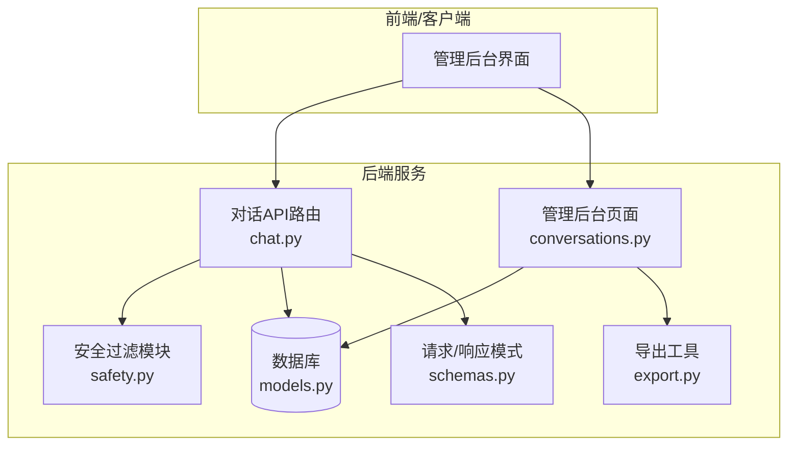
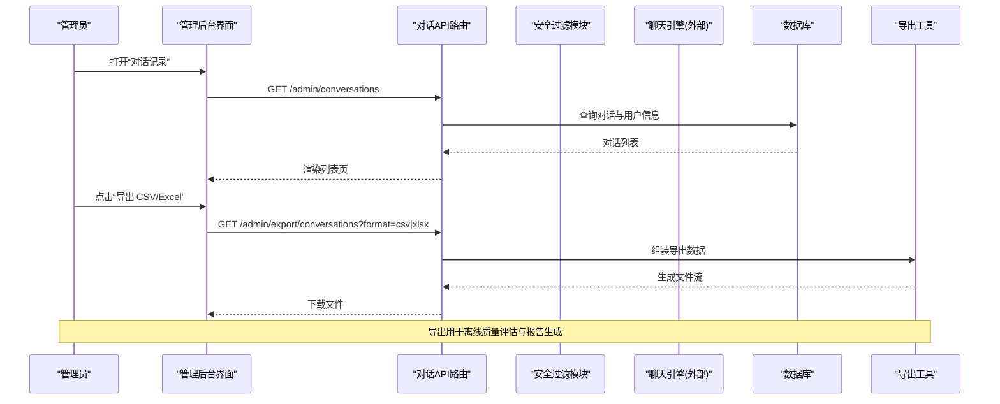
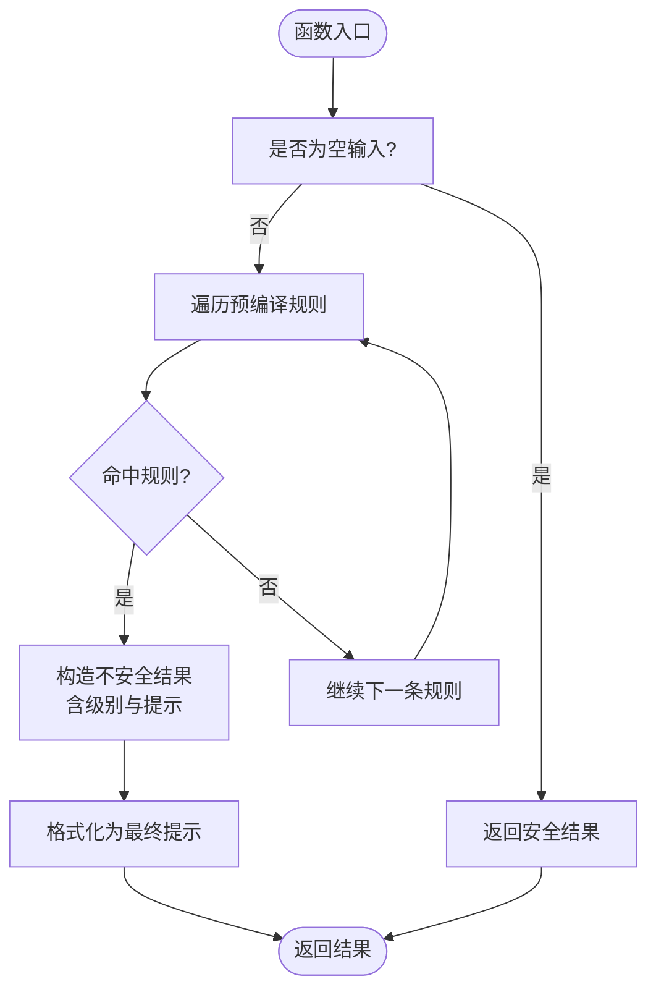
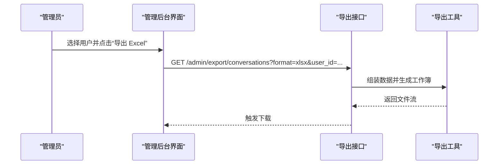
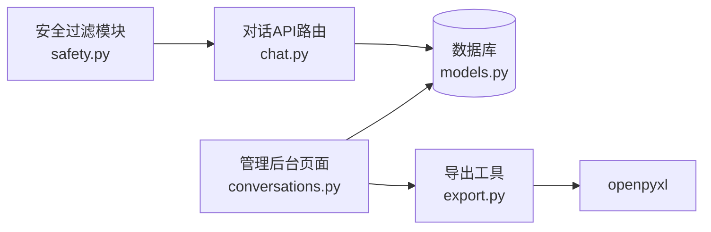

# 对话质量评估

<cite>
**本文引用的文件**   
- [hushai/meditation/core/safety.py](file://hushai/meditation/core/safety.py)
- [tests/meditation/test_safety.py](file://tests/meditation/test_safety.py)
- [hushai/meditation/api/chat.py](file://hushai/meditation/api/chat.py)
- [hushai/meditation/admin/pages/conversations.py](file://hushai/meditation/admin/pages/conversations.py)
- [hushai/meditation/admin/export.py](file://hushai/meditation/admin/export.py)
- [hushai/meditation/db/models.py](file://hushai/meditation/db/models.py)
- [hushai/meditation/schemas.py](file://hushai/meditation/schemas.py)
</cite>

## 目录
1. [简介](#简介)
2. [项目结构](#项目结构)
3. [核心组件](#核心组件)
4. [架构总览](#架构总览)
5. [详细组件分析](#详细组件分析)
6. [依赖关系分析](#依赖关系分析)
7. [性能与可扩展性](#性能与可扩展性)
8. [故障排查指南](#故障排查指南)
9. [结论](#结论)
10. [附录：质量控制工作流程与阈值告警建议](#附录：质量控制工作流程与阈值告警建议)

## 简介
本文件面向 hush.ai 管理后台的“对话质量评估”能力，聚焦以下目标：
- 敏感内容检测机制：违规内容识别、关键词过滤与安全评分思路
- 回答质量评估工具：内容完整性、准确性、相关性评分方法
- 用户满意度分析：反馈收集、情绪分析与满意度统计
- 报告生成与导出：CSV/Excel 导出流程与使用方式
- 质量阈值设置与告警配置：可操作的建议与落地路径
- 标准化评估工作流程：为质量控制团队提供端到端流程指引

说明：当前仓库已实现“安全过滤模块（关键词正则）”和“管理后台对话记录查看与导出”。回答质量评估与用户满意度相关功能在仓库中未找到直接实现，本节将基于现有代码给出可落地的扩展方案与最佳实践。

## 项目结构
围绕“对话质量评估”，与代码映射最紧密的文件包括：
- 安全过滤与提示格式化：hushai/meditation/core/safety.py
- 对话 API 路由（鉴权、限流、调用引擎）：hushai/meditation/api/chat.py
- 管理后台对话列表与详情：hushai/meditation/admin/pages/conversations.py
- 数据导出（CSV/Excel）：hushai/meditation/admin/export.py
- 数据库模型（Conversation、Message、User 等）：hushai/meditation/db/models.py
- 请求/响应模式定义：hushai/meditation/schemas.py
- 安全模块单元测试：tests/meditation/test_safety.py

图表来源
- [hushai/meditation/api/chat.py:1-245](file://hushai/meditation/api/chat.py#L1-L245)
- [hushai/meditation/core/safety.py:1-111](file://hushai/meditation/core/safety.py#L1-L111)
- [hushai/meditation/admin/pages/conversations.py:1-139](file://hushai/meditation/admin/pages/conversations.py#L1-L139)
- [hushai/meditation/admin/export.py:1-106](file://hushai/meditation/admin/export.py#L1-L106)
- [hushai/meditation/db/models.py](file://hushai/meditation/db/models.py)
- [hushai/meditation/schemas.py](file://hushai/meditation/schemas.py)

章节来源
- [hushai/meditation/api/chat.py:1-245](file://hushai/meditation/api/chat.py#L1-L245)
- [hushai/meditation/core/safety.py:1-111](file://hushai/meditation/core/safety.py#L1-L111)
- [hushai/meditation/admin/pages/conversations.py:1-139](file://hushai/meditation/admin/pages/conversations.py#L1-L139)
- [hushai/meditation/admin/export.py:1-106](file://hushai/meditation/admin/export.py#L1-L106)
- [hushai/meditation/db/models.py](file://hushai/meditation/db/models.py)
- [hushai/meditation/schemas.py](file://hushai/meditation/schemas.py)

## 核心组件
- 安全过滤模块（关键词正则）
  - 负责输入文本的危机信号检测，返回结构化结果与安全提示文案拼接逻辑
  - 支持两级风险：crisis（自伤/自杀倾向）、emergency（伤害他人/报复社会）
- 对话 API 路由
  - 负责鉴权、限流、调用聊天引擎并持久化对话与消息
- 管理后台对话管理
  - 提供对话列表、详情查看、批量软删除
- 数据导出
  - 提供 CSV/Excel 导出能力，便于离线分析与报告生成

章节来源
- [hushai/meditation/core/safety.py:1-111](file://hushai/meditation/core/safety.py#L1-L111)
- [hushai/meditation/api/chat.py:1-245](file://hushai/meditation/api/chat.py#L1-L245)
- [hushai/meditation/admin/pages/conversations.py:1-139](file://hushai/meditation/admin/pages/conversations.py#L1-L139)
- [hushai/meditation/admin/export.py:1-106](file://hushai/meditation/admin/export.py#L1-L106)

## 架构总览
下图展示从“用户输入到安全检测、对话处理与管理后台导出”的关键链路。

图表来源
- [hushai/meditation/admin/pages/conversations.py:22-70](file://hushai/meditation/admin/pages/conversations.py#L22-L70)
- [hushai/meditation/admin/export.py:92-106](file://hushai/meditation/admin/export.py#L92-L106)

章节来源
- [hushai/meditation/admin/pages/conversations.py:22-70](file://hushai/meditation/admin/pages/conversations.py#L22-L70)
- [hushai/meditation/admin/export.py:92-106](file://hushai/meditation/admin/export.py#L92-L106)

## 详细组件分析

### 敏感内容检测机制（关键词过滤与安全评分思路）
- 规则组织
  - 采用预编译的正则规则集合，每条规则绑定风险级别（crisis/emergency），命中即按级别返回
  - 规则顺序体现优先级：更具体的“伤害他人”优先于“自伤/自杀”
- 输出结构
  - 返回统一的数据类对象，包含是否安全、级别、提示信息与建议信息
- 提示格式化
  - 若检测到风险，则在原始回复后追加“温馨提示”与对应建议；若原始回复为空，仅返回提示

图表来源
- [hushai/meditation/core/safety.py:83-111](file://hushai/meditation/core/safety.py#L83-L111)

章节来源
- [hushai/meditation/core/safety.py:1-111](file://hushai/meditation/core/safety.py#L1-L111)
- [tests/meditation/test_safety.py:1-139](file://tests/meditation/test_safety.py#L1-L139)

#### 已知局限与加固建议
- 已知局限
  - 空格/分隔符插入、同音字/拼音可能绕过匹配
- 加固建议
  - 引入 LLM 二次分类或语义级风控模型
  - 增加多语言与变体词库、归一化处理（如拼音转汉字、去除空白）
  - 建立规则版本管理与灰度发布机制

章节来源
- [tests/meditation/test_safety.py:104-119](file://tests/meditation/test_safety.py#L104-L119)

### 回答质量评估工具（完整性、准确性、相关性）
现状说明
- 仓库中未发现直接的“回答质量评估”实现。建议在现有对话与消息模型基础上扩展字段与指标采集。

建议方案（概念性）
- 数据层扩展
  - 在对话/消息表新增质量评分字段（完整性、准确性、相关性），以及评分来源（规则/人工/模型）
- 评分维度
  - 完整性：是否覆盖用户问题要点、是否提供必要步骤与资源
  - 准确性：事实性校验、引用来源一致性、避免幻觉
  - 相关性：与上下文关联度、是否偏题
- 评分方法
  - 规则基线：长度阈值、关键要素覆盖率
  - 模型打分：使用 LLM 对回答进行多维打分（需结合 prompt 模板与校准集）
  - 人工复核：抽样审核与标注，形成黄金数据集
- 指标聚合
  - 按会话/用户/时间窗口聚合，计算均值、分位数、趋势变化

章节来源
- [hushai/meditation/db/models.py](file://hushai/meditation/db/models.py)

### 用户满意度分析（反馈收集、情绪分析、满意度统计）
现状说明
- 仓库中未发现直接的“用户满意度”实现。可在对话与消息模型上扩展反馈字段，并结合情绪分析模块。

建议方案（概念性）
- 反馈收集
  - 在对话结束后弹出简短问卷（例如 1-5 星评分、开放意见）
- 情绪分析
  - 对用户输入与回答进行情感极性判断（正面/中性/负面）
- 满意度统计
  - 按日/周/月汇总评分分布、情绪占比、低分会话定位与回访

章节来源
- [hushai/meditation/db/models.py](file://hushai/meditation/db/models.py)

### 对话质量报告生成与导出
- 导出能力
  - 管理后台提供 CSV/Excel 导出接口，支持按用户筛选
- 使用方法
  - 进入“对话记录”页面，选择用户筛选条件
  - 点击“CSV”或“Excel”按钮，浏览器自动下载文件
- 扩展建议
  - 在导出文件中加入质量评分、安全级别、情绪标签等列，便于离线分析

图表来源
- [hushai/meditation/admin/pages/conversations.py:37-43](file://hushai/meditation/admin/pages/conversations.py#L37-L43)
- [hushai/meditation/admin/export.py:92-106](file://hushai/meditation/admin/export.py#L92-L106)

章节来源
- [hushai/meditation/admin/pages/conversations.py:1-139](file://hushai/meditation/admin/pages/conversations.py#L1-L139)
- [hushai/meditation/admin/export.py:1-106](file://hushai/meditation/admin/export.py#L1-L106)

### 质量阈值设置与告警配置（建议）
- 阈值建议
  - 安全级别：emergency/crisis 会话比例超过阈值时触发告警
  - 质量评分：完整性/准确性/相关性低于阈值时标记异常会话
  - 情绪指标：负面情绪占比超过阈值时预警
- 告警渠道
  - 邮件/企业微信/飞书机器人推送
  - 管理后台仪表盘高亮显示高风险会话
- 实施建议
  - 将阈值作为配置项存储，支持热更新
  - 建立告警去重与升级策略（重复告警合并、超时升级）

章节来源
- [hushai/meditation/admin/pages/conversations.py:1-139](file://hushai/meditation/admin/pages/conversations.py#L1-L139)

### 标准化评估工作流程（质量控制团队）
- 数据采集
  - 通过导出功能获取对话与消息数据，必要时补充质量评分与情绪标签
- 初筛与分级
  - 依据安全级别与质量阈值进行初筛，标记高风险与低质会话
- 人工复核
  - 对争议样本进行人工标注，形成黄金数据集
- 模型迭代
  - 基于标注数据优化评分模型与规则集
- 复盘与报告
  - 定期生成质量报告，跟踪趋势与改进效果

章节来源
- [hushai/meditation/admin/export.py:1-106](file://hushai/meditation/admin/export.py#L1-L106)

## 依赖关系分析
- 组件耦合
  - 安全模块被对话 API 调用（建议在 chat 流程中集成）
  - 管理后台依赖数据库模型进行分页与筛选
  - 导出工具独立于业务逻辑，便于复用
- 外部依赖
  - openpyxl（Excel 导出）
  - FastAPI、SQLAlchemy（异步数据库访问）

图表来源
- [hushai/meditation/core/safety.py:1-111](file://hushai/meditation/core/safety.py#L1-L111)
- [hushai/meditation/api/chat.py:1-245](file://hushai/meditation/api/chat.py#L1-L245)
- [hushai/meditation/admin/pages/conversations.py:1-139](file://hushai/meditation/admin/pages/conversations.py#L1-L139)
- [hushai/meditation/admin/export.py:1-106](file://hushai/meditation/admin/export.py#L1-L106)
- [hushai/meditation/db/models.py](file://hushai/meditation/db/models.py)

章节来源
- [hushai/meditation/core/safety.py:1-111](file://hushai/meditation/core/safety.py#L1-L111)
- [hushai/meditation/api/chat.py:1-245](file://hushai/meditation/api/chat.py#L1-L245)
- [hushai/meditation/admin/pages/conversations.py:1-139](file://hushai/meditation/admin/pages/conversations.py#L1-L139)
- [hushai/meditation/admin/export.py:1-106](file://hushai/meditation/admin/export.py#L1-L106)
- [hushai/meditation/db/models.py](file://hushai/meditation/db/models.py)

## 性能与可扩展性
- 正则预编译
  - 规则在模块导入时一次性编译，避免每次调用重复编译带来的开销
- 空输入短路
  - 空输入直接返回安全结果，减少无效匹配
- 导出性能
  - 大数据量导出建议使用分页与流式写入，避免内存峰值
- 可扩展点
  - 规则集版本化管理与灰度发布
  - 评分模型与情绪分析模块以插件形式接入

章节来源
- [hushai/meditation/core/safety.py:18-39](file://hushai/meditation/core/safety.py#L18-L39)
- [hushai/meditation/core/safety.py:83-90](file://hushai/meditation/core/safety.py#L83-L90)
- [hushai/meditation/admin/export.py:38-78](file://hushai/meditation/admin/export.py#L38-L78)

## 故障排查指南
- 安全检测误判/漏判
  - 检查规则集是否覆盖最新变体词
  - 确认正则 flags 与大小写不敏感设置
  - 参考单元测试用例验证边界情况
- 导出失败
  - 检查 openpyxl 依赖安装
  - 确认数据序列化逻辑（日期、列表、None 值）
- 权限与鉴权
  - 管理后台页面需要管理员登录
  - 对话 API 需要有效 Bearer Token

章节来源
- [tests/meditation/test_safety.py:84-102](file://tests/meditation/test_safety.py#L84-L102)
- [hushai/meditation/admin/pages/conversations.py:31-33](file://hushai/meditation/admin/pages/conversations.py#L31-L33)
- [hushai/meditation/api/chat.py:47-56](file://hushai/meditation/api/chat.py#L47-L56)

## 结论
- 当前仓库已具备“安全过滤模块”和“管理后台对话记录查看与导出”能力，可作为对话质量评估的基础设施
- 回答质量评估与用户满意度分析尚未实现，建议基于现有数据模型与导出能力逐步扩展
- 通过规则集版本化、评分模型与情绪分析模块的引入，可构建完整的对话质量评估体系

## 附录：质量控制工作流程与阈值告警建议
- 工作流程
  - 数据采集 → 初筛与分级 → 人工复核 → 模型迭代 → 复盘与报告
- 阈值与告警
  - 安全级别比例、质量评分、情绪占比等阈值建议
  - 告警渠道与升级策略
- 持续改进
  - 定期回顾规则集与评分模型
  - 建立黄金数据集与回归测试

章节来源
- [hushai/meditation/admin/export.py:1-106](file://hushai/meditation/admin/export.py#L1-L106)
- [hushai/meditation/core/safety.py:1-111](file://hushai/meditation/core/safety.py#L1-L111)