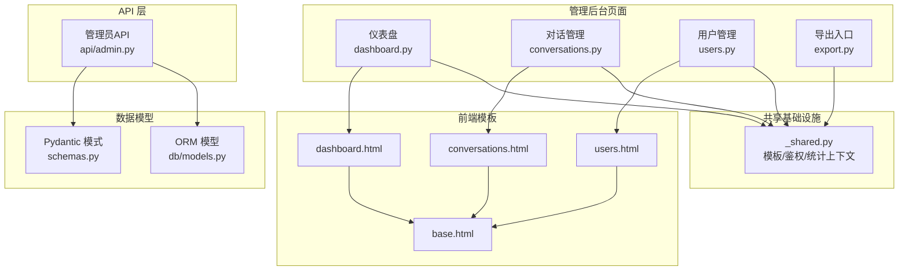
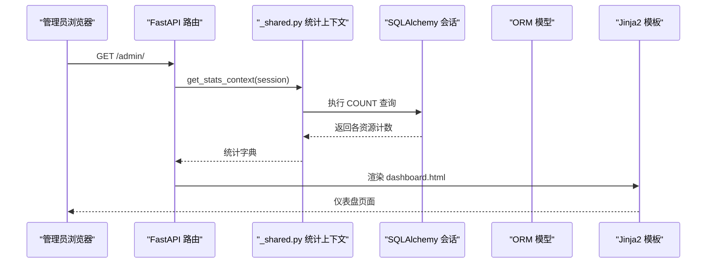
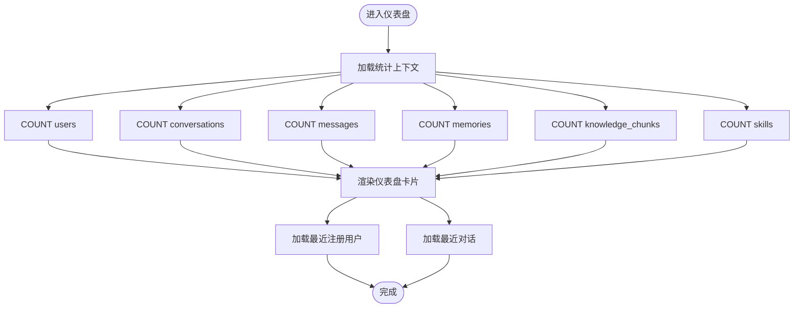
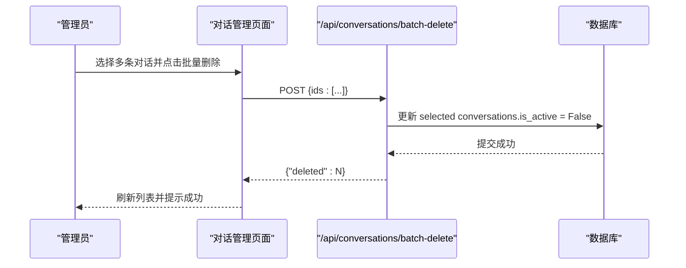
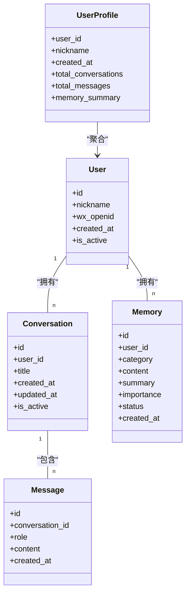
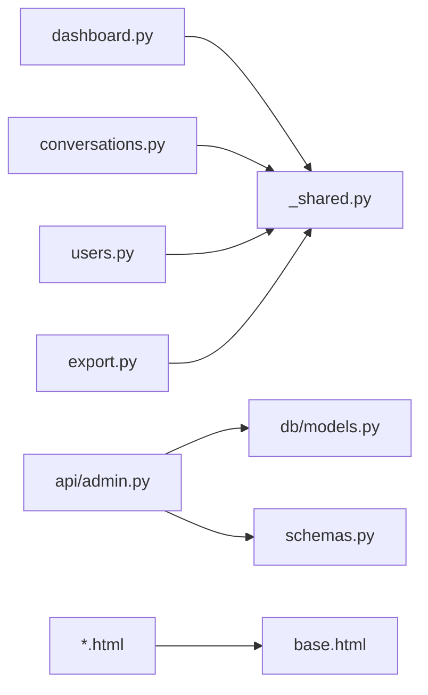

# 数据统计与分析

<cite>
**本文引用的文件**   
- [hushai/meditation/admin/pages/dashboard.py](file://hushai/meditation/admin/pages/dashboard.py)
- [hushai/meditation/admin/pages/conversations.py](file://hushai/meditation/admin/pages/conversations.py)
- [hushai/meditation/admin/pages/users.py](file://hushai/meditation/admin/pages/users.py)
- [hushai/meditation/admin/pages/export.py](file://hushai/meditation/admin/pages/export.py)
- [hushai/meditation/admin/_shared.py](file://hushai/meditation/admin/pages/_shared.py)
- [hushai/meditation/api/admin.py](file://hushai/meditation/api/admin.py)
- [hushai/meditation/db/models.py](file://hushai/meditation/db/models.py)
- [hushai/meditation/schemas.py](file://hushai/meditation/schemas.py)
- [hushai/meditation/admin/templates/dashboard.html](file://hushai/meditation/admin/templates/dashboard.html)
- [hushai/meditation/admin/templates/conversations.html](file://hushai/meditation/admin/templates/conversations.html)
- [hushai/meditation/admin/templates/users.html](file://hushai/meditation/admin/templates/users.html)
- [hushai/meditation/admin/templates/base.html](file://hushai/meditation/admin/templates/base.html)
</cite>

## 目录
1. [简介](#简介)
2. [项目结构](#项目结构)
3. [核心组件](#核心组件)
4. [架构总览](#架构总览)
5. [详细组件分析](#详细组件分析)
6. [依赖关系分析](#依赖关系分析)
7. [性能与可扩展性](#性能与可扩展性)
8. [故障排查指南](#故障排查指南)
9. [结论](#结论)
10. [附录：数据导出与可视化配置](#附录数据导出与可视化配置)

## 简介
本文件面向 hush.ai 管理后台的数据统计与分析能力，覆盖以下目标：
- 对话数据统计：对话数量趋势、用户活跃度、会话时长等指标的计算与展示。
- 用户行为分析：用户画像构建、使用习惯分析与留存率计算思路。
- 系统性能监控：响应时间、错误率与资源使用情况的观测建议。
- 数据可视化：基于现有模板的图表呈现方式与扩展方法。
- 自定义报表与导出：CSV/Excel 导出流程与操作指南。
- 为数据分析师与管理决策者提供可落地的洞察工具与方法论。

## 项目结构
管理后台的数据统计与分析主要分布在以下模块：
- 页面路由与视图逻辑：仪表盘、对话列表、用户列表与详情、导出入口。
- 共享基础设施：模板渲染、鉴权、统计上下文聚合。
- API 层：管理员接口（用户画像、业务统计）。
- 数据模型：用户、对话、消息、记忆、技能、知识、预约、订单等实体。
- 前端模板：仪表盘卡片、对话与用户列表、通用交互（弹窗、提示、加载遮罩）。

**图示来源**
- [hushai/meditation/admin/pages/dashboard.py:1-52](file://hushai/meditation/admin/pages/dashboard.py#L1-L52)
- [hushai/meditation/admin/pages/conversations.py:1-139](file://hushai/meditation/admin/pages/conversations.py#L1-L139)
- [hushai/meditation/admin/pages/users.py:1-146](file://hushai/meditation/admin/pages/users.py#L1-L146)
- [hushai/meditation/admin/pages/export.py:1-207](file://hushai/meditation/admin/pages/export.py#L1-L207)
- [hushai/meditation/admin/pages/_shared.py:1-110](file://hushai/meditation/admin/pages/_shared.py#L1-L110)
- [hushai/meditation/api/admin.py:1-268](file://hushai/meditation/api/admin.py#L1-L268)
- [hushai/meditation/db/models.py:1-434](file://hushai/meditation/db/models.py#L1-L434)
- [hushai/meditation/schemas.py:1-541](file://hushai/meditation/schemas.py#L1-L541)
- [hushai/meditation/admin/templates/dashboard.html:1-210](file://hushai/meditation/admin/templates/dashboard.html#L1-L210)
- [hushai/meditation/admin/templates/conversations.html:1-208](file://hushai/meditation/admin/templates/conversations.html#L1-L208)
- [hushai/meditation/admin/templates/users.html:1-158](file://hushai/meditation/admin/templates/users.html#L1-L158)
- [hushai/meditation/admin/templates/base.html:1-502](file://hushai/meditation/admin/templates/base.html#L1-L502)

**章节来源**
- [hushai/meditation/admin/pages/dashboard.py:1-52](file://hushai/meditation/admin/pages/dashboard.py#L1-L52)
- [hushai/meditation/admin/pages/conversations.py:1-139](file://hushai/meditation/admin/pages/conversations.py#L1-L139)
- [hushai/meditation/admin/pages/users.py:1-146](file://hushai/meditation/admin/pages/users.py#L1-L146)
- [hushai/meditation/admin/pages/export.py:1-207](file://hushai/meditation/admin/pages/export.py#L1-L207)
- [hushai/meditation/admin/pages/_shared.py:1-110](file://hushai/meditation/admin/pages/_shared.py#L1-L110)
- [hushai/meditation/api/admin.py:1-268](file://hushai/meditation/api/admin.py#L1-L268)
- [hushai/meditation/db/models.py:1-434](file://hushai/meditation/db/models.py#L1-L434)
- [hushai/meditation/schemas.py:1-541](file://hushai/meditation/schemas.py#L1-L541)
- [hushai/meditation/admin/templates/dashboard.html:1-210](file://hushai/meditation/admin/templates/dashboard.html#L1-L210)
- [hushai/meditation/admin/templates/conversations.html:1-208](file://hushai/meditation/admin/templates/conversations.html#L1-L208)
- [hushai/meditation/admin/templates/users.html:1-158](file://hushai/meditation/admin/templates/users.html#L1-L158)
- [hushai/meditation/admin/templates/base.html:1-502](file://hushai/meditation/admin/templates/base.html#L1-L502)

## 核心组件
- 仪表盘统计上下文：聚合用户、对话、消息、记忆、知识、技能等总数，供仪表盘卡片展示。
- 对话管理：分页、筛选、批量软删除、导出 CSV/Excel。
- 用户管理：搜索、分页、状态切换、详情（含对话与消息计数、记忆摘要）。
- 管理员 API：用户画像（对话/消息计数、记忆分类汇总）、咨询业务全局统计。
- 数据导出：统一导出响应封装，支持 CSV 与 Excel。

**章节来源**
- [hushai/meditation/admin/pages/_shared.py:44-70](file://hushai/meditation/admin/pages/_shared.py#L44-L70)
- [hushai/meditation/admin/pages/conversations.py:22-70](file://hushai/meditation/admin/pages/conversations.py#L22-L70)
- [hushai/meditation/admin/pages/users.py:18-65](file://hushai/meditation/admin/pages/users.py#L18-L65)
- [hushai/meditation/api/admin.py:37-74](file://hushai/meditation/api/admin.py#L37-L74)
- [hushai/meditation/api/admin.py:116-156](file://hushai/meditation/api/admin.py#L116-L156)
- [hushai/meditation/admin/pages/export.py:17-51](file://hushai/meditation/admin/pages/export.py#L17-L51)

## 架构总览
管理后台采用 FastAPI + Jinja2 模板渲染，后端通过 SQLAlchemy 异步会话访问数据库，前端模板负责展示与交互。

**图示来源**
- [hushai/meditation/admin/pages/dashboard.py:18-51](file://hushai/meditation/admin/pages/dashboard.py#L18-L51)
- [hushai/meditation/admin/pages/_shared.py:44-70](file://hushai/meditation/admin/pages/_shared.py#L44-L70)
- [hushai/meditation/db/models.py:37-83](file://hushai/meditation/db/models.py#L37-L83)
- [hushai/meditation/admin/templates/dashboard.html:60-122](file://hushai/meditation/admin/templates/dashboard.html#L60-L122)

## 详细组件分析

### 仪表盘与基础统计
- 功能要点
  - 聚合用户总数与活跃数、对话总数、消息总数、记忆条目、知识条目、技能数量。
  - 展示最近注册用户与最近对话列表，便于快速掌握平台动态。
- 数据来源
  - 统计上下文函数对 User、Conversation、Message、Memory、KnowledgeChunk、Skill 进行 COUNT 查询。
  - 最近用户与最近对话通过排序与 LIMIT 获取。
- 展示方式
  - 仪表盘模板以卡片形式展示关键指标，并提供“查看全部”跳转。

**图示来源**
- [hushai/meditation/admin/pages/_shared.py:44-70](file://hushai/meditation/admin/pages/_shared.py#L44-L70)
- [hushai/meditation/admin/pages/dashboard.py:25-40](file://hushai/meditation/admin/pages/dashboard.py#L25-L40)
- [hushai/meditation/admin/templates/dashboard.html:60-122](file://hushai/meditation/admin/templates/dashboard.html#L60-L122)

**章节来源**
- [hushai/meditation/admin/pages/dashboard.py:18-51](file://hushai/meditation/admin/pages/dashboard.py#L18-L51)
- [hushai/meditation/admin/pages/_shared.py:44-70](file://hushai/meditation/admin/pages/_shared.py#L44-L70)
- [hushai/meditation/admin/templates/dashboard.html:60-122](file://hushai/meditation/admin/templates/dashboard.html#L60-L122)

### 对话数据统计
- 功能要点
  - 对话列表分页、按用户筛选、批量软删除（标记 is_active=False）。
  - 导出对话记录为 CSV/Excel，支持按用户过滤。
- 关键指标
  - 对话总量、按用户维度分布、状态（进行中/已结束）占比。
  - 结合 Message 表可进一步计算平均消息数、峰值时段等。
- 实现路径
  - 列表页通过 Conversation 与 User 关联查询，支持 user_id 筛选。
  - 批量删除调用 POST /api/conversations/batch-delete，将选中对话标记为非活跃。

**图示来源**
- [hushai/meditation/admin/pages/conversations.py:117-138](file://hushai/meditation/admin/pages/conversations.py#L117-L138)
- [hushai/meditation/admin/templates/conversations.html:177-190](file://hushai/meditation/admin/templates/conversations.html#L177-L190)

**章节来源**
- [hushai/meditation/admin/pages/conversations.py:22-70](file://hushai/meditation/admin/pages/conversations.py#L22-L70)
- [hushai/meditation/admin/pages/conversations.py:117-138](file://hushai/meditation/admin/pages/conversations.py#L117-L138)
- [hushai/meditation/admin/templates/conversations.html:14-48](file://hushai/meditation/admin/templates/conversations.html#L14-L48)

### 用户活跃度与画像
- 功能要点
  - 用户列表支持昵称或 OpenID 模糊搜索与分页。
  - 用户详情页展示对话与消息计数、记忆摘要、历史对话列表。
  - 管理员 API 提供用户画像（UserProfile），包含总对话数、总消息数、记忆分类汇总。
- 活跃度定义建议
  - 日/周/月活跃：基于用户创建或更新时间、对话/消息活动频率。
  - 留存率：按注册日期分组，观察后续周期内仍有活动的用户比例。
- 实现路径
  - 用户列表与详情由 users.py 提供；管理员 API 在 api/admin.py 中返回 UserProfile。

**图示来源**
- [hushai/meditation/db/models.py:37-118](file://hushai/meditation/db/models.py#L37-L118)
- [hushai/meditation/schemas.py:153-160](file://hushai/meditation/schemas.py#L153-L160)
- [hushai/meditation/api/admin.py:37-74](file://hushai/meditation/api/admin.py#L37-L74)

**章节来源**
- [hushai/meditation/admin/pages/users.py:18-123](file://hushai/meditation/admin/pages/users.py#L18-L123)
- [hushai/meditation/api/admin.py:37-74](file://hushai/meditation/api/admin.py#L37-L74)
- [hushai/meditation/schemas.py:153-160](file://hushai/meditation/schemas.py#L153-L160)

### 会话时长统计
- 数据基础
  - 模型中包含 MeditationSession（冥想会话）与 DailyProgress（每日进度），具备 started_at、ended_at、duration_seconds、total_duration_seconds 等字段，可用于会话时长统计。
- 指标建议
  - 平均会话时长、分位数（P50/P90/P95）、按场景/导师维度对比。
  - 用户维度：人均会话时长、连续活跃天数（streak_day）。
- 实现建议
  - 在仪表盘或独立报表页面新增“会话时长”卡片，聚合 MeditationSession 与 DailyProgress 的时长字段。
  - 结合 Conversation 与 Message 的时间戳，估算聊天会话时长（需定义开始/结束规则）。

**章节来源**
- [hushai/meditation/db/models.py:204-244](file://hushai/meditation/db/models.py#L204-L244)

### 系统性能监控指标
- 当前实现
  - 未内置统一的响应时间、错误率、资源使用监控端点。
- 建议方案
  - 在 FastAPI 中间件中采集请求耗时、异常次数，写入日志或专用监控表。
  - 暴露 /debug 或 /metrics 端点，输出关键指标（QPS、P95 延迟、错误率、内存/CPU 使用）。
  - 结合审计日志（AuditLog）追踪管理操作的性能影响。

[本节为通用建议，不直接分析具体文件]

## 依赖关系分析
- 页面路由依赖共享统计上下文与模板渲染。
- 管理员 API 依赖 ORM 模型与 Pydantic 响应模型。
- 导出功能依赖统一导出响应封装。

**图示来源**
- [hushai/meditation/admin/pages/dashboard.py:1-52](file://hushai/meditation/admin/pages/dashboard.py#L1-L52)
- [hushai/meditation/admin/pages/conversations.py:1-139](file://hushai/meditation/admin/pages/conversations.py#L1-L139)
- [hushai/meditation/admin/pages/users.py:1-146](file://hushai/meditation/admin/pages/users.py#L1-L146)
- [hushai/meditation/admin/pages/export.py:1-207](file://hushai/meditation/admin/pages/export.py#L1-L207)
- [hushai/meditation/admin/pages/_shared.py:1-110](file://hushai/meditation/admin/pages/_shared.py#L1-L110)
- [hushai/meditation/api/admin.py:1-268](file://hushai/meditation/api/admin.py#L1-L268)
- [hushai/meditation/db/models.py:1-434](file://hushai/meditation/db/models.py#L1-L434)
- [hushai/meditation/schemas.py:1-541](file://hushai/meditation/schemas.py#L1-L541)
- [hushai/meditation/admin/templates/base.html:1-502](file://hushai/meditation/admin/templates/base.html#L1-L502)

**章节来源**
- [hushai/meditation/admin/pages/_shared.py:1-110](file://hushai/meditation/admin/pages/_shared.py#L1-L110)
- [hushai/meditation/api/admin.py:1-268](file://hushai/meditation/api/admin.py#L1-L268)
- [hushai/meditation/db/models.py:1-434](file://hushai/meditation/db/models.py#L1-L434)
- [hushai/meditation/schemas.py:1-541](file://hushai/meditation/schemas.py#L1-L541)

## 性能与可扩展性
- 查询优化
  - 使用 func.count() 与索引字段（如 created_at、user_id、category）提升聚合与筛选效率。
  - 分页使用 offset/limit，避免一次性拉取大量数据。
- 导出性能
  - 大数据量导出建议使用流式生成与分批读取，降低内存占用。
- 缓存策略
  - 对高频统计（如仪表盘总数）引入短期缓存（Redis/Memcached），减少重复 COUNT 查询。
- 监控与告警
  - 增加慢查询日志与错误率阈值告警，保障管理后台稳定性。

[本节为通用建议，不直接分析具体文件]

## 故障排查指南
- 常见错误
  - 未登录访问：页面路由会重定向到登录页；API 路由返回 401。
  - 资源不存在：用户/对话详情缺失时返回 404。
  - 批量删除失败：检查选中 IDs 是否有效、事务提交是否成功。
- 定位步骤
  - 查看模板渲染参数是否正确传入（如 user_count、conv_count）。
  - 核对 SQL 语句与索引使用情况，确认分页与筛选条件生效。
  - 检查导出格式参数（csv/xlsx）与文件名生成逻辑。

**章节来源**
- [hushai/meditation/admin/pages/_shared.py:73-96](file://hushai/meditation/admin/pages/_shared.py#L73-L96)
- [hushai/meditation/admin/pages/conversations.py:73-92](file://hushai/meditation/admin/pages/conversations.py#L73-L92)
- [hushai/meditation/admin/pages/users.py:68-83](file://hushai/meditation/admin/pages/users.py#L68-L83)
- [hushai/meditation/admin/pages/export.py:92-106](file://hushai/meditation/admin/pages/export.py#L92-L106)

## 结论
当前管理后台已具备基础的统计与导出能力，仪表盘展示了关键资源总量与近期活动，对话与用户管理提供了分页、筛选与导出功能。建议在现有基础上：
- 扩展对话趋势与用户活跃度看板（按日/周/月聚合）。
- 完善会话时长统计与留存率计算。
- 引入性能监控与慢查询分析。
- 增强数据可视化（折线图、柱状图、热力图等）以提升洞察效率。

[本节为总结，不直接分析具体文件]

## 附录：数据导出与可视化配置

### 数据导出操作指南
- 导出范围
  - 对话记录：支持按用户筛选，导出 CSV/Excel。
  - 用户列表：支持按昵称/OpenID 搜索，导出 CSV/Excel。
  - 记忆列表：支持按用户与分类筛选，导出 CSV/Excel。
  - 知识库：支持标题/内容全文检索，导出 CSV/Excel。
  - 审计日志：支持按操作类型与管理员筛选，导出 CSV/Excel。
- 操作步骤
  - 在对应管理页面点击“CSV/Excel”按钮，选择导出格式。
  - 如需筛选，先设置筛选条件再导出。
  - 下载完成后，可在本地用表格软件打开并进行二次分析。

**章节来源**
- [hushai/meditation/admin/pages/export.py:17-51](file://hushai/meditation/admin/pages/export.py#L17-L51)
- [hushai/meditation/admin/pages/export.py:95-128](file://hushai/meditation/admin/pages/export.py#L95-L128)
- [hushai/meditation/admin/pages/export.py:131-169](file://hushai/meditation/admin/pages/export.py#L131-L169)
- [hushai/meditation/admin/pages/export.py:172-206](file://hushai/meditation/admin/pages/export.py#L172-L206)
- [hushai/meditation/admin/pages/export.py:54-92](file://hushai/meditation/admin/pages/export.py#L54-L92)
- [hushai/meditation/admin/pages/export.py:92-106](file://hushai/meditation/admin/pages/export.py#L92-L106)

### 可视化图表配置与使用
- 现状
  - 仪表盘以卡片与表格为主，未集成第三方图表库。
- 扩展建议
  - 在前端模板中引入轻量图表库（如 Chart.js/ECharts），通过异步接口获取时序数据。
  - 新增“对话趋势”、“用户活跃度”、“会话时长分布”等图表卡片。
  - 复用 base.html 中的异步请求与提示机制，保持交互一致性。

**章节来源**
- [hushai/meditation/admin/templates/dashboard.html:60-122](file://hushai/meditation/admin/templates/dashboard.html#L60-L122)
- [hushai/meditation/admin/templates/base.html:393-436](file://hushai/meditation/admin/templates/base.html#L393-L436)