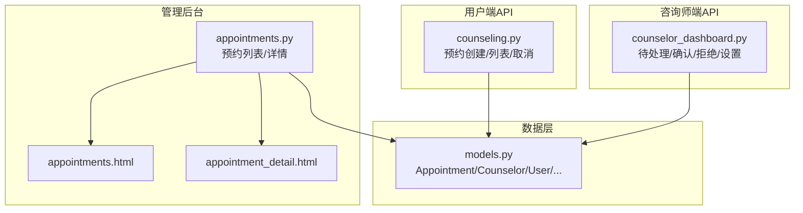
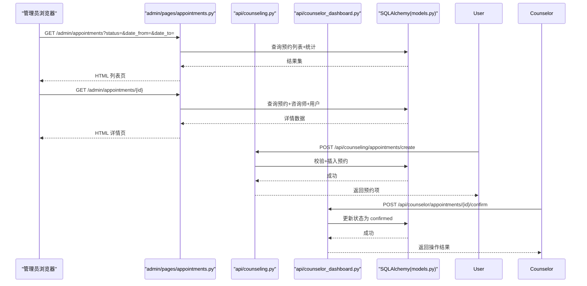
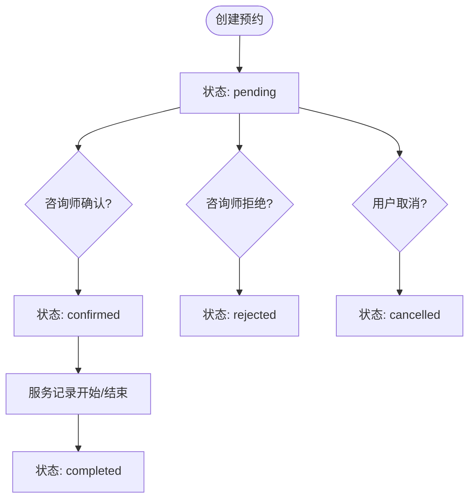
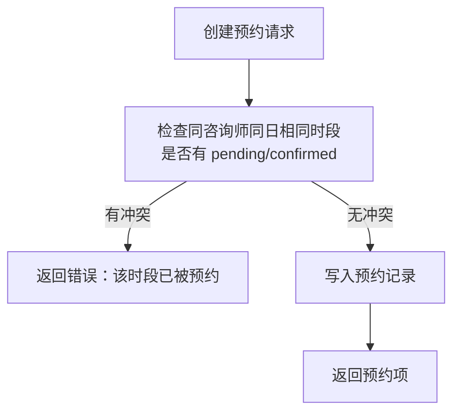
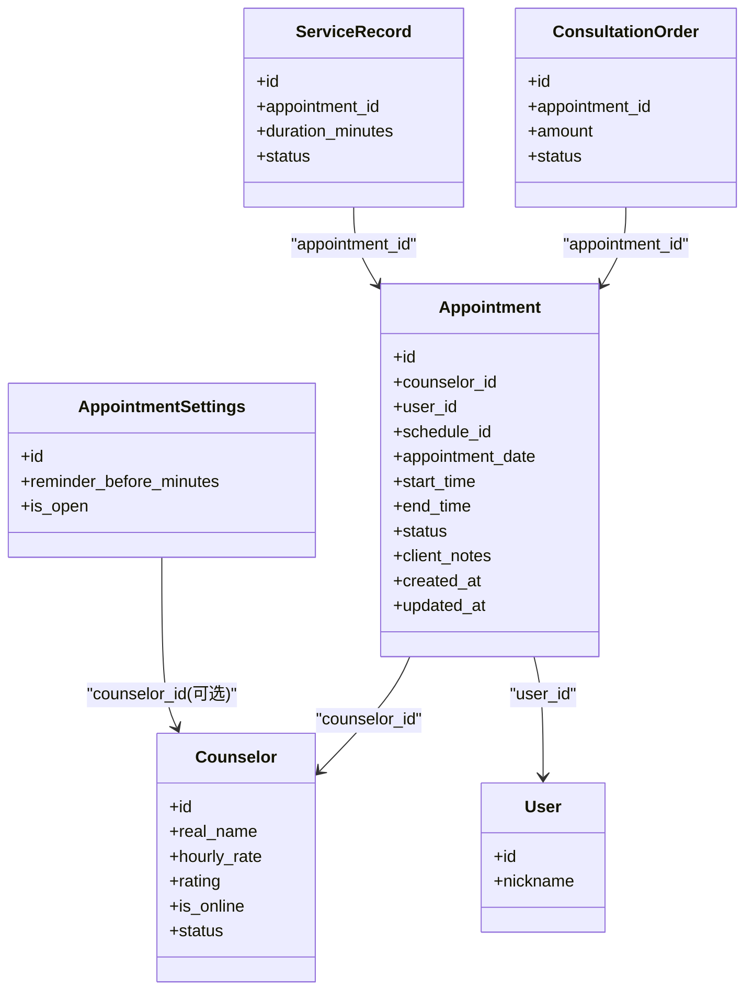

# 预约咨询管理

<cite>
**本文引用的文件**
- [hushai/meditation/admin/pages/appointments.py](file://hushai/meditation/admin/pages/appointments.py)
- [hushai/meditation/admin/templates/appointments.html](file://hushai/meditation/admin/templates/appointments.html)
- [hushai/meditation/admin/templates/appointment_detail.html](file://hushai/meditation/admin/templates/appointment_detail.html)
- [hushai/meditation/api/counseling.py](file://hushai/meditation/api/counseling.py)
- [hushai/meditation/api/counselor_dashboard.py](file://hushai/meditation/api/counselor_dashboard.py)
- [hushai/meditation/db/models.py](file://hushai/meditation/db/models.py)
</cite>

## 目录
1. [简介](#简介)
2. [项目结构](#项目结构)
3. [核心组件](#核心组件)
4. [架构总览](#架构总览)
5. [详细组件分析](#详细组件分析)
6. [依赖关系分析](#依赖关系分析)
7. [性能与扩展性](#性能与扩展性)
8. [故障排查指南](#故障排查指南)
9. [结论](#结论)
10. [附录：运营工作流与配置指南](#附录：运营工作流与配置指南)

## 简介
本文件面向 hush.ai 管理后台的“预约咨询管理”功能，覆盖以下目标：
- 预约列表查看：支持按状态、日期范围筛选，展示时间、咨询师分配与统计概览。
- 预约详情页面：展示用户信息、预约历史与备注等关键信息。
- 预约状态管理：明确确认、拒绝、取消、完成等状态流转规则与权限边界。
- 数据统计与分析：提供看板维度的统计指标与使用方式。
- 冲突检测与提醒：说明冲突校验逻辑与提醒相关配置项。
- 运营管理流程：为运营人员提供端到端的工作指引。

## 项目结构
与预约咨询管理相关的代码主要分布在以下模块：
- 管理后台页面路由与模板：admin/pages/appointments.py 及其模板 appointments.html、appointment_detail.html
- 用户端预约 API：api/counseling.py（创建、查询、取消）
- 咨询师端管理 API：api/counselor_dashboard.py（待处理列表、确认/拒绝、服务记录、预约设置）
- 数据模型：db/models.py（Appointment、Counselor、User、ConsultationOrder、ServiceRecord、AppointmentSettings 等）

图表来源
- [hushai/meditation/admin/pages/appointments.py:19-126](file://hushai/meditation/admin/pages/appointments.py#L19-L126)
- [hushai/meditation/admin/templates/appointments.html:1-74](file://hushai/meditation/admin/templates/appointments.html#L1-L74)
- [hushai/meditation/admin/templates/appointment_detail.html:1-57](file://hushai/meditation/admin/templates/appointment_detail.html#L1-L57)
- [hushai/meditation/api/counseling.py:180-310](file://hushai/meditation/api/counseling.py#L180-L310)
- [hushai/meditation/api/counselor_dashboard.py:267-368](file://hushai/meditation/api/counselor_dashboard.py#L267-L368)
- [hushai/meditation/db/models.py:327-434](file://hushai/meditation/db/models.py#L327-L434)

章节来源
- [hushai/meditation/admin/pages/appointments.py:19-126](file://hushai/meditation/admin/pages/appointments.py#L19-L126)
- [hushai/meditation/admin/templates/appointments.html:1-74](file://hushai/meditation/admin/templates/appointments.html#L1-L74)
- [hushai/meditation/admin/templates/appointment_detail.html:1-57](file://hushai/meditation/admin/templates/appointment_detail.html#L1-L57)
- [hushai/meditation/api/counseling.py:180-310](file://hushai/meditation/api/counseling.py#L180-L310)
- [hushai/meditation/api/counselor_dashboard.py:267-368](file://hushai/meditation/api/counselor_dashboard.py#L267-L368)
- [hushai/meditation/db/models.py:327-434](file://hushai/meditation/db/models.py#L327-L434)

## 核心组件
- 预约列表页（管理后台）
  - 支持分页、按状态和日期范围筛选；返回统计数据（总数、待确认、已确认、已完成、已取消）。
  - 数据来源：Appointment 表；统计通过聚合函数计算。
- 预约详情页（管理后台）
  - 展示预约时间、状态、取消原因；同时加载关联的咨询师与来访者基本信息。
- 用户端预约 API
  - 创建预约：校验咨询师认证、预约开关、时段冲突；写入 Appointment。
  - 我的预约列表：按用户维度分页查询。
  - 取消预约：仅允许 pending/confirmed 状态取消。
- 咨询师端管理 API
  - 待处理预约列表：仅当前咨询师的可处理预约。
  - 确认/拒绝：对 pending 状态的预约进行状态变更并记录审计日志。
  - 预约设置：读取/更新 reminder_before_minutes 等提醒相关字段。
- 数据模型
  - Appointment：核心预约实体，包含日期、起止时间、状态、备注等。
  - Counselor/CounselorSchedule：咨询师与排班。
  - ConsultationOrder/ServiceRecord：订单与服务记录。
  - AppointmentSettings：预约全局或咨询师级别配置（含提醒提前分钟数）。

章节来源
- [hushai/meditation/admin/pages/appointments.py:19-91](file://hushai/meditation/admin/pages/appointments.py#L19-L91)
- [hushai/meditation/admin/templates/appointments.html:1-74](file://hushai/meditation/admin/templates/appointments.html#L1-L74)
- [hushai/meditation/admin/templates/appointment_detail.html:1-57](file://hushai/meditation/admin/templates/appointment_detail.html#L1-L57)
- [hushai/meditation/api/counseling.py:180-310](file://hushai/meditation/api/counseling.py#L180-L310)
- [hushai/meditation/api/counselor_dashboard.py:267-368](file://hushai/meditation/api/counselor_dashboard.py#L267-L368)
- [hushai/meditation/db/models.py:327-434](file://hushai/meditation/db/models.py#L327-L434)

## 架构总览
从请求到数据的整体交互如下：

图表来源
- [hushai/meditation/admin/pages/appointments.py:19-126](file://hushai/meditation/admin/pages/appointments.py#L19-L126)
- [hushai/meditation/api/counseling.py:180-310](file://hushai/meditation/api/counseling.py#L180-L310)
- [hushai/meditation/api/counselor_dashboard.py:300-368](file://hushai/meditation/api/counselor_dashboard.py#L300-L368)
- [hushai/meditation/db/models.py:327-434](file://hushai/meditation/db/models.py#L327-L434)

## 详细组件分析

### 预约列表查看（管理后台）
- 功能要点
  - 支持分页、按状态筛选、按日期范围筛选。
  - 返回统计数据：总数、待确认、已确认、已完成、已取消。
  - 列表展示字段：预约日期、时间段、状态、创建时间，并提供跳转详情的入口。
- 实现路径
  - 路由：GET /admin/appointments
  - 模板：appointments.html
- 注意事项
  - 未登录将重定向至登录页。
  - 日期参数需为 ISO 格式字符串。

章节来源
- [hushai/meditation/admin/pages/appointments.py:19-91](file://hushai/meditation/admin/pages/appointments.py#L19-L91)
- [hushai/meditation/admin/templates/appointments.html:1-74](file://hushai/meditation/admin/templates/appointments.html#L1-L74)

### 预约详情页面（管理后台）
- 功能要点
  - 展示预约日期、时间段、状态、创建时间、取消原因。
  - 展示关联的咨询师信息（姓名、时薪、评分）与来访者信息（ID前缀、昵称）。
- 实现路径
  - 路由：GET /admin/appointments/{appointment_id}
  - 模板：appointment_detail.html
- 注意事项
  - 若预约不存在，返回 404。

章节来源
- [hushai/meditation/admin/pages/appointments.py:94-126](file://hushai/meditation/admin/pages/appointments.py#L94-L126)
- [hushai/meditation/admin/templates/appointment_detail.html:1-57](file://hushai/meditation/admin/templates/appointment_detail.html#L1-L57)

### 预约状态管理与流转
- 状态集合
  - pending（待确认）、confirmed（已确认）、completed（已完成）、cancelled（已取消）、rejected（已拒绝）
- 状态流转规则
  - 用户创建预约后，默认 pending。
  - 咨询师可确认（pending → confirmed）或拒绝（pending → rejected），并记录审计日志。
  - 用户可在 pending/confirmed 状态下取消（→ cancelled）。
  - 完成（completed）通常由服务记录完结驱动（见下文“服务记录”）。
- 关键接口
  - 用户端取消：POST /api/counseling/appointments/{id}/cancel
  - 咨询师端确认：POST /api/counselor/appointments/{id}/confirm
  - 咨询师端拒绝：POST /api/counselor/appointments/{id}/reject

图表来源
- [hushai/meditation/api/counseling.py:288-310](file://hushai/meditation/api/counseling.py#L288-L310)
- [hushai/meditation/api/counselor_dashboard.py:300-368](file://hushai/meditation/api/counselor_dashboard.py#L300-L368)
- [hushai/meditation/db/models.py:327-353](file://hushai/meditation/db/models.py#L327-L353)

章节来源
- [hushai/meditation/api/counseling.py:288-310](file://hushai/meditation/api/counseling.py#L288-L310)
- [hushai/meditation/api/counselor_dashboard.py:300-368](file://hushai/meditation/api/counselor_dashboard.py#L300-L368)
- [hushai/meditation/db/models.py:327-353](file://hushai/meditation/db/models.py#L327-L353)

### 预约冲突检测与自动提醒配置
- 冲突检测
  - 在创建预约时，系统会检查同一咨询师在同一日期的相同时段是否存在 pending/confirmed 的预约，若存在则拒绝创建。
- 提醒配置
  - 通过 AppointmentSettings 的 reminder_before_minutes 控制提醒提前分钟数。
  - 咨询师可通过 /api/counselor/settings 获取与更新该配置。
- 注意
  - 当前代码中未发现定时任务或消息推送的实现，提醒功能需结合外部调度/通知服务实现。

图表来源
- [hushai/meditation/api/counseling.py:206-231](file://hushai/meditation/api/counseling.py#L206-L231)
- [hushai/meditation/db/models.py:413-434](file://hushai/meditation/db/models.py#L413-L434)
- [hushai/meditation/api/counselor_dashboard.py:427-492](file://hushai/meditation/api/counselor_dashboard.py#L427-L492)

章节来源
- [hushai/meditation/api/counseling.py:206-231](file://hushai/meditation/api/counseling.py#L206-L231)
- [hushai/meditation/db/models.py:413-434](file://hushai/meditation/db/models.py#L413-L434)
- [hushai/meditation/api/counselor_dashboard.py:427-492](file://hushai/meditation/api/counselor_dashboard.py#L427-L492)

### 预约数据统计与分析工具
- 管理后台统计
  - 列表页提供按状态分类的统计卡片（总数、待确认、已确认、已完成、已取消）。
  - 数据来源于对 Appointment 表的聚合查询。
- 使用方式
  - 进入“预约管理”页面即可看到统计卡片与筛选后的列表。
  - 建议结合日期范围筛选进行阶段性数据分析。

章节来源
- [hushai/meditation/admin/pages/appointments.py:59-91](file://hushai/meditation/admin/pages/appointments.py#L59-L91)
- [hushai/meditation/admin/templates/appointments.html:11-17](file://hushai/meditation/admin/templates/appointments.html#L11-L17)

### 服务记录与“完成”状态
- 服务记录模型
  - ServiceRecord 用于记录咨询服务的摘要、时长、状态等，敏感字段加密存储。
- 完成状态触发
  - 当服务记录状态更新为 completed 时，通常会关联到预约的完成（具体业务可由上层逻辑决定）。
- 咨询师端能力
  - 咨询师可编辑服务记录（包括总结与备注），并在完成后更新时间戳。

章节来源
- [hushai/meditation/db/models.py:386-411](file://hushai/meditation/db/models.py#L386-L411)
- [hushai/meditation/api/counselor_dashboard.py:374-421](file://hushai/meditation/api/counselor_dashboard.py#L374-L421)

## 依赖关系分析
- 模块耦合
  - admin/pages/appointments.py 依赖 models.py 中的 Appointment、Counselor、User。
  - api/counseling.py 与 api/counselor_dashboard.py 均依赖 models.py 的多张表。
- 外部依赖
  - FastAPI、SQLAlchemy、异步会话。
- 潜在风险
  - 并发创建预约时的冲突检测需在数据库层面保证唯一性或事务隔离，避免竞态条件。
  - 提醒功能目前仅有配置项，缺少调度与发送逻辑。

图表来源
- [hushai/meditation/db/models.py:273-434](file://hushai/meditation/db/models.py#L273-L434)

章节来源
- [hushai/meditation/db/models.py:273-434](file://hushai/meditation/db/models.py#L273-L434)

## 性能与扩展性
- 查询优化
  - 列表与统计使用聚合函数与索引字段（如 status、appointment_date、counselor_id、user_id）提升效率。
- 分页策略
  - 统一采用 offset/limit 分页，适合中等规模数据；未来可考虑基于游标的分页以应对大数据量。
- 可扩展点
  - 增加更丰富的筛选维度（如咨询师名称、用户昵称）。
  - 引入缓存层（如 Redis）缓存热点统计。
  - 引入异步任务队列处理提醒与通知。

[本节为通用指导，不直接分析具体文件]

## 故障排查指南
- 常见问题
  - 404 预约不存在：检查 appointment_id 是否正确，或是否已被删除。
  - 400 该时段已被预约：确认是否已有 pending/confirmed 的预约占用该时段。
  - 400 当前状态不可取消：仅在 pending/confirmed 可取消。
  - 400 预约已关闭：检查 AppointmentSettings.is_open 是否为 False。
- 定位方法
  - 查看对应 API 的错误响应 detail。
  - 核对数据库中 Appointment 的状态与时间字段。
  - 检查 AppointmentSettings 的全局或咨询师级配置。

章节来源
- [hushai/meditation/api/counseling.py:180-231](file://hushai/meditation/api/counseling.py#L180-L231)
- [hushai/meditation/api/counseling.py:288-310](file://hushai/meditation/api/counseling.py#L288-L310)
- [hushai/meditation/db/models.py:413-434](file://hushai/meditation/db/models.py#L413-L434)

## 结论
本模块围绕预约的核心生命周期展开，提供了管理后台的列表与详情查看、用户端的预约创建与取消、咨询师端的确认/拒绝与服务记录维护，以及基础的统计与提醒配置。建议在后续迭代中完善提醒的调度与发送机制，增强并发安全与大数据量下的查询性能，并丰富运营分析维度。

[本节为总结，不直接分析具体文件]

## 附录：运营工作流与配置指南

### 运营管理流程
- 日常巡检
  - 打开“预约管理”，查看待确认数量与今日预约情况。
  - 针对异常预约（长时间 pending、频繁取消）进行跟进。
- 审核与处理
  - 对于咨询师提交的入驻申请，在相应页面进行审核（通过/拒绝）。
  - 对预约进行必要的干预（如协调改期、取消）。
- 数据复盘
  - 利用列表页的统计卡片与筛选功能，按周/月维度复盘预约转化与完成率。

章节来源
- [hushai/meditation/admin/pages/appointments.py:19-91](file://hushai/meditation/admin/pages/appointments.py#L19-L91)
- [hushai/meditation/admin/templates/appointments.html:11-17](file://hushai/meditation/admin/templates/appointments.html#L11-L17)

### 预约冲突检测与自动提醒配置
- 冲突检测
  - 确保创建预约时调用冲突检测逻辑，避免重复占用。
- 提醒配置
  - 在 AppointmentSettings 中设置 reminder_before_minutes。
  - 结合外部调度系统（如 Celery/定时任务）在提醒时间点触发通知（短信/站内信/邮件）。
- 实施建议
  - 为提醒事件建立独立的任务队列与重试机制。
  - 记录提醒发送日志，便于追踪与问题定位。

章节来源
- [hushai/meditation/api/counseling.py:206-231](file://hushai/meditation/api/counseling.py#L206-L231)
- [hushai/meditation/db/models.py:413-434](file://hushai/meditation/db/models.py#L413-L434)
- [hushai/meditation/api/counselor_dashboard.py:427-492](file://hushai/meditation/api/counselor_dashboard.py#L427-L492)