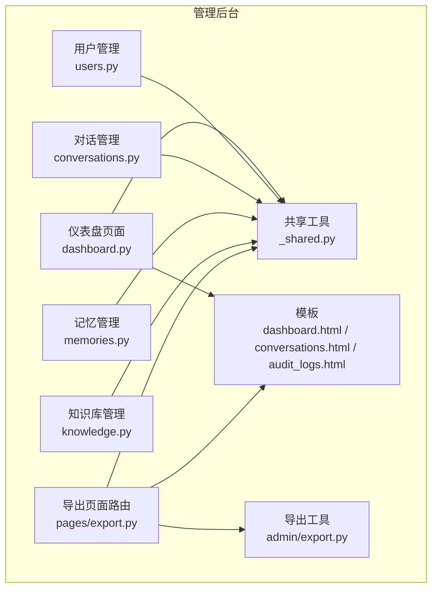
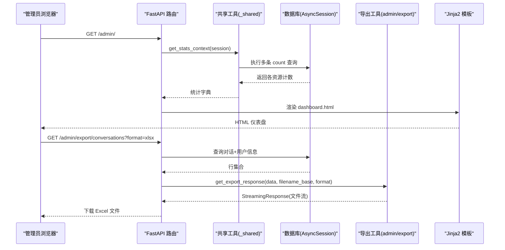
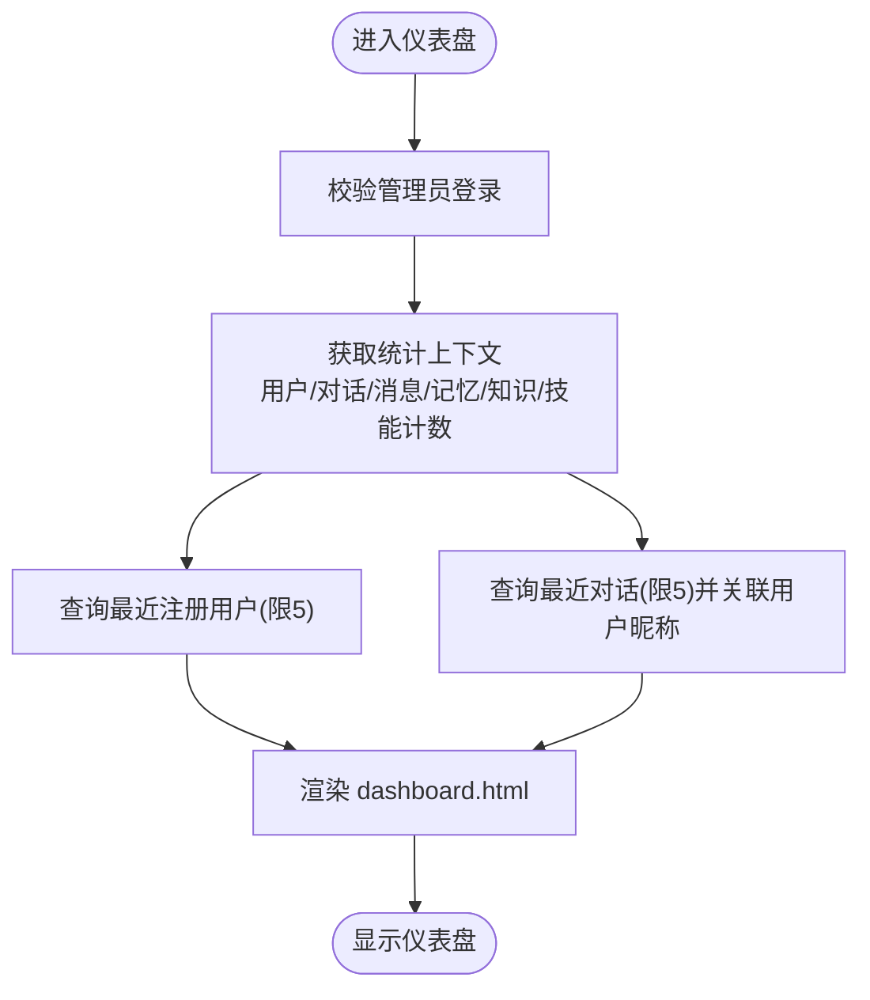
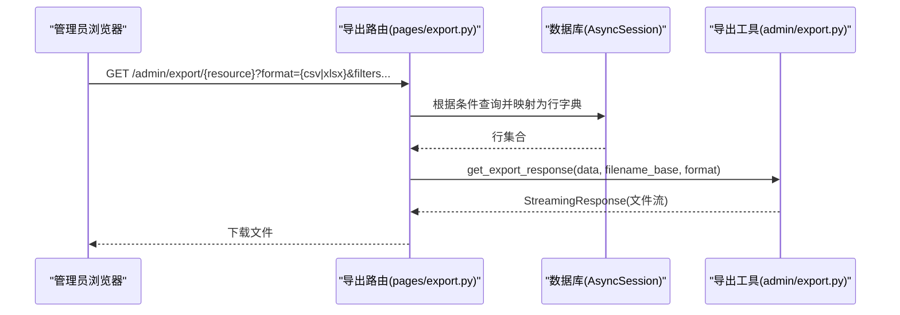
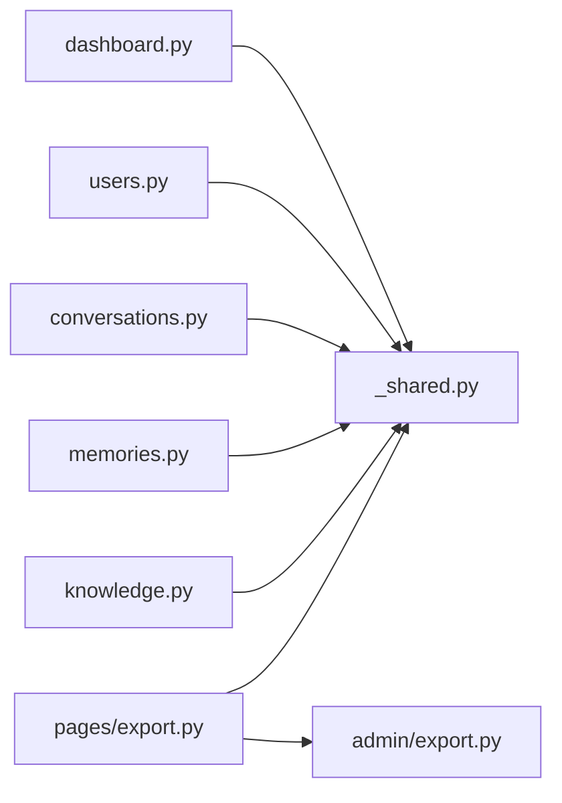

# 数据统计与分析

<cite>
**本文引用的文件**
- [hushai/meditation/admin/pages/dashboard.py](file://hushai/meditation/admin/pages/dashboard.py)
- [hushai/meditation/admin/templates/dashboard.html](file://hushai/meditation/admin/templates/dashboard.html)
- [hushai/meditation/admin/pages/_shared.py](file://hushai/meditation/admin/pages/_shared.py)
- [hushai/meditation/admin/pages/export.py](file://hushai/meditation/admin/pages/export.py)
- [hushai/meditation/admin/export.py](file://hushai/meditation/admin/export.py)
- [tests/meditation/test_export.py](file://tests/meditation/test_export.py)
- [hushai/meditation/admin/pages/users.py](file://hushai/meditation/admin/pages/users.py)
- [hushai/meditation/admin/pages/conversations.py](file://hushai/meditation/admin/pages/conversations.py)
- [hushai/meditation/admin/pages/memories.py](file://hushai/meditation/admin/pages/memories.py)
- [hushai/meditation/admin/pages/knowledge.py](file://hushai/meditation/admin/pages/knowledge.py)
- [hushai/meditation/admin/templates/conversations.html](file://hushai/meditation/admin/templates/conversations.html)
- [hushai/meditation/admin/templates/audit_logs.html](file://hushai/meditation/admin/templates/audit_logs.html)
</cite>

## 目录
1. [简介](#简介)
2. [项目结构](#项目结构)
3. [核心组件](#核心组件)
4. [架构总览](#架构总览)
5. [详细组件分析](#详细组件分析)
6. [依赖关系分析](#依赖关系分析)
7. [性能考量](#性能考量)
8. [故障排查指南](#故障排查指南)
9. [结论](#结论)
10. [附录](#附录)

## 简介
本文件面向 hush.ai 管理后台的数据统计与分析能力，覆盖以下方面：
- 仪表盘概览：关键指标展示、最近活动与快速入口
- 用户行为分析：活跃度、使用频率与用户画像基础数据
- 系统性能监控：响应时间、错误率与资源使用（建议方案）
- 数据导出：CSV/Excel 导出与自定义报表生成路径
- 数据分析最佳实践与报告解读指南

说明：当前代码已实现“仪表盘概览”和“数据导出”等核心能力；“实时数据更新”“可视化图表”“性能监控”在现有页面中未直接实现，本文给出可落地的扩展建议与集成点。

## 项目结构
管理后台的数据统计与分析相关代码主要位于 admin 模块的 pages 与 templates 下，并通过共享工具完成鉴权、模板渲染与统计上下文构建。导出功能由独立工具模块提供 CSV/Excel 输出。



图示来源
- [hushai/meditation/admin/pages/dashboard.py:1-52](file://hushai/meditation/admin/pages/dashboard.py#L1-L52)
- [hushai/meditation/admin/pages/_shared.py:44-70](file://hushai/meditation/admin/pages/_shared.py#L44-L70)
- [hushai/meditation/admin/pages/export.py:1-207](file://hushai/meditation/admin/pages/export.py#L1-L207)
- [hushai/meditation/admin/export.py:1-106](file://hushai/meditation/admin/export.py#L1-L106)
- [hushai/meditation/admin/templates/dashboard.html:1-210](file://hushai/meditation/admin/templates/dashboard.html#L1-L210)
- [hushai/meditation/admin/templates/conversations.html:1-43](file://hushai/meditation/admin/templates/conversations.html#L1-L43)
- [hushai/meditation/admin/templates/audit_logs.html:1-31](file://hushai/meditation/admin/templates/audit_logs.html#L1-L31)

章节来源
- [hushai/meditation/admin/pages/dashboard.py:1-52](file://hushai/meditation/admin/pages/dashboard.py#L1-L52)
- [hushai/meditation/admin/pages/_shared.py:1-110](file://hushai/meditation/admin/pages/_shared.py#L1-L110)
- [hushai/meditation/admin/pages/export.py:1-207](file://hushai/meditation/admin/pages/export.py#L1-L207)
- [hushai/meditation/admin/export.py:1-106](file://hushai/meditation/admin/export.py#L1-L106)
- [hushai/meditation/admin/templates/dashboard.html:1-210](file://hushai/meditation/admin/templates/dashboard.html#L1-L210)

## 核心组件
- 仪表盘页面：聚合关键指标（用户数、活跃用户、对话数、消息数、记忆条目、知识条目、技能数），并展示最近注册用户与最近对话。
- 共享统计上下文：统一从数据库计算各资源总数，供仪表盘复用。
- 导出页面路由：按对象维度（对话、审计日志、用户、记忆、知识）支持 CSV/Excel 导出。
- 导出工具：封装 CSV/Excel 序列化与流式响应返回。

章节来源
- [hushai/meditation/admin/pages/dashboard.py:18-51](file://hushai/meditation/admin/pages/dashboard.py#L18-L51)
- [hushai/meditation/admin/pages/_shared.py:44-70](file://hushai/meditation/admin/pages/_shared.py#L44-L70)
- [hushai/meditation/admin/pages/export.py:17-207](file://hushai/meditation/admin/pages/export.py#L17-L207)
- [hushai/meditation/admin/export.py:12-106](file://hushai/meditation/admin/export.py#L12-L106)

## 架构总览
管理后台采用 FastAPI + SQLAlchemy 异步会话 + Jinja2 模板渲染。仪表盘通过共享统计上下文获取指标，导出路由基于查询结果调用导出工具生成文件流。



图示来源
- [hushai/meditation/admin/pages/dashboard.py:18-51](file://hushai/meditation/admin/pages/dashboard.py#L18-L51)
- [hushai/meditation/admin/pages/_shared.py:44-70](file://hushai/meditation/admin/pages/_shared.py#L44-L70)
- [hushai/meditation/admin/pages/export.py:17-51](file://hushai/meditation/admin/pages/export.py#L17-L51)
- [hushai/meditation/admin/export.py:92-106](file://hushai/meditation/admin/export.py#L92-L106)

## 详细组件分析

### 仪表盘概览
- 关键指标：用户总数、活跃用户、对话总数、消息总数、记忆条目、知识条目、技能数量。
- 最近活动：最近注册用户列表、最近对话列表（含用户昵称）。
- 快速操作：跳转至用户、对话、记忆、知识、技能、场景管理等页面。
- 数据来源：通过共享统计上下文一次性拉取各资源计数；最近记录通过分页限制查询。



图示来源
- [hushai/meditation/admin/pages/dashboard.py:18-51](file://hushai/meditation/admin/pages/dashboard.py#L18-L51)
- [hushai/meditation/admin/pages/_shared.py:44-70](file://hushai/meditation/admin/pages/_shared.py#L44-L70)
- [hushai/meditation/admin/templates/dashboard.html:60-122](file://hushai/meditation/admin/templates/dashboard.html#L60-L122)

章节来源
- [hushai/meditation/admin/pages/dashboard.py:18-51](file://hushai/meditation/admin/pages/dashboard.py#L18-L51)
- [hushai/meditation/admin/pages/_shared.py:44-70](file://hushai/meditation/admin/pages/_shared.py#L44-L70)
- [hushai/meditation/admin/templates/dashboard.html:1-210](file://hushai/meditation/admin/templates/dashboard.html#L1-L210)

### 用户行为分析工具
- 活跃度统计：仪表盘中的“活跃用户”计数可作为整体活跃度参考；用户详情页可进一步查看其对话与消息量。
- 使用频率分析：通过用户维度的对话数、消息数进行频次统计；可在用户详情或导出时结合筛选条件进行分析。
- 用户画像构建：基于用户注册信息、状态、对话与记忆摘要等字段，形成基础画像要素，便于后续标签化与分层运营。

```mermaid
classDiagram
class User {
+id
+nickname
+wx_openid
+is_active
+created_at
}
class Conversation {
+id
+user_id
+title
+is_active
+created_at
+updated_at
}
class Message {
+id
+conversation_id
+created_at
}
class Memory {
+id
+user_id
+category
+content
+summary
+importance
+status
+created_at
}
User ||--o{ Conversation : "拥有"
Conversation ||--o{ Message : "包含"
User ||--o{ Memory : "拥有"
```

图示来源
- [hushai/meditation/admin/pages/users.py:85-123](file://hushai/meditation/admin/pages/users.py#L85-L123)
- [hushai/meditation/admin/pages/conversations.py:73-114](file://hushai/meditation/admin/pages/conversations.py#L73-L114)
- [hushai/meditation/admin/pages/memories.py:22-83](file://hushai/meditation/admin/pages/memories.py#L22-L83)

章节来源
- [hushai/meditation/admin/pages/users.py:18-146](file://hushai/meditation/admin/pages/users.py#L18-L146)
- [hushai/meditation/admin/pages/conversations.py:22-139](file://hushai/meditation/admin/pages/conversations.py#L22-L139)
- [hushai/meditation/admin/pages/memories.py:22-130](file://hushai/meditation/admin/pages/memories.py#L22-L130)

### 系统性能监控（建议方案）
当前代码未内置响应时间、错误率与资源使用监控。建议在现有路由层增加中间件或装饰器以采集指标，并在仪表盘新增“系统健康”卡片展示关键指标。

建议要点
- 响应时间：在请求进入/离开处记录耗时，按接口维度聚合。
- 错误率：捕获异常并分类统计（HTTP 状态码、异常类型）。
- 资源使用：定期采集进程内存、CPU、数据库连接池使用情况。
- 可视化：在前端新增图表区域，后端提供聚合 API 供前端轮询或 SSE 推送。

[本节为概念性建议，不直接分析具体文件]

### 数据导出功能
- 支持对象：对话、审计日志、用户、记忆、知识。
- 格式：CSV 与 Excel（xlsx）。
- 参数：format=csv/xlsx，部分接口支持按用户、分类、关键词等过滤。
- 流程：路由层组装数据行 -> 调用导出工具 -> 返回 StreamingResponse 文件流。



图示来源
- [hushai/meditation/admin/pages/export.py:17-207](file://hushai/meditation/admin/pages/export.py#L17-L207)
- [hushai/meditation/admin/export.py:92-106](file://hushai/meditation/admin/export.py#L92-L106)

章节来源
- [hushai/meditation/admin/pages/export.py:17-207](file://hushai/meditation/admin/pages/export.py#L17-L207)
- [hushai/meditation/admin/export.py:12-106](file://hushai/meditation/admin/export.py#L12-L106)
- [tests/meditation/test_export.py:74-96](file://tests/meditation/test_export.py#L74-L96)

### 自定义报表生成（建议方案）
- 组合导出：将多个导出结果合并到同一工作簿的不同 Sheet，便于跨主题对比。
- 模板化报表：基于固定列头与样式模板生成 Excel，自动填充统计数据与图表快照。
- 定时任务：按日/周/月生成汇总报表并归档，支持邮件或站内通知分发。

[本节为概念性建议，不直接分析具体文件]

## 依赖关系分析
- 仪表盘与导出均依赖共享工具提供的统计上下文、模板与鉴权辅助。
- 导出路由依赖导出工具进行序列化和响应构造。
- 用户、对话、记忆、知识等页面各自维护分页、筛选与批量操作逻辑。



图示来源
- [hushai/meditation/admin/pages/dashboard.py:1-52](file://hushai/meditation/admin/pages/dashboard.py#L1-L52)
- [hushai/meditation/admin/pages/_shared.py:1-110](file://hushai/meditation/admin/pages/_shared.py#L1-L110)
- [hushai/meditation/admin/pages/users.py:1-146](file://hushai/meditation/admin/pages/users.py#L1-L146)
- [hushai/meditation/admin/pages/conversations.py:1-139](file://hushai/meditation/admin/pages/conversations.py#L1-L139)
- [hushai/meditation/admin/pages/memories.py:1-130](file://hushai/meditation/admin/pages/memories.py#L1-L130)
- [hushai/meditation/admin/pages/knowledge.py:1-163](file://hushai/meditation/admin/pages/knowledge.py#L1-L163)
- [hushai/meditation/admin/pages/export.py:1-207](file://hushai/meditation/admin/pages/export.py#L1-L207)
- [hushai/meditation/admin/export.py:1-106](file://hushai/meditation/admin/export.py#L1-L106)

章节来源
- [hushai/meditation/admin/pages/_shared.py:1-110](file://hushai/meditation/admin/pages/_shared.py#L1-L110)
- [hushai/meditation/admin/pages/export.py:1-207](file://hushai/meditation/admin/pages/export.py#L1-L207)
- [hushai/meditation/admin/export.py:1-106](file://hushai/meditation/admin/export.py#L1-L106)

## 性能考量
- 统计上下文：对多表执行 count 查询，建议在数据库层建立必要索引（如 created_at、is_active、user_id、category 等）以提升聚合速度。
- 导出大数据集：当前以内存方式构建行列表后流式返回，若数据量较大，可考虑分批读取与增量写入以降低峰值内存占用。
- 模板渲染：避免在模板中进行复杂计算，尽量在路由层预处理数据。
- 并发访问：导出与统计均为读密集操作，注意数据库连接池大小与超时配置。

[本节为通用指导，不直接分析具体文件]

## 故障排查指南
- 未登录访问：页面路由会重定向至登录页；API 路由返回 401。检查管理员会话是否正确设置。
- 导出为空：当数据为空时，CSV/Excel 仍会返回空文件或空工作表，确认查询条件是否过严。
- 日期与列表值导出：导出工具会对 datetime 与 list 类型进行序列化，确保字段类型一致以避免乱码或格式异常。
- 模板渲染错误：确认模板路径与变量名与路由传入一致，避免 Jinja2 渲染失败。

章节来源
- [hushai/meditation/admin/pages/_shared.py:73-96](file://hushai/meditation/admin/pages/_shared.py#L73-L96)
- [hushai/meditation/admin/export.py:12-90](file://hushai/meditation/admin/export.py#L12-L90)
- [tests/meditation/test_export.py:52-96](file://tests/meditation/test_export.py#L52-L96)

## 结论
当前管理后台已具备完善的仪表盘概览与数据导出能力，能够支撑日常运营与基础数据分析。针对实时数据更新、可视化图表与系统性能监控，建议在不改动现有业务逻辑的前提下，通过中间件与新增 API/模板区域逐步补齐，从而为数据分析师与管理决策者提供更完整的数据洞察工具。

## 附录
- 常用导出接口示例（仅列出路径与参数，不含代码）：
  - /admin/export/conversations?format=csv|xlsx&user_id=...
  - /admin/export/audit-logs?format=csv|xlsx&action=...&admin_username=...
  - /admin/export/users?format=csv|xlsx&search=...
  - /admin/export/memories?format=csv|xlsx&user_id=...&category=...
  - /admin/export/knowledge?format=csv|xlsx&search=...

章节来源
- [hushai/meditation/admin/pages/export.py:17-207](file://hushai/meditation/admin/pages/export.py#L17-L207)
- [hushai/meditation/admin/templates/conversations.html:36-43](file://hushai/meditation/admin/templates/conversations.html#L36-L43)
- [hushai/meditation/admin/templates/audit_logs.html:19-26](file://hushai/meditation/admin/templates/audit_logs.html#L19-L26)