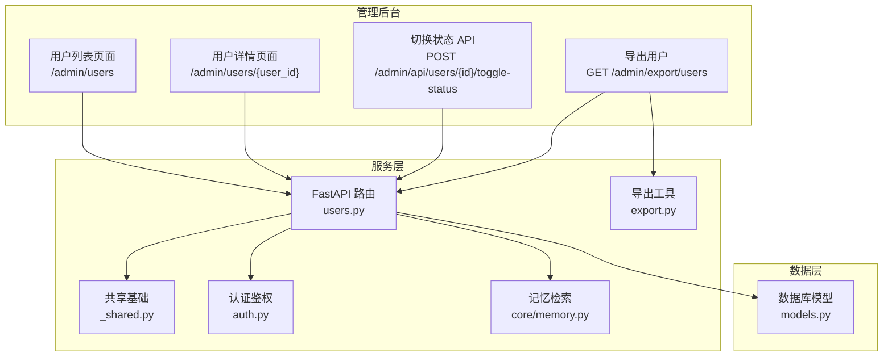
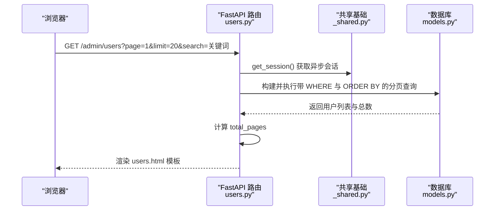
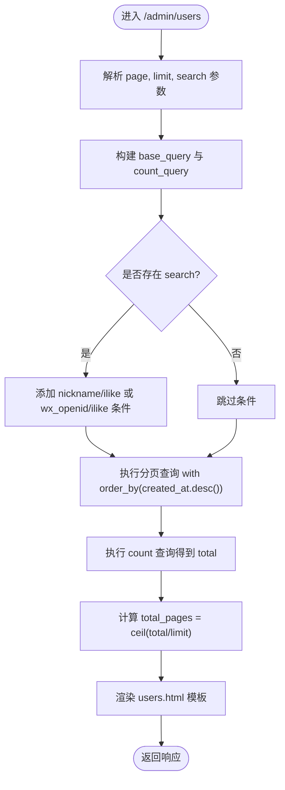
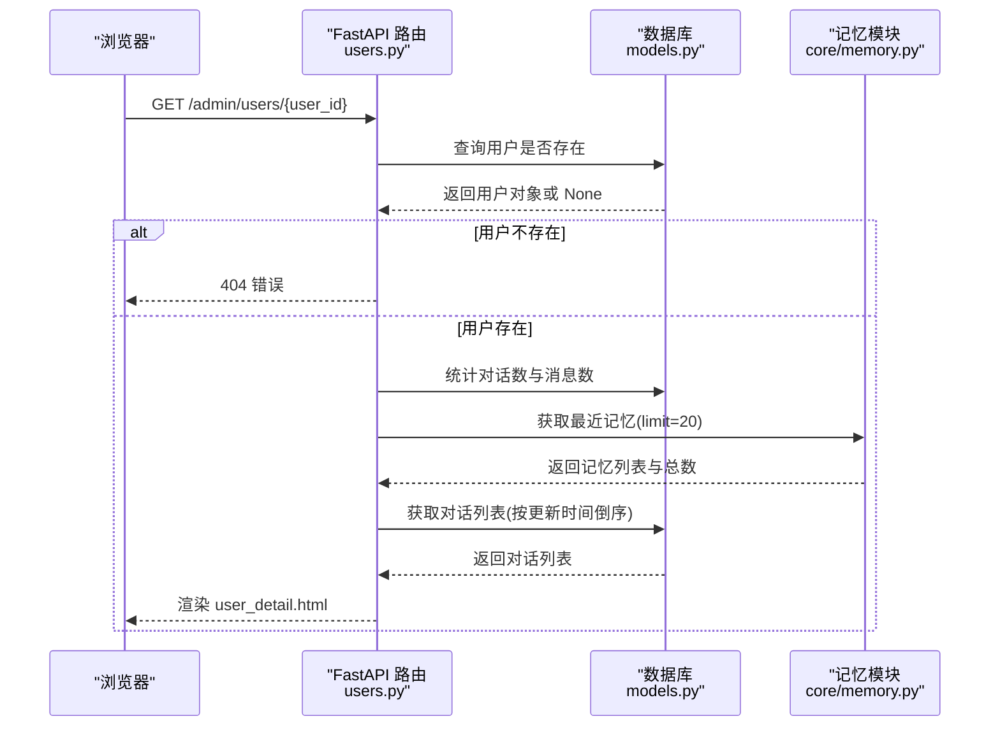
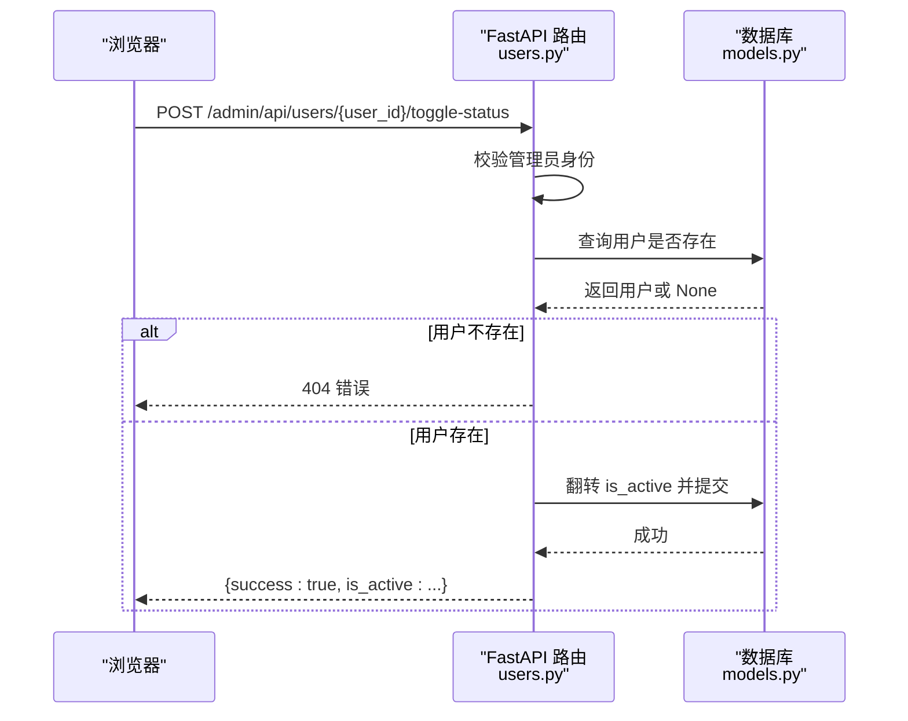
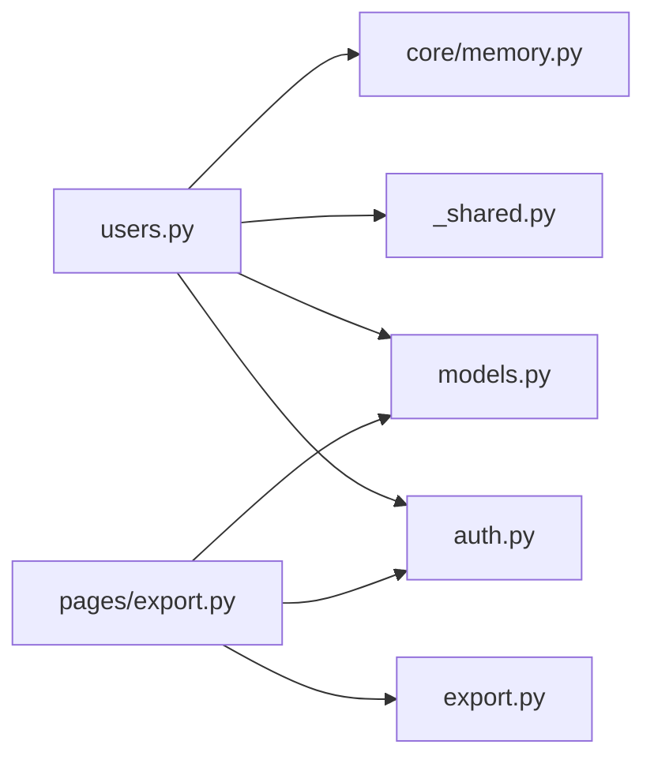

# 用户列表管理

<cite>
**本文引用的文件**   
- [hushai/meditation/admin/pages/users.py](file://hushai/meditation/admin/pages/users.py)
- [hushai/meditation/admin/templates/users.html](file://hushai/meditation/admin/templates/users.html)
- [hushai/meditation/db/models.py](file://hushai/meditation/db/models.py)
- [hushai/meditation/admin/pages/_shared.py](file://hushai/meditation/admin/pages/_shared.py)
- [hushai/meditation/core/memory.py](file://hushai/meditation/core/memory.py)
- [hushai/meditation/admin/export.py](file://hushai/meditation/admin/export.py)
- [hushai/meditation/admin/pages/export.py](file://hushai/meditation/admin/pages/export.py)
- [hushai/meditation/admin/auth.py](file://hushai/meditation/admin/auth.py)
</cite>

## 目录
1. [简介](#简介)
2. [项目结构](#项目结构)
3. [核心组件](#核心组件)
4. [架构总览](#架构总览)
5. [详细组件分析](#详细组件分析)
6. [依赖关系分析](#依赖关系分析)
7. [性能考虑](#性能考虑)
8. [故障排查指南](#故障排查指南)
9. [结论](#结论)
10. [附录：操作指南](#附录操作指南)

## 简介
本文件面向 hush.ai 管理后台的“用户列表”功能，覆盖以下方面：
- 用户信息展示、搜索筛选与分页显示机制
- 搜索实现原理（支持按昵称和微信 OpenID 模糊匹配）
- 分页查询优化策略（SQL 构建、总数统计、页码计算）
- 界面操作指南（搜索技巧、排序方式、批量操作能力说明）
- 性能优化建议与常见问题解决方案

## 项目结构
用户列表功能涉及后端路由、模板渲染、数据模型、导出工具与认证鉴权等模块。整体组织如下：
- 页面路由与业务逻辑：admin/pages/users.py
- 前端模板：admin/templates/users.html
- 数据模型：db/models.py
- 公共基础设施（模板、会话、统计上下文）：admin/pages/_shared.py
- 长期记忆相关（详情页使用）：core/memory.py
- 导出工具与导出路由：admin/export.py、admin/pages/export.py
- 管理员认证与 CSRF：admin/auth.py

图表来源
- [hushai/meditation/admin/pages/users.py:18-65](file://hushai/meditation/admin/pages/users.py#L18-L65)
- [hushai/meditation/admin/pages/users.py:68-123](file://hushai/meditation/admin/pages/users.py#L68-L123)
- [hushai/meditation/admin/pages/users.py:126-146](file://hushai/meditation/admin/pages/users.py#L126-L146)
- [hushai/meditation/admin/pages/_shared.py:24-32](file://hushai/meditation/admin/pages/_shared.py#L24-L32)
- [hushai/meditation/admin/export.py:92-106](file://hushai/meditation/admin/export.py#L92-L106)
- [hushai/meditation/core/memory.py:141-158](file://hushai/meditation/core/memory.py#L141-L158)
- [hushai/meditation/db/models.py:37-67](file://hushai/meditation/db/models.py#L37-L67)

章节来源
- [hushai/meditation/admin/pages/users.py:18-65](file://hushai/meditation/admin/pages/users.py#L18-L65)
- [hushai/meditation/admin/templates/users.html:14-42](file://hushai/meditation/admin/templates/users.html#L14-L42)
- [hushai/meditation/db/models.py:37-67](file://hushai/meditation/db/models.py#L37-L67)

## 核心组件
- 用户列表页面路由：负责接收分页与搜索参数，构建 SQL 查询，返回模板渲染结果
- 用户详情页面路由：加载用户基本信息、对话与消息计数、最近记忆与对话列表
- 用户状态切换 API：提供启用/禁用用户的异步接口
- 用户列表模板：渲染搜索栏、表格、分页控件与交互脚本
- 数据模型：定义 User 表结构与字段索引
- 导出功能：支持将当前搜索结果导出为 CSV/Excel
- 认证鉴权：确保仅登录的管理员可访问上述页面与接口

章节来源
- [hushai/meditation/admin/pages/users.py:18-65](file://hushai/meditation/admin/pages/users.py#L18-L65)
- [hushai/meditation/admin/pages/users.py:68-123](file://hushai/meditation/admin/pages/users.py#L68-L123)
- [hushai/meditation/admin/pages/users.py:126-146](file://hushai/meditation/admin/pages/users.py#L126-L146)
- [hushai/meditation/admin/templates/users.html:14-138](file://hushai/meditation/admin/templates/users.html#L14-L138)
- [hushai/meditation/db/models.py:37-67](file://hushai/meditation/db/models.py#L37-L67)
- [hushai/meditation/admin/pages/export.py:95-128](file://hushai/meditation/admin/pages/export.py#L95-L128)
- [hushai/meditation/admin/export.py:92-106](file://hushai/meditation/admin/export.py#L92-L106)
- [hushai/meditation/admin/auth.py:87-101](file://hushai/meditation/admin/auth.py#L87-L101)

## 架构总览
下图展示了从浏览器到数据库的关键调用链，包括用户列表查询、搜索过滤与分页流程。

图表来源
- [hushai/meditation/admin/pages/users.py:18-65](file://hushai/meditation/admin/pages/users.py#L18-L65)
- [hushai/meditation/admin/pages/_shared.py:24-32](file://hushai/meditation/admin/pages/_shared.py#L24-L32)
- [hushai/meditation/db/models.py:37-67](file://hushai/meditation/db/models.py#L37-L67)

## 详细组件分析

### 用户列表页面（/admin/users）
- 功能要点
  - 支持分页：page、limit 参数；默认每页 20 条
  - 支持搜索：按昵称或微信 OpenID 进行模糊匹配
  - 默认排序：按创建时间倒序
  - 返回模板变量：用户列表、总记录数、总页数、当前页、搜索词、每页条数
- 关键实现
  - 使用 SQLAlchemy 的 select 与 func.count 分别构造数据查询与总数查询
  - 当存在 search 时，对 nickname 与 wx_openid 同时应用 ilike 模糊匹配，并以 OR 组合
  - 通过 offset 与 limit 实现分页
  - 使用 (total + limit - 1) // limit 计算总页数

图表来源
- [hushai/meditation/admin/pages/users.py:18-65](file://hushai/meditation/admin/pages/users.py#L18-L65)

章节来源
- [hushai/meditation/admin/pages/users.py:18-65](file://hushai/meditation/admin/pages/users.py#L18-L65)
- [hushai/meditation/admin/templates/users.html:14-42](file://hushai/meditation/admin/templates/users.html#L14-L42)

### 用户详情页面（/admin/users/{user_id}）
- 功能要点
  - 校验用户是否存在，不存在返回 404
  - 统计该用户的对话数量与消息数量
  - 拉取最近记忆（限制条数）与对话列表（按更新时间倒序）
- 关键实现
  - 使用 select(func.count) 统计 Conversation 与 Message 数量
  - 调用 memory 模块的 get_user_memories 获取最近记忆
  - 使用 order_by(Conversation.updated_at.desc()) 获取对话列表

图表来源
- [hushai/meditation/admin/pages/users.py:68-123](file://hushai/meditation/admin/pages/users.py#L68-L123)
- [hushai/meditation/core/memory.py:141-158](file://hushai/meditation/core/memory.py#L141-L158)

章节来源
- [hushai/meditation/admin/pages/users.py:68-123](file://hushai/meditation/admin/pages/users.py#L68-L123)
- [hushai/meditation/core/memory.py:141-158](file://hushai/meditation/core/memory.py#L141-L158)

### 用户状态切换 API（POST /admin/api/users/{user_id}/toggle-status）
- 功能要点
  - 仅管理员可调用，未登录返回 401
  - 根据 user_id 查找用户，若不存在返回 404
  - 翻转 is_active 字段并提交事务，返回新状态
- 关键实现
  - 使用 select(User).where(User.id == user_id) 定位用户
  - 修改 is_active 后 session.commit()

图表来源
- [hushai/meditation/admin/pages/users.py:126-146](file://hushai/meditation/admin/pages/users.py#L126-L146)

章节来源
- [hushai/meditation/admin/pages/users.py:126-146](file://hushai/meditation/admin/pages/users.py#L126-L146)

### 用户列表模板（users.html）
- 功能要点
  - 搜索表单：提交至 /admin/users，支持“清除”按钮重置搜索
  - 工具栏：显示总用户数，提供 CSV/Excel 导出入口（携带当前搜索条件）
  - 表格列：用户头像与昵称、OpenID、注册时间、状态、操作
  - 分页控件：保留 search 参数，支持前后翻页与省略号显示
  - 交互脚本：点击启用/禁用按钮触发 toggleUserStatus，成功后刷新页面
- 关键实现
  - 使用 Jinja2 模板语法渲染用户列表与分页链接
  - 通过 onclick 调用全局函数发送异步请求更新用户状态

章节来源
- [hushai/meditation/admin/templates/users.html:14-138](file://hushai/meditation/admin/templates/users.html#L14-L138)
- [hushai/meditation/admin/templates/users.html:141-158](file://hushai/meditation/admin/templates/users.html#L141-L158)

### 数据模型（User）
- 关键字段
  - id：主键
  - wx_openid：唯一且建立索引
  - nickname：昵称
  - created_at：创建时间
  - is_active：是否启用
- 索引与约束
  - wx_openid 具备唯一性与索引，有利于精确查找与模糊搜索的性能
  - refresh_token_hash 与 refresh_token_selector 也具备索引，便于快速定位

章节来源
- [hushai/meditation/db/models.py:37-67](file://hushai/meditation/db/models.py#L37-L67)

### 导出功能（CSV/Excel）
- 功能要点
  - 支持导出当前搜索结果（包含搜索条件）
  - 支持 CSV 与 Excel 两种格式
  - 文件名自动附加时间戳
- 关键实现
  - export_users 路由复用与列表页一致的搜索条件
  - 使用 openpyxl 生成 Excel，csv.DictWriter 生成 CSV
  - 统一封装 get_export_response 选择输出格式

章节来源
- [hushai/meditation/admin/pages/export.py:95-128](file://hushai/meditation/admin/pages/export.py#L95-L128)
- [hushai/meditation/admin/export.py:92-106](file://hushai/meditation/admin/export.py#L92-L106)

### 认证与鉴权
- 功能要点
  - 所有管理后台页面与 API 均需管理员登录
  - 支持 Cookie 与 Authorization Bearer 两种方式读取 token
  - 未登录时重定向到登录页或返回 401
- 关键实现
  - get_admin_from_request 从 cookie 或 header 提取 token 并验证
  - require_admin_page 与 require_admin_api 用于统一鉴权

章节来源
- [hushai/meditation/admin/auth.py:87-101](file://hushai/meditation/admin/auth.py#L87-L101)
- [hushai/meditation/admin/pages/_shared.py:73-91](file://hushai/meditation/admin/pages/_shared.py#L73-L91)

## 依赖关系分析
- 页面路由依赖
  - 认证：get_admin_from_request
  - 会话：get_session
  - 模板：Jinja2Templates
  - 模型：User、Conversation、Message
  - 记忆：get_user_memories
- 导出路由依赖
  - 认证：get_admin_from_request
  - 会话：get_session
  - 导出工具：get_export_response
  - 模型：User、Memory、KnowledgeChunk、AuditLog

图表来源
- [hushai/meditation/admin/pages/users.py:18-65](file://hushai/meditation/admin/pages/users.py#L18-L65)
- [hushai/meditation/admin/pages/export.py:95-128](file://hushai/meditation/admin/pages/export.py#L95-L128)
- [hushai/meditation/admin/export.py:92-106](file://hushai/meditation/admin/export.py#L92-L106)

章节来源
- [hushai/meditation/admin/pages/users.py:18-65](file://hushai/meditation/admin/pages/users.py#L18-L65)
- [hushai/meditation/admin/pages/export.py:95-128](file://hushai/meditation/admin/pages/export.py#L95-L128)

## 性能考虑
- 搜索优化
  - 使用 ilike 进行模糊匹配，建议在 wx_openid 与 nickname 上建立索引以加速 LIKE 查询
  - 避免在 search 为空时仍添加条件，减少不必要的扫描
- 分页优化
  - 使用独立的 count 查询统计总数，避免全表扫描后再切片
  - 合理设置 limit（默认 20），避免单页数据过大导致渲染与传输开销
- 排序优化
  - 列表按 created_at 倒序，建议在 created_at 上建立索引以提升排序性能
- 导出优化
  - 大结果集导出建议使用流式响应，避免一次性加载全部数据到内存
  - 控制导出字段数量，减少序列化与网络传输成本
- 缓存建议
  - 对于高频访问的统计信息（如总用户数），可在应用层引入短期缓存
  - 注意缓存失效策略，保证数据一致性

[本节为通用性能指导，不直接分析具体文件]

## 故障排查指南
- 未登录访问被拒绝
  - 现象：访问 /admin/users 或调用 toggle-status 返回 401 或重定向到登录页
  - 排查：检查 admin_token 是否正确设置，或 Authorization 头是否包含有效 Bearer token
- 用户不存在
  - 现象：访问 /admin/users/{user_id} 或切换状态返回 404
  - 排查：确认 user_id 是否存在于数据库
- 搜索无结果
  - 现象：输入关键词后列表为空
  - 排查：确认关键词是否匹配 nickname 或 wx_openid；检查数据库字段值与大小写
- 分页异常
  - 现象：页码跳转后数据重复或缺失
  - 排查：检查 page 与 limit 参数传递是否正确；确认数据库连接与会话是否正常
- 导出失败
  - 现象：导出 CSV/Excel 报错或文件为空
  - 排查：检查导出路由是否携带正确的 format 参数；确认 openpyxl 与 csv 库可用

章节来源
- [hushai/meditation/admin/auth.py:87-101](file://hushai/meditation/admin/auth.py#L87-L101)
- [hushai/meditation/admin/pages/users.py:68-123](file://hushai/meditation/admin/pages/users.py#L68-L123)
- [hushai/meditation/admin/pages/users.py:126-146](file://hushai/meditation/admin/pages/users.py#L126-L146)
- [hushai/meditation/admin/pages/export.py:95-128](file://hushai/meditation/admin/pages/export.py#L95-L128)

## 结论
用户列表管理功能实现了清晰的分层架构与良好的用户体验：
- 后端通过 FastAPI 路由与 SQLAlchemy 构建高效的分页与搜索查询
- 前端模板提供直观的搜索、分页与状态切换交互
- 导出功能支持在当前搜索条件下批量导出数据
- 认证与鉴权保障管理后台的安全性
- 针对大数据量场景，可通过索引、分页与流式导出等手段进一步优化性能

[本节为总结性内容，不直接分析具体文件]

## 附录：操作指南
- 搜索技巧
  - 在搜索框输入昵称或 OpenID 的部分字符即可触发模糊搜索
  - 点击“清除”按钮可重置搜索条件
- 排序方式
  - 列表默认按注册时间倒序显示
- 分页显示
  - 使用分页控件进行翻页，当前页高亮显示
  - 搜索条件会随分页链接一并传递
- 批量操作
  - 当前版本提供单个用户的启用/禁用操作
  - 如需批量操作，可在后续扩展批量选择与批量状态切换功能
- 导出
  - 点击“CSV”或“Excel”按钮，下载当前搜索结果的数据文件

章节来源
- [hushai/meditation/admin/templates/users.html:14-138](file://hushai/meditation/admin/templates/users.html#L14-L138)
- [hushai/meditation/admin/pages/export.py:95-128](file://hushai/meditation/admin/pages/export.py#L95-L128)