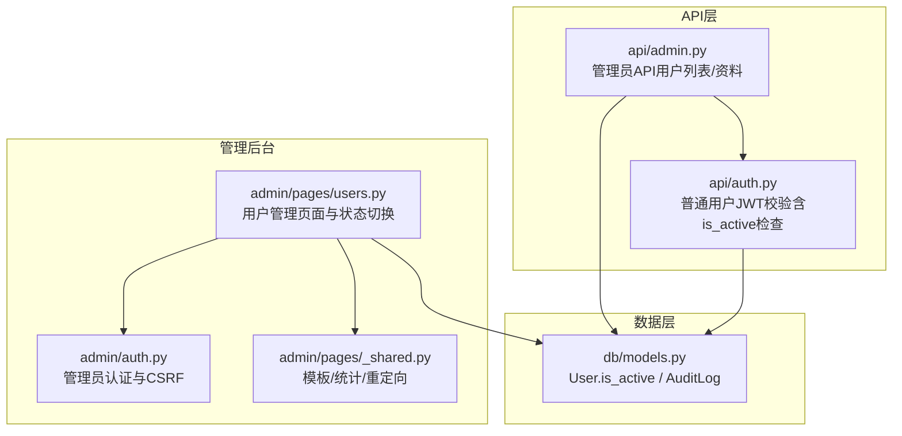
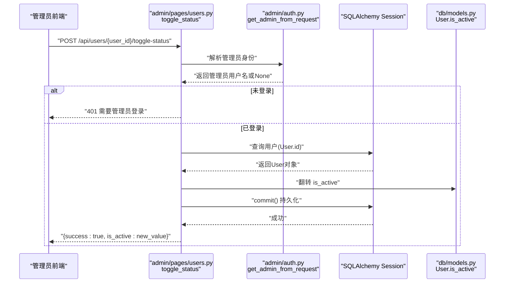
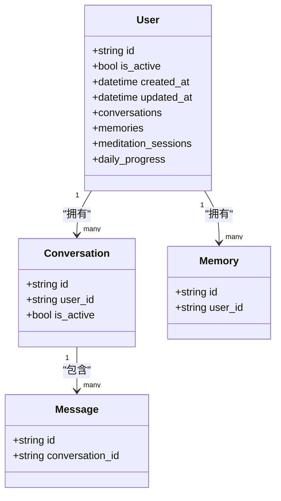
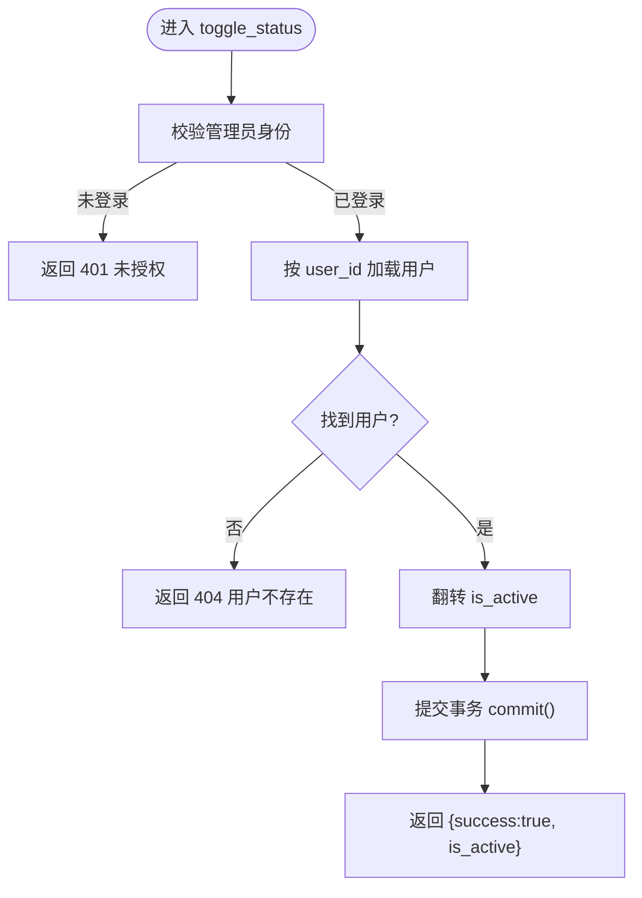
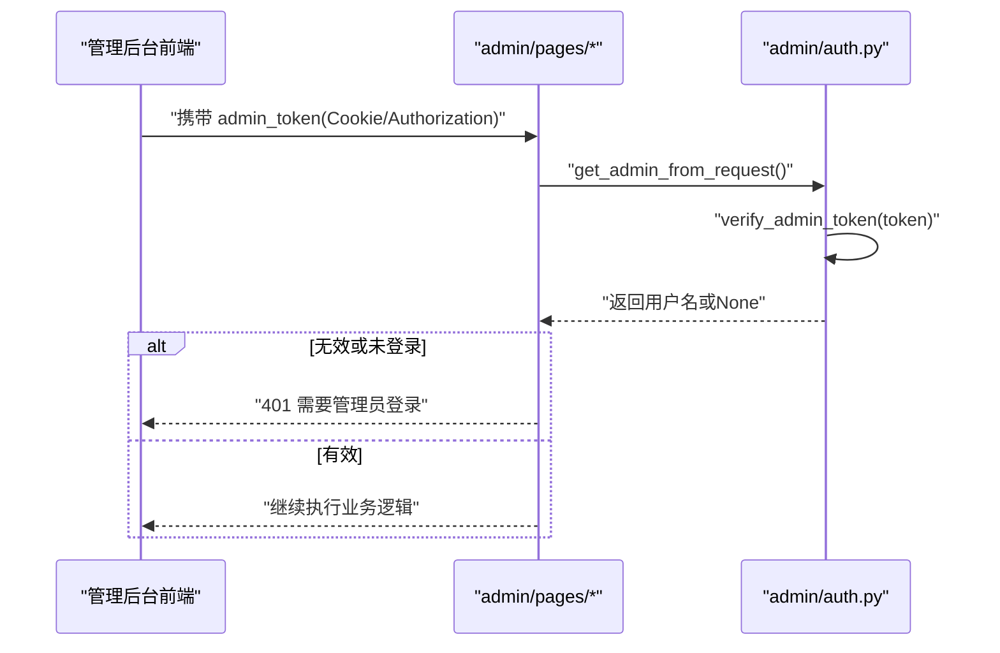
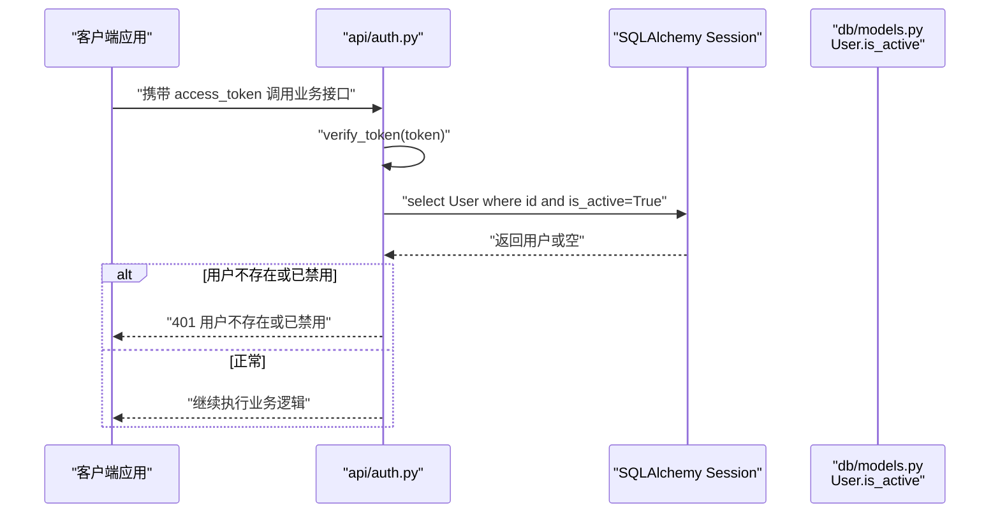
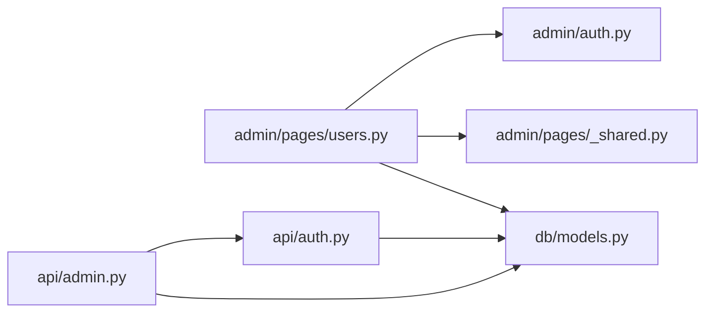

# 用户状态管理

<cite>
**本文引用的文件**   
- [hushai/meditation/db/models.py](file://hushai/meditation/db/models.py)
- [hushai/meditation/admin/pages/users.py](file://hushai/meditation/admin/pages/users.py)
- [hushai/meditation/api/admin.py](file://hushai/meditation/api/admin.py)
- [hushai/meditation/api/auth.py](file://hushai/meditation/api/auth.py)
- [hushai/meditation/admin/auth.py](file://hushai/meditation/admin/auth.py)
- [hushai/meditation/admin/pages/_shared.py](file://hushai/meditation/admin/pages/_shared.py)
</cite>

## 目录
1. [简介](#简介)
2. [项目结构](#项目结构)
3. [核心组件](#核心组件)
4. [架构总览](#架构总览)
5. [详细组件分析](#详细组件分析)
6. [依赖关系分析](#依赖关系分析)
7. [性能考虑](#性能考虑)
8. [故障排查指南](#故障排查指南)
9. [结论](#结论)
10. [附录](#附录)

## 简介
本文件聚焦 hush.ai 管理后台的“用户状态管理”能力，围绕以下目标展开：
- 说明用户启用/禁用状态的切换实现原理（数据库字段、事务提交与返回结果）
- 阐述权限验证机制，确保只有管理员可执行状态变更
- 解释状态变更对业务的影响范围（登录、对话等）
- 提供最佳实践建议（批量操作、审计日志、数据一致性）
- 给出错误处理与异常应对方案

## 项目结构
与用户状态管理直接相关的代码分布在以下模块：
- 数据模型：User 实体包含 is_active 字段，用于表示用户是否可用
- 管理后台页面路由：提供用户列表、详情以及状态切换接口
- 管理员鉴权：基于 Cookie/Authorization 的管理员令牌校验
- 普通用户鉴权：在获取当前用户时强制检查 is_active
- 共享基础设施：统一的重定向与模板渲染

图表来源
- [hushai/meditation/admin/pages/users.py:1-146](file://hushai/meditation/admin/pages/users.py#L1-L146)
- [hushai/meditation/admin/auth.py:1-183](file://hushai/meditation/admin/auth.py#L1-L183)
- [hushai/meditation/admin/pages/_shared.py:1-110](file://hushai/meditation/admin/pages/_shared.py#L1-L110)
- [hushai/meditation/api/admin.py:1-268](file://hushai/meditation/api/admin.py#L1-L268)
- [hushai/meditation/api/auth.py:1-171](file://hushai/meditation/api/auth.py#L1-L171)
- [hushai/meditation/db/models.py:1-434](file://hushai/meditation/db/models.py#L1-L434)

章节来源
- [hushai/meditation/admin/pages/users.py:1-146](file://hushai/meditation/admin/pages/users.py#L1-L146)
- [hushai/meditation/admin/auth.py:1-183](file://hushai/meditation/admin/auth.py#L1-L183)
- [hushai/meditation/admin/pages/_shared.py:1-110](file://hushai/meditation/admin/pages/_shared.py#L1-L110)
- [hushai/meditation/api/admin.py:1-268](file://hushai/meditation/api/admin.py#L1-L268)
- [hushai/meditation/api/auth.py:1-171](file://hushai/meditation/api/auth.py#L1-L171)
- [hushai/meditation/db/models.py:1-434](file://hushai/meditation/db/models.py#L1-L434)

## 核心组件
- 用户模型与状态字段
  - User 表包含 is_active 布尔字段，默认启用。该字段是控制用户可用性的关键开关。
- 管理后台用户状态切换接口
  - 提供 POST /api/users/{user_id}/toggle-status，仅允许已登录管理员调用，读取并翻转 is_active，提交事务后返回新状态。
- 管理员认证
  - 通过 get_admin_from_request 从 Cookie 或 Authorization 头解析管理员 JWT，校验 is_admin 标志，未登录则拒绝访问。
- 普通用户认证与状态联动
  - get_current_user_id 在解析用户身份时强制要求 User.is_active 为真，否则拒绝登录/刷新 token。

章节来源
- [hushai/meditation/db/models.py:37-66](file://hushai/meditation/db/models.py#L37-L66)
- [hushai/meditation/admin/pages/users.py:126-146](file://hushai/meditation/admin/pages/users.py#L126-L146)
- [hushai/meditation/admin/auth.py:87-113](file://hushai/meditation/admin/auth.py#L87-L113)
- [hushai/meditation/api/auth.py:121-131](file://hushai/meditation/api/auth.py#L121-L131)

## 架构总览
下图展示了“管理员切换用户状态”的端到端流程，包括权限校验、数据库更新与返回结果。

图表来源
- [hushai/meditation/admin/pages/users.py:126-146](file://hushai/meditation/admin/pages/users.py#L126-L146)
- [hushai/meditation/admin/auth.py:87-113](file://hushai/meditation/admin/auth.py#L87-L113)
- [hushai/meditation/db/models.py:37-66](file://hushai/meditation/db/models.py#L37-L66)

## 详细组件分析

### 用户模型与状态字段
- 关键字段
  - User.is_active：布尔型，默认 True，表示用户是否处于可用状态。
- 关联关系
  - 用户拥有对话、消息、记忆、冥想会话、每日进度等关联实体；这些实体的读写通常以用户身份为前提，受用户状态影响。

图表来源
- [hushai/meditation/db/models.py:37-66](file://hushai/meditation/db/models.py#L37-L66)
- [hushai/meditation/db/models.py:69-96](file://hushai/meditation/db/models.py#L69-L96)
- [hushai/meditation/db/models.py:98-117](file://hushai/meditation/db/models.py#L98-L117)

章节来源
- [hushai/meditation/db/models.py:37-66](file://hushai/meditation/db/models.py#L37-L66)
- [hushai/meditation/db/models.py:69-96](file://hushai/meditation/db/models.py#L69-L96)
- [hushai/meditation/db/models.py:98-117](file://hushai/meditation/db/models.py#L98-L117)

### 管理后台用户状态切换接口
- 入口
  - 路由：POST /api/users/{user_id}/toggle-status
  - 功能：读取指定用户，翻转 is_active，提交事务，返回新状态
- 权限校验
  - 使用 get_admin_from_request 校验管理员身份，未登录返回 401
- 数据一致性
  - 采用单条记录的读取-修改-提交模式，保证原子性；如需扩展为批量操作，应引入事务边界与失败回滚策略

图表来源
- [hushai/meditation/admin/pages/users.py:126-146](file://hushai/meditation/admin/pages/users.py#L126-L146)
- [hushai/meditation/admin/auth.py:87-113](file://hushai/meditation/admin/auth.py#L87-L113)

章节来源
- [hushai/meditation/admin/pages/users.py:126-146](file://hushai/meditation/admin/pages/users.py#L126-L146)
- [hushai/meditation/admin/auth.py:87-113](file://hushai/meditation/admin/auth.py#L87-L113)

### 管理员认证机制
- 令牌来源
  - 优先从 Cookie 中读取 admin_token，其次从 Authorization: Bearer ... 头解析
- 令牌校验
  - verify_admin_token 解码 JWT，并要求 is_admin 标志为真
- 辅助工具
  - require_admin 装饰器可在视图函数上统一进行鉴权
  - CSRF 保护：require_csrf 对写操作进行 CSRF 校验

图表来源
- [hushai/meditation/admin/auth.py:87-113](file://hushai/meditation/admin/auth.py#L87-L113)
- [hushai/meditation/admin/auth.py:173-182](file://hushai/meditation/admin/auth.py#L173-L182)

章节来源
- [hushai/meditation/admin/auth.py:87-113](file://hushai/meditation/admin/auth.py#L87-L113)
- [hushai/meditation/admin/auth.py:173-182](file://hushai/meditation/admin/auth.py#L173-L182)

### 普通用户认证与状态联动
- 登录与刷新
  - wx_login 创建 access_token 与 refresh_token，并写入用户记录
  - refresh_access_token 通过 selector 定位用户并校验原 token
- 状态检查
  - get_current_user_id 在每次鉴权时强制要求 User.is_active 为真，否则抛出“用户不存在或已禁用”
  - 这意味着一旦用户被禁用，其后续所有需要用户身份的请求（如聊天、记忆、咨询等）均会被拒绝

图表来源
- [hushai/meditation/api/auth.py:109-131](file://hushai/meditation/api/auth.py#L109-L131)
- [hushai/meditation/api/auth.py:134-164](file://hushai/meditation/api/auth.py#L134-L164)
- [hushai/meditation/db/models.py:37-66](file://hushai/meditation/db/models.py#L37-L66)

章节来源
- [hushai/meditation/api/auth.py:109-131](file://hushai/meditation/api/auth.py#L109-L131)
- [hushai/meditation/api/auth.py:134-164](file://hushai/meditation/api/auth.py#L134-L164)
- [hushai/meditation/db/models.py:37-66](file://hushai/meditation/db/models.py#L37-L66)

### 管理后台用户列表与详情
- 用户列表
  - GET /users：分页、搜索（昵称或 openid），展示用户基础信息与 is_active
- 用户详情
  - GET /users/{user_id}：展示用户基本信息、对话数量、消息数量、最近记忆与对话列表

章节来源
- [hushai/meditation/admin/pages/users.py:18-65](file://hushai/meditation/admin/pages/users.py#L18-L65)
- [hushai/meditation/admin/pages/users.py:68-123](file://hushai/meditation/admin/pages/users.py#L68-L123)

### 管理员 API（用户资料与列表）
- 用户资料
  - GET /api/admin/users/{user_id}/profile：返回用户基本信息、对话与消息计数、记忆分类汇总
- 用户列表
  - GET /api/admin/users：分页返回用户 ID、昵称、创建时间与 is_active

章节来源
- [hushai/meditation/api/admin.py:37-74](file://hushai/meditation/api/admin.py#L37-L74)
- [hushai/meditation/api/admin.py:77-103](file://hushai/meditation/api/admin.py#L77-L103)

## 依赖关系分析
- 管理后台页面路由依赖管理员认证与模板渲染基础设施
- 管理员 API 依赖统一的 session 依赖与管理员鉴权
- 普通用户 API 依赖 JWT 校验并在鉴权阶段检查 is_active
- 数据层由 SQLAlchemy ORM 提供，User.is_active 贯穿鉴权与业务逻辑

图表来源
- [hushai/meditation/admin/pages/users.py:1-146](file://hushai/meditation/admin/pages/users.py#L1-L146)
- [hushai/meditation/admin/auth.py:1-183](file://hushai/meditation/admin/auth.py#L1-L183)
- [hushai/meditation/admin/pages/_shared.py:1-110](file://hushai/meditation/admin/pages/_shared.py#L1-L110)
- [hushai/meditation/api/admin.py:1-268](file://hushai/meditation/api/admin.py#L1-L268)
- [hushai/meditation/api/auth.py:1-171](file://hushai/meditation/api/auth.py#L1-L171)
- [hushai/meditation/db/models.py:1-434](file://hushai/meditation/db/models.py#L1-L434)

章节来源
- [hushai/meditation/admin/pages/users.py:1-146](file://hushai/meditation/admin/pages/users.py#L1-L146)
- [hushai/meditation/admin/auth.py:1-183](file://hushai/meditation/admin/auth.py#L1-L183)
- [hushai/meditation/admin/pages/_shared.py:1-110](file://hushai/meditation/admin/pages/_shared.py#L1-L110)
- [hushai/meditation/api/admin.py:1-268](file://hushai/meditation/api/admin.py#L1-L268)
- [hushai/meditation/api/auth.py:1-171](file://hushai/meditation/api/auth.py#L1-L171)
- [hushai/meditation/db/models.py:1-434](file://hushai/meditation/db/models.py#L1-L434)

## 性能考虑
- 鉴权路径短且高效：管理员令牌校验与普通用户 JWT 校验均为 O(1) 计算，随后一次数据库查询即可判定可用性
- 状态切换为单行更新：事务开销小，适合高频管理操作
- 列表与详情查询已使用分页与聚合计数，避免全表扫描
- 建议
  - 批量状态变更时，使用批量更新语句减少往返次数
  - 对热点用户列表增加缓存层（如 Redis）以降低数据库压力
  - 审计日志写入异步化，避免阻塞主流程

[本节为通用指导，不直接分析具体文件]

## 故障排查指南
- 常见错误码与原因
  - 401 需要管理员登录：未携带有效 admin_token 或令牌过期/非法
  - 404 用户不存在：指定的 user_id 不存在
  - 401 用户不存在或已禁用：普通用户 JWT 校验通过但 is_active 为 False
- 排查步骤
  - 确认管理员登录态：检查 Cookie 或 Authorization 头是否正确设置
  - 核对用户状态：查看数据库中 User.is_active 是否为 True
  - 检查事务提交：确认后端是否成功 commit，必要时查看数据库事务日志
  - 审计日志：通过管理后台审计日志页面导出与筛选，定位问题时间点与操作人

章节来源
- [hushai/meditation/admin/pages/users.py:126-146](file://hushai/meditation/admin/pages/users.py#L126-L146)
- [hushai/meditation/api/auth.py:121-131](file://hushai/meditation/api/auth.py#L121-L131)

## 结论
- 用户状态管理以 User.is_active 为核心开关，结合管理员鉴权与用户鉴权，形成闭环控制
- 状态切换接口简洁可靠，具备明确的错误响应与幂等性（多次切换等价于翻转）
- 建议在现有基础上完善审计日志记录与批量操作支持，进一步提升可观测性与运维效率

[本节为总结性内容，不直接分析具体文件]

## 附录

### 业务影响范围
- 登录与会话
  - 禁用用户将无法通过 get_current_user_id 校验，导致无法登录或刷新 token
- 对话与消息
  - 由于对话与消息均以用户身份为前提，禁用用户后将无法发起新的对话或发送消息
- 记忆与冥想会话
  - 同理，相关资源读写均受用户身份限制，禁用用户将不可用

章节来源
- [hushai/meditation/api/auth.py:121-131](file://hushai/meditation/api/auth.py#L121-L131)
- [hushai/meditation/db/models.py:37-66](file://hushai/meditation/db/models.py#L37-L66)
- [hushai/meditation/db/models.py:69-96](file://hushai/meditation/db/models.py#L69-L96)
- [hushai/meditation/db/models.py:98-117](file://hushai/meditation/db/models.py#L98-L117)

### 最佳实践建议
- 批量操作
  - 提供批量状态切换接口，使用事务包裹多条更新，失败时整体回滚
  - 对大批量更新进行分页与限流，避免长时间锁表
- 审计日志
  - 在状态切换成功后追加审计记录，记录管理员、动作、资源类型与资源ID
  - 提供审计日志导出与筛选能力，便于合规与回溯
- 数据一致性
  - 使用显式事务边界，确保状态变更与其他副作用（如通知、指标更新）的一致性
  - 对并发场景增加乐观锁或版本号字段，防止覆盖更新

[本节为通用指导，不直接分析具体文件]