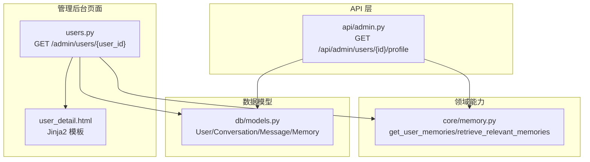
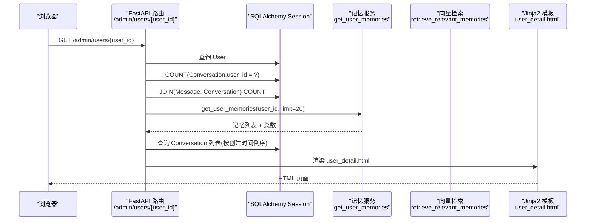
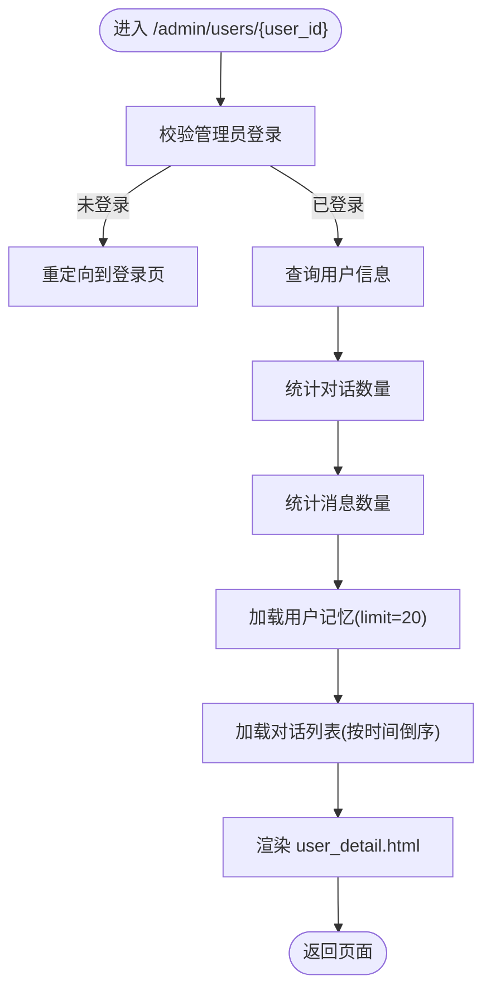
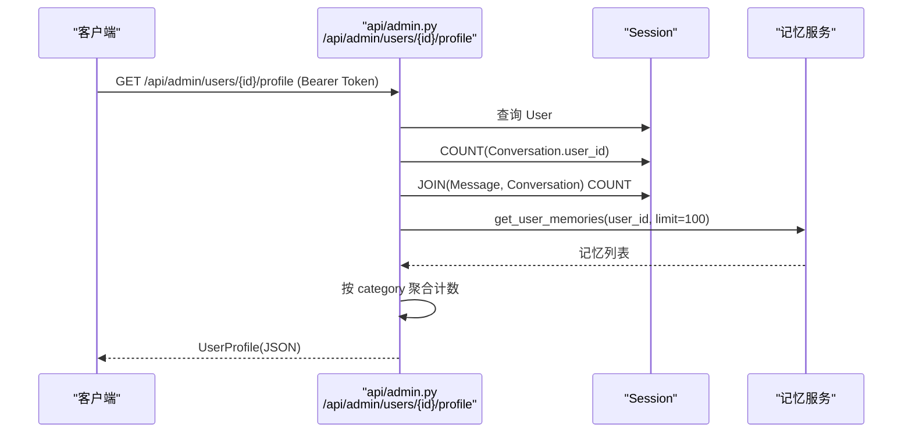
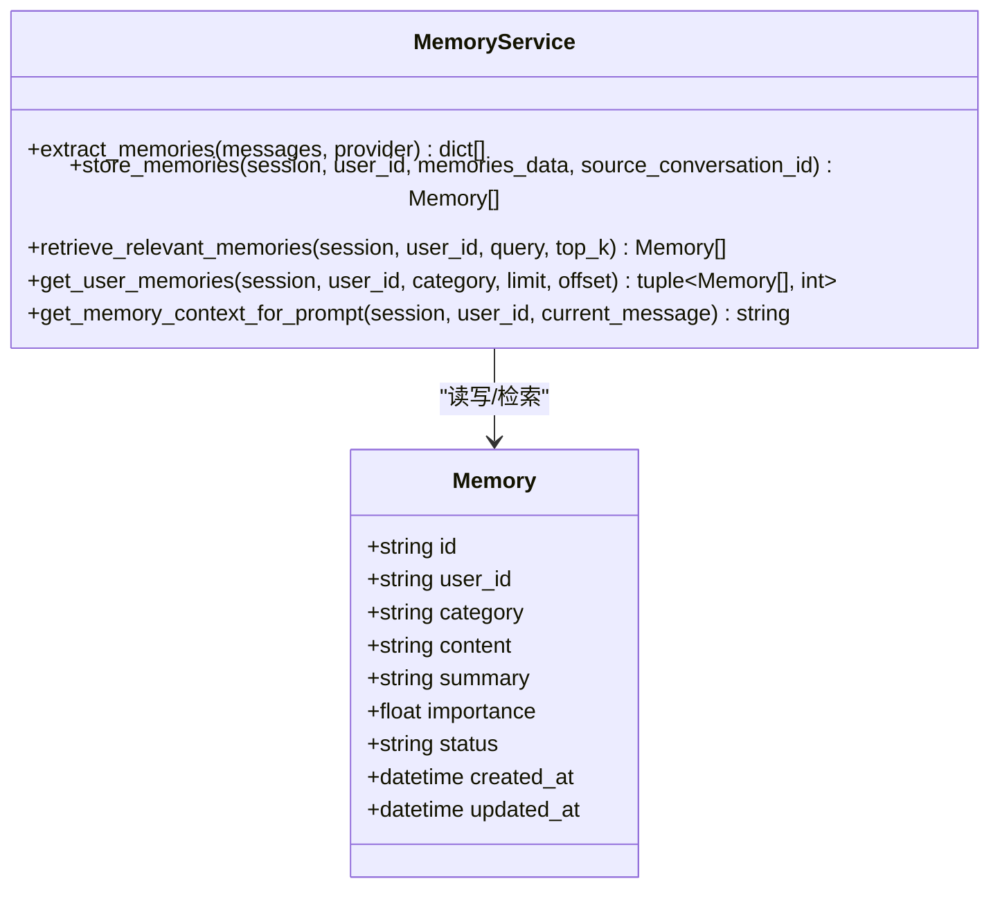
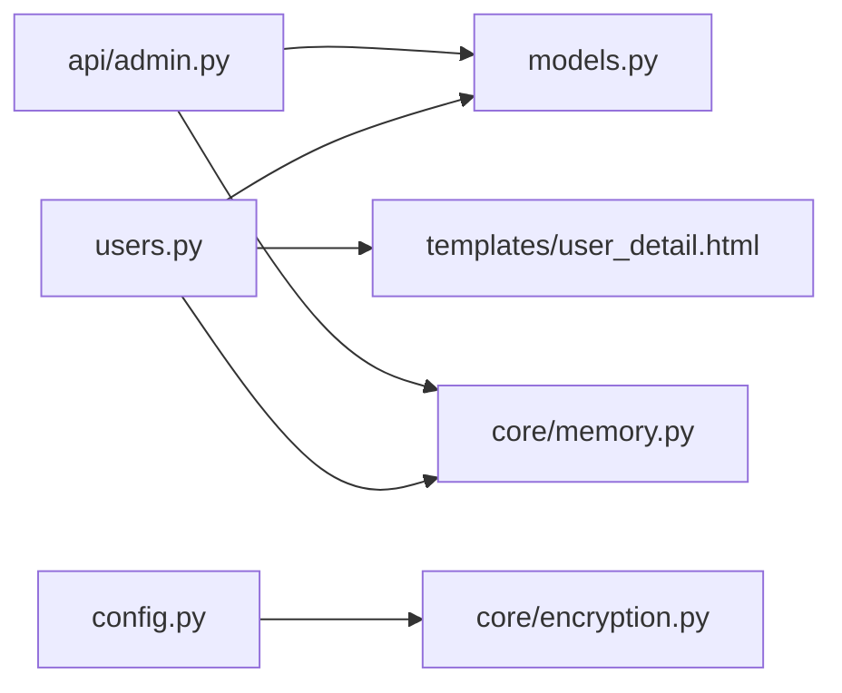
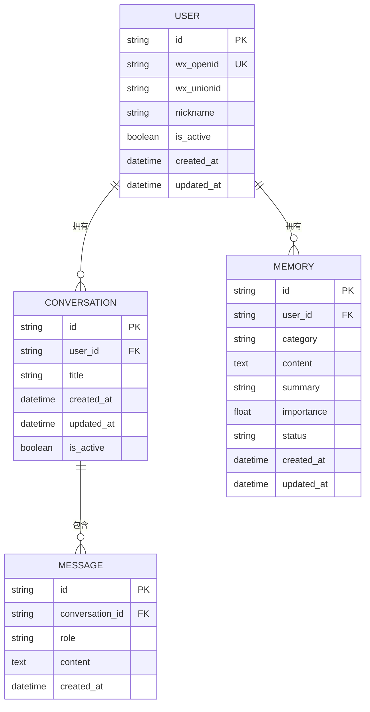

# 用户详情查看

<cite>
**本文引用的文件**   
- [hushai/meditation/admin/pages/users.py](file://hushai/meditation/admin/pages/users.py)
- [hushai/meditation/admin/templates/user_detail.html](file://hushai/meditation/admin/templates/user_detail.html)
- [hushai/meditation/api/admin.py](file://hushai/meditation/api/admin.py)
- [hushai/meditation/db/models.py](file://hushai/meditation/db/models.py)
- [hushai/meditation/core/memory.py](file://hushai/meditation/core/memory.py)
- [hushai/meditation/schemas.py](file://hushai/meditation/schemas.py)
- [hushai/meditation/config.py](file://hushai/meditation/config.py)
- [hushai/meditation/core/encryption.py](file://hushai/meditation/core/encryption.py)
</cite>

## 目录
1. [简介](#简介)
2. [项目结构](#项目结构)
3. [核心组件](#核心组件)
4. [架构总览](#架构总览)
5. [详细组件分析](#详细组件分析)
6. [依赖关系分析](#依赖关系分析)
7. [性能考量](#性能考量)
8. [故障排查指南](#故障排查指南)
9. [结论](#结论)
10. [附录](#附录)

## 简介
本文件面向 hush.ai 管理后台的“用户详情查看”功能，系统性说明以下方面：
- 用户详情页面的数据获取与处理逻辑（基本信息、对话统计、记忆内容、对话历史）
- 数据统计功能的实现（对话数量、消息数量、用户行为分析）
- 记忆内容的展示机制（长期记忆的提取、存储、检索）
- 对话历史查看方法（时间线展示与内容浏览）
- 用户隐私保护与数据安全配置说明

## 项目结构
围绕“用户详情查看”的关键代码分布在以下位置：
- 页面路由与模板渲染：admin/pages/users.py 与 admin/templates/user_detail.html
- 管理员 API：api/admin.py（提供用户画像与统计）
- 数据模型：db/models.py（User、Conversation、Message、Memory 等）
- 记忆模块：core/memory.py（记忆提取、存储、检索）
- 响应模型：schemas.py（UserProfile 等）
- 配置与安全：config.py、core/encryption.py

图表来源
- [hushai/meditation/admin/pages/users.py:68-123](file://hushai/meditation/admin/pages/users.py#L68-L123)
- [hushai/meditation/admin/templates/user_detail.html:1-207](file://hushai/meditation/admin/templates/user_detail.html#L1-L207)
- [hushai/meditation/api/admin.py:37-74](file://hushai/meditation/api/admin.py#L37-L74)
- [hushai/meditation/core/memory.py:141-158](file://hushai/meditation/core/memory.py#L141-L158)
- [hushai/meditation/db/models.py:37-118](file://hushai/meditation/db/models.py#L37-L118)

章节来源
- [hushai/meditation/admin/pages/users.py:68-123](file://hushai/meditation/admin/pages/users.py#L68-L123)
- [hushai/meditation/admin/templates/user_detail.html:1-207](file://hushai/meditation/admin/templates/user_detail.html#L1-L207)
- [hushai/meditation/api/admin.py:37-74](file://hushai/meditation/api/admin.py#L37-L74)
- [hushai/meditation/db/models.py:37-118](file://hushai/meditation/db/models.py#L37-L118)
- [hushai/meditation/core/memory.py:141-158](file://hushai/meditation/core/memory.py#L141-L158)

## 核心组件
- 用户详情页面路由：负责鉴权、查询用户信息、计算对话与消息统计、拉取近期记忆与对话列表，并渲染 user_detail.html。
- 用户详情模板：展示用户头像、昵称、状态、ID、OpenID/UnionID、注册时间、更新时间；统计卡片显示对话数、消息数、记忆条目数；展示最近记忆与最近对话列表，并提供启用/禁用操作入口。
- 管理员 API：提供 /api/admin/users/{user_id}/profile，返回用户画像与统计摘要（包含按类别的记忆汇总）。
- 记忆模块：提供 get_user_memories 用于分页拉取用户活跃记忆；retrieve_relevant_memories 基于向量检索相关记忆；extract_memories/store_memories 支持从对话中提取并持久化记忆。
- 数据模型：User、Conversation、Message、Memory 等 ORM 定义，支撑统计与关联查询。
- 配置与安全：MeditationConfig 提供加密密钥等配置项；encryption 模块提供敏感字段加解密与 PII 脱敏工具。

章节来源
- [hushai/meditation/admin/pages/users.py:68-123](file://hushai/meditation/admin/pages/users.py#L68-L123)
- [hushai/meditation/admin/templates/user_detail.html:1-207](file://hushai/meditation/admin/templates/user_detail.html#L1-L207)
- [hushai/meditation/api/admin.py:37-74](file://hushai/meditation/api/admin.py#L37-L74)
- [hushai/meditation/core/memory.py:45-112](file://hushai/meditation/core/memory.py#L45-L112)
- [hushai/meditation/db/models.py:37-118](file://hushai/meditation/db/models.py#L37-L118)
- [hushai/meditation/config.py:18-62](file://hushai/meditation/config.py#L18-L62)
- [hushai/meditation/core/encryption.py:18-48](file://hushai/meditation/core/encryption.py#L18-L48)

## 架构总览
下图展示了“用户详情查看”在请求生命周期中的关键交互：浏览器访问页面 -> FastAPI 路由鉴权 -> 数据库查询统计与数据 -> 调用记忆服务 -> 渲染模板。

图表来源
- [hushai/meditation/admin/pages/users.py:68-123](file://hushai/meditation/admin/pages/users.py#L68-L123)
- [hushai/meditation/core/memory.py:141-158](file://hushai/meditation/core/memory.py#L141-L158)
- [hushai/meditation/db/models.py:69-118](file://hushai/meditation/db/models.py#L69-L118)
- [hushai/meditation/admin/templates/user_detail.html:1-207](file://hushai/meditation/admin/templates/user_detail.html#L1-L207)

## 详细组件分析

### 用户详情页面路由（/admin/users/{user_id}）
- 鉴权：通过会话上下文校验管理员身份，未登录重定向至登录页。
- 数据获取：
  - 用户基本信息：根据 id 查询 User。
  - 对话数量统计：COUNT(Conversation WHERE user_id)。
  - 消息数量统计：JOIN(Message, Conversation) 后 COUNT。
  - 记忆内容：调用 get_user_memories 获取前 N 条活跃记忆。
  - 对话历史：按 created_at 倒序拉取 Conversation 列表。
- 渲染：将上述数据传入 user_detail.html 进行展示。

图表来源
- [hushai/meditation/admin/pages/users.py:68-123](file://hushai/meditation/admin/pages/users.py#L68-L123)

章节来源
- [hushai/meditation/admin/pages/users.py:68-123](file://hushai/meditation/admin/pages/users.py#L68-L123)

### 用户详情模板（user_detail.html）
- 基本信息区：头像、昵称、状态标签、用户 ID、OpenID、UnionID、注册/更新时间。
- 统计信息区：对话数、消息数、记忆条目数。
- 操作按钮：启用/禁用用户（POST /admin/api/users/{user_id}/toggle-status）、查看对话、查看记忆。
- 记忆列表：展示最近最多 10 条记忆，含分类标签、日期、内容摘要。
- 对话列表：展示最近最多 10 条对话，含标题、创建/更新时间、查看详情链接。
- 前端交互：点击启用/禁用按钮时发起异步请求，成功后提示并刷新页面。

章节来源
- [hushai/meditation/admin/templates/user_detail.html:1-207](file://hushai/meditation/admin/templates/user_detail.html#L1-L207)

### 管理员 API（/api/admin/users/{user_id}/profile）
- 鉴权：要求 Authorization: Bearer <token>，解析出当前管理员用户 ID。
- 返回数据：
  - 用户基础信息：user_id、nickname、created_at
  - 统计数据：total_conversations、total_messages
  - 记忆摘要：memory_summary（按 category 聚合计数）
- 数据来源：直接查询 User/Conversation/Message，并调用 get_user_memories 拉取记忆后进行类别聚合。

图表来源
- [hushai/meditation/api/admin.py:37-74](file://hushai/meditation/api/admin.py#L37-L74)
- [hushai/meditation/core/memory.py:141-158](file://hushai/meditation/core/memory.py#L141-L158)
- [hushai/meditation/schemas.py:153-160](file://hushai/meditation/schemas.py#L153-L160)

章节来源
- [hushai/meditation/api/admin.py:37-74](file://hushai/meditation/api/admin.py#L37-L74)
- [hushai/meditation/schemas.py:153-160](file://hushai/meditation/schemas.py#L153-L160)

### 记忆内容展示机制（长期记忆提取、存储、检索）
- 提取：extract_memories 基于 LLM 对对话内容进行结构化抽取，输出 JSON 数组，包含 category、content、summary、importance。
- 存储：store_memories 将每条记忆写入 Memory 表，并尝试向向量库写入 embedding（失败不影响主流程）。
- 检索：
  - 用户记忆列表：get_user_memories 按 importance 和 updated_at 排序，支持分页与分类过滤。
  - 相关记忆：retrieve_relevant_memories 使用向量检索 top_k 结果，再回表筛选 active 状态并按相似度顺序返回。
- 上下文注入：get_memory_context_for_prompt 将相关记忆摘要拼接为系统提示片段，辅助对话生成。

图表来源
- [hushai/meditation/core/memory.py:45-112](file://hushai/meditation/core/memory.py#L45-L112)
- [hushai/meditation/core/memory.py:115-173](file://hushai/meditation/core/memory.py#L115-L173)
- [hushai/meditation/db/models.py:98-118](file://hushai/meditation/db/models.py#L98-L118)

章节来源
- [hushai/meditation/core/memory.py:45-112](file://hushai/meditation/core/memory.py#L45-L112)
- [hushai/meditation/core/memory.py:115-173](file://hushai/meditation/core/memory.py#L115-L173)
- [hushai/meditation/db/models.py:98-118](file://hushai/meditation/db/models.py#L98-L118)

### 对话历史查看方法（时间线与内容浏览）
- 时间线展示：用户详情页“最近对话”表格按 created_at 倒序展示，支持跳转到对话详情页面。
- 内容浏览：点击“查看”进入对话详情页面，可浏览该对话的消息序列（由对话详情页面负责渲染）。
- 导航入口：用户详情页提供“查看对话”、“查看记忆”快捷链接，便于快速定位。

章节来源
- [hushai/meditation/admin/templates/user_detail.html:148-187](file://hushai/meditation/admin/templates/user_detail.html#L148-L187)

### 用户行为分析与统计
- 对话数量统计：COUNT(Conversation WHERE user_id)，反映用户参与对话的频次。
- 消息数量统计：JOIN(Message, Conversation) 后 COUNT，衡量用户实际交互量。
- 记忆条目统计：get_user_memories 返回的列表长度，体现系统对用户信息的沉淀程度。
- 记忆类别分布：管理员 API 返回 memory_summary，可按类别统计用户关注点与偏好。

章节来源
- [hushai/meditation/admin/pages/users.py:85-99](file://hushai/meditation/admin/pages/users.py#L85-L99)
- [hushai/meditation/api/admin.py:52-74](file://hushai/meditation/api/admin.py#L52-L74)
- [hushai/meditation/core/memory.py:141-158](file://hushai/meditation/core/memory.py#L141-L158)

## 依赖关系分析
- 页面路由依赖：
  - 模板渲染：Jinja2Templates
  - 数据库：SQLAlchemy AsyncSession
  - 记忆服务：get_user_memories
  - 模型：User、Conversation、Message、Memory
- API 路由依赖：
  - 鉴权：Bearer Token 解析与当前用户 ID 获取
  - 统计：COUNT 查询与 JOIN 聚合
  - 记忆：get_user_memories 与类别聚合
- 配置与安全：
  - MeditationConfig 提供加密密钥等配置项
  - encryption 模块提供敏感字段加解密与 PII 脱敏

图表来源
- [hushai/meditation/admin/pages/users.py:68-123](file://hushai/meditation/admin/pages/users.py#L68-L123)
- [hushai/meditation/api/admin.py:37-74](file://hushai/meditation/api/admin.py#L37-L74)
- [hushai/meditation/db/models.py:37-118](file://hushai/meditation/db/models.py#L37-L118)
- [hushai/meditation/core/memory.py:141-158](file://hushai/meditation/core/memory.py#L141-L158)
- [hushai/meditation/config.py:18-62](file://hushai/meditation/config.py#L18-L62)
- [hushai/meditation/core/encryption.py:18-48](file://hushai/meditation/core/encryption.py#L18-L48)

章节来源
- [hushai/meditation/admin/pages/users.py:68-123](file://hushai/meditation/admin/pages/users.py#L68-L123)
- [hushai/meditation/api/admin.py:37-74](file://hushai/meditation/api/admin.py#L37-L74)
- [hushai/meditation/db/models.py:37-118](file://hushai/meditation/db/models.py#L37-L118)
- [hushai/meditation/core/memory.py:141-158](file://hushai/meditation/core/memory.py#L141-L158)
- [hushai/meditation/config.py:18-62](file://hushai/meditation/config.py#L18-L62)
- [hushai/meditation/core/encryption.py:18-48](file://hushai/meditation/core/encryption.py#L18-L48)

## 性能考量
- 统计查询优化：
  - 使用 COUNT 与 JOIN 减少应用层循环，降低内存占用。
  - 索引建议：Conversation.user_id、Message.conversation_id、Memory.user_id、Memory.category 已有索引，有助于提升统计与检索效率。
- 记忆检索：
  - retrieve_relevant_memories 默认 top_k 受配置控制，避免过大 top_k 导致额外 IO。
  - 向量写入失败不影响主流程，确保可用性。
- 分页与限制：
  - 用户详情页面记忆与对话列表采用固定上限（如 20/10），避免一次性加载过多数据。
- 并发与异步：
  - 使用 AsyncSession 与异步查询，提高 I/O 吞吐。

[本节为通用性能指导，不直接分析具体文件]

## 故障排查指南
- 404 用户不存在：
  - 检查路由参数 user_id 是否正确，确认数据库中是否存在对应记录。
- 401 需要管理员登录：
  - 检查会话或 Bearer Token 是否有效，确认管理员账号状态。
- 记忆为空：
  - 确认是否有对话消息，以及 extract_memories 是否成功执行；检查向量库写入日志。
- 统计异常：
  - 检查 Conversation 与 Message 的关联关系是否正确，确认外键与索引。
- 敏感字段显示问题：
  - 若涉及咨询记录敏感字段，确认加密密钥配置正确，必要时使用 decrypt_field 解密。

章节来源
- [hushai/meditation/admin/pages/users.py:75-83](file://hushai/meditation/admin/pages/users.py#L75-L83)
- [hushai/meditation/api/admin.py:26-35](file://hushai/meditation/api/admin.py#L26-L35)
- [hushai/meditation/core/memory.py:102-112](file://hushai/meditation/core/memory.py#L102-L112)
- [hushai/meditation/core/encryption.py:31-48](file://hushai/meditation/core/encryption.py#L31-L48)

## 结论
用户详情查看功能通过清晰的分层设计与合理的统计策略，提供了完整的用户画像与行为概览。记忆模块增强了个性化服务能力，而安全与隐私配置确保了敏感数据的合规保护。建议在后续迭代中继续优化统计查询与记忆检索的性能，并完善审计与监控能力。

[本节为总结性内容，不直接分析具体文件]

## 附录

### 数据模型关系图

图表来源
- [hushai/meditation/db/models.py:37-118](file://hushai/meditation/db/models.py#L37-L118)

### 隐私与数据安全配置说明
- 加密密钥：
  - 环境变量：MEDITATION_ENCRYPTION_KEY
  - 作用：Fernet 对称加密，保护敏感字段（如咨询记录摘要与备注）
- 脱敏工具：
  - 手机号、身份证号、姓名脱敏函数，用于在界面或日志中隐藏敏感信息
- 配置加载：
  - MeditationConfig.from_env 读取 .env 或环境变量，初始化加密与 LLM 相关配置

章节来源
- [hushai/meditation/config.py:54-62](file://hushai/meditation/config.py#L54-L62)
- [hushai/meditation/core/encryption.py:18-48](file://hushai/meditation/core/encryption.py#L18-L48)