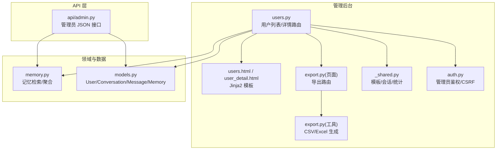
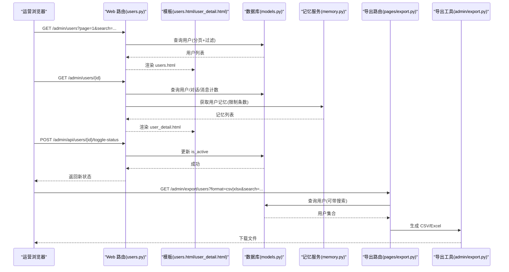
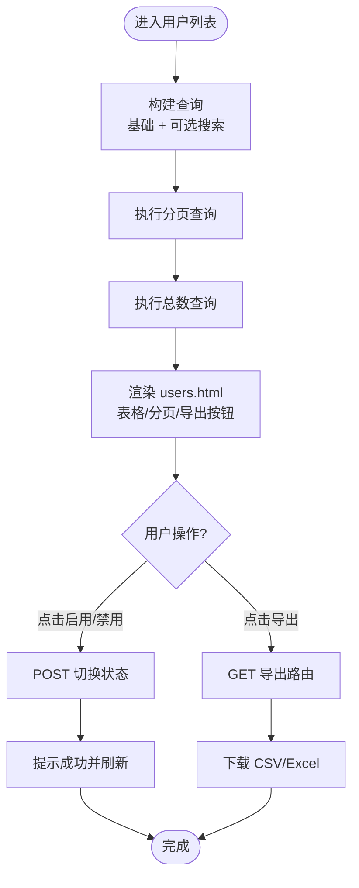
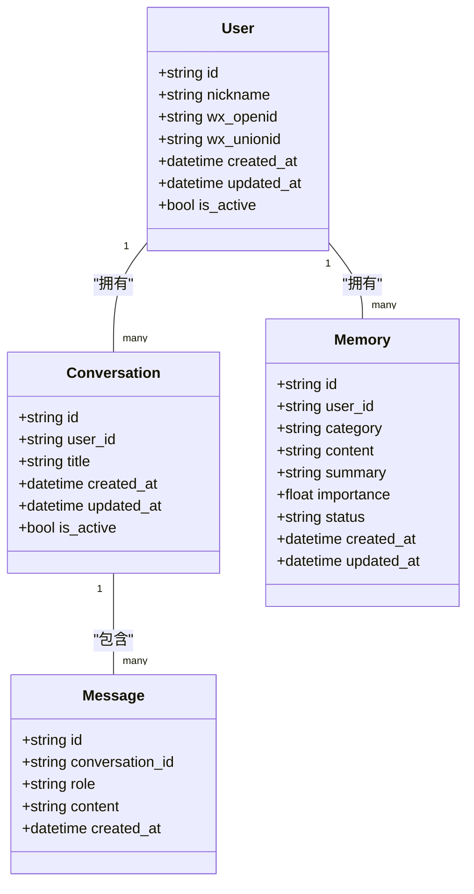
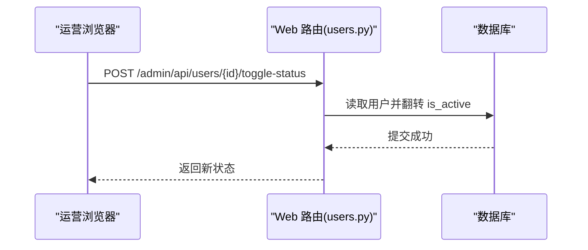
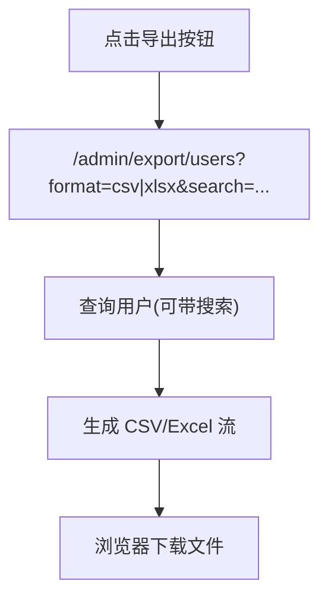
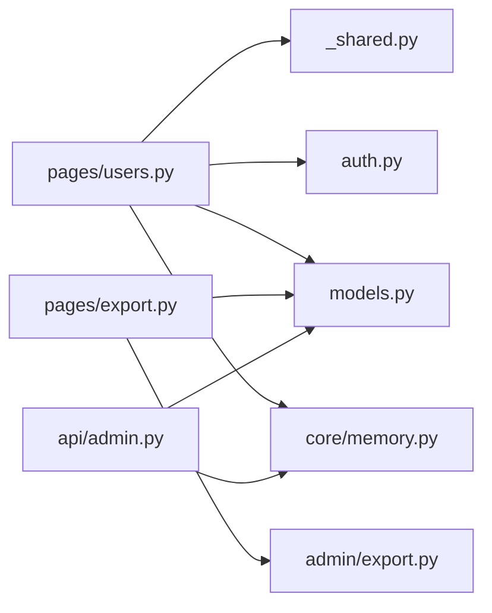

# 用户运营管理

<cite>
**本文引用的文件**   
- [hushai/meditation/admin/pages/users.py](file://hushai/meditation/admin/pages/users.py)
- [hushai/meditation/admin/templates/users.html](file://hushai/meditation/admin/templates/users.html)
- [hushai/meditation/admin/templates/user_detail.html](file://hushai/meditation/admin/templates/user_detail.html)
- [hushai/meditation/api/admin.py](file://hushai/meditation/api/admin.py)
- [hushai/meditation/db/models.py](file://hushai/meditation/db/models.py)
- [hushai/meditation/core/memory.py](file://hushai/meditation/core/memory.py)
- [hushai/meditation/admin/export.py](file://hushai/meditation/admin/export.py)
- [hushai/meditation/admin/pages/export.py](file://hushai/meditation/admin/pages/export.py)
- [hushai/meditation/schemas.py](file://hushai/meditation/schemas.py)
- [hushai/meditation/admin/auth.py](file://hushai/meditation/admin/auth.py)
- [hushai/meditation/admin/pages/_shared.py](file://hushai/meditation/admin/pages/_shared.py)
</cite>

## 目录
1. [简介](#简介)
2. [项目结构](#项目结构)
3. [核心组件](#核心组件)
4. [架构总览](#架构总览)
5. [详细组件分析](#详细组件分析)
6. [依赖关系分析](#依赖关系分析)
7. [性能与扩展性](#性能与扩展性)
8. [故障排查指南](#故障排查指南)
9. [结论](#结论)
10. [附录：操作手册](#附录操作手册)

## 简介
本文件面向运营人员，系统化说明 hush.ai 管理后台的“用户运营管理”能力，包括：
- 用户列表查看：信息展示、搜索筛选、分页显示
- 用户详情查看：基本信息、对话历史、记忆内容与统计概览
- 用户状态管理：启用/禁用、标签（基于分类的记忆）管理与批量操作基础
- 数据导出与分析工具：CSV/Excel 导出及使用方法
- 隐私保护与数据安全：认证、CSRF、敏感字段处理建议

## 项目结构
用户运营管理相关代码主要分布在以下模块：
- Web 页面路由与模板：admin/pages/users.py、templates/users.html、templates/user_detail.html
- 管理员 API：api/admin.py（提供 JSON 接口）
- 数据模型：db/models.py（User、Conversation、Message、Memory 等）
- 记忆服务：core/memory.py（记忆检索与聚合）
- 导出功能：admin/export.py（通用导出工具）、admin/pages/export.py（导出路由）
- 鉴权与安全：admin/auth.py（JWT、CSRF）、admin/pages/_shared.py（模板与公共依赖）

图表来源
- [hushai/meditation/admin/pages/users.py:18-123](file://hushai/meditation/admin/pages/users.py#L18-L123)
- [hushai/meditation/admin/templates/users.html:1-158](file://hushai/meditation/admin/templates/users.html#L1-L158)
- [hushai/meditation/admin/templates/user_detail.html:1-207](file://hushai/meditation/admin/templates/user_detail.html#L1-L207)
- [hushai/meditation/api/admin.py:37-103](file://hushai/meditation/api/admin.py#L37-L103)
- [hushai/meditation/core/memory.py:141-158](file://hushai/meditation/core/memory.py#L141-L158)
- [hushai/meditation/db/models.py:37-118](file://hushai/meditation/db/models.py#L37-L118)
- [hushai/meditation/admin/export.py:1-106](file://hushai/meditation/admin/export.py#L1-L106)
- [hushai/meditation/admin/pages/export.py:95-128](file://hushai/meditation/admin/pages/export.py#L95-L128)
- [hushai/meditation/admin/pages/_shared.py:24-32](file://hushai/meditation/admin/pages/_shared.py#L24-L32)
- [hushai/meditation/admin/auth.py:87-101](file://hushai/meditation/admin/auth.py#L87-L101)

章节来源
- [hushai/meditation/admin/pages/users.py:18-123](file://hushai/meditation/admin/pages/users.py#L18-L123)
- [hushai/meditation/admin/templates/users.html:1-158](file://hushai/meditation/admin/templates/users.html#L1-L158)
- [hushai/meditation/admin/templates/user_detail.html:1-207](file://hushai/meditation/admin/templates/user_detail.html#L1-L207)
- [hushai/meditation/api/admin.py:37-103](file://hushai/meditation/api/admin.py#L37-L103)
- [hushai/meditation/core/memory.py:141-158](file://hushai/meditation/core/memory.py#L141-L158)
- [hushai/meditation/db/models.py:37-118](file://hushai/meditation/db/models.py#L37-L118)
- [hushai/meditation/admin/export.py:1-106](file://hushai/meditation/admin/export.py#L1-L106)
- [hushai/meditation/admin/pages/export.py:95-128](file://hushai/meditation/admin/pages/export.py#L95-L128)
- [hushai/meditation/admin/pages/_shared.py:24-32](file://hushai/meditation/admin/pages/_shared.py#L24-L32)
- [hushai/meditation/admin/auth.py:87-101](file://hushai/meditation/admin/auth.py#L87-L101)

## 核心组件
- 用户列表页
  - 支持按昵称或 OpenID 模糊搜索
  - 默认每页 20 条，支持分页导航
  - 行内快速启用/禁用用户
  - 入口导出 CSV/Excel（携带当前搜索条件）
- 用户详情页
  - 展示基本信息（ID、OpenID、UnionID、注册时间、更新时间、头像、状态）
  - 统计信息（对话数、消息数、记忆条目数）
  - 最近记忆（前若干条）与最近对话（前若干条）
  - 快捷跳转至“全部对话/全部记忆”
- 管理员 API
  - 获取用户画像（含对话/消息计数与记忆类别汇总）
  - 列出用户（分页）
- 导出工具
  - 统一 CSV/Excel 导出响应封装
  - 用户、对话、记忆、知识库、审计日志等多资源导出

章节来源
- [hushai/meditation/admin/pages/users.py:18-65](file://hushai/meditation/admin/pages/users.py#L18-L65)
- [hushai/meditation/admin/templates/users.html:14-42](file://hushai/meditation/admin/templates/users.html#L14-L42)
- [hushai/meditation/admin/templates/user_detail.html:20-98](file://hushai/meditation/admin/templates/user_detail.html#L20-L98)
- [hushai/meditation/api/admin.py:37-103](file://hushai/meditation/api/admin.py#L37-L103)
- [hushai/meditation/admin/export.py:1-106](file://hushai/meditation/admin/export.py#L1-L106)
- [hushai/meditation/admin/pages/export.py:95-128](file://hushai/meditation/admin/pages/export.py#L95-L128)

## 架构总览
下图展示了从浏览器到数据库的关键调用路径，涵盖列表、详情、状态切换与导出。

图表来源
- [hushai/meditation/admin/pages/users.py:18-123](file://hushai/meditation/admin/pages/users.py#L18-L123)
- [hushai/meditation/admin/templates/users.html:14-42](file://hushai/meditation/admin/templates/users.html#L14-L42)
- [hushai/meditation/admin/templates/user_detail.html:100-115](file://hushai/meditation/admin/templates/user_detail.html#L100-L115)
- [hushai/meditation/core/memory.py:141-158](file://hushai/meditation/core/memory.py#L141-L158)
- [hushai/meditation/admin/pages/export.py:95-128](file://hushai/meditation/admin/pages/export.py#L95-L128)
- [hushai/meditation/admin/export.py:92-106](file://hushai/meditation/admin/export.py#L92-L106)

## 详细组件分析

### 用户列表查看
- 功能要点
  - 搜索：支持对昵称与 OpenID 进行模糊匹配
  - 分页：page、limit 参数控制；后端计算 total_pages
  - 展示：头像、昵称、OpenID 前缀、注册时间、状态
  - 操作：单条启用/禁用；返回列表/查看详情
  - 导出：按钮链接到导出路由，自动带上 search 参数
- 关键实现
  - 列表路由：构建基础查询与计数查询，应用搜索条件，执行分页
  - 模板：渲染表格与分页控件，绑定启用/禁用交互
  - 前端脚本：调用 toggle-status 接口并刷新页面

图表来源
- [hushai/meditation/admin/pages/users.py:18-65](file://hushai/meditation/admin/pages/users.py#L18-L65)
- [hushai/meditation/admin/templates/users.html:104-130](file://hushai/meditation/admin/templates/users.html#L104-L130)
- [hushai/meditation/admin/templates/users.html:141-157](file://hushai/meditation/admin/templates/users.html#L141-L157)
- [hushai/meditation/admin/pages/export.py:95-128](file://hushai/meditation/admin/pages/export.py#L95-L128)

章节来源
- [hushai/meditation/admin/pages/users.py:18-65](file://hushai/meditation/admin/pages/users.py#L18-L65)
- [hushai/meditation/admin/templates/users.html:14-42](file://hushai/meditation/admin/templates/users.html#L14-L42)
- [hushai/meditation/admin/templates/users.html:104-130](file://hushai/meditation/admin/templates/users.html#L104-L130)
- [hushai/meditation/admin/templates/users.html:141-157](file://hushai/meditation/admin/templates/users.html#L141-L157)
- [hushai/meditation/admin/pages/export.py:95-128](file://hushai/meditation/admin/pages/export.py#L95-L128)

### 用户详情查看
- 功能要点
  - 基本信息：ID、OpenID、UnionID、头像、注册时间/更新时间、状态
  - 统计信息：对话数、消息数、记忆条目数
  - 记忆内容：按重要度与更新时间排序，展示摘要与分类
  - 对话历史：最近对话列表，支持跳转到对话详情
- 关键实现
  - 详情路由：查询用户、统计计数、拉取记忆与对话列表
  - 模板：分块展示基本信息、统计、记忆、对话，并提供操作按钮

图表来源
- [hushai/meditation/db/models.py:37-118](file://hushai/meditation/db/models.py#L37-L118)

章节来源
- [hushai/meditation/admin/pages/users.py:68-123](file://hushai/meditation/admin/pages/users.py#L68-L123)
- [hushai/meditation/admin/templates/user_detail.html:20-98](file://hushai/meditation/admin/templates/user_detail.html#L20-L98)
- [hushai/meditation/core/memory.py:141-158](file://hushai/meditation/core/memory.py#L141-L158)
- [hushai/meditation/db/models.py:37-118](file://hushai/meditation/db/models.py#L37-L118)

### 用户状态管理
- 启用/禁用
  - 列表页与详情页均提供一键切换按钮
  - 通过 POST 接口更新 is_active 字段
- 标签管理
  - 系统未提供显式“标签”字段，但可通过“记忆分类”间接体现用户特征（如情绪模式、个人偏好等）
  - 建议在后续版本引入显式标签字段以增强运营灵活性
- 批量操作
  - 当前仅支持单条状态切换
  - 可在列表页增加多选框与批量启用/禁用入口，复用同一状态切换逻辑

图表来源
- [hushai/meditation/admin/pages/users.py:126-146](file://hushai/meditation/admin/pages/users.py#L126-L146)
- [hushai/meditation/admin/templates/users.html:141-157](file://hushai/meditation/admin/templates/users.html#L141-L157)
- [hushai/meditation/admin/templates/user_detail.html:190-206](file://hushai/meditation/admin/templates/user_detail.html#L190-L206)

章节来源
- [hushai/meditation/admin/pages/users.py:126-146](file://hushai/meditation/admin/pages/users.py#L126-L146)
- [hushai/meditation/admin/templates/users.html:141-157](file://hushai/meditation/admin/templates/users.html#L141-L157)
- [hushai/meditation/admin/templates/user_detail.html:190-206](file://hushai/meditation/admin/templates/user_detail.html#L190-L206)

### 数据导出与分析工具
- 支持的导出资源
  - 用户列表：支持按搜索条件导出
  - 对话记录：可按用户筛选
  - 记忆列表：可按用户与分类筛选
  - 知识库：支持标题/内容搜索
  - 审计日志：支持按操作类型与管理员筛选
- 导出格式
  - CSV：文本表格，适合数据分析
  - Excel：结构化表格，便于二次加工
- 使用方式
  - 在用户列表页点击“CSV/Excel”按钮，自动携带当前搜索条件
  - 直接访问导出路由，指定 format 与筛选参数

图表来源
- [hushai/meditation/admin/templates/users.html:34-41](file://hushai/meditation/admin/templates/users.html#L34-L41)
- [hushai/meditation/admin/pages/export.py:95-128](file://hushai/meditation/admin/pages/export.py#L95-L128)
- [hushai/meditation/admin/export.py:92-106](file://hushai/meditation/admin/export.py#L92-L106)

章节来源
- [hushai/meditation/admin/templates/users.html:34-41](file://hushai/meditation/admin/templates/users.html#L34-L41)
- [hushai/meditation/admin/pages/export.py:95-128](file://hushai/meditation/admin/pages/export.py#L95-L128)
- [hushai/meditation/admin/export.py:1-106](file://hushai/meditation/admin/export.py#L1-L106)

### 管理员 API（供系统集成）
- 用户画像
  - 返回用户 ID、昵称、注册时间、对话/消息计数、记忆类别汇总
- 用户列表
  - 返回用户基础信息与总数，支持分页
- 适用场景
  - 第三方系统对接、自动化报表、BI 集成

章节来源
- [hushai/meditation/api/admin.py:37-103](file://hushai/meditation/api/admin.py#L37-L103)
- [hushai/meditation/schemas.py:153-160](file://hushai/meditation/schemas.py#L153-L160)

## 依赖关系分析
- 页面路由依赖
  - 模板渲染：_shared.py 提供 Jinja2Templates 实例
  - 会话注入：get_session 提供异步数据库会话
  - 鉴权：get_admin_from_request 校验管理员令牌
- 业务依赖
  - 记忆服务：get_user_memories 用于详情与统计
  - 数据模型：User、Conversation、Message、Memory 等
- 导出依赖
  - pages/export.py 负责各资源导出路由
  - admin/export.py 提供统一的 CSV/Excel 生成器

图表来源
- [hushai/meditation/admin/pages/users.py:10-12](file://hushai/meditation/admin/pages/users.py#L10-L12)
- [hushai/meditation/admin/pages/_shared.py:24-32](file://hushai/meditation/admin/pages/_shared.py#L24-L32)
- [hushai/meditation/admin/auth.py:87-101](file://hushai/meditation/admin/auth.py#L87-L101)
- [hushai/meditation/db/models.py:37-118](file://hushai/meditation/db/models.py#L37-L118)
- [hushai/meditation/core/memory.py:141-158](file://hushai/meditation/core/memory.py#L141-L158)
- [hushai/meditation/admin/pages/export.py:9-12](file://hushai/meditation/admin/pages/export.py#L9-L12)
- [hushai/meditation/admin/export.py:1-10](file://hushai/meditation/admin/export.py#L1-L10)
- [hushai/meditation/api/admin.py:10-21](file://hushai/meditation/api/admin.py#L10-L21)

章节来源
- [hushai/meditation/admin/pages/users.py:10-12](file://hushai/meditation/admin/pages/users.py#L10-L12)
- [hushai/meditation/admin/pages/_shared.py:24-32](file://hushai/meditation/admin/pages/_shared.py#L24-L32)
- [hushai/meditation/admin/auth.py:87-101](file://hushai/meditation/admin/auth.py#L87-L101)
- [hushai/meditation/db/models.py:37-118](file://hushai/meditation/db/models.py#L37-L118)
- [hushai/meditation/core/memory.py:141-158](file://hushai/meditation/core/memory.py#L141-L158)
- [hushai/meditation/admin/pages/export.py:9-12](file://hushai/meditation/admin/pages/export.py#L9-L12)
- [hushai/meditation/admin/export.py:1-10](file://hushai/meditation/admin/export.py#L1-L10)
- [hushai/meditation/api/admin.py:10-21](file://hushai/meditation/api/admin.py#L10-L21)

## 性能与扩展性
- 列表查询
  - 使用 count 子查询与 limit/offset 分页，避免全量加载
  - 搜索条件采用 ILIKE 模糊匹配，注意大数据量下的索引策略
- 详情页面
  - 记忆拉取限制条数，避免过多 IO
  - 对话列表仅展示最近若干条，减少渲染压力
- 导出
  - 使用 StreamingResponse 流式输出，降低内存峰值
  - 大表导出建议增加时间范围或用户维度筛选
- 可扩展点
  - 为昵称/OpenID 建立合适索引以提升搜索性能
  - 导出接口可增加并发限流与任务队列，避免阻塞主进程

[本节为通用指导，不直接分析具体文件]

## 故障排查指南
- 无法登录管理后台
  - 检查管理员令牌是否有效（Cookie 或 Authorization Header）
  - 确认 JWT 密钥与算法配置正确
- 401/403 错误
  - 401：未登录或令牌无效
  - 403：CSRF 验证失败（需确保请求头携带 X-CSRF-Token 且与 Cookie 一致）
- 用户不存在
  - 详情或状态切换时若返回 404，请核对用户 ID 是否正确
- 导出为空
  - 检查搜索条件是否过严；尝试清空搜索后重试
- 导出速度慢
  - 缩小导出范围（按用户/时间/分类），或改用分批导出

章节来源
- [hushai/meditation/admin/auth.py:76-101](file://hushai/meditation/admin/auth.py#L76-L101)
- [hushai/meditation/admin/auth.py:164-182](file://hushai/meditation/admin/auth.py#L164-L182)
- [hushai/meditation/admin/pages/users.py:126-146](file://hushai/meditation/admin/pages/users.py#L126-L146)
- [hushai/meditation/admin/pages/export.py:95-128](file://hushai/meditation/admin/pages/export.py#L95-L128)

## 结论
本方案提供了完整的用户运营管理闭环：从列表查看、详情洞察、状态管理到数据导出与分析。通过清晰的权限控制与 CSRF 保护，保障管理后台安全。建议在后续迭代中补充标签体系与批量操作，进一步提升运营效率。

[本节为总结，不直接分析具体文件]

## 附录：操作手册
- 登录管理后台
  - 使用管理员账号密码登录后，进入“用户管理”
- 查看用户列表
  - 在搜索框输入昵称或 OpenID，点击“搜索”
  - 使用分页控件浏览更多用户
- 查看用户详情
  - 点击用户行中的“查看详情”，查看基本信息、统计、记忆与对话
- 启用/禁用用户
  - 在列表或详情页点击“启用/禁用”按钮，确认后即时生效
- 导出数据
  - 在用户列表页点击“CSV/Excel”，根据提示下载文件
  - 如需更精细筛选，可直接访问导出路由并添加参数
- 注意事项
  - 导出文件可能包含敏感信息，请妥善保管
  - 大规模导出建议在低峰时段执行

[本节为操作指引，不直接分析具体文件]