# 管理后台

<cite>
**本文引用的文件**   
- [hushai/meditation/admin/__init__.py](file://hushai/meditation/admin/__init__.py)
- [hushai/meditation/admin/pages/__init__.py](file://hushai/meditation/admin/pages/__init__.py)
- [hushai/meditation/admin/auth.py](file://hushai/meditation/admin/auth.py)
- [hushai/meditation/admin/pages/auth.py](file://hushai/meditation/admin/pages/auth.py)
- [hushai/meditation/admin/audit.py](file://hushai/meditation/admin/audit.py)
- [hushai/meditation/admin/pages/audit.py](file://hushai/meditation/admin/pages/audit.py)
- [hushai/meditation/admin/export.py](file://hushai/meditation/admin/export.py)
- [hushai/meditation/admin/pages/admin_users.py](file://hushai/meditation/admin/pages/admin_users.py)
- [hushai/meditation/admin/pages/users.py](file://hushai/meditation/admin/pages/users.py)
- [hushai/meditation/admin/pages/conversations.py](file://hushai/meditation/admin/pages/conversations.py)
- [hushai/meditation/admin/pages/memories.py](file://hushai/meditation/admin/pages/memories.py)
- [hushai/meditation/admin/pages/knowledge.py](file://hushai/meditation/admin/pages/knowledge.py)
- [hushai/meditation/admin/pages/skills.py](file://hushai/meditation/admin/pages/skills.py)
- [hushai/meditation/admin/pages/scenes.py](file://hushai/meditation/admin/pages/scenes.py)
- [hushai/meditation/admin/pages/dashboard.py](file://hushai/meditation/admin/pages/dashboard.py)
- [hushai/meditation/db/models.py](file://hushai/meditation/db/models.py)
</cite>

## 目录
1. [简介](#简介)
2. [项目结构](#项目结构)
3. [核心组件](#核心组件)
4. [架构总览](#架构总览)
5. [详细组件分析](#详细组件分析)
6. [依赖关系分析](#依赖关系分析)
7. [性能与扩展建议](#性能与扩展建议)
8. [故障排查指南](#故障排查指南)
9. [结论](#结论)
10. [附录：操作手册与最佳实践](#附录操作手册与最佳实践)

## 简介
本文件为 hush.ai 管理后台的完整功能文档，面向运营与管理人员，覆盖管理员认证与权限控制、多管理员账号管理、操作审计日志、用户运营管理（用户列表、对话记录、记忆内容）、内容管理（知识库、技能插件、场景配置）、数据统计与导出（CSV/Excel）以及批量操作的最佳实践。文档同时提供架构图、时序图与流程图，帮助快速理解系统行为与数据流转。

## 项目结构
管理后台采用 FastAPI + Jinja2 模板渲染的 Web 模式，路由按资源拆分到 pages 子包，统一由 build_router 聚合挂载于 /admin 前缀下。核心模块包括：
- 认证与安全：登录/登出、JWT 令牌、CSRF 保护、密码哈希
- 页面路由：仪表盘、用户、对话、记忆、知识库、技能、场景、审计、导出等
- 数据模型：用户、会话、消息、记忆、知识片段、技能、场景、管理员、审计日志等
- 导出工具：CSV/Excel 流式响应

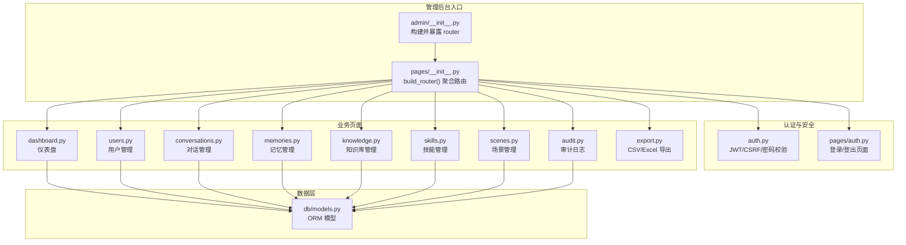

图表来源
- [hushai/meditation/admin/__init__.py:1-15](file://hushai/meditation/admin/__init__.py#L1-L15)
- [hushai/meditation/admin/pages/__init__.py:1-56](file://hushai/meditation/admin/pages/__init__.py#L1-L56)
- [hushai/meditation/admin/auth.py:1-183](file://hushai/meditation/admin/auth.py#L1-L183)
- [hushai/meditation/admin/pages/auth.py:1-65](file://hushai/meditation/admin/pages/auth.py#L1-L65)
- [hushai/meditation/admin/pages/dashboard.py:1-52](file://hushai/meditation/admin/pages/dashboard.py#L1-L52)
- [hushai/meditation/admin/pages/users.py:1-146](file://hushai/meditation/admin/pages/users.py#L1-L146)
- [hushai/meditation/admin/pages/conversations.py:1-139](file://hushai/meditation/admin/pages/conversations.py#L1-L139)
- [hushai/meditation/admin/pages/memories.py:1-130](file://hushai/meditation/admin/pages/memories.py#L1-L130)
- [hushai/meditation/admin/pages/knowledge.py:1-163](file://hushai/meditation/admin/pages/knowledge.py#L1-L163)
- [hushai/meditation/admin/pages/skills.py:1-218](file://hushai/meditation/admin/pages/skills.py#L1-L218)
- [hushai/meditation/admin/pages/scenes.py:1-240](file://hushai/meditation/admin/pages/scenes.py#L1-L240)
- [hushai/meditation/admin/pages/audit.py:1-72](file://hushai/meditation/admin/pages/audit.py#L1-L72)
- [hushai/meditation/admin/export.py:1-106](file://hushai/meditation/admin/export.py#L1-L106)
- [hushai/meditation/db/models.py:1-434](file://hushai/meditation/db/models.py#L1-L434)

章节来源
- [hushai/meditation/admin/__init__.py:1-15](file://hushai/meditation/admin/__init__.py#L1-L15)
- [hushai/meditation/admin/pages/__init__.py:1-56](file://hushai/meditation/admin/pages/__init__.py#L1-L56)

## 核心组件
- 认证与安全
  - JWT 令牌签发与校验、Cookie 存储、请求头 Bearer 兼容
  - CSRF 令牌生成、设置 Cookie、验证
  - 密码哈希与校验（bcrypt）
  - 默认管理员初始化（首次启动时创建）
- 页面路由
  - 统一前缀 /admin，按资源拆分子模块
  - 登录/登出、仪表盘、用户、对话、记忆、知识库、技能、场景、审计、导出
- 数据模型
  - 用户、对话、消息、记忆、知识片段、技能、场景、管理员、审计日志等 ORM 模型
- 导出工具
  - CSV/Excel 流式响应，支持时间序列化与列宽调整

章节来源
- [hushai/meditation/admin/auth.py:1-183](file://hushai/meditation/admin/auth.py#L1-L183)
- [hushai/meditation/admin/pages/auth.py:1-65](file://hushai/meditation/admin/pages/auth.py#L1-L65)
- [hushai/meditation/admin/pages/__init__.py:1-56](file://hushai/meditation/admin/pages/__init__.py#L1-L56)
- [hushai/meditation/admin/export.py:1-106](file://hushai/meditation/admin/export.py#L1-L106)
- [hushai/meditation/db/models.py:1-434](file://hushai/meditation/db/models.py#L1-L434)

## 架构总览
管理后台以 FastAPI 应用为核心，通过 admin 模块聚合路由，各页面模块负责渲染 HTML 模板与处理表单提交；数据访问通过 SQLAlchemy 异步会话完成；安全机制贯穿所有受保护接口。

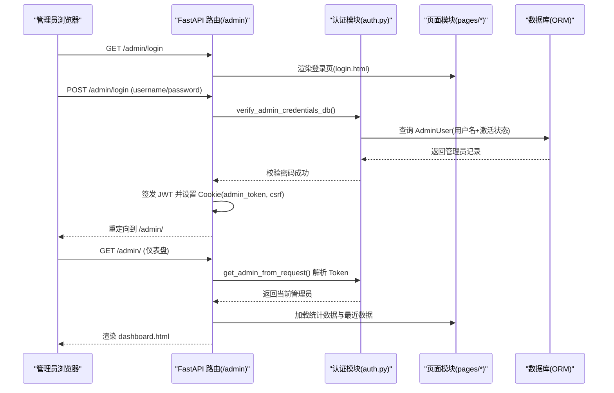

图表来源
- [hushai/meditation/admin/pages/auth.py:1-65](file://hushai/meditation/admin/pages/auth.py#L1-L65)
- [hushai/meditation/admin/auth.py:1-183](file://hushai/meditation/admin/auth.py#L1-L183)
- [hushai/meditation/admin/pages/dashboard.py:1-52](file://hushai/meditation/admin/pages/dashboard.py#L1-L52)

## 详细组件分析

### 管理员认证与权限控制
- 登录流程
  - 获取用户名与密码，校验数据库中的管理员记录与密码哈希
  - 成功后签发 JWT，写入 Cookie（httponly），同时生成 CSRF 令牌并写入 Cookie
  - 未登录或凭据错误返回相应提示或状态码
- 权限校验
  - 从 Cookie 或 Authorization 头提取 token，解码并校验 is_admin 标志
  - 未通过则返回 401
- CSRF 保护
  - 对写操作（POST/PUT/DELETE/PATCH）强制校验 X-CSRF-Token 与 Cookie 一致
- 默认管理员初始化
  - 首次启动检查是否存在管理员，不存在则根据环境变量创建默认管理员

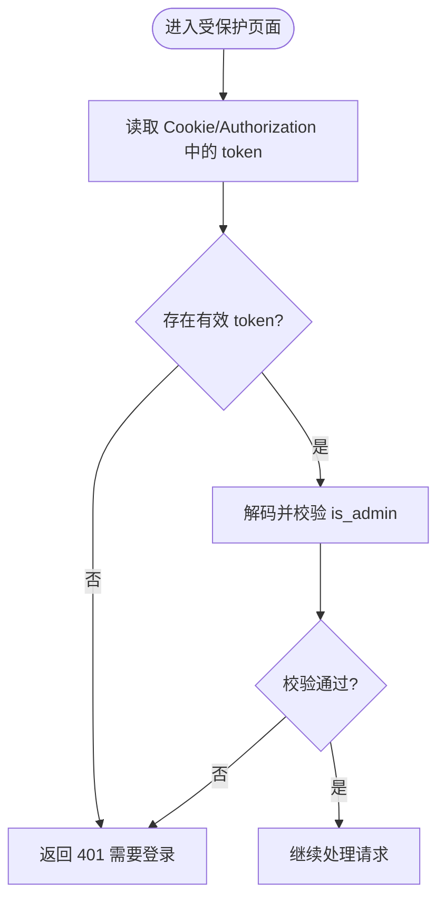

图表来源
- [hushai/meditation/admin/auth.py:64-113](file://hushai/meditation/admin/auth.py#L64-L113)
- [hushai/meditation/admin/auth.py:164-183](file://hushai/meditation/admin/auth.py#L164-L183)
- [hushai/meditation/admin/pages/auth.py:28-55](file://hushai/meditation/admin/pages/auth.py#L28-L55)

章节来源
- [hushai/meditation/admin/auth.py:1-183](file://hushai/meditation/admin/auth.py#L1-L183)
- [hushai/meditation/admin/pages/auth.py:1-65](file://hushai/meditation/admin/pages/auth.py#L1-L65)

### 多管理员账号管理与操作审计日志
- 管理员账号管理
  - 列表查看、新建、编辑、删除（禁止删除当前登录的管理员）
  - 用户名唯一性校验、密码长度校验、显示名称可选
- 审计日志
  - 提供审计日志页面，支持分页与按动作、管理员用户名筛选
  - 审计记录包含管理员、动作、资源类型、资源 ID、详情、IP、UA、时间戳

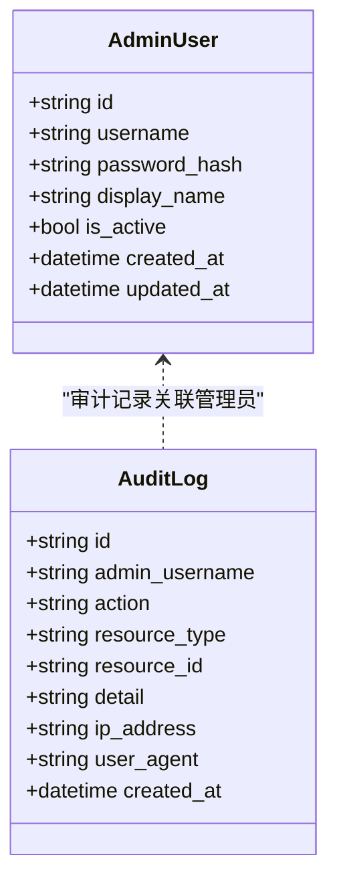

图表来源
- [hushai/meditation/db/models.py:172-202](file://hushai/meditation/db/models.py#L172-L202)
- [hushai/meditation/admin/pages/admin_users.py:1-208](file://hushai/meditation/admin/pages/admin_users.py#L1-L208)
- [hushai/meditation/admin/pages/audit.py:1-72](file://hushai/meditation/admin/pages/audit.py#L1-L72)

章节来源
- [hushai/meditation/admin/pages/admin_users.py:1-208](file://hushai/meditation/admin/pages/admin_users.py#L1-L208)
- [hushai/meditation/admin/pages/audit.py:1-72](file://hushai/meditation/admin/pages/audit.py#L1-L72)
- [hushai/meditation/db/models.py:172-202](file://hushai/meditation/db/models.py#L172-L202)

### 用户运营管理
- 用户列表
  - 分页、搜索（昵称或微信 OpenID）
  - 统计总数与总页数
- 用户详情
  - 展示用户基本信息、对话数量、消息数量
  - 列出最近记忆与对话列表
- 用户状态切换
  - 启用/禁用用户（is_active 字段）

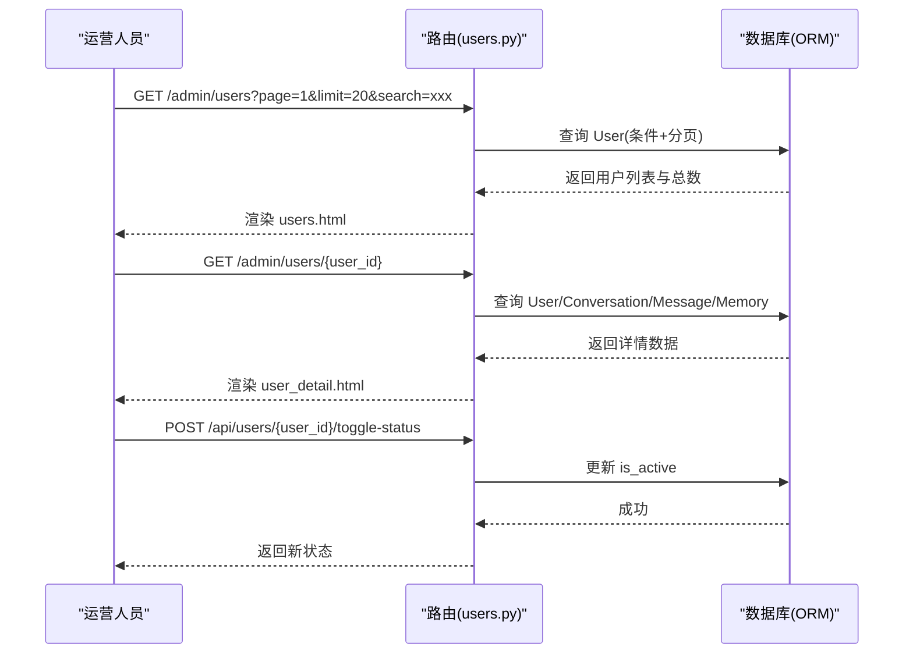

图表来源
- [hushai/meditation/admin/pages/users.py:1-146](file://hushai/meditation/admin/pages/users.py#L1-L146)
- [hushai/meditation/db/models.py:37-118](file://hushai/meditation/db/models.py#L37-L118)

章节来源
- [hushai/meditation/admin/pages/users.py:1-146](file://hushai/meditation/admin/pages/users.py#L1-L146)
- [hushai/meditation/db/models.py:37-118](file://hushai/meditation/db/models.py#L37-L118)

### 对话记录分析与批量操作
- 对话列表
  - 分页、按用户筛选、显示用户昵称
- 对话详情
  - 展示对话元信息与消息序列（按时间排序）
- 批量删除
  - 软删除（标记 is_active=False），返回删除数量

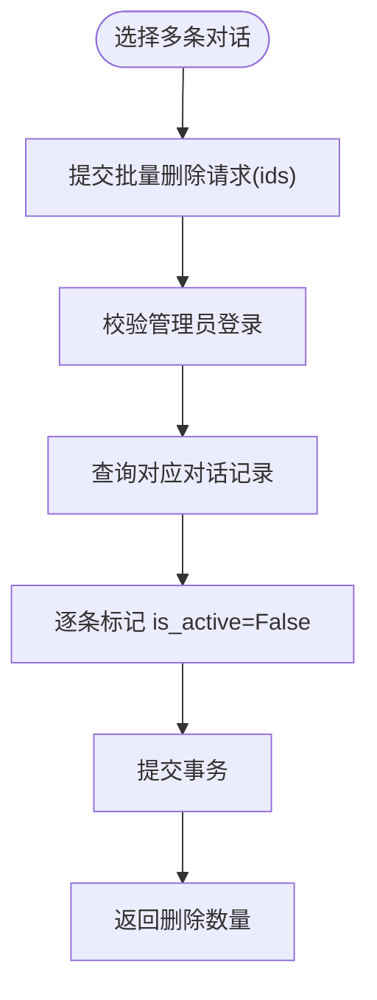

图表来源
- [hushai/meditation/admin/pages/conversations.py:117-139](file://hushai/meditation/admin/pages/conversations.py#L117-L139)
- [hushai/meditation/db/models.py:69-83](file://hushai/meditation/db/models.py#L69-L83)

章节来源
- [hushai/meditation/admin/pages/conversations.py:1-139](file://hushai/meditation/admin/pages/conversations.py#L1-L139)
- [hushai/meditation/db/models.py:69-83](file://hushai/meditation/db/models.py#L69-L83)

### 记忆内容管理
- 记忆列表
  - 分页、按用户与分类筛选、显示用户昵称
  - 动态获取分类列表
- 单条删除与批量删除
  - 直接物理删除，返回成功或计数

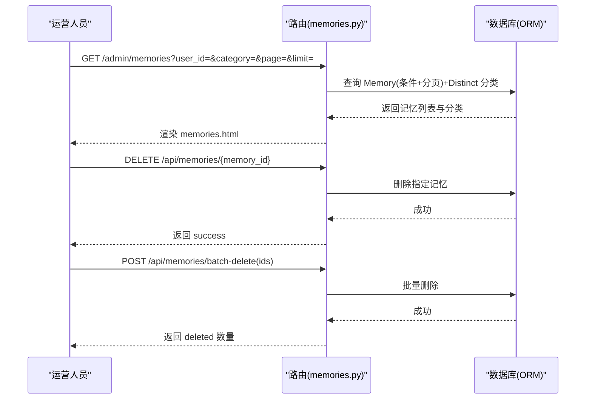

图表来源
- [hushai/meditation/admin/pages/memories.py:1-130](file://hushai/meditation/admin/pages/memories.py#L1-L130)
- [hushai/meditation/db/models.py:98-118](file://hushai/meditation/db/models.py#L98-L118)

章节来源
- [hushai/meditation/admin/pages/memories.py:1-130](file://hushai/meditation/admin/pages/memories.py#L1-L130)
- [hushai/meditation/db/models.py:98-118](file://hushai/meditation/db/models.py#L98-L118)

### 内容管理：知识库、技能插件、场景配置
- 知识库
  - 列表分页与搜索（标题/内容）
  - 详情查看、删除、批量删除
  - 导入页面（用于后续导入逻辑）
- 技能插件
  - 列表分页与搜索（名称/描述）
  - 新增/编辑/删除，支持排序与启用状态
  - 批量导入页面
- 场景配置
  - 列表分页与搜索（名称/描述）
  - 新增/编辑/删除，slug 唯一性校验，系统提示与开场白配置

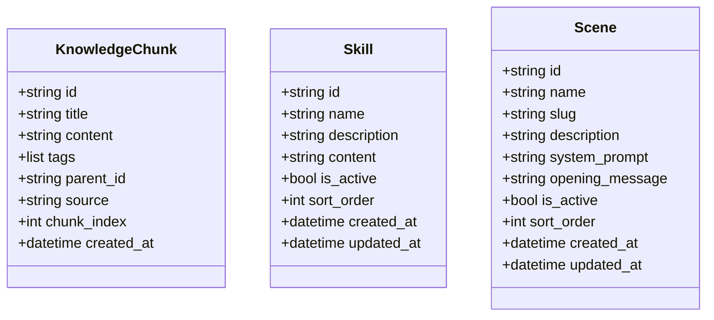

图表来源
- [hushai/meditation/db/models.py:137-170](file://hushai/meditation/db/models.py#L137-L170)
- [hushai/meditation/admin/pages/knowledge.py:1-163](file://hushai/meditation/admin/pages/knowledge.py#L1-L163)
- [hushai/meditation/admin/pages/skills.py:1-218](file://hushai/meditation/admin/pages/skills.py#L1-L218)
- [hushai/meditation/admin/pages/scenes.py:1-240](file://hushai/meditation/admin/pages/scenes.py#L1-L240)

章节来源
- [hushai/meditation/admin/pages/knowledge.py:1-163](file://hushai/meditation/admin/pages/knowledge.py#L1-L163)
- [hushai/meditation/admin/pages/skills.py:1-218](file://hushai/meditation/admin/pages/skills.py#L1-L218)
- [hushai/meditation/admin/pages/scenes.py:1-240](file://hushai/meditation/admin/pages/scenes.py#L1-L240)
- [hushai/meditation/db/models.py:137-170](file://hushai/meditation/db/models.py#L137-L170)

### 数据统计与分析
- 仪表盘
  - 汇总统计上下文（如用户数、对话数等）
  - 最近注册用户与最近对话列表
- 审计日志
  - 按动作与管理员用户名筛选，分页浏览

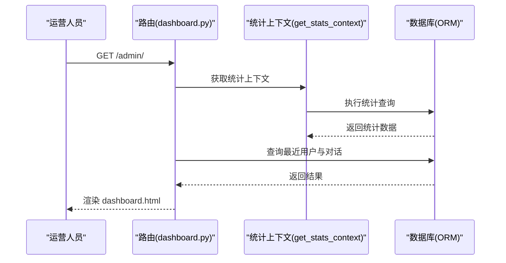

图表来源
- [hushai/meditation/admin/pages/dashboard.py:1-52](file://hushai/meditation/admin/pages/dashboard.py#L1-L52)
- [hushai/meditation/admin/pages/audit.py:1-72](file://hushai/meditation/admin/pages/audit.py#L1-L72)

章节来源
- [hushai/meditation/admin/pages/dashboard.py:1-52](file://hushai/meditation/admin/pages/dashboard.py#L1-L52)
- [hushai/meditation/admin/pages/audit.py:1-72](file://hushai/meditation/admin/pages/audit.py#L1-L72)

### 数据导出与批量操作最佳实践
- 导出格式
  - CSV：使用 DictWriter 写入表头与行，空数据返回空字符串
  - Excel：使用 openpyxl 创建工作簿，自动设置列宽，时间值格式化输出
- 统一导出响应
  - 根据 export_format 选择 CSV 或 Excel，文件名带时间戳
- 批量操作
  - 对话批量删除：软删除（标记 is_active=False）
  - 记忆批量删除：物理删除
  - 知识库批量删除：物理删除
  - 建议：在批量操作前进行二次确认，限制单次批量大小，避免长时间锁表

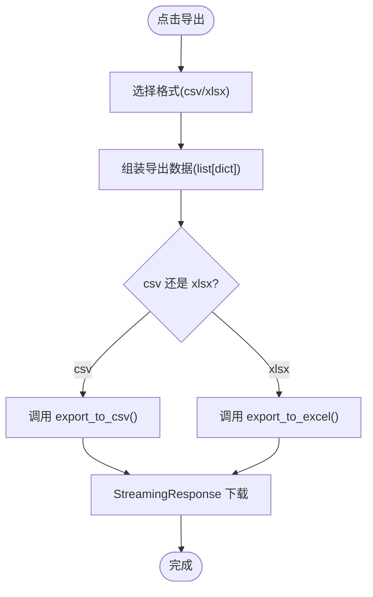

图表来源
- [hushai/meditation/admin/export.py:1-106](file://hushai/meditation/admin/export.py#L1-L106)
- [hushai/meditation/admin/pages/conversations.py:117-139](file://hushai/meditation/admin/pages/conversations.py#L117-L139)
- [hushai/meditation/admin/pages/memories.py:108-130](file://hushai/meditation/admin/pages/memories.py#L108-L130)
- [hushai/meditation/admin/pages/knowledge.py:141-163](file://hushai/meditation/admin/pages/knowledge.py#L141-L163)

章节来源
- [hushai/meditation/admin/export.py:1-106](file://hushai/meditation/admin/export.py#L1-L106)
- [hushai/meditation/admin/pages/conversations.py:117-139](file://hushai/meditation/admin/pages/conversations.py#L117-L139)
- [hushai/meditation/admin/pages/memories.py:108-130](file://hushai/meditation/admin/pages/memories.py#L108-L130)
- [hushai/meditation/admin/pages/knowledge.py:141-163](file://hushai/meditation/admin/pages/knowledge.py#L141-L163)

## 依赖关系分析
- 路由聚合
  - admin/__init__.py 暴露 router，pages/__init__.py 聚合各资源模块路由
- 认证依赖
  - 页面模块依赖 auth.py 提供的认证与 CSRF 工具函数
- 数据模型依赖
  - 所有页面模块通过 SQLAlchemy 异步会话访问 db/models.py 定义的实体
- 导出工具
  - 导出模块独立，供各页面按需调用

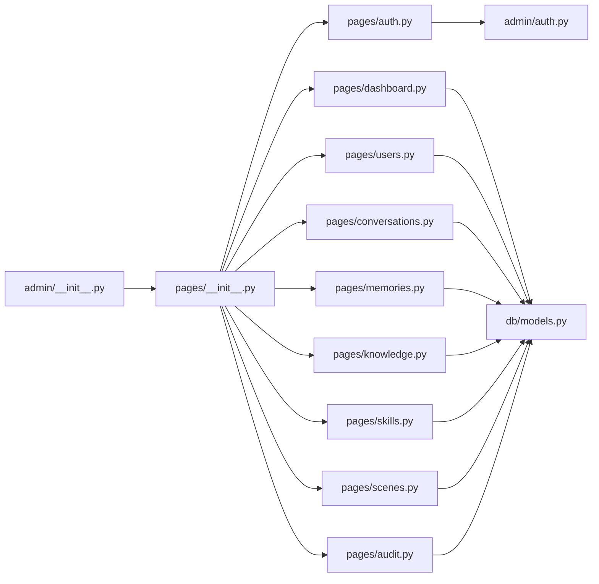

图表来源
- [hushai/meditation/admin/__init__.py:1-15](file://hushai/meditation/admin/__init__.py#L1-L15)
- [hushai/meditation/admin/pages/__init__.py:1-56](file://hushai/meditation/admin/pages/__init__.py#L1-L56)
- [hushai/meditation/admin/auth.py:1-183](file://hushai/meditation/admin/auth.py#L1-L183)
- [hushai/meditation/db/models.py:1-434](file://hushai/meditation/db/models.py#L1-L434)

章节来源
- [hushai/meditation/admin/__init__.py:1-15](file://hushai/meditation/admin/__init__.py#L1-L15)
- [hushai/meditation/admin/pages/__init__.py:1-56](file://hushai/meditation/admin/pages/__init__.py#L1-L56)
- [hushai/meditation/admin/auth.py:1-183](file://hushai/meditation/admin/auth.py#L1-L183)
- [hushai/meditation/db/models.py:1-434](file://hushai/meditation/db/models.py#L1-L434)

## 性能与扩展建议
- 分页与索引
  - 列表页普遍使用分页与 count 查询，建议在常用过滤字段上建立索引（如 user_id、category、created_at）
- 批量操作优化
  - 对话软删除已实现，建议对批量删除增加事务批处理与进度反馈
- 导出性能
  - 大数据量导出建议使用流式写入与分块处理，避免内存峰值
- 缓存策略
  - 仪表盘统计可引入短期缓存（如 Redis）降低频繁查询压力
- 安全加固
  - 生产环境确保 HTTPS 与 secure cookie，严格 CSRF 策略，限制失败重试次数

## 故障排查指南
- 登录失败
  - 检查用户名与密码是否正确，确认管理员是否被禁用（is_active）
  - 确认 JWT 密钥与算法配置正确
- CSRF 验证失败
  - 确认前端在写请求中携带 X-CSRF-Token 且与 Cookie 一致
  - 检查 Cookie 的 samesite 与 secure 设置是否符合部署环境
- 401 未授权
  - 检查 admin_token 是否过期或无效，确认 Authorization 头格式为 Bearer
- 数据导出异常
  - 确认 openpyxl 依赖可用，检查数据是否为空或包含非标准类型
- 审计日志缺失
  - 确认审计记录写入逻辑是否被调用，检查数据库连接与会话提交

章节来源
- [hushai/meditation/admin/auth.py:64-113](file://hushai/meditation/admin/auth.py#L64-L113)
- [hushai/meditation/admin/auth.py:164-183](file://hushai/meditation/admin/auth.py#L164-L183)
- [hushai/meditation/admin/export.py:1-106](file://hushai/meditation/admin/export.py#L1-L106)

## 结论
管理后台提供了完善的安全认证、多管理员管理、审计日志、用户与内容管理、数据统计与导出能力。通过模块化路由与统一的认证装饰器，系统具备良好的可扩展性与可维护性。建议在生产环境中强化安全配置与性能优化，结合审计日志与导出功能提升运营效率与合规性。

## 附录：操作手册与最佳实践
- 管理员登录与登出
  - 使用 /admin/login 登录，成功后跳转到 /admin/
  - 登出后清除 admin_token 与 CSRF Cookie
- 管理员账号管理
  - 新增管理员需满足用户名与密码长度要求，避免重复用户名
  - 编辑时可更新显示名称、启用状态与密码
  - 删除管理员不可删除当前登录账号
- 用户管理
  - 使用搜索框按昵称或 OpenID 查找用户
  - 在详情页查看对话与记忆概览，必要时切换用户状态
- 对话与记忆管理
  - 批量删除对话采用软删除，便于恢复与审计
  - 记忆删除需谨慎，建议先导出备份
- 内容与场景管理
  - 知识库条目支持搜索与批量删除
  - 技能与场景需保证名称/标识唯一性，合理设置排序与启用状态
- 数据导出
  - 选择 CSV 或 Excel 格式，文件名自动附加时间戳
  - 大批量数据建议分批导出，避免超时
- 审计日志
  - 定期审查关键操作，按动作与管理员筛选定位问题

章节来源
- [hushai/meditation/admin/pages/auth.py:1-65](file://hushai/meditation/admin/pages/auth.py#L1-L65)
- [hushai/meditation/admin/pages/admin_users.py:1-208](file://hushai/meditation/admin/pages/admin_users.py#L1-L208)
- [hushai/meditation/admin/pages/users.py:1-146](file://hushai/meditation/admin/pages/users.py#L1-L146)
- [hushai/meditation/admin/pages/conversations.py:1-139](file://hushai/meditation/admin/pages/conversations.py#L1-L139)
- [hushai/meditation/admin/pages/memories.py:1-130](file://hushai/meditation/admin/pages/memories.py#L1-L130)
- [hushai/meditation/admin/pages/knowledge.py:1-163](file://hushai/meditation/admin/pages/knowledge.py#L1-L163)
- [hushai/meditation/admin/pages/skills.py:1-218](file://hushai/meditation/admin/pages/skills.py#L1-L218)
- [hushai/meditation/admin/pages/scenes.py:1-240](file://hushai/meditation/admin/pages/scenes.py#L1-L240)
- [hushai/meditation/admin/export.py:1-106](file://hushai/meditation/admin/export.py#L1-L106)
- [hushai/meditation/admin/pages/audit.py:1-72](file://hushai/meditation/admin/pages/audit.py#L1-L72)