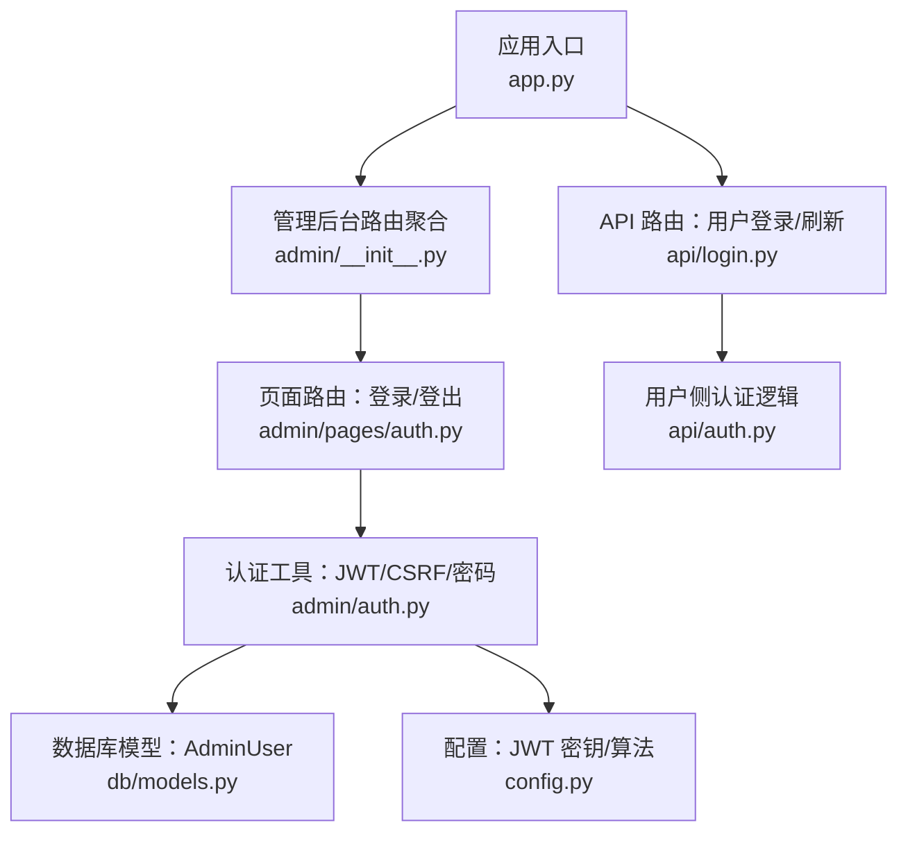
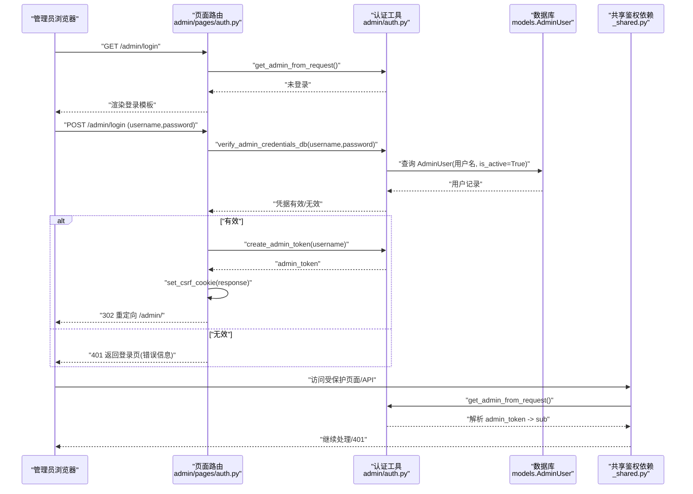
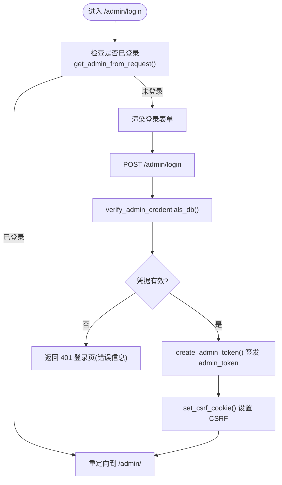
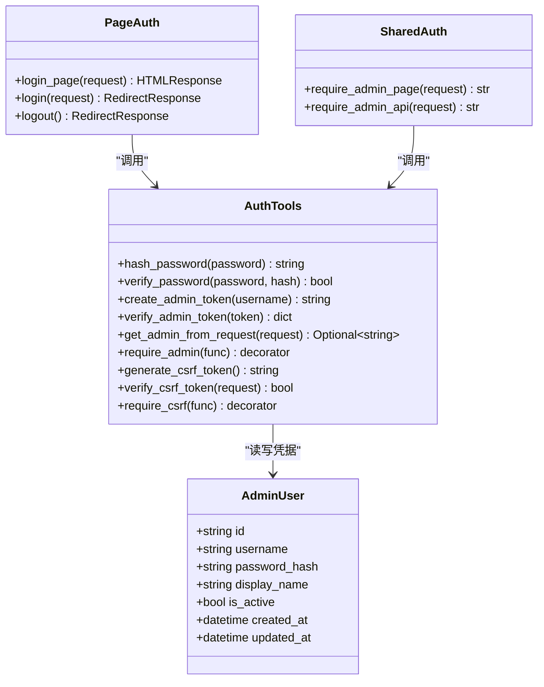
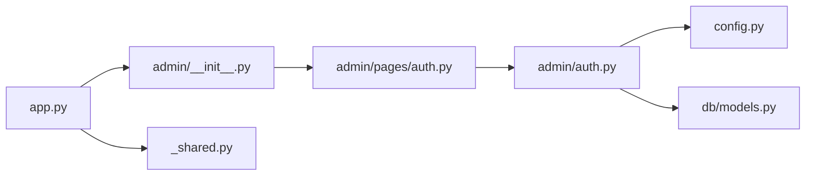

# 管理员认证与权限

<cite>
**本文引用的文件**   
- [app.py](file://hushai/meditation/app.py)
- [admin/auth.py](file://hushai/meditation/admin/auth.py)
- [api/auth.py](file://hushai/meditation/api/auth.py)
- [db/models.py](file://hushai/meditation/db/models.py)
- [config.py](file://hushai/meditation/config.py)
- [admin/pages/auth.py](file://hushai/meditation/admin/pages/auth.py)
- [admin/pages/_shared.py](file://hushai/meditation/admin/pages/_shared.py)
- [api/login.py](file://hushai/meditation/api/login.py)
</cite>

## 目录
1. [简介](#简介)
2. [项目结构](#项目结构)
3. [核心组件](#核心组件)
4. [架构总览](#架构总览)
5. [详细组件分析](#详细组件分析)
6. [依赖关系分析](#依赖关系分析)
7. [性能与安全考量](#性能与安全考量)
8. [故障排查指南](#故障排查指南)
9. [结论](#结论)
10. [附录：操作指南](#附录操作指南)

## 简介
本文件面向 hush.ai 管理后台的认证与权限体系，聚焦以下目标：
- 管理员登录验证机制：基于 Cookie 的 JWT 会话与 CSRF 防护。
- 多管理员账号与权限控制：当前模型支持多管理员账号、启用/禁用状态；访问控制通过装饰器与依赖注入实现。
- 登录页面与安全策略：密码哈希存储、CSRF 保护、Cookie 安全属性与会话过期。
- 管理员账号生命周期：创建（首次启动自动初始化）、修改与删除的操作路径与注意事项。
- 安全最佳实践与常见问题解决方案。

## 项目结构
与管理后台认证相关的关键位置如下：
- 应用入口与路由挂载：负责在应用启动时初始化默认管理员账户，并注册管理后台路由。
- 管理后台认证模块：提供密码哈希、JWT 签发与校验、CSRF 令牌生成与校验、请求级鉴权装饰器。
- 管理后台页面路由：登录/登出页面处理，设置 admin_token 与 CSRF cookie。
- 数据模型：AdminUser 表定义，支撑多管理员账号与活跃状态。
- 配置中心：JWT 密钥、算法、调试开关等关键配置项。
- 公共基础设施：模板渲染、统一鉴权依赖、统计上下文等。

图示来源
- [app.py:136-180](file://hushai/meditation/app.py#L136-L180)
- [admin/__init__.py:1-15](file://hushai/meditation/admin/__init__.py#L1-L15)
- [admin/pages/auth.py:1-65](file://hushai/meditation/admin/pages/auth.py#L1-L65)
- [admin/auth.py:1-183](file://hushai/meditation/admin/auth.py#L1-L183)
- [db/models.py:172-186](file://hushai/meditation/db/models.py#L172-L186)
- [config.py:18-52](file://hushai/meditation/config.py#L18-L52)
- [api/login.py:1-53](file://hushai/meditation/api/login.py#L1-L53)
- [api/auth.py:1-171](file://hushai/meditation/api/auth.py#L1-L171)

章节来源
- [app.py:24-40](file://hushai/meditation/app.py#L24-L40)
- [admin/__init__.py:1-15](file://hushai/meditation/admin/__init__.py#L1-L15)
- [admin/pages/auth.py:1-65](file://hushai/meditation/admin/pages/auth.py#L1-L65)
- [admin/auth.py:1-183](file://hushai/meditation/admin/auth.py#L1-L183)
- [db/models.py:172-186](file://hushai/meditation/db/models.py#L172-L186)
- [config.py:18-52](file://hushai/meditation/config.py#L18-L52)
- [api/login.py:1-53](file://hushai/meditation/api/login.py#L1-L53)
- [api/auth.py:1-171](file://hushai/meditation/api/auth.py#L1-L171)

## 核心组件
- 管理员认证工具集
  - 密码哈希与校验：使用 bcrypt 对密码进行加盐哈希与比对。
  - JWT 签发与校验：根据配置中的密钥与算法签发包含用户名、过期时间、是否管理员标志的令牌；校验时强制要求 is_admin 标志。
  - 请求级鉴权：从 Cookie 或 Authorization 头提取 token，解析后注入到请求上下文；未认证返回 401。
  - CSRF 保护：为表单提交生成随机令牌，写入 Cookie，并在服务端校验请求头携带的 X-CSRF-Token。
- 管理后台页面路由
  - 登录页 GET /admin/login：若已登录则重定向至管理首页；否则渲染登录模板。
  - 登录 POST /admin/login：校验凭据成功后签发 admin_token 与 CSRF cookie，并重定向至管理首页。
  - 登出 GET /admin/logout：删除 admin_token 与 CSRF cookie，重定向回登录页。
- 数据模型
  - AdminUser：唯一用户名、密码哈希、显示名、活跃状态、时间戳等字段，支持多管理员账号。
- 配置
  - JWT 密钥与算法来自环境变量；debug 模式影响 CORS、Cookie secure 属性等。

章节来源
- [admin/auth.py:24-113](file://hushai/meditation/admin/auth.py#L24-L113)
- [admin/pages/auth.py:20-65](file://hushai/meditation/admin/pages/auth.py#L20-L65)
- [db/models.py:172-186](file://hushai/meditation/db/models.py#L172-L186)
- [config.py:18-52](file://hushai/meditation/config.py#L18-L52)

## 架构总览
管理后台认证采用“Cookie + JWT”的无状态会话方案，配合 CSRF 防护与统一的鉴权装饰器，形成前后端分离友好的访问控制链路。

图示来源
- [admin/pages/auth.py:20-65](file://hushai/meditation/admin/pages/auth.py#L20-L65)
- [admin/auth.py:32-113](file://hushai/meditation/admin/auth.py#L32-L113)
- [db/models.py:172-186](file://hushai/meditation/db/models.py#L172-L186)
- [admin/pages/_shared.py:73-91](file://hushai/meditation/admin/pages/_shared.py#L73-L91)

## 详细组件分析

### 管理员登录与会话流程
- 登录页渲染：若检测到已存在有效的 admin_token，直接重定向至管理首页。
- 登录校验：
  - 从数据库查询用户名且 is_active=True 的管理员记录。
  - 使用 bcrypt 校验密码哈希。
  - 成功则签发 admin_token（含 sub、exp、iat、is_admin），并设置 CSRF cookie。
  - 失败返回 401 并提示错误。
- 会话维持：后续请求从 Cookie 或 Authorization 头读取 admin_token，解析后注入 request.state.admin_user。
- 登出：删除 admin_token 与 CSRF cookie，重定向回登录页。

图示来源
- [admin/pages/auth.py:20-65](file://hushai/meditation/admin/pages/auth.py#L20-L65)
- [admin/auth.py:32-113](file://hushai/meditation/admin/auth.py#L32-L113)

章节来源
- [admin/pages/auth.py:20-65](file://hushai/meditation/admin/pages/auth.py#L20-L65)
- [admin/auth.py:32-113](file://hushai/meditation/admin/auth.py#L32-L113)

### 访问控制与权限策略
- 统一鉴权依赖：
  - require_admin_page：用于页面路由，未登录抛 401。
  - require_admin_api：用于 API 路由，未登录抛 401。
- 装饰器 require_admin：封装 get_admin_from_request，未认证抛出 401，并将用户名注入 request.state.admin_user。
- 当前权限粒度：
  - 模型层仅支持 is_active 启用/禁用状态，未实现细粒度的角色与资源权限控制。
  - 可在现有基础上扩展 AdminUser 的角色字段与权限集合，结合装饰器或中间件实现 RBAC。

图示来源
- [db/models.py:172-186](file://hushai/meditation/db/models.py#L172-L186)
- [admin/auth.py:24-113](file://hushai/meditation/admin/auth.py#L24-L113)
- [admin/pages/auth.py:20-65](file://hushai/meditation/admin/pages/auth.py#L20-L65)
- [admin/pages/_shared.py:73-91](file://hushai/meditation/admin/pages/_shared.py#L73-L91)

章节来源
- [admin/auth.py:104-113](file://hushai/meditation/admin/auth.py#L104-L113)
- [admin/pages/_shared.py:73-91](file://hushai/meditation/admin/pages/_shared.py#L73-L91)
- [db/models.py:172-186](file://hushai/meditation/db/models.py#L172-L186)

### 登录页面与安全措施
- 密码加密存储：bcrypt 加盐哈希，避免明文存储。
- CSRF 防护：
  - 生成随机 CSRF 令牌写入 Cookie（httponly=False 以便前端 JS 读取）。
  - 服务端校验请求头 X-CSRF-Token 与 Cookie 一致。
  - 生产环境启用 secure，开发环境关闭以适配本地 HTTP。
- 会话超时：
  - admin_token 有效期由 create_admin_token 中 expire 决定（示例为 24 小时）。
  - 可通过配置调整 JWT 过期策略或在业务层增加刷新机制。
- 登录失败防护：
  - 当前实现未内置速率限制或锁定策略，建议结合全局限流或 IP 级别限制增强。

章节来源
- [admin/auth.py:24-30](file://hushai/meditation/admin/auth.py#L24-L30)
- [admin/auth.py:136-183](file://hushai/meditation/admin/auth.py#L136-L183)
- [admin/pages/auth.py:28-55](file://hushai/meditation/admin/pages/auth.py#L28-L55)
- [config.py:48-51](file://hushai/meditation/config.py#L48-L51)

### 管理员账号生命周期
- 首次启动自动初始化：
  - 应用启动时调用 init_default_admin，若 admin_users 表为空，则根据环境变量 MEDITATION_ADMIN_USERNAME/MEDITATION_ADMIN_PASSWORD 创建默认管理员。
- 修改管理员信息：
  - 当前未提供管理后台的修改接口，需通过数据库或新增 API 更新 AdminUser 的 display_name、password_hash、is_active 等字段。
- 删除管理员账号：
  - 可删除对应记录或将 is_active 置为 False；注意保留审计日志关联。

章节来源
- [app.py:35-39](file://hushai/meditation/app.py#L35-L39)
- [admin/auth.py:116-133](file://hushai/meditation/admin/auth.py#L116-L133)
- [db/models.py:172-186](file://hushai/meditation/db/models.py#L172-L186)

## 依赖关系分析
- 应用入口 app.py 在 lifespan 中初始化数据库与默认管理员，并注册管理后台路由。
- 管理后台路由聚合 admin/__init__.py 暴露 router，供 app.py include_router。
- 页面路由 admin/pages/auth.py 依赖认证工具 admin/auth.py 完成登录/登出与 CSRF。
- 认证工具依赖配置 config.py 获取 JWT 密钥与算法，依赖 db/models.py 的 AdminUser 模型。
- 共享鉴权依赖 admin/pages/_shared.py 提供 require_admin_page/require_admin_api 等通用能力。

图示来源
- [app.py:136-180](file://hushai/meditation/app.py#L136-L180)
- [admin/__init__.py:1-15](file://hushai/meditation/admin/__init__.py#L1-L15)
- [admin/pages/auth.py:1-65](file://hushai/meditation/admin/pages/auth.py#L1-L65)
- [admin/auth.py:1-183](file://hushai/meditation/admin/auth.py#L1-L183)
- [config.py:18-52](file://hushai/meditation/config.py#L18-L52)
- [db/models.py:172-186](file://hushai/meditation/db/models.py#L172-L186)
- [admin/pages/_shared.py:1-110](file://hushai/meditation/admin/pages/_shared.py#L1-L110)

章节来源
- [app.py:136-180](file://hushai/meditation/app.py#L136-L180)
- [admin/__init__.py:1-15](file://hushai/meditation/admin/__init__.py#L1-L15)
- [admin/pages/_shared.py:1-110](file://hushai/meditation/admin/pages/_shared.py#L1-L110)

## 性能与安全考量
- 性能
  - 登录校验涉及一次数据库查询与一次 bcrypt 比对，开销可控。
  - JWT 校验为无状态计算，CPU 开销低。
  - 建议在高频场景引入缓存（如黑名单）以支持主动失效。
- 安全
  - 密码使用 bcrypt 加盐哈希，符合业界标准。
  - CSRF 防护针对表单写操作，防止跨站伪造请求。
  - Cookie 安全属性：生产环境启用 secure，httponly 对 admin_token 启用，降低 XSS 窃取风险。
  - 建议补充：
    - 登录失败次数限制与账户锁定。
    - 敏感操作二次确认与审计日志。
    - 最小权限原则与 RBAC 扩展。

[本节为通用指导，不直接分析具体文件]

## 故障排查指南
- 无法登录
  - 检查环境变量 MEDITATION_ADMIN_USERNAME/MEDITATION_ADMIN_PASSWORD 是否正确。
  - 确认 admin_users 表中是否存在 is_active=True 的记录。
  - 查看登录响应是否返回 401 并提示错误信息。
- Token 无效
  - 确认 JWT 密钥与算法配置一致。
  - 检查客户端是否携带正确的 admin_token（Cookie 或 Authorization 头）。
- CSRF 验证失败
  - 确保前端在写请求中携带 X-CSRF-Token 请求头，值与 Cookie 一致。
  - 检查服务端 set_csrf_cookie 是否在生产环境启用 secure。
- 会话过期
  - 确认 admin_token 过期时间是否符合预期，必要时调整签发逻辑或引入刷新机制。

章节来源
- [admin/auth.py:32-113](file://hushai/meditation/admin/auth.py#L32-L113)
- [admin/auth.py:136-183](file://hushai/meditation/admin/auth.py#L136-L183)
- [admin/pages/auth.py:28-65](file://hushai/meditation/admin/pages/auth.py#L28-L65)
- [config.py:18-52](file://hushai/meditation/config.py#L18-L52)

## 结论
本项目管理后台认证采用成熟的 Cookie+JWT 方案，结合 bcrypt 密码哈希与 CSRF 防护，具备基础的安全性与可扩展性。当前权限模型支持多管理员账号与启用/禁用状态，尚未实现细粒度 RBAC。建议在现有基础上完善登录失败防护、审计日志与角色权限扩展，以满足更严格的合规与运营需求。

[本节为总结性内容，不直接分析具体文件]

## 附录：操作指南
- 创建管理员账号
  - 首次启动会自动创建默认管理员（依据环境变量）。
  - 如需新增管理员，可直接在数据库中插入 AdminUser 记录，并对密码进行 bcrypt 哈希。
- 修改管理员信息
  - 更新 AdminUser 的 display_name、password_hash、is_active 等字段。
  - 建议同步记录审计日志。
- 删除管理员账号
  - 删除对应记录或将 is_active 置为 False。
  - 清理相关会话与令牌（如有集中式黑名单）。
- 安全最佳实践
  - 严格保管 JWT 密钥与算法配置。
  - 生产环境启用 HTTPS 与 Cookie secure。
  - 实施登录失败限制与异常告警。
  - 定期轮换密钥与审查审计日志。

章节来源
- [app.py:35-39](file://hushai/meditation/app.py#L35-L39)
- [admin/auth.py:116-133](file://hushai/meditation/admin/auth.py#L116-L133)
- [db/models.py:172-186](file://hushai/meditation/db/models.py#L172-L186)
- [config.py:18-52](file://hushai/meditation/config.py#L18-L52)