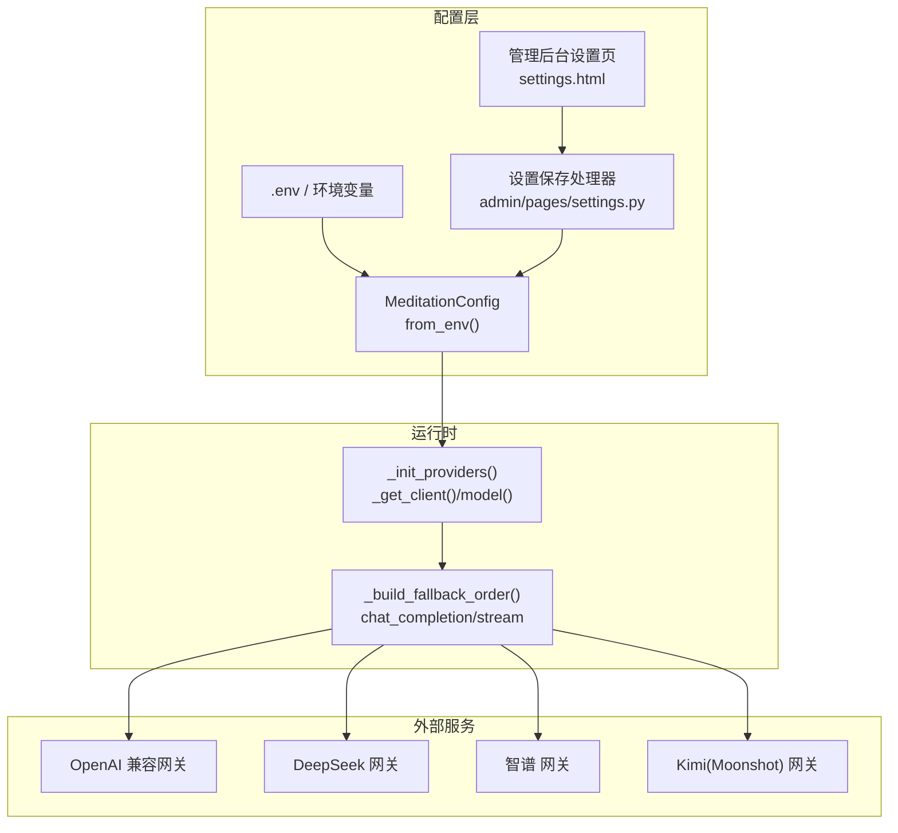
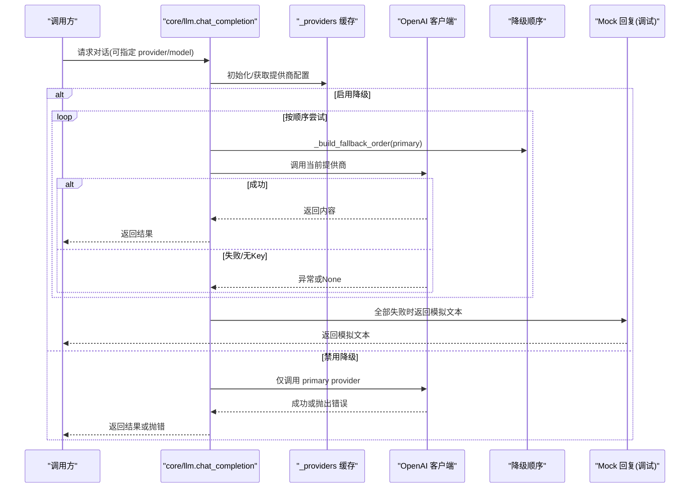
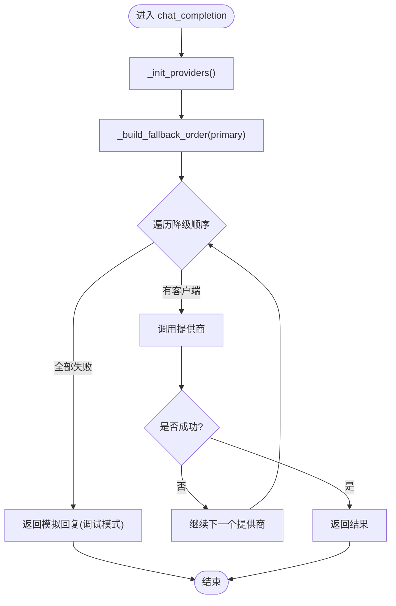
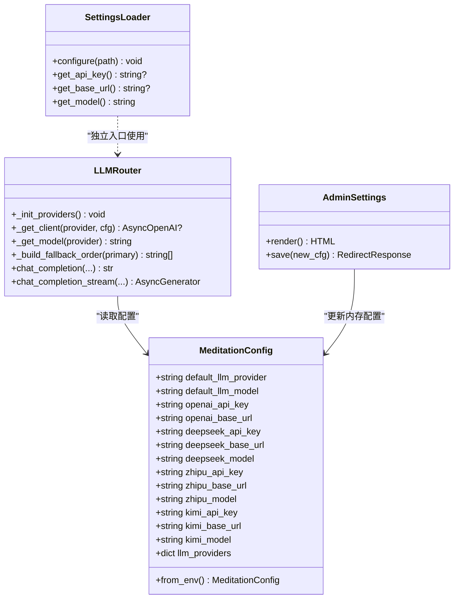

# LLM模型配置

<cite>
**本文引用的文件**
- [hushai/meditation/core/llm.py](file://hushai/meditation/core/llm.py)
- [hushai/meditation/config.py](file://hushai/meditation/config.py)
- [hushai/meditation/admin/templates/settings.html](file://hushai/meditation/admin/templates/settings.html)
- [hushai/meditation/admin/pages/settings.py](file://hushai/meditation/admin/pages/settings.py)
- [hushai/llm.py](file://hushai/llm.py)
- [hushai/settings.py](file://hushai/settings.py)
- [tests/test_llm_core.py](file://tests/test_llm_core.py)
- [tests/test_settings.py](file://tests/test_settings.py)
- [README.md](file://README.md)
- [docs/configuration.md](file://docs/configuration.md)
</cite>

## 目录
1. [简介](#简介)
2. [项目结构](#项目结构)
3. [核心组件](#核心组件)
4. [架构总览](#架构总览)
5. [详细组件分析](#详细组件分析)
6. [依赖关系分析](#依赖关系分析)
7. [性能与可用性考虑](#性能与可用性考虑)
8. [故障排查指南](#故障排查指南)
9. [结论](#结论)
10. [附录：配置项与环境变量清单](#附录配置项与环境变量清单)

## 简介
本文件面向 hush.ai 的 LLM 模型配置能力，覆盖以下目标：
- 支持的 LLM 提供商：OpenAI、DeepSeek、智谱（Zhipu）、Kimi（Moonshot）
- 各提供商的配置方法：API Key、Base URL、模型名称
- 默认模型提供商的设置流程与优先级规则
- 多模型切换机制与故障转移策略
- 各提供商配置示例与最佳实践
- API 密钥的安全存储与管理建议

## 项目结构
与 LLM 配置相关的关键位置：
- 冥想模块专用配置与运行时注入：hushai/meditation/config.py
- 多模型路由与降级逻辑：hushai/meditation/core/llm.py
- 管理后台设置页面与保存逻辑：hushai/meditation/admin/templates/settings.html、hushai/meditation/admin/pages/settings.py
- 通用 OpenAI 兼容调用入口（CLI/旧版）：hushai/llm.py、hushai/settings.py
- 文档与测试：docs/configuration.md、tests/*

图表来源
- [hushai/meditation/config.py:18-115](file://hushai/meditation/config.py#L18-L115)
- [hushai/meditation/core/llm.py:21-90](file://hushai/meditation/core/llm.py#L21-L90)
- [hushai/meditation/admin/templates/settings.html:47-155](file://hushai/meditation/admin/templates/settings.html#L47-L155)
- [hushai/meditation/admin/pages/settings.py:99-122](file://hushai/meditation/admin/pages/settings.py#L99-L122)

章节来源
- [hushai/meditation/config.py:18-115](file://hushai/meditation/config.py#L18-L115)
- [hushai/meditation/core/llm.py:21-90](file://hushai/meditation/core/llm.py#L21-L90)
- [hushai/meditation/admin/templates/settings.html:47-155](file://hushai/meditation/admin/templates/settings.html#L47-L155)
- [hushai/meditation/admin/pages/settings.py:99-122](file://hushai/meditation/admin/pages/settings.py#L99-L122)

## 核心组件
- MeditationConfig：从环境变量加载冥想模块配置，包含默认提供商、默认模型与各提供商的 API Key、Base URL、模型名。
- core/llm：构建并缓存提供商配置，提供 chat_completion/chat_completion_stream，内置自动降级顺序。
- 管理后台设置：通过 Web UI 修改默认提供商、默认模型及各提供商参数，保存后生效。
- 通用 OpenAI 兼容入口（CLI/旧版）：基于 settings.py 读取 LLM_APPKEY、OPENAI_BASE_URL、LLM_MODEL 等。

章节来源
- [hushai/meditation/config.py:18-115](file://hushai/meditation/config.py#L18-L115)
- [hushai/meditation/core/llm.py:21-90](file://hushai/meditation/core/llm.py#L21-L90)
- [hushai/meditation/admin/templates/settings.html:47-155](file://hushai/meditation/admin/templates/settings.html#L47-L155)
- [hushai/meditation/admin/pages/settings.py:99-122](file://hushai/meditation/admin/pages/settings.py#L99-L122)
- [hushai/llm.py:100-141](file://hushai/llm.py#L100-L141)
- [hushai/settings.py:123-182](file://hushai/settings.py#L123-L182)

## 架构总览
下图展示了“默认提供商 + 自动降级”的整体流程：当主提供商不可用时，系统按固定顺序尝试其他提供商，直至成功或回退到本地模拟回复。

图表来源
- [hushai/meditation/core/llm.py:82-178](file://hushai/meditation/core/llm.py#L82-L178)
- [hushai/meditation/core/llm.py:136-178](file://hushai/meditation/core/llm.py#L136-L178)

## 详细组件分析

### 组件一：MeditationConfig 配置模型
- 作用：集中定义所有运行期配置字段，包括默认提供商、默认模型以及各提供商的 API Key、Base URL、模型名。
- 关键行为：
  - from_env()：从环境变量映射到字段，支持字符串、整数、布尔类型转换。
  - get_config()/set_config()：进程内单例式读写，便于测试替换。
- 重要字段（节选）：
  - default_llm_provider、default_llm_model
  - openai_api_key/openai_base_url
  - deepseek_api_key/deepseek_base_url/deepseek_model
  - zhipu_api_key/zhipu_base_url/zhipu_model
  - kimi_api_key/kimi_base_url/kimi_model
  - llm_providers：动态扩展自定义提供商字典

章节来源
- [hushai/meditation/config.py:18-115](file://hushai/meditation/config.py#L18-L115)

### 组件二：多模型路由与降级（core/llm）
- 作用：根据配置初始化提供商集合，构造降级顺序，执行非流式/流式对话，并在失败时自动切换到下一个可用提供商。
- 关键函数与职责：
  - _init_providers()：合并内置提供商与自定义 llm_providers。
  - _get_client(provider, cfg)：校验 API Key，创建 AsyncOpenAI 客户端；debug 且无 key 时返回 None 以走 mock。
  - _get_model(provider)：取对应提供商的 model，未配置则回退默认。
  - _build_fallback_order(primary)：生成降级顺序，primary 优先，其余按 DEFAULT_PROVIDER_ORDER 补齐去重。
  - chat_completion()/chat_completion_stream()：主入口，支持 enable_fallback 开关。
- 默认降级顺序：deepseek → zhipu → kimi → openai（若 primary 不在其中，会前置 primary）。

图表来源
- [hushai/meditation/core/llm.py:21-90](file://hushai/meditation/core/llm.py#L21-L90)
- [hushai/meditation/core/llm.py:136-178](file://hushai/meditation/core/llm.py#L136-L178)

章节来源
- [hushai/meditation/core/llm.py:21-90](file://hushai/meditation/core/llm.py#L21-L90)
- [hushai/meditation/core/llm.py:136-178](file://hushai/meditation/core/llm.py#L136-L178)
- [tests/test_llm_core.py:21-45](file://tests/test_llm_core.py#L21-L45)

### 组件三：管理后台设置与持久化
- 界面字段：默认 LLM 提供商、默认模型，以及 DeepSeek、智谱、Kimi 各自的 API Key、Base URL、模型。
- 保存逻辑：将表单值写入新的 MeditationConfig 并通过 set_config() 更新内存配置，立即生效。

章节来源
- [hushai/meditation/admin/templates/settings.html:47-155](file://hushai/meditation/admin/templates/settings.html#L47-L155)
- [hushai/meditation/admin/pages/settings.py:99-122](file://hushai/meditation/admin/pages/settings.py#L99-L122)

### 组件四：通用 OpenAI 兼容入口（CLI/旧版）
- 作用：为 CLI 或旧版路径提供统一的 OpenAI Chat Completions 调用封装。
- 配置来源：settings.py 中的 get_api_key/get_base_url/get_model 等，遵循“环境变量优先于配置文件”的规则。
- 错误处理：将 OpenAI SDK 异常转换为可读中文提示。

章节来源
- [hushai/llm.py:100-141](file://hushai/llm.py#L100-L141)
- [hushai/settings.py:123-182](file://hushai/settings.py#L123-L182)

## 依赖关系分析
- 配置来源依赖：
  - 环境变量：MEDITATION_* 系列变量由 MeditationConfig.from_env() 解析。
  - 管理后台：Web 表单提交后通过 set_config() 更新内存配置。
- 运行时依赖：
  - core/llm 依赖 MeditationConfig 提供的各提供商配置。
  - 对外依赖 OpenAI SDK 的 AsyncOpenAI 客户端，统一适配多家兼容 OpenAI 协议的网关。

图表来源
- [hushai/meditation/config.py:18-115](file://hushai/meditation/config.py#L18-L115)
- [hushai/meditation/core/llm.py:21-90](file://hushai/meditation/core/llm.py#L21-L90)
- [hushai/meditation/admin/pages/settings.py:99-122](file://hushai/meditation/admin/pages/settings.py#L99-L122)
- [hushai/settings.py:98-182](file://hushai/settings.py#L98-L182)

章节来源
- [hushai/meditation/config.py:18-115](file://hushai/meditation/config.py#L18-L115)
- [hushai/meditation/core/llm.py:21-90](file://hushai/meditation/core/llm.py#L21-L90)
- [hushai/meditation/admin/pages/settings.py:99-122](file://hushai/meditation/admin/pages/settings.py#L99-L122)
- [hushai/settings.py:98-182](file://hushai/settings.py#L98-L182)

## 性能与可用性考虑
- 超时与重试：
  - 通用入口支持 LLM_TIMEOUT、LLM_MAX_RETRIES 控制单次请求超时与 SDK 重试次数。
  - 冥想模块在创建客户端时区分 debug 与非 debug 超时（debug 更长），避免开发调试阻塞。
- 降级策略：
  - 默认顺序 deepseek → zhipu → kimi → openai，确保主提供商失败时可快速恢复。
  - 流式与非流式均支持降级，但流式在失败时会记录警告并继续尝试下一个提供商。
- 资源占用：
  - 提供商配置在进程内缓存，避免重复解析。
  - 建议在多实例部署中通过环境变量集中管理密钥，减少配置漂移。

章节来源
- [hushai/settings.py:189-218](file://hushai/settings.py#L189-L218)
- [hushai/meditation/core/llm.py:59-71](file://hushai/meditation/core/llm.py#L59-L71)
- [hushai/meditation/core/llm.py:136-178](file://hushai/meditation/core/llm.py#L136-L178)

## 故障排查指南
- 常见错误与定位：
  - 未配置 API Key：检查对应提供商的 MEDITATION_*_API_KEY 或管理后台设置。
  - Base URL 不可达：确认 MEDITATION_*_BASE_URL 指向正确的 OpenAI 兼容网关。
  - 模型不存在：核对 MEDITATION_*_MODEL 是否为该网关有效模型名。
  - 超时/限流：调整 LLM_TIMEOUT/LLM_MAX_RETRIES，或联系网关侧提升配额。
- 诊断步骤：
  - 查看日志中的降级信息（如 “LLM fallback: ... -> ...”）。
  - 临时关闭 enable_fallback 以锁定单一提供商进行复现。
  - 在调试模式下，若无 Key 会返回模拟文本，用于验证前端链路。

章节来源
- [hushai/meditation/core/llm.py:136-178](file://hushai/meditation/core/llm.py#L136-L178)
- [hushai/llm.py:81-97](file://hushai/llm.py#L81-L97)

## 结论
hush.ai 的 LLM 配置体系围绕“多提供商 + 自动降级”展开，既满足生产高可用需求，又兼顾开发调试体验。通过环境变量与管理后台双通道配置，结合清晰的优先级与默认值，用户可灵活选择默认提供商与模型，并在任一提供商异常时快速恢复。

## 附录：配置项与环境变量清单

### 环境变量（MEDITATION_*）
- 默认与全局
  - MEDITATION_DEFAULT_LLM_PROVIDER：默认提供商（openai/deepseek/zhipu/kimi）
  - MEDITATION_DEFAULT_LLM_MODEL：默认模型名
- OpenAI
  - MEDITATION_OPENAI_API_KEY
  - MEDITATION_OPENAI_BASE_URL
- DeepSeek
  - MEDITATION_DEEPSEEK_API_KEY
  - MEDITATION_DEEPSEEK_BASE_URL
  - MEDITATION_DEEPSEEK_MODEL
- 智谱（Zhipu）
  - MEDITATION_ZHIPU_API_KEY
  - MEDITATION_ZHIPU_BASE_URL
  - MEDITATION_ZHIPU_MODEL
- Kimi（Moonshot）
  - MEDITATION_KIMI_API_KEY
  - MEDITATION_KIMI_BASE_URL
  - MEDITATION_KIMI_MODEL
- 其他（示例）
  - MEDITATION_MEMORY_TOP_K、MEDITATION_KNOWLEDGE_TOP_K、MEDITATION_CONVERSATION_MAX_TURNS
  - MEDITATION_EMBEDDING_PROVIDER/MODEL/API_KEY/BASE_URL
  - MEDITATION_HOST、MEDITATION_PORT、MEDITATION_DEBUG

章节来源
- [hushai/meditation/config.py:64-115](file://hushai/meditation/config.py#L64-L115)

### 管理后台设置项
- 默认 LLM 提供商、默认模型
- 各提供商的 API Key、Base URL、模型

章节来源
- [hushai/meditation/admin/templates/settings.html:47-155](file://hushai/meditation/admin/templates/settings.html#L47-L155)

### 通用 OpenAI 兼容入口（CLI/旧版）
- LLM_APPKEY：API Key（环境变量优先）
- OPENAI_BASE_URL：网关 Base URL
- LLM_MODEL：模型名
- LLM_TIMEOUT、LLM_MAX_RETRIES：超时与重试
- HUSH_MODE/hush_mode：对话模式（calm/focus/hype/plain/pua）

章节来源
- [hushai/settings.py:123-182](file://hushai/settings.py#L123-L182)
- [docs/configuration.md:17-64](file://docs/configuration.md#L17-L64)

### 配置示例（说明性）
- 仅使用 OpenAI 兼容网关
  - 设置 MEDITATION_OPENAI_API_KEY 与 MEDITATION_OPENAI_BASE_URL
  - 设置 MEDITATION_DEFAULT_LLM_PROVIDER=openai，MEDITATION_DEFAULT_LLM_MODEL=你的模型名
- 同时配置多个提供商并启用降级
  - 分别设置 DeepSeek、智谱、Kimi 的 *_API_KEY/*_BASE_URL/*_MODEL
  - 保持 MEDITATION_DEFAULT_LLM_PROVIDER 指向你最常用的提供商
  - 系统会在其失败时自动尝试 deepseek → zhipu → kimi → openai

[本节为概念性示例，不直接引用具体代码行]

### 安全与最佳实践
- 密钥管理
  - 优先使用环境变量或 CI 机密管理，避免将密钥写入版本库
  - 配置文件权限最小化（如 Unix chmod 600）
- 网络与端点
  - 使用可信的 OpenAI 兼容网关地址，避免中间人风险
- 调试模式
  - 开启 MEDITATION_DEBUG 可在无 Key 时返回模拟文本，便于联调
- 降级策略
  - 合理设置默认提供商，确保主链路与备用链路均具备有效 Key
  - 监控日志中的降级事件，及时修复上游问题

章节来源
- [docs/configuration.md:109-114](file://docs/configuration.md#L109-L114)
- [hushai/meditation/core/llm.py:59-71](file://hushai/meditation/core/llm.py#L59-L71)