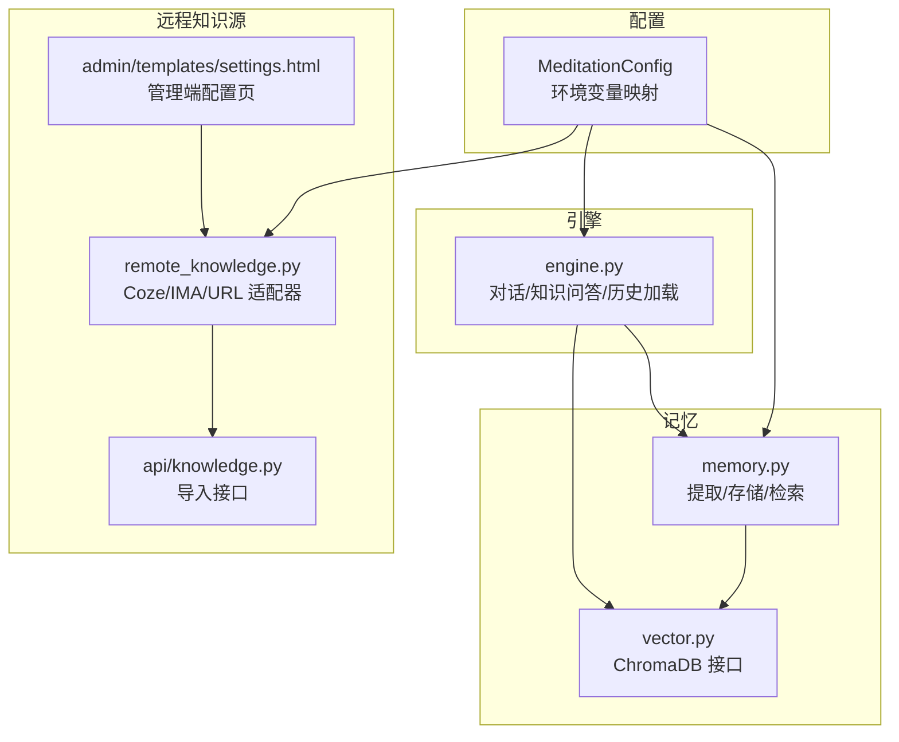
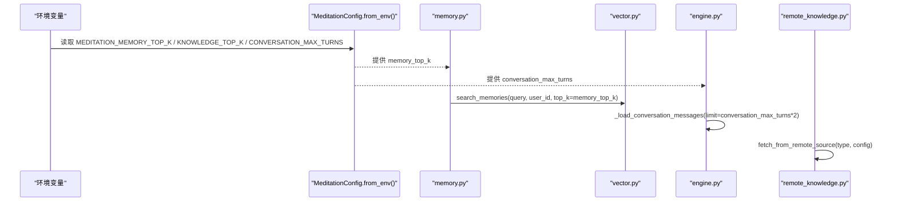
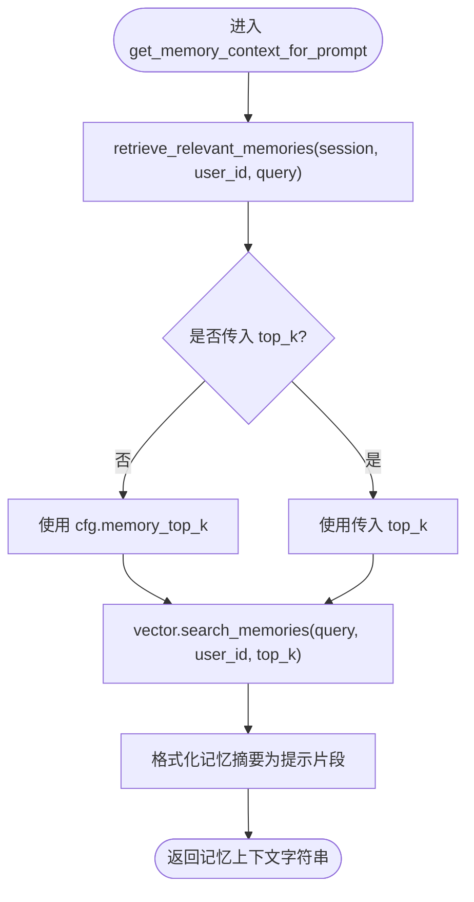
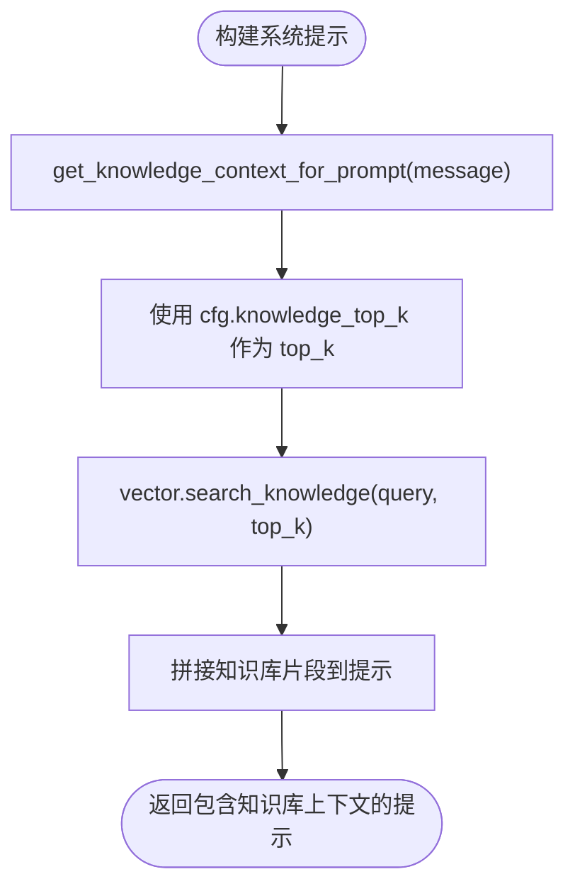
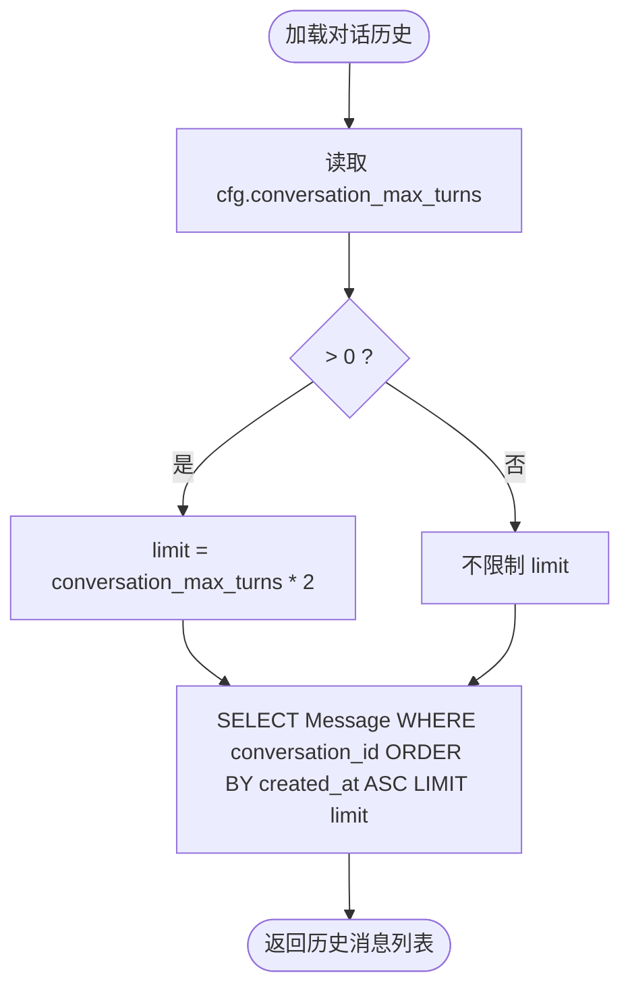
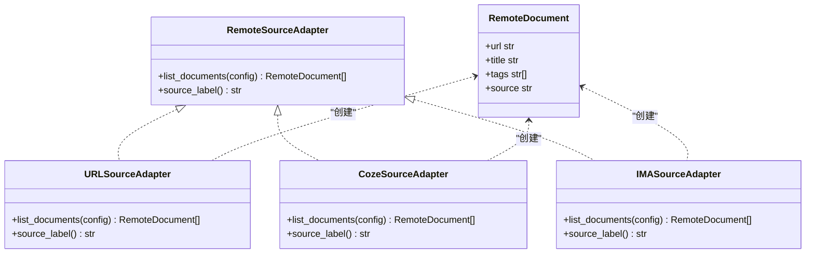
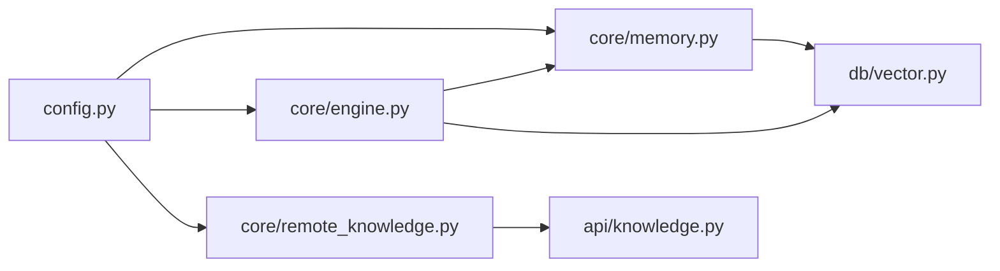

# 知识库系统配置

<cite>
**本文引用的文件**   
- [hushai/meditation/config.py](file://hushai/meditation/config.py)
- [hushai/meditation/core/memory.py](file://hushai/meditation/core/memory.py)
- [hushai/meditation/db/vector.py](file://hushai/meditation/db/vector.py)
- [hushai/meditation/core/engine.py](file://hushai/meditation/core/engine.py)
- [hushai/meditation/core/remote_knowledge.py](file://hushai/meditation/core/remote_knowledge.py)
- [hushai/meditation/api/knowledge.py](file://hushai/meditation/api/knowledge.py)
- [hushai/meditation/admin/templates/settings.html](file://hushai/meditation/admin/templates/settings.html)
- [tests/meditation/test_core.py](file://tests/meditation/test_core.py)
- [tests/meditation/test_engine.py](file://tests/meditation/test_engine.py)
</cite>

## 目录
1. [简介](#简介)
2. [项目结构](#项目结构)
3. [核心组件](#核心组件)
4. [架构总览](#架构总览)
5. [详细组件分析](#详细组件分析)
6. [依赖关系分析](#依赖关系分析)
7. [性能与调优建议](#性能与调优建议)
8. [故障排查指南](#故障排查指南)
9. [结论](#结论)

## 简介
本文件面向 hush.ai 的知识库系统配置，聚焦以下目标：
- 记忆检索参数 memory_top_k 的含义、影响与调优方法
- 知识检索参数 knowledge_top_k 对搜索结果的影响与使用方式
- 对话轮次限制 conversation_max_turns 的作用机制
- 远程知识源（Coze、IMA、URL）的配置与集成流程
- 配置优化与性能调优实践建议

## 项目结构
与知识库配置相关的核心代码分布在以下模块：
- 配置定义与环境变量映射：MeditationConfig
- 记忆检索与上下文组装：memory 模块
- 向量检索接口：vector 模块（ChromaDB）
- 引擎编排：engine 模块（对话、知识问答、历史加载）
- 远程知识源适配与导入：remote_knowledge 模块
- 管理端设置页面：settings.html

图表来源
- [hushai/meditation/config.py:18-115](file://hushai/meditation/config.py#L18-L115)
- [hushai/meditation/core/memory.py:115-173](file://hushai/meditation/core/memory.py#L115-L173)
- [hushai/meditation/db/vector.py:104-173](file://hushai/meditation/db/vector.py#L104-L173)
- [hushai/meditation/core/engine.py:59-75](file://hushai/meditation/core/engine.py#L59-L75)
- [hushai/meditation/core/remote_knowledge.py:179-183](file://hushai/meditation/core/remote_knowledge.py#L179-L183)
- [hushai/meditation/api/knowledge.py:249-279](file://hushai/meditation/api/knowledge.py#L249-L279)
- [hushai/meditation/admin/templates/settings.html:157-205](file://hushai/meditation/admin/templates/settings.html#L157-L205)

章节来源
- [hushai/meditation/config.py:18-115](file://hushai/meditation/config.py#L18-L115)
- [hushai/meditation/core/memory.py:115-173](file://hushai/meditation/core/memory.py#L115-L173)
- [hushai/meditation/db/vector.py:104-173](file://hushai/meditation/db/vector.py#L104-L173)
- [hushai/meditation/core/engine.py:59-75](file://hushai/meditation/core/engine.py#L59-L75)
- [hushai/meditation/core/remote_knowledge.py:179-183](file://hushai/meditation/core/remote_knowledge.py#L179-L183)
- [hushai/meditation/api/knowledge.py:249-279](file://hushai/meditation/api/knowledge.py#L249-L279)
- [hushai/meditation/admin/templates/settings.html:157-205](file://hushai/meditation/admin/templates/settings.html#L157-L205)

## 核心组件
- 配置中心 MeditationConfig：集中定义 memory_top_k、knowledge_top_k、conversation_max_turns 等关键参数，并提供 from_env 从环境变量加载。
- 记忆检索 memory：根据当前消息检索相关记忆，返回用于提示的摘要文本；top_k 由配置决定。
- 向量检索 vector：封装 ChromaDB 的查询接口，支持按 top_k 返回相似度结果。
- 引擎 engine：编排对话、知识问答、历史加载；其中历史加载受 conversation_max_turns 控制。
- 远程知识源 remote_knowledge：提供 Coze、IMA、URL 三种适配器的文档抓取与入库能力。

章节来源
- [hushai/meditation/config.py:40-42](file://hushai/meditation/config.py#L40-L42)
- [hushai/meditation/core/memory.py:115-173](file://hushai/meditation/core/memory.py#L115-L173)
- [hushai/meditation/db/vector.py:104-173](file://hushai/meditation/db/vector.py#L104-L173)
- [hushai/meditation/core/engine.py:59-75](file://hushai/meditation/core/engine.py#L59-L75)
- [hushai/meditation/core/remote_knowledge.py:179-183](file://hushai/meditation/core/remote_knowledge.py#L179-L183)

## 架构总览
下图展示配置项在系统中的流转路径：环境变量 → MeditationConfig → 各模块消费配置。

图表来源
- [hushai/meditation/config.py:63-115](file://hushai/meditation/config.py#L63-L115)
- [hushai/meditation/core/memory.py:115-173](file://hushai/meditation/core/memory.py#L115-L173)
- [hushai/meditation/db/vector.py:144-173](file://hushai/meditation/db/vector.py#L144-L173)
- [hushai/meditation/core/engine.py:59-75](file://hushai/meditation/core/engine.py#L59-L75)
- [hushai/meditation/core/remote_knowledge.py:250-291](file://hushai/meditation/core/remote_knowledge.py#L250-L291)

## 详细组件分析

### 记忆检索参数 memory_top_k
- 含义与作用
  - memory_top_k 控制“用户记忆”向量检索时返回的相关条目数量，直接影响注入到提示中的记忆上下文长度与多样性。
  - 该值越大，模型可参考的用户背景信息越多，但也会增加提示长度与 LLM 调用成本。
- 配置来源
  - 通过环境变量 MEDITATION_MEMORY_TOP_K 覆盖默认值（默认 5）。
- 使用位置
  - 记忆检索 retrieve_relevant_memories 中，若未显式传入 top_k，则回退到配置的 memory_top_k。
  - 底层调用 vector.search_memories 执行向量检索。
- 影响范围
  - 仅影响“记忆”集合的检索规模，不影响“知识库”集合的检索规模。
- 测试验证
  - 单元测试断言默认值为 5，并可通过环境变量覆盖为其他数值。

图表来源
- [hushai/meditation/core/memory.py:161-173](file://hushai/meditation/core/memory.py#L161-L173)
- [hushai/meditation/core/memory.py:115-138](file://hushai/meditation/core/memory.py#L115-L138)
- [hushai/meditation/db/vector.py:144-173](file://hushai/meditation/db/vector.py#L144-L173)
- [hushai/meditation/config.py:40-40](file://hushai/meditation/config.py#L40-L40)
- [tests/meditation/test_core.py:117-141](file://tests/meditation/test_core.py#L117-L141)

章节来源
- [hushai/meditation/config.py:40-40](file://hushai/meditation/config.py#L40-L40)
- [hushai/meditation/core/memory.py:115-173](file://hushai/meditation/core/memory.py#L115-L173)
- [hushai/meditation/db/vector.py:144-173](file://hushai/meditation/db/vector.py#L144-L173)
- [tests/meditation/test_core.py:117-141](file://tests/meditation/test_core.py#L117-L141)

### 知识检索参数 knowledge_top_k
- 含义与作用
  - knowledge_top_k 控制“知识库”向量检索时返回的相关条目数量，直接影响注入到提示中的知识库上下文长度与多样性。
  - 该值越大，模型可参考的外部知识越多，但同样会增加提示长度与 LLM 调用成本。
- 配置来源
  - 通过环境变量 MEDITATION_KNOWLEDGE_TOP_K 覆盖默认值（默认 3）。
- 使用位置
  - 在构建系统提示时，会调用知识上下文获取函数，内部使用配置的 knowledge_top_k 进行检索。
- 注意
  - 知识问答接口 knowledge_qa 在构造提示时使用了固定 top_k=8 的检索调用，这属于特定接口的硬编码行为，与全局 knowledge_top_k 不同。
- 测试验证
  - 单元测试断言默认值为 3。

图表来源
- [hushai/meditation/config.py:41-41](file://hushai/meditation/config.py#L41-L41)
- [hushai/meditation/db/vector.py:104-127](file://hushai/meditation/db/vector.py#L104-L127)
- [tests/meditation/test_core.py:117-141](file://tests/meditation/test_core.py#L117-L141)

章节来源
- [hushai/meditation/config.py:41-41](file://hushai/meditation/config.py#L41-L41)
- [hushai/meditation/db/vector.py:104-127](file://hushai/meditation/db/vector.py#L104-L127)
- [tests/meditation/test_core.py:117-141](file://tests/meditation/test_core.py#L117-L141)

### 对话轮次限制 conversation_max_turns
- 作用机制
  - 在加载对话历史时，若配置大于 0，则按 conversation_max_turns * 2 限制返回的消息条数（每轮包含用户与助手两条消息），从而控制提示中的历史长度。
- 配置来源
  - 通过环境变量 MEDITATION_CONVERSATION_MAX_TURNS 覆盖默认值（默认 20）。
- 影响范围
  - 仅影响历史消息加载上限，不改变记忆或知识库检索的 top_k。
- 测试验证
  - 单元测试验证当 max_turns 设置为 3 时，最终格式化的历史行数为 3。

图表来源
- [hushai/meditation/core/engine.py:59-75](file://hushai/meditation/core/engine.py#L59-L75)
- [hushai/meditation/config.py:42-42](file://hushai/meditation/config.py#L42-L42)
- [tests/meditation/test_core.py:109-113](file://tests/meditation/test_core.py#L109-L113)

章节来源
- [hushai/meditation/core/engine.py:59-75](file://hushai/meditation/core/engine.py#L59-L75)
- [hushai/meditation/config.py:42-42](file://hushai/meditation/config.py#L42-L42)
- [tests/meditation/test_core.py:109-113](file://tests/meditation/test_core.py#L109-L113)

### 远程知识源配置（Coze、IMA、URL）
- 支持的源类型
  - URL：直接抓取任意 HTTP(S) 地址的 Markdown/文本内容。
  - Coze：通过 Coze API 拉取文档列表与内容，需配置 api_base、api_token、dataset_id。
  - IMA：通过分享链接或导出 URL 抓取文档，支持可选 Cookie 鉴权。
- 配置入口
  - 管理端设置页面 settings.html 提供表单字段保存远程知识源配置。
  - 后端 API 提供 import-remote 接口，根据 source_type 路由到对应适配器。
- 适配器实现
  - remote_knowledge.py 定义了 URLSourceAdapter、CozeSourceAdapter、IMASourceAdapter，统一通过 list_documents 返回 RemoteDocument 列表。
  - 抓取与导入流程：并发抓取（Semaphore 控制）、解析内容、切片入库。
- 典型配置项
  - Coze：api_base、api_token、dataset_id
  - IMA：urls（每行一个）、cookie（可选）
  - URL：urls（每行一个）

图表来源
- [hushai/meditation/core/remote_knowledge.py:34-40](file://hushai/meditation/core/remote_knowledge.py#L34-L40)
- [hushai/meditation/core/remote_knowledge.py:45-61](file://hushai/meditation/core/remote_knowledge.py#L45-L61)
- [hushai/meditation/core/remote_knowledge.py:67-143](file://hushai/meditation/core/remote_knowledge.py#L67-L143)
- [hushai/meditation/core/remote_knowledge.py:152-173](file://hushai/meditation/core/remote_knowledge.py#L152-L173)
- [hushai/meditation/core/remote_knowledge.py:24-32](file://hushai/meditation/core/remote_knowledge.py#L24-L32)

章节来源
- [hushai/meditation/core/remote_knowledge.py:45-61](file://hushai/meditation/core/remote_knowledge.py#L45-L61)
- [hushai/meditation/core/remote_knowledge.py:67-143](file://hushai/meditation/core/remote_knowledge.py#L67-L143)
- [hushai/meditation/core/remote_knowledge.py:152-173](file://hushai/meditation/core/remote_knowledge.py#L152-L173)
- [hushai/meditation/api/knowledge.py:249-279](file://hushai/meditation/api/knowledge.py#L249-L279)
- [hushai/meditation/admin/templates/settings.html:157-205](file://hushai/meditation/admin/templates/settings.html#L157-L205)

## 依赖关系分析
- 配置依赖
  - 所有模块通过 get_config() 获取 MeditationConfig，避免硬编码。
- 记忆与向量
  - memory.py 依赖 vector.py 的 search_memories/add_memory_embedding。
- 引擎与历史
  - engine.py 在加载历史时依赖 conversation_max_turns 计算 limit。
- 远程知识源
  - remote_knowledge.py 通过适配器模式扩展新的外部源，API 层根据 source_type 路由。

图表来源
- [hushai/meditation/config.py:121-125](file://hushai/meditation/config.py#L121-L125)
- [hushai/meditation/core/memory.py:115-173](file://hushai/meditation/core/memory.py#L115-L173)
- [hushai/meditation/core/engine.py:59-75](file://hushai/meditation/core/engine.py#L59-L75)
- [hushai/meditation/core/remote_knowledge.py:250-291](file://hushai/meditation/core/remote_knowledge.py#L250-L291)
- [hushai/meditation/api/knowledge.py:249-279](file://hushai/meditation/api/knowledge.py#L249-L279)

章节来源
- [hushai/meditation/config.py:121-125](file://hushai/meditation/config.py#L121-L125)
- [hushai/meditation/core/memory.py:115-173](file://hushai/meditation/core/memory.py#L115-L173)
- [hushai/meditation/core/engine.py:59-75](file://hushai/meditation/core/engine.py#L59-L75)
- [hushai/meditation/core/remote_knowledge.py:250-291](file://hushai/meditation/core/remote_knowledge.py#L250-L291)
- [hushai/meditation/api/knowledge.py:249-279](file://hushai/meditation/api/knowledge.py#L249-L279)

## 性能与调优建议
- memory_top_k 调优
  - 建议从默认 5 起步，逐步增大至 8-10，观察提示长度与回答质量变化。
  - 过大会导致提示过长、LLM 响应变慢且成本上升；过小可能遗漏重要用户背景。
- knowledge_top_k 调优
  - 建议从默认 3 起步，结合业务场景调整至 5-8。
  - 注意知识问答接口 knowledge_qa 使用固定 top_k=8，如需统一策略，可在该接口改为读取配置。
- conversation_max_turns 调优
  - 默认 20 轮，实际加载 limit=40 条消息。可根据会话长度与提示预算调整。
  - 过大将显著增加提示长度与延迟；过小可能导致上下文丢失。
- 远程知识源抓取
  - 并发抓取使用 Semaphore 控制最大并发（默认 5），可按网络与服务器资源调整 MAX_CONCURRENT_FETCHES。
  - 抓取超时 FETCH_TIMEOUT 默认 30 秒，可根据外部服务稳定性调整。
- 向量检索
  - 确保 embedding 模型与 provider 配置正确，必要时启用本地持久化 chroma_persist_dir 提升启动速度。
  - 定期归档低重要性记忆（archive_old_memories）以控制向量库规模。

[本节为通用指导，无需具体文件引用]

## 故障排查指南
- 记忆检索为空
  - 检查 memory_top_k 是否为 0 或过小；确认向量库 memories 集合是否有数据。
  - 查看 memory.py 日志中关于向量写入失败的警告。
- 知识库检索结果为空
  - 检查 knowledge_top_k 与向量库 knowledge 集合状态；确认已导入知识块。
- 对话历史异常截断
  - 核对 conversation_max_turns 配置；确认数据库 Message 表记录正常。
- 远程知识源导入失败
  - 检查 Coze 的 api_token 与 dataset_id 是否正确；确认 IMA 的 urls 与 cookie 有效。
  - 查看 remote_knowledge.py 的错误日志，定位抓取或解析失败的具体 URL。

章节来源
- [hushai/meditation/core/memory.py:102-111](file://hushai/meditation/core/memory.py#L102-L111)
- [hushai/meditation/core/remote_knowledge.py:210-226](file://hushai/meditation/core/remote_knowledge.py#L210-L226)
- [hushai/meditation/core/remote_knowledge.py:272-291](file://hushai/meditation/core/remote_knowledge.py#L272-L291)

## 结论
- memory_top_k 与 knowledge_top_k 分别控制记忆与知识库的检索规模，应结合提示预算与业务需求平衡质量与性能。
- conversation_max_turns 通过限制历史消息加载量，有效控制提示长度与响应延迟。
- 远程知识源通过适配器模式支持多种外部服务，便于扩展与维护。
- 建议在上线前基于真实负载进行 A/B 测试，确定最优参数组合，并建立监控与告警机制。