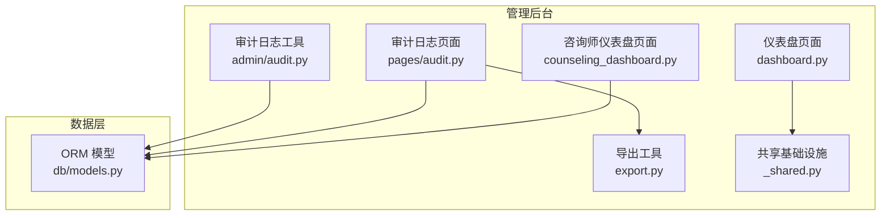
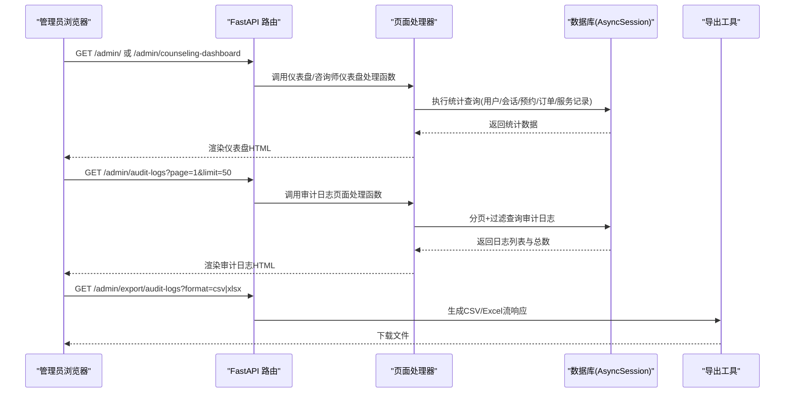
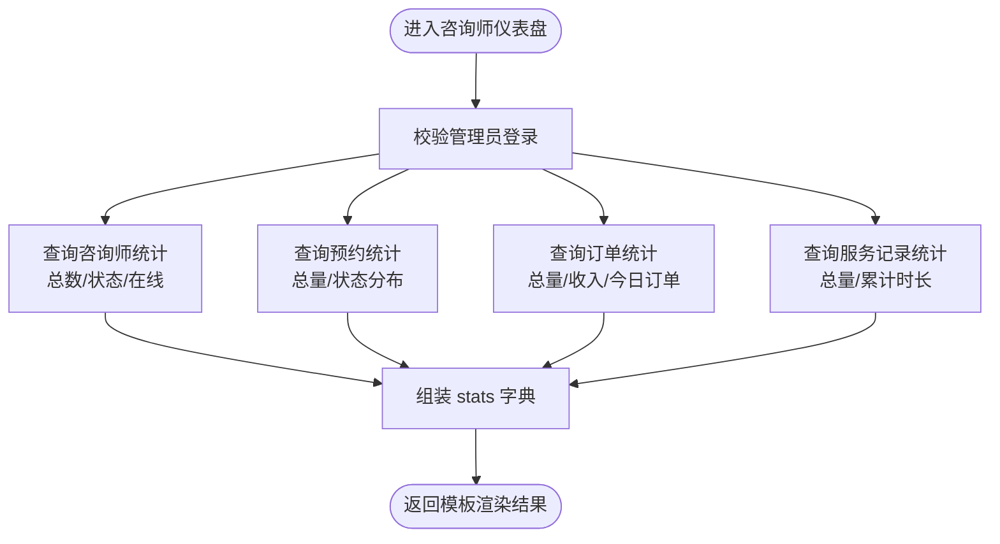
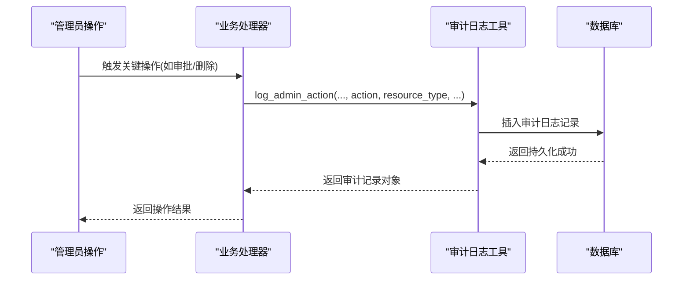
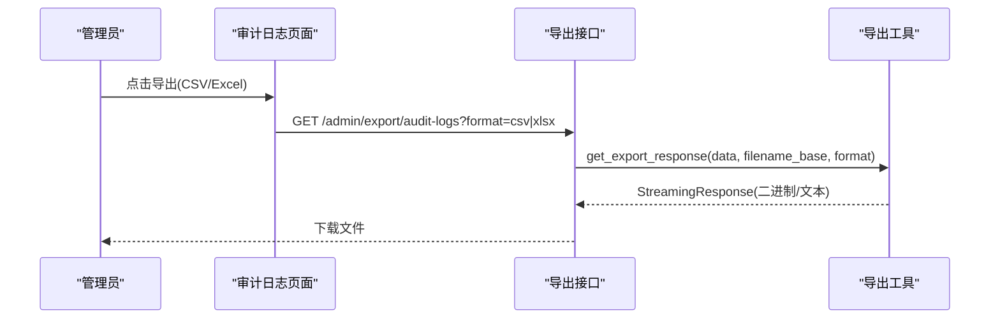
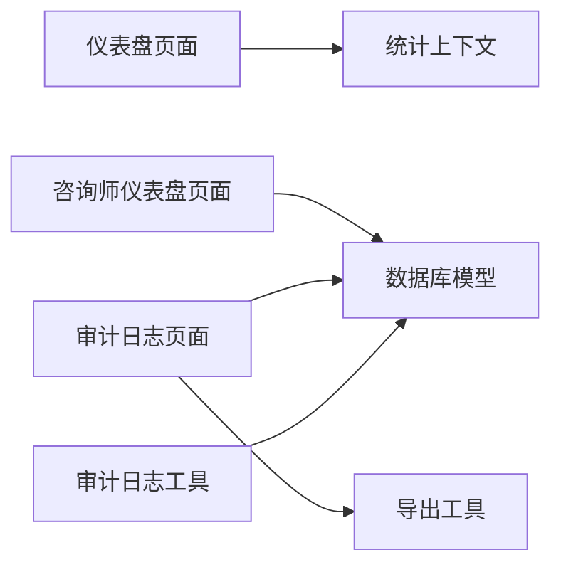

# 系统监控告警配置

<cite>
**本文引用的文件**   
- [hushai/meditation/admin/pages/counseling_dashboard.py](file://hushai/meditation/admin/pages/counseling_dashboard.py)
- [hushai/meditation/admin/pages/dashboard.py](file://hushai/meditation/admin/pages/dashboard.py)
- [hushai/meditation/admin/pages/_shared.py](file://hushai/meditation/admin/pages/_shared.py)
- [hushai/meditation/db/models.py](file://hushai/meditation/db/models.py)
- [hushai/meditation/admin/audit.py](file://hushai/meditation/admin/audit.py)
- [hushai/meditation/admin/pages/audit.py](file://hushai/meditation/admin/pages/audit.py)
- [hushai/meditation/admin/templates/audit_logs.html](file://hushai/meditation/admin/templates/audit_logs.html)
- [hushai/meditation/admin/export.py](file://hushai/meditation/admin/export.py)
- [alembic.ini](file://alembic.ini)
</cite>

## 目录
1. [简介](#简介)
2. [项目结构](#项目结构)
3. [核心组件](#核心组件)
4. [架构总览](#架构总览)
5. [详细组件分析](#详细组件分析)
6. [依赖关系分析](#依赖关系分析)
7. [性能与阈值建议](#性能与阈值建议)
8. [故障排查指南](#故障排查指南)
9. [结论](#结论)
10. [附录](#附录)

## 简介
本文件面向 hush.ai 的管理后台，聚焦“系统监控告警配置”的落地方案。当前仓库已提供：
- 仪表盘与咨询师仪表盘的统计指标（用户活跃度、会话统计、服务质量）
- 审计日志的采集、展示与导出能力
- 通用的数据导出工具（CSV/Excel）

基于现有实现，本文给出可操作的监控指标清单、审计日志策略、告警规则建议以及数据导出与分析方法，帮助运维与管理团队快速建立可观测性与告警闭环。

## 项目结构
与监控告警相关的代码主要位于管理后台页面与数据库模型中，包括：
- 仪表盘与咨询师仪表盘页面：聚合统计指标并渲染模板
- 审计日志：记录管理员操作、支持分页查询与导出
- 通用导出模块：提供 CSV/Excel 流式导出能力
- 数据库模型：定义审计日志、预约、订单、服务记录等实体

图表来源
- [hushai/meditation/admin/pages/dashboard.py:1-52](file://hushai/meditation/admin/pages/dashboard.py#L1-L52)
- [hushai/meditation/admin/pages/counseling_dashboard.py:1-127](file://hushai/meditation/admin/pages/counseling_dashboard.py#L1-L127)
- [hushai/meditation/admin/pages/audit.py:1-72](file://hushai/meditation/admin/pages/audit.py#L1-L72)
- [hushai/meditation/admin/audit.py:1-32](file://hushai/meditation/admin/audit.py#L1-L32)
- [hushai/meditation/admin/export.py:1-106](file://hushai/meditation/admin/export.py#L1-L106)
- [hushai/meditation/db/models.py:188-202](file://hushai/meditation/db/models.py#L188-L202)

章节来源
- [hushai/meditation/admin/pages/dashboard.py:1-52](file://hushai/meditation/admin/pages/dashboard.py#L1-L52)
- [hushai/meditation/admin/pages/counseling_dashboard.py:1-127](file://hushai/meditation/admin/pages/counseling_dashboard.py#L1-L127)
- [hushai/meditation/admin/pages/_shared.py:44-70](file://hushai/meditation/admin/pages/_shared.py#L44-L70)
- [hushai/meditation/db/models.py:188-202](file://hushai/meditation/db/models.py#L188-L202)

## 核心组件
- 仪表盘统计上下文：统一计算用户、对话、消息、记忆、知识、技能等总数，供仪表盘页面使用
- 咨询师仪表盘：聚合咨询师、预约、订单与服务记录的运营指标
- 审计日志：记录管理员关键操作，支持按操作类型与管理员筛选、分页浏览与导出
- 导出工具：将任意结构化数据以 CSV 或 Excel 格式流式返回

章节来源
- [hushai/meditation/admin/pages/_shared.py:44-70](file://hushai/meditation/admin/pages/_shared.py#L44-L70)
- [hushai/meditation/admin/pages/counseling_dashboard.py:34-126](file://hushai/meditation/admin/pages/counseling_dashboard.py#L34-L126)
- [hushai/meditation/admin/audit.py:10-31](file://hushai/meditation/admin/audit.py#L10-L31)
- [hushai/meditation/admin/export.py:12-106](file://hushai/meditation/admin/export.py#L12-L106)

## 架构总览
下图展示了从页面请求到数据聚合与导出的整体流程，涵盖仪表盘、咨询师仪表盘与审计日志三大场景。

图表来源
- [hushai/meditation/admin/pages/dashboard.py:18-51](file://hushai/meditation/admin/pages/dashboard.py#L18-L51)
- [hushai/meditation/admin/pages/counseling_dashboard.py:24-126](file://hushai/meditation/admin/pages/counseling_dashboard.py#L24-L126)
- [hushai/meditation/admin/pages/audit.py:16-71](file://hushai/meditation/admin/pages/audit.py#L16-L71)
- [hushai/meditation/admin/export.py:92-106](file://hushai/meditation/admin/export.py#L92-L106)

## 详细组件分析

### 咨询师仪表盘的监控指标配置
- 用户活跃度
  - 活跃用户数：通过统计上下文中 active_users 获取
  - 新用户趋势：可通过最近注册用户数量（由仪表盘侧 recent_users 辅助）观察
- 会话统计
  - 对话总量、消息总量：来自统计上下文中的 conv_count、msg_count
- 服务质量指标
  - 咨询师总数、在线咨询师数、待审核/已通过咨询师数
  - 预约总量、待确认/已完成预约数
  - 订单总量、今日订单量、总收入（paid_amount 求和）
  - 服务记录总量、累计服务时长（分钟转小时）

上述指标在咨询师仪表盘页面中直接聚合并传入模板渲染。

章节来源
- [hushai/meditation/admin/pages/_shared.py:44-70](file://hushai/meditation/admin/pages/_shared.py#L44-L70)
- [hushai/meditation/admin/pages/counseling_dashboard.py:34-126](file://hushai/meditation/admin/pages/counseling_dashboard.py#L34-L126)

#### 指标计算流程图

图表来源
- [hushai/meditation/admin/pages/counseling_dashboard.py:24-126](file://hushai/meditation/admin/pages/counseling_dashboard.py#L24-L126)

### 审计日志的配置与管理
- 日志级别设置
  - 应用启动时根据配置项启用 DEBUG/INFO 级别；迁移脚本默认 WARN 级别
- 日志保留策略
  - 审计日志表包含 created_at 字段，可按时间范围进行分页与筛选
  - 建议在外部存储或归档策略中对历史日志进行冷备（例如按月归档）
- 访问审计
  - 管理员关键操作通过审计工具写入审计日志表，包含操作人、动作、资源类型、资源ID、详情、IP、UA 等
  - 审计日志页面支持按 action 与 admin_username 过滤，并提供 CSV/Excel 导出

章节来源
- [hushai/meditation/app.py:26-30](file://hushai/meditation/app.py#L26-L30)
- [alembic.ini:14-26](file://alembic.ini#L14-L26)
- [hushai/meditation/db/models.py:188-202](file://hushai/meditation/db/models.py#L188-L202)
- [hushai/meditation/admin/audit.py:10-31](file://hushai/meditation/admin/audit.py#L10-L31)
- [hushai/meditation/admin/pages/audit.py:16-71](file://hushai/meditation/admin/pages/audit.py#L16-L71)
- [hushai/meditation/admin/templates/audit_logs.html:1-103](file://hushai/meditation/admin/templates/audit_logs.html#L1-L103)

#### 审计日志写入时序图

图表来源
- [hushai/meditation/admin/audit.py:10-31](file://hushai/meditation/admin/audit.py#L10-L31)
- [hushai/meditation/db/models.py:188-202](file://hushai/meditation/db/models.py#L188-L202)

### 性能监控阈值配置（建议）
当前仓库未内置运行时性能监控与告警引擎，但可基于现有指标与导出能力构建告警规则。以下为建议阈值与规则设计思路：
- 响应时间
  - 建议：P95 接口响应时间超过 2s 持续 5 分钟触发告警
  - 数据来源：可在网关或中间件层采集，结合审计日志中的 IP/UA 做溯源
- 错误率
  - 建议：HTTP 5xx 比例超过 1% 持续 5 分钟触发告警
  - 数据来源：应用日志与审计日志中的异常事件
- 资源使用率
  - 建议：CPU > 80%、内存 > 85%、磁盘 > 90% 持续 5 分钟触发告警
  - 数据来源：主机监控（Prometheus/Grafana），与业务指标联动
- 业务健康度
  - 建议：当日订单量为 0 且过去 3 天均值 > 0 时触发告警
  - 数据来源：咨询师仪表盘中的 today_orders 指标
  - 建议：在线咨询师数为 0 且过去 1 小时均值 > 0 时触发告警
  - 数据来源：咨询师仪表盘中的 online_counselors 指标

说明：以上为通用建议，需结合部署环境与业务规模调整。

[本节为通用指导，不直接分析具体文件]

### 监控数据的导出与分析方法
- 审计日志导出
  - 支持 CSV 与 Excel 两种格式，URL 参数 format 控制输出类型
  - 导出按钮链接已在审计日志模板中提供，可直接点击下载
- 自定义导出
  - 使用导出工具 get_export_response，传入结构化数据与文件名前缀即可生成流式响应
  - 适用于任何需要批量导出的管理功能

章节来源
- [hushai/meditation/admin/templates/audit_logs.html:19-26](file://hushai/meditation/admin/templates/audit_logs.html#L19-L26)
- [hushai/meditation/admin/export.py:92-106](file://hushai/meditation/admin/export.py#L92-L106)

#### 导出流程时序图

图表来源
- [hushai/meditation/admin/templates/audit_logs.html:19-26](file://hushai/meditation/admin/templates/audit_logs.html#L19-L26)
- [hushai/meditation/admin/export.py:92-106](file://hushai/meditation/admin/export.py#L92-L106)

### 告警通知的配置与自定义规则设置（建议）
- 通知渠道
  - 邮件、企业微信/钉钉机器人、短信等，依据组织规范选择
- 告警规则
  - 基于前述性能与业务健康度阈值，定义规则表达式与持续时间窗口
- 自定义规则
  - 可将仪表盘与咨询师仪表盘的关键指标暴露为可配置项，结合定时任务与规则引擎评估
  - 对审计日志的高风险操作（如批量删除、权限变更）设置即时告警

[本节为通用指导，不直接分析具体文件]

## 依赖关系分析
- 页面层依赖
  - 仪表盘与咨询师仪表盘页面依赖统计上下文与数据库模型
  - 审计日志页面依赖审计日志模型与导出工具
- 数据层依赖
  - 审计日志、预约、订单、服务记录等实体均定义于 ORM 模型中
- 导出工具
  - 提供统一的 CSV/Excel 导出能力，被审计日志页面复用

图表来源
- [hushai/meditation/admin/pages/dashboard.py:18-51](file://hushai/meditation/admin/pages/dashboard.py#L18-L51)
- [hushai/meditation/admin/pages/counseling_dashboard.py:24-126](file://hushai/meditation/admin/pages/counseling_dashboard.py#L24-L126)
- [hushai/meditation/admin/pages/audit.py:16-71](file://hushai/meditation/admin/pages/audit.py#L16-L71)
- [hushai/meditation/admin/audit.py:10-31](file://hushai/meditation/admin/audit.py#L10-L31)
- [hushai/meditation/db/models.py:188-202](file://hushai/meditation/db/models.py#L188-L202)

章节来源
- [hushai/meditation/admin/pages/_shared.py:44-70](file://hushai/meditation/admin/pages/_shared.py#L44-L70)
- [hushai/meditation/db/models.py:188-202](file://hushai/meditation/db/models.py#L188-L202)

## 性能与阈值建议
- 数据采集频率
  - 仪表盘指标建议每分钟刷新一次，避免频繁全表扫描
- 索引优化
  - 审计日志表已对 admin_username、action、created_at 建索引，利于分页与过滤
- 导出性能
  - 大数据量导出建议使用流式响应与分批查询，避免一次性加载至内存
- 告警风暴抑制
  - 引入去抖与静默期，避免同一根因引发重复告警

[本节为通用指导，不直接分析具体文件]

## 故障排查指南
- 审计日志缺失
  - 检查是否调用了审计日志工具写入记录
  - 核对数据库连接与事务提交
- 导出失败
  - 检查导出接口 URL 参数 format 是否正确
  - 确认 openpyxl 依赖可用（Excel 导出）
- 仪表盘指标异常
  - 核对统计上下文查询条件与数据库状态
  - 检查管理员登录态与权限

章节来源
- [hushai/meditation/admin/audit.py:10-31](file://hushai/meditation/admin/audit.py#L10-L31)
- [hushai/meditation/admin/export.py:38-78](file://hushai/meditation/admin/export.py#L38-L78)
- [hushai/meditation/admin/pages/_shared.py:44-70](file://hushai/meditation/admin/pages/_shared.py#L44-L70)

## 结论
当前仓库已具备完善的仪表盘与审计日志能力，可作为监控告警体系的基础设施。建议在此基础上：
- 补充运行时性能监控与错误率采集
- 将关键业务指标纳入告警规则
- 完善日志保留与归档策略
- 建立多渠道告警通知与规则编排

[本节为总结性内容，不直接分析具体文件]

## 附录
- 相关页面与工具路径
  - 仪表盘页面：dashboard.py
  - 咨询师仪表盘页面：counseling_dashboard.py
  - 审计日志页面与工具：pages/audit.py、admin/audit.py
  - 导出工具：export.py
  - 审计日志模板：audit_logs.html
  - 数据库模型：db/models.py
  - 应用日志级别配置：app.py、alembic.ini

章节来源
- [hushai/meditation/admin/pages/dashboard.py:1-52](file://hushai/meditation/admin/pages/dashboard.py#L1-L52)
- [hushai/meditation/admin/pages/counseling_dashboard.py:1-127](file://hushai/meditation/admin/pages/counseling_dashboard.py#L1-L127)
- [hushai/meditation/admin/pages/audit.py:1-72](file://hushai/meditation/admin/pages/audit.py#L1-L72)
- [hushai/meditation/admin/audit.py:1-32](file://hushai/meditation/admin/audit.py#L1-L32)
- [hushai/meditation/admin/export.py:1-106](file://hushai/meditation/admin/export.py#L1-L106)
- [hushai/meditation/admin/templates/audit_logs.html:1-103](file://hushai/meditation/admin/templates/audit_logs.html#L1-L103)
- [hushai/meditation/db/models.py:188-202](file://hushai/meditation/db/models.py#L188-L202)
- [alembic.ini:14-26](file://alembic.ini#L14-L26)