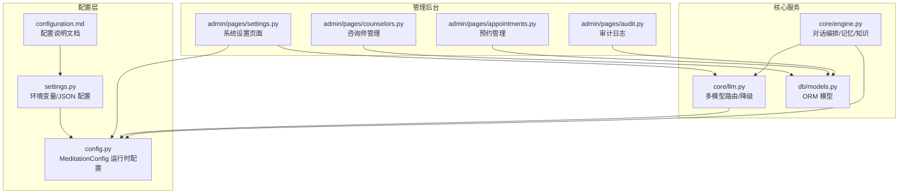
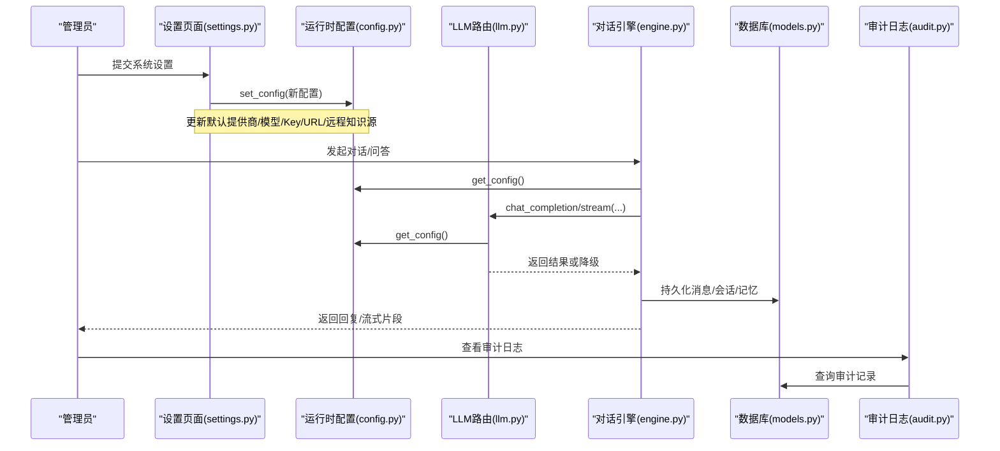
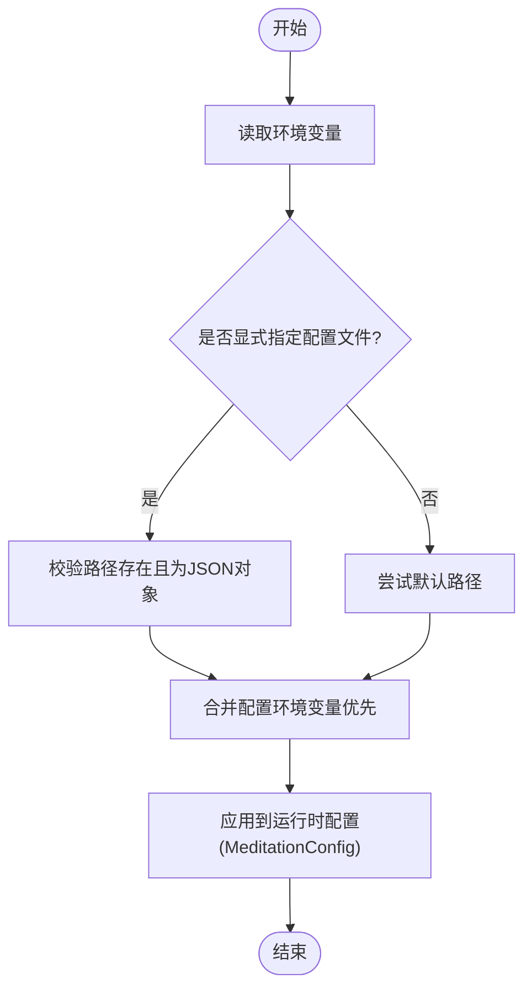
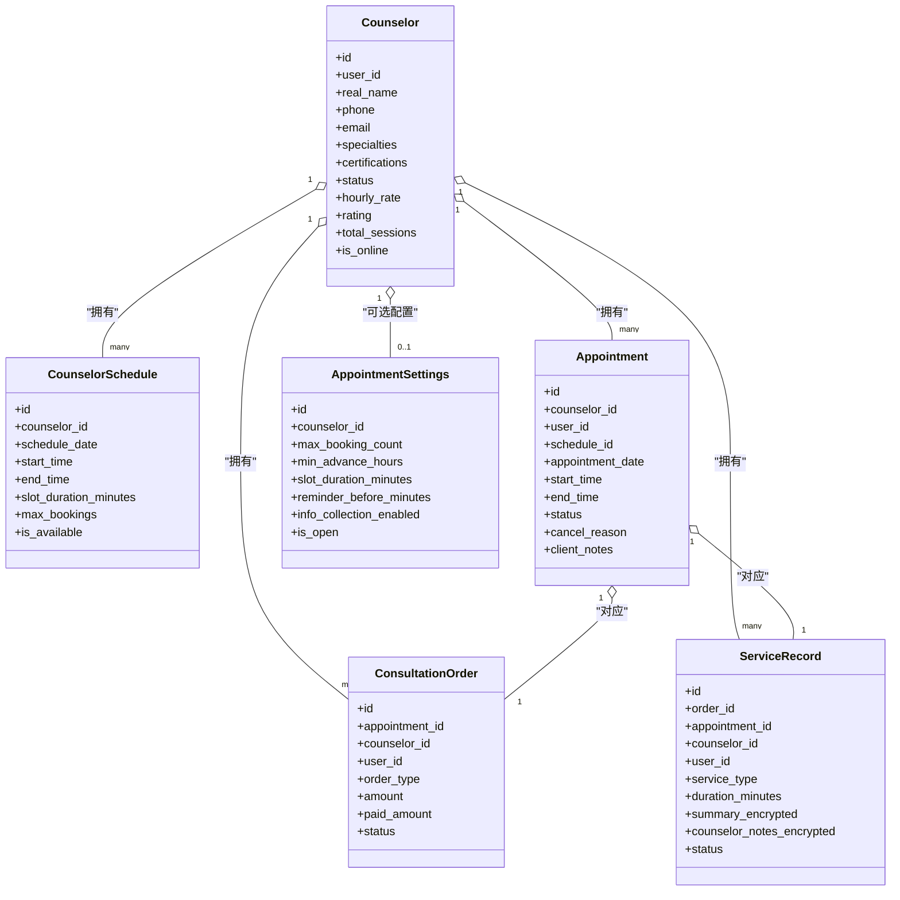
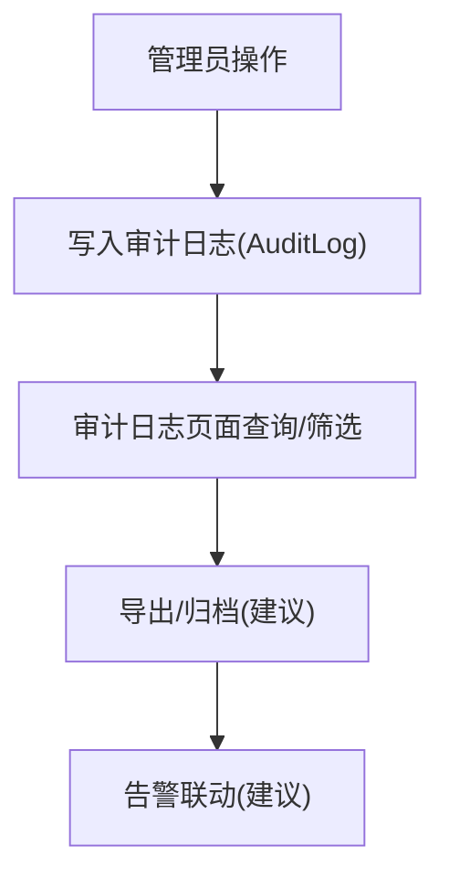
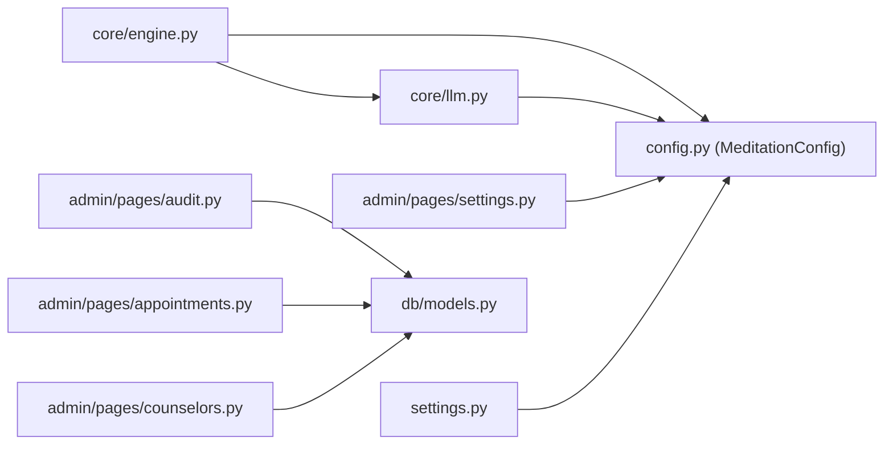

# 系统配置管理

<cite>
**本文引用的文件**   
- [hushai/settings.py](file://hushai/settings.py)
- [docs/configuration.md](file://docs/configuration.md)
- [hushai/meditation/config.py](file://hushai/meditation/config.py)
- [hushai/meditation/admin/pages/settings.py](file://hushai/meditation/admin/pages/settings.py)
- [hushai/meditation/core/llm.py](file://hushai/meditation/core/llm.py)
- [hushai/meditation/db/models.py](file://hushai/meditation/db/models.py)
- [hushai/meditation/admin/pages/counselors.py](file://hushai/meditation/admin/pages/counselors.py)
- [hushai/meditation/admin/pages/appointments.py](file://hushai/meditation/admin/pages/appointments.py)
- [hushai/meditation/admin/pages/audit.py](file://hushai/meditation/admin/pages/audit.py)
- [hushai/meditation/core/engine.py](file://hushai/meditation/core/engine.py)
</cite>

## 目录
1. [简介](#简介)
2. [项目结构](#项目结构)
3. [核心组件](#核心组件)
4. [架构总览](#架构总览)
5. [详细组件分析](#详细组件分析)
6. [依赖关系分析](#依赖关系分析)
7. [性能与可用性考虑](#性能与可用性考虑)
8. [故障排查指南](#故障排查指南)
9. [结论](#结论)
10. [附录：管理员操作手册](#附录管理员操作手册)

## 简介
本文件面向 hush.ai 管理后台的系统管理员，系统化说明“系统配置管理”能力，覆盖以下主题：
- 系统参数配置：LLM 模型设置、API 密钥管理与第三方服务集成
- 咨询师管理：账号管理、排班设置与服务范围配置
- 系统监控告警：日志级别、性能阈值与通知规则（基于现有审计与可观测性基础）
- 系统维护工具：缓存清理、数据库优化与备份恢复（运维建议与流程）
- 变更安全审计与回滚机制：确保配置变更可追踪、可回滚

## 项目结构
围绕“系统配置管理”，关键代码分布在如下模块：
- 命令行与进程级配置解析：settings.py、configuration.md
- 冥想模块运行时配置：config.py（MeditationConfig）
- 管理后台设置页面：admin/pages/settings.py
- LLM 多提供商路由与降级：core/llm.py
- 数据模型（含咨询师、预约、审计等）：db/models.py
- 管理后台业务页面：counselors.py、appointments.py、audit.py
- 对话引擎（调用配置与 LLM）：core/engine.py

图表来源
- [hushai/settings.py:1-226](file://hushai/settings.py#L1-L226)
- [docs/configuration.md:1-114](file://docs/configuration.md#L1-L114)
- [hushai/meditation/config.py:1-136](file://hushai/meditation/config.py#L1-L136)
- [hushai/meditation/admin/pages/settings.py:1-123](file://hushai/meditation/admin/pages/settings.py#L1-L123)
- [hushai/meditation/core/llm.py:1-258](file://hushai/meditation/core/llm.py#L1-L258)
- [hushai/meditation/db/models.py:1-434](file://hushai/meditation/db/models.py#L1-L434)
- [hushai/meditation/admin/pages/counselors.py:1-202](file://hushai/meditation/admin/pages/counselors.py#L1-L202)
- [hushai/meditation/admin/pages/appointments.py:1-126](file://hushai/meditation/admin/pages/appointments.py#L1-L126)
- [hushai/meditation/admin/pages/audit.py:1-72](file://hushai/meditation/admin/pages/audit.py#L1-L72)
- [hushai/meditation/core/engine.py:1-387](file://hushai/meditation/core/engine.py#L1-L387)

章节来源
- [hushai/settings.py:1-226](file://hushai/settings.py#L1-L226)
- [docs/configuration.md:1-114](file://docs/configuration.md#L1-L114)
- [hushai/meditation/config.py:1-136](file://hushai/meditation/config.py#L1-L136)
- [hushai/meditation/admin/pages/settings.py:1-123](file://hushai/meditation/admin/pages/settings.py#L1-L123)
- [hushai/meditation/core/llm.py:1-258](file://hushai/meditation/core/llm.py#L1-L258)
- [hushai/meditation/db/models.py:1-434](file://hushai/meditation/db/models.py#L1-L434)
- [hushai/meditation/admin/pages/counselors.py:1-202](file://hushai/meditation/admin/pages/counselors.py#L1-L202)
- [hushai/meditation/admin/pages/appointments.py:1-126](file://hushai/meditation/admin/pages/appointments.py#L1-L126)
- [hushai/meditation/admin/pages/audit.py:1-72](file://hushai/meditation/admin/pages/audit.py#L1-L72)
- [hushai/meditation/core/engine.py:1-387](file://hushai/meditation/core/engine.py#L1-L387)

## 核心组件
- 进程级配置解析（settings.py）
  - 支持环境变量优先于 JSON 配置文件；提供默认路径解析、模式校验、超时与重试等。
- 运行时配置对象（config.py）
  - MeditationConfig 通过环境变量加载，包含 LLM 提供商、嵌入向量、微信支付、加密等字段。
- 管理后台设置页（admin/pages/settings.py）
  - 提供 Web 表单更新默认 LLM 提供商/模型、各厂商 API Key/Base URL/Model、远程知识源等。
- LLM 多提供商路由（core/llm.py）
  - 按优先级顺序选择提供商，失败自动降级；调试模式下无 Key 时走 mock。
- 数据模型（db/models.py）
  - 定义咨询师、排班、预约、订单、服务记录、审计日志等 ORM 模型。
- 管理后台业务页（counselors.py、appointments.py、audit.py）
  - 提供咨询师审核、上线状态切换、预约列表与详情、审计日志查询等。
- 对话引擎（core/engine.py）
  - 编排上下文（记忆、知识、技能、场景）、安全检查、持久化消息、触发记忆提取。

章节来源
- [hushai/settings.py:1-226](file://hushai/settings.py#L1-L226)
- [hushai/meditation/config.py:1-136](file://hushai/meditation/config.py#L1-L136)
- [hushai/meditation/admin/pages/settings.py:1-123](file://hushai/meditation/admin/pages/settings.py#L1-L123)
- [hushai/meditation/core/llm.py:1-258](file://hushai/meditation/core/llm.py#L1-L258)
- [hushai/meditation/db/models.py:1-434](file://hushai/meditation/db/models.py#L1-L434)
- [hushai/meditation/admin/pages/counselors.py:1-202](file://hushai/meditation/admin/pages/counselors.py#L1-L202)
- [hushai/meditation/admin/pages/appointments.py:1-126](file://hushai/meditation/admin/pages/appointments.py#L1-L126)
- [hushai/meditation/admin/pages/audit.py:1-72](file://hushai/meditation/admin/pages/audit.py#L1-L72)
- [hushai/meditation/core/engine.py:1-387](file://hushai/meditation/core/engine.py#L1-L387)

## 架构总览
下图展示“系统配置管理”在运行时的交互关系：管理后台设置页写入运行时配置，LLM 路由读取配置并执行多提供商调用，引擎编排上下文与安全策略，审计日志记录关键操作。

图表来源
- [hushai/meditation/admin/pages/settings.py:1-123](file://hushai/meditation/admin/pages/settings.py#L1-L123)
- [hushai/meditation/config.py:1-136](file://hushai/meditation/config.py#L1-L136)
- [hushai/meditation/core/llm.py:1-258](file://hushai/meditation/core/llm.py#L1-L258)
- [hushai/meditation/core/engine.py:1-387](file://hushai/meditation/core/engine.py#L1-L387)
- [hushai/meditation/db/models.py:1-434](file://hushai/meditation/db/models.py#L1-L434)
- [hushai/meditation/admin/pages/audit.py:1-72](file://hushai/meditation/admin/pages/audit.py#L1-L72)

## 详细组件分析

### 系统参数配置（LLM 模型、API 密钥、第三方服务）
- 配置来源与优先级
  - 环境变量优先于 JSON 配置文件；CLI 指定路径优先于环境变量。
  - 默认配置文件路径由平台决定（Windows XDG 兼容）。
- 关键配置项
  - LLM 相关：API Key、Base URL、模型名、超时、重试次数、对话模式。
  - 运行时配置（MeditationConfig）：默认提供商、OpenAI/DeepSeek/Zhipu/Kimi 的 Key/URL/Model、内存与知识库 top_k、最大轮次、嵌入向量配置、微信支付、加密密钥等。
- 管理后台设置
  - 支持更新默认提供商/模型、各厂商 Key/URL/Model、远程知识源（Coze、IMA、URL 列表）。
- LLM 路由与降级
  - 按主提供商 + 预设顺序构建降级链；失败自动尝试下一个；调试模式无 Key 走 mock。

图表来源
- [hushai/settings.py:1-226](file://hushai/settings.py#L1-L226)
- [docs/configuration.md:1-114](file://docs/configuration.md#L1-L114)
- [hushai/meditation/config.py:1-136](file://hushai/meditation/config.py#L1-L136)
- [hushai/meditation/admin/pages/settings.py:1-123](file://hushai/meditation/admin/pages/settings.py#L1-L123)
- [hushai/meditation/core/llm.py:1-258](file://hushai/meditation/core/llm.py#L1-L258)

章节来源
- [hushai/settings.py:1-226](file://hushai/settings.py#L1-L226)
- [docs/configuration.md:1-114](file://docs/configuration.md#L1-L114)
- [hushai/meditation/config.py:1-136](file://hushai/meditation/config.py#L1-L136)
- [hushai/meditation/admin/pages/settings.py:1-123](file://hushai/meditation/admin/pages/settings.py#L1-L123)
- [hushai/meditation/core/llm.py:1-258](file://hushai/meditation/core/llm.py#L1-L258)

### 咨询师管理（账号、排班、服务范围）
- 数据模型
  - Counselor：基本信息、资质、评分、在线状态等。
  - CounselorSchedule：排班时段、时长、最大预约数、可用状态。
  - Appointment：预约单、状态机（待确认/已确认/已完成/已取消/已拒绝）。
  - ConsultationOrder / ServiceRecord：订单与服务记录（敏感字段加密存储）。
  - AppointmentSettings：全局或咨询师级别的预约规则。
- 管理功能
  - 咨询师列表与筛选（状态、搜索），统计（总数、待审、已通过、在线）。
  - 详情页（排班/预约统计），审核（通过/拒绝/禁用）并写审计日志。
  - 切换上线状态。
  - 预约列表与筛选（状态、日期区间），详情（关联用户与咨询师信息）。

图表来源
- [hushai/meditation/db/models.py:273-434](file://hushai/meditation/db/models.py#L273-L434)

章节来源
- [hushai/meditation/db/models.py:273-434](file://hushai/meditation/db/models.py#L273-L434)
- [hushai/meditation/admin/pages/counselors.py:1-202](file://hushai/meditation/admin/pages/counselors.py#L1-L202)
- [hushai/meditation/admin/pages/appointments.py:1-126](file://hushai/meditation/admin/pages/appointments.py#L1-L126)

### 系统监控与告警（日志、阈值、通知）
- 日志与审计
  - 审计日志模型 AuditLog 记录管理员操作（动作、资源类型、IP、UA、时间等）。
  - 管理后台提供审计日志分页与筛选（按动作、管理员用户名）。
- 日志级别与性能阈值
  - 当前实现未暴露统一日志级别开关；可在部署侧调整 Python logging 级别。
  - LLM 请求超时与重试可通过 settings.py 的配置项控制（LLM_TIMEOUT、LLM_MAX_RETRIES）。
- 通知规则
  - 当前未内置通知通道；建议在部署层对接外部告警（如 Prometheus/Grafana、企业 IM 机器人），对关键指标（错误率、延迟、配额耗尽）进行告警。

图表来源
- [hushai/meditation/db/models.py:188-202](file://hushai/meditation/db/models.py#L188-L202)
- [hushai/meditation/admin/pages/audit.py:1-72](file://hushai/meditation/admin/pages/audit.py#L1-L72)
- [hushai/settings.py:185-218](file://hushai/settings.py#L185-L218)

章节来源
- [hushai/meditation/db/models.py:188-202](file://hushai/meditation/db/models.py#L188-L202)
- [hushai/meditation/admin/pages/audit.py:1-72](file://hushai/meditation/admin/pages/audit.py#L1-L72)
- [hushai/settings.py:185-218](file://hushai/settings.py#L185-L218)

### 系统维护工具（缓存、数据库、备份恢复）
- 缓存清理
  - 当前未实现显式缓存清理入口；若使用外部缓存（如 Redis），请在部署层提供清理命令。
- 数据库优化
  - 建议定期执行 VACUUM/ANALYZE（PostgreSQL），重建索引与统计信息。
- 备份与恢复
  - 建议使用数据库原生工具（如 pg_dump/pg_restore）进行全量/增量备份与恢复。
- 配置回滚
  - 管理后台设置页会更新运行时配置对象；建议在外部版本控制系统保存配置快照，必要时恢复旧版配置并重启应用以生效。

[本节为通用运维建议，不直接分析具体源码文件]

## 依赖关系分析
- 配置到运行时的依赖
  - settings.py 负责解析环境变量与 JSON 配置；config.py 将环境变量映射为 MeditationConfig。
- 运行时配置到服务的依赖
  - core/llm.py 从 config.py 获取提供商配置；core/engine.py 在编排过程中读取配置并调用 LLM。
- 管理后台到数据的依赖
  - counselors.py、appointments.py、audit.py 通过 SQLAlchemy 访问 db/models.py 定义的表。

图表来源
- [hushai/settings.py:1-226](file://hushai/settings.py#L1-L226)
- [hushai/meditation/config.py:1-136](file://hushai/meditation/config.py#L1-L136)
- [hushai/meditation/admin/pages/settings.py:1-123](file://hushai/meditation/admin/pages/settings.py#L1-L123)
- [hushai/meditation/core/llm.py:1-258](file://hushai/meditation/core/llm.py#L1-L258)
- [hushai/meditation/core/engine.py:1-387](file://hushai/meditation/core/engine.py#L1-L387)
- [hushai/meditation/db/models.py:1-434](file://hushai/meditation/db/models.py#L1-L434)
- [hushai/meditation/admin/pages/counselors.py:1-202](file://hushai/meditation/admin/pages/counselors.py#L1-L202)
- [hushai/meditation/admin/pages/appointments.py:1-126](file://hushai/meditation/admin/pages/appointments.py#L1-L126)
- [hushai/meditation/admin/pages/audit.py:1-72](file://hushai/meditation/admin/pages/audit.py#L1-L72)

章节来源
- [hushai/settings.py:1-226](file://hushai/settings.py#L1-L226)
- [hushai/meditation/config.py:1-136](file://hushai/meditation/config.py#L1-L136)
- [hushai/meditation/admin/pages/settings.py:1-123](file://hushai/meditation/admin/pages/settings.py#L1-L123)
- [hushai/meditation/core/llm.py:1-258](file://hushai/meditation/core/llm.py#L1-L258)
- [hushai/meditation/core/engine.py:1-387](file://hushai/meditation/core/engine.py#L1-L387)
- [hushai/meditation/db/models.py:1-434](file://hushai/meditation/db/models.py#L1-L434)
- [hushai/meditation/admin/pages/counselors.py:1-202](file://hushai/meditation/admin/pages/counselors.py#L1-L202)
- [hushai/meditation/admin/pages/appointments.py:1-126](file://hushai/meditation/admin/pages/appointments.py#L1-L126)
- [hushai/meditation/admin/pages/audit.py:1-72](file://hushai/meditation/admin/pages/audit.py#L1-L72)

## 性能与可用性考虑
- LLM 调用
  - 合理设置超时与重试，避免雪崩；启用多提供商降级提升可用性。
- 对话上下文
  - 控制 conversation_max_turns，限制历史长度，降低 Token 成本与延迟。
- 记忆与知识检索
  - memory_top_k/knowledge_top_k 需平衡召回质量与响应速度。
- 并发与连接池
  - 数据库连接池与异步 IO 需根据负载调优。
- 可观测性
  - 建议接入指标采集（QPS、P95/P99 延迟、错误率、配额消耗）与链路追踪。

[本节为通用指导，不直接分析具体源码文件]

## 故障排查指南
- 配置加载失败
  - 检查 JSON 语法与根节点是否为对象；确认显式配置文件路径存在。
  - 环境变量覆盖行为是否符合预期（变量名与大小写）。
- LLM 调用失败
  - 核对各提供商 API Key/URL/Model 是否正确；观察降级日志。
  - 调试模式无 Key 时会走 mock，确认非期望行为。
- 管理后台权限
  - 未登录或无权限会被重定向至登录页；确认会话与认证逻辑。
- 审计日志缺失
  - 确认关键操作是否写入 AuditLog；检查数据库连接与事务提交。

章节来源
- [docs/configuration.md:104-114](file://docs/configuration.md#L104-L114)
- [hushai/meditation/core/llm.py:131-178](file://hushai/meditation/core/llm.py#L131-L178)
- [hushai/meditation/admin/pages/settings.py:66-123](file://hushai/meditation/admin/pages/settings.py#L66-L123)
- [hushai/meditation/admin/pages/audit.py:1-72](file://hushai/meditation/admin/pages/audit.py#L1-L72)

## 结论
本系统提供了完善的配置解析与管理后台界面，支持多 LLM 提供商与自动降级，具备基础的审计日志能力。结合部署层的监控与告警、数据库备份与优化，可满足生产环境的运维需求。建议在后续迭代中完善统一的日志级别开关、通知渠道与配置版本化管理。

[本节为总结，不直接分析具体源码文件]

## 附录：管理员操作手册
- 系统设置
  - 登录管理后台 → 进入“系统设置”页面 → 填写默认提供商/模型与各厂商 Key/URL/Model → 保存。
  - 如需启用远程知识源，勾选保存并填写相应地址与令牌。
- 咨询师管理
  - 列表页筛选与搜索 → 查看详情 → 审核（通过/拒绝/禁用）→ 切换上线状态。
  - 排班与预约：在排班表中添加可用时段；在预约列表中处理待确认/已完成/已取消等状态。
- 审计日志
  - 进入“审计日志”页面，按动作或管理员用户名筛选，导出归档。
- 配置回滚
  - 从版本库恢复旧版配置 → 重启服务使配置生效 → 验证关键功能。
- 备份与恢复
  - 定期执行数据库备份 → 演练恢复流程 → 记录恢复时间与影响面。

[本节为操作流程说明，不直接分析具体源码文件]