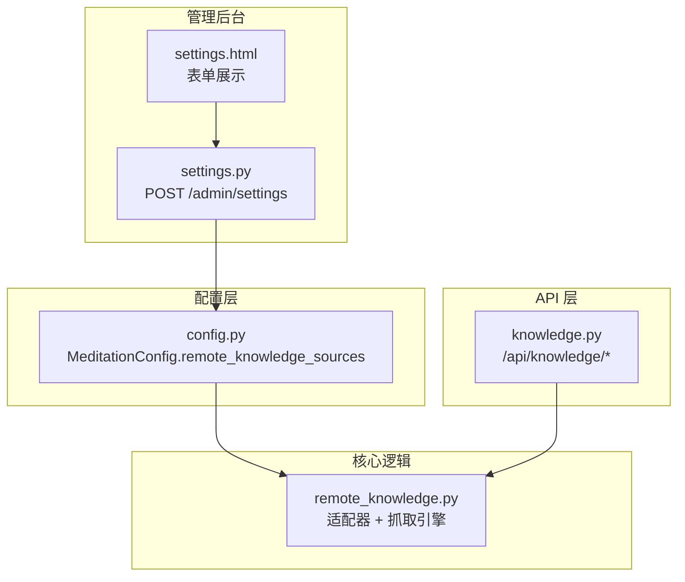
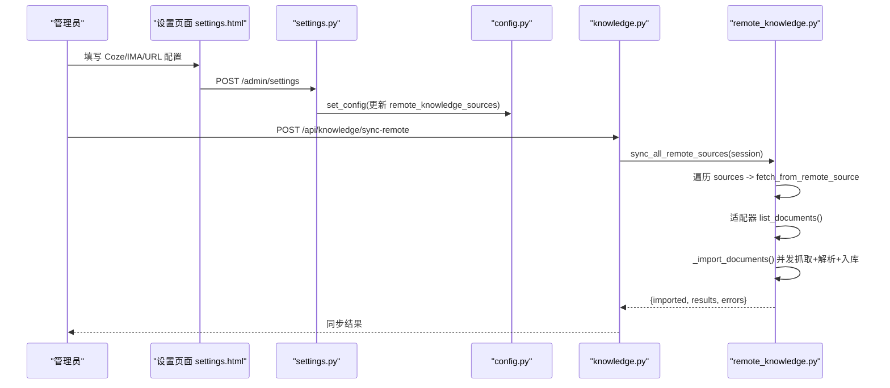
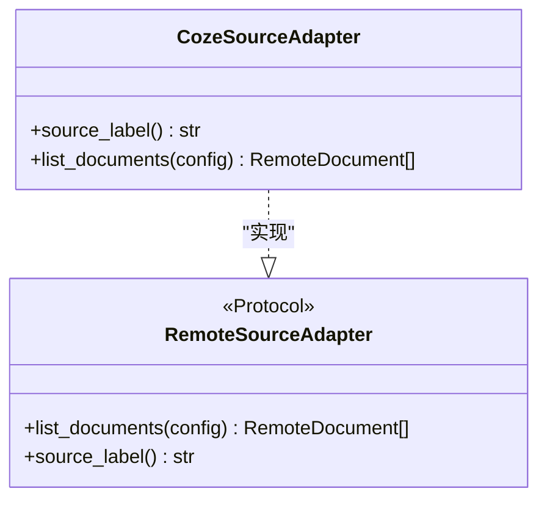
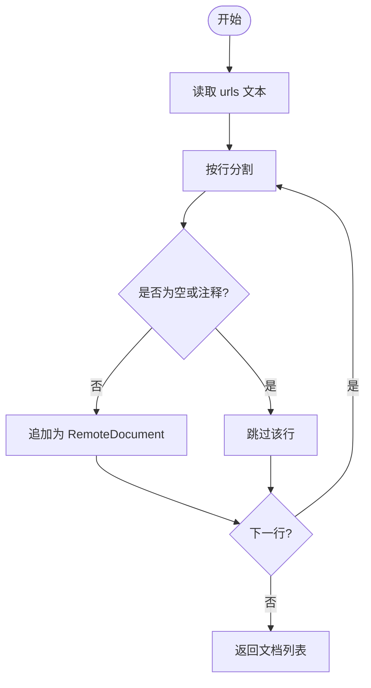
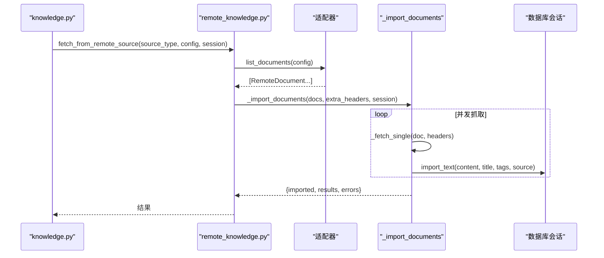
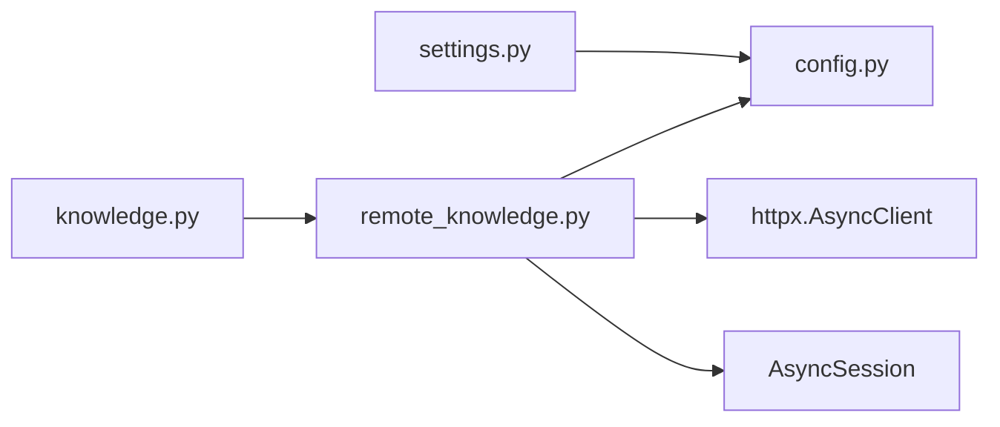

# 远程知识源配置

<cite>
**本文引用的文件**
- [hushai/meditation/core/remote_knowledge.py](file://hushai/meditation/core/remote_knowledge.py)
- [hushai/meditation/config.py](file://hushai/meditation/config.py)
- [hushai/meditation/admin/pages/settings.py](file://hushai/meditation/admin/pages/settings.py)
- [hushai/meditation/admin/templates/settings.html](file://hushai/meditation/admin/templates/settings.html)
- [hushai/meditation/api/knowledge.py](file://hushai/meditation/api/knowledge.py)
</cite>

## 目录
1. [简介](#简介)
2. [项目结构](#项目结构)
3. [核心组件](#核心组件)
4. [架构总览](#架构总览)
5. [详细组件分析](#详细组件分析)
6. [依赖关系分析](#依赖关系分析)
7. [性能与并发特性](#性能与并发特性)
8. [启用与禁用方法](#启用与禁用方法)
9. [测试与验证](#测试与验证)
10. [故障排查指南](#故障排查指南)
11. [结论](#结论)

## 简介
本文件面向 hush.ai 的“远程知识源”功能，提供从 Coze、IMA（腾讯智能助手）或任意 URL 拉取 Markdown 文档并入库的完整配置与使用指南。内容涵盖：
- Coze 平台集成：API Base URL、API Token、Dataset ID 的设置与调用流程
- IMA 服务配置：URL 列表格式与添加方式
- Coze URL 模式：无需 Token 时通过公开链接抓取
- 远程知识源的启用与禁用方法
- 测试验证与常见问题排查

## 项目结构
远程知识源能力由以下模块协同实现：
- 配置模型与加载：MeditationConfig.remote_knowledge_sources 字段承载远程源配置
- 管理后台设置页：表单收集 Coze/IMA/URL 配置，提交后更新内存中的配置
- 远程源适配器：CozeSourceAdapter、IMASourceAdapter、URLSourceAdapter
- 抓取与导入引擎：fetch_from_remote_source、sync_all_remote_sources、_import_documents
- API 路由：/api/knowledge/import-url、/api/knowledge/import-remote、/api/knowledge/sync-remote

图表来源
- [hushai/meditation/admin/templates/settings.html:157-205](file://hushai/meditation/admin/templates/settings.html#L157-L205)
- [hushai/meditation/admin/pages/settings.py:40-123](file://hushai/meditation/admin/pages/settings.py#L40-L123)
- [hushai/meditation/config.py:18-53](file://hushai/meditation/config.py#L18-L53)
- [hushai/meditation/core/remote_knowledge.py:176-389](file://hushai/meditation/core/remote_knowledge.py#L176-L389)
- [hushai/meditation/api/knowledge.py:237-310](file://hushai/meditation/api/knowledge.py#L237-L310)

章节来源
- [hushai/meditation/admin/templates/settings.html:157-205](file://hushai/meditation/admin/templates/settings.html#L157-L205)
- [hushai/meditation/admin/pages/settings.py:40-123](file://hushai/meditation/admin/pages/settings.py#L40-L123)
- [hushai/meditation/config.py:18-53](file://hushai/meditation/config.py#L18-L53)
- [hushai/meditation/core/remote_knowledge.py:176-389](file://hushai/meditation/core/remote_knowledge.py#L176-L389)
- [hushai/meditation/api/knowledge.py:237-310](file://hushai/meditation/api/knowledge.py#L237-L310)

## 核心组件
- 配置对象 MeditationConfig.remote_knowledge_sources：以键值对形式保存多个远程源配置，每个源包含 type 及对应参数（如 api_base、api_token、dataset_id、urls 等）。
- 适配器协议 RemoteSourceAdapter：统一 list_documents(config) 接口，返回待抓取的 RemoteDocument 列表。
- 具体适配器：
  - URLSourceAdapter：解析 urls 文本，每行一个 URL，跳过空行和注释行。
  - CozeSourceAdapter：调用 Coze 知识库 API 分页获取文档列表，构造文档 URL。
  - IMASourceAdapter：解析 urls 文本，支持可选 cookie 头。
- 抓取与导入：
  - fetch_from_remote_source：根据 source_type 选择适配器，组装额外请求头，批量抓取并导入。
  - sync_all_remote_sources：读取系统配置中的所有远程源，逐一同步。
  - _import_documents：并发抓取、解析为纯文本、分块入库，汇总结果与错误。

章节来源
- [hushai/meditation/config.py:18-53](file://hushai/meditation/config.py#L18-L53)
- [hushai/meditation/core/remote_knowledge.py:24-40](file://hushai/meditation/core/remote_knowledge.py#L24-L40)
- [hushai/meditation/core/remote_knowledge.py:45-62](file://hushai/meditation/core/remote_knowledge.py#L45-L62)
- [hushai/meditation/core/remote_knowledge.py:67-143](file://hushai/meditation/core/remote_knowledge.py#L67-L143)
- [hushai/meditation/core/remote_knowledge.py:152-173](file://hushai/meditation/core/remote_knowledge.py#L152-L173)
- [hushai/meditation/core/remote_knowledge.py:250-291](file://hushai/meditation/core/remote_knowledge.py#L250-L291)
- [hushai/meditation/core/remote_knowledge.py:294-361](file://hushai/meditation/core/remote_knowledge.py#L294-L361)
- [hushai/meditation/core/remote_knowledge.py:363-389](file://hushai/meditation/core/remote_knowledge.py#L363-L389)

## 架构总览
远程知识源的整体数据流如下：
- 管理员在后台设置页面填写 Coze/IMA/URL 配置并提交
- 后端将配置写入内存中的 MeditationConfig.remote_knowledge_sources
- 通过 API 触发同步或单次导入
- 核心引擎按源类型选择适配器，列出文档并并发抓取、解析、入库
- 返回导入结果与错误信息

图表来源
- [hushai/meditation/admin/templates/settings.html:157-205](file://hushai/meditation/admin/templates/settings.html#L157-L205)
- [hushai/meditation/admin/pages/settings.py:40-123](file://hushai/meditation/admin/pages/settings.py#L40-L123)
- [hushai/meditation/config.py:121-136](file://hushai/meditation/config.py#L121-L136)
- [hushai/meditation/api/knowledge.py:294-310](file://hushai/meditation/api/knowledge.py#L294-L310)
- [hushai/meditation/core/remote_knowledge.py:363-389](file://hushai/meditation/core/remote_knowledge.py#L363-L389)

## 详细组件分析

### Coze 平台集成配置
- 所需配置项
  - API Base URL：默认 https://api.coze.cn，可在设置页修改
  - Personal Access Token：用于鉴权
  - Dataset ID：目标知识库标识
- 配置入口
  - 后台设置页表单字段：API Base URL、Personal Access Token、知识库 ID
  - 提交后写入 config.remote_knowledge_sources["coze"]
- 抓取流程
  - 适配器 CozeSourceAdapter.list_documents 调用 Coze 文档列表 API，分页获取 document_list
  - 为每个文档生成内容 URL（document/{document_id}），标记 tags=["coze"], source="coze"
  - 抓取阶段附加 Authorization: Bearer {token} 头
- 注意事项
  - 若缺少 api_token 或 dataset_id，将跳过该源并记录警告日志
  - 网络异常或 API 返回非零 code 会中断当前源同步并记录错误

图表来源
- [hushai/meditation/core/remote_knowledge.py:67-143](file://hushai/meditation/core/remote_knowledge.py#L67-L143)
- [hushai/meditation/core/remote_knowledge.py:34-40](file://hushai/meditation/core/remote_knowledge.py#L34-L40)

章节来源
- [hushai/meditation/admin/templates/settings.html:173-187](file://hushai/meditation/admin/templates/settings.html#L173-L187)
- [hushai/meditation/admin/pages/settings.py:80-97](file://hushai/meditation/admin/pages/settings.py#L80-L97)
- [hushai/meditation/core/remote_knowledge.py:67-143](file://hushai/meditation/core/remote_knowledge.py#L67-L143)

### IMA 服务配置
- 配置项
  - urls：每行一个 IMA 分享/导出链接；可留空表示不启用
  - cookie（可选）：如需登录态，抓取时会附加 Cookie 头
- 配置入口
  - 后台设置页“IMA 文档 URL（每行一个）”文本域
  - 提交后写入 config.remote_knowledge_sources["ima"]
- 抓取流程
  - IMASourceAdapter.list_documents 解析 urls 文本，过滤空行与注释行
  - 抓取阶段若存在 cookie，则附加 Cookie 头
- 适用场景
  - 适合通过 IMA 客户端导出的文档链接，直接抓取并入库

图表来源
- [hushai/meditation/core/remote_knowledge.py:152-173](file://hushai/meditation/core/remote_knowledge.py#L152-L173)

章节来源
- [hushai/meditation/admin/templates/settings.html:189-197](file://hushai/meditation/admin/templates/settings.html#L189-L197)
- [hushai/meditation/admin/pages/settings.py:88-92](file://hushai/meditation/admin/pages/settings.py#L88-L92)
- [hushai/meditation/core/remote_knowledge.py:152-173](file://hushai/meditation/core/remote_knowledge.py#L152-L173)

### Coze URL 模式（无需 Token）
- 配置项
  - coze_urls：每行一个 Coze 文档链接（公开可访问）
  - 提交后写入 config.remote_knowledge_sources["coze_url"]，type="url"
- 抓取流程
  - URLSourceAdapter.list_documents 解析 urls 文本，逐行构建 RemoteDocument
  - 抓取阶段仅使用通用 User-Agent，无需额外鉴权头
- 适用场景
  - 当 Coze 文档为公开链接且无需鉴权时使用

章节来源
- [hushai/meditation/admin/templates/settings.html:194-197](file://hushai/meditation/admin/templates/settings.html#L194-L197)
- [hushai/meditation/admin/pages/settings.py:93-97](file://hushai/meditation/admin/pages/settings.py#L93-L97)
- [hushai/meditation/core/remote_knowledge.py:45-62](file://hushai/meditation/core/remote_knowledge.py#L45-L62)

### 抓取与导入引擎
- 关键函数
  - fetch_from_remote_source：根据 source_type 选择适配器，组装 extra_headers，调用 _import_documents
  - _import_documents：并发抓取、解析为纯文本、分块入库，汇总 results/errors
  - sync_all_remote_sources：读取所有已配置的远程源，逐个同步
- 并发控制
  - 使用信号量限制最大并发抓取数（MAX_CONCURRENT_FETCHES）
  - 单个抓取失败不影响其他任务，最终汇总错误列表
- 入库处理
  - 解析阶段调用 prepare_import_content，提取标题与标签
  - 通过 import_text 分块入库，返回 chunks 数量

图表来源
- [hushai/meditation/core/remote_knowledge.py:250-291](file://hushai/meditation/core/remote_knowledge.py#L250-L291)
- [hushai/meditation/core/remote_knowledge.py:294-361](file://hushai/meditation/core/remote_knowledge.py#L294-L361)
- [hushai/meditation/api/knowledge.py:274-291](file://hushai/meditation/api/knowledge.py#L274-L291)

章节来源
- [hushai/meditation/core/remote_knowledge.py:250-291](file://hushai/meditation/core/remote_knowledge.py#L250-L291)
- [hushai/meditation/core/remote_knowledge.py:294-361](file://hushai/meditation/core/remote_knowledge.py#L294-L361)
- [hushai/meditation/api/knowledge.py:274-291](file://hushai/meditation/api/knowledge.py#L274-L291)

## 依赖关系分析
- 配置依赖
  - settings.py 在提交设置时更新 config.remote_knowledge_sources
  - remote_knowledge.py 通过 get_config() 读取当前进程的配置
- API 依赖
  - knowledge.py 暴露 /api/knowledge/import-url、/api/knowledge/import-remote、/api/knowledge/sync-remote
  - 这些路由调用 core/remote_knowledge.py 的相应函数完成抓取与入库
- 外部依赖
  - httpx.AsyncClient 用于 HTTP 请求
  - 数据库会话 AsyncSession 用于持久化

图表来源
- [hushai/meditation/admin/pages/settings.py:40-123](file://hushai/meditation/admin/pages/settings.py#L40-L123)
- [hushai/meditation/config.py:121-136](file://hushai/meditation/config.py#L121-L136)
- [hushai/meditation/api/knowledge.py:237-310](file://hushai/meditation/api/knowledge.py#L237-L310)
- [hushai/meditation/core/remote_knowledge.py:176-389](file://hushai/meditation/core/remote_knowledge.py#L176-L389)

章节来源
- [hushai/meditation/admin/pages/settings.py:40-123](file://hushai/meditation/admin/pages/settings.py#L40-L123)
- [hushai/meditation/config.py:121-136](file://hushai/meditation/config.py#L121-L136)
- [hushai/meditation/api/knowledge.py:237-310](file://hushai/meditation/api/knowledge.py#L237-L310)
- [hushai/meditation/core/remote_knowledge.py:176-389](file://hushai/meditation/core/remote_knowledge.py#L176-L389)

## 性能与并发特性
- 并发抓取上限：MAX_CONCURRENT_FETCHES 控制同时抓取的任务数，避免过多并发导致资源耗尽
- 超时设置：FETCH_TIMEOUT 控制单次 HTTP 请求超时时间
- 错误隔离：单个文档抓取失败不会中断整体流程，错误信息汇总到 errors 列表
- 建议
  - 合理调整 MAX_CONCURRENT_FETCHES 与 FETCH_TIMEOUT 以适应网络环境
  - 对于大规模文档库，分批同步可降低瞬时压力

章节来源
- [hushai/meditation/core/remote_knowledge.py:20-21](file://hushai/meditation/core/remote_knowledge.py#L20-L21)
- [hushai/meditation/core/remote_knowledge.py:294-361](file://hushai/meditation/core/remote_knowledge.py#L294-L361)

## 启用与禁用方法
- 启用远程知识源
  - 在后台设置页填写对应源配置（Coze/IMA/URL），点击“保存并立即生效”
  - 提交后 config.remote_knowledge_sources 中新增或更新对应条目
  - 通过 /api/knowledge/sync-remote 一键同步所有已配置的远程源
- 禁用远程知识源
  - 清空对应文本域或移除相关字段（例如删除 ima_urls 或 coze_urls）
  - 再次提交设置，对应的源将从 remote_knowledge_sources 中移除
  - 不再出现在后续同步流程中

章节来源
- [hushai/meditation/admin/templates/settings.html:157-205](file://hushai/meditation/admin/templates/settings.html#L157-L205)
- [hushai/meditation/admin/pages/settings.py:80-97](file://hushai/meditation/admin/pages/settings.py#L80-L97)
- [hushai/meditation/api/knowledge.py:294-310](file://hushai/meditation/api/knowledge.py#L294-L310)

## 测试与验证
- 验证 Coze 配置
  - 在设置页填写 API Base URL、Token、Dataset ID，保存后调用 /api/knowledge/sync-remote
  - 检查返回结果中 imported 数量与 results 列表是否包含预期文档
- 验证 IMA 配置
  - 粘贴若干 IMA 分享/导出链接（每行一个），保存后调用 /api/knowledge/sync-remote
  - 确认 errors 为空或仅包含不可达链接的错误信息
- 验证 Coze URL 模式
  - 粘贴若干公开 Coze 文档链接（每行一个），保存后调用 /api/knowledge/sync-remote
  - 确认成功导入的文档数量与链接数量一致
- 使用专用导入接口
  - /api/knowledge/import-url：传入 source_type 与 urls 列表进行一次性导入
  - /api/knowledge/import-remote：传入 source_type 与 config 字典进行一次性导入

章节来源
- [hushai/meditation/api/knowledge.py:237-291](file://hushai/meditation/api/knowledge.py#L237-L291)
- [hushai/meditation/api/knowledge.py:294-310](file://hushai/meditation/api/knowledge.py#L294-L310)

## 故障排查指南
- Coze 源缺少必要配置
  - 现象：未拉取任何文档，日志出现警告提示缺少 api_token 或 dataset_id
  - 处理：在设置页补全 Token 与 Dataset ID，重新保存并同步
- Coze API 返回错误
  - 现象：日志记录 API 返回错误码或非零 code，同步中断
  - 处理：检查 Token 权限、Dataset ID 是否正确，确认网络可达
- 抓取失败
  - 现象：errors 列表中包含“抓取失败”条目
  - 处理：检查 URL 是否可访问、是否需要 Cookie 或特殊头；必要时在配置中补充 cookie
- 解析失败或内容为空
  - 现象：errors 列表中包含“解析失败”或“解析后内容为空”
  - 处理：确认链接指向的是 Markdown 或文本内容；修正链接或文件格式
- 未配置远程知识源
  - 现象：同步返回“未配置远程知识源”
  - 处理：在设置页至少配置一种源（Coze/IMA/URL），保存后再同步

章节来源
- [hushai/meditation/core/remote_knowledge.py:89-122](file://hushai/meditation/core/remote_knowledge.py#L89-L122)
- [hushai/meditation/core/remote_knowledge.py:294-361](file://hushai/meditation/core/remote_knowledge.py#L294-L361)
- [hushai/meditation/core/remote_knowledge.py:363-376](file://hushai/meditation/core/remote_knowledge.py#L363-L376)

## 结论
远程知识源功能通过统一的适配器与抓取引擎，实现了从 Coze、IMA 与任意 URL 拉取文档并入库的能力。管理员可在后台设置页便捷地配置各源参数，并通过 API 一键同步。合理的并发与超时策略保障了稳定性与性能。遇到问题时，可通过日志与错误信息进行快速定位与修复。