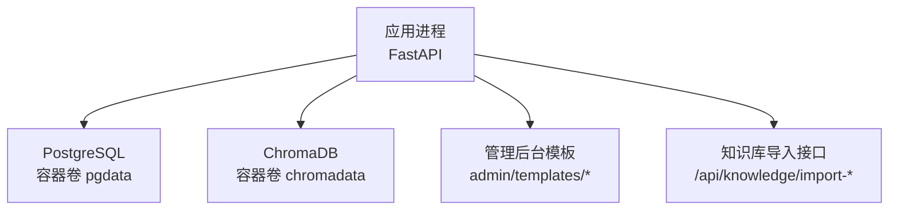
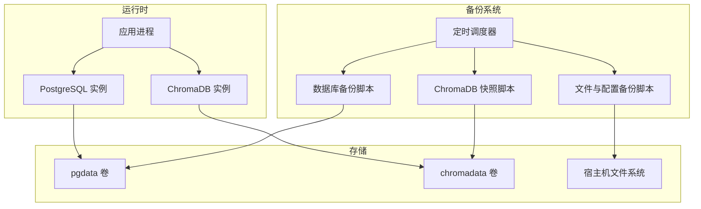
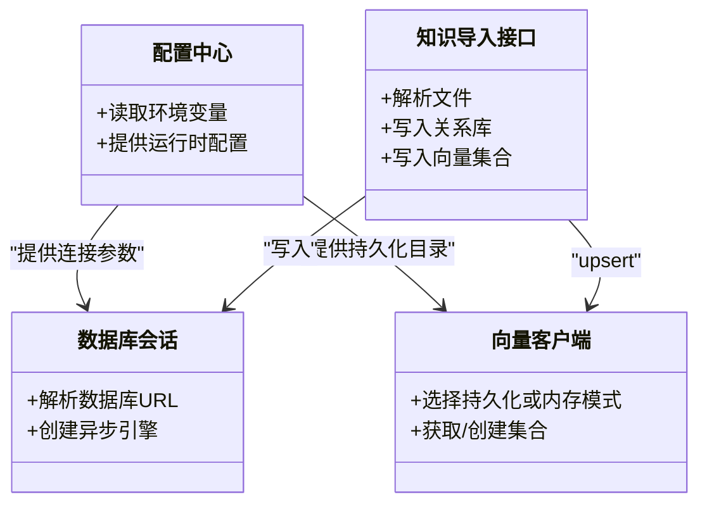

# 备份恢复

<cite>
**本文引用的文件**   
- [README.md](file://README.md)
- [docker-compose.yml](file://docker-compose.yml)
- [hushai/meditation/config.py](file://hushai/meditation/config.py)
- [hushai/meditation/db/session.py](file://hushai/meditation/db/session.py)
- [hushai/meditation/db/vector.py](file://hushai/meditation/db/vector.py)
- [hushai/meditation/api/knowledge.py](file://hushai/meditation/api/knowledge.py)
- [hushai/meditation/admin/templates/knowledge_import.html](file://hushai/meditation/admin/templates/knowledge_import.html)
- [hushai/meditation/admin/templates/skills_import.html](file://hushai/meditation/admin/templates/skills_import.html)
- [hushai/meditation/commands/init_knowledge.py](file://hushai/meditation/commands/init_knowledge.py)
</cite>

## 目录
1. [简介](#简介)
2. [项目结构](#项目结构)
3. [核心组件](#核心组件)
4. [架构总览](#架构总览)
5. [详细组件分析](#详细组件分析)
6. [依赖关系分析](#依赖关系分析)
7. [性能与一致性考量](#性能与一致性考量)
8. [故障排查指南](#故障排查指南)
9. [结论](#结论)
10. [附录：自动化脚本与计划任务](#附录自动化脚本与计划任务)

## 简介
本文件为 hush.ai 的完整备份与恢复策略文档，覆盖以下范围：
- 数据库（PostgreSQL）全量、增量、逻辑备份策略与实施要点
- 向量数据库 ChromaDB 的备份方法、数据导出、索引重建与一致性保证
- 文件备份策略：用户上传文件、配置文件、证书等关键数据的备份方案
- 灾难恢复流程：数据恢复步骤、服务重启顺序、数据验证方法
- 备份自动化脚本与定期执行计划建议

## 项目结构
hush.ai 使用 FastAPI 提供 API，持久化层包含：
- PostgreSQL（通过环境变量配置连接 URL）
- ChromaDB（支持本地持久化目录或内存模式）
- 静态资源与管理后台模板文件

图示来源
- [docker-compose.yml:1-31](file://docker-compose.yml#L1-L31)
- [hushai/meditation/db/session.py:15-31](file://hushai/meditation/db/session.py#L15-L31)
- [hushai/meditation/db/vector.py:15-28](file://hushai/meditation/db/vector.py#L15-L28)
- [hushai/meditation/api/knowledge.py:96-136](file://hushai/meditation/api/knowledge.py#L96-L136)

章节来源
- [README.md:100-132](file://README.md#L100-L132)
- [docker-compose.yml:1-31](file://docker-compose.yml#L1-L31)

## 核心组件
- 数据库会话与引擎：根据环境变量解析数据库 URL，默认 SQLite，生产推荐 PostgreSQL。
- 向量数据库客户端：根据配置选择 PersistentClient（持久化到磁盘）或 Client（内存）。
- 配置中心：集中读取环境变量，映射到运行时配置对象。
- 知识导入接口：支持单文件与批量导入，将文本分块写入关系库并同步至向量库。

章节来源
- [hushai/meditation/db/session.py:15-47](file://hushai/meditation/db/session.py#L15-L47)
- [hushai/meditation/db/vector.py:15-28](file://hushai/meditation/db/vector.py#L15-L28)
- [hushai/meditation/config.py:63-115](file://hushai/meditation/config.py#L63-L115)
- [hushai/meditation/api/knowledge.py:96-136](file://hushai/meditation/api/knowledge.py#L96-L136)

## 架构总览
下图展示备份与恢复涉及的关键组件与数据流向。

图示来源
- [docker-compose.yml:1-31](file://docker-compose.yml#L1-L31)
- [hushai/meditation/db/session.py:15-31](file://hushai/meditation/db/session.py#L15-L31)
- [hushai/meditation/db/vector.py:15-28](file://hushai/meditation/db/vector.py#L15-L28)

## 详细组件分析

### 数据库（PostgreSQL）备份策略
- 全量备份
  - 使用逻辑备份工具对目标数据库进行全量导出，生成可移植的 SQL 或自定义格式转储。
  - 建议在低峰期执行，确保事务一致性与最小锁等待。
- 增量/连续归档
  - 启用 WAL 归档，结合时间点恢复（PITR），实现按时间点恢复能力。
  - 配合周期性全量基线 + 增量 WAL 片段，缩短 RTO/RPO。
- 逻辑备份
  - 针对特定表或业务域进行选择性导出，便于迁移与测试环境快速搭建。
- 校验与保留
  - 对备份文件进行完整性校验（如哈希），并按策略保留多份历史副本。
- 恢复演练
  - 定期在隔离环境执行恢复演练，验证备份可用性与恢复流程。

章节来源
- [docker-compose.yml:4-17](file://docker-compose.yml#L4-L17)
- [hushai/meditation/db/session.py:15-31](file://hushai/meditation/db/session.py#L15-L31)

### 向量数据库（ChromaDB）备份策略
- 持久化模式
  - 当配置了持久化目录时，ChromaDB 以文件形式落盘，可直接对目录进行快照备份。
- 内存模式
  - 未配置持久化目录时使用内存模式，需通过应用侧的数据导出与重建机制保障可恢复性。
- 数据导出与重建
  - 通过应用提供的知识导入接口与命令工具，可将外部 Markdown 源重新导入，重建向量集合。
  - 对于用户记忆等动态数据，应结合关系库记录与向量集合 ID 的一致性进行重建。
- 一致性保证
  - 在导入过程中保持“关系库 + 向量集合”的双写一致性；失败时回滚或重试。
  - 重建后执行抽样检索验证，确保相似度与元数据正确。

章节来源
- [hushai/meditation/db/vector.py:15-28](file://hushai/meditation/db/vector.py#L15-L28)
- [hushai/meditation/api/knowledge.py:96-136](file://hushai/meditation/api/knowledge.py#L96-L136)
- [hushai/meditation/commands/init_knowledge.py:257-368](file://hushai/meditation/commands/init_knowledge.py#L257-L368)

### 文件备份策略
- 用户上传文件
  - 当前代码路径中未见独立对象存储模块，上传内容经接口处理后进入关系库与向量库。若后续引入对象存储，需将其桶/目录纳入备份范围。
- 配置文件与密钥
  - 环境变量与 .env 文件属于敏感配置，需加密存储并纳入备份清单。
- 证书与支付相关
  - 微信支付证书路径由配置项指定，需单独备份并确保权限最小化。
- 管理后台模板与静态资源
  - 作为应用资产的一部分，纳入版本控制与部署包，无需频繁备份。

章节来源
- [hushai/meditation/config.py:97-102](file://hushai/meditation/config.py#L97-L102)
- [hushai/meditation/admin/templates/knowledge_import.html:416-450](file://hushai/meditation/admin/templates/knowledge_import.html#L416-L450)
- [hushai/meditation/admin/templates/skills_import.html:133-166](file://hushai/meditation/admin/templates/skills_import.html#L133-L166)

### 灾难恢复流程
- 恢复前准备
  - 确认最近一次可用的全量备份与最近的增量/WAL 片段。
  - 准备与生产一致的运行环境与配置（包括嵌入模型与密钥）。
- 恢复步骤
  - 先恢复 PostgreSQL：从全量备份恢复到目标时间点，再回放增量 WAL。
  - 再恢复 ChromaDB：
    - 若使用持久化目录：直接替换数据目录并启动服务。
    - 若使用内存模式：基于关系库与外部语料源，通过导入接口或命令工具重建向量集合。
  - 最后启动应用服务，完成健康检查。
- 数据验证
  - 关系库：核对关键表行数、时间戳范围、审计日志连续性。
  - 向量库：执行若干典型查询，验证返回结果与分数分布是否符合预期。
  - 功能回归：登录、对话、知识检索、记忆检索等核心链路冒烟测试。
- 回滚策略
  - 若恢复后出现异常，立即回退到上一稳定版本镜像与备份集，并保留现场日志用于排障。

章节来源
- [docker-compose.yml:1-31](file://docker-compose.yml#L1-L31)
- [hushai/meditation/db/vector.py:15-28](file://hushai/meditation/db/vector.py#L15-L28)
- [hushai/meditation/api/knowledge.py:96-136](file://hushai/meditation/api/knowledge.py#L96-L136)
- [hushai/meditation/commands/init_knowledge.py:257-368](file://hushai/meditation/commands/init_knowledge.py#L257-L368)

## 依赖关系分析
- 应用进程依赖数据库会话与向量客户端，二者均通过配置中心读取环境变量。
- 知识导入接口同时更新关系库与向量集合，形成跨存储的一致性边界。
- Docker Compose 定义了 PostgreSQL 与 ChromaDB 的卷挂载，是备份与恢复的关键锚点。

图示来源
- [hushai/meditation/config.py:63-115](file://hushai/meditation/config.py#L63-L115)
- [hushai/meditation/db/session.py:15-47](file://hushai/meditation/db/session.py#L15-L47)
- [hushai/meditation/db/vector.py:15-28](file://hushai/meditation/db/vector.py#L15-L28)
- [hushai/meditation/api/knowledge.py:96-136](file://hushai/meditation/api/knowledge.py#L96-L136)

章节来源
- [docker-compose.yml:1-31](file://docker-compose.yml#L1-L31)
- [hushai/meditation/config.py:63-115](file://hushai/meditation/config.py#L63-L115)

## 性能与一致性考量
- 备份窗口
  - 全量备份尽量安排在低峰时段，避免影响在线读写。
- 并发与锁
  - 使用逻辑备份工具以减少锁等待；必要时对热点表加读锁或采用只读副本导出。
- 向量重建成本
  - 大规模导入时，分批处理并监控内存与 I/O 占用；必要时调整批大小与线程数。
- 一致性边界
  - 关系库与向量集合双写失败时需有补偿机制（重试、告警、人工介入）。
- 校验与监控
  - 对备份文件做完整性校验；对恢复后的关键指标建立监控与告警。

[本节为通用指导，不直接分析具体文件]

## 故障排查指南
- 无法连接数据库
  - 检查环境变量中的数据库 URL 是否正确，网络连通性与账号权限。
- 向量检索为空
  - 确认是否使用持久化目录；若为内存模式，需重建集合。
  - 检查导入接口是否成功提交，关系库与向量集合是否存在对应条目。
- 导入失败
  - 查看接口返回的错误信息；确认文件格式与编码；必要时切换解码方式。
- 恢复后检索不一致
  - 对比关系库与向量集合的计数与样本结果；必要时触发重建流程。

章节来源
- [hushai/meditation/db/session.py:15-31](file://hushai/meditation/db/session.py#L15-L31)
- [hushai/meditation/db/vector.py:15-28](file://hushai/meditation/db/vector.py#L15-L28)
- [hushai/meditation/api/knowledge.py:96-136](file://hushai/meditation/api/knowledge.py#L96-L136)

## 结论
- 通过组合 PostgreSQL 全量/增量/逻辑备份与 ChromaDB 持久化目录快照，可实现高可用的数据保护。
- 借助应用侧的知识导入接口与命令工具，可在需要时重建向量集合，保障数据一致性。
- 建议将备份与恢复纳入日常演练与监控体系，持续优化 RTO/RPO。

[本节为总结性内容，不直接分析具体文件]

## 附录：自动化脚本与计划任务
- 定时调度
  - 使用系统级调度器（如 cron）或容器编排平台的任务编排，定期执行备份脚本。
- 备份脚本建议
  - 数据库备份：封装全量导出与增量归档脚本，输出带时间戳的文件名，并计算校验值。
  - ChromaDB 快照：对持久化目录进行打包压缩，并上传至远端存储。
  - 文件与配置：对 .env、证书路径指向的证书文件等进行加密备份。
- 恢复脚本建议
  - 一键恢复：按顺序恢复数据库、向量数据与应用配置，完成后执行健康检查与冒烟用例。
- 示例入口参考
  - 知识导入 CLI：可用于重建向量集合与导入外部语料。
  - 管理后台导入页面：提供交互式导入入口，适合小规模数据修复与补充。

章节来源
- [hushai/meditation/commands/init_knowledge.py:257-368](file://hushai/meditation/commands/init_knowledge.py#L257-L368)
- [hushai/meditation/admin/templates/knowledge_import.html:416-450](file://hushai/meditation/admin/templates/knowledge_import.html#L416-L450)
- [hushai/meditation/admin/templates/skills_import.html:133-166](file://hushai/meditation/admin/templates/skills_import.html#L133-L166)