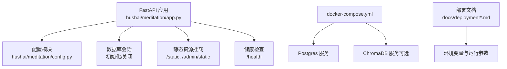
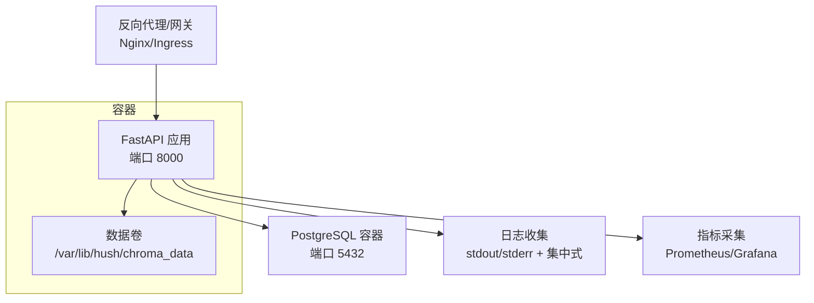
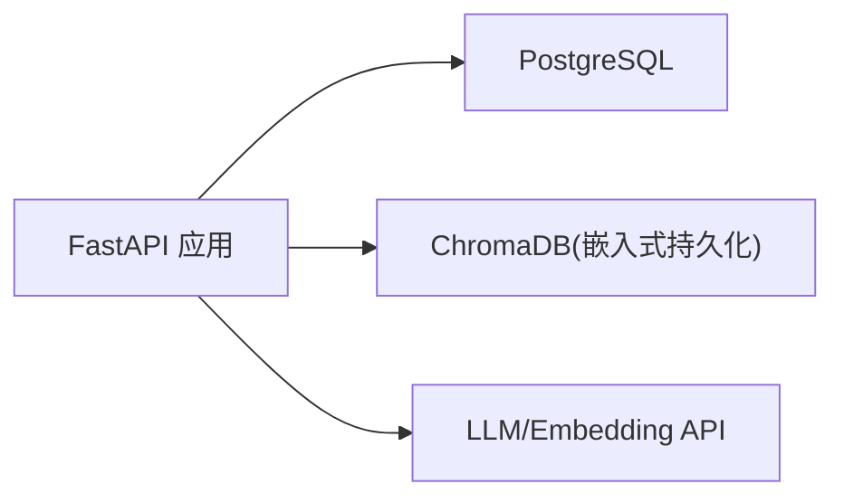

# 容器化部署

<cite>
**本文引用的文件**   
- [docker-compose.yml](file://docker-compose.yml)
- [pyproject.toml](file://pyproject.toml)
- [app.py](file://hushai/meditation/app.py)
- [config.py](file://hushai/meditation/config.py)
- [start_server.sh](file://scripts/start_server.sh)
- [deployment.md](file://docs/deployment.md)
- [deployment-minimal.md](file://docs/deployment-minimal.md)
- [README.md](file://README.md)
</cite>

## 目录
1. [简介](#简介)
2. [项目结构](#项目结构)
3. [核心组件](#核心组件)
4. [架构总览](#架构总览)
5. [详细组件分析](#详细组件分析)
6. [依赖关系分析](#依赖关系分析)
7. [性能与可观测性建议](#性能与可观测性建议)
8. [故障排查指南](#故障排查指南)
9. [结论](#结论)
10. [附录](#附录)

## 简介
本文件面向 hush.ai 的容器化与生产级编排，覆盖以下主题：
- Docker 镜像构建最佳实践（多阶段构建、分层策略、安全扫描）
- docker-compose 编排（服务依赖、网络、数据卷、环境变量）
- 生产环境编排方案（Kubernetes 清单、Helm Chart、服务发现与负载均衡）
- 监控与日志收集配置方法
- 完整部署示例与排障指南

说明：仓库未提供现成的 Dockerfile 与 Helm Chart。本节基于现有代码与文档，给出可直接落地的构建与编排方案，并标注来源以便追溯。

## 项目结构
从容器化视角，关键位置如下：
- 应用入口与生命周期：FastAPI 应用创建、启动参数、健康检查端点
- 配置加载：通过环境变量注入运行时配置
- 外部依赖：PostgreSQL（关系型）、ChromaDB（向量检索，默认嵌入式持久化）
- 脚本与文档：本地启动脚本与部署指南

图示来源
- [app.py:136-207](file://hushai/meditation/app.py#L136-L207)
- [config.py:18-136](file://hushai/meditation/config.py#L18-L136)
- [docker-compose.yml:1-31](file://docker-compose.yml#L1-L31)
- [deployment.md:1-245](file://docs/deployment.md#L1-L245)

章节来源
- [app.py:136-207](file://hushai/meditation/app.py#L136-L207)
- [config.py:18-136](file://hushai/meditation/config.py#L18-L136)
- [docker-compose.yml:1-31](file://docker-compose.yml#L1-L31)
- [deployment.md:1-245](file://docs/deployment.md#L1-L245)

## 核心组件
- FastAPI 应用
  - 使用 lifespan 进行数据库初始化、默认管理员与导师数据初始化
  - 注册路由、CORS、限流中间件
  - 暴露 /health 健康检查端点
- 配置系统
  - 通过 MEDITATION_* 环境变量驱动运行时行为（数据库、JWT、LLM、Embedding、监听地址等）
- 外部依赖
  - PostgreSQL：关系数据持久化
  - ChromaDB：向量检索（默认嵌入式持久化到本地目录）

章节来源
- [app.py:24-133](file://hushai/meditation/app.py#L24-L133)
- [app.py:136-207](file://hushai/meditation/app.py#L136-L207)
- [config.py:18-136](file://hushai/meditation/config.py#L18-L136)

## 架构总览
下图展示容器化后的典型部署形态：应用容器连接 Postgres 与本地 Chroma 持久化目录；反向代理对外暴露 HTTP/HTTPS；日志与指标由宿主或平台采集。

图示来源
- [app.py:203-206](file://hushai/meditation/app.py#L203-L206)
- [deployment.md:116-145](file://docs/deployment.md#L116-L145)
- [docker-compose.yml:1-31](file://docker-compose.yml#L1-L31)

## 详细组件分析

### Docker 镜像构建（多阶段构建与分层优化）
目标：构建一个最小、安全、可复现的生产镜像。

推荐的多阶段构建流程（概念性步骤，便于直接落地）：
- 构建阶段
  - 使用 Python 基础镜像安装编译依赖
  - 安装项目依赖（仅包含 meditation 可选集）
  - 复制源码与必要资源
- 运行阶段
  - 使用精简基础镜像（如 Alpine 或 distroless）
  - 仅复制已安装的依赖与应用包
  - 以非 root 用户运行，限制文件系统权限
- 分层策略
  - 将依赖安装与源码分离，提升缓存命中率
  - 将静态资源与模板放入只读层
- 安全扫描
  - 在 CI 中集成镜像漏洞扫描（例如 trivy/snyk），阻断高危漏洞
  - 定期更新基础镜像与依赖版本

注意：仓库未提供 Dockerfile，上述为通用最佳实践，可直接用于本项目。

[本节为通用指导，不直接分析具体文件]

### docker-compose 编排（依赖、网络、数据卷、环境变量）
当前仓库提供了 docker-compose.yml，定义了两个服务：
- postgres：PostgreSQL 16 Alpine，暴露 5432，设置用户名/密码/库名，挂载 pgdata 卷，带健康检查
- chromadb：ChromaDB 官方镜像，映射 8001:8000，挂载 chromadata 卷，关闭遥测

要点与建议：
- 服务依赖
  - 应用应等待 postgres 健康后再启动（compose v3 可通过 depends_on + healthcheck 实现）
- 网络
  - 默认桥接网络即可满足同机编排；如需隔离，可自定义网络
- 数据卷
  - pgdata 与 chromadata 确保重启后数据不丢失
- 环境变量
  - 应用侧通过 MEDITATION_* 变量控制行为；Compose 中可为应用服务注入这些变量
  - 注意区分 Compose 中的数据库凭据与应用侧连接字符串的一致性

章节来源
- [docker-compose.yml:1-31](file://docker-compose.yml#L1-L31)
- [deployment.md:86-114](file://docs/deployment.md#L86-L114)

### 应用启动与健康检查
- 应用入口
  - 通过 get_app() 工厂函数创建 FastAPI 实例
  - lifespan 中完成数据库初始化、默认管理员与导师数据初始化
- 健康检查
  - GET /health 返回 {"status":"ok"}，可用于探针与编排健康检查

章节来源
- [app.py:136-207](file://hushai/meditation/app.py#L136-L207)
- [app.py:203-206](file://hushai/meditation/app.py#L203-L206)

### 配置与环境变量管理
- 配置加载
  - 通过 MeditationConfig.from_env() 读取 MEDITATION_* 环境变量
  - 支持 JWT、LLM、Embedding、数据库、监听地址、调试开关等
- 关键变量（节选）
  - MEDITATION_POSTGRES_URL：数据库连接 URL
  - MEDITATION_CHROMA_DIR：向量持久化目录（生产必须设置）
  - MEDITATION_JWT_SECRET：JWT 签名密钥（生产必填）
  - MEDITATION_OPENAI_API_KEY / MEDITATION_EMBEDDING_*：对话与向量化
  - MEDITATION_HOST / MEDITATION_PORT：监听地址与端口
  - MEDITATION_DEBUG：是否开启调试模式

章节来源
- [config.py:18-136](file://hushai/meditation/config.py#L18-L136)
- [deployment.md:147-158](file://docs/deployment.md#L147-L158)

### 本地启动脚本
- start_server.sh
  - 设置默认 JWT 与调试开关
  - 支持 --postgresql 参数切换至 PostgreSQL
  - 调用 uvicorn 并以 factory 方式启动 get_app

章节来源
- [start_server.sh:1-31](file://scripts/start_server.sh#L1-L31)

### 生产环境编排方案（Kubernetes 与 Helm）
由于仓库未提供 K8s 清单与 Helm Chart，以下为可直接落地的企业级编排建议：

- Kubernetes 部署清单（概念性步骤）
  - Deployment：副本数按负载设定，资源请求/限制合理分配
  - Service：ClusterIP 暴露 8000 端口
  - Ingress：域名、TLS、路径转发到 Service
  - ConfigMap/Secret：集中管理环境变量（避免硬编码）
  - PersistentVolumeClaim：为 Chroma 持久化目录提供存储
  - Probes：liveness/readiness 使用 /health 端点
  - PodDisruptionBudget：保障滚动升级可用性
- Helm Chart（概念性步骤）
  - values.yaml：暴露所有可调参数（镜像、副本数、资源、存储、环境变量等）
  - templates：渲染 Deployment/Service/Ingress/PVC/ConfigMap/Secret
  - hooks：首次安装时执行数据库迁移或初始化任务（如有）
- 服务发现与负载均衡
  - 集群内通过 Service 名称访问
  - Ingress/Nginx Ingress 负责外部流量分发与 TLS 终止
  - 水平扩展：根据 CPU/内存或自定义指标自动扩缩容

[本节为通用指导，不直接分析具体文件]

### 监控与日志收集
- 日志
  - 应用输出结构化日志到 stdout/stderr，便于容器平台统一采集
  - 建议接入集中式日志系统（如 ELK/Loki）
- 指标
  - 可在应用中暴露 Prometheus 指标端点（如 prometheus-fastapi-instrumentator）
  - 使用 Grafana 可视化关键指标（QPS、延迟、错误率、依赖健康）
- 健康检查
  - 使用 /health 作为 liveness/readiness 探针

章节来源
- [app.py:203-206](file://hushai/meditation/app.py#L203-L206)

## 依赖关系分析
- 应用依赖
  - FastAPI、Uvicorn、SQLAlchemy、AsyncPG、Alembic、ChromaDB、Pydantic、Jinja2、SlowAPI 等
- 外部服务
  - PostgreSQL（关系数据）
  - ChromaDB（向量检索，默认嵌入式持久化）
  - LLM/Embedding API（OpenAI 兼容）

图示来源
- [pyproject.toml:51-69](file://pyproject.toml#L51-L69)
- [deployment.md:116-145](file://docs/deployment.md#L116-L145)

章节来源
- [pyproject.toml:51-69](file://pyproject.toml#L51-L69)
- [deployment.md:116-145](file://docs/deployment.md#L116-L145)

## 性能与可观测性建议
- 进程模型
  - 生产建议使用多 Worker 的 Uvicorn，并结合反向代理
- 资源规划
  - 根据 QPS 与并发估算 CPU/内存需求，预留缓冲
- 缓存与索引
  - 合理设置 memory_top_k/knowledge_top_k，避免过大上下文
- 可观测性
  - 启用结构化日志、指标采集、分布式追踪（可选）
  - 对依赖（DB、向量库、LLM）建立健康检查与告警

[本节为通用指导，不直接分析具体文件]

## 故障排查指南
- 常见问题
  - 向量持久化未生效：确认已设置 MEDITATION_CHROMA_DIR 且目录可写
  - 数据库连接失败：核对 MEDITATION_POSTGRES_URL 与网络可达性
  - CORS 跨域问题：调整 allow_origins 或在反向代理层处理
  - 健康检查失败：检查 /health 端点与探针配置
- 快速验证
  - 健康检查：GET /health
  - 对客页与管理后台：浏览器访问根路径与 /admin
  - API 文档：/debug（Swagger）

章节来源
- [deployment.md:216-237](file://docs/deployment.md#L216-L237)
- [app.py:203-206](file://hushai/meditation/app.py#L203-L206)

## 结论
- 仓库已提供 docker-compose 与完善的部署文档，可作为本地与单机生产的起点
- 生产级容器化建议采用多阶段构建、严格的环境变量管理与健康检查
- 结合 K8s/Helm 可实现高可用、弹性伸缩与企业级运维能力
- 监控与日志是稳定运行的关键，应在上线前完善

[本节为总结性内容，不直接分析具体文件]

## 附录

### 环境变量参考（节选）
- MEDITATION_POSTGRES_URL：数据库连接 URL
- MEDITATION_CHROMA_DIR：向量持久化目录
- MEDITATION_JWT_SECRET：JWT 签名密钥
- MEDITATION_OPENAI_API_KEY：对话 API Key
- MEDITATION_EMBEDDING_PROVIDER/MODEL/API_KEY/BASE_URL：Embedding 配置
- MEDITATION_HOST/MEDITATION_PORT：监听地址与端口
- MEDITATION_DEBUG：调试开关

章节来源
- [config.py:18-136](file://hushai/meditation/config.py#L18-L136)
- [deployment.md:147-158](file://docs/deployment.md#L147-L158)

### 快速启动命令（来自仓库）
- 开发模式
  - 使用脚本启动：bash scripts/start_server.sh
  - 或直接运行：python -m hushai.meditation.app
- 生产模式（Docker Compose）
  - 配置环境变量后执行：docker compose up -d

章节来源
- [start_server.sh:1-31](file://scripts/start_server.sh#L1-L31)
- [README.md:275-284](file://README.md#L275-L284)