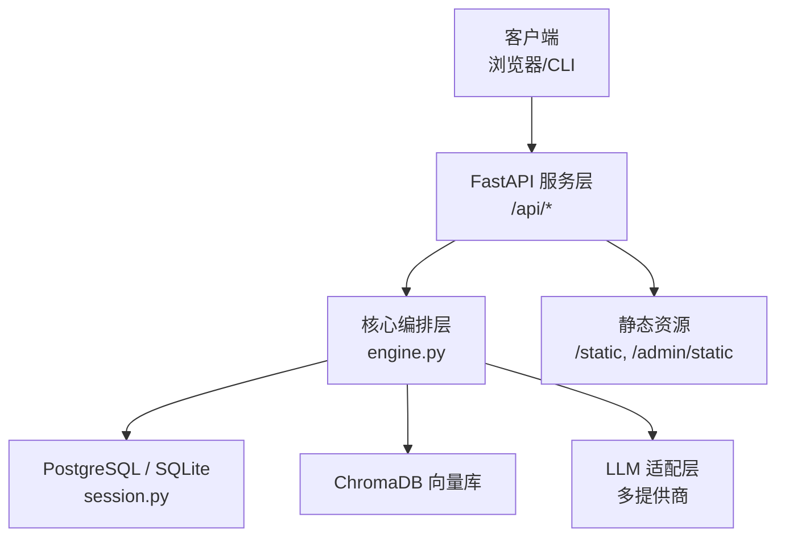
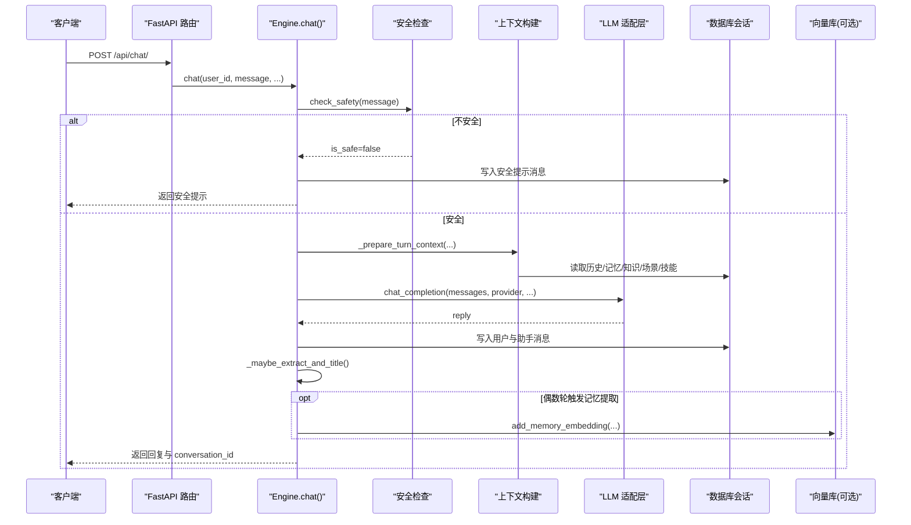
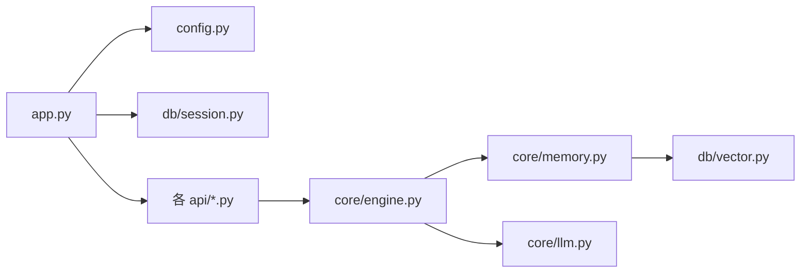

# 故障排查与FAQ

<cite>
**本文引用的文件**   
- [README.md](file://README.md)
- [配置说明](file://docs/configuration.md)
- [CLI 文档](file://docs/cli.md)
- [应用入口 app.py](file://hushai/meditation/app.py)
- [冥想配置 config.py](file://hushai/meditation/config.py)
- [数据库会话 session.py](file://hushai/meditation/db/session.py)
- [对话引擎 engine.py](file://hushai/meditation/core/engine.py)
- [记忆管理 memory.py](file://hushai/meditation/core/memory.py)
- [LLM 错误测试 test_llm_errors.py](file://tests/test_llm_errors.py)
- [质量修复总结 summary.md](file://.comate/specs/fix-all-quality-issues/summary.md)
- [质量修复说明 doc.md](file://.comate/specs/fix-all-quality-issues/doc.md)
</cite>

## 目录
1. [简介](#简介)
2. [项目结构](#项目结构)
3. [核心组件](#核心组件)
4. [架构总览](#架构总览)
5. [详细组件分析](#详细组件分析)
6. [依赖关系分析](#依赖关系分析)
7. [性能考虑](#性能考虑)
8. [故障排查指南](#故障排查指南)
9. [常见问题解答（FAQ）](#常见问题解答faq)
10. [结论](#结论)
11. [附录：错误码参考](#附录错误码参考)

## 简介
本指南面向 hush.ai 的运维、开发与使用人员，聚焦于“连接超时、内存溢出、性能瓶颈”等典型问题的诊断方法；提供日志分析、性能分析、数据库查询优化等调试技巧；整理 API/系统/业务错误码含义与处理建议；并给出数据库优化、缓存策略、并发控制等调优建议。文末包含社区支持与问题反馈流程。

## 项目结构
- Web 服务基于 FastAPI，提供 REST 与 SSE 流式接口，挂载静态资源与管理后台。
- 核心编排层负责提示词构建、知识检索、记忆提取、技能挂载与安全过滤。
- LLM 适配层支持多提供商自动降级。
- 持久化层包括 PostgreSQL（或 SQLite）、ChromaDB（向量检索）。

图表来源
- [应用入口 app.py:1-228](file://hushai/meditation/app.py#L1-L228)
- [对话引擎 engine.py:1-387](file://hushai/meditation/core/engine.py#L1-L387)
- [数据库会话 session.py:1-83](file://hushai/meditation/db/session.py#L1-L83)

章节来源
- [README.md:136-178](file://README.md#L136-L178)
- [应用入口 app.py:1-228](file://hushai/meditation/app.py#L1-L228)

## 核心组件
- 配置加载：从环境变量与 .env 加载，统一通过 get_config() 获取。
- 应用生命周期：启动时初始化日志、数据库、默认管理员与导师数据；关闭时释放资源。
- 速率限制：集成 slowapi，注册全局 Limiter 与异常处理器。
- CORS：生产环境默认空列表，debug=True 时放宽为 ["*"]。
- 健康检查：/health 返回 {"status":"ok"}。
- 路由挂载：认证、聊天、知识库、记忆、冥想、搭子、管理等模块路由集中注册。

章节来源
- [冥想配置 config.py:1-136](file://hushai/meditation/config.py#L1-L136)
- [应用入口 app.py:1-228](file://hushai/meditation/app.py#L1-L228)

## 架构总览
下图展示一次普通对话请求的关键调用链，涵盖安全校验、上下文组装、LLM 调用、结果持久化与记忆提取触发。

图表来源
- [对话引擎 engine.py:166-236](file://hushai/meditation/core/engine.py#L166-L236)
- [记忆管理 memory.py:79-112](file://hushai/meditation/core/memory.py#L79-L112)
- [数据库会话 session.py:50-83](file://hushai/meditation/db/session.py#L50-L83)

## 详细组件分析

### 配置与运行参数
- 关键环境变量：JWT、LLM 提供商密钥与模型、嵌入模型、数据库 URL、ChromaDB 目录、端口与 debug、CORS 等。
- 运行时行为：
  - debug=True 时日志级别为 DEBUG，SQLAlchemy echo 开启，CORS 放宽。
  - 默认监听 0.0.0.0:8000，可通过环境变量覆盖。
- 常见排障点：
  - 未设置必要密钥导致 LLM 调用失败。
  - 数据库 URL 格式不正确或未安装对应驱动。
  - CORS 在生产环境误配导致跨域失败。

章节来源
- [冥想配置 config.py:1-136](file://hushai/meditation/config.py#L1-L136)
- [应用入口 app.py:136-207](file://hushai/meditation/app.py#L136-L207)

### 数据库与会话管理
- 自动选择后端：若未配置 postgres_url，则回退到 sqlite+aiosqlite 本地文件。
- 连接池：SQLite 与 PostgreSQL 分别设置不同 pool_size。
- 初始化：启动时执行 create_all，确保表存在。
- 排障要点：
  - 确认 DATABASE_URL 或 MEDITATION_POSTGRES_URL 正确。
  - 确认异步驱动已安装（如 asyncpg、aiosqlite）。
  - 观察 SQLAlchemy echo 输出定位慢查询。

章节来源
- [数据库会话 session.py:15-47](file://hushai/meditation/db/session.py#L15-L47)
- [应用入口 app.py:24-40](file://hushai/meditation/app.py#L24-L40)

### 对话引擎与事务回滚
- 非流式 chat：外层 try/except 捕获异常并显式 session.rollback()。
- 流式 chat_stream：引入 committed 标志与 finally 块，未提交则回滚。
- 记忆提取：按间隔触发，失败仅记录警告不阻断主流程。
- 排障要点：
  - 关注异常堆栈与回滚是否生效。
  - 长会话下历史加载采用 LIMIT，避免全量拉取。

章节来源
- [对话引擎 engine.py:166-314](file://hushai/meditation/core/engine.py#L166-L314)
- [记忆管理 memory.py:45-77](file://hushai/meditation/core/memory.py#L45-L77)

### 记忆系统与向量写入隔离
- 提取：将最近对话文本拼接后调用 LLM 生成结构化 JSON，解析失败会记录警告并返回空数组。
- 存储：逐条写入 Memory，随后尝试写入向量库；向量写入异常被捕获并记录，不影响主流程。
- 排障要点：
  - 若向量库不可用，对话仍可继续，但检索不到相关记忆。
  - 关注 JSON 解析失败的日志以定位 LLM 输出格式问题。

章节来源
- [记忆管理 memory.py:45-112](file://hushai/meditation/core/memory.py#L45-L112)

### LLM 错误分类与用户提示
- 针对 OpenAI SDK 异常进行中文友好映射：超时、连接、鉴权、权限、限频、通用状态码等。
- 测试用例覆盖了多种异常类型，确保错误文案可读性。
- 排障要点：
  - 根据错误文案快速定位是网络、密钥、配额还是服务端问题。

章节来源
- [LLM 错误测试 test_llm_errors.py:1-58](file://tests/test_llm_errors.py#L1-L58)

### 速率限制与 CORS 安全
- 速率限制：全局 Limiter 基于远端地址计数，聊天端点限制 30/分钟。
- CORS：生产默认空列表，仅在 debug=True 时允许任意来源。
- 排障要点：
  - 遇到 429 需降低频率或申请提升配额。
  - 前端跨域报错需核对 cors_origins 配置。

章节来源
- [应用入口 app.py:146-155](file://hushai/meditation/app.py#L146-L155)
- [质量修复说明 doc.md:32-47](file://.comate/specs/fix-all-quality-issues/doc.md#L32-L47)

## 依赖关系分析
- 外部依赖：slowapi（速率限制）、OpenAI SDK（兼容多提供商）、SQLAlchemy 异步驱动、ChromaDB。
- 内部耦合：
  - app.py 依赖 config.py 与 db.session.py。
  - engine.py 依赖 core.knowledge、core.llm、core.memory、core.prompt、core.safety、core.scenes、core.skills 与 db.models、db.session。
  - memory.py 依赖 vector 接口与 llm 适配层。

图表来源
- [应用入口 app.py:136-207](file://hushai/meditation/app.py#L136-L207)
- [对话引擎 engine.py:1-387](file://hushai/meditation/core/engine.py#L1-L387)
- [记忆管理 memory.py:1-206](file://hushai/meditation/core/memory.py#L1-L206)

章节来源
- [应用入口 app.py:136-207](file://hushai/meditation/app.py#L136-L207)
- [对话引擎 engine.py:1-387](file://hushai/meditation/core/engine.py#L1-L387)

## 性能考虑
- 数据库层面
  - 使用 SQL LIMIT 控制历史加载规模，避免长会话全量拉取。
  - 合理设置连接池大小与超时；在 PostgreSQL 上启用索引与统计信息更新。
- 向量检索
  - 控制 top_k 与 embedding 批量写入，避免频繁小写入库。
- 并发与限流
  - 利用 slowapi 对聊天端点进行节流，保护上游 LLM 配额。
- 日志与可观测性
  - 生产环境关闭 SQLAlchemy echo，按需开启 INFO/ERROR 级别日志。
  - 结合健康检查 /health 与外部监控探针。

[本节为通用指导，无需列出具体文件来源]

## 故障排查指南

### 连接超时
- 现象
  - 客户端报“请求超时”，或日志中出现“超时”字样。
- 可能原因
  - LLM 网关响应慢或网络抖动。
  - 本地代理/防火墙拦截。
  - 服务器资源不足导致排队。
- 排查步骤
  - 检查 LLM 提供商状态与配额。
  - 调整 LLM_TIMEOUT 与重试次数（见 CLI 配置说明）。
  - 使用 curl 直接访问 Base URL 验证连通性。
  - 查看慢查询与连接池耗尽情况。
- 相关实现
  - OpenAI 异常映射中包含“超时”文案。
  - CLI 文档定义了超时与重试环境变量。

章节来源
- [LLM 错误测试 test_llm_errors.py:26-29](file://tests/test_llm_errors.py#L26-L29)
- [配置说明:1-30](file://docs/configuration.md#L1-L30)

### 鉴权与权限错误
- 现象
  - 返回“密钥无效/权限不足/401/403”。
- 可能原因
  - API Key 错误或过期。
  - 账号无可用额度或模型未开通。
- 排查步骤
  - 核对 MEDITATION_*_API_KEY 与 BASE_URL。
  - 登录提供商控制台检查账户状态与配额。
  - 切换 provider 验证是否为单点问题。
- 相关实现
  - 错误映射覆盖 AuthenticationError 与 PermissionDeniedError。

章节来源
- [LLM 错误测试 test_llm_errors.py:41-48](file://tests/test_llm_errors.py#L41-L48)

### 速率限制（429）
- 现象
  - 客户端收到“频繁/限频”提示或 HTTP 429。
- 可能原因
  - 超过 LLM 提供商 QPM/TPM 限制。
  - 本地 slowapi 阈值过低。
- 排查步骤
  - 降低请求频率或分批发送。
  - 调整 slowapi 阈值（当前聊天端点 30/分钟）。
  - 升级提供商套餐或增加实例。
- 相关实现
  - 全局 Limiter 与 RateLimitExceeded 处理器已注册。

章节来源
- [应用入口 app.py:146-147](file://hushai/meditation/app.py#L146-L147)
- [质量修复总结 summary.md:26-29](file://.comate/specs/fix-all-quality-issues/summary.md#L26-L29)

### 跨域（CORS）失败
- 现象
  - 浏览器控制台报 CORS 错误。
- 可能原因
  - 生产环境 cors_origins 为空，未放行前端域名。
- 排查步骤
  - 在环境变量中设置 MEDITATION_CORS_ORIGINS 为可信来源。
  - 开发环境保持 debug=True 以便临时放行。
- 相关实现
  - debug=True 时允许 ["*"]，否则使用配置列表。

章节来源
- [应用入口 app.py:148-155](file://hushai/meditation/app.py#L148-L155)
- [质量修复说明 doc.md:32-36](file://.comate/specs/fix-all-quality-issues/doc.md#L32-L36)

### 数据库连接失败
- 现象
  - 启动时报错无法创建引擎或建表失败。
- 可能原因
  - 未设置 MEDITATION_POSTGRES_URL 且缺少 SQLite 驱动。
  - PostgreSQL 连接串格式错误或凭据错误。
- 排查步骤
  - 确认 URL 前缀与驱动匹配（postgresql+asyncpg:// 或 sqlite+aiosqlite://）。
  - 检查网络可达性与白名单。
  - 打开 debug 模式查看 SQLAlchemy echo 输出。
- 相关实现
  - 自动补全驱动前缀与连接参数。

章节来源
- [数据库会话 session.py:15-47](file://hushai/meditation/db/session.py#L15-L47)

### 向量库不可用
- 现象
  - 对话正常，但“相关记忆”为空。
- 可能原因
  - ChromaDB 未启动或路径不可写。
  - 向量写入异常被隔离，不阻断主流程。
- 排查步骤
  - 检查 CHROMA_DB_DIR 与磁盘空间。
  - 查看“记忆向量写入失败”的警告日志。
- 相关实现
  - store_memories 中对向量写入做了异常隔离。

章节来源
- [记忆管理 memory.py:102-111](file://hushai/meditation/core/memory.py#L102-L111)

### 长会话卡顿
- 现象
  - 历史越长，响应越慢。
- 可能原因
  - 历史加载过大或提示词过长。
- 排查步骤
  - 调整 conversation_max_turns 控制上下文长度。
  - 确认 SQL 层使用 LIMIT 而非 Python 切片。
- 相关实现
  - _load_conversation_messages 使用 LIMIT。

章节来源
- [对话引擎 engine.py:59-76](file://hushai/meditation/core/engine.py#L59-L76)

### 流式输出中断
- 现象
  - SSE 流提前结束或长时间无增量。
- 可能原因
  - LLM 侧超时或网络抖动。
  - 事务未提交导致回滚。
- 排查步骤
  - 检查 chat_stream 的 finally 回滚逻辑与 committed 标志。
  - 提高 LLM_TIMEOUT 或增加重试。
- 相关实现
  - chat_stream 使用 committed 与 finally 保证一致性。

章节来源
- [对话引擎 engine.py:238-314](file://hushai/meditation/core/engine.py#L238-L314)

## 常见问题解答（FAQ）

- 如何查看服务健康状态？
  - 访问 /health，期望返回 {"status":"ok"}。
- 如何开启更详细的日志？
  - 设置 MEDITATION_DEBUG=true，启动日志级别降为 DEBUG，并开启 SQLAlchemy echo。
- 如何限制聊天接口频率？
  - 使用内置 slowapi，聊天端点默认 30/分钟，可按需调整。
- 如何更换 LLM 提供商？
  - 通过 MEDITATION_DEFAULT_LLM_PROVIDER 与对应 *_API_KEY/*_BASE_URL/*_MODEL 配置。
- 为什么记忆没有更新？
  - 记忆提取按偶数轮触发；若 JSON 解析失败或向量写入异常，不会阻断对话。
- 如何导出或备份数据？
  - 管理后台支持 CSV/Excel 导出；数据库可通过工具备份。

章节来源
- [应用入口 app.py:203-206](file://hushai/meditation/app.py#L203-L206)
- [冥想配置 config.py:18-62](file://hushai/meditation/config.py#L18-L62)
- [对话引擎 engine.py:130-154](file://hushai/meditation/core/engine.py#L130-L154)

## 结论
通过合理的配置、限流与错误隔离，hush.ai 能在多提供商环境下稳定运行。针对连接、鉴权、限频、跨域、数据库与向量库等常见问题，本文提供了明确的定位步骤与改进建议。配合日志与监控，可快速恢复服务并持续优化性能。

[本节为总结性内容，无需列出具体文件来源]

## 附录：错误码参考

- API 错误码（HTTP）
  - 401 未授权：通常由 JWT 缺失/过期或 LLM 鉴权失败引起。
  - 403 禁止访问：权限不足或模型未开通。
  - 429 请求过多：超出 LLM 提供商或本地 slowapi 限制。
  - 5xx 服务端错误：上游 LLM 或服务端异常。

- 系统错误码（CLI 退出码）
  - 0：成功（含帮助/版本、REPL 正常退出、EOF 退出）。
  - 1：配置错误、缺少密钥、API/网络类错误、stdin 为空、REPL 单次请求失败等。

- 业务错误码（示例）
  - 安全拦截：检测到敏感或危机内容，返回安全提示与建议。
  - 记忆提取失败：JSON 解析失败或向量写入异常，仅记录警告，不阻断对话。
  - 限频：达到速率限制阈值，需降低频率或提升配额。

章节来源
- [CLI 文档:63-71](file://docs/cli.md#L63-L71)
- [对话引擎 engine.py:182-196](file://hushai/meditation/core/engine.py#L182-L196)
- [记忆管理 memory.py:74-76](file://hushai/meditation/core/memory.py#L74-L76)
- [应用入口 app.py:146-147](file://hushai/meditation/app.py#L146-L147)