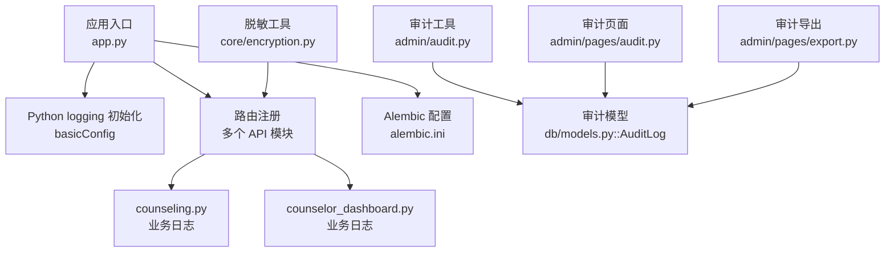
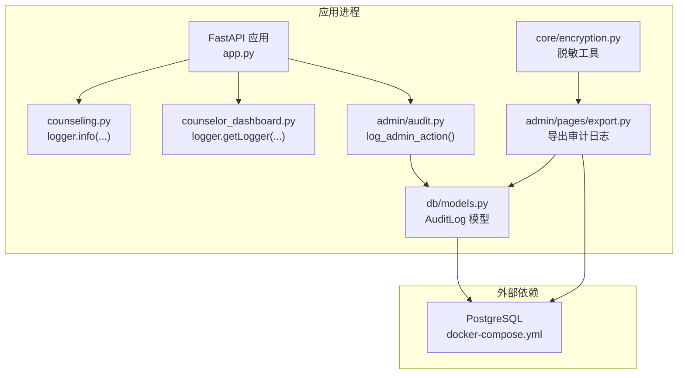
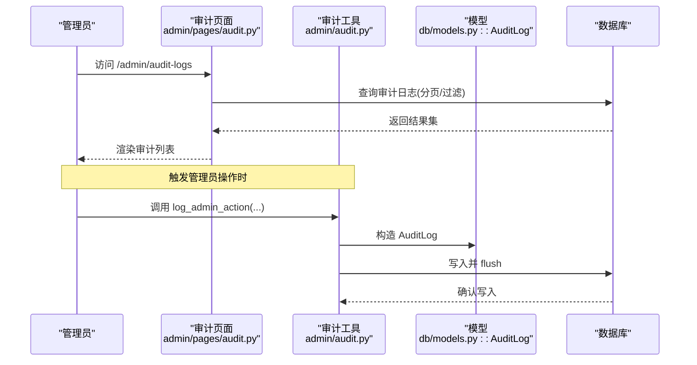
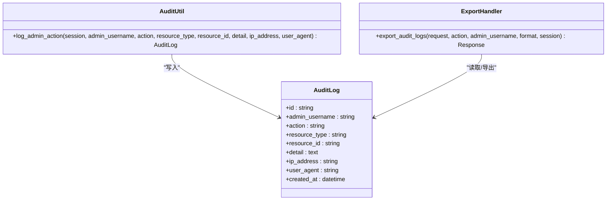

# 日志管理

<cite>
**本文引用的文件**   
- [hushai/meditation/app.py](file://hushai/meditation/app.py)
- [hushai/meditation/config.py](file://hushai/meditation/config.py)
- [hushai/meditation/api/counseling.py](file://hushai/meditation/api/counseling.py)
- [hushai/meditation/api/counselor_dashboard.py](file://hushai/meditation/api/counselor_dashboard.py)
- [alembic.ini](file://alembic.ini)
- [hushai/meditation/admin/audit.py](file://hushai/meditation/admin/audit.py)
- [hushai/meditation/db/models.py](file://hushai/meditation/db/models.py)
- [hushai/meditation/admin/pages/audit.py](file://hushai/meditation/admin/pages/audit.py)
- [hushai/meditation/admin/pages/export.py](file://hushai/meditation/admin/pages/export.py)
- [hushai/meditation/core/encryption.py](file://hushai/meditation/core/encryption.py)
- [docker-compose.yml](file://docker-compose.yml)
</cite>

## 目录
1. [简介](#简介)
2. [项目结构](#项目结构)
3. [核心组件](#核心组件)
4. [架构总览](#架构总览)
5. [详细组件分析](#详细组件分析)
6. [依赖关系分析](#依赖关系分析)
7. [性能考虑](#性能考虑)
8. [故障排查指南](#故障排查指南)
9. [结论](#结论)
10. [附录](#附录)

## 简介
本文件为 hush.ai 的“日志管理”专项文档，聚焦于：
- 结构化日志设计规范（级别、字段、脱敏）
- 日志采集与收集方案（应用、系统、第三方服务）
- 存储与分析平台搭建建议（ELK/Loki/云日志）
- 查询与分析方法（检索语法、统计、趋势）
- 审计日志管理与安全合规要求

当前仓库已实现基础的应用程序日志输出与管理员操作审计日志持久化。本文在现有实现基础上，给出可落地的规范与扩展建议，帮助团队构建统一、可观测、可审计的日志体系。

## 项目结构
围绕日志相关的关键位置如下：
- 应用启动与日志初始化：FastAPI 生命周期中配置 Python logging
- 业务模块日志：各 API 模块使用命名空间 logger
- 数据库迁移日志：Alembic 独立日志配置
- 审计日志：管理员操作记录入库并提供导出能力
- 敏感信息脱敏：提供手机号、身份证、姓名等脱敏工具

图表来源
- [hushai/meditation/app.py:24-33](file://hushai/meditation/app.py#L24-L33)
- [hushai/meditation/api/counseling.py:44-516](file://hushai/meditation/api/counseling.py#L44-L516)
- [hushai/meditation/api/counselor_dashboard.py:42](file://hushai/meditation/api/counselor_dashboard.py#L42)
- [alembic.ini:1-36](file://alembic.ini#L1-L36)
- [hushai/meditation/admin/audit.py:10-31](file://hushai/meditation/admin/audit.py#L10-L31)
- [hushai/meditation/db/models.py:188-202](file://hushai/meditation/db/models.py#L188-L202)
- [hushai/meditation/admin/pages/audit.py:16-71](file://hushai/meditation/admin/pages/audit.py#L16-L71)
- [hushai/meditation/admin/pages/export.py:54-92](file://hushai/meditation/admin/pages/export.py#L54-L92)
- [hushai/meditation/core/encryption.py:49-72](file://hushai/meditation/core/encryption.py#L49-L72)

章节来源
- [hushai/meditation/app.py:24-33](file://hushai/meditation/app.py#L24-L33)
- [alembic.ini:1-36](file://alembic.ini#L1-L36)

## 核心组件
- 应用日志初始化
  - 在 FastAPI 生命周期中根据调试开关设置日志级别与格式，并输出关键启动/关闭事件。
- 业务模块日志
  - 各 API 模块通过命名空间 logger 输出业务事件（如支付成功等）。
- 数据库迁移日志
  - Alembic 独立配置，默认控制台输出，级别可控。
- 审计日志
  - 管理员操作写入 audit_logs 表，支持按操作类型、管理员账号筛选与分页展示，并提供 CSV/Excel 导出。
- 敏感信息脱敏
  - 提供手机号、身份证号、姓名的脱敏函数，便于在展示或导出时降低泄露风险。

章节来源
- [hushai/meditation/app.py:24-33](file://hushai/meditation/app.py#L24-L33)
- [hushai/meditation/api/counseling.py:44-516](file://hushai/meditation/api/counseling.py#L44-L516)
- [hushai/meditation/api/counselor_dashboard.py:42](file://hushai/meditation/api/counselor_dashboard.py#L42)
- [alembic.ini:1-36](file://alembic.ini#L1-L36)
- [hushai/meditation/admin/audit.py:10-31](file://hushai/meditation/admin/audit.py#L10-L31)
- [hushai/meditation/db/models.py:188-202](file://hushai/meditation/db/models.py#L188-L202)
- [hushai/meditation/admin/pages/audit.py:16-71](file://hushai/meditation/admin/pages/audit.py#L16-L71)
- [hushai/meditation/admin/pages/export.py:54-92](file://hushai/meditation/admin/pages/export.py#L54-L92)
- [hushai/meditation/core/encryption.py:49-72](file://hushai/meditation/core/encryption.py#L49-L72)

## 架构总览
下图展示了当前日志与审计在系统中的位置与交互关系，以及后续可扩展的采集/存储/分析层。

图表来源
- [hushai/meditation/app.py:24-33](file://hushai/meditation/app.py#L24-L33)
- [hushai/meditation/api/counseling.py:44-516](file://hushai/meditation/api/counseling.py#L44-L516)
- [hushai/meditation/api/counselor_dashboard.py:42](file://hushai/meditation/api/counselor_dashboard.py#L42)
- [hushai/meditation/admin/audit.py:10-31](file://hushai/meditation/admin/audit.py#L10-L31)
- [hushai/meditation/db/models.py:188-202](file://hushai/meditation/db/models.py#L188-L202)
- [hushai/meditation/admin/pages/export.py:54-92](file://hushai/meditation/admin/pages/export.py#L54-L92)
- [hushai/meditation/core/encryption.py:49-72](file://hushai/meditation/core/encryption.py#L49-L72)
- [docker-compose.yml:4-17](file://docker-compose.yml#L4-L17)

## 详细组件分析

### 应用日志与格式化
- 日志级别与格式
  - 在应用生命周期内根据调试模式设置日志级别；默认 INFO，调试模式 DEBUG。
  - 采用标准 Python logging 格式，包含时间、级别、命名空间与消息。
- 关键事件
  - 服务启动、数据库初始化、默认数据创建、服务关闭等关键节点均有日志输出。
- 扩展建议
  - 将格式改为 JSON（例如 json-logs），便于后续集中采集与结构化解析。
  - 增加 trace_id/span_id 字段以支撑分布式链路追踪。

章节来源
- [hushai/meditation/app.py:24-33](file://hushai/meditation/app.py#L24-L33)

### 业务模块日志
- counseling 模块
  - 使用命名空间 logger，记录关键业务事件（如订单支付成功）。
- counselor_dashboard 模块
  - 定义模块级 logger，用于仪表盘相关事件记录。
- 规范化建议
  - 统一字段约定：event、level、trace_id、user_id、resource_type、resource_id、detail、ip、ua、ts。
  - 对敏感字段进行脱敏后再输出。

章节来源
- [hushai/meditation/api/counseling.py:44-516](file://hushai/meditation/api/counseling.py#L44-L516)
- [hushai/meditation/api/counselor_dashboard.py:42](file://hushai/meditation/api/counselor_dashboard.py#L42)

### 数据库迁移日志
- Alembic 独立配置
  - 通过 alembic.ini 控制 root/sqlalchemy/alembic 三个 logger 的级别与处理器。
  - 默认控制台输出，适合本地开发与迁移排障。
- 生产建议
  - 将 handler 指向文件/远程收集器，避免污染 stdout/stderr。
  - 调整 sqlalchemy.engine 级别至 WARNING，减少 SQL 噪音。

章节来源
- [alembic.ini:1-36](file://alembic.ini#L1-L36)

### 审计日志（管理员操作）
- 写入流程
  - 通过 log_admin_action 构造 AuditLog 对象并写入会话，随后 flush。
- 数据模型
  - audit_logs 表包含管理员账号、操作、资源类型/ID、详情、IP、UA、时间戳等字段。
- 查看与导出
  - 审计页面支持分页、按操作类型与管理员筛选。
  - 导出接口支持 CSV/Excel，字段包含时间、管理员、操作、资源类型、资源ID、详情、IP。
- 安全与合规
  - 仅管理员可见，导出需鉴权。
  - 建议在导出前对接脱敏工具，避免暴露敏感内容。

图表来源
- [hushai/meditation/admin/pages/audit.py:16-71](file://hushai/meditation/admin/pages/audit.py#L16-L71)
- [hushai/meditation/admin/audit.py:10-31](file://hushai/meditation/admin/audit.py#L10-L31)
- [hushai/meditation/db/models.py:188-202](file://hushai/meditation/db/models.py#L188-L202)

章节来源
- [hushai/meditation/admin/audit.py:10-31](file://hushai/meditation/admin/audit.py#L10-L31)
- [hushai/meditation/db/models.py:188-202](file://hushai/meditation/db/models.py#L188-L202)
- [hushai/meditation/admin/pages/audit.py:16-71](file://hushai/meditation/admin/pages/audit.py#L16-L71)
- [hushai/meditation/admin/pages/export.py:54-92](file://hushai/meditation/admin/pages/export.py#L54-L92)

### 敏感信息脱敏
- 内置脱敏函数
  - 手机号、身份证号、姓名三类常用 PII 的脱敏规则。
- 使用建议
  - 在日志输出、导出、前端展示前统一调用脱敏函数。
  - 结合配置开关控制是否开启脱敏（开发环境可放宽，生产严格）。

章节来源
- [hushai/meditation/core/encryption.py:49-72](file://hushai/meditation/core/encryption.py#L49-L72)

## 依赖关系分析
- 运行时依赖
  - PostgreSQL 作为审计日志与业务数据存储。
- 组件耦合
  - 审计工具与模型强耦合；导出功能依赖模型与数据库会话。
  - 应用日志与业务模块松耦合，通过命名空间 logger 解耦。
- 潜在改进
  - 引入异步队列将审计日志写入与主请求路径解耦，提升吞吐。
  - 将应用日志与审计日志分离到不同通道，便于差异化治理。

图表来源
- [hushai/meditation/db/models.py:188-202](file://hushai/meditation/db/models.py#L188-L202)
- [hushai/meditation/admin/audit.py:10-31](file://hushai/meditation/admin/audit.py#L10-L31)
- [hushai/meditation/admin/pages/export.py:54-92](file://hushai/meditation/admin/pages/export.py#L54-L92)

章节来源
- [docker-compose.yml:4-17](file://docker-compose.yml#L4-L17)
- [hushai/meditation/admin/audit.py:10-31](file://hushai/meditation/admin/audit.py#L10-L31)
- [hushai/meditation/db/models.py:188-202](file://hushai/meditation/db/models.py#L188-L202)
- [hushai/meditation/admin/pages/export.py:54-92](file://hushai/meditation/admin/pages/export.py#L54-L92)

## 性能考虑
- 日志级别控制
  - 生产默认 INFO，避免 DEBUG 带来的 IO 压力。
- 异步与批处理
  - 审计日志可改为异步写入（批量 flush），降低请求延迟。
- 采样与限流
  - 高频事件（如健康检查、静态资源）可采样或降级为 WARN/ERROR。
- 存储分层
  - 热数据（近 7 天）保留在高性能存储，冷数据归档至低成本存储。

[本节为通用指导，不直接分析具体文件]

## 故障排查指南
- 应用日志
  - 若未看到预期日志，检查生命周期中的 basicConfig 是否生效，以及模块 logger 命名空间是否正确。
- 迁移日志
  - 调整 alembic.ini 中 sqlalchemy.engine 级别，定位慢查询或异常。
- 审计日志缺失
  - 确认 log_admin_action 被调用且事务已提交；检查数据库连接与会话状态。
- 导出失败
  - 校验导出接口的鉴权逻辑与权限；核对字段映射与空值处理。

章节来源
- [hushai/meditation/app.py:24-33](file://hushai/meditation/app.py#L24-L33)
- [alembic.ini:1-36](file://alembic.ini#L1-L36)
- [hushai/meditation/admin/audit.py:10-31](file://hushai/meditation/admin/audit.py#L10-L31)
- [hushai/meditation/admin/pages/export.py:54-92](file://hushai/meditation/admin/pages/export.py#L54-L92)

## 结论
当前仓库已具备：
- 基于 Python logging 的基础应用日志
- 模块级命名空间日志
- 管理员操作审计日志的持久化、展示与导出
- 常用 PII 脱敏工具

建议下一步：
- 统一结构化日志格式（JSON）、补充 trace_id 与标准化字段
- 建立日志采集与集中存储（ELK/Loki/云日志）
- 完善审计日志的脱敏策略与访问审计
- 引入异步写入与分级存储，优化性能与成本

[本节为总结性内容，不直接分析具体文件]

## 附录

### 结构化日志设计规范（建议）
- 日志级别
  - DEBUG/INFO/WARN/ERROR/FATAL，生产默认 INFO。
- 标准字段
  - ts、level、service、env、version、trace_id、span_id、user_id、resource_type、resource_id、msg、extra{}。
- 敏感信息
  - 禁止明文输出密码、密钥、完整手机号/身份证/邮箱等；统一走脱敏函数。
- 输出目标
  - 应用日志：stdout（容器编排下由采集器抓取）或文件；审计日志：数据库+可选远端同步。

[本节为通用规范，不直接分析具体文件]

### 日志采集与存储方案（建议）
- 应用日志
  - 容器 stdout/stderr -> Filebeat/Fluent Bit -> Elasticsearch/OpenSearch 或 Loki。
- 系统日志
  - journald/syslog -> 采集器 -> 集中存储。
- 第三方服务
  - SDK 直写或网关聚合后统一上报。
- 存储选型
  - ELK Stack：全文检索能力强，生态完善。
  - Loki：轻量、成本低，适合 Kubernetes 场景。
  - 云日志服务：托管运维，开箱即用。

[本节为通用方案，不直接分析具体文件]

### 日志查询与分析技巧（建议）
- 检索语法
  - 关键字匹配、字段过滤、范围查询、正则表达式、AND/OR/NOT 组合。
- 统计分析
  - 按服务/级别/用户维度聚合，错误率、P95/P99 延迟、峰值时段识别。
- 趋势分析
  - 日/周/月同比环比，容量规划与告警阈值设定。

[本节为通用方法，不直接分析具体文件]

### 审计日志管理与合规（建议）
- 最小权限与访问控制
  - 仅授权管理员访问审计页面与导出接口。
- 数据留存
  - 明确保留周期与归档策略，满足合规审计需求。
- 脱敏与加密
  - 导出前强制脱敏；必要时对敏感字段加密存储。
- 变更审计
  - 对配置、权限、策略变更纳入审计范围。

[本节为通用合规建议，不直接分析具体文件]