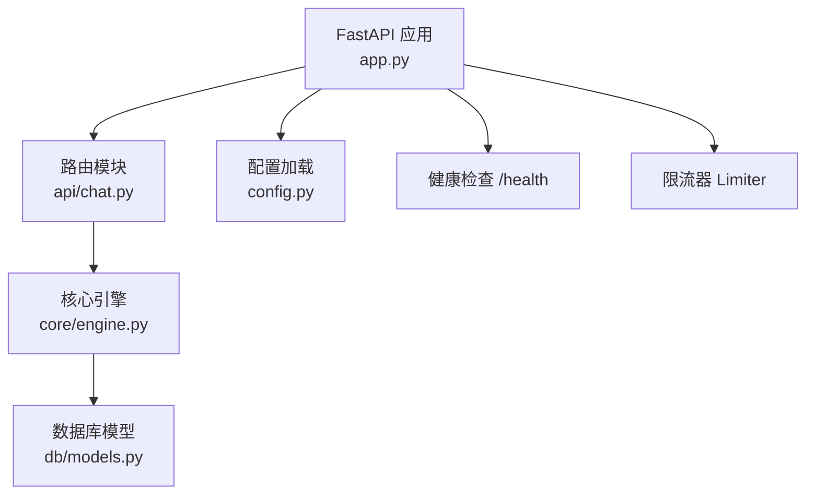
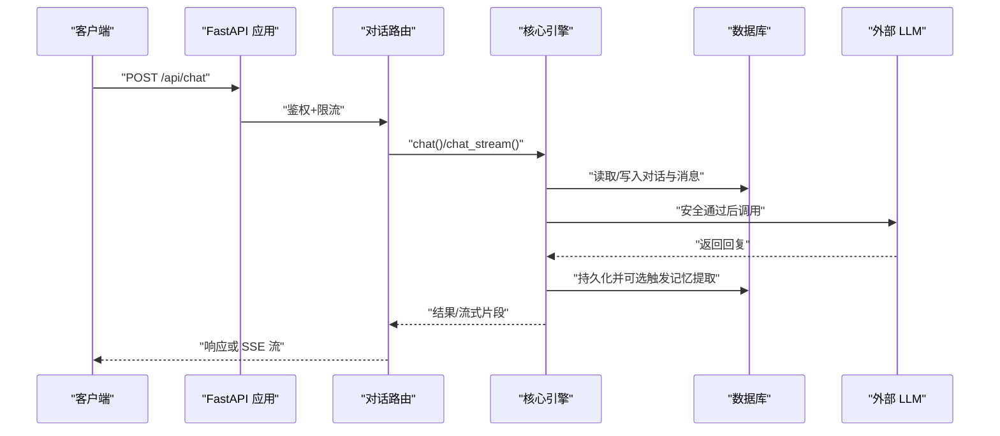
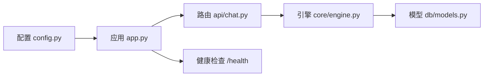

# 监控告警

<cite>
**本文引用的文件**
- [hushai/meditation/app.py](file://hushai/meditation/app.py)
- [hushai/meditation/config.py](file://hushai/meditation/config.py)
- [hushai/meditation/api/chat.py](file://hushai/meditation/api/chat.py)
- [hushai/meditation/core/engine.py](file://hushai/meditation/core/engine.py)
- [hushai/meditation/db/models.py](file://hushai/meditation/db/models.py)
- [docker-compose.yml](file://docker-compose.yml)
- [tests/test_llm_errors.py](file://tests/test_llm_errors.py)
</cite>

## 目录
1. [简介](#简介)
2. [项目结构](#项目结构)
3. [核心组件](#核心组件)
4. [架构总览](#架构总览)
5. [详细组件分析](#详细组件分析)
6. [依赖关系分析](#依赖关系分析)
7. [性能考虑](#性能考虑)
8. [故障排查指南](#故障排查指南)
9. [结论](#结论)
10. [附录](#附录)

## 简介
本文件为 hush.ai 的“监控告警”完整方案文档，覆盖以下目标：
- 应用性能监控（APM）搭建：关键指标采集、性能瓶颈分析、响应时间监控
- 业务指标监控：用户活跃度、对话质量、知识库使用率等 KPI
- 异常告警通知：错误率监控、资源使用告警、业务异常检测与告警规则配置
- 监控系统集成：Prometheus + Grafana、ELK Stack、云监控服务
- 告警策略与通知渠道设置

本方案基于现有代码结构进行设计，确保可落地、可演进。

## 项目结构
从应用入口到核心引擎的关键路径如下：
- FastAPI 应用创建与生命周期管理
- 路由注册与限流中间件
- 会话编排引擎（对话、记忆提取、知识检索）
- 数据库模型（对话、消息、冥想会话、进度统计等）

图表来源
- [hushai/meditation/app.py:136-207](file://hushai/meditation/app.py#L136-L207)
- [hushai/meditation/api/chat.py:58-127](file://hushai/meditation/api/chat.py#L58-L127)
- [hushai/meditation/core/engine.py:166-314](file://hushai/meditation/core/engine.py#L166-L314)
- [hushai/meditation/db/models.py:69-96](file://hushai/meditation/db/models.py#L69-L96)

章节来源
- [hushai/meditation/app.py:1-228](file://hushai/meditation/app.py#L1-L228)
- [hushai/meditation/config.py:1-136](file://hushai/meditation/config.py#L1-L136)
- [hushai/meditation/api/chat.py:1-245](file://hushai/meditation/api/chat.py#L1-L245)
- [hushai/meditation/core/engine.py:1-387](file://hushai/meditation/core/engine.py#L1-L387)
- [hushai/meditation/db/models.py:1-434](file://hushai/meditation/db/models.py#L1-L434)

## 核心组件
- 应用入口与生命周期
  - 启动时初始化日志级别、数据库连接、默认管理员与导师数据
  - 挂载 CORS、限流、静态资源与健康检查端点
- 对话 API
  - 非流式与流式聊天接口，支持场景、技能、导师选择
  - 会话列表与消息历史查询
- 核心引擎
  - 上下文构建（记忆、知识、技能、场景、导师提示）
  - 安全检查、LLM 调用、持久化、记忆提取与标题生成
- 数据库模型
  - 用户、对话、消息、记忆、冥想会话、每日进度、咨询师与预约等

章节来源
- [hushai/meditation/app.py:24-133](file://hushai/meditation/app.py#L24-L133)
- [hushai/meditation/api/chat.py:58-127](file://hushai/meditation/api/chat.py#L58-L127)
- [hushai/meditation/core/engine.py:91-154](file://hushai/meditation/core/engine.py#L91-L154)
- [hushai/meditation/db/models.py:69-96](file://hushai/meditation/db/models.py#L69-L96)

## 架构总览
下图展示请求在应用中的流转与关键监控埋点位置。

图表来源
- [hushai/meditation/api/chat.py:58-127](file://hushai/meditation/api/chat.py#L58-L127)
- [hushai/meditation/core/engine.py:166-314](file://hushai/meditation/core/engine.py#L166-L314)
- [hushai/meditation/db/models.py:69-96](file://hushai/meditation/db/models.py#L69-L96)

## 详细组件分析

### 应用层监控（APM）
- 健康检查
  - 提供 /health 端点用于存活探针与基础可用性探测
- 限流与错误处理
  - 全局限流器按 IP 计数，超限返回标准错误；可作为错误率监控源
- 日志
  - 启动时根据配置设置日志级别与格式，便于接入集中式日志系统

建议采集指标
- HTTP 指标：请求数、成功率、P50/P95/P99 延迟、错误码分布
- 限流指标：被拒绝请求数、峰值 QPS
- 进程指标：CPU、内存、GC、线程/协程数、FD 打开数

章节来源
- [hushai/meditation/app.py:136-207](file://hushai/meditation/app.py#L136-L207)
- [hushai/meditation/app.py:203-206](file://hushai/meditation/app.py#L203-L206)

### 对话链路监控（APM）
- 关键步骤计时
  - 上下文构建、LLM 调用、数据库读写、记忆提取
- 流式与非流式差异
  - 首字节时间（TTFB）、端到端耗时、中断率
- 失败重试与回滚
  - 记录事务回滚次数、异常类型分布

建议采集指标
- 各阶段耗时分位值
- 外部 LLM 调用成功率与超时率
- 数据库慢查询数量与锁等待

章节来源
- [hushai/meditation/core/engine.py:166-314](file://hushai/meditation/core/engine.py#L166-L314)

### 业务指标监控（KPI）
- 用户活跃度
  - DAU/WAU/MAU：基于 users 表活跃用户去重统计
  - 会话活跃度：conversations 新增量、messages 增量
- 对话质量
  - 平均会话长度（messages 条数）
  - 安全拦截率：engine 中安全检查命中比例
  - 记忆提取命中率：每 N 轮触发且成功存储的比例
- 知识库使用率
  - knowledge_qa 调用次数、top_k 命中分数分布、无结果占比
- 冥想与咨询业务
  - meditation_sessions 时长分布、mood_before/after 变化
  - daily_progress 连续打卡天数、今日会话/时长
  - 咨询师在线率、预约状态分布

建议采集指标
- 日/周/月趋势图
- 分桶维度：用户群、场景、导师、技能、地区（如有）

章节来源
- [hushai/meditation/db/models.py:69-96](file://hushai/meditation/db/models.py#L69-L96)
- [hushai/meditation/db/models.py:204-243](file://hushai/meditation/db/models.py#L204-L243)
- [hushai/meditation/core/engine.py:130-154](file://hushai/meditation/core/engine.py#L130-L154)
- [hushai/meditation/core/engine.py:316-387](file://hushai/meditation/core/engine.py#L316-L387)

### 异常告警与通知机制
- 错误率监控
  - 基于 HTTP 5xx 与业务异常（如 RuntimeError）比率
- 资源使用告警
  - CPU、内存、磁盘 I/O、网络带宽、连接池使用率
- 业务异常检测
  - 安全检查命中突增、LLM 超时/限频、数据库连接失败、向量库不可用
- 告警规则示例
  - 5xx 错误率 > 阈值（如 1%）持续 5 分钟
  - P95 响应时间 > 阈值（如 2s）持续 10 分钟
  - 限流拒绝率 > 阈值（如 5%）持续 5 分钟
  - 外部 LLM 超时/限频错误占比 > 阈值
  - 数据库慢查询 > 阈值
  - 安全检查命中突增（环比/同比）
- 通知渠道
  - 邮件、企业微信/钉钉机器人、短信、电话、Slack/飞书

章节来源
- [hushai/meditation/api/chat.py:58-127](file://hushai/meditation/api/chat.py#L58-L127)
- [hushai/meditation/core/engine.py:166-314](file://hushai/meditation/core/engine.py#L166-L314)

### 监控系统集成方案

#### Prometheus + Grafana
- 指标暴露
  - 在应用内通过中间件或 SDK 收集 HTTP、业务与自定义指标，暴露 /metrics
- 抓取与可视化
  - Prometheus 定时抓取，Grafana 配置仪表盘
- 告警
  - 使用 Alertmanager 或 Grafana 告警规则，对接通知渠道

章节来源
- [hushai/meditation/app.py:136-207](file://hushai/meditation/app.py#L136-L207)

#### ELK Stack（Elasticsearch + Logstash/Fluent Bit + Kibana）
- 日志采集
  - 将应用日志输出至 stdout/stderr，由容器平台或 sidecar 收集
- 索引与查询
  - 按服务名、环境、trace_id 分索引，建立关键字段映射
- 可视化与告警
  - Kibana 仪表盘与 Watcher/Alerting 规则

章节来源
- [hushai/meditation/app.py:24-33](file://hushai/meditation/app.py#L24-L33)

#### 云监控服务（以通用方式说明）
- 主机与容器监控
  - 接入云厂商 Agent，采集系统与应用进程指标
- 日志服务
  - 直接投递日志到云日志服务，建立检索与分析任务
- 应用监控
  - 使用云 APM 自动注入或手动埋点，追踪分布式调用链

[本节为概念性说明，不直接分析具体文件]

## 依赖关系分析
- 应用入口依赖配置与数据库初始化
- 路由依赖认证、限流与引擎
- 引擎依赖配置、数据库、外部 LLM 与向量库
- 模型定义支撑所有数据访问

图表来源
- [hushai/meditation/config.py:118-136](file://hushai/meditation/config.py#L118-L136)
- [hushai/meditation/app.py:136-207](file://hushai/meditation/app.py#L136-L207)
- [hushai/meditation/api/chat.py:58-127](file://hushai/meditation/api/chat.py#L58-L127)
- [hushai/meditation/core/engine.py:166-314](file://hushai/meditation/core/engine.py#L166-L314)
- [hushai/meditation/db/models.py:69-96](file://hushai/meditation/db/models.py#L69-L96)

章节来源
- [hushai/meditation/app.py:136-207](file://hushai/meditation/app.py#L136-L207)
- [hushai/meditation/config.py:118-136](file://hushai/meditation/config.py#L118-L136)
- [hushai/meditation/api/chat.py:58-127](file://hushai/meditation/api/chat.py#L58-L127)
- [hushai/meditation/core/engine.py:166-314](file://hushai/meditation/core/engine.py#L166-L314)
- [hushai/meditation/db/models.py:69-96](file://hushai/meditation/db/models.py#L69-L96)

## 性能考虑
- 对话链路优化
  - 控制历史消息上限，避免过长上下文导致 LLM 延迟上升
  - 记忆提取间隔与批量写入，降低频繁 IO
- 外部依赖容错
  - LLM 调用增加超时与重试退避，区分可重试与不可重试错误
- 数据库与向量库
  - 合理分页与索引，避免全表扫描
  - 向量检索 top_k 与相似度阈值调优
- 限流与降级
  - 对热点接口实施更严格的限流
  - 当外部依赖不可用时，返回友好降级响应

章节来源
- [hushai/meditation/core/engine.py:59-76](file://hushai/meditation/core/engine.py#L59-L76)
- [hushai/meditation/core/engine.py:130-154](file://hushai/meditation/core/engine.py#L130-L154)
- [hushai/meditation/api/chat.py:58-127](file://hushai/meditation/api/chat.py#L58-L127)

## 故障排查指南
- 快速定位
  - 查看 /health 是否返回正常
  - 检查限流错误与 5xx 错误分布
  - 核对外部 LLM 错误类型与文案映射
- 常见错误
  - 超时、连接失败、鉴权失败、权限不足、速率限制
- 日志与审计
  - 启用结构化日志，关联 trace_id
  - 审计日志用于管理员操作回溯

章节来源
- [hushai/meditation/app.py:203-206](file://hushai/meditation/app.py#L203-L206)
- [tests/test_llm_errors.py:26-58](file://tests/test_llm_errors.py#L26-L58)

## 结论
通过在应用入口、路由与核心引擎层引入标准化指标采集与日志规范，结合 Prometheus/Grafana、ELK 与云监控，可实现从基础设施到业务指标的端到端可观测性。配合合理的告警策略与多渠道通知，能够显著提升问题发现与恢复效率。

## 附录

### 关键指标清单（建议）
- 应用层
  - HTTP 请求总数、成功率、错误码分布、P50/P95/P99 延迟
  - 限流拒绝数与拒绝率
- 引擎层
  - 上下文构建耗时、LLM 调用耗时、数据库读写耗时、记忆提取耗时
  - 安全检查命中次数与比例
- 业务层
  - 活跃用户数、会话数、消息数、冥想时长、mood 变化
  - 知识库问答次数、top_k 命中分数、无结果占比
  - 咨询师在线率、预约状态分布

### 告警规则模板（示例）
- 错误率：5xx 占比 > 1% 持续 5 分钟
- 延迟：P95 > 2s 持续 10 分钟
- 限流：拒绝率 > 5% 持续 5 分钟
- 外部依赖：LLM 超时/限频错误占比 > 3% 持续 5 分钟
- 数据库：慢查询 > 阈值 持续 10 分钟
- 业务：安全检查命中突增（环比 > 2x）持续 10 分钟

### 通知渠道配置要点
- 企业微信/钉钉：Webhook URL、@人员、消息模板
- 邮件：SMTP 服务器、发件人、收件人组
- 短信/电话：服务商账号、签名与模板审核
- Slack/飞书：频道与机器人令牌

[本节为通用指导，不直接分析具体文件]