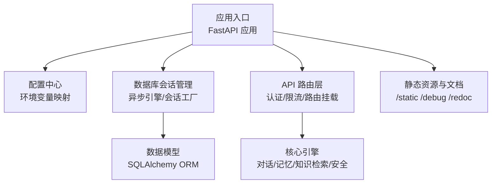
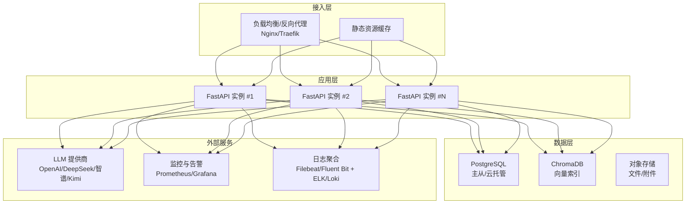
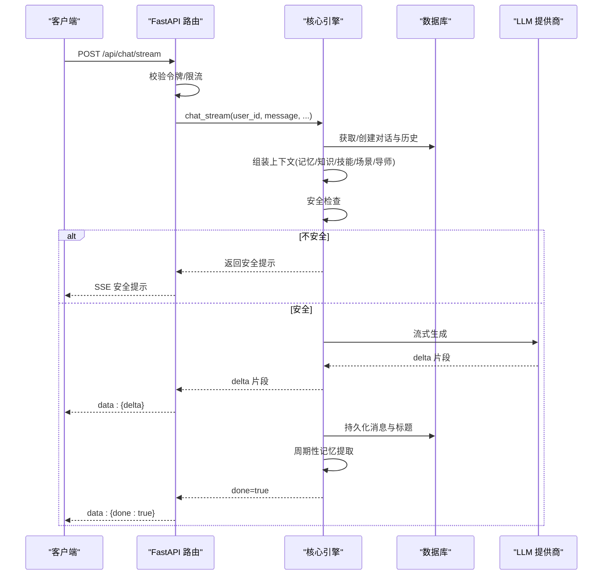
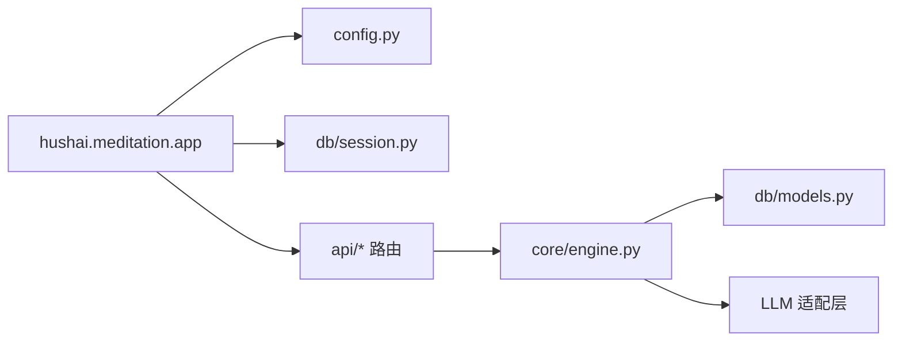

# 部署与运维

<cite>
**本文引用的文件**   
- [README.md](file://README.md)
- [docker-compose.yml](file://docker-compose.yml)
- [pyproject.toml](file://pyproject.toml)
- [hushai/meditation/config.py](file://hushai/meditation/config.py)
- [hushai/meditation/app.py](file://hushai/meditation/app.py)
- [scripts/start_server.sh](file://scripts/start_server.sh)
- [hushai/meditation/db/session.py](file://hushai/meditation/db/session.py)
- [hushai/meditation/db/models.py](file://hushai/meditation/db/models.py)
- [hushai/meditation/core/engine.py](file://hushai/meditation/core/engine.py)
- [hushai/meditation/api/chat.py](file://hushai/meditation/api/chat.py)
</cite>

## 目录
1. [简介](#简介)
2. [项目结构](#项目结构)
3. [核心组件](#核心组件)
4. [架构总览](#架构总览)
5. [详细组件分析](#详细组件分析)
6. [依赖关系分析](#依赖关系分析)
7. [性能考虑](#性能考虑)
8. [故障排查指南](#故障排查指南)
9. [结论](#结论)
10. [附录](#附录)

## 简介
本文件面向生产环境，提供 hush.ai 的完整部署与运维手册。内容覆盖容器化部署、负载均衡与高可用、监控告警、日志体系、备份恢复与灾难恢复、以及常见故障排查方法，帮助运维工程师快速搭建并稳定运行服务。

## 项目结构
仓库采用模块化组织：应用入口、配置、数据库会话与模型、核心引擎、API 路由等分层清晰；同时提供 Docker Compose 编排脚本与启动脚本，便于本地与生产环境一致化部署。



图示来源
- [hushai/meditation/app.py:136-207](file://hushai/meditation/app.py#L136-L207)
- [hushai/meditation/config.py:18-115](file://hushai/meditation/config.py#L18-L115)
- [hushai/meditation/db/session.py:34-54](file://hushai/meditation/db/session.py#L34-L54)
- [hushai/meditation/db/models.py:25-66](file://hushai/meditation/db/models.py#L25-L66)
- [hushai/meditation/api/chat.py:1-28](file://hushai/meditation/api/chat.py#L1-L28)

章节来源
- [README.md:136-178](file://README.md#L136-L178)
- [pyproject.toml:51-74](file://pyproject.toml#L51-L74)

## 核心组件
- 应用入口与生命周期
  - FastAPI 应用创建、中间件（CORS）、限流器、健康检查端点、静态资源挂载、OpenAPI/Redoc 文档暴露。
  - 启动时初始化数据库、默认管理员、默认导师与预约配置。
- 配置系统
  - 基于 .env 与环境变量加载，统一映射到不可变配置对象，支持多 LLM 提供商、嵌入模型、JWT、端口与调试开关等。
- 数据库与会话
  - 自动选择 SQLite 或 PostgreSQL（asyncpg），连接池大小按后端类型调整，提供会话工厂与生命周期管理。
- 数据模型
  - 用户、对话、消息、记忆、技能、知识库片段、场景、管理员、审计日志、冥想会话、每日进度、咨询师、排班、预约、订单与服务记录等。
- 核心引擎
  - 对话编排：上下文构建（历史、记忆、知识、技能、场景、导师提示词）、安全检查、LLM 调用（同步/流式）、持久化与标题生成、周期性记忆提取。
- API 路由
  - 认证鉴权、限流、SSE 流式响应、对话列表与消息分页、场景列表等。

章节来源
- [hushai/meditation/app.py:24-133](file://hushai/meditation/app.py#L24-L133)
- [hushai/meditation/app.py:136-207](file://hushai/meditation/app.py#L136-L207)
- [hushai/meditation/config.py:18-115](file://hushai/meditation/config.py#L18-L115)
- [hushai/meditation/db/session.py:15-54](file://hushai/meditation/db/session.py#L15-L54)
- [hushai/meditation/db/models.py:37-266](file://hushai/meditation/db/models.py#L37-L266)
- [hushai/meditation/core/engine.py:91-127](file://hushai/meditation/core/engine.py#L91-L127)
- [hushai/meditation/api/chat.py:58-104](file://hushai/meditation/api/chat.py#L58-L104)

## 架构总览
生产环境推荐架构包含反向代理、应用实例、数据库与向量库、外部 LLM 服务。下图展示关键组件与数据流向。



图示来源
- [docker-compose.yml:1-31](file://docker-compose.yml#L1-L31)
- [hushai/meditation/app.py:136-207](file://hushai/meditation/app.py#L136-L207)
- [hushai/meditation/db/session.py:15-54](file://hushai/meditation/db/session.py#L15-L54)

## 详细组件分析

### 容器化与编排
- 使用 Docker Compose 定义 PostgreSQL 与 ChromaDB 服务，提供健康检查与数据卷持久化。
- 应用侧通过环境变量注入数据库 URL、JWT 密钥、LLM 凭据等，避免硬编码。
- 生产建议：
  - 将数据库迁移至云托管或自建高可用集群，启用只读副本与自动备份。
  - 为 ChromaDB 使用独立持久卷或托管向量库，确保索引可恢复。
  - 使用进程管理器（systemd/supervisor）或容器编排平台（Kubernetes）管理应用实例。

章节来源
- [docker-compose.yml:1-31](file://docker-compose.yml#L1-L31)
- [hushai/meditation/config.py:63-115](file://hushai/meditation/config.py#L63-L115)

### 负载均衡与高可用
- 在反向代理层对多个 FastAPI 实例进行轮询或加权调度，结合健康检查实现故障转移。
- 应用内限流：基于客户端 IP 的速率限制，防止滥用与雪崩。
- 无状态设计：会话与状态落库，实例可水平扩展。
- 建议：
  - 开启多副本部署，配合滚动更新与就绪探针。
  - 对外暴露 /health 作为存活探针，/debug 仅在内网或鉴权后访问。

章节来源
- [hushai/meditation/app.py:146-155](file://hushai/meditation/app.py#L146-L155)
- [hushai/meditation/app.py:203-206](file://hushai/meditation/app.py#L203-L206)
- [hushai/meditation/api/chat.py:58-86](file://hushai/meditation/api/chat.py#L58-L86)

### 监控与告警
- 指标采集：
  - 应用指标：请求量、延迟、错误率、队列长度、数据库连接池使用率。
  - 基础设施指标：CPU、内存、磁盘、网络、Pod/容器状态。
- 可视化与告警：
  - Prometheus + Grafana 展示面板与阈值告警。
  - 针对关键业务（登录失败率、对话失败率、LLM 超时）设置告警规则。
- 建议：
  - 在应用启动时输出结构化日志，便于日志聚合与检索。
  - 对慢查询与异常堆栈进行采样上报。

章节来源
- [hushai/meditation/app.py:27-33](file://hushai/meditation/app.py#L27-L33)

### 日志体系
- 应用日志：
  - 基于 Python logging，格式包含时间、级别、模块与消息，支持 DEBUG/INFO 切换。
  - 启动阶段记录数据库初始化、默认管理员与导师创建等信息。
- 结构化日志：
  - 建议在关键路径输出 JSON 字段（如 user_id、conversation_id、provider、latency）。
- 日志收集与分析：
  - 使用 Filebeat/Fluent Bit 采集 stdout 或文件，转发至 ELK/Loki。
  - 建立索引策略与保留周期，结合告警规则定位问题。

章节来源
- [hushai/meditation/app.py:27-33](file://hushai/meditation/app.py#L27-L33)
- [hushai/meditation/app.py:31-40](file://hushai/meditation/app.py#L31-L40)

### 备份与恢复
- 数据库备份：
  - PostgreSQL：定期逻辑备份（pg_dump）或物理备份（WAL 归档+基础备份），跨地域复制。
  - 恢复演练：定期验证备份可用性，制定 RPO/RTO 目标。
- 向量索引备份：
  - ChromaDB 数据卷快照或导出，确保索引一致性。
- 文件与静态资源：
  - 对象存储版本化与跨区域复制，防止单点故障。
- 灾难恢复：
  - 明确回滚策略与灰度发布流程，准备回退清单与操作手册。

章节来源
- [docker-compose.yml:12-17](file://docker-compose.yml#L12-L17)
- [docker-compose.yml:23-26](file://docker-compose.yml#L23-L26)

### 安全加固
- 最小权限原则：数据库账号、对象存储桶权限按需授予。
- 密钥管理：使用密钥管理服务（KMS/Secrets Manager）注入 JWT、LLM 密钥、支付证书等。
- 传输加密：全站 HTTPS，内部服务间 mTLS。
- 访问控制：/debug 与 /admin 仅对内网开放，结合 WAF 与白名单。

章节来源
- [hushai/meditation/config.py:63-115](file://hushai/meditation/config.py#L63-L115)
- [hushai/meditation/app.py:148-155](file://hushai/meditation/app.py#L148-L155)

### 启动与运行
- 开发模式：
  - 使用启动脚本自动设置环境变量，支持 SQLite 或 PostgreSQL 切换。
- 生产模式：
  - 通过容器编排平台拉起应用，注入环境变量与健康检查。
  - 使用 uvicorn 工厂模式启动，支持热重载关闭。

章节来源
- [scripts/start_server.sh:1-31](file://scripts/start_server.sh#L1-L31)
- [hushai/meditation/app.py:217-228](file://hushai/meditation/app.py#L217-L228)

### 数据模型概览
```mermaid
erDiagram
USER {
string id PK
string wx_openid UK
string nickname
datetime created_at
datetime updated_at
boolean is_active
}
CONVERSATION {
string id PK
string user_id FK
string title
datetime created_at
datetime updated_at
boolean is_active
}
MESSAGE {
string id PK
string conversation_id FK
string role
text content
datetime created_at
}
MEMORY {
string id PK
string user_id FK
string category
text content
float importance
datetime created_at
datetime updated_at
}
SKILL {
string id PK
string name
text content
boolean is_active
int sort_order
}
KNOWLEDGE_CHUNK {
string id PK
string parent_id FK
text content
json tags
int chunk_index
}
SCENE {
string id PK
string slug UK
text system_prompt
boolean is_active
int sort_order
}
ADMIN_USER {
string id PK
string username UK
string password_hash
boolean is_active
}
AUDIT_LOG {
string id PK
string admin_username
string action
string resource_type
string resource_id
text detail
datetime created_at
}
MEDITATION_SESSION {
string id PK
string user_id FK
string conversation_id FK
int duration_seconds
int mood_before
int mood_after
datetime started_at
datetime ended_at
}
DAILY_PROGRESS {
string id PK
string user_id FK
datetime date
int meditation_count
int total_duration_seconds
float mood_avg
int streak_day
}
TEACHER {
string id PK
string slug UK
text system_prompt
string voice_gender
string style_tags
boolean is_active
int sort_order
}
COUNSELOR {
string id PK
string user_id FK
string real_name
string status
float hourly_rate
float rating
boolean is_online
}
COUNSELOR_SCHEDULE {
string id PK
string counselor_id FK
date schedule_date
time start_time
time end_time
int slot_duration_minutes
boolean is_available
}
APPOINTMENT {
string id PK
string counselor_id FK
string user_id FK
date appointment_date
time start_time
time end_time
string status
}
CONSULTATION_ORDER {
string id PK
string appointment_id FK
string counselor_id FK
string user_id FK
float amount
string status
datetime paid_at
}
SERVICE_RECORD {
string id PK
string order_id FK
string appointment_id FK
string counselor_id FK
string user_id FK
text summary_encrypted
text counselor_notes_encrypted
string status
}
APPOINTMENT_SETTINGS {
string id PK
string counselor_id FK UK
int max_booking_count
int min_advance_hours
int slot_duration_minutes
boolean info_collection_enabled
boolean is_open
}
USER ||--o{ CONVERSATION : "拥有"
CONVERSATION ||--o{ MESSAGE : "包含"
USER ||--o{ MEMORY : "拥有"
USER ||--o{ MEDITATION_SESSION : "参与"
USER ||--o{ DAILY_PROGRESS : "统计"
USER ||--o{ COUNSELOR : "注册为"
COUNSELOR ||--o{ COUNSELOR_SCHEDULE : "排班"
COUNSELOR ||--o{ APPOINTMENT : "接待"
APPOINTMENT ||--o| CONSULTATION_ORDER : "下单"
CONSULTATION_ORDER ||--o| SERVICE_RECORD : "服务"
APPOINTMENT ||--o| SERVICE_RECORD : "记录"
```

图示来源
- [hushai/meditation/db/models.py:37-434](file://hushai/meditation/db/models.py#L37-L434)

### 对话处理时序（含安全检查与流式输出）


图示来源
- [hushai/meditation/api/chat.py:80-104](file://hushai/meditation/api/chat.py#L80-L104)
- [hushai/meditation/core/engine.py:238-314](file://hushai/meditation/core/engine.py#L238-L314)

### 配置项与环境变量
- 关键配置项（节选）
  - 数据库：MEDITATION_POSTGRES_URL（留空则使用 SQLite）
  - 向量库：MEDITATION_CHROMA_DIR
  - 认证：MEDITATION_JWT_SECRET、MEDITATION_JWT_ALGORITHM、MEDITATION_JWT_EXPIRE_MINUTES
  - LLM：MEDITATION_DEFAULT_LLM_PROVIDER/MODEL、各厂商 API_KEY/BASE_URL/MODEL
  - 嵌入：MEDITATION_EMBEDDING_PROVIDER/MODEL/API_KEY/BASE_URL
  - 运行时：MEDITATION_HOST、MEDITATION_PORT、MEDITATION_DEBUG、MEDITATION_CORS_ORIGINS
  - 微信支付：MEDITATION_WX_MCH_ID、MEDITATION_WX_PAY_API_KEY、MEDITATION_WX_PAY_CERT_PATH、MEDITATION_WX_PAY_SERIAL_NO、MEDITATION_WX_PAY_NOTIFY_URL
  - 加密：MEDITATION_ENCRYPTION_KEY
- 说明
  - 所有键均以 MEDITATION_ 前缀命名，由配置模块统一解析为强类型对象。
  - 生产环境务必使用强随机密钥与受管密钥服务。

章节来源
- [hushai/meditation/config.py:63-115](file://hushai/meditation/config.py#L63-L115)

### 数据库连接与池化
- 自动适配
  - 未设置数据库 URL 时使用 SQLite（aiosqlite），否则转换为 asyncpg 驱动。
- 连接池
  - SQLite 使用较小池，PostgreSQL 使用较大池，可通过配置调整。
- 生命周期
  - 应用启动时创建表结构，关闭时释放引擎与会话工厂。

章节来源
- [hushai/meditation/db/session.py:15-54](file://hushai/meditation/db/session.py#L15-L54)
- [hushai/meditation/app.py:24-33](file://hushai/meditation/app.py#L24-L33)

### API 与限流
- 认证
  - 通过 Authorization 头携带 Bearer Token，解析出 user_id。
- 限流
  - 基于客户端 IP 的每分钟请求数限制，防止滥用。
- 流式接口
  - 使用 SSE 推送增量文本，前端实时渲染。

章节来源
- [hushai/meditation/api/chat.py:47-56](file://hushai/meditation/api/chat.py#L47-L56)
- [hushai/meditation/api/chat.py:58-86](file://hushai/meditation/api/chat.py#L58-L86)
- [hushai/meditation/api/chat.py:80-104](file://hushai/meditation/api/chat.py#L80-L104)

## 依赖关系分析
- 应用依赖
  - FastAPI、Uvicorn、SQLAlchemy(async)、asyncpg、Pydantic、Jinja2、python-multipart、slowapi、pandas/openpyxl 等。
- 可选功能
  - 开发工具链：pytest、ruff、mypy、pre-commit、pip-audit、bandit。
- 入口命令
  - CLI 与 Web 服务入口分别定义，便于在不同环境选择运行方式。



图示来源
- [pyproject.toml:51-74](file://pyproject.toml#L51-L74)
- [hushai/meditation/app.py:136-207](file://hushai/meditation/app.py#L136-L207)
- [hushai/meditation/core/engine.py:1-31](file://hushai/meditation/core/engine.py#L1-L31)

章节来源
- [pyproject.toml:51-74](file://pyproject.toml#L51-L74)

## 性能考虑
- 并发与 I/O
  - 使用异步框架与异步数据库驱动，提升吞吐。
- 连接池
  - 根据负载调优 pool_size，避免连接耗尽。
- 上下文裁剪
  - 限制历史消息数量与 token 上限，降低 LLM 成本与延迟。
- 缓存与索引
  - 对热点数据（场景、导师、技能）做缓存；数据库与向量库建立合适索引。
- 降级与熔断
  - 多 LLM 提供商自动降级，失败快速返回或重试。

[本节为通用指导，不直接分析具体文件]

## 故障排查指南
- 启动失败
  - 检查环境变量是否齐全（JWT、数据库 URL、LLM 密钥）。
  - 查看启动日志中数据库初始化与默认数据创建信息。
- 无法连接数据库
  - 确认数据库地址、用户名密码、网络可达性；SQLite 需确保写入权限。
- 401 未授权
  - 检查 Authorization 头格式与 Token 有效性。
- 限流触发
  - 观察 /api/chat 相关端点的限流计数，必要时放宽或优化客户端重试策略。
- 流式中断
  - 检查网络稳定性与代理超时设置；确认服务端 SSE 正常发送。
- 向量检索异常
  - 检查 ChromaDB 服务状态与数据卷挂载；必要时重建索引。
- 健康检查
  - 访问 /health 确认服务存活；/debug 仅用于内网调试。

章节来源
- [hushai/meditation/app.py:27-40](file://hushai/meditation/app.py#L27-L40)
- [hushai/meditation/app.py:203-206](file://hushai/meditation/app.py#L203-L206)
- [hushai/meditation/api/chat.py:47-56](file://hushai/meditation/api/chat.py#L47-L56)
- [hushai/meditation/api/chat.py:58-86](file://hushai/meditation/api/chat.py#L58-L86)

## 结论
通过容器化编排、反向代理与多实例部署，结合完善的监控、日志与备份策略，hush.ai 可在生产环境获得高可用与可观测性。遵循本文的配置与安全建议，可有效降低风险并提升运维效率。

## 附录
- 快速启动参考
  - 开发模式：使用启动脚本一键启动，支持 SQLite/PostgreSQL 切换。
  - 生产模式：使用容器编排平台拉起应用，注入环境变量与健康检查。
- 文档与 API
  - OpenAPI 文档：/debug
  - Redoc 文档：/redoc
  - 前台静态资源：/static
  - 管理后台静态资源：/admin/static

章节来源
- [scripts/start_server.sh:1-31](file://scripts/start_server.sh#L1-L31)
- [hushai/meditation/app.py:182-206](file://hushai/meditation/app.py#L182-L206)
- [README.md:269-274](file://README.md#L269-L274)