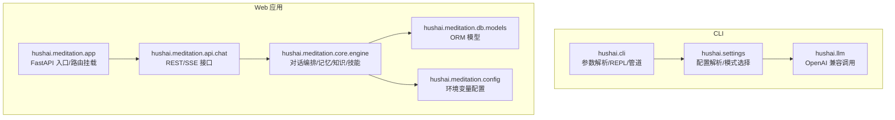
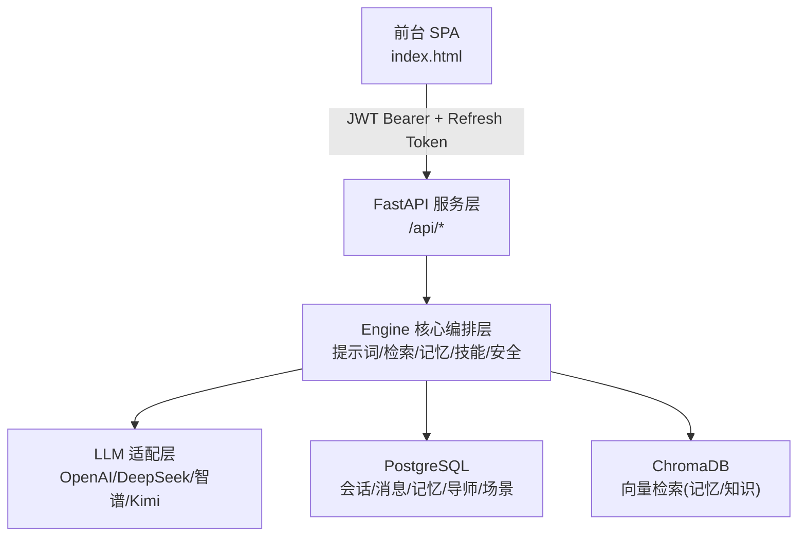
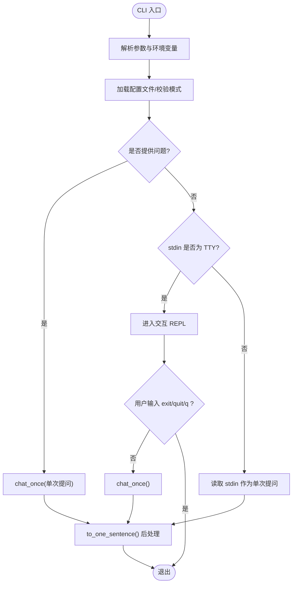
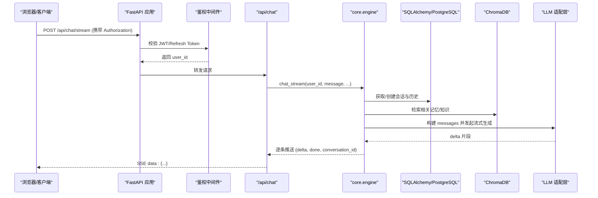
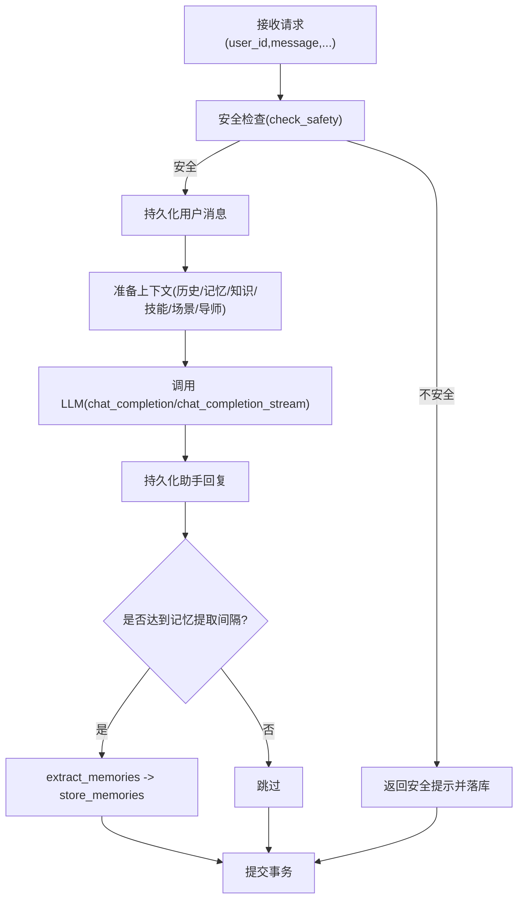
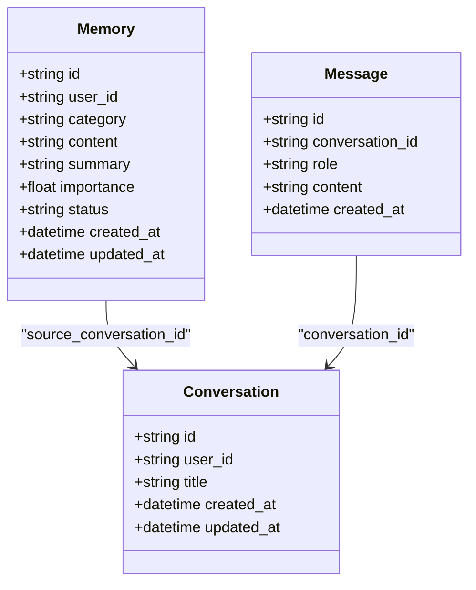
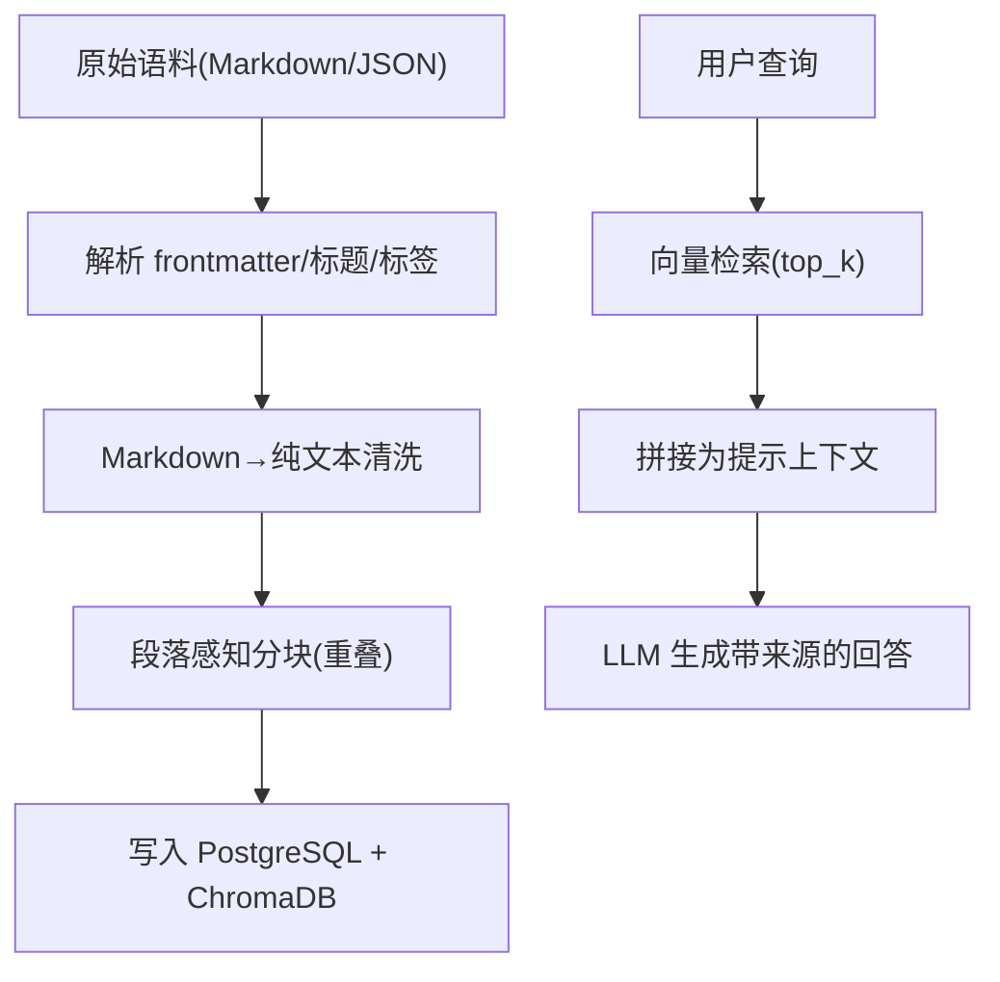
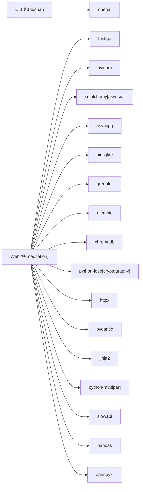

# 项目概述

<cite>
**本文引用的文件**   
- [README.md](file://README.md)
- [pyproject.toml](file://pyproject.toml)
- [hushai/__init__.py](file://hushai/__init__.py)
- [hushai/cli.py](file://hushai/cli.py)
- [hushai/settings.py](file://hushai/settings.py)
- [hushai/llm.py](file://hushai/llm.py)
- [docs/architecture.md](file://docs/architecture.md)
- [docs/cli.md](file://docs/cli.md)
- [hushai/meditation/app.py](file://hushai/meditation/app.py)
- [hushai/meditation/config.py](file://hushai/meditation/config.py)
- [hushai/meditation/core/engine.py](file://hushai/meditation/core/engine.py)
- [hushai/meditation/api/chat.py](file://hushai/meditation/api/chat.py)
- [hushai/meditation/db/models.py](file://hushai/meditation/db/models.py)
- [hushai/meditation/core/memory.py](file://hushai/meditation/core/memory.py)
- [hushai/meditation/core/knowledge.py](file://hushai/meditation/core/knowledge.py)
</cite>

## 目录
1. [引言](#引言)
2. [项目结构](#项目结构)
3. [核心组件](#核心组件)
4. [架构总览](#架构总览)
5. [详细组件分析](#详细组件分析)
6. [依赖分析](#依赖分析)
7. [性能考量](#性能考量)
8. [故障排查指南](#故障排查指南)
9. [结论](#结论)
10. [附录](#附录)

## 引言
hush.ai 冥想陪伴系统面向现代生活压力，提供“把噪音静下来。把答案收成一句话。”的极简体验与具备长期记忆、专业知识储备的 AI 冥想陪伴服务。产品以 CLI 工具与 Web 应用双重形态覆盖不同使用场景：CLI 适合快速提问与脚本化集成；Web 应用提供多角色导师、呼吸练习、冥想追踪、语音交互、RAG 知识增强与技能插件等完整能力。系统在心理健康领域的创新价值在于将大模型能力与结构化记忆、知识库检索、安全护栏与可解释提示工程结合，形成个性化、可追溯、可运营的冥想陪伴闭环。

## 项目结构
仓库采用“包 + 模块”的组织方式：
- hushai 根包提供 CLI 与基础配置、LLM 适配层
- hushai.meditation 子包承载 Web 应用（FastAPI）、核心引擎、数据库模型、管理后台与静态资源
- docs 存放架构与 CLI 参考文档
- tests 包含单元测试与集成测试
- scripts 提供启动与测试辅助脚本

图示来源
- [hushai/cli.py:1-152](file://hushai/cli.py#L1-L152)
- [hushai/settings.py:1-226](file://hushai/settings.py#L1-L226)
- [hushai/llm.py:1-142](file://hushai/llm.py#L1-L142)
- [hushai/meditation/app.py:1-228](file://hushai/meditation/app.py#L1-L228)
- [hushai/meditation/core/engine.py:1-387](file://hushai/meditation/core/engine.py#L1-L387)
- [hushai/meditation/api/chat.py:1-245](file://hushai/meditation/api/chat.py#L1-L245)
- [hushai/meditation/db/models.py:1-434](file://hushai/meditation/db/models.py#L1-L434)
- [hushai/meditation/config.py:1-136](file://hushai/meditation/config.py#L1-L136)

章节来源
- [README.md:29-178](file://README.md#L29-L178)
- [pyproject.toml:71-75](file://pyproject.toml#L71-L75)

## 核心组件
- CLI 禅意终端
  - 支持多种对话模式（反焦虑/反拖延/激励/基础/反PUA演练），每次仅输出一句话
  - 支持 TTY 交互、管道输入与 JSON 错误输出，便于脚本集成
- Web 冥想陪伴服务
  - FastAPI 服务层，统一鉴权、限流、CORS
  - 核心引擎负责提示词构建、知识检索、记忆提取、技能挂载、导师选择与安全过滤
  - LLM 适配层对接多家提供商并支持自动降级
  - 持久化存储：PostgreSQL（关系数据）+ ChromaDB（向量检索）
- 管理后台
  - 用户运营、内容运营、数据导出、审计日志、系统设置

章节来源
- [README.md:29-98](file://README.md#L29-L98)
- [README.md:100-178](file://README.md#L100-L178)
- [docs/cli.md:1-75](file://docs/cli.md#L1-L75)

## 架构总览
系统分为前台 SPA、FastAPI 服务层、Engine 编排层、LLM 适配层与数据存储层。前台通过 JWT Bearer 与 Refresh Token 认证，SSE 流式返回对话增量。Engine 在每轮对话前进行安全检查、上下文组装（历史、记忆、知识、技能、场景、导师），再调用 LLM 完成回复，并在适当时机触发记忆提取与会话标题补全。

图示来源
- [README.md:100-132](file://README.md#L100-L132)
- [hushai/meditation/app.py:136-207](file://hushai/meditation/app.py#L136-L207)
- [hushai/meditation/core/engine.py:166-314](file://hushai/meditation/core/engine.py#L166-L314)

## 详细组件分析

### CLI 组件（hush CLI）
- 功能要点
  - 参数解析与模式选择（calm/focus/hype/plain/pua）
  - 交互式 REPL、管道一次性问答、JSON 错误输出
  - 客户端“一句话”后处理，确保输出简洁
- 关键流程
  - main() 加载配置 → chat_once() 构造系统提示 → OpenAI 兼容调用 → to_one_sentence() 截断输出
- 错误处理
  - 业务/配置错误抛出 RuntimeError，CLI 捕获并以人类可读文案或 JSON 输出到 stderr

图示来源
- [hushai/cli.py:81-147](file://hushai/cli.py#L81-L147)
- [hushai/llm.py:100-142](file://hushai/llm.py#L100-L142)
- [docs/architecture.md:25-48](file://docs/architecture.md#L25-L48)

章节来源
- [hushai/cli.py:1-152](file://hushai/cli.py#L1-L152)
- [hushai/settings.py:145-171](file://hushai/settings.py#L145-L171)
- [hushai/llm.py:27-78](file://hushai/llm.py#L27-L78)
- [docs/cli.md:1-75](file://docs/cli.md#L1-L75)

### Web 应用与服务层（FastAPI）
- 应用生命周期
  - 初始化日志、数据库连接、默认管理员与默认导师、全局预约配置
- 路由挂载
  - 前端认证、登录、对话、技能、知识、记忆、冥想、导师、咨询与后台管理路由
- 中间件
  - CORS、限流（slowapi）、健康检查与静态资源挂载

图示来源
- [hushai/meditation/app.py:136-207](file://hushai/meditation/app.py#L136-L207)
- [hushai/meditation/api/chat.py:80-104](file://hushai/meditation/api/chat.py#L80-L104)
- [hushai/meditation/core/engine.py:238-314](file://hushai/meditation/core/engine.py#L238-L314)

章节来源
- [hushai/meditation/app.py:1-228](file://hushai/meditation/app.py#L1-L228)
- [hushai/meditation/api/chat.py:1-245](file://hushai/meditation/api/chat.py#L1-L245)

### 核心引擎（Engine）
- 职责
  - 会话与消息持久化、安全检查、上下文组装（历史、记忆、知识、技能、场景、导师）、LLM 调用、记忆提取与标题补全
- 关键流程
  - chat()/chat_stream() 均先执行安全检查，随后准备上下文并调用 LLM，最后异步触发记忆提取与更新
- 安全护栏
  - 内置危机信号检测，不将敏感内容送往外部模型，直接返回安全提示

图示来源
- [hushai/meditation/core/engine.py:166-314](file://hushai/meditation/core/engine.py#L166-L314)

章节来源
- [hushai/meditation/core/engine.py:1-387](file://hushai/meditation/core/engine.py#L1-L387)

### 长期记忆系统（Memory）
- 机制
  - 基于对话内容周期性提取 7 类记忆（冥想经历、情绪模式、个人偏好、目标进展、重要事件、健康备注、生活背景）
  - 向量索引用于语义检索，按重要性排序与归档策略维护记忆质量
- 接口
  - extract_memories/store_memories/retrieve_relevant_memories/get_memory_context_for_prompt/archive_old_memories

图示来源
- [hushai/meditation/db/models.py:85-118](file://hushai/meditation/db/models.py#L85-L118)
- [hushai/meditation/core/memory.py:45-112](file://hushai/meditation/core/memory.py#L45-L112)

章节来源
- [hushai/meditation/core/memory.py:1-206](file://hushai/meditation/core/memory.py#L1-L206)
- [hushai/meditation/db/models.py:85-118](file://hushai/meditation/db/models.py#L85-L118)

### 知识库与 RAG（Knowledge）
- 导入
  - 支持 Markdown 与结构化 JSON，自动解析 frontmatter、转纯文本、段落感知分块与向量化入库
- 检索
  - 根据查询相似度召回 top_k 片段，拼接为提示上下文供 LLM 参考
- 用途
  - 提升回答的专业性与可解释性，支持来源标注

图示来源
- [hushai/meditation/core/knowledge.py:76-171](file://hushai/meditation/core/knowledge.py#L76-L171)
- [hushai/meditation/core/knowledge.py:207-225](file://hushai/meditation/core/knowledge.py#L207-L225)

章节来源
- [hushai/meditation/core/knowledge.py:1-225](file://hushai/meditation/core/knowledge.py#L1-L225)

### 配置与运行环境
- CLI 配置
  - 环境变量优先于 JSON 配置文件；支持模式别名与旧版开关兼容
- Web 配置
  - 从 .env 加载 MeditationConfig，映射大量环境变量（数据库、向量库、LLM 提供商、JWT、限流、CORS、支付与加密等）

章节来源
- [hushai/settings.py:1-226](file://hushai/settings.py#L1-L226)
- [hushai/meditation/config.py:1-136](file://hushai/meditation/config.py#L1-L136)

## 依赖分析
- 运行时依赖
  - CLI：openai
  - Web：fastapi、uvicorn、sqlalchemy[asyncio]、asyncpg、aiosqlite、greenlet、alembic、chromadb、python-jose[cryptography]、httpx、pydantic、jinja2、python-multipart、slowapi、pandas、openpyxl
- 命令行入口
  - hush、hush-meditation、hush-init-knowledge

图示来源
- [pyproject.toml:27-69](file://pyproject.toml#L27-L69)
- [pyproject.toml:71-75](file://pyproject.toml#L71-L75)

章节来源
- [pyproject.toml:1-131](file://pyproject.toml#L1-L131)

## 性能考量
- 流式对话
  - SSE 增量返回降低首字延迟，提升用户体验
- 上下文窗口控制
  - 通过 conversation_max_turns 限制历史长度，避免过长上下文导致响应变慢与成本上升
- 向量检索优化
  - 合理设置 memory_top_k 与 knowledge_top_k，平衡相关性与时延
- 并发与连接池
  - 使用 asyncpg 与 SQLAlchemy 异步会话，配合 uvicorn workers 提升吞吐
- 缓存与降级
  - LLM 适配层支持多提供商与自动降级，保障可用性

[本节为通用指导，无需源码引用]

## 故障排查指南
- CLI 常见问题
  - 未配置 API 密钥：需设置 LLM_APPKEY 或在配置文件中填写 llm_appkey
  - 模式无效：请检查 HUSH_MODE 或配置文件中的 hush_mode，合法值为 calm/focus/hype/plain/pua
  - 网络/超时：检查 OPENAI_BASE_URL、LLM_TIMEOUT、LLM_MAX_RETRIES
- Web 常见问题
  - 鉴权失败：确认 Authorization 头格式与 Token 有效性
  - 限流触发：查看 slowapi 限流策略与客户端重试频率
  - 数据库/向量库不可用：检查 DATABASE_URL、CHROMA_DB_DIR 与对应服务状态
- 安全与合规
  - 若检测到危机信号，系统将返回安全提示而非调用外部模型

章节来源
- [hushai/llm.py:81-97](file://hushai/llm.py#L81-L97)
- [hushai/meditation/core/engine.py:182-196](file://hushai/meditation/core/engine.py#L182-L196)
- [hushai/meditation/api/chat.py:58-77](file://hushai/meditation/api/chat.py#L58-L77)

## 结论
hush.ai 以“一句话”的极简哲学与“长期记忆+专业知识”的深度陪伴为核心，构建了 CLI 与 Web 双形态的产品矩阵。其技术架构强调模块化、可扩展与高可用：Engine 编排层解耦提示工程、记忆与知识检索、安全护栏与多 LLM 适配；数据层以关系型与向量型混合存储支撑个性化与可解释性。未来可在更多冥想流派与专业领域扩展知识与技能生态，持续优化流式体验与隐私保护，推动 AI 在心理健康领域的普惠应用。

[本节为总结性内容，无需源码引用]

## 附录
- 版本与演进
  - v0.2.0 引入冥想搭子、冥想追踪、呼吸练习、流式对话、Token 刷新、批量操作、数据导出、审计日志、安全增强与 LLM 降级
- 快速启动
  - 开发模式：安装依赖、复制 .env、启动服务
  - 生产模式：Docker Compose 部署
- 贡献规范
  - 代码风格、测试覆盖与安全扫描要求

章节来源
- [README.md:330-343](file://README.md#L330-L343)
- [README.md:244-286](file://README.md#L244-L286)
- [README.md:300-326](file://README.md#L300-L326)