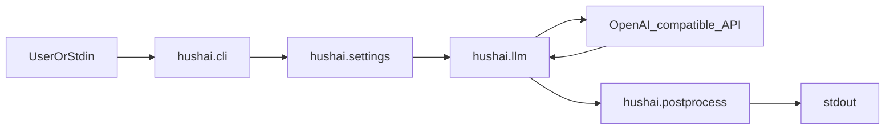

# 架构概览

## 模块职责

| 模块 | 职责 |
|------|------|
| `hushai.cli` | 参数解析、TTY/管道判断、REPL、错误输出（含 `--json-errors`） |
| `hushai.settings` | 解析配置文件路径、合并环境变量与 JSON、提供超时/重试等 |
| `hushai.llm` | 构造 OpenAI 兼容客户端、调用 Chat Completions；`build_system_prompt()` 按 `get_mode()` 拼接 `calm`/`focus`/`hype`/`plain` 后缀，**`pua` 为独立演练提示**；将 SDK 异常转为中文 `RuntimeError` |
| `hushai.postprocess` | `to_one_sentence()`：将模型原始文本截成客户端层面的一句话 |

版本号来自 `hushai.__version__`，与 `pyproject.toml` 中动态版本一致。

## 系统提示与模式

- **`build_system_prompt()`**（`hushai.llm`）根据 `get_mode()` 决定系统消息内容。
- **`calm` / `focus` / `hype`**：字符串拼接为 `SYSTEM_PROMPT_BASE`（哲理老人基座）+ 对应 `MODE_SUFFIXES[mode]`。
- **`plain`**：仅 `SYSTEM_PROMPT_BASE`，无后缀。
- **`pua`**：返回独立常量 **`PUA_DRILL_SYSTEM`**，**不**拼接哲理老人基座，以便与教育向「施压方一句台词」演练一致（约束见源码与 [配置说明](configuration.md)）。

用户消息与系统消息一并送入 Chat Completions；返回文本再经 `to_one_sentence()` 截成客户端层面的一句话。

## 请求流程

1. `configure()` 在 `main()` 开头执行一次，载入 JSON（若有）；若传入 `--mode` / `--no-calm`，会先设置 `HUSH_MODE`。
2. `chat_once()` 从 `settings` 读取密钥、URL、模型、超时、重试及 **对话模式**（`get_mode()`），再调用 `openai.OpenAI`；系统提示由 `build_system_prompt()` 生成（见上节「系统提示与模式」）。
3. 返回的文本交给 `to_one_sentence()`，再 `print` 到 stdout。

## 错误处理

- **业务/配置**：`RuntimeError`，消息为中文（含未配置密钥、配置文件问题、以及经 `format_openai_error` 映射的 API 错误）。
- **未预料异常**：CLI 捕获后以 `请求失败: ...` 形式输出（或 JSON 模式下的 `error` 字段）。

## 测试策略

单元测试对 **网络层** 使用 `unittest.mock` 模拟 `OpenAI` 与异常类型；对配置使用临时目录下的 JSON 文件；对 CLI 使用伪造 stdin（TTY / 管道）与 patch `chat_once`。
